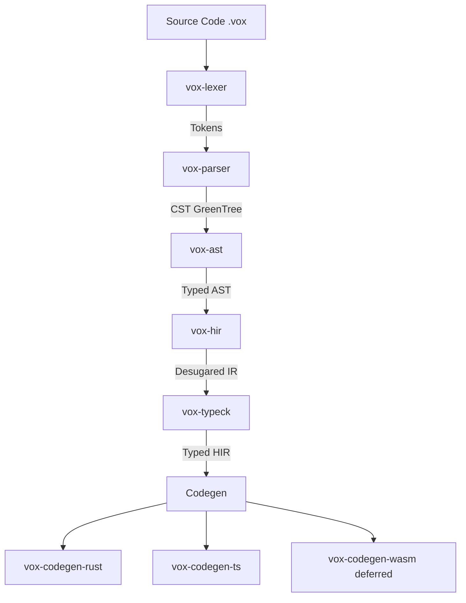

# Vox Architecture & Agent Guide

> [!IMPORTANT]
> This document serves as the **Single Source of Truth** for the Vox programming language architecture, roadmap, and development patterns. All future development, whether by human or AI agents, must align with the principles and structures defined here.

## 1. Core Philosophy

**Vox** is an AI-native, full-stack programming language designed to bridge the gap between high-level intent and low-level performance.

### Key Tenets
1.  **Uniformity**: One language for the entire stack (Frontend + Backend + Infrastructure).
2.  **Durability**: Execution should survive failures. Workflows and Actors are first-class primitives.
3.  **Distribution**: The runtime is inherently distributed. Location transparency is the default.
4.  **AI-Native**: The syntax and semantics are designed to be easily generated and reasoned about by LLMs.
5.  **Performance**: Compiles to native code (Rust) and optimized WASM/JS, not an interpreted runtime.
6.  **ZERO Null States**: The presence of `null` severely breaks AI generative capabilities, leads to fatal NPE logic flaws, and produces ambiguous reasoning gaps. All states must strictly utilize `Option[T]` (lowering to TS `undefined`), `Result`, strict structurally-typed Discriminated Unions, or definitive error types. `null` is permanently banned from generation logic and the Vox ecosystem payload lifecycle.

## 2. Architecture

The Vox compiler follows a modern, modular pipeline architecture.

### 2.1 Compiler Pipeline (`crates/`)



-   **Lexer (`vox-lexer`)**: Uses `logos` for high-performance tokenization.
-   **Parser (`vox-parser`)**: A recursive descent parser that produces a Rowan-based GreenTree (lossless syntax tree). resilient to errors for LSP support.
-   **AST (`vox-ast`)**: Strongly typed wrappers around the untyped CST.
-   **HIR (`vox-hir`)**: High-Level Intermediate Representation. Desugars syntax sugar and performs name resolution.
-   **TypeCheck (`vox-typeck`)**: Bidirectional type checking with unification-based inference. Handles generic ADTs and effect systems.
-   **CodeGen**:
    -   `vox-codegen-rust`: Emits Rust code using `quote!`.
    -   `vox-codegen-ts`: Emits TypeScript definitions and runtime code.
-   **Full-stack web UI** — Vox vs generated TS/React, islands, v0.dev, and TanStack spine: [`docs/src/architecture/vox-web-stack-ssot.md`](docs/src/architecture/vox-web-stack-ssot.md), [roadmap](docs/src/architecture/tanstack-web-roadmap.md), [ADR 010](docs/src/adr/010-tanstack-web-spine.md).

### 2.2 Runtime (`crates/vox-runtime`)

The runtime is built on top of **Tokio** and **Axum**.

-   **Actor System**: Every `@component` and `actor` is an isolated entity with a mailbox.
-   **Workflows**: Durable execution state machines (future).
-   **Networking**: Automatic serialization/deserialization via Serde/Bincode over HTTP/WebSocket.

### 2.2.1 Data plane — Codex / Arca / Turso

-   **Codex** — Public name for the unified persisted data API. In Rust, prefer `vox_db::VoxDb` in type signatures; `vox_db::Codex` is the same type.
-   **Arca** — Internal schema and `CodeStore` (`vox-pm`) on **Turso** only. `VoxDb::store()` returns `&CodeStore` (naming mirrors the type; the CAS write API is `CodeStore::store`).
-   **Migrations** — Built-in SQL uses `execute_batch` (no row-returning statements). Pragmas use `pragma_update`; empty migration bodies still advance `schema_version` (V7 no-op). App migrations via `VoxDb::apply_migrations` must follow the same rules.
-   **Config** — Canonical env: `VOX_DB_URL`, `VOX_DB_TOKEN`, `VOX_DB_PATH`. See ADR 004: `docs/src/adr/004-codex-arca-turso-ssot.md`.
-   **Optional** — `vox-runtime` exposes `crate::db` when built with the `database` feature.

### 2.2.1.1 Socrates (anti-hallucination SSOT)

-   **Policy** — Shared numeric thresholds live in `crates/vox-socrates-policy` (`ConfidencePolicy`); TOESTUB review prompts/filters, MCP chat/plan/inline tools, and orchestrator gates must not drift literals.
-   **Orchestrator** — `AgentTask.socrates` + `evaluate_socrates_gate`; optional `socrates_gate_shadow` / `socrates_gate_enforce` in `OrchestratorConfig` (env: `VOX_ORCHESTRATOR_SOCRATES_*`). Arca schema fragment **`v10`** (`agent_reliability`) + `socrates_reputation_routing` blend scores in `RoutingService::route` when a `CodeStore` is attached.
-   **Docs** — `docs/src/architecture/socrates-protocol-ssot.md`, ADR 005.

### 2.2.2 Repository context (internal + external repos)

-   **`vox-repository`** — Discovers the logical repo root (Git work tree or fallback), computes a stable `repository_id` (blake3 over `origin` + canonical path), probes stack markers (`Vox.toml`, Cargo, Node, Python, Go), exposes `has_vox_agents_dir` / `vox_toml`, workspace layout (`cargo_workspace_member_dirs`, `node_workspace_packages`, `python_roots`, `go_roots`), and agent scope parsing (`load_agent_scopes`, `normalize_task_path`).
-   **Orchestrator** — Optional `Vox.toml` `affinity_groups` overrides layout detection; otherwise `AffinityGroupRegistry::detect_from_repository_layout` builds groups from Cargo workspace members, then Node packages (`package.json` `workspaces` globs + `pnpm-workspace.yaml`), then Python/Go roots, then `crates/`, else `**/*`.
-   **MCP / sessions / memory** — `ServerState` carries `repository` for git/Cargo cwd and task scopes; `SessionConfig` sets `sessions_dir` to `.sessions/<repository_id>/` and `repository_id` for Codex `agent_sessions.task_snapshot` JSON; orchestrator memory under `repo/.vox/cache/repos/<repository_id>/memory/`. Gamify `agent_events` include `repository_id`. MCP `vox_repo_index_*` walk the repo root (bounded) and cache under `.vox/cache/repos/<repository_id>/`.
-   **Unified orchestration** — `vox_orchestrator::contract` (task capability hints, MCP ↔ DeI plan tool alignment, migration flags) and orchestrator config env `VOX_ORCHESTRATOR_V2_ENABLED`, `VOX_ORCHESTRATOR_LEGACY_FALLBACK`, `VOX_ORCHESTRATOR_SOCRATES_REPUTATION_WEIGHT`. CLI **`vox scientia`** is a thin facade over the same `vox db` research handlers (same `repository_id` / DB resolution). SSOT: [`docs/src/architecture/orchestration-unified-ssot.md`](docs/src/architecture/orchestration-unified-ssot.md).
-   **Config** — `VoxConfig::load_from_repo_root` reads `Vox.toml` from a discovered root before CWD. See `docs/src/architecture/external-repositories-ssot.md`.

### 2.2.3 Populi / native training (SSOT)

-   **Doc index** — [`docs/src/architecture/populi-training-ssot.md`](docs/src/architecture/populi-training-ssot.md). **Mobile / edge** (train off-device, inference profiles, mesh GPU/NPU advertisement): [`docs/src/architecture/mobile-edge-ai-ssot.md`](docs/src/architecture/mobile-edge-ai-ssot.md).
-   **Agent/human PR checklist** — [`docs/src/architecture/populi-llm-pr-checklist.md`](docs/src/architecture/populi-llm-pr-checklist.md) (LoRA ownership, layouts, merge, parity tests).
-   **Code layout** — `PopuliTrainBackend` enum (`tensor/train_backend.rs`); shared `LoraTrainingConfig` + `PopuliTokenizerMode` (`tensor/training_config.rs`); `TrainingBackend` trait (`tensor/backend.rs`); Burn `tensor/backend_burn_lora.rs`; Candle `tensor/backend_candle_qlora.rs` + `tensor/candle_qlora_train.rs` + `tensor/qlora_preflight.rs` (compiled with **`vox-populi` `train`**, which enables **`candle-qlora`** + **`qlora-rs`**; **`vox-cli` `--features gpu`** turns on **`vox-populi/train`** — not in default `vox-cli` features); `run_populi_training` in `tensor/lora_train.rs`.
-   **Canonical CLI** — **`vox populi train`**: **`--backend lora`** (default) → Burn + wgpu **f32 LoRA** (full causal stack); **`--tokenizer vox`** or **`--tokenizer hf`** for GPT-2-shaped HF + optional warm-start (`burn_hf_load.rs`). **`--backend qlora`** → Candle + **qlora-rs**: **NF4** frozen projection/LM-head linears + trainable LoRA, **mmap f32** context embeddings (`wte` / `model.embed_tokens`); sequential proxy stack when shard keys permit, else LM-head-only (`candle_qlora_train.rs`, `qlora_preflight.rs`). **`--device`** selects **CUDA** / **Metal** / **CPU**; enable **`vox-populi/candle-qlora-cuda`** / **`candle-qlora-metal`** (CLI **`populi-candle-cuda`** / **`populi-candle-metal`**) for GPU; else CPU. Habitual NVIDIA release build: **`cargo vox-cuda-release`** (`.cargo/config.toml` alias). **`VOX_CANDLE_DEVICE=cpu`** forces CPU. QLoRA path requires **`--tokenizer hf`**, **`--model`**, `tokenizer.json`, and HF safetensors. **`train` always pulls `candle-qlora`** (CPU-capable baseline). See **`docs/src/architecture/populi-training-ssot.md`**.
-   **Wired config** — `grad_accum` (micro-steps per optimizer step), `seed` (shuffles JSONL row order each epoch), `context_filter` (substring on `category`), `adapter_tag` (checkpoint filename suffix), `max_vram_fraction` (warn vs probe), `device_kind` via `apply_backend_env` + `WgpuDevice`. `batch_size` > 1 is still a single-sequence forward (profile “effective batch” is informational).
-   **Train input resolution** — `vox_corpus::training::preflight`: `populi/config/training_contract.yaml` `train_path` overrides a stale `data_dir/train.jsonl` when present.
-   **QLoRA** — **Canonical:** **`vox populi train --backend qlora`** (Candle + qlora-rs; see `populi-training-ssot.md`). **`vox train`** (with `populi-dei`): **`--provider local`** bails with the exact `vox populi train` command (no shipped `train_qlora.vox`); Together remote and **`--native`** Burn scratch remain. **`vox populi train-uv`** is **retired** (bails). Use the minimal `Cli` in `crates/vox-cli/src/lib.rs` for the shipped surface.

### 2.3 Directory Structure

| Path | Description |
| :--- | :--- |
| `crates/vox-cli` | The **`vox`** binary (minimal compiler CLI); see `docs/src/ref-cli.md` and `docs/src/architecture/cli-scope-policy.md`. |
| `crates/vox-lsp` | Language Server Protocol implementation. |
| `crates/vox-repository` | Repository discovery, stable `repository_id`, stack probes, workspace layout for orchestrator/MCP. |
| `crates/vox-git` | Pure-Rust Git bridge (`gix`); workspace member; no `vox-crypto` dependency. |
| `crates/vox-db` | **Codex** facade over Turso (`VoxDb` / `Codex` type alias); prefer over `vox-codex` for new code. |
| `crates/vox-pm` | **Arca** internal schema + `CodeStore` (Turso). |
| `crates/vox-socrates-policy` | Shared Socrates confidence / risk thresholds (SSOT). |
| `crates/vox-orchestrator` | Affinity groups, agent routing, session layout. Used by **`vox-mcp`**, **`vox live`** (`vox-cli` feature **`live`**), and integration tests — not by workspace-excluded DeI sources. |
| **DeI daemon (`vox-dei-d`)** | Advanced agent/generate/plan/review flows in the slim **`vox`** CLI call the external **`vox-dei-d`** binary via [`crates/vox-cli/src/dei_daemon.rs`](crates/vox-cli/src/dei_daemon.rs) (RPC method id SSOT) and [`crates/vox-cli/src/dispatch.rs`](crates/vox-cli/src/dispatch.rs). The directory **`crates/vox-dei`** is listed under **`[workspace.exclude]`** in the root `Cargo.toml` and must not be imported from `vox-cli` sources. A minimal manifest under **`crates/vox-dei/`** compiles a **Socrates policy shim** only (`cargo check --manifest-path crates/vox-dei/Cargo.toml`); full DeI wiring is separate. |
| `crates/vox-mcp` | MCP server and tools. |
| `crates/vox-mesh` | CPU-first mesh registry + optional HTTP control plane (`transport` feature); used by **`vox-cli`** feature **`mesh`** and **`vox-mcp`** tool `vox_mesh_local_status`. |
| `crates/vox-workflow-runtime` | Interpreted workflow MVP (local + `mesh_*` activity hooks); used by **`vox-cli`** feature **`workflow-runtime`**. |
| `crates/vox-capability-registry`, `crates/vox-tools` | Populi chat: capability registry ∩ `DirectToolExecutor`; OpenAI-style defs + execution in `vox_tools::populi_chat`; Oratio MCP names. |
| `crates/vox-runtime` | Axum/Tokio runtime; optional `database` feature. |
| `crates/vox-oratio` | Speech-to-text / transcripts (**Oratio**); **Candle Whisper** (pure Rust). No whisper.cpp / clang. SSOT: **`docs/src/architecture/oratio-speech-ssot.md`**. CLI: `vox populi oratio` (build **`vox-cli`** with feature **`populi-oratio`** — not in default **`populi-base`**). MCP: `vox_oratio_*`. HTTP: **`vox-codex-dashboard`**. Builtin **`Speech.transcribe`**. LSP hovers for `Speech` / `transcribe`. Mix: `asr_refine`. |
| `examples/` | Reference implementations; golden set + `STYLE.md` / `PARSE_STATUS.md`; how-to [`docs/src/how-to/examples-corpus.md`](docs/src/how-to/examples-corpus.md). |

**Full workspace crate index** (every `crates/*/Cargo.toml` name) lives in `docs/src/architecture/orphan-surface-inventory.md` and is enforced by **`vox ci check-docs-ssot`** (see `docs/src/ci/runner-contract.md`). There is no `crates/vox-std` crate yet; treat “stdlib” work as future crates under `crates/` until one is added.

## 3. Roadmap

### Phase 1: Foundation (Completed)
- [x] Basic Lexer/Parser with error recovery.
- [x] Initial CLI (`vox build`, `vox bundle`).
- [x] Rust Backend generation (Axum).
- [x] TypeScript Frontend generation (React/Fetch).

### Phase 2: Core Language Features (In Progress)
- [x] **ADTs & Pattern Matching**: `type Option[T] = Some(T) | None`
- [x] **Type Inference**: Local variable inference.
- [ ] **Traits/Interfaces**: Ad-hoc polymorphism.
- [ ] **Generics**: Full support in functions and structs.

### Phase 3: Ecosystem & Tooling (Current Focus)
- [x] **LSP**: Syntax highlighting, diagnostics using `tower-lsp`.
- [ ] **Formatter (minimal CLI)**: `vox fmt` **fails fast** with a doc pointer until `vox-fmt` matches the current AST; see `docs/src/ref-cli.md`.
- [ ] **Package Manager (minimal CLI)**: `vox install` **fails fast** until registry flows are wired in `vox-pm`; see `docs/src/ref-cli.md`.

### TanStack web stack (verification ladder)
1. **String-level (always on in CI):** `cargo test -p vox-integration-tests --test pipeline` (codegen + scaffold expectations) and `cargo test -p vox-cli --test scaffold_tanstack_start_layout`.
2. **Vite production build (optional CI job):** `.github/workflows/ci.yml` job **`web-vite-build-smoke`** (GitHub-hosted Node exception), or locally `VOX_WEB_VITE_SMOKE=1 cargo test -p vox-integration-tests --test web_vite_smoke -- --ignored`.
3. **Browser:** manual **`vox run`** / Playwright when exercising full UX.

### Phase 4: Advanced Features (Future)
- [ ] **WASM Target**: Compile Vox actors directly to WASM modules.
- [ ] **Durable Objects**: Database-backed actor state.
- [ ] **v0.dev Integration**: AI-generated UI components directly from Vox signatures.

## 4. Development Guide

### Rustdoc (`missing_docs`)

- **Library crates** (`src/lib.rs` and `src/**/*.rs`): do **not** use crate-level `#![allow(missing_docs)]`. Every `pub` item that is part of the crate API must have a `///` or `//!` doc comment (variants, fields, and `pub mod` lines count).
- **Tests only**: integration test crates (`crates/<crate>/tests/*.rs`) and `#[cfg(test)]` modules may use `#![allow(missing_docs)]` on the **test crate root** or test module when the test harness has no user-facing API.
- Workspace `Cargo.toml` does **not** set `missing_docs` globally (would fail `clippy -D warnings` across the tree). Iterate with `cargo rustc -p <crate> -- --deny=missing-docs` (or `warn`) per crate until debt is burned down, then consider promoting to `[workspace.lints.rust]`.
- **Quality above compliance**: rubric, LLM batching playbook, verification steps, and a machine-readable comment/doc inventory are in `docs/agents/` ([`documentation-rubric.md`](docs/agents/documentation-rubric.md), [`llm-documentation-playbook.md`](docs/agents/llm-documentation-playbook.md), [`doc-quality-verification.md`](docs/agents/doc-quality-verification.md)). Regenerate the inventory with **`vox ci doc-inventory generate`** when `vox` is on `PATH`, or `cargo run -p vox-cli -- ci doc-inventory generate` from the repo root.

### Doc frontmatter dates (`last_updated`)

- **Source of “today”**: Use the **real calendar date** for the session. In Cursor, read **Today's date** from `<user_info>` (or an explicit user message). **Never** set `last_updated` to a **future** day relative to that stamp (a common mistake is advancing the date by one).
- **When editing**: Bump `last_updated` only when the page content meaningfully changes; trivial typo fixes may leave the prior date.
- **Format**: ISO `YYYY-MM-DD` in `docs/src/**/*.md` YAML frontmatter where `last_updated` is used.

### Cross-platform source integrity

- **Line endings:** LF for tracked source, docs, and config (root **`.gitattributes`**, **`.editorconfig`**). **`*.ps1`** uses CRLF (Windows-friendly).
- **Before commit / in CI:** **`vox ci line-endings`** (forward-only diff; use **`--all`** for a full-tree audit). Env: **`GITHUB_BASE_SHA`** / **`GITHUB_SHA`**, or **`VOX_LINE_ENDINGS_BASE`** (+ optional **`VOX_LINE_ENDINGS_HEAD`**). See **`docs/src/ci/runner-contract.md`** (Line endings).
- **TOESTUB:** rule **`cross-platform/line-endings`** (warning) — see **`docs/agents/governance.md`**.
- **Cursor memories (paste into Cursor Memory):** (1) Vox repo: LF line endings by default, `*.ps1` CRLF. (2) Run `vox ci line-endings` on touched files before pushing. (3) Avoid hard-coded `/` vs `\\`; use `Path` / `std::path` and repo-root-relative resolution.

### Building

Workspace **`edition = "2024"`** (root `Cargo.toml` `[workspace.package]`). Use a toolchain **≥ `rust-version`** in that same table (2024 edition needs recent stable; CI pins stable via `dtolnay/rust-toolchain`).

```bash
cargo build --workspace
```

**Populi Candle QLoRA on NVIDIA (release binary):** from the repo root, **`cargo vox-cuda-release`** (Cargo alias in `.cargo/config.toml` → `gpu` + `populi-candle-cuda`). Plain `cargo build -p vox-cli --release` does **not** link CUDA kernels. On Windows use a Visual Studio **Developer** shell so `nvcc` finds MSVC. See **`docs/src/how-to-train-populi-4080.md`**.

### Testing
Run the full test suite, including integration tests:
```bash
cargo test --workspace
```

### Adding a Language Feature
1.  **Grammar**: Update `crates/vox-parser/src/grammar.rs`.
2.  **AST**: Add node wrappers in `crates/vox-ast`.
3.  **Lowering**: Map AST to HIR in `crates/vox-hir`.
4.  **Type Checking**: Add inference rules in `crates/vox-typeck`.
5.  **Codegen**: Implement emission in `vox-codegen-rust` and `vox-codegen-ts`.

## 5. Contribution Guidelines

-   **Tests**: Every new feature must include a UI test in `tests/` or a unit test.
-   **Errors**: Use `miette` for user-facing errors.
-   **Style**: Follow standard Rust formatting (`cargo fmt`).
-   **Root `Cargo.toml`**: Maintain **fix forward** (not `git restore`). Every `{ workspace = true }` dependency must exist in `[workspace.dependencies]`. See `docs/src/ci/workspace-root-manifest.md` and `scripts/verify_workspace_manifest.sh`.

---
*Generated: 2026-02-17*
