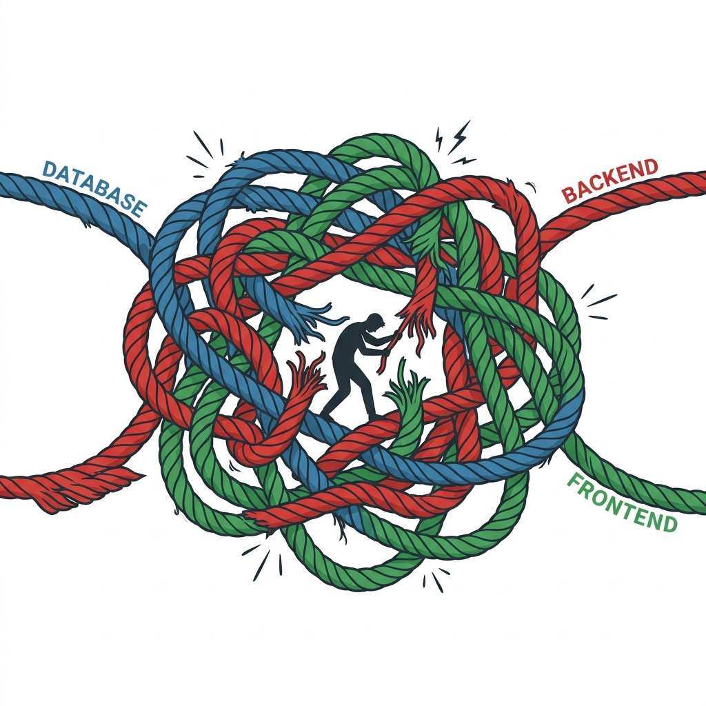

<div align="center">
  

  <br><br>

  <p><strong>Write one <code>.vox</code> file. Automatically generate your database, server, user interface, and deployment configuration.</strong> Initiated by Bertrand Reyna-Brainerd.</p>

  <p><a href="https://vox-lang.org"><strong>vox-lang.org</strong></a></p>
</div>

<p align="center">
  <a href="https://vox-lang.org"></a>
  <a href="https://github.com/vox-foundation/vox/commits/main"></a>
  <a href="LICENSE"></a>
  <a href="https://vox-lang.org/feed.xml"></a>
</p>

---

<!-- Code examples in this file mirror examples/golden/*.vox -->
<!-- Run: vox check examples/golden/*.vox to verify -->

<div align="center">
  <blockquote>
    <p><em>"Is it a fact — or have I dreamt it — that, by means of electricity, the world of matter has become a great nerve, vibrating thousands of miles in a breathless point of time? Rather, the round globe is a vast head, a brain, instinct with intelligence!"</em></p>
    <p>— Nathaniel Hawthorne, <em>The House of the Seven Gables</em> (1851)</p>
  </blockquote>
</div>

---

<!-- ANCHOR: why_vox -->
## Why Vox?

Most programming languages were designed decades before AI existed. They require you to write the same logic in three different places—your database, your server, and your frontend—and they allow for hidden errors (like missing values or unexpected crashes). This is manageable for a human, but it creates a minefield for AI code generators like ChatGPT or Claude. When an AI gets confused by this complexity, it handles it poorly, causing bugs that are incredibly hard to track down.

<div align="center">
  
</div>

Vox was built from the ground up to be written by AI. It eliminates duplication and forces all rules to be explicit. If an AI writes invalid code, Vox physically rejects it before it can ever run. Instead of hoping the AI gives you a "good vibe" completion, Vox acts as a strict guardrail, ensuring that whatever the AI builds is structurally sound and guaranteed to work.
<!-- ANCHOR_END: why_vox -->

## Install

Download the unified Tauri installer for your operating system from the [Releases page](https://github.com/vox-foundation/vox/releases):
- **Windows:** `.msi`
- **macOS:** `.dmg`
- **Linux:** `.AppImage` or `.deb`

Upon launching the Vox Desktop app, it will automatically download and install the required system toolchains (Rust for [WASM](https://en.wikipedia.org/wiki/WebAssembly) — high-performance binary code for browsers — and machine learning, and Node.js v22+ for React / TypeScript bundling) to guarantee your environment perfectly matches the workspace requirements. No manual terminal setup is required.

Once installed, you can initialize your first project via the CLI bundled with the GUI:

```bash
vox init my-app
cd my-app
vox run src/main.vox
```

## The CLI

The full CLI surface, including every `vox ci`, `vox populi`, and `vox mens` subcommand, lives at [`docs/src/reference/cli.md`](docs/src/reference/cli.md). Run `vox commands --recommended` for first-time discovery.

---

<div align="center">
  
</div>

<!-- ANCHOR: how_vox -->
## How Vox works

### Pillar 1: The Single Source of Truth

```vox
@table type Task {
    title: str
    done:  bool
    owner: str
}
```

In Vox, the code above *is* the [schema](https://en.wikipedia.org/wiki/Database_schema), the [wire format](https://en.wikipedia.org/wiki/Wire_format), and the typed client. When you change this type, Vox generates the [Migrations](https://en.wikipedia.org/wiki/Schema_migration) automatically by comparing your new code against the previous version.

→ [`@table` reference](docs/src/reference/ref-decorators.md) · [Database guide](docs/src/how-to/how-to-database.md)

### Pillar 2: Safety First

```vox
@endpoint(kind: query)
fn recent_tasks() to list[Task] {
    return db.Task.where({ done: false }).limit(10)
}

@endpoint(kind: mutation)
fn add_task(title: str, owner: str) to Result[Id[Task]] {
    if title == "" { return Error("title required") }
    return Ok(db.insert(Task, { title: title, done: false, owner: owner }))
}
```

Vox uses a [`Result[T]`](crates/vox-core/src/result.rs) type to handle errors. This means you are *forced* to handle both success and failure cases. There are no "exceptions" that crash your app at runtime, and no `null` values to track down. If you forget to handle an error, the compiler simply won't build your app.

→ [API Decorators](docs/src/reference/ref-decorators.md) · [Error handling guide](docs/src/how-to/how-to-errors.md)

### Pillar 3: Full-Stack Generation

```vox
component TaskPage(tasks: List[Task]) {
    view: column() {
        tasks.map(fn(t) { row() { text() { t.title } } })
    }
}

routes { "/" to TaskPage }
```

Running `vox build` takes your logic and emits everything you need:
- **Frontend:** [React](https://en.wikipedia.org/wiki/React_(software)) components and a generated bridge for your API.
- **Backend:** A high-performance [RPC bridge](https://en.wikipedia.org/wiki/Remote_procedure_call) (server calls).
- **Infrastructure:** Dockerfiles, Kubernetes manifests, and cloud-native deployment targets (Fly.io, systemd).

→ [Frontend interop](docs/src/architecture/external-frontend-interop-plan-2026.md) · [Deployment guide](docs/src/reference/deployment-compose.md)

### Pillar 4: AI-Native Durability

```vox
@durable
fn charge_card(amount: int) to Result[str] {
    if amount > 1000 { return Error("amount too large") }
    return Ok("tx_123")
}

@mcp.tool "Process a durable checkout"
fn checkout(amount: int) to Result[str] {
    return charge_card(amount)
}
```

The `@durable` decorator turns any function into a [checkpointed](https://en.wikipedia.org/wiki/Application_checkpointing) workflow. This means if your server crashes or the network drops mid-function, Vox automatically recovers and resumes exactly where it left off. Meanwhile, the `@mcp.tool` decorator makes these functions instantly available to AI assistants using the [Model Context Protocol (MCP)](https://en.wikipedia.org/wiki/Model_Context_Protocol).

→ [Orchestration research](docs/src/architecture/autonomous-orchestration-policy-research-2026.md) · [`vox-skills`](crates/vox-skills/)

<div align="center">
  
</div>

The same primitives drive multi-agent work via [`vox-orchestrator`](crates/vox-orchestrator/), which routes tasks by file affinity across ten policy modules (tier cascade, budget gate, circuit breaker (stops calls to failing systems), …).

- **AgentOS.** An execution [sandbox](https://en.wikipedia.org/wiki/Sandbox_(computer_security)) (isolated safety zone) that enforces strict data-mutation rules (`read_only`, `local_mutation`, `external_side_effect`) and safety guardrails to prevent AI-driven side effects (changes to files or network) damaging your system.
- **Deep Research (SCIENTIA).** Driven by `vox-search`, this uses [Corrective RAG (CRAG)](https://arxiv.org/abs/2401.15884)<sup>[4](#ref4)</sup>—a technique for iterative query expansion and fact-checking—mirroring proprietary deep-research agents entirely locally.
- **Confidence Fusion (Socrates).** A validation layer that cross-checks AI model outputs across multiple providers, pausing to request [human-in-the-loop (HITL)](https://en.wikipedia.org/wiki/Human-in-the-loop) review when certainty drops below a safe threshold.


→ [orchestration policy research](docs/src/architecture/autonomous-orchestration-policy-research-2026.md) · [`vox-skills`](crates/vox-skills/)

The four pillars above are designed for one goal: **Reliable AI Code Generation.** We solve the "AI hallucination" problem by giving the AI a strict, machine-verified environment:

- **Grammar-constrained decoding.** Vox ensures the AI *cannot* physically output invalid syntax, stopping errors before they reach your files.
- **Test-First Enforcement (TOESTUB).** We enforce a strict "Failing Test First" policy. No code can be committed without an adjacent test that defines exactly what "done" looks like.
- **Measurable Detectors.** The `vox audit` command evaluates code for quality, catching "AI Laziness" (stubs) and security risks automatically.
- **Local Training (MENS).** Verified code becomes training data for our local model, creating a self-improving loop where the AI learns from its own successes.

→ [Why Vox for AI](docs/src/explanation/why-vox-for-ai.md) · [TOESTUB Guide](docs/src/contributors/toestub-contributor-guide.md)

---

### Engineering invariants

Properties enforced on the project itself, invisible from the language surface:

- **Layered crate graph.** All 112 workspace crates (Rust libraries) declare a layer (L0 pure types → L5 surfaces) in [`layers.toml`](docs/src/architecture/layers.toml). [`vox-arch-check`](crates/vox-arch-check/) blocks [inversions](https://en.wikipedia.org/wiki/Dependency_inversion_principle), fan-in (how many things depend on a module), [LoC](https://en.wikipedia.org/wiki/Source_lines_of_code) budget overruns, and orphaned modules.
- **Sandboxed execution.** Tools run in isolated environments using WebAssembly (Wasmtime) or Docker (OCI). Read access is size-capped (`vox-bounded-fs`), and CLI commands are scanned for risks (detecting command injection via `vox-exec-grammar`).
- **Declared capabilities.** Agents must declare what they intend to do via the `vox-capability-registry`. All secure keys and tokens are retrieved exclusively through **Clavis** (`vox-secrets`), our encrypted secrets vault.
- **SCIENTIA research integrity.** A built-in framework that extracts verifiable claims from AI research, formats them as standard "nanopublications" (machine-readable single-fact snippets), and enforces pre-registration to ensure AI-generated research outputs are factually grounded and not hallucinated.
<!-- ANCHOR_END: how_vox -->

---

## Workflow & Diagnostics

```bash
vox research run "query"               # deep research + fact-checking (SCIENTIA)
vox plan create "task"                 # generate [agentic](https://en.wikipedia.org/wiki/Autonomous_agent) (autonomous goal-seeking) multi-step execution plan
vox secrets set [ID]                   # securely store API keys in the Clavis vault
vox mens train [dataset]               # train/fine-tune (adjusting model for specific tasks) local AI models
vox share                              # create a public URL tunnel for local apps
vox doctor                             # check toolchain and workspace integrity
vox audit                              # scan code for stubs and AI-native rule violations
vox pm search [query]                  # search the Vox package manager registry
vox ci pre-push                        # run the machine-verified code audit suite
```

```bash
vox run scripts/clean-cache.vox
vox run --isolation wasm scripts/process-untrusted-data.vox
```

Other commands worth knowing:

- `vox ci pre-push` — Run the full machine-verification suite (layer checks, secret guards, multi-language drift checks).
- `vox pm search [query]` — Search the first-party and community Vox package registry.
- `vox deploy --target fly` — Generate and execute a deployment plan for cloud providers like Fly.io.
- `vox login` — Authenticate with the Vox cloud and initialize your local secrets session.
- `vox telemetry doctor` — Diagnose the health of agent event tracking and metrics.

---

## Extensibility & Plugins

Vox is highly modular. The core binary (`vox`) handles compiling, running, and deploying code. Advanced capabilities are provided through optional **CLI Extensions** and **Runtime Plugins**.

### CLI Extensions
Heavier subsystems ship as separate binaries that the core `vox` command dispatches to. If you try to run a command you don't have, Vox will tell you what to install.

| Extension | Subcommands | Purpose |
|---|---|---|
| `vox-ml-cli` | `vox mens`, `vox populi` | Rust-native ML frameworks (Candle, [Whisper](https://en.wikipedia.org/wiki/Whisper_(speech_recognition_system))) for training and serving AI models locally without Python. |
| `vox-schola` | `vox schola`, `vox scientia` | Autonomous AI research, fact-checking, and capability-map subsystems. |

### Runtime Plugins (Agent Skills)
The Vox AgentOS and orchestration engine dynamically load capabilities through a stable ABI (the binary interface between program modules) using `vox-plugin-host`. There are currently 26 first-party plugins that grant your agents access to the outside world:

- **Core Infrastructure**: `api`, `catalog`, `cloud`, `host`, `types`, `webhook`
- **Execution Sandboxes**: `runtime-container` (Docker), `runtime-wasm`, `script-execution`
- **Machine Learning & Audio**: `mens-candle-cuda` (NVIDIA hardware acceleration), `nvml-probe`, `oratio`, `oratio-mic`, `populi-mesh`
- **Agent Skills**: `skill-compiler`, `skill-git`, `skill-memory`, `skill-orchestrator`, `skill-rag`, `skill-testing`, `skill-testing-validate`, `skill-v0`, `browser`, `noop-skill`
- **Publishing**: `publication`, `grammar-export`

*→ See the [Plugin Catalog](docs/src/reference/plugin-catalog.generated.md) for detailed tool signatures.*

---

## Mesh and provider routing

Cross-machine work is opt-in. Nodes advertise CPU/CUDA/Metal/VRAM on startup and the orchestrator routes training and inference jobs to whichever machines can take them. Agent-to-agent messages are in-process (shared memory communication) by default; the `populi-transport` feature enables relay. Both ends declare the same Vox type, so wire mismatches fail at compile time.

```bash
VOX_MESH_ENABLED=1 VOX_MESH_NODE_ID=my-node vox populi serve
vox populi status --quotas
```

Local models (Ollama) and the major cloud providers go through one policy layer with per-provider quotas and disclosure rules. See the [model routing how-to](docs/src/how-to/how-to-model-routing.md).

---

## Stability

<!-- ANCHOR: tier_table -->
Workspace `0.5.0` — pre-1.0. Surfaces are graded by how reproducibly an [LLM](https://en.wikipedia.org/wiki/Large_language_model) can target them: data and tool [contracts](https://en.wikipedia.org/wiki/Design_by_contract) lock first, rendering surfaces last.

🟢 Stable · 🟡 Preview · 🚧 Experimental

| Surface | Tier | Notes |
|:---|:---|:---|
| Compiler engine | 🟢 | AST (logic tree), [HIR](crates/vox-compiler/src/hir/) (high-level IR), type checker, LSP, codegen (auto-writing code). |
| `@table` & data layer | 🟢 | Schema, migrations, `db.*` query builder, wire types. |
| `@mcp.tool` / `@mcp.resource` | 🟢 | MCP protocol compliance. |
| Surface syntax | 🟡 | Top-level forms (`@endpoint(kind: …)`, `@durable`, bare `workflow`/`activity`/`actor`) defined in [`AGENTS.md`](AGENTS.md). |
| Endpoints | 🟡 | Unified `@endpoint` is recent. |
| Code-audit rule pack | 🟡 | See Pillar 5. |
| RAG & knowledge curation | 🟡 | `vox scientia`, Socrates confidence fusion. |
| Durable execution | 🟡 | Grammar locked; runtime behavior maturing. |
| Local training (MENS) | 🟡 | QLoRA parity; hardware coverage expanding. |
| Web UI & rendering | 🟡 | Vox-native reactivity (automatic UI updates) + React interop. |
| Distributed node mesh | 🚧 | Cross-machine job routing via [mesh networking](https://en.wikipedia.org/wiki/Mesh_networking). |

v1.0 criteria: [`docs/src/architecture/v1-release-criteria.md`](docs/src/architecture/v1-release-criteria.md). Roadmap: [GUI-native phases](docs/src/architecture/gui-native-roadmap-status-2026.md). History: [`CHANGELOG.md`](CHANGELOG.md).
<!-- ANCHOR_END: tier_table -->

Phase status: 2–6 done (primitive collapse, grammar unification, compiler/GUI milestones); Phase 7 mostly done (TASK-7.3 bundler swap deferred to Phase 9); Phase 8 corpus migration done, TASK-8.2 awaits an operator MENS run; Phase 9 route-pipeline restoration landed. Retired symbols: [`AGENTS.md` retired-surfaces table](AGENTS.md).

---

## Documentation

Docs follow the [**Diátaxis**](https://diataxis.fr/) framework (Tutorials, How-To, Explanation, Reference).

| Intent | Start here |
|---|---|
| Learning | [Getting Started](docs/src/tutorials/tut-getting-started.md) · [First full-stack app](docs/src/how-to/first-full-stack-app.md) |
| Task recipes | [How-To Guides](docs/src/how-to/) · [AI Agents & MCP](docs/src/how-to/how-to-ai-agents.md) |
| Understanding | [Why Vox for AI](docs/src/explanation/why-vox-for-ai.md) · [Compiler architecture](docs/src/explanation/expl-architecture.md) |
| Reference | [CLI](docs/src/reference/cli.md) · [Decorators](docs/src/reference/ref-decorators.md) |
| Architecture | [Research index](docs/src/architecture/research-index.md) · [Where things live](docs/src/architecture/where-things-live.md) · [Contributor hub](docs/src/contributors/contributor-hub.md) |
| Operations | [Deployment](docs/src/reference/deployment-compose.md) · [CI runner](docs/src/ci/runner-contract.md) |

---

## Contributing

Start at the [Contributor Hub](docs/src/contributors/contributor-hub.md). The [Contribution Loop](docs/src/contributors/contribution-loop.md) explains the write → verify → train cycle. If CI flags a gate failure, the [TOESTUB Guide](docs/src/contributors/toestub-contributor-guide.md) covers the common causes. Undocumented surfaces are tracked in [`DOC_GAPS.md`](docs/src/api/DOC_GAPS.md).

---

## CI gates beyond the rule pack

The rule pack (Pillar 5) covers detectors. A handful of CI guards live outside it because they enforce repo invariants, not code patterns:

| Guard | Blocks | Run |
|---|---|---|
| `vox arch-check` | layer inversions, fan-in violations, LoC budgets, orphans | always |
| `vox ci secret-env-guard` | raw `std::env::var` for secrets | always |
| `vox ci sync-ignore-files` | `.voxignore` drift to `.cursorignore` / `.aiignore` / `.aiexclude` | always |
| `vox-drift-check` | multi-language workspace drift | pre-push |

Rationale and the full detector inventory live in [`AGENTS.md`](AGENTS.md).

---

<!-- ANCHOR: community_license -->
## Backing, license, contact

Funded via [Open Collective](https://opencollective.com/vox-foundation) — every transaction is public. Sponsorships fund developer grants, MENS training hardware, and academic bounties.

Apache 2.0: commercial use, patent grant, modification with attribution. [`LICENSE`](https://github.com/vox-foundation/vox/blob/main/LICENSE).

Discussion: [GitHub Discussions](https://github.com/vox-foundation/vox/discussions). Changelogs and [ADRs](docs/src/adr/): RSS (<https://vox-lang.org/feed.xml>).
<!-- ANCHOR_END: community_license -->

---

## References

<a id="ref1"></a>**[1]** Fateev, M., & Abbas, S. (2019). *Temporal*. Temporal Technologies. <https://temporal.io>

<a id="ref2"></a>**[2]** Armstrong, J. (2003). *Making reliable distributed systems in the presence of software errors* [Ph.D. thesis, Royal Institute of Technology, Stockholm]. <https://erlang.org/download/armstrong_thesis_2003.pdf>

<a id="ref3"></a>**[3]** Anthropic. (2024). *Model Context Protocol*. <https://modelcontextprotocol.io>

<a id="ref4"></a>**[4]** Yan, S. Q., Gu, J. C., Zhu, Y., & Ling, Z. H. (2024). *Corrective Retrieval Augmented Generation*. arXiv:2401.15884. <https://arxiv.org/abs/2401.15884>

<a id="ref5"></a>**[5]** Tracel AI & Hugging Face. (2023). *Burn & Candle: High-performance ML frameworks for Rust*. <https://github.com/tracel-ai/burn> · <https://github.com/huggingface/candle>

<a id="ref6"></a>**[6]** Earley, J. (1970). *An efficient context-free parsing algorithm*. Communications of the ACM, 13(2), 94-102. <https://doi.org/10.1145/362007.362035>
