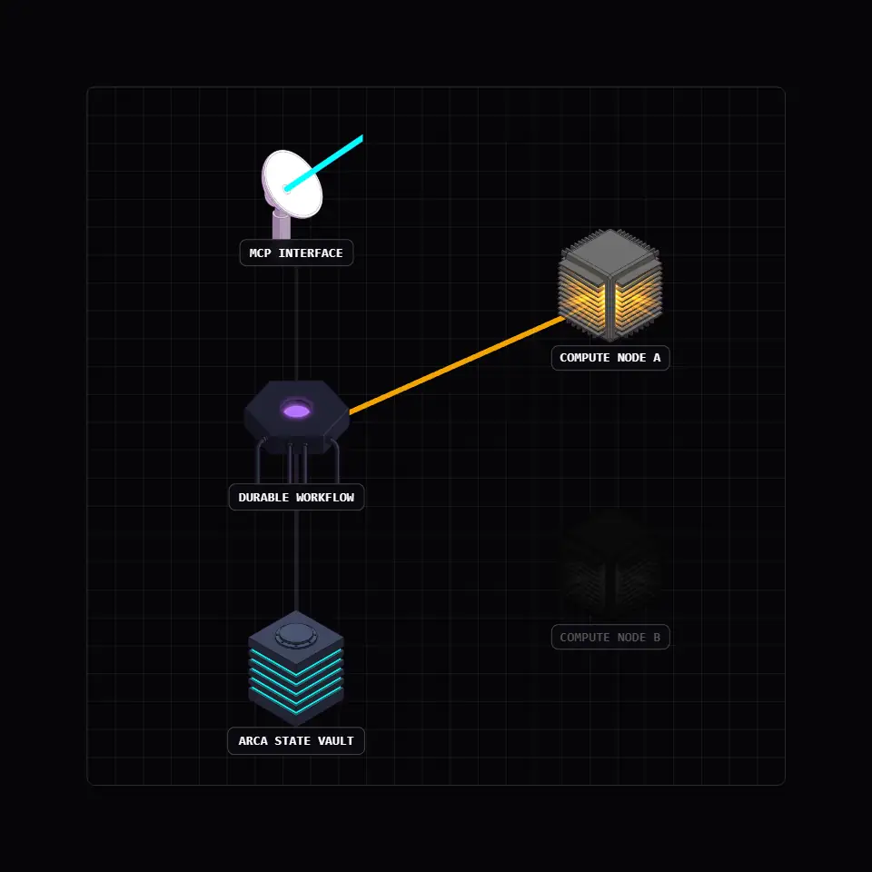

<div align="center">
  

  <br><br>

  <p><strong>A programming language for human intent and machine execution.</strong> Vox is a unified compiler that turns a single <code>.vox</code> file into a combined database schema, type-safe server, and live browser application. Initiated by Bertrand Reyna-Brainerd.</p>

  <p><a href="https://vox-lang.org"><strong>vox-lang.org</strong></a></p>
</div>

<p align="center">
  <a href="https://vox-lang.org"></a>
  <a href="https://github.com/vox-foundation/vox/commits/main"></a>
  <a href="LICENSE"></a>
  <a href="https://vox-lang.org/feed.xml"></a>
</p>

---

<!-- Code examples in this file mirror examples/golden/*.vox -->
<!-- Run: vox check examples/golden/*.vox to verify -->

<div align="center">
  <blockquote>
    <p><em>"Is it a fact — or have I dreamt it — that, by means of electricity, the world of matter has become a great nerve, vibrating thousands of miles in a breathless point of time? Rather, the round globe is a vast head, a brain, instinct with intelligence!"</em></p>
    <p>— Nathaniel Hawthorne, <em>The House of the Seven Gables</em> (1851)</p>
  </blockquote>
</div>

---

<!-- ANCHOR: why_vox -->
## Why Vox

Mainstream languages predate LLMs by decades. They accept a lot of implicit state — nulls, exceptions, schemas restated three times across the stack. That's tractable for a person; it's a minefield for a statistical code generator. A million-token context window doesn't help when most of it is integration boilerplate.

Vox collapses the common cases. One `@table` declaration becomes a schema, an API, and a typed client. Errors are values, not exceptions. Browser interactivity is opt-in at explicit boundaries. Durable execution, MCP tool exposure, and a local training pipeline are built in — not glued on top.
<!-- ANCHOR_END: why_vox -->

## Install

**macOS**

```bash
brew install vox-foundation/vox/vox
```

**Linux (Debian/Ubuntu)**

```bash
curl -fsSLO https://github.com/vox-foundation/vox/releases/latest/download/vox-cli-amd64.deb
sudo dpkg -i vox-cli-amd64.deb
```

**Windows** — download the `.msi` from the [Releases page](https://github.com/vox-foundation/vox/releases).

```bash
vox init my-app
cd my-app
vox run src/main.vox
```

### Optional plugins (lean install)

The core `vox` binary covers compile / run / bundle / package management. Heavier
subsystems ship as separate downloadable plugin binaries — `vox` discovers them on
`PATH` when you invoke `vox <subcommand>`:

| Plugin | Subcommands | Why optional |
|---|---|---|
| `vox-mens` | `vox mens`, `vox oratio`, `vox speech`, `vox populi`, `vox train` | Pulls Candle / Whisper / Hugging Face hub — heavy ML deps |
| `vox-schola` | `vox schola`, `vox scientia` | Research and capability-map subsystem |

Each plugin ships as its own archive on the
[Releases page](https://github.com/vox-foundation/vox/releases) — for example
`vox-mens-<version>-<target>.tar.gz` / `.zip` and
`vox-schola-<version>-<target>.tar.gz` / `.zip`. Drop the binary anywhere on
`PATH`; `vox` will dispatch automatically. If a plugin is missing, `vox`
prints an actionable install hint.

## The CLI

The full CLI surface, including every `vox ci`, `vox populi`, and `vox mens` subcommand, lives at [`docs/src/reference/cli.md`](docs/src/reference/cli.md). Run `vox commands --recommended` for first-time discovery.

---

<div align="center">
  
</div>

<!-- ANCHOR: how_vox -->
## How Vox works

### Pillar 1: The Single Source of Truth

A core concept like a `Task` is defined once — not three times across SQL, the backend API, and the client. The `@table` primitive collapses schema and interface into one AST node.

```vox
// [ @table ]
// Auto-generates SQL and gracefully handles schema migrations.
@table type Task {
    title:    str
    done:     bool
    priority: int
    owner:    str
}

// [ @index ]
// Database index declared inline next to the type.
@index Task.by_owner on (owner)
```

### Pillar 2: Compile-Time Determinism

Hidden exceptions are out; `Result[T]` is in. Unhandled errors become a compile-time failure, so a caller can't quietly ignore a failure branch.

```vox
// [ @endpoint(kind: query) ]
// Read-only endpoint; the compiler enforces that it never mutates data.
// Becomes GET /api/query/recent_tasks automatically.
@endpoint(kind: query)
fn recent_tasks() to list[Task] {
    return db.Task
        .where({ done: false })
        .order_by("priority", "desc")
        .limit(10)
}

// [ Result[Task] ]
// Every caller must handle both branches; the compiler will not build
// code that ignores the error case.
@endpoint(kind: server)
fn get_task(id: Id[Task]) to Result[Task] {
    let row = db.Task.find(id)
    match row {
        Some(t) -> Ok(t)
        None    -> Error("not found")
    }
}

// [ @endpoint(kind: mutation) ]
// Auto-transacted write; rolls back on network or logic failure.
@endpoint(kind: mutation)
fn add_task(title: str, owner: str) to Id[Task] {
    return db.insert(Task, {
        title: title,
        done: false,
        priority: 0,
        owner: owner
    })
}
```

> The three `kind:` values were separate decorators (`@query`, `@server`, `@mutation`) until recently; they collapsed into one `@endpoint` primitive in the April 2026 grammar unification.

### Pillar 3: React Interop via Plain Components and Endpoints

Vox compiles `component` declarations to plain React/TSX components and `@endpoint` declarations to typed server functions plus a generated `vox-client.ts`. An external React, TanStack, or mobile app can either import the emitted components directly or call the endpoints over the generated RPC bridge — there is no island-mount harness to learn. See [`docs/src/architecture/external-frontend-interop-plan-2026.md`](docs/src/architecture/external-frontend-interop-plan-2026.md) for the full bidirectional interop story (server-only and fullstack build modes, Phase 5 React adapter).

```vox
// [ component ]
// Lowered to a plain React component (TSX) for the external frontend to import.
component TaskPage(tasks: list[Task]) {
    view: (
        <div className="task-list">
            { tasks.map(t -> <TaskRow task={t} />) }
        </div>
    )
}

routes { "/" to TaskPage }
```

> **v0.dev integration.** `@v0` is unchanged: scaffolds React components from a prompt during `vox build` (requires `V0_API_KEY`).

### Pillar 4: Durable State & Agent Interoperability

Multi-agent pipelines crash, and external tools fail. Durable orchestration — checkpointing across node death, retries on transient faults, supervised restart — is provided by the `vox-workflow-runtime` host. The `.vox` surface for declaring durable steps is mid-redesign: the original `workflow` / `activity` / `actor` keywords were tombstoned in the parser as part of the April 2026 primitive collapse, and a unified `@durable(kind: …)` decorator (parallel to `@endpoint(kind: …)`) is queued behind a separate ADR.<sup>[2](#ref2), [3](#ref3)</sup>

In the meantime, durable steps are written as ordinary `Result`-returning functions and registered with the runtime programmatically. The `@mcp.tool` decorator (unchanged) exposes any function to Anthropic's Model Context Protocol so external AI clients can call it directly.<sup>[4](#ref4)</sup>

<table width="100%">
<tr>
<td width="50%" align="center" valign="middle">
  
</td>
<td width="50%" valign="top">

```vox
// [ activity-shaped fn ]
// Flaky step; the runtime retries on node death or OOM.
fn charge_card(amount: int) to Result[str] {
    if amount > 1000 {
        return Error("Amount too large")
    }
    return Ok("tx_123")
}

// [ workflow-shaped fn ]
// Plain Vox today; orchestration is added by the host runtime.
fn checkout(amount: int) to str {
    let result = charge_card(amount)
    match result {
        Ok(tx)    -> "Success: " + tx
        Error(msg) -> "Failed: " + msg
    }
}

// [ @mcp.tool ]
// Exposes the function to MCP-compatible clients.
@mcp.tool "Process durable checkout"
fn complete_purchase(amount: int) to str {
    return checkout(amount)
}
```

</td>
</tr>
</table>

> Mirrors [`examples/golden/checkout_workflow.vox`](examples/golden/checkout_workflow.vox) and [`examples/golden/mcp_tools.vox`](examples/golden/mcp_tools.vox). The retired keywords are listed in the [`AGENTS.md` retired-surfaces table](AGENTS.md).

### Pillar 5: Local Training (MENS)

Mainstream languages saturate internet-scale training data; Vox is new and won't for a while. The MENS pipeline lets you close that gap locally: `vox populi` detects CUDA/Metal/WebGPU on startup and runs QLoRA fine-tunes, speech-to-code, and OpenAI-compatible serving — all native Rust (Burn + Candle), no Python. Native training requires the `gpu` feature: `cargo build -p vox-cli --features gpu`.

More: [`examples/golden/`](examples/golden/) · [Rosetta comparison (C++, Rust, Python)](docs/src/explanation/expl-rosetta-inventory.md)
<!-- ANCHOR_END: how_vox -->

---

## Automation: VoxScript-first

Project automation is `.vox`, not `.ps1` / `.sh` / `.py`. The same file runs on Windows, Linux, and macOS; it's type-checked before execution (`vox check scripts/foo.vox`); it emits `vox.script.*` telemetry; and it can run in a WASM sandbox for untrusted input.

```bash
vox run scripts/clean-cache.vox
vox run --isolation wasm scripts/process-untrusted-data.vox
```

---

## Agents, mesh, local training

**Orchestration.** `vox-orchestrator` assigns work to agents by file affinity and role. The control surface — pause, resume, retire, reorder, queue status, and the rest — is exposed as MCP tools, invokable from the VS Code sidebar or any MCP-compatible client.

**Agent-to-agent messaging.** In-process by default; cross-machine relay is opt-in via the `populi-transport` feature. Both sides declare the same Vox type; the compiler catches shape mismatches at build time.

**The Populi mesh.** Hardware-aware node registry. Nodes advertise CPU/CUDA/Metal/VRAM on startup; the orchestrator routes training and inference jobs to the machines that can handle them.

```bash
VOX_MESH_ENABLED=1 VOX_MESH_NODE_ID=my-node vox populi serve
```

**Provider routing.** Local models (Ollama) and the major cloud providers are routed through a single policy layer with per-provider quotas and disclosure rules. The current list, gating tiers, and configuration knobs live in the [model routing how-to](docs/src/how-to/how-to-model-routing.md).

```bash
vox populi status --quotas   # per-provider usage and remaining budget
vox populi train --config qlora.toml
vox populi serve --model mens/runs/latest/model_final.bin --port 8080
```

---

## Stability

<!-- ANCHOR: tier_table -->
Surfaces are tracked by how reproducibly an LLM can target them. Data, logic, and tool contracts lock first; rendering surfaces are still moving.

* 🟢 **Stable** — contract locked; output on this surface is reproducible across sessions.
* 🟡 **Preview** — functionally complete; implementation may still shift.
* 🚧 **Experimental** — under active design; not for deployment.

| Domain | Tier | What it covers |
|:---|:---|:---|
| Compiler engine | 🟢 Stable | AST, HIR, type checker, LSP, code generation pipeline. |
| Surface syntax | 🟡 Preview | Primitive set is collapsing toward fewer, more orthogonal forms (`@endpoint(kind: …)` landed April 2026; `@durable(kind: …)` queued). |
| `@table` & data layer | 🟢 Stable | Schema, migrations, `db.*` query builder, wire types. |
| Endpoints (`@endpoint`) | 🟡 Preview | Unified shape is new — `query`/`server`/`mutation` recently merged. |
| Agent tooling | 🟢 Stable | `@mcp.tool` / `@mcp.resource` exposure, MCP protocol compliance. |
| Stub detection / AI-laziness gates | 🟡 Preview | `vox stub-check` catches `todo!()` / `unimplemented!()` / hollow returns / "Done!" claims. The `ai_laziness` detector (rule 21) adds placeholder-string returns, "implement later" comments, mock-named functions, conditional stubs, and assertion-only bodies. |
| RAG & knowledge curation | 🟡 Preview | `vox scientia` retrieval, Socrates guards. |
| Durable execution | 🚧 Experimental | Parser keywords (`workflow`/`activity`/`actor`) tombstoned; replacement decorator pending ADR. Runtime works, but the source-language surface is in flux. |
| Local training (MENS) | 🟡 Preview | Hardware coverage is still expanding. |
| Web UI & rendering | 🟡 Preview | Vox-native reactivity (`component` + `state_machine` + WebIR) for greenfield, plus React-interop via TSX emit and generated `vox-client.ts` (server-only and fullstack build modes). `@v0` unchanged. |
| Distributed node mesh | 🚧 Experimental | Cross-machine routing is pre-1.0 design. |

Vox is in active pre-1.0 development (workspace version `0.5.0` at the time of writing); treat this as a preview. The core of the language itself is still moving — the April 2026 grammar unification collapsed multiple decorators and tombstoned several keywords, and that work isn't finished. Notable changes land in [`CHANGELOG.md`](CHANGELOG.md), and the machine-verified v1.0 criteria, with per-domain verification pipelines, live at [`docs/src/architecture/v1-release-criteria.md`](docs/src/architecture/v1-release-criteria.md).
<!-- ANCHOR_END: tier_table -->

Active work tracks against the [GUI-native roadmap](docs/src/architecture/gui-native-roadmap-status-2026.md), which carries the per-task status. Phase 0 (dashboard hardening) and Phase 2 (compiler primitive collapse) are largely complete; Phase 3 (grammar unification policy in `AGENTS.md`) is next, and Phases 4–8 are queued. The retired surfaces — symbols you may still see in older docs but should no longer use — are listed in the [`AGENTS.md` retired-surfaces table](AGENTS.md).

---

## Documentation

Docs follow the **Diátaxis** framework.

| Intent | Start here |
|---|---|
| Learning | [Getting Started](docs/src/tutorials/tut-getting-started.md) · [First full-stack app](docs/src/how-to/first-full-stack-app.md) |
| Task recipes | [How-To Guides](docs/src/how-to/) · [AI Agents & MCP](docs/src/how-to/how-to-ai-agents.md) |
| Understanding | [Why Vox for AI](docs/src/explanation/why-vox-for-ai.md) · [Compiler architecture](docs/src/explanation/expl-architecture.md) |
| Reference | [CLI](docs/src/reference/cli.md) · [Decorators](docs/src/reference/ref-decorators.md) |
| Architecture | [Master index](docs/src/architecture/architecture-index.md) · [Contributor hub](docs/src/contributors/contributor-hub.md) |
| Operations | [Deployment](docs/src/reference/deployment-compose.md) · [CI runner](docs/src/ci/runner-contract.md) |

---

## Contributing

Start at the [Contributor Hub](docs/src/contributors/contributor-hub.md). The [Contribution Loop](docs/src/contributors/contribution-loop.md) explains the write → verify → train cycle. If CI flags a gate failure, the [TOESTUB Guide](docs/src/contributors/toestub-contributor-guide.md) covers the common causes. Undocumented surfaces are tracked in [`DOC_GAPS.md`](docs/src/api/DOC_GAPS.md).

---

## Architectural guardrails

These aren't style suggestions — they fail CI. See [`AGENTS.md`](AGENTS.md) for the rationale behind each one.

| Detector | Blocks | Run it |
|---|---|---|
| `StubDetector`, `EmptyBodyDetector`, `HollowFnDetector`, `VictoryClaimDetector` | `todo!()`, `unimplemented!()`, empty bodies, hollow arrows, "complete" next to `unimplemented!()` | `vox stub-check --path <path>` |
| `GodObjectDetector`, `SprawlDetector` | >500 LOC or >12 methods per block; >20 files per directory | `vox ci toestub-scoped` |
| `secret-env-guard`, `operator-env-guard`, `SecretDetector` | raw `std::env::var` for secrets; hardcoded keys | `vox ci secret-env-guard` |
| `SchemaComplianceDetector` | uncompiled `.vox` snippets in docs (not `{{#include}}` or `// vox:skip`) | `vox ci toestub-scoped` |
| `sync-ignore-files` | drift between `.voxignore` → `.cursorignore` / `.aiignore` / `.aiexclude` | `vox ci sync-ignore-files` |
| `DryViolationDetector`, `DeprecatedUsageDetector`, `UnwiredModuleDetector` | copy-paste logic; retired symbols; modules declared but never imported | `vox ci toestub-scoped --report` |

---

<!-- ANCHOR: community_license -->
## Community, backing, license

**Open Collective.** Community-backed via [Open Collective](https://opencollective.com/vox-foundation) — every dollar raised and spent is public. Sponsorships fund developer grants, CI hardware for MENS training, and academic bounties.

**License.** Apache 2.0 — commercial use permitted, patent rights granted, modifications allowed with attribution. [`LICENSE`](https://github.com/vox-foundation/vox/blob/main/LICENSE).

**Get involved.** Roadmap and architecture discussions happen on [GitHub Discussions](https://github.com/vox-foundation/vox/discussions). Changelogs and ADRs publish to the [RSS feed](https://vox-lang.org/feed.xml).
<!-- ANCHOR_END: community_license -->

---

## References

<a id="ref2"></a>**[2]** Fateev, M., & Abbas, S. (2019). *Temporal*. Temporal Technologies. <https://temporal.io>

<a id="ref3"></a>**[3]** Armstrong, J. (2003). *Making reliable distributed systems in the presence of software errors* [Ph.D. thesis, Royal Institute of Technology, Stockholm]. <https://erlang.org/download/armstrong_thesis_2003.pdf>

<a id="ref4"></a>**[4]** Anthropic. (2024). *Model Context Protocol*. <https://modelcontextprotocol.io>
