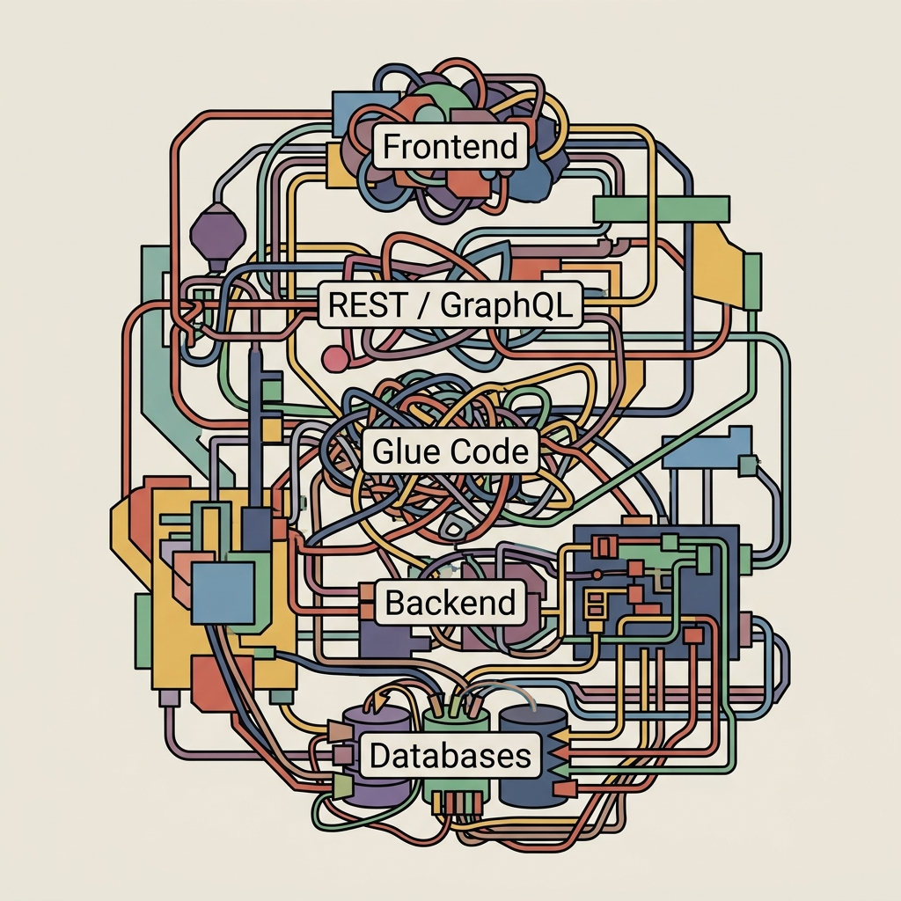

<div align="center">
  

  <br><br>

  <p><strong>One <code>.vox</code> file compiles to a database schema, a typed server, a browser app, and the artifacts to deploy them.</strong> Initiated by Bertrand Reyna-Brainerd.</p>

  <p><a href="https://vox-lang.org"><strong>vox-lang.org</strong></a></p>
</div>

<p align="center">
  <a href="https://vox-lang.org"></a>
  <a href="https://github.com/vox-foundation/vox/commits/main"></a>
  <a href="LICENSE"></a>
  <a href="https://vox-lang.org/feed.xml"></a>
</p>

---

<!-- Code examples in this file mirror examples/golden/*.vox -->
<!-- Run: vox check examples/golden/*.vox to verify -->

<div align="center">
  <blockquote>
    <p><em>"Is it a fact — or have I dreamt it — that, by means of electricity, the world of matter has become a great nerve, vibrating thousands of miles in a breathless point of time? Rather, the round globe is a vast head, a brain, instinct with intelligence!"</em></p>
    <p>— Nathaniel Hawthorne, <em>The House of the Seven Gables</em> (1851)</p>
  </blockquote>
</div>

---

<!-- ANCHOR: why_vox -->
## Why Vox

Mainstream languages predate LLMs by decades. They tolerate implicit state — nulls, exceptions, schemas restated three times across the stack. That's tractable for a person; it's a minefield for a statistical code generator. A million-token context window doesn't help when most of it is integration boilerplate.

Vox is what falls out when you design the language *after* the model: collapse the duplications, push errors into the type system, draw the browser/server boundary in one place, and build durability and tool exposure into the grammar instead of layering them on top.

<div align="center">
  
</div>
<!-- ANCHOR_END: why_vox -->

## Install

**macOS**

```bash
brew install vox-foundation/vox/vox
```

**Linux (Debian/Ubuntu)**

```bash
curl -fsSLO https://github.com/vox-foundation/vox/releases/latest/download/vox-cli-amd64.deb
sudo dpkg -i vox-cli-amd64.deb
```

**Windows** — download the `.msi` from the [Releases page](https://github.com/vox-foundation/vox/releases).

```bash
vox init my-app
cd my-app
vox run src/main.vox
```

### Ecosystem & Plugins

Vox is highly modular. The core binary covers compile, run, bundle, package. Heavier capabilities are provided through optional **CLI Extensions** and **Runtime Plugins**.

#### CLI Extensions
These ship as separate binaries that `vox` dispatches to from `$PATH`; if missing, `vox` tells you what to install.

| Extension | Adds | Purpose |
|---|---|---|
| `vox-ml-cli` | `vox mens`, `vox oratio`, `vox populi`, `vox speech`, `vox train` | Rust-native ML frameworks ([Candle](https://github.com/huggingface/candle), [Whisper](https://en.wikipedia.org/wiki/Whisper_(speech_recognition_system)), [HF hub](https://huggingface.co/docs/hub/index)) for training and serving without Python. |
| `vox-schola` | `vox schola`, `vox scientia` | Autonomous AI research, fact-checking, and capability-map subsystems. |
| `vox-gui` | `vox gui` | Native Tauri desktop application and visual environment. |

#### Runtime Plugins (Agent Skills)
The Vox AgentOS dynamically loads capabilities through a stable ABI using `vox-plugin-host`. There are currently 27 first-party plugins granting your agents access to the outside world:

- **Machine Learning & Audio**: `mens-candle-cuda` (NVIDIA acceleration), `mens-candle-metal` (Apple Silicon acceleration), `nvml-probe`, `oratio`, `oratio-mic`, `populi-mesh`
- **Execution Sandboxes**: `runtime-container` (Docker), `runtime-wasm`, `script-execution`
- **Agent Skills**: `skill-compiler`, `skill-git`, `skill-memory`, `skill-orchestrator`, `skill-rag`, `skill-testing`, `skill-testing-validate`, `skill-v0`, `browser`, `noop-skill`
- **Core Infrastructure**: `api`, `catalog`, `cloud`, `host`, `types`, `webhook`
- **Publishing**: `publication`, `grammar-export`

*→ See the [Plugin Catalog](docs/src/reference/plugin-catalog.generated.md) for detailed tool signatures.*

## The CLI

The full CLI surface, including every `vox ci`, `vox populi`, and `vox mens` subcommand, lives at [`docs/src/reference/cli.md`](docs/src/reference/cli.md). Run `vox commands --recommended` for first-time discovery.

---

<div align="center">
  
</div>

<!-- ANCHOR: how_vox -->
## How Vox works

### Pillar 1: One source of truth

```vox
@table type Task {
    title: str
    done:  bool
    owner: str
}
```

The declaration is the [schema](crates/vox-db/), the [wire format](crates/vox-types/), and the typed client. `@index Task.by_owner on (owner)` lives next to it. [Migrations](crates/vox-db/) come from the diff against the previous schema.

→ [`@table` reference](docs/src/reference/ref-decorators.md) · [migration guide](docs/src/how-to/how-to-database.md)

### Pillar 2: Errors in the type system

```vox
@endpoint(kind: query)
fn recent_tasks() to list[Task] {
    return db.Task.where({ done: false }).limit(10)
}

@endpoint(kind: mutation)
fn add_task(title: str, owner: str) to Result[Id[Task]] {
    if title == "" { return Error("title required") }
    return Ok(db.insert(Task, { title: title, done: false, owner: owner }))
}
```

A `Result[T]` caller must handle both arms — no exceptions, no `null`, no implicit propagation. The compiler refuses to build code that drops `Error`. [`vox-lsp`](crates/vox-lsp/) surfaces the same diagnostics live in the editor.

`@endpoint(kind: …)` is the unified form of the older `@query` / `@server` / `@mutation` decorators (April 2026 grammar collapse).

→ [decorator reference](docs/src/reference/ref-decorators.md)

### Pillar 3: One file → running deployment

```vox
component TaskPage(tasks: List[Task]) {
    view: column() {
        tasks.map(fn(t) { row() { text() { t.title } } })
    }
}

routes { "/" to TaskPage }
```

`vox build` emits [React](https://react.dev/)/[TSX](https://www.typescriptlang.org/) components, a generated `vox-client.ts` RPC bridge, and — via [`vox-deploy-codegen`](crates/vox-deploy-codegen/) — Dockerfile, Compose, Kubernetes, Fly, Coolify, and systemd targets, all derived from the same module graph. External React, TanStack, or mobile apps can import the emitted components or call the endpoints over the bridge.

→ [external interop plan](docs/src/architecture/external-frontend-interop-plan-2026.md) · [deployment](docs/src/reference/deployment-compose.md)

### Pillar 4: Durability, agents, skills

`@durable` lowers to checkpointed execution under [`vox-workflow-runtime`](crates/vox-workflow-runtime/) — retried on transient faults, restarted on node death.<sup>[1](#ref1), [2](#ref2)</sup> `@mcp.tool` exposes a function to any [Model Context Protocol](https://modelcontextprotocol.io) client.<sup>[3](#ref3)</sup>

```vox
@durable
fn charge_card(amount: int) to Result[str] {
    if amount > 1000 { return Error("amount too large") }
    return Ok("tx_123")
}

@mcp.tool "Process a durable checkout"
fn checkout(amount: int) to Result[str] {
    return charge_card(amount)
}
```

<div align="center">
  
</div>

The same primitives drive multi-agent work. [`vox-orchestrator`](crates/vox-orchestrator/) routes tasks to agents by file affinity and ten policy modules (tier cascade, plan-mode trigger, risk matrix, budget gate, circuit breaker, calibration, …). Capabilities are extensible: 27 first-party plugins (compiler, git, memory, RAG, testing, Mens-Candle-CUDA/Metal, WASM and OCI runtimes) load through [`vox-plugin-host`](crates/vox-plugin-host/) behind a stable ABI.

→ [orchestration policy research](docs/src/architecture/autonomous-orchestration-policy-research-2026.md) · [`vox-skills`](crates/vox-skills/)

### Pillar 5: Built for LLM authorship

The shape of the four pillars above is downstream of one decision: *design the language after the model*. Three subsystems make that concrete.

- **Grammar-constrained decoding.** [`vox-constrained-gen`](crates/vox-constrained-gen/) is an Earley/PDA decoder<sup>[5](#ref5)</sup> with a deadlock watchdog. Token-stream constraint, not post-hoc validation — invalid Vox cannot be sampled.
- **Measurable detectors.** Rules live in [`rules.v1.yaml`](crates/vox-rule-pack/rules/rules.v1.yaml) with a JSON Schema and an [F1 bench scorer](https://en.wikipedia.org/wiki/F-score) over fixture corpora. Stub, hollow-fn, victory-claim, AI-laziness, secret, magic-value, deprecated-symbol, and effect-system rules are all scored against ground truth, not vibes.
- **Local training.** Vox is new; mainstream languages saturate the public training corpus, Vox doesn't. `vox populi` runs QLoRA<sup>[4](#ref4)</sup> fine-tunes and OpenAI-compatible serving on detected CUDA / Metal / WebGPU — [Burn](https://github.com/tracel-ai/burn) + [Candle](https://github.com/huggingface/candle), no Python. Requires the `gpu` cargo feature.

→ [`examples/golden/`](examples/golden/) · [Rosetta comparison](docs/src/explanation/expl-rosetta-inventory.md) · [why Vox for AI](docs/src/explanation/why-vox-for-ai.md)

---

### Engineering invariants

Properties enforced on the project itself, invisible from the language surface:

- **Layered crate graph.** All 101 workspace crates declare a layer (L0 pure types → L5 surfaces) in [`layers.toml`](docs/src/architecture/layers.toml). [`vox-arch-check`](crates/vox-arch-check/) blocks inversions, fan-in violations, LoC budget overruns, and orphaned modules.
- **Sandboxed execution.** [`vox-wasm-engine`](crates/vox-wasm-engine/) ([Wasmtime](https://wasmtime.dev/)), [`vox-container`](crates/vox-container/) ([OCI](https://opencontainers.org/)), [`vox-bounded-fs`](crates/vox-bounded-fs/) (size-capped reads), [`vox-exec-grammar`](crates/vox-exec-grammar/) (shell risk classifier). Tiers are selectable on `vox run`.
- **Declared capabilities.** [`vox-capability-registry`](crates/vox-capability-registry/) gates what tools can do; [`vox-identity`](crates/vox-identity/) signs with [ed25519](https://en.wikipedia.org/wiki/EdDSA#Ed25519) against a trust ledger; [`vox-secrets`](crates/vox-secrets/) is the only path to a secret value.
<!-- ANCHOR_END: how_vox -->

---

## Automation: VoxScript-first

Project automation is `.vox`, not `.ps1` / `.sh` / `.py`. The same file runs on Windows, Linux, and macOS; it's type-checked before execution (`vox check scripts/foo.vox`); it emits `vox.script.*` [telemetry](crates/vox-telemetry/); and it can run in a WASM sandbox for untrusted input.

```bash
vox run scripts/clean-cache.vox
vox run --isolation wasm scripts/process-untrusted-data.vox
```

Other commands worth knowing:

- `vox share publish file.vox` — short-lived public preview tunnel (Cloudflare, localhost.run, Tailscale).
- `vox audit` — runs the rule pack against your tree.
- `vox telemetry doctor` — diagnoses `VOX_TELEMETRY` and per-sink wiring.

---

## Mesh and provider routing

Cross-machine work is opt-in. Nodes advertise CPU/CUDA/Metal/VRAM on startup and the orchestrator routes training and inference jobs to whichever machines can take them. Agent-to-agent messages are in-process by default; the `populi-transport` feature enables relay. Both ends declare the same Vox type, so wire mismatches fail at compile time.

```bash
VOX_MESH_ENABLED=1 VOX_MESH_NODE_ID=my-node vox populi serve
vox populi status --quotas
```

Local models (Ollama) and the major cloud providers go through one policy layer with per-provider quotas and disclosure rules. See the [model routing how-to](docs/src/how-to/how-to-model-routing.md).

---

## Stability

<!-- ANCHOR: tier_table -->
Workspace `0.5.0` — pre-1.0. Surfaces are graded by how reproducibly an LLM can target them: data and tool contracts lock first, rendering surfaces last.

🟢 Stable · 🟡 Preview · 🚧 Experimental

| Surface | Tier | Notes |
|:---|:---|:---|
| Compiler engine | 🟢 | [AST](crates/vox-compiler/), [HIR](crates/vox-compiler/src/hir/), [type checker](crates/vox-compiler/src/typeck/), [LSP](crates/vox-lsp/), [codegen](crates/vox-codegen/). |
| `@table` & data layer | 🟢 | [Schema](crates/vox-db/), [migrations](crates/vox-db/), `db.*` query builder, wire types. |
| `@mcp.tool` / `@mcp.resource` | 🟢 | MCP protocol compliance. |
| Surface syntax | 🟡 | Top-level forms (`@endpoint(kind: …)`, `@durable`, bare `workflow`/`activity`/`actor`) defined in [`AGENTS.md`](AGENTS.md). |
| Endpoints | 🟡 | Unified `@endpoint` is recent. |
| Code-audit rule pack | 🟡 | [See Pillar 5](crates/vox-rule-pack/). |
| RAG & knowledge curation | 🟡 | [`vox scientia`](crates/vox-schola/), Socrates guards. |
| Durable execution | 🟡 | Grammar locked; [`vox-workflow-runtime`](crates/vox-workflow-runtime/) behavior maturing. |
| Local training (MENS) | 🟡 | Hardware coverage expanding ([`vox-mens`](crates/vox-ml-cli/)). |
| Web UI & rendering | 🟡 | Vox-native [reactivity](https://en.wikipedia.org/wiki/Reactive_programming) for greenfield; [React](https://react.dev/) TSX + `vox-client.ts` for interop. |
| Distributed node mesh | 🚧 | Cross-machine routing is pre-1.0 design. |

v1.0 criteria: [`docs/src/architecture/v1-release-criteria.md`](docs/src/architecture/v1-release-criteria.md). Roadmap: [GUI-native phases](docs/src/architecture/gui-native-roadmap-status-2026.md). History: [`CHANGELOG.md`](CHANGELOG.md).
<!-- ANCHOR_END: tier_table -->

Phase status: 2–6 done (primitive collapse, grammar unification, compiler/GUI milestones); Phase 7 mostly done (TASK-7.3 bundler swap deferred to Phase 9); Phase 8 corpus migration done, TASK-8.2 awaits an operator MENS run; Phase 9 route-pipeline restoration landed. Retired symbols: [`AGENTS.md` retired-surfaces table](AGENTS.md).

---

## Documentation

Docs follow the **Diátaxis** framework.

| Intent | Start here |
|---|---|
| Learning | [Getting Started](docs/src/tutorials/tut-getting-started.md) · [First full-stack app](docs/src/how-to/first-full-stack-app.md) |
| Task recipes | [How-To Guides](docs/src/how-to/) · [AI Agents & MCP](docs/src/how-to/how-to-ai-agents.md) |
| Understanding | [Why Vox for AI](docs/src/explanation/why-vox-for-ai.md) · [Compiler architecture](docs/src/explanation/expl-architecture.md) |
| Reference | [CLI](docs/src/reference/cli.md) · [Decorators](docs/src/reference/ref-decorators.md) |
| Architecture | [Master index](docs/src/architecture/architecture-index.md) · [Contributor hub](docs/src/contributors/contributor-hub.md) |
| Operations | [Deployment](docs/src/reference/deployment-compose.md) · [CI runner](docs/src/ci/runner-contract.md) |

---

## Contributing

Start at the [Contributor Hub](docs/src/contributors/contributor-hub.md). The [Contribution Loop](docs/src/contributors/contribution-loop.md) explains the write → verify → train cycle. If CI flags a gate failure, the [TOESTUB Guide](docs/src/contributors/toestub-contributor-guide.md) covers the common causes. Undocumented surfaces are tracked in [`DOC_GAPS.md`](docs/src/api/DOC_GAPS.md).

---

## CI gates beyond the rule pack

The rule pack (Pillar 5) covers detectors. A handful of CI guards live outside it because they enforce repo invariants, not code patterns:

| Guard | Blocks | Run |
|---|---|---|
| `vox arch-check` | layer inversions, fan-in violations, LoC budgets, orphans | always |
| `vox ci secret-env-guard` | raw `std::env::var` for secrets | always |
| `vox ci sync-ignore-files` | `.voxignore` drift to `.cursorignore` / `.aiignore` / `.aiexclude` | always |
| `vox-drift-check` | multi-language workspace drift | pre-push |

Rationale and the full detector inventory live in [`AGENTS.md`](AGENTS.md).

---

<!-- ANCHOR: community_license -->
## Backing, license, contact

Funded via [Open Collective](https://opencollective.com/vox-foundation) — every transaction is public. Sponsorships fund developer grants, MENS training hardware, and academic bounties.

[Apache 2.0](https://www.apache.org/licenses/LICENSE-2.0): commercial use, patent grant, modification with attribution. [`LICENSE`](https://github.com/vox-foundation/vox/blob/main/LICENSE).

Discussion: [GitHub Discussions](https://github.com/vox-foundation/vox/discussions). Changelogs and ADRs: [RSS](https://vox-lang.org/feed.xml).
<!-- ANCHOR_END: community_license -->

---

## References

<a id="ref1"></a>**[1]** Fateev, M., & Abbas, S. (2019). *Temporal*. Temporal Technologies. <https://temporal.io>

<a id="ref2"></a>**[2]** Armstrong, J. (2003). *Making reliable distributed systems in the presence of software errors* [Ph.D. thesis, Royal Institute of Technology, Stockholm]. <https://erlang.org/download/armstrong_thesis_2003.pdf>

<a id="ref3"></a>**[3]** Anthropic. (2024). *Model Context Protocol*. <https://modelcontextprotocol.io>

<a id="ref4"></a>**[4]** Dettmers, T., Pagnoni, A., Holtzman, A., & Zettlemoyer, L. (2023). *QLoRA: Efficient Finetuning of Quantized LLMs*. arXiv. <https://arxiv.org/abs/2305.14314>

<a id="ref5"></a>**[5]** Earley, J. (1970). *An efficient context-free parsing algorithm*. Communications of the ACM, 13(2), 94-102. <https://dl.acm.org/doi/10.1145/362007.362035>
