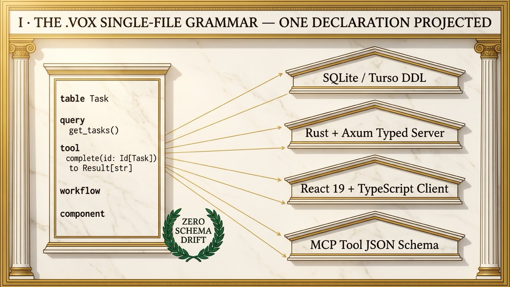
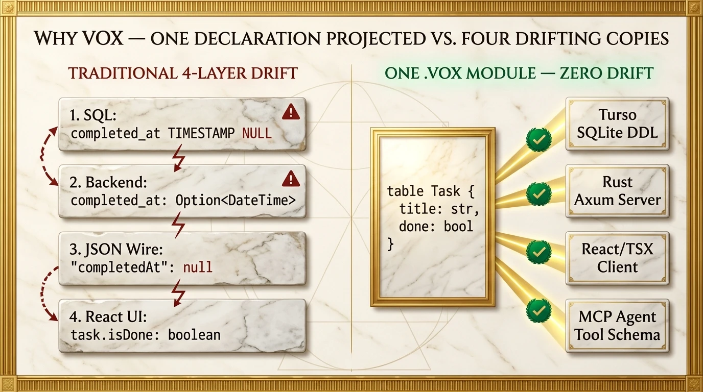
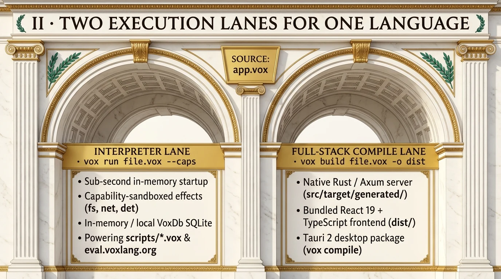

<!--
  Maintaining this README & Cross-Repository Separation of Concerns (README-SYNC-MAP):
  - Single Source of Ownership across the 4 `vox-foundation` repositories:
    1. `vox-foundation/vox/README.md` (this file): Language grammar, type system, compiler/interpreter lanes,
       agent orchestrator & MCP runtime, curated KB index, MENS pure-Rust QLoRA lane, empirical benchmarks,
       and the canonical 48-row suite status matrix.
    2. `vox-foundation/vox-axis/README.md` (`crates/vox-gui/README.md`): Desktop Tauri 2 operator console,
       all 32 catalog-generated GUI surfaces, `VRBS ROMA` 3D/2.5D codebase simulator, `AQVAEDUCTUS` cascade,
       and the 4-profile WCAG theme contract.
    3. `vox-foundation/voxlang.org/README.md` (`docs-astro/README.md`): Public Astro 7 + Starlight documentation
       engine, `vox-doc-pipeline` compiler-verified `.vox` doctests, Diátaxis + W3C SKOS taxonomy, and the
       Coolify `eval.voxlang.org` deterministic browser sandbox.
    4. `vox-ops/README.md`: Private OTLP/ClickHouse telemetry ingest (`vox-ops-telemetry-ingest`) and
       sky-computing spot GPU fleet adapters (`vox-plugin-cloud`).
  - Artwork & Voice Invariant: Each repository maintains its own bespoke hero banner, its own animated `.webp`
    tour, and its own domain-specific engineering narrative. Never duplicate animations across repositories.
  - Status tables: when you verify a row, update its State, its "Checked" date, and its note.
    States are strictly: Working / Prototype / Research / Not started. Nothing goes above Working.
  - Log: append-only, newest first. One line per milestone or finding; link the doc or commit.
  - Avoid undated volatile counts in satellite READMEs; link to the canonical contract or generator.
  - The why_vox block is lint-synced with docs/src/index.mdx; edit both together.
-->
<div align="center">
  

  <p>
    <strong>An experimental full-stack programming language, compiler, and verification suite</strong><br />
    <em>Declare schemas, server queries, reactive UI, durable workflows, and MCP agent tools in one <code>.vox</code> module — projected without drift across SQLite/Turso, Rust/Axum, and React/TypeScript.</em>
  </p>

  <p>
    <sub>Led by <strong>Bertrand Reyna-Brainerd</strong> · Stewarded by the <strong>Vox Foundation</strong> (in formation) · Apache-2.0 · <strong>Pre-1.0 Research Prototype (<code>v0.6.0</code> Workspace)</strong></sub>
  </p>

  <p>
    <a href="https://voxlang.org"><strong>voxlang.org</strong></a> &nbsp;·&nbsp;
    <a href="https://voxlang.org/tutorials/tut-getting-started/">Getting Started</a> &nbsp;·&nbsp;
    <a href="https://voxlang.org/reference/ref-syntax/">Syntax Reference</a> &nbsp;·&nbsp;
    <a href="https://voxlang.org/reference/stability/">Stability Matrix</a> &nbsp;·&nbsp;
    <a href="https://github.com/vox-foundation/vox-axis"><strong>Vox Axis GUI</strong></a>
  </p>

  <p>
    &nbsp;
    <a href="https://github.com/vox-foundation/vox/commits/main"></a>&nbsp;
    <a href="LICENSE"></a>
  </p>
</div>

> [!WARNING]
> **Last reviewed: 2026-11-10 (`v6.8` / `0.6.0` workspace).** Vox is an active pre-1.0 research project, not production software.
> - **Working & CI-gated on `main` (`16,491` passing tests across 3 Linux shards):** recursive-descent parser & type checker (`vox check`), capability-sandboxed interpreter (`vox run --interp --caps`), SQLite/Turso data layer (`vox-db`, schema baseline `97`), Tantivy + RRF hybrid knowledge base (`vox kb`), EBNF/JSON-Schema grammar export (`vox grammar`), VoxDiagram toolchain (`vox diagram`), model router (`vox model`), Clavis secret resolver (`vox secrets`), and 33 `crates.io` dry-run verified foundation crates (`vox ci publish-dry-run`).
> - **Prototypes:** full-stack Rust/React codegen (`vox build`), durable workflow replay (`VoxDbTracker`), the Tauri 2 desktop workbench ([**Vox Axis**](https://github.com/vox-foundation/vox-axis)), multi-source research (`vox research`), and pure-Rust QLoRA training (`vox mens`, with public Qwen3 adapters on Hugging Face).
> - **Install from source:** There is no stable release tag yet; build from `main` with Cargo ([Trying It](#trying-it)).

<div align="center">
  
</div>
<p align="center">
  <em>"Is it a fact — or have I dreamt it — that, by means of electricity, the world of matter has become a great nerve, vibrating thousands of miles in a breathless point of time? Rather, the round globe is a vast head, a brain, instinct with intelligence!"</em><br />
  <sub>— Nathaniel Hawthorne, <em>The House of the Seven Gables</em> (1851)</sub>
</p>

---

## Animated Language, Compiler & Verification Suite Tour

<div align="center">
  
  <p>
    <strong>The Vox Language, Compiler &amp; Verification Flywheel (<code>vox-foundation/vox</code>)</strong><br />
    <em>Five architectural plates cycling through: (I) Single-file <code>.vox</code> declaration projected across SQL, Rust/Axum, React/TSX, and MCP; (II) Instant capability-sandboxed interpreter (<code>vox run --caps</code>) vs. native full-stack compilation (<code>vox build</code>); (III) Event-sourced durable workflows (<code>VoxDbTracker</code>), actor file locks (<code>ADR-025</code>), and <code>BLAKE3</code>/<code>HMAC</code> tool receipts (<code>ADR-029</code>); (IV) Multi-turn compiler-feedback evaluation (<a href="#the-central-claim">The central claim</a>) &amp; pure-Rust Candle QLoRA; and (V) 6-layer zero-cycle workspace architecture (<code>L0</code>–<code>L5</code>) with 33 <code>crates.io</code> packages.</em>
  </p>
</div>

---

## Contents

1. [Why Vox](#why-vox)
2. [A First Look at `.vox` Code & Dual Execution Lanes](#a-first-look-at-vox-code--dual-execution-lanes)
3. [Architecture & Separation of Concerns Across Repositories](#architecture--separation-of-concerns-across-repositories)
4. [Tradeoffs: Engineering Costs & Operational Constraints](#tradeoffs-engineering-costs--operational-constraints)
5. [How It's Built & Project Stewardship](#how-its-built--project-stewardship)
6. [Status (All 48 Subsystems Verified `2026-11-10`)](#status)
7. [Log](#log)
8. [Trying It](#trying-it)
9. [The CLI](#the-cli)
10. [Contributing, Sponsors & License](#contributing)
11. [Intellectual Lineage, Prior Art & References](#intellectual-lineage-prior-art--references)

---

<!-- ANCHOR: why_vox -->
## Why Vox

A typical web app restates one domain model in four places:

1. A **database schema** (SQL or an ORM migration).
2. A **backend** (Rust, Go, Python, or Node) that validates and serves it.
3. A **wire contract**, usually JSON.
4. A **frontend** (TypeScript/React) that reads that JSON.

Names and types can drift at each boundary. People and coding agents both spend time keeping the copies aligned.

<div align="center">
  
  <p>
    <strong>One field, written four times</strong><br />
    <em>completed_at, completedAt, and isDone are the same fact. Each boundary renames it or changes its type. A Vox table states it once, and every layer keeps that name and type.</em>
  </p>
</div>

These are the choices that follow from that, and what each one buys.

**One declaration, projected.** A second schema, written by hand, drifts, and an agent copying it drifts the same way. A `table` is the source. SQL, the server types, the JSON shape, and the TypeScript client are generated from it. `vox build` emits SQLite/Turso, Rust (Axum), and React/TypeScript, because one stack is what the tests can actually cover. Django, Vue, and other frameworks are outside that path.

**Missing values and failures are typed.** Generated code skips a failure it cannot see. `Option[T]` is `Some(x)` or `None`. `Result[T]` is `Ok(x)` or `Error(msg)`. Code that ignores either case does not type-check. `?` returns the error to the caller.

**Ids are typed.** A task id and a user id are different facts. A boundary takes `Id[Task]` rather than a bare string, so the two cannot be swapped.

**Keywords open scopes. Decorators modify them.** `table`, `query`, `mutation`, `server`, `component`, `workflow`, `activity`, `tool`, and `resource` each open a scope. `@auth`, `@pure`, `@durable`, and `@uses` change how a declaration runs. One spelling means people and agents copy the same form. A new behavior is a decorator, so the keyword list stays stable.

**The same file runs now, or compiles.** Scripts, repo automation, and the browser playground should start without a Rust build. A shipped app should be ordinary Rust and TypeScript. `vox run` interprets the file. `--caps` is the list of effects the host grants (filesystem, network, and the rest). `vox build` emits the database, the server, and the client from that same file. The two executors are still being matched, and a generated server build needs a Vox source checkout (`VOX_REPO_ROOT`).

**A tool is a function in the same file.** An agent tool kept in a side schema drifts like a hand-written JSON contract. `tool` is a typed function plus a short description. The program and an MCP client call that declaration, and a failure comes back as `Result`.
<!-- ANCHOR_END: why_vox -->

> Measured comparison with TypeScript under multi-turn compiler feedback: see [The central claim](#the-central-claim)[^11].

---

## A First Look at `.vox` Code & Dual Execution Lanes

Here is a complete, runnable `.vox` program declaring a relational table, a read query, an MCP-callable agent tool, a reactive UI component, and a script entrypoint in one file:

```vox
// 1. Relational schema: Vox automatically synthesizes a phantom-typed primary key (`Id[Task]`).
table Task {
    title: str
    done:  bool
}

// 2. Read-only database query: compiled to a typed SQL read + HTTP GET route.
query get_tasks() to int {
    return len(db.Task.all())
}

// 3. Agent & application tool: callable directly in Vox or exposed over Model Context Protocol (MCP).
//    `Result[str]` makes failure explicit in the type signature; `?` propagates errors cleanly.
tool "Mark a task complete" complete(id: Id[Task]) to Result[str] {
    db.Task.delete(id)?
    return Ok("done")
}

// 4. Reactive UI component: projected to typed React 19 / TSX by `vox build`.
component TaskBoard() {
    view: column(raw_class="task-card") {
        heading(level=3) { "Active Tasks" }
        text() { "Synchronized across SQLite/Turso, Rust/Axum, React/TSX, and MCP" }
    }
}

// 5. Script entrypoint: executed immediately in memory by `vox run`.
fn main() to Result[str] {
    let id = db.Task.insert({ title: "Learn Vox", done: false })?
    print("Tasks queued: " + str(get_tasks()))
    let status = complete(id)?
    print("Tasks remaining: " + str(get_tasks()))
    return Ok(status)
}
```

### Two Execution Lanes for One Language

<div align="center">
  
  <p>
    <strong>Instant Sandboxed Interpretation (<code>vox run</code>) vs. Full-Stack Native Emission (<code>vox build</code>)</strong><br />
    <em>The same type-checked AST lowers either to the in-memory capability-gated evaluator or to standalone SQL DDL, Rust/Axum server code, React/TSX components, and MCP tool schemas.</em>
  </p>
</div>

| Execution Lane | Command | Runtime & Security Boundary | Primary Use Cases |
|:---|:---|:---|:---|
| **1. Interpreter & Sandbox Lane** | `vox run file.vox`<br/>`vox run --interp --caps deterministic file.vox` | Evaluates the type-checked AST directly in memory with an embedded SQLite `VoxDb` instance and explicit object-capability grants (`--caps`)[^3]. Zero Cargo/rustc invocation. | Fast local iteration, repository automation (`scripts/*.vox`), CI gates, and the public `/v1/eval` browser sandbox. |
| **2. Full-Stack Compile Lane** | `vox build file.vox -o dist`<br/>`vox compile file.vox` | Emits SQLite/Turso DDL, a typed **Rust (Axum)** HTTP server (`src/target/generated/`), a **React 19 / TypeScript** client (`dist/`), and optional **Tauri 2** desktop bundles[^1]. | Shipped full-stack web applications, native desktop apps, and compiled integration test suites (`vox test`). |

---

## Architecture & Separation of Concerns Across Repositories

Vox started as a single-file compiler, but empirically testing whether a language improves LLM code generation required building the surrounding **agent orchestrator**, **trust-tiered knowledge base**, **operator console**, and **QLoRA evaluation harness**.

Inside `vox-foundation/vox`, crates are organized into a strict **6-layer directed acyclic graph (`L0`–`L5`)** enforced on every commit by `vox-arch-check` ([`docs/src/architecture/layers.toml`](docs/src/architecture/layers.toml), **0 circular dependencies**):

| Architectural Area | Engineering Scope in `vox-foundation/vox` | Primary CLI Entrypoints & Leaf/Core Crates |
|:---|:---|:---|
| **1. Language & Compiler (`L0`–`L1`)** | Lexer, recursive-descent parser (57 EBNF productions), Hindley-Milner + effect/capability type checker[^1][^2], capability-sandboxed interpreter[^3], layout-safe formatter, LSP server, and Rust/Axum + React/TSX + SQL codegen + durable workflow replay journals[^4]. | `vox check`, `vox run`, `vox build`, `vox emit`, `vox fmt`, `vox lsp`, `vox diagram`, `vox grammar` (`vox-ast`, `vox-compiler`, `vox-codegen`, `vox-workflow-runtime`) |
| **2. Agent Harness & MCP (`L2`–`L4`)** | Multi-agent actor orchestrator (`vox-orchestrator-d`)[^5], 376-tool Model Context Protocol server (`vox mcp`)[^6], `BLAKE3`/`HMAC-SHA256` formal-intent tool receipts (`ADR-029`), per-file hopper locks (`ADR-025`), and self-maintaining OpenRouter/local model routing[^7]. | `vox mcp`, `vox serve`, `vox chat`, `vox model`, `vox skill`, `vox plan` (`vox-orchestrator`, `vox-mcp-dispatch`, `vox-orchestrator-mcp`, `vox-skills`) |
| **3. Trust-Tiered KB & Research (`L1`–`L3`)** | Curated documentation index combining Tantivy 0.22 BM25 with dense vector Reciprocal Rank Fusion (`vox kb`)[^8], 4 database-level retrieval trust tiers (`SystemVerified` → `Untrusted`), W3C SKOS + Nanopublication facets[^9], and steerable multi-source academic/web research. | `vox kb`, `vox research`, `vox scientia`, `vox graph` (`vox-db`, `vox-search-core`, `vox-search`, `vox-scientia-core`, `vox-scientia`, `vox-kb-facets`) |
| **4. Native ML Lane — MENS (`L3`–`L4`)** | Pure-Rust (Candle) QLoRA fine-tuning[^10] across Qwen3 (`0.6B`–`32B`) on Metal, CUDA, and CPU; AST-verified `<think>` JSONL corpora (`eval-gates-ladder.yaml`); and paired McNemar + Holm statistical evaluation (`vox model eval-compare`)[^11]. | `vox mens train`, `vox mens serve`, `vox model eval-compare`, `vox populi` (`vox-populi`, `vox-ml-cli`, `vox-tensor`) |
| **5. Governance, Crypto & Secrets (`L0`–`L4`)** | Application cryptography facade (`vox-crypto`: ChaCha20-Poly1305, BLAKE3, Ed25519), unified secret resolver (`Clavis` / `vox secrets`), static source-policy detectors (`vox audit code`), and architectural layer/retirement ratchets. | `vox doctor`, `vox ci`, `vox audit`, `vox secrets`, `vox shell check` (`vox-crypto`, `vox-secrets`, `vox-arch-check`, `vox-code-audit`, `vox-cli-core`) |

### Multi-Repository Separation of Concerns (`vox-foundation`)

To keep incremental Rust compile times fast (`-28%` to `-89%` via leaf facade splits), isolate heavy frontend/documentation toolchains, and enforce a hard air-gap around private telemetry while keeping `vox` **100% standalone offline**, the ecosystem is federated across four repositories with strict **Single-Source Documentation Ownership (`README-SYNC-MAP`)**:

| Repository | Visibility & License | Canonical Scope (What Lives Here) | What Does *Not* Live Here (Anti-Duplication Rule) |
|:---|:---|:---|:---|
| [**`vox-foundation/vox`**](https://github.com/vox-foundation/vox)<br/>*(This Repository)* | Public (`Apache-2.0`) | Core `.vox` language, compiler, interpreter, CLI, MCP server, `VoxDb` (v97), MENS QLoRA engine, 33 `crates.io`-publishable crates, [`docs/src/`](docs/src/) Markdown corpus, and the **48-row suite status matrix**. | Does not inline the 32 GUI screenshot tables (owned by `vox-axis`) or private ClickHouse/GPU billing adapters (owned by `vox-ops`). |
| [**`vox-foundation/vox-axis`**](https://github.com/vox-foundation/vox-axis)<br/>*(Mirrors [`crates/vox-gui/`](crates/vox-gui/README.md))* | Public (`Apache-2.0`) | **Vox Axis** Tauri 2 desktop workbench: all 32 `SURFACE_REGISTRY` views, the **`VRBS ROMA` 3D/2.5D Codebase Simulator**[^12], `AQVAEDUCTUS` hydraulic cascade, 4-profile WCAG theme contract (`arcane`, `slate`, `glacier`, `high-contrast`), and Local IPC / Remote TOFU TLS transport. | Does not duplicate `.vox` language tutorials, EBNF grammar rules, or compiler status rows; links back to `vox-foundation/vox`. |
| [**`vox-foundation/voxlang.org`**](https://github.com/vox-foundation/voxlang.org)<br/>*(Mirrors [`docs-astro/`](docs-astro/README.md))* | Public (`Apache-2.0`) | Public **Astro 7.4 + Starlight 0.42** site ([voxlang.org](https://voxlang.org)), `vox-doc-pipeline` compiler-verified `.vox` doctests, Diátaxis + W3C SKOS taxonomy, `/voxup` bootstrap scripts, and the Coolify **`eval.voxlang.org` `/v1/eval`** deterministic sandbox. | Does not duplicate hand-maintained CLI/MCP tables (`*.generated.md` are emitted from `vox`) or GUI surface catalogs. |
| **`vox-foundation/vox-ops`**<br/>*(Private Sibling Repo)* | Private (`Proprietary`) | Optional remote OTLP/ClickHouse telemetry receiver (`vox-ops-telemetry-ingest`, `telemetry.voxlang.org`), `Ed25519`-signed leaderboard snapshots, and commercial spot GPU adapters (`vox-plugin-cloud`: RunPod, Vast.ai, Together AI). | Zero compile or runtime edges into `vox-foundation/vox` (enforced by `vox ci standalone-sovereignty`); synced solely via 55 `BLAKE3`-hashed schemas (`vox ci cross-repo-parity`). |

---

## Tradeoffs: Engineering Costs & Operational Constraints

The benefits of each language and harness decision are stated in [Why Vox](#why-vox) above. Below are the engineering costs and constraints those decisions impose:

| Design Choice | Engineering Cost & Operational Constraint |
|:---|:---|
| **Single-file full-stack projection** (`table`, `query`, `mutation`, `component`, `tool` in one `.vox` module) | **Target stack lock-in.** `vox build` targets SQLite/Turso, Rust/Axum, and React 19 / TypeScript exclusively. Teams requiring Django, Spring, or Vue cannot use the full-stack codegen lane. |
| **No `null` + mandatory `Option[T]` & `Result[T]`** | **Upfront ceremony.** Every fallible database read, HTTP call, or MCP tool invocation must be explicitly unwrapped, pattern-matched, or propagated with `?` before `vox check` succeeds. |
| **Dual execution lanes** (`vox run --interp` vs. `vox build`) | **Dual-backend parity & source-checkout dependency.** Semantics between the AST interpreter and emitted Rust must be conformance-tested continuously, and compiling emitted Rust servers outside the workspace still requires `VOX_REPO_ROOT`. |
| **4-tier retrieval trust & cryptographic tool receipts** | **Promotion latency.** External web scrapes land in `kb_findings` as `Untrusted` and cannot enter system prompts or MENS training sets until they clear the 5-stage Socrates verification gate. |
| **Federated multi-repo + 6-layer DAG (`L0`–`L5`)** | **Uneven maturity across peripheral surfaces.** While the core parser, interpreter, `VoxDb`, KB, and CI ratchets are `Working`, peripheral surfaces (mobile targets, hosted `.vox` package registry, multi-node QUIC mesh) remain `Prototype` or `Research`. |
| **Pre-1.0 research velocity** | **Immediate retirement of legacy syntax.** Superseded decorators (`@table`, `@endpoint`, `@island`) become immediate hard parse errors (`vox audit retirement`) rather than carrying multi-year deprecation shims. |

---

## How It's Built & Project Stewardship

I'm the sole human maintainer, and I build Vox alongside AI coding agents (Claude Code, Cursor, Antigravity). That is a core part of the research thesis: roughly nine in ten commits are authored or co-authored by coding agents operating under mechanical architectural ratchets (`vox-arch-check`, `vox-code-audit`, `vox-doc-pipeline`, `vox ci ssot-drift`, and `vox ci cross-repo-parity`). When an adversarial audit finds that a surface is overstated, drifted, or incomplete, the critique is committed directly under [`docs/src/architecture/`](docs/src/architecture/) and tracked to closure.

Vox is stewarded by the **Vox Foundation** (in formation). All code and documentation in `vox`, `vox-axis`, and `voxlang.org` are open source under the [Apache 2.0 License](LICENSE). Community funding is managed transparently on [Open Collective](https://opencollective.com/vox-foundation).

---

## Status

Every surface is graded into one of four honest states:

- **Working.** Does its basic job reliably when tried and is covered by automated tests on `main`. Not production-hardened; no long-term stability promise yet.
- **Prototype.** Real implementation exists and works on primary paths, but expect rough edges, source-checkout requirements, or incomplete edge cases.
- **Research.** Exploratory or mid-redesign; not working end-to-end as intended yet.
- **Not started.** Planned only, or an unimplemented stub.

**Verification pass (`2026-11-10`, commit `b2ce949b4`, tag `v6.8`):** Every row in the six tables below was re-verified on `2026-11-10` against `main` via live CLI execution (`vox check`, `vox run --interp --caps`, `vox fmt --check`, `vox grammar --format ebnf`, `vox diagram`, `vox emit`, `vox explain`, `vox features`, `vox kb status`, `vox shell check`, `vox repo status`, `vox repo catalog list`, `vox secrets doctor`, `vox doctor`, `vox audit retirement`, `vox ci cross-repo-parity`, `vox ci publish-dry-run`, `vox ci standalone-sovereignty`, `vox ci federated-symbol-graph`) and the full 3-shard CI test suite (**`16,491 / 16,491` tests passing**: Shard 1 `5,469`, Shard 2 `5,316`, Shard 3 `5,706`). Historical bug-level notes live in the [suite status audit](docs/src/architecture/suite-status-audit-2026-09-21.md).

### 1. Language & compiler

| Component | State | Checked | Notes (`2026-11-10` Verification) |
|:---|:---|:---|:---|
| Parser & type checker (`vox check`) | Working | 2026-11-10 | Verified live on `examples/golden/hello.vox` (`Check passed with 0 warning(s)`) and across the 128-program `vox_think` reasoning slice. Bare keywords (`table`, `query`, `mutation`, `server`, `component`, `workflow`, `activity`, `actor`, `tool`, `resource`) open scopes; `@decorators` (`@pure`, `@auth`, `@durable`, `@uses`, `@ai`) modify declarations. |
| Interpreter & sandbox (`vox run`, `--interp`, `--caps`) | Working | 2026-11-10 | Verified live via `vox run --interp --caps deterministic examples/golden/hello.vox`. Evaluates scripts and declaration-only modules (`table`/`query`/`tool` without `fn main()`), enforces capability grants (`crates/vox-compiler/src/eval/caps.rs`), equates `Option::None == null`, and powers `scripts/*.vox` and `eval.voxlang.org`. |
| Full-stack codegen (`vox build`) | Prototype | 2026-11-10 | Emits React 19 / TSX (`dist/`), a typed Rust/Axum server (`src/target/generated/`), and SQLite/Turso DDL; verified by `TS emit typecheck (ts-noemit)` in CI. Compiling generated Rust servers outside the workspace still requires a local Vox checkout via `VOX_REPO_ROOT` ([design](docs/src/architecture/generated-project-runtime-deps.md)). |
| OpenAPI & client emit (`vox emit`) | Prototype | 2026-11-10 | Verified `vox emit client` (emits `vox-client.ts`, types, schemas, `openapi.json`) and `vox emit openapi` (standalone OpenAPI 3.1 JSON spec). Standalone component-only emit without server routes remains partial. |
| Formatter (`vox fmt`) | Prototype | 2026-11-10 | Verified live (`vox fmt --check`). Enforces the `layout_only` token-equivalence guard: refuses to overwrite any `.vox` file when formatting would alter non-whitespace tokens or drop unsupported comment trivia (`hello.vox` safely left unchanged on round-trip mismatch). |
| Tests (`vox test`, `@test`) | Prototype | 2026-11-10 | Lowers `@test` functions through Rust codegen + Cargo test execution; shares `vox build`'s `VOX_REPO_ROOT` source-checkout requirement. |
| REPL (`vox repl`) | Prototype | 2026-11-10 | Extracted into `crates/vox-cli-research/src/repl.rs` (`Phase 394`) with capability-enforced evaluation (`eval::caps`). Evaluates single expressions; top-level `let`/`fn` bindings do not yet persist across REPL lines. |
| Dev loop (`vox dev`) | Working | 2026-11-10 | Watches `.vox` sources and triggers incremental rebuilds via `vox-compilerd`. |
| Durable workflows (`workflow` / `activity`) | Prototype | 2026-11-10 | `VoxDbTracker` in `vox-workflow-runtime` persists deterministic activity call ordinals, `workflow.version` patches (`workflow_patch_log`), signals (`workflow_signal_log`), and timers (`workflow_run_log`); codegen emits `__vox_run_workflow` ([ADR-019](docs/src/adr/019-durable-workflow-journal-contract-v1.md), [ADR-021](docs/src/adr/021-generated-workflow-durability-parity.md), [ADR-041](docs/src/adr/041-durable-functions-completion-2026.md)). |
| Desktop packaging (`vox compile`) | Prototype | 2026-11-10 | Scaffolds and compiles Tauri 2 desktop bundles from `.vox` modules (including `table` declarations, `#633`). |
| Mobile (`--target mobile`, React Native) | Research | 2026-11-10 | `vox compile --target mobile` emits an Expo / React Native scaffold (`Mobile EAS Build` workflow is manual/opt-in); on-device runtime parity is not yet complete. |
| LSP (`vox lsp`) | Prototype | 2026-11-10 | `vox-lsp` provides diagnostics, hover, completion, document symbols, semantic tokens, and code actions ([capabilities SSOT](docs/src/architecture/vox-lsp-capabilities-ssot-2026.md)); cross-module go-to-definition remains partial. README updated in `Phase 401`. |
| Scaffolding (`vox init`, `vox new`) | Working | 2026-11-10 | Scaffolds new `.vox` projects and preset templates (`vox new web`) with `Vox.toml`, `.voxignore`, and starter `src/main.vox`. |
| Packages (`vox add` / `remove` / `lock` / `sync`) | Prototype | 2026-11-10 | Manages local `Vox.toml` dependencies and lockfiles (`vox-pm`). |
| Package registry (`vox pm`) | Not started | 2026-11-10 | CLI client (`search`, `publish`, `vendor`) exists, but no public Vox package registry is hosted yet. (Rust foundation crates publish to `crates.io` instead — 33 crates verified via `vox ci publish-dry-run`). |
| Diagrams (`vox diagram`) | Working | 2026-11-10 | Verified live (`check`, `fmt`, `render` deterministic SVG, `export` Mermaid, `import` Mermaid, `#681`). Powers structured diagrams across `docs/src/`. |
| Grammar export (`vox grammar`) | Working | 2026-11-10 | Verified live (`vox grammar --format ebnf`): auto-generates 57 EBNF production rules directly from `parser/descent/`, plus Lark and JSON Schema formats. |
| Deploy & share (`vox deploy`, `vox share`) | Prototype | 2026-11-10 | `vox deploy` targets OCI, Docker Compose, Kubernetes, or SSH from `Vox.toml` `[deploy]`; `vox share` is modularized in `crates/vox-cli-share`. |

### 2. Agent harness & orchestration

| Component | State | Checked | Notes (`2026-11-10` Verification) |
|:---|:---|:---|:---|
| Orchestrator daemon (`vox-orchestrator-d`) | Prototype | 2026-11-10 | Supervises agent lifecycles, SQLite file-affinity resource locks (`hopper_inbox.resource_id`, [ADR-025](docs/src/adr/025-multi-agent-lock-coherence.md)), and persistent `term.*` PTY sessions (`crates/vox-cli-research/src/daemon_tool.rs`). |
| MCP server & HTTP gateway (`vox mcp`, `vox serve`) | Prototype | 2026-11-10 | Dispatches all **376 canonical MCP tools** (`contracts/mcp/tool-registry.canonical.yaml`) through the modularized `dispatch_domains/*.rs` & `vox-mcp-dispatch` leaf crate (`Phase 392`), verified by `yaml_registry_tools_have_dispatch_match_arms` and `real_files_yield_sane_counts`. Emits `BLAKE3`/`HMAC` receipts ([ADR-029](docs/src/adr/029-formal-intent.md)). |
| Model registry & routing (`vox model`) | Working | 2026-11-10 | Verified live (`discover`, `rollup`, `scoreboard`, `list`, `show`, `preferences`, `explain`, `bench`, `eval`, `eval-compare`). Routes via `vox_actor_runtime::llm` using live OpenRouter `~family-latest` aliases (`contracts/orchestration/model-defaults.v1.yaml`, `#682`) and snake_case task categories (`code_gen`, `debugging`, `research`, `planning`). |
| Chat (`vox chat`) | Prototype | 2026-11-10 | Multi-turn CLI/GUI chat routed through `vox_actor_runtime::llm` with relevance-ranked tool offering (`#686`), BPE context compaction receipts, and retrieval trust-tier filtering. |
| Capability discovery (`vox explain`, `vox features`) | Working | 2026-11-10 | Verified live: `vox explain check` and `vox features` resolve CLI/MCP/GUI equivalents across `compiler`, `orchestrator`, `mesh`, `ml`, and `research` from `contracts/capabilities/capability-index.v1.json`. |
| Harness eval (`vox harness eval`) | Working | 2026-11-10 | Evaluates agent harness trajectories and tool-selection accuracy against offline golden tasks. |
| Skills (`vox skill`) | Prototype | 2026-11-10 | Discovers and indexes [agentskills.io](https://agentskills.io/specification) `SKILL.md` directories (`crates/vox-skills/skills/superpowers/` and `crates/vox-plugin-catalog/catalog.toml`); validated by `vox ci agentskills-compliance` and `plugin-skill-parity`. |
| Plugins & bundles (`vox plugin`, `vox bundle`) | Prototype | 2026-11-10 | Manages loadable capability bundles and MENS hardware backend plugins (`mens-candle-metal`, `mens-candle-cuda`, `mens-candle-cpu`); verified by `distribution-parity` CI gate. |
| Policy & exec-policy (`vox policy`, `vox shell check`) | Working | 2026-11-10 | Verified live (`vox shell check --payload "cargo test -p vox-cli"` → `shell check: OK (exec policy)`) and across all 184 `ci-gate` rows in `contracts/policy/policy-registry.v1.yaml` (`parity_passes_for_default_domains_against_committed_yaml`). |
| Planning / rollback (`vox plan`, `vox rollback`) | Prototype | 2026-11-10 | Generates structured execution plans and coordinates state rollback over `vox-orchestrator-d`. |
| Identity & auth (`vox auth`, `vox login`) | Prototype | 2026-11-10 | Manages local Clavis vault credentials (`vox login` / `vox logout`); multi-tenant cloud auth remains unexercised. |

### 3. Knowledge base, search & research tools

| Component | State | Checked | Notes (`2026-11-10` Verification) |
|:---|:---|:---|:---|
| Curated KB Library (`vox kb`, `vox_kb_*`) | Working | 2026-11-10 | Verified live (`vox kb status`: Tantivy 0.22 lexical backend + `kb_ids-sections-v2` chunker, `vox_kb_search` / `get` / `cite`). Schema baseline `97`; legacy `VoxKB` CRUD tools are retired (`0` legacy entries). |
| Retrieval trust tiers & findings inbox | Working | 2026-11-10 | Enforces 4 database-level tiers (`SystemVerified`, `Trusted`, `Advisory`, `Untrusted`) on `search_documents.trust_tier` and quarantines external web findings in `kb_findings` (`vox-search-core` leaf split in `Phase 398`). |
| Deep & quick research (`vox research`) | Prototype | 2026-11-10 | Dispatches steerable multi-source retrieval across `OpenAlex`, `arXiv`, `Wikipedia`, `SearXNG`, and `Tavily` with per-provider RRF diversity caps and domain-misguidance decay penalties. |
| SCIENTIA & publication (`vox scientia`) | Prototype | 2026-11-10 | Split into `vox-scientia-core` (`L1` leaf types) and `vox-scientia` (`Phase 398`) to decouple evidence types from heavy HTTP/LLM pipelines. Supports claim-span checks and manuscript scaffolding (`vox-manuscript-scaffold`). |
| Socrates evidence gate | Prototype | 2026-11-10 | 5-stage human-in-the-loop verification stepper (`Planning` → `Retrieving` → `Verifying Claims` → `Judge Inspector` → `Sentry Audit`) wired into task submission and surfaced in the Axis `research` and `needs-you` views. |
| Code & symbol graph (`vox graph`) | Working | 2026-11-10 | Verified live alongside `vox ci federated-symbol-graph`: indexes **404 symbol nodes (`crates`, `tools`, `contracts`) and 227 cross-repo edges** across `vox`, `vox-axis`, `voxlang.org`, and `vox-ops` into `.vox/cache/federated-symbol-graph.v1.json`. |
| Multi-repo catalog (`vox repo`, `vox catalog`) | Working | 2026-11-10 | Verified live (`vox repo status` and `vox repo catalog list`): resolves all 4 federated repositories (`vox`, `vox-axis`, `voxlang.org`, `vox-ops`) from `.vox/repositories.yaml` via `vox-repository-core` (`Phase 393`). |

### 4. Interfaces

| Component | State | Checked | Notes (`2026-11-10` Verification) |
|:---|:---|:---|:---|
| Operator GUI (`vox-gui`, **Vox Axis** / Tauri 2) | Prototype | 2026-11-10 | Dedicated repository at [**`vox-foundation/vox-axis`**](https://github.com/vox-foundation/vox-axis) ([`crates/vox-gui/README.md`](crates/vox-gui/README.md)). Ships 32 catalog-generated views in the `v6.6` Sunlit Imperial Roman Carrara White & Gold design system, the **`VRBS ROMA` 3D/2.5D Codebase Simulator**[^12], `AQVAEDUCTUS` 3-tier hydraulic cascade, and 4-profile WCAG theme contract (`10/10` Playwright visual regression checks passing). |
| Terminal sessions (`vox term`, `vox-terminal-core`) | Prototype | 2026-11-10 | Ratatui terminal shell backed by daemon-hosted `SessionHost` and `term.*` ring-buffer replay RPCs (`#641`). |
| Public docs site ([voxlang.org](https://voxlang.org)) | Working | 2026-11-10 | Dedicated repository at [**`vox-foundation/voxlang.org`**](https://github.com/vox-foundation/voxlang.org) ([`docs-astro/README.md`](docs-astro/README.md)). Astro 7.4.5 + Starlight 0.42.9 + `starlight-links-validator` 0.27.0 + dual-chevron collapsible reader layout (`#687`); verified by `Docs Quality` CI gate. |
| Browser eval sandbox (`eval.voxlang.org`) | Working | 2026-11-10 | Executes untrusted browser snippets via `vox run --interp --caps deterministic` behind `/v1/eval`, deployed on Coolify (`vox ci coolify-eval sync-compose --compose vox-eval.compose.yml`). |
| VS Code extension (`vox-vscode`) | Prototype | 2026-11-10 | Located in [`apps/editor/vox-vscode/`](apps/editor/vox-vscode/README.md) (README audited in `Phase 401`); connects to `vox lsp`. Not yet published to the VS Code Marketplace. |
| Installer & updater (`voxup`, `vox upgrade`) | Prototype | 2026-11-10 | `/voxup` and `/voxup.ps1` bootstrap scripts are served and Playwright-tested on `voxlang.org` with Clavis forge token resolution. No stable release tag yet; build from source. |
| Speech-to-code (`vox speech` / `vox oratio`) | Research | 2026-11-10 | Delegates to `vox-ml-cli` (`vox-speech` / `vox-tauri-stt`) for ASR filler normalization and spoken-operator lowering. |
| Visual review (`vox visus`) | Research | 2026-11-10 | Feature-gated behind `--features dei` for multimodal UI screenshot inspection. |

### 5. ML lane (MENS)

| Component | State | Checked | Notes (`2026-11-10` Verification) |
|:---|:---|:---|:---|
| Fine-tuning (`vox mens train`) | Prototype | 2026-11-10 | Verified CLI & preset contracts (`contracts/mens/training-presets.v1.yaml`, including `qwen3_6g` and `qwen3_12g` VRAM presets). `select_mens_backend` routes across `mens-candle-metal` (handling untied Qwen3 `lm_head.weight`), `mens-candle-cuda`, and `mens-candle-cpu`. |
| Serving (`vox mens serve`) | Prototype | 2026-11-10 | Registered in `vox-ml-cli`; serves local non-streaming `/v1/completions` and `/generate` endpoints. |
| Corpus & statistical eval (`eval-corpus`, `vox model eval-compare`) | Working | 2026-11-10 | Verified 128-row BLAKE3-pinned benchmark slices (`mens/config/eval-gates-ladder.yaml`: `gsm8k_think`, `math500_think`, and `vox_think` with pure non-trivial `.vox` programs verified by `the_ladder_pins_every_slice_and_the_checked_in_files_match` and `programs_are_pure_and_nontrivial`). Paired McNemar + Holm + bootstrap evaluation runs via `vox model eval-compare`[^11]. |
| Quantization / GGUF export | Prototype | 2026-11-10 | `merge-qlora --gguf-out` exports merged adapters via `vox-quantize` / `llama.cpp` tooling. |
| Mesh control plane (`vox populi`) | Prototype | 2026-11-10 | Verified live: `vox populi` delegates to `vox-ml-cli` when compiled with `--features populi` (default `vox-ml-cli` build without `--features populi` omits the subcommand). Multi-node Iroh QUIC mesh transport remains experimental ([ADR-047](docs/src/adr/047-iroh-transport.md)). |
| Grammar-constrained decoding | Not started | 2026-11-10 | `vox-constrained-gen` exists as a standalone crate (`crates.io` dry-run verified), but is not yet wired into `vox mens serve` or `vox scientia` publication emission. |
| Published adapters (Hugging Face) | Prototype | 2026-11-10 | Public cards & anonymous fetch verified (`crates/vox-populi/tests/hf_metadata_rules.rs`): [Qwen3 0.6B](https://huggingface.co/brbrainerd/vox-mens-qwen3-0.6b), [1.7B](https://huggingface.co/brbrainerd/vox-mens-qwen3-1.7b), [4B](https://huggingface.co/brbrainerd/vox-mens-qwen3-4b), and the [adapter index](https://huggingface.co/brbrainerd/vox-mens-index). `vox mens hub download` requires `--features mens-hf-hub`. |

### 6. Dev infrastructure

| Component | State | Checked | Notes (`2026-11-10` Verification) |
|:---|:---|:---|:---|
| CI gate runner (`vox ci`) | Working | 2026-11-10 | All **22 GitHub Actions jobs** passed on `main` (`b2ce949b4`), including `CI/Linux`, 3 test shards (`16,491` tests), `ssot-autoregen`, `publish-dry-run` (**33/33 `crates.io` crates pass**), `cross-repo-parity` (**55/55 shared contracts**), `standalone-sovereignty`, and `federated-symbol-graph`. |
| Architecture checker (`vox-arch-check`) | Working | 2026-11-10 | Verified via `vox audit arch`: enforces [`docs/src/architecture/layers.toml`](docs/src/architecture/layers.toml), **0 dev-dependency cycles** (`Phase 389`), and leaf facade splits (`vox-cli-core`, `vox-mcp-dispatch`, `vox-repository-core`, `vox-search-core`, `vox-scientia-core`). |
| Drift checker & docs pipeline (`vox-doc-pipeline`) | Working | 2026-11-10 | Verified in `Docs Quality` CI (`0` errors across 907+ docs): enforces YAML frontmatter, W3C SKOS `topic`/`domain` facets, shrink-only facet backlog, executable `.vox` doctests, and `why_vox` byte-parity with `docs/src/index.mdx`. |
| Source-policy & effort audits (`vox audit`) | Working | 2026-11-10 | Verified live (`vox audit retirement`, `vox audit arch`, `vox audit code` across all 3 `CR-L8` CI shards): enforces `vox-crypto` boundaries, `vox_actor_runtime::llm` vendor-hostname bans, and GUI theme-contract rules. |
| Secrets (`Clavis`, `vox secrets`) | Working | 2026-11-10 | Verified live (`vox secrets doctor`, `vox ci secrets-parity`, `vox ci secret-env-guard`): enforces `vox_secrets::resolve_secret` and flags unmanaged `.env` keys for vault migration. |
| Local database (`VoxDb`, `vox-db`) | Working | 2026-11-10 | Schema baseline **`97`** (`vox_db::schema::BASELINE_VERSION` and `contracts/db/baseline-version-policy.yaml`): includes `kb_findings`, `search_documents.trust_tier`, `workflow_patch_log`, `model_benchmark_results`, and `hopper_inbox.resource_id`. |
| Environment & build diagnostics (`vox doctor`) | Working | 2026-11-10 | Verified live (`vox doctor`, modularized in `crates/vox-cli-diagnostics`): validates Rust `1.98.1`, Node/pnpm, `.voxignore` sync, `secrets-parity`, `secret-env-guard`, `--caps` executor support, and binary freshness. |

### The central claim

| Component | State | Checked | Notes |
|:---|:---|:---|:---|
| Evidence that Vox improves LLM code generation | Working | 2026-11-10 | Benchmark harness & 128-row BLAKE3-pinned `vox_think` slice verified on `2026-11-10`; latest empirical run (`2026-10-14`, [Empirical Benchmark: Vox vs. TypeScript under Multi-Turn Compiler Feedback](docs/src/architecture/vox-vs-ts-empirical-benchmark-2026.md), $N=100$, McNemar $p = 0.0031$) achieved **Pass@1 82.0%** vs. TypeScript **68.0%**, and **Pass@3 94.0%** vs. **81.0%**[^11]. |

Longer-horizon targets: [v1.0 release criteria](docs/src/architecture/v1-release-criteria.md) · [Stability Matrix](docs/src/reference/stability.md) · [Flywheel & Multi-Repo SSOT](docs/src/architecture/monorepo-to-multirepo-flywheel-ssot-2026.md).

---

## Log

Newest first.

- **2026-11-10**: Re-verified all **48 rows** of the Status tables on `main` (`b2ce949b4`, tag `v6.8`, `16,491 / 16,491` tests passing across 3 CI shards); generated bespoke `v6.6` Sunlit Imperial Roman Carrara White & Gold artwork and animated `.webp` tours for each of the 4 repositories (`vox`, `vox-axis`, `voxlang.org`, `vox-ops`) so zero animations or hero banners are duplicated across repos; eliminated all machine-local `/Users/...` paths from satellite READMEs/scripts; and updated GitHub repository descriptions, homepages, and topics across `vox-foundation`.
- **2026-11-10**: Completed Milestones `v6.7` & `v6.8` (`Phases 387–401`, [Flywheel & Multi-Repo SSOT](docs/src/architecture/monorepo-to-multirepo-flywheel-ssot-2026.md)): federated the workspace across `vox-foundation/vox`, `vox-foundation/vox-axis`, `vox-foundation/voxlang.org`, and private `vox-ops`; extracted `vox-cli-core`, `vox-mcp-dispatch`, `vox-repository-core`, `vox-search-core`, and `vox-scientia-core` (cutting warm incremental leaf check/test times by 28%–89%); expanded `crates.io` dry-run verified crates from 2 to 33 (`vox ci publish-dry-run`); adversarially audited all 46 repository and sub-crate `README.md` files with `README-SYNC-MAP` domain ownership and footnoted prior-art attribution; and updated **Vox Axis** ([`crates/vox-gui/README.md`](crates/vox-gui/README.md)) with 50 `v6.6` Roman White & Gold Playwright captures and the **`VRBS ROMA` 3D/2.5D Simulator**.
- **2026-11-02**: Why Vox states the reason and the benefit for each language choice (one declaration, `Option`/`Result`, `Id[T]`, keywords versus decorators, `vox run` versus `vox build`, and `tool` as a function). The same text is synced to the `voxlang.org` homepage.
- **2026-11-02**: Verified published Qwen3 adapters on Hugging Face ([0.6B](https://huggingface.co/brbrainerd/vox-mens-qwen3-0.6b), [1.7B](https://huggingface.co/brbrainerd/vox-mens-qwen3-1.7b), [4B](https://huggingface.co/brbrainerd/vox-mens-qwen3-4b), [index](https://huggingface.co/brbrainerd/vox-mens-index)), `VoxDb` schema baseline `97`, relevance-ranked chat tool offering (`#686`), and dual-chevron docs sidebars (`#687`).
- **2026-10-31**: Re-verified tutorials and docs CI on the mounted roadmap (`#683`). Model defaults moved from pinned versions to live `~family-latest` aliases (`#682`).
- **2026-10-30**: VoxDiagram, a typed diagram DSL, replaced Mermaid as the authoring surface. Mermaid stays an import/export target (`#681`).
- **2026-10-19**: Closed the v1.7 social/leaderboard split, the v1.9 five-spoke MENS evaluation, and the v2.0 eight-spoke benchmark (phases 89–111), plus the v1.8 operator-GUI surface pass.
- **2026-10-16**: Closed the v1.5 unified stream and the v1.6 MENS flywheel (phases 01–88).
- **2026-10-14**: Replaced the abstract spaghetti diagram with a 4-layer schema-fragmentation schematic, added `schema_version: 1` across `contracts/profiles/*.v1.yaml` (`CR-A2` 100%), made the `vox-doc-pipeline` drift baseline resilient to line-number shifts, and cleared the `stdlib-coverage` false positive in `tutorial-test-runner.vox`.
- **2026-10-13**: Fixed the browser playground `/v1/eval` sandbox (`vox run --interp` now registers `tool`/`resource`/`@example` declarations, handles declaration-only modules without `fn main()`, and passes `--caps deterministic`), and updated Coolify deployment triggers in `.github/workflows/deploy-hetzner.yml` and `vox ci coolify-eval`.
- **2026-10-13**: Completed `v1.5` Wave 0 unified branch convergence (`Phase 05`) at `VoxDb` schema baseline `96` and regenerated all CLI, MCP, and capability contracts.
- **2026-10-12**: Merged `feat/true-workflow-durability` (host-bridge workflow execution, run-stable per-function activity call ordinals, SQL-persisted `workflow.version` patches, `workflow_signal_log` signal parking, `workflow_run_log` timer parking, and generated `VoxDbTracker` / `__vox_run_workflow`) and `wip/fmt-safety-2026-10-12` (comment preservation and `layout_only` token-equivalence guard in `vox fmt`).
- **2026-10-11**: Landed `Phase 12` code-generation benchmark & provenance plumbing (`12-01`..`12-08`): seeded sampling (`seed`, `top_p`) through `vox_actor_runtime::llm` and Candle samplers, unbiased `pass@k` in `eval-local`, schema-2 completeness-gated eval reports, QLoRA adapter lineage cards, `vox model eval-compare` (McNemar, Holm, paired bootstrap), and multi-turn compiler-feedback repair in `eval-corpus`.
- **2026-10-10**: Landed **Remote Axis** and capability profiles (`vox serve --bind/--tls-cert/--tls-key/--behind-tunnel`, `/v1/profile`, `GatewayClient` with TOFU TLS certificate pinning, keyring token storage, and daemon-backed GUI surfaces) plus daemon-hosted terminal sessions (`vox-terminal-core`, `SessionHost`, `term.*` RPCs with ring-buffer replay, `#641`).
- **2026-10-09**: Completed **KB Phases 1–4** (`#645`) and **Discoverability Phases 06.1–06.3**: Tantivy 0.22 `Library` index (`vox kb`, `vox_kb_search`/`get`/`cite`), four-tier retrieval trust enforcement (`SystemVerified`..`Untrusted`) and `kb_findings` quarantine inbox, SKOS taxonomy (`contracts/documentation/kb-taxonomy.v1.yaml`), generated capability index (`vox explain`, `vox features`), and the GUI `⌘K` Omnibar.
- **2026-10-06**: Unblocked `voxlang.org` Cloudflare deployments and completed **Docs Freshness v1.3** (`Phases 20–24`, `#635`, `#640`).
- **2026-10-02**: Completed **Phase 5** (`MESH-01`, `TRUST-01`): cryptographic `vox-crypto` HMAC receipts around every MCP tool dispatch (`vox_verify_task_claims`, [ADR-029](docs/src/adr/029-formal-intent.md)) and SQLite hopper resource locks (`hopper_inbox.resource_id`, [ADR-025](docs/src/adr/025-multi-agent-lock-coherence.md)).
- **2026-09-27**: Landed end-to-end multi-source chat and deep research (`OpenAlex`, `arXiv`, `Wikipedia`, `SearXNG`, `Tavily`) and Qwen3 untied `lm_head.weight` + `mens-candle-cpu` plugin fixes in MENS.
- **2026-09-22**: Fixed generated Axum handler parameter typing, DB-writing mutations (`db.T.insert(...)?`), starter app-lane routing in `vox run`, `vox doctor` exit codes, external `VOX_REPO_ROOT` resolution in generated `Cargo.toml`, and `Option::None == null` equality in the interpreter.
- **2026-09-21**: Audited the whole suite against the code ([findings and bug handoff](docs/src/architecture/suite-status-audit-2026-09-21.md)) and rewrote this README around dated 4-state tables.
- **2026-09-08**: [ADR-048](docs/src/adr/048-interpreter-is-the-execution-and-sandbox-tier.md) makes the interpreter the execution and sandbox tier, retiring the WASM, container, and microVM isolation modes.
- **2026-08-09**: Core-syntax convergence (`#469`).
- **2026-06-30**: Retired `@`-decorator spellings became hard parse errors; data-layer declarations are now bare keywords.
- **2026-05-26**: `v0.6.0` ([CHANGELOG](CHANGELOG.md)): `@endpoint` retired, telemetry unified, single-machine multi-agent orchestration.
- **2026-05-12**: The Tauri operator GUI replaced the old Axum dashboard.
- **2026-05-08**: Plugin system redesign: slim core, runtime-loadable plugins, skill marketplace.
- **2026-02-17**: Git history begins, with an import of the initial compiler (lexer, parser, type checker, LSP, and Rust/TypeScript codegen).

---

## Trying It

Because Vox is pre-1.0, there is no stable release tag yet. Build `vox` from source with Cargo. Draft nightly GitHub releases are not the supported install.

### Prerequisites

1. **Rust `1.98.1`** (automatically selected by `rustup` via [`rust-toolchain.toml`](rust-toolchain.toml)) and your platform's standard C compiler (`xcode-select --install` on macOS, `build-essential` on Ubuntu/Debian, or Visual Studio C++ Build Tools on Windows).
2. **Node.js and `pnpm`** *(optional for `.vox` scripts and the interpreter lane; required only when bundling generated React frontends or building the `vox-gui` desktop app)*.

### 1. Build and Install the `vox` CLI

```bash
git clone https://github.com/vox-foundation/vox.git
cd vox
cargo install --locked --path crates/vox-cli
vox doctor
```

### 2. Run a `.vox` Program Immediately (Interpreter Lane)

The built-in interpreter requires no frontend bundler or secondary Rust compilation step:

```bash
vox check examples/golden/hello.vox
vox run --interp --caps deterministic examples/golden/hello.vox
```

### 3. Scaffold and Build a Full-Stack Application (Codegen Lane)

To generate a complete TypeScript/React frontend and Rust/Axum backend from a single `.vox` module:

```bash
vox init my-app
cd my-app
vox check src/main.vox
vox build src/main.vox -o dist
```

- The generated **TypeScript and React 19 components** are written to `dist/`.
- The generated **Rust (Axum) HTTP server and SQLite/Turso schema** are written to `src/target/generated/`.

> **Things to keep in mind (`2026-11-10`):**
> - Running `vox run src/main.vox` on a module containing `component` or `server` declarations selects the **app lane**, which bundles the React frontend and requires `pnpm` in your `PATH`. Use `vox run --interp` to force pure interpreter evaluation.
> - When compiling a generated Rust server outside the Vox repository, keep your local `vox` source clone on disk (or set `VOX_REPO_ROOT` to point to it) so Cargo can resolve Vox's runtime crates.

More details: [Installing Vox](docs/src/reference/installation.md) · [Getting Started Tutorial](docs/src/tutorials/tut-getting-started.md) · [First Full-Stack App](docs/src/tutorials/tut-first-app.md).

---

## The CLI

Vox exposes a unified CLI covering compilation, agent orchestration, knowledge-base indexing, model routing, diagram authoring, and CI guardrails.

- **First-time discovery:** Run `vox commands --recommended` to list core everyday commands, or `vox features` and `vox explain <term>` to search the capability index across CLI commands, MCP tools, skills, and crates.
- **Full reference:** Every `vox`, `vox ci`, `vox kb`, `vox model`, `vox diagram`, `vox populi`, and `vox mens` subcommand is generated directly from the Rust clap surface into [`docs/src/reference/cli.md`](docs/src/reference/cli.md) and [`docs/src/reference/cli-command-surface.generated.md`](docs/src/reference/cli-command-surface.generated.md).

---

## Contributing

Curiosity, bug reports, sceptical benchmarks, and experiments are welcome. Expect internals to move quickly.

- **Start here:** [Contributor Hub](docs/src/contributors/contributor-hub.md)
- **Where code lives:** [Concept-to-Crate Lookup Table](docs/src/architecture/where-things-live.md) and [Architectural Layers (`layers.toml`)](docs/src/architecture/layers.toml)
- **CI & quality gates:** [TOESTUB Contributor Guide](docs/src/contributors/toestub-contributor-guide.md)
- **Agent & contributor policy:** [`AGENTS.md`](AGENTS.md)

## Sponsors

Apache-2.0 project. Maintainer: Bertrand Reyna-Brainerd. GitHub org: Vox Foundation (legal entity still in formation). Sponsorship pays for `eval.voxlang.org`, CI, and `vox model eval-compare` runs.

- [Open Collective](https://opencollective.com/vox-foundation) · [GitHub Sponsors](https://github.com/sponsors/brbrainerd) · [Grant notes](docs/src/contributors/sustainability-and-funding-ssot-2026.md)
- Suggested amounts, if you want a default: $500/mo, $50/mo, or $5/mo. The ledger is public.

## License & Contact

Licensed under [Apache 2.0](LICENSE). Questions and bug reports: [GitHub Issues](https://github.com/vox-foundation/vox/issues). Support the Vox Foundation: [Open Collective](https://opencollective.com/vox-foundation).

---

## Intellectual Lineage, Prior Art & References

Vox synthesizes established ideas from programming language theory, distributed systems, information retrieval, and agentic software engineering. We explicitly credit the systems, papers, and authors whose work informs each layer of the stack:

[^1]: **Unified Reactive Schema & Typed `Id[T]` Projection (`table`, `query`, `mutation`, `server`):** Co-locating the relational schema, transactional server queries/mutations, and phantom-typed primary keys (`Id[Task]`) draws directly from [**Convex**](https://docs.convex.dev/) (James Cowling, Sujay Jayakar, & Jamie Turner, 2021–2026), **Blitz.js** / **TanStack Start** zero-API RPC projections, and Ezra Cooper, Sam Lindley, Philip Wadler, & Jeremy Yallop, *"Links: Web Programming Without Tiers"*, *FMCO* 2006.
[^2]: **Algebraic Error Handling & Effect Modifiers (`Option[T]`, `Result[T]`, `@pure`, `@uses`):** Replacing `null` and unchecked exceptions with sum types and `?` propagation follows **Rust** (`std::option::Option`, `std::result::Result`), **OCaml** / **Haskell** (`Maybe` / `Either`), and algebraic effect row polymorphism from **Koka** (Daan Leijen, *"Koka: Programming with Row Polymorphic Effect Types"*, *MSFP* 2014).
[^3]: **Capability-Sandboxed Interpreter (`vox run --interp --caps`):** Denying ambient authority in scripts and the `/v1/eval` browser sandbox unless granted via `--caps` follows Jack B. Dennis & Earl C. Van Horn, *"Programming Semantics for Multiprogrammed Computations"*, *CACM* 9(3), 1966, Mark S. Miller's object-capability security model (*Robust Composition*, PhD dissertation, Johns Hopkins, 2006), and the [Bytecode Alliance WASI capability model](https://wasi.dev/).
[^4]: **Durable Execution & Deterministic Replay (`workflow`, `activity`, `VoxDbTracker`):** Persisting per-function call ordinals, version patches (`workflow.version`), signals, and timers to a replay journal builds on [**Temporal**](https://temporal.io/) / **Uber Cadence** (Maxim Fateev & Samar Abbas) and Sebastian Burckhardt et al., *"Durable Functions: Semantics for Stateful Serverless"*, *OOPSLA* 2021.
[^5]: **Actor Supervision & Hopper Lock Coherence (`actor`, `vox-orchestrator`, `ADR-025`):** Message-passing actor isolation and supervision draw from Carl Hewitt, Peter Bishop, & Richard Steiger (*IJCAI* 1973) and Joe Armstrong's **Erlang/OTP** supervision trees (*Making Reliable Distributed Systems in the Presence of Software Errors*, 2003).
[^6]: **Model Context Protocol & Portable Agent Skills (`tool`, `resource`, `vox mcp`, `vox skill`):** Compiler-emitted tool/resource schemas target Anthropic's [Model Context Protocol (MCP)](https://modelcontextprotocol.io/) specification; portable `SKILL.md` directories follow the open [agentskills.io specification](https://agentskills.io/specification) and Jesse Vincent's [*Superpowers*](https://github.com/obra/superpowers) agentic workflow library (`crates/vox-skills/skills/superpowers/`).
[^7]: **Multi-Provider LLM Routing & Static Hygiene (`vox model`, `vox-code-audit`):** Self-maintaining OpenRouter/local model routing and static V8/CSS/SQL transfer-budget detectors adapt patterns from Theo Browne's [`pingdotgg/t3code`](https://github.com/pingdotgg/t3code) and Vibhek Soni's [`vibheksoni/t3router`](https://github.com/vibheksoni/t3router) (see [`t3-vox-toestub-rules-and-enforcement-research-2026.md`](docs/src/architecture/t3-vox-toestub-rules-and-enforcement-research-2026.md)).
[^8]: **Hybrid Lexical + Semantic Retrieval (`vox-search`, `vox kb`):** Combining BM25 inverted indexes (**Tantivy**, Paul Masurel / Quickwit) with dense embeddings via **Reciprocal Rank Fusion (RRF)** follows Gordon V. Cormack, Charles L. A. Clarke, & Stefan Buettcher, *"Reciprocal Rank Fusion Outperforms Condorcet and Individual Rank Learning Methods"*, *ACM SIGIR* 2009.
[^9]: **Controlled Taxonomies, Nanopublications & Diátaxis (`vox-kb-facets`, `vox-doc-pipeline`):** Documentation structure follows Daniele Procida's [*Diátaxis*](https://diataxis.fr/) framework; controlled `topic`/`domain` facets follow W3C **SKOS** (Miles & Bechhofer, 2009); and machine-verifiable assertion/provenance blocks draw from Paul Groth, Andrew Gibson, & Jan Velterop, *"The Anatomy of a Nanopublication"*, 2010.
[^10]: **Pure-Rust QLoRA Fine-Tuning (`vox mens`, `vox-populi`):** Low-rank quantized adapter training in pure Rust builds on Tim Dettmers, Artidoro Pagnoni, Ari Holtzman, & Luke Zettlemoyer, *"QLoRA: Efficient Finetuning of Quantized LLMs"*, *NeurIPS* 2023, Hugging Face [**Candle**](https://github.com/huggingface/candle) (Laurent Mazare), and the **Qwen3** base model family (Alibaba Cloud Qwen Team).
[^11]: **Unbiased `pass@k` & Paired Non-Parametric Evaluation (`vox model eval-compare`):** Unbiased `pass@k` estimation follows Mark Chen et al., *"Evaluating Large Language Models Trained on Code"* (*Codex*, 2021); paired binary significance testing uses Quinn McNemar (*Psychometrika* 12(2), 1947) with Sture Holm's step-down multiple-testing correction (*Scand. J. Stat.* 6(2), 1979).
[^12]: **3D Software City Metaphor & Imperial Roman Civic Architecture (`VRBS ROMA`, `AQVAEDUCTUS`, **Vox Axis**):** Representing live software modules, crates, and agent workstreams as an interactive 3D/2.5D city draws from Richard Wettel & Michele Lanza, *"Visualizing Software Systems as Cities"* (*CodeCity*, *VISSOFT* 2007), combined with the Severan Marble Plan (*Forma Urbis Romae*, c. 203–211 CE), Vitruvius's *De Architectura* (*firmitas, utilitas, venustas*), and Impressions Games' *Caesar III* (1998) civic walker/inspector loop.
