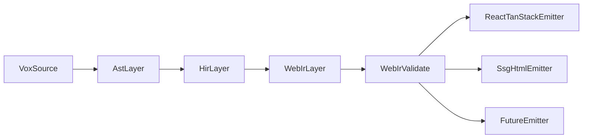

# ADR 012 — Internal Web IR strategy for Vox

**Status**: Accepted  
**Date**: 2026-03-26  
**Revised**: 2026-03-26

---

## Interop policy

`InteropNode` in `crates/vox-compiler/src/web_ir/mod.rs` records escape hatches and external refs; `validate::validate_web_ir` rejects empty interop fields before emit. Prefer narrow imports over raw `EscapeHatchExpr` fragments (see `crates/vox-compiler/src/web_ir/validate.rs`).

## Codegen naming (TypeScript / React)

Emitted TS/React identifiers should follow **English-first** naming where practical; stable `data-vox-*` DOM contracts remain until a versioned WebIR migration replaces them. Avoid **duplicate `Vox` tokens** in generated symbol names (`VoxVox*`). Details and side-by-side status: [Internal Web IR side-by-side schema](../architecture/internal-web-ir-side-by-side-schema.md#nomenclature-for-emitted-typescript--react).

## Context

Vox frontend generation is currently split across mixed representations:

- Path C reactive components emit from HIR (`reactive.rs`, `hir_emit/mod.rs`).
- `@component` legacy path still retains AST-shaped data (`HirComponent(pub ComponentDecl)`) in `hir/nodes/decl.rs`.
- JSX/island rewriting lives in multiple emitters (`codegen_ts/jsx.rs` and `codegen_ts/hir_emit/mod.rs`).
- Islands hydration contract is tied to generated mount attributes and client template behavior (`data-vox-island`, `data-prop-*`, `island-mount.tsx`).

This yields higher maintenance cost, divergence risk, and higher k-complexity for AI-first authoring.

---

## Current vs target representation (side-by-side)

Canonical mapping and full legacy registry:
[Internal Web IR side-by-side schema](../architecture/internal-web-ir-side-by-side-schema.md).
Quantified token+grammar+escape-hatch delta:
[WebIR K-complexity quantification](../architecture/internal-web-ir-side-by-side-schema.md#k-complexity-quantification).
Reproducible counting appendix:
[K-metric appendix](../architecture/internal-web-ir-side-by-side-schema.md#k-metric-appendix-reproducible).
Ordered file-operation roadmap:
[Operations catalog](../architecture/internal-web-ir-implementation-blueprint.md#operations-catalog-op-0001op-0320).

### Current island schema (implemented)

Source anchors:

- `crates/vox-compiler/src/parser/descent/decl/head.rs` (`parse_island`)
- `crates/vox-compiler/src/ast/decl/ui.rs` (`IslandDecl`, `IslandProp`)
- `crates/vox-compiler/src/hir/lower/mod.rs` (`Decl::Island -> HirIsland`)
- `crates/vox-compiler/src/codegen_ts/hir_emit/mod.rs` + `codegen_ts/jsx.rs` (dual island mount rewrite)
- `crates/vox-cli/src/templates/islands.rs` (runtime hydration parse)

Current shape:

```text
@island Name { prop: Type, prop2?: Type }
-> Decl::Island(IslandDecl { name, props: Vec<IslandProp> })
-> HirIsland(pub IslandDecl)
-> JSX rewrite to <div data-vox-island="Name" data-prop-*=... />
-> hydration reads data-prop-* values as strings
```

### Target completed WebIR schema

Source anchors:

- `crates/vox-compiler/src/web_ir/mod.rs`
- `crates/vox-compiler/src/web_ir/lower.rs`
- `crates/vox-compiler/src/web_ir/validate.rs`
- `crates/vox-compiler/src/web_ir/emit_tsx.rs`

Target shape:

```text
HIR -> WebIrModule {
  dom_nodes, view_roots, behavior_nodes, style_nodes, route_nodes, interop_nodes
}
with DomNode::IslandMount { island_name, props, ignored_child_count, span }
then validate_web_ir(...) before target emit
```

### Critical architectural difference

- Current model: representation semantics are split across parser/HIR and duplicated string emit paths.
- Target model: representation semantics are centralized in WebIR lower + validate, with printers consuming a stable internal schema.

### Parser-backed syntax boundaries (normative)

This ADR is constrained by syntax currently accepted by the parser and verified in tests:

- Component forms: `component Name(...) { ... }`, `@component Name(...) { ... }`, and `@component fn Name(...) to Element { ... }` (`crates/vox-compiler/src/parser/descent/decl/head.rs`, `crates/vox-compiler/src/parser/descent/decl/tail.rs`).
- Routes form: `routes { "path" to Component }` (`crates/vox-compiler/src/parser/descent/decl/tail.rs`).
- Island form: `@island Name { prop: Type prop2?: Type }` (`crates/vox-compiler/src/parser/descent/decl/head.rs`).
- Style form: `style { .class { prop: "value" } }` via `parse_style_blocks()` (`crates/vox-compiler/src/parser/descent/expr/style.rs`).
- Current island mount runtime contract: `data-vox-island` + `data-prop-*` read from DOM attributes in `island-mount.tsx` (`crates/vox-cli/src/templates/islands.rs`).

Non-parser forms and speculative grammar are out of scope for this ADR revision.

## Interop policy (OP-S103, OP-S104, OP-S150, OP-S183, OP-S213)

Raw escape hatches in [`InteropNode::EscapeHatchExpr`](../../crates/vox-compiler/src/web_ir/mod.rs) require **non-empty** `expr` and **policy `reason` strings** so `validate_web_ir` can fail closed under `VOX_WEBIR_VALIDATE`. Prefer [`InteropNode::ReactComponentRef`](../../crates/vox-compiler/src/web_ir/mod.rs) with explicit imports over opaque fragments. Gate matrix and numbered operations live in the [implementation blueprint](../architecture/internal-web-ir-implementation-blueprint.md#acceptance-gates-specific-filetest-thresholds).

### Gate naming alignment (OP-S051)

Documented CI gates **G1–G6** in the blueprint **Acceptance gates** table are the canonical names; parser/K-metric/parity rows in this ADR link to the same table. `VOX_WEBIR_VALIDATE` surfaces `web_ir_validate.*` diagnostic codes referenced there.

---

## Decision

Adopt **WebIR** as a first-class compiler layer between HIR and frontend target emitters.

- Keep **React/TanStack** as the primary target backend.
- Keep current island mount contract stable until an explicit `IslandMountV2` migration.
- Reduce framework-shaped syntax leakage into `.vox`.
- For bell-curve app work, new frontend semantics should land in **WebIR lower + validate** before adding emitter-only behavior.
- Emitter-only shortcuts are acceptable only for narrow printer details or temporary migration debt with an explicit backlog item.

---

## WebIR specification (normative)

### Root container

`WebIrModule` is the canonical frontend emission input:

- `dom_nodes: Vec<DomNode>`
- `view_roots: Vec<(String, DomNodeId)>` (reactive component name → root of lowered `view:`)
- `behavior_nodes: Vec<BehaviorNode>`
- `style_nodes: Vec<StyleNode>`
- `route_nodes: Vec<RouteNode>`
- `interop_nodes: Vec<InteropNode>`
- `diagnostic_nodes: Vec<WebIrDiagnostic>`
- `spans: SourceSpanTable`
- `version: WebIrVersion`

### Node families

1. `DomNode`: `Element`, `Text`, `Fragment`, `Slot`, `Conditional`, `Loop`, `IslandMount`, `Expr` (TS/JSX escape hatch leaf)
2. `BehaviorNode`: `StateDecl`, `DerivedDecl`, `EffectDecl`, `EventHandler`, `Action`
3. `StyleNode`: `Rule`, `Selector`, `Declaration`, `TokenRef`, `AtRule`
4. `RouteNode`: `RouteTree`, `LoaderContract`, `ServerFnContract`, `MutationContract`
5. `InteropNode`: `ReactComponentRef`, `ExternalModuleRef`, `EscapeHatchExpr`

### Nullability and safety policy

- Every optional field must be explicit and classified as `Required`, `Optional`, or `Defaulted`.
- Nullable semantics are resolved in lowering/validation stages, not at string-printer time.
- Emitters must not invent implicit `undefined` values for required fields.
- WebIR validation fails hard on unresolved optionality ambiguity at target boundary.

### Lowering boundaries

- AST/HIR -> `WebIrLoweringPass`
- WebIR -> `WebIrValidationPass`
- WebIR -> target emitters (`ReactTanStackEmitter`, `SsgHtmlEmitter`, future emitters)

### Compatibility contract

- Existing island hydration attributes are a compatibility surface and remain unchanged in phase 1 and phase 2.
- Any contract break requires a versioned migration (`IslandMountV2`) and fixture parity gate.

---

## Measurement model and quantified trade-offs

### Scoring method

Each strategy is scored using:

- criterion score `0..10`
- fixed weight by Vox priority
- confidence level (`High`, `Medium`, `Low`)

### Weighted scorecard

| Criterion | Weight | Path A: Current direct emit | Path B: WebIR + React target (chosen) | Path C: custom runtime first |
| --- | ---: | ---: | ---: | ---: |
| k-complexity reduction | 25 | 3 | 9 | 10 |
| maintainability | 20 | 4 | 8 | 7 |
| non-nullability/safety | 15 | 5 | 8 | 9 |
| React ecosystem interop | 20 | 10 | 9 | 4 |
| runtime/build performance | 10 | 6 | 8 | 9 |
| migration safety | 10 | 9 | 6 | 2 |
| **Weighted total (/100)** | **100** | **58.0** | **82.5** | **71.5** |

### Numeric rationale (worked example tie-in)

The canonical worked app quantification in the side-by-side doc reports:

- `tokenSurfaceScore`: `92 -> 68` (`-26.1%`)
- `grammarBranchScore`: `11 -> 7` (`-36.4%`)
- `escapeHatchPenalty`: `4 -> 1` (`-75.0%`)
- `kComposite`: `50.45 -> 36.60` (`-27.5%`)

How this maps to scorecard criteria:

1. `k-complexity reduction` (weight 25)
   - Rationale for Path B score `9/10`: nearly one-third composite reduction on parser-valid full-stack slice while preserving React interop boundary.
2. `maintainability` (weight 20)
   - Rationale for Path B score `8/10`: `grammarBranchScore` reduction correlates with fewer semantic ownership points (`jsx.rs`/`hir_emit/mod.rs` convergence into WebIR lowering).
3. `non-nullability/safety` (weight 15)
   - Rationale for Path B score `8/10`: explicit `FieldOptionality` + planned pre-emit validation moves ambiguity resolution earlier than string-print stages.
4. `React ecosystem interop` (weight 20)
   - Rationale for Path B score `9/10`: keeps compatibility surfaces (`data-vox-island`, React/TanStack emit targets) during migration instead of runtime replacement.

Confidence tags:

- High: parser-valid syntax boundaries, current output evidence, current WebIR module existence.
- Medium: projected gains from full validator and emitter cutover not yet complete in main path.

### Measurable baselines and targets

1. Duplicate emitter paths
   - Baseline: dual JSX/island pathways across `jsx.rs` and `hir_emit/mod.rs`.
   - Target: one canonical island rewrite surface in WebIR printer path.
2. Framework-shaped constructs in `.vox`
   - Baseline: mixed legacy hook/JSX influence.
   - Target: reduce framework-shaped author surface by at least 40% over migration window.
3. Nullability ambiguity at emit boundary
   - Baseline: ad hoc string-level fallback behavior.
   - Target: zero unresolved required-field ambiguity after WebIR validation.
4. Divergence defects
   - Baseline: feature updates often touch parallel emit paths.
   - Target: 50% fewer dual-path edits for new UI features after phase 2.

### Acceptance gates

- Canonical gate IDs and thresholds for this ADR are maintained in the blueprint table:
  [Acceptance gates (G1-G6)](../architecture/internal-web-ir-implementation-blueprint.md#acceptance-gates-specific-filetest-thresholds).
- This ADR intentionally references that single-source table to avoid drift between ADR prose and rollout thresholds.

---

## 90% functionality target

### Included capability (first-class)

- Component composition and props
- State/derived/effect lifecycle
- Event handlers and forms
- Routes/data loading and server function contracts
- Islands interop and hydration metadata

### Deliberate exclusions (escape hatch)

- Rare framework-internal timing hacks
- Exotic runtime hooks without stable cross-target semantics

### Pipeline



---

## Migration guardrails

### Phase 0: preflight contracts

- Add parity fixtures for generated outputs.
- Freeze island contract fixtures.

### Phase 1: UI convergence

- Lower AST-retained component bodies into WebIR-compatible form.
- Decommission duplicate JSX/island transform logic.

### Phase 2: route/style/data convergence

- Route/data contracts generated through `RouteNode`.
- Style semantics generated through `StyleNode` and validated selectors/declarations.

### Phase 3: policy and deprecation

- Mark direct framework-shaped patterns as legacy.
- Keep explicit interop escape hatches with policy and diagnostics.

---

## Assumption audit (confidence-graded)

| Assumption | Status | Confidence | Basis |
| --- | --- | --- | --- |
| React interop remains critical for Vox web adoption | Supported | High | React Compiler docs and Rules of React |
| Structured IR lowers long-term maintenance cost vs direct string emit | Supported | High | SWC architecture transform/codegen separation |
| Explicit optionality materially improves null-safety outcomes | Supported | High | TypeScript `strictNullChecks` model |
| A typed CSS value model is preferable to pure string CSS emit internals | Supported | Medium | CSS Typed OM model + Lightning CSS typed value surface |
| Full custom runtime should replace React near-term | Rejected (near-term) | Medium | Ecosystem and migration-risk trade-offs |
| WebIR can preserve >=90% practical React workflows with escape hatches | Supported | Medium | Current Vox islands + adapter model + compiler-backed interop boundary |
| Route/data payloads must remain serializable across server-client boundaries | Supported | Medium | React `use server` serialization constraints |

---

## External references used

- [React Compiler Introduction](https://react.dev/learn/react-compiler)
- [Compiling Libraries with React Compiler](https://react.dev/reference/react-compiler/compiling-libraries)
- [Rules of React](https://react.dev/reference/rules)
- [TypeScript strictNullChecks](https://www.typescriptlang.org/tsconfig/strictNullChecks.html)
- [ESTree base spec](https://raw.githubusercontent.com/estree/estree/master/es5.md)
- [JSX AST extensions](https://raw.githubusercontent.com/facebook/jsx/main/AST.md)
- [Babel parser AST and ESTree deviations](https://babel.dev/docs/babel-parser)
- [Svelte compiler parse/transform reference](https://svelte.dev/docs/svelte-compiler)
- [SWC architecture](https://raw.githubusercontent.com/swc-project/swc/main/ARCHITECTURE.md)
- [CSS Typed OM overview](https://developer.mozilla.org/en-US/docs/Web/API/CSS_Typed_OM_API)
- [Lightning CSS typed AST surface](https://raw.githubusercontent.com/parcel-bundler/lightningcss/master/node/ast.d.ts)
- [Astro islands architecture](https://docs.astro.build/en/concepts/islands/)
- [Qwik resumability concepts](https://qwik.dev/docs/concepts/resumable/)
- [esbuild FAQ](https://esbuild.github.io/faq/)

---

## Consequences

- Frontend codegen in `codegen_ts` moves to printer-over-WebIR architecture.
- New frontend features should land in WebIR lowering + validation first, then emitters.
- Documentation and implementation blueprint must stay linked to this ADR.
- Normative schema, `validate::validate_web_ir`, **`lower::lower_hir_to_web_ir`**, and **`emit_tsx::emit_component_view_tsx`** live in `crates/vox-compiler/src/web_ir/`. The main TS codegen path still uses `codegen_ts` directly; WebIR is the convergence layer for tests and future printer migration.
- Adjacent non-UI SSOT contracts now live in `crates/vox-compiler/src/app_contract.rs` and `crates/vox-compiler/src/runtime_projection.rs`; CI enforces parity tests so WebIR/AppContract/RuntimeProjection remain derived from the same HIR semantics.

---

## Related decisions and docs

- [ADR 010 — TanStack web spine](010-tanstack-web-spine.md)
- [Internal Web IR implementation blueprint](../architecture/internal-web-ir-implementation-blueprint.md)
- [Internal Web IR side-by-side schema](../architecture/internal-web-ir-side-by-side-schema.md)
- [Compiler Architecture](../explanation/expl-architecture.md)
- [Compiler Lowering Phases](../explanation/expl-compiler-lowering.md)
- [Vox web stack SSOT](../reference/vox-web-stack.md)
- [vox-codegen-ts API](../api/vox-codegen-ts.md)
