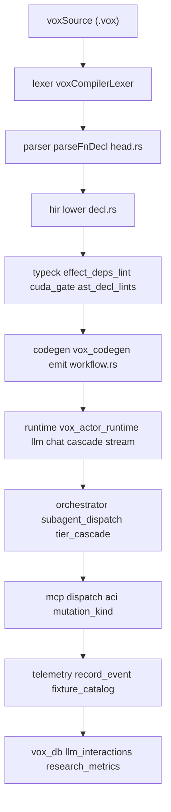

# AI-First Language Fixtures — Research (2026)

## Part 0 — Scope, prior art, and reading order

This document is **research only**. It names what already ships, what is missing, and how a future implementation plan should thread author-time fixtures through compile-time checks, Rust codegen, the durable LLM layer, orchestrator policy, MCP tools, and ACI without adding bare keywords ([`AGENTS.md`](../../AGENTS.md) grammar unification).

**Read next (mandatory prior art):** [`autonomous-orchestration-policy-research-2026.md`](autonomous-orchestration-policy-research-2026.md) (D1–D10), [`vox-language-rules-and-enforcement-plan-2026.md`](vox-language-rules-and-enforcement-plan-2026.md), [`mesh-mens-distributed-training-and-execution-plan-2026.md`](mesh-mens-distributed-training-and-execution-plan-2026.md) (MENS decorators), [`agentos-ssot-2026.md`](agentos-ssot-2026.md), [`search-retrieval-ssot-2026.md`](search-retrieval-ssot-2026.md), [`boilerplate-reduction-gap-analysis-2026.md`](boilerplate-reduction-gap-analysis-2026.md) (GA-21/22).

**Deliverables of this research turn:** narrative SSOT (this file), [`contracts/agentos/ai-first-fixtures.v1.yaml`](../../../contracts/agentos/ai-first-fixtures.v1.yaml) + [`ai-first-fixtures.v1.schema.json`](../../../contracts/agentos/ai-first-fixtures.v1.schema.json), registered telemetry envelope stubs (`fixture-model-intent-resolved`, `orch-subagent-dispatch`) in [`contracts/telemetry/events.v1.yaml`](../../../contracts/telemetry/events.v1.yaml).

## Part 1 — Audit verdict on the existing `@ai` surface

AI-first fixtures are **not** greenfield. The following already ship:

| Surface | Evidence |
| --- | --- |
| `@ai`, `@inference`, `@training_step`, `@distributed_train`, `@uses`, `@embed`, `@mcp.tool`, `@mcp.resource` as lexer tokens | `crates/vox-compiler/src/lexer/token.rs` — e.g. `AtMcpTool` / `AtMcpResource` L121–126, `AtAi` L167–168, `AtUses` L188–190, `AtEmbed` L194–196, `AtInference` L216–217, `AtTrainingStep` L219–221, `AtDistributedTrain` L222–223 |
| `@ai(model, structured_output, max_iterations)` parsing | `crates/vox-compiler/src/parser/descent/decl/head.rs` L1070–1121 |
| `@ai` Rust codegen: synchronous OpenRouter `reqwest` call, `temperature: 0.1`, `block_on`, no streaming/fallback/telemetry | `crates/vox-codegen/src/codegen_rust/emit/workflow.rs` L158–222 |
| Durable LLM activity + cascade | `crates/vox-actor-runtime/src/llm/{chat.rs, cascade.rs, types.rs}` |
| Subagent dispatch router | `crates/vox-orchestrator/src/subagent_dispatch.rs`: `DispatchRouter::route`, `SubAgentDispatchEvent` (`metric_type` aligns with `orch.subagent.dispatch`) |
| Model MCP + routing contracts | `contracts/mcp/tool-registry.canonical.yaml`, `contracts/orchestration/model-routing.v1.yaml`, `contracts/orchestration/providers.v1.yaml` |
| ACI `mutation_kind` | `contracts/aci/agent-computer-interface.v1.yaml`; `crates/vox-orchestrator-mcp/src/aci/` |

**Verified gaps:** no examples use `@ai` under `examples/`; `ai_structured_output_type` is parsed (L1090–1098 in `head.rs`) but **not** referenced in `emit_fn` (`workflow.rs` L158–222); no `@hole`, `@search`, `@subagent`, `@prompt` in lexer; no committed fixture catalog under `contracts/**/fixture*` before this work.

## Part 2 — Hard constraints from repo policy

| Constraint | Source | Enforcement |
| --- | --- | --- |
| New syntax is a **decorator** on a shipped block kind | [`AGENTS.md`](../../AGENTS.md) | Reject bare keywords (`agent`, `prompt`, `hole`, `search`, …) |
| Diagnostics use `vox/<category>/<kebab>` | [`vox-language-rules-phase2-lint-extension-2026.md`](vox-language-rules-phase2-lint-extension-2026.md) | Catalog `diagnostic_ids` |
| Secrets via `vox_secrets::resolve_secret` | [`AGENTS.md`](../../AGENTS.md) | No `env.get` in examples |
| Retired symbols banned | [`AGENTS.md`](../../AGENTS.md) | Catalog + doc grep |
| MCP names `vox_<verb>_<noun>` | `contracts/mcp/tool-registry.canonical.yaml` | `mcp_alignment` rows |
| ACI `mutation_kind` when not pure | `contracts/aci/agent-computer-interface.v1.yaml` | Every catalog row with effects |
| New contracts in [`contracts/index.yaml`](../../../contracts/index.yaml) | Policy | Discoverability |
| Automation is `.vox` + `vox run` | [`AGENTS.md`](../../AGENTS.md) | No new shell/python glue in plan |

## Part 3 — Current-state inventory

### Lexer (decorators for AI / effects / MCP)

`crates/vox-compiler/src/lexer/token.rs` — decorator block L116ff: MCP tokens L121–126; `@ai` L167–168; `@uses` L188–190; `@embed` L194–196; `@inference` / `@training_step` / `@distributed_train` L216–223.

### Parser (`parse_fn_decl` and `@ai` / `@uses`)

`crates/vox-compiler/src/parser/descent/decl/head.rs`:

- `parse_fn_decl` starts L957; LLM-related flags L967–977 (`is_llm`, `llm_model`, `ai_structured_output_type`, `ai_max_iterations`, `inference_model`, `training_step`, `decorator_effects`).
- `@ai` attribute parsing L1070–1121 (`model`, `structured_output`, `max_iterations`).
- `@uses(...)` on decorators L1122ff (effects + `mcp(tool)`).
- Post-signature `uses (...)` clause: `parse_uses_clause` L2010–2084.

### Codegen (Rust target)

`crates/vox-codegen/src/codegen_rust/emit/workflow.rs` `emit_fn` L136ff: branch `if func.is_llm` L158 builds OpenRouter JSON L187–199; **no** use of `func.ai_structured_output_type` in this path (gap for structured output).

### Runtime LLM substrate

`crates/vox-actor-runtime/src/llm/`: `mod.rs` re-exports; `types.rs` `LlmConfig`; `chat.rs` durable `llm_chat`; `cascade.rs` `chat_with_cascade`, `cascade_for_research_stage`, `cascade_with_optional_manual`, `ResearchStage` variants.

### Orchestrator

`crates/vox-orchestrator/src/subagent_dispatch.rs` — programmatic `DispatchRouter` / `DispatchSignal` / `DispatchDecision`.

`crates/vox-orchestrator/src/gate.rs` — `BudgetGate::check` (task-level gate; cited as runtime hook for cost-ceiling fixture rows).

Companion modules (`tier_cascade`, `budget_gate`, `risk_matrix`, …) implement D1–D10 per [`autonomous-orchestration-policy-research-2026.md`](autonomous-orchestration-policy-research-2026.md).

### Contracts

- `contracts/orchestration/model-routing.v1.yaml` — tiers, strengths, `task_categories`, safety cost caps.
- `contracts/orchestration/providers.v1.yaml` — provider catalog + `secret_id`.
- `contracts/aci/agent-computer-interface.v1.yaml` — `mutation_kind`.
- `contracts/capability/capability-registry.yaml` — capability ops.
- `contracts/mcp/tool-registry.canonical.yaml` — `vox_chat_message`, `vox_suggest_model`, `vox_research_run`, `vox_repo_query_text`, `vox_memory_search`, etc.
- `contracts/telemetry/events.v1.yaml` — event catalog (append-only rows).

### Prior art (do not duplicate)

[`autonomous-orchestration-policy-research-2026.md`](autonomous-orchestration-policy-research-2026.md); [`vox-language-rules-and-enforcement-plan-2026.md`](vox-language-rules-and-enforcement-plan-2026.md); [`mesh-mens-distributed-training-and-execution-plan-2026.md`](mesh-mens-distributed-training-and-execution-plan-2026.md); [`agentos-ssot-2026.md`](agentos-ssot-2026.md); [`search-retrieval-ssot-2026.md`](search-retrieval-ssot-2026.md); [`boilerplate-reduction-gap-analysis-2026.md`](boilerplate-reduction-gap-analysis-2026.md).

### Negative findings

- No `@ai` usage in `examples/` (repo grep).
- `structured_output` unused in codegen (Part 1).
- TypeScript / Web codegen parity for `@ai` is **out of scope** for this research; follow-on must name owners in codegen issue tracker / `where-things-live.md` (see risk R8).

## Part 4 — Fixture taxonomy (F1–F5)

### F1 — `agent_control`

- **Example (proposed):** `@subagent(policy = cap_chain, max_depth = 3)` on a `fn` plus `@uses(net, spawn)` — see catalog row `agent_control.cap_chain`.
- **Gap:** decorator missing; only programmatic dispatch today.
- **Decorator:** `@subagent` (ADR required).
- **Runtime hook:** `DispatchRouter::route` (`vox-orchestrator/src/subagent_dispatch.rs`).

### F2 — `model_selection`

- **Example:** extend `@ai` with `task_category`, `strengths`, `tier_max`, `cost_ceiling_usd_per_call`; keep `model` pin as escape hatch (`model_selection.provider_pin_with_fallback` catalog row shows shipped path).
- **Gap:** intent vocabulary lives in YAML contracts; parser only knows `model` / `structured_output` / `max_iterations` today.
- **Decorator:** extend `@ai` (no new bare keyword).
- **Runtime hooks:** `cascade_for_research_stage`, `BudgetGate::check`, codegen `emit_workflow_fn` per row.

### F3 — `query_template`

- **Example:** `@ai(structured_output = MyDto)` (parsed today); proposed `@prompt(stage = Planner, schema = Plan)` for cascade binding.
- **Gap:** structured output not wired in codegen; no `@prompt` token.
- **Runtime hooks:** `LlmConfig::response_format`, `chat_with_cascade`.

### F4 — `deferred_fill`

- **Example:** `@hole(spec, reviewer, cache_key)` on body; secondary `?ai("intent")` expression (lower priority).
- **Gap:** greenfield.
- **Decorator / syntax:** `@hole` and `?ai(...)` (both ADR required).
- **Runtime / compile hook:** proposed `check_unfilled_fixture_holes` in `vox-compiler` typeck (catalog); expression form attaches to parser.

### F5 — `search_substitution`

- **Example:** `@search(corpus = docs|memory|web, query = "...", into = T)` plus `@uses(...)`.
- **Gap:** retrieval today is MCP/CLI-first (`vox-search`, `execute_search_plan`).
- **Decorator:** `@search` (ADR required).
- **Hooks:** `execute_search_plan`, `MemoryManager::lookup_fact_by_key`, `cascade_with_optional_manual`.

**DO-NOT-INVENT (for downstream LLMs):** no bare keywords `agent`, `model`, `prompt`, `query`, `hole`, `search`, `router`, `constrain`; no Python-style `# TODO(ai)`; no new secret env vars; no new HTTP clients; no new crypto stack; no duplicate MCP tools; no `agent { }` block.

## Part 5 — Lifecycle pipeline



### Per-fixture pipeline touches

| Fixture id | Lexer/parse | HIR | Typeck | Codegen Rust | Actor LLM | Orchestrator | MCP/ACI | Telemetry |
| --- | --- | --- | --- | --- | --- | --- | --- | --- |
| agent_control.cap_chain | proposed | proposed | proposed | proposed | maybe | **yes** | **yes** | **yes** |
| agent_control.parallel_fanout | proposed | proposed | proposed | proposed | maybe | **yes** | **yes** | optional |
| model_selection.intent_routed | proposed | proposed | proposed | proposed | **yes** | **yes** | **yes** | **yes** |
| model_selection.cost_ceiling | proposed | proposed | proposed | proposed | maybe | **yes** | optional | optional |
| query_template.structured_output | **yes** | **yes** | partial | gap | **yes** | maybe | optional | optional |
| query_template.research_cascade | proposed | proposed | proposed | proposed | **yes** | maybe | **yes** | optional |
| deferred_fill.body_hole | proposed | proposed | **target** | proposed | no | no | no | optional |
| deferred_fill.expression_hole | proposed | proposed | **target** | proposed | no | no | no | optional |
| search_substitution.docs_lookup | proposed | proposed | proposed | proposed | optional | maybe | **yes** | optional |
| search_substitution.memory_recall | proposed | proposed | proposed | proposed | optional | **yes** | **yes** | optional |
| search_substitution.web_with_cascade | proposed | proposed | proposed | proposed | **yes** | maybe | **yes** | optional |
| model_selection.provider_pin_with_fallback | **yes** | **yes** | partial | **yes** | de facto | maybe | **yes** | optional |

## Part 6 — Catalog schema (YAML shape)

Authoritative JSON Schema: [`contracts/agentos/ai-first-fixtures.v1.schema.json`](../../../contracts/agentos/ai-first-fixtures.v1.schema.json).

```yaml
# contracts/agentos/ai-first-fixtures.v1.yaml (shape)
x-vox-version: 1
schema_version: 1
fixtures:
  - id: string
    class: agent_control | model_selection | query_template | deferred_fill | search_substitution
    intent: string
    syntax_shape: string
    parsed_today: bool
    parser_evidence: string   # file:line or "none"
    hir_lowering_today: bool
    codegen_today: bool
    runtime_hook:
      crate: string
      module: string
      function: string
    required_effects: [net | fs | db | env | clock | random | spawn | mcp | nothing]
    required_capabilities: [string]
    aci_mutation_kind: read_only | local_mutation | external_side_effect | unknown
    routing_hints: { ... optional ... }
    safety_invariants: [string]
    diagnostic_ids: [string]
    telemetry_events: [string]
    mcp_alignment: [string]
    secret_surface: [string]
    maturity: experimental | candidate | proposed | retired
    adr_required: bool
    examples: [{ title: string, code: string }]
    notes: string
```

## Part 7 — Seed catalog rows

**Canonical UTF-8:** [`contracts/agentos/ai-first-fixtures.v1.yaml`](../../../contracts/agentos/ai-first-fixtures.v1.yaml). The following block is a verbatim copy for offline reading (keep in sync with the contract file).

```yaml
x-vox-version: 1
schema_version: 1
fixtures:
  - id: agent_control.cap_chain
    class: agent_control
    intent: Declare spawn vs inline sub-agent policy with bounded chain depth at call sites.
    syntax_shape: "@subagent(policy = cap_chain, max_depth = 3) fn ..."
    parsed_today: false
    parser_evidence: none
    hir_lowering_today: false
    codegen_today: false
    runtime_hook:
      crate: vox-orchestrator
      module: subagent_dispatch
      function: DispatchRouter::route
    required_effects: [spawn, net]
    required_capabilities: []
    aci_mutation_kind: local_mutation
    routing_hints: {}
    safety_invariants:
      - chain_depth MUST be <= DispatchConfig.max_chain_depth (default 5)
    diagnostic_ids:
      - vox/subagent/chain-depth-exceeded
    telemetry_events:
      - orch-subagent-dispatch
    mcp_alignment:
      - vox_chat_message
    secret_surface: []
    maturity: proposed
    adr_required: true
    examples:
      - title: Proposed call-site policy
        code: |
          // vox:skip — proposed syntax; not yet in lexer
          @subagent(policy = cap_chain, max_depth = 3)
          @uses(net, spawn)
          fn delegate_review(pr: str) to str {
            return ""
          }
    notes: "Maps to D4 in autonomous-orchestration-policy-research-2026.md."

  - id: agent_control.parallel_fanout
    class: agent_control
    intent: Fan out independent subtasks under explicit parallelism and budget caps.
    syntax_shape: "@subagent(policy = parallel, max_depth = 2) fn ..."
    parsed_today: false
    parser_evidence: none
    hir_lowering_today: false
    codegen_today: false
    runtime_hook:
      crate: vox-orchestrator
      module: subagent_dispatch
      function: DispatchRouter::route
    required_effects: [spawn, net]
    required_capabilities: []
    aci_mutation_kind: external_side_effect
    routing_hints: {}
    diagnostic_ids:
      - vox/subagent/budget-exhausted-inline
    mcp_alignment:
      - vox_chat_message
    secret_surface: []
    maturity: proposed
    adr_required: true
    examples:
      - title: Proposed parallel fan-out
        code: |
          // vox:skip
          @subagent(policy = parallel, max_depth = 2)
          @uses(net, spawn)
          fn fanout_summaries(paths: str) to str {
            return ""
          }
    notes: "ACI external_side_effect when provider/network spend applies."

  - id: model_selection.intent_routed
    class: model_selection
    intent: Route by task category and strength tags per model-routing.v1.yaml.
    syntax_shape: "@ai(task_category = CodeGen, strengths = [codegen], tier_max = Pro) fn ..."
    parsed_today: false
    parser_evidence: "crates/vox-compiler/src/parser/descent/decl/head.rs:1070-1121 parses model, structured_output, max_iterations only"
    hir_lowering_today: false
    codegen_today: false
    runtime_hook:
      crate: vox-actor-runtime
      module: llm::cascade
      function: cascade_for_research_stage
    required_effects: [net]
    required_capabilities: []
    aci_mutation_kind: external_side_effect
    routing_hints:
      task_category: CodeGen
      strengths: [codegen]
      tier_max: Pro
    diagnostic_ids:
      - vox/ai/unknown-task-category
    telemetry_events:
      - fixture-model-intent-resolved
    mcp_alignment:
      - vox_suggest_model
      - vox_list_models
    secret_surface:
      - OpenRouterApiKey
    maturity: candidate
    adr_required: false
    examples:
      - title: Extend @ai payload (proposed)
        code: |
          // vox:skip
          @ai(task_category = CodeGen, strengths = [codegen], tier_max = Pro)
          @uses(net)
          fn codegen_stub(spec: str) to str {
            return ""
          }
    notes: "Spike S1 extends parser keys only."

  - id: model_selection.cost_ceiling
    class: model_selection
    intent: Cap per-call USD spend aligned with model-routing safety.max_cost_usd_per_request.
    syntax_shape: "@ai(cost_ceiling_usd_per_call = 0.5) fn ..."
    parsed_today: false
    parser_evidence: none
    hir_lowering_today: false
    codegen_today: false
    runtime_hook:
      crate: vox-orchestrator
      module: gate
      function: BudgetGate::check
    required_effects: [net]
    required_capabilities: []
    aci_mutation_kind: unknown
    routing_hints:
      cost_ceiling_usd_per_call: 0.5
    diagnostic_ids:
      - vox/ai/cost-ceiling-exceeded
    mcp_alignment:
      - vox_get_active_model
    secret_surface:
      - OpenRouterApiKey
    maturity: proposed
    adr_required: false
    examples:
      - title: Cost ceiling on LLM fn
        code: |
          // vox:skip
          @ai(cost_ceiling_usd_per_call = 0.5)
          @uses(net)
          fn cheap_stub(q: str) to str {
            return ""
          }
    notes: "Task-level gate lives in gate.rs::BudgetGate::check; tie-in to orchestrator policy/budget overlays is follow-on work."

  - id: query_template.structured_output
    class: query_template
    intent: Bind structured JSON/schema output to LlmConfig.response_format.
    syntax_shape: "@ai(structured_output = MyDto) fn ..."
    parsed_today: true
    parser_evidence: "crates/vox-compiler/src/parser/descent/decl/head.rs:1090-1098"
    hir_lowering_today: true
    codegen_today: false
    runtime_hook:
      crate: vox-actor-runtime
      module: llm::types
      function: LlmConfig::response_format
    required_effects: [net]
    required_capabilities: []
    aci_mutation_kind: external_side_effect
    diagnostic_ids:
      - vox/ai/structured-output-parse-failed
    mcp_alignment:
      - vox_generate_code
    secret_surface:
      - OpenRouterApiKey
    maturity: candidate
    adr_required: false
    examples:
      - title: Parsed today; codegen gap
        code: |
          @ai(structured_output = StubDto)
          @uses(net)
          fn with_schema(ctx: str) to str {
            return ""
          }
    notes: "crates/vox-codegen/src/codegen_rust/emit/workflow.rs does not wire ai_structured_output_type."

  - id: query_template.research_cascade
    class: query_template
    intent: Bind prompt template to ResearchStage defaults (temperature, max_tokens).
    syntax_shape: "@prompt(stage = Planner, schema = PlanV1) fn ..."
    parsed_today: false
    hir_lowering_today: false
    codegen_today: false
    runtime_hook:
      crate: vox-actor-runtime
      module: llm::cascade
      function: chat_with_cascade
    required_effects: [net]
    required_capabilities: []
    aci_mutation_kind: external_side_effect
    routing_hints:
      cascade_stage: Planner
    diagnostic_ids:
      - vox/prompt/invalid-stage
    mcp_alignment:
      - vox_research_run
    secret_surface:
      - OpenRouterApiKey
    maturity: proposed
    adr_required: true
    examples:
      - title: Proposed @prompt
        code: |
          // vox:skip
          @prompt(stage = Planner, schema = PlanBlob)
          @uses(net)
          fn plan_next(spec: str) to str {
            return ""
          }
    notes: "Spike S5; see cascade.rs apply_stage_defaults."

  - id: deferred_fill.body_hole
    class: deferred_fill
    intent: Mark function body for deferred AI fill with reviewer and cache key.
    syntax_shape: "@hole(spec, reviewer, cache_key) on fn body"
    parsed_today: false
    hir_lowering_today: false
    codegen_today: false
    runtime_hook:
      crate: vox-compiler
      module: typeck
      function: check_unfilled_fixture_holes
    required_effects: []
    required_capabilities: []
    aci_mutation_kind: read_only
    diagnostic_ids:
      - vox/fixture/unfilled-hole
      - vox/fixture/stale-hole
    mcp_alignment: []
    secret_surface: []
    maturity: proposed
    adr_required: true
    examples:
      - title: Proposed body hole
        code: |
          // vox:skip
          @hole(spec = "implement sort", reviewer = ci, cache_key = "sort-v1")
          @pure
          fn sort_items(items: str) to str {
            return ""
          }
    notes: "Runtime hook is compile/diagnostic until fill pipeline exists."

  - id: deferred_fill.expression_hole
    class: deferred_fill
    intent: Expression-position deferred fill (lower priority; hurts P3 locality).
    syntax_shape: "?ai(\"intent\")"
    parsed_today: false
    hir_lowering_today: false
    codegen_today: false
    runtime_hook:
      crate: vox-compiler
      module: parser
      function: parse_expr_primary
    required_effects: []
    required_capabilities: []
    aci_mutation_kind: read_only
    diagnostic_ids:
      - vox/fixture/expression-hole-unsupported
    mcp_alignment: []
    secret_surface: []
    maturity: proposed
    adr_required: true
    examples:
      - title: Deferred expression form
        code: |
          // vox:skip
          fn demo() to str {
            return ?ai("fill greeting")
          }
    notes: "Prefer body @hole over expression ?ai for Vox P3 locality."

  - id: search_substitution.docs_lookup
    class: search_substitution
    intent: Substitute code span with docs retrieval (read-only).
    syntax_shape: "@search(corpus = docs, query = \"...\", into = str) fn ..."
    parsed_today: false
    hir_lowering_today: false
    codegen_today: false
    runtime_hook:
      crate: vox-search
      module: execution
      function: execute_search_plan
    required_effects: [fs, net]
    required_capabilities: []
    aci_mutation_kind: read_only
    diagnostic_ids:
      - vox/search/corpus-denied
    mcp_alignment:
      - vox_repo_query_text
      - vox_memory_search
    secret_surface: []
    maturity: proposed
    adr_required: true
    examples:
      - title: Proposed docs search
        code: |
          // vox:skip
          @search(corpus = docs, query = "error handling policy", into = str)
          @uses(fs, net)
          fn load_policy_snippet() to str {
            return ""
          }
    notes: "Align MCP tool names with contracts/mcp/tool-registry.canonical.yaml at wire time."

  - id: search_substitution.memory_recall
    class: search_substitution
    intent: Substitute with MemoryManager lookup (not retired recall() API).
    syntax_shape: "@search(corpus = memory, query = \"...\", into = T) fn ..."
    parsed_today: false
    hir_lowering_today: false
    codegen_today: false
    runtime_hook:
      crate: vox-orchestrator
      module: memory::manager
      function: MemoryManager::lookup_fact_by_key
    required_effects: [db, net]
    required_capabilities: []
    aci_mutation_kind: read_only
    diagnostic_ids:
      - vox/search/memory-key-invalid
    mcp_alignment:
      - vox_memory_search
    secret_surface: []
    maturity: proposed
    adr_required: true
    examples:
      - title: Memory-backed substitution
        code: |
          // vox:skip
          @search(corpus = memory, query = "project:default:onboarding", into = str)
          @uses(db)
          fn recall_onboarding() to str {
            return ""
          }
    notes: "Use lookup_fact_by_key async boundary per AGENTS.md retired surfaces."

  - id: search_substitution.web_with_cascade
    class: search_substitution
    intent: Web retrieval with cascade_for_research_stage / manual endpoint option.
    syntax_shape: "@search(corpus = web, query = \"...\", into = str) fn ..."
    parsed_today: false
    hir_lowering_today: false
    codegen_today: false
    runtime_hook:
      crate: vox-actor-runtime
      module: llm::cascade
      function: cascade_with_optional_manual
    required_effects: [net]
    required_capabilities: []
    aci_mutation_kind: external_side_effect
    routing_hints:
      cascade_stage: Judge
    diagnostic_ids:
      - vox/search/web-policy-denied
    mcp_alignment:
      - vox_research_run
    secret_surface:
      - OpenRouterApiKey
    maturity: proposed
    adr_required: true
    examples:
      - title: Web search substitution
        code: |
          // vox:skip
          @search(corpus = web, query = "latest WASM spec section", into = str)
          @uses(net)
          fn web_snip() to str {
            return ""
          }
    notes: "Composes with deep-research and vox-search web tiers."

  - id: model_selection.provider_pin_with_fallback
    class: model_selection
    intent: Escape hatch — pin model string with orchestrator fallback_kind semantics.
    syntax_shape: "@ai(model = \"anthropic/claude-sonnet-4.6\") fn ..."
    parsed_today: true
    parser_evidence: "crates/vox-compiler/src/parser/descent/decl/head.rs:1083-1088"
    hir_lowering_today: true
    codegen_today: true
    runtime_hook:
      crate: vox-codegen
      module: codegen_rust::emit::workflow
      function: emit_workflow_fn
    required_effects: [net]
    required_capabilities: []
    aci_mutation_kind: external_side_effect
    diagnostic_ids:
      - vox/ai/openrouter-parse-failed
    mcp_alignment:
      - vox_set_model
      - vox_get_active_model
    secret_surface:
      - OpenRouterApiKey
    maturity: experimental
    adr_required: false
    examples:
      - title: Shipped @ai model pin
        code: |
          @ai(model = "openrouter/auto")
          @uses(net)
          fn llm_echo(msg: str) to str {
            return ""
          }
    notes: "Today lowers to OpenRouter-only block_on in workflow.rs; durability gap S3."
```

## Part 8 — ADR drafts (propose-new decorators)

### ADR-draft A — `@subagent`

- **Context:** Subagent policy is implemented in Rust (`DispatchRouter`) but not authorable on `fn` declarations.
- **Decision:** Introduce `@subagent(policy, max_depth, ...)` as a decorator on `fn` / call surfaces; lower to `DispatchSignal` fields and enforce chain depth vs `DispatchConfig`.
- **Consequences:** New lexer token + parser + HIR field (`ai_fixture`-style enum per risk R7). Telemetry uses `orch-subagent-dispatch`.
- **Closed-keyword justification:** `subagent fn` is rejected; `@subagent` composes on `fn`.

### ADR-draft B — `@prompt`

- **Context:** Research stages already exist in `cascade.rs` but are not bound to Vox functions.
- **Decision:** `@prompt(stage: ResearchStage, schema: Type, optional redact[])` on `fn`, requiring `@uses(net)` where applicable.
- **Consequences:** Parser + codegen to call `chat_with_cascade` / stage defaults; optional `redact[]` for secret leakage (risk R3).
- **Closed-keyword justification:** Same pattern as `@ai`.

### ADR-draft C — `@hole`

- **Context:** Teams want deferred AI fill with reviewer accountability.
- **Decision:** Body-attached `@hole(spec, reviewer, cache_key, constraints[])` produces compile errors until filled or approved; CI can gate staleness via `vox/fixture/stale-hole`.
- **Consequences:** Highest scrutiny: must not become silent `TODO`. Expression `?ai` is secondary.
- **Closed-keyword justification:** No `hole` block keyword.

### ADR-draft D — `@search`

- **Context:** `vox-search` + MCP tools exist; authors cannot declare retrieval intents in `.vox`.
- **Decision:** `@search(corpus, query, into, top_k?, policy?)` lowers to `execute_search_plan` or memory/web helpers; default ACI `read_only` except web tiers that spend provider quota (external_side_effect rows).
- **Consequences:** Capability + CSP projection hooks on mobile/web Packager.
- **Closed-keyword justification:** Composes on `fn`.

**HIR note (risk R7):** Implementation should converge on `HirFn.ai_fixture: Option<AiFixture>` rather than unbounded boolean siblings.

## Part 9 — Feasibility spike backlog

| Spike ID | Description | Files inspected (read-only) | Acceptance signal | Containment / rollback |
| --- | --- | --- | --- | --- |
| S1 | Extend `@ai(...)` parser to accept `task_category`, `strengths[]`, `tier_max`, `cost_ceiling_usd_per_call` (parser-only, no codegen change) | `crates/vox-compiler/src/parser/descent/decl/head.rs:1070-1121`; tests `crates/vox-compiler/tests/mens_decorators.rs` | Failing test for new keys passes after adding match arms; existing `@ai` still parses | Behind `cfg(test)` until follow-on plan; rollback = revert single PR |
| S2 | Lower `@ai.structured_output` to runtime `LlmConfig.response_format` | `crates/vox-codegen/src/codegen_rust/emit/workflow.rs:158-225`; `crates/vox-actor-runtime/src/llm/types.rs:39-41` | Generated code injects `response_format` JSON Schema and parses typed result | Feature flag `vox-cfg ai-structured-output`; rollback = revert |
| S3 | Replace `@ai` codegen `runtime.block_on(...)` with `llm_chat` durable activity call | same as S2 + `crates/vox-actor-runtime/src/llm/chat.rs` | Generated `@ai` fn becomes `async fn`; existing tests green; new test asserts telemetry row written | Codegen behind `is_durable` flag on HirFn |
| S4 | Define `@subagent` decorator at parser-only level lowering to `DispatchSignal` | `crates/vox-compiler/src/parser/descent/decl/head.rs`; `crates/vox-orchestrator/src/subagent_dispatch.rs` | Parser test creates a `DispatchSignal` JSON via dry-run | No codegen yet; ADR draft attached |
| S5 | Define `@prompt(stage: ResearchStage)` lowering to `cascade_for_research_stage` | parser + `crates/vox-actor-runtime/src/llm/cascade.rs` | Snapshot test of generated cascade vector for each stage | Behind `cfg(test)` |
| S6 | Define `@search(corpus, query, into)` parser + read-only ACI envelope spike | parser + `crates/vox-search/src/lib.rs` + `crates/vox-orchestrator-mcp/src/aci/envelope.rs` | Mock dispatch returns `mutation_kind: read_only` envelope; typed `into` deserializes | Read-only by construction |
| S7 | `vox check --explain vox/fixture/missing-effect` precursor | `crates/vox-code-audit/src/diagnostics/` (when Phase 2 lands); for now stub a JSON catalog row | New diagnostic ID registered; `--for-llm` JSON shape matches Phase 2 schema | Pure additive |
| S8 | `@hole` body decorator parser spike with `reviewer`, `cache_key`, `constraints` (NO codegen — type-error if encountered) | parser + new typeck rule `vox/fixture/unfilled-hole` | Compiling a `@hole` body fails with structured diagnostic; CLI prints fill instructions | Cannot escape the type error — safe by construction |

**Ranking:** S1 + S2 + S5 highest leverage; S3 unlocks durability; S4 + S6 + S8 require ADRs and should follow S1/S2.

## Part 10 — Risk register

| ID | Risk | Likelihood | Mitigation pinned in research doc |
| --- | --- | --- | --- |
| R1 | Hidden global state via `vox_set_active_model` collides with per-call `@ai(model = ...)` | High | Make `@ai` payload always win; document precedence; test in S1 |
| R2 | Codegen explosion if every `@ai` fn gains stream + fallback + telemetry | Medium | S3 routes through `llm_chat` (already implements all three) — codegen size unchanged |
| R3 | Secret leakage if `@prompt` body interpolates raw values | High | Mandatory `redact[]` field on `@prompt`; runtime redactor (Phase 4 Task 5 of language rules) gates emission |
| R4 | ACI envelope drift when fixtures bypass MCP path | Medium | `aci_mutation_kind` required on every catalog row with `runtime_effect != pure` |
| R5 | Phase 5 effect inference collision (auto-derived `net` vs declared `@uses(net)`) | Medium | Catalog row `required_effects` must match Phase 5 inferrable set |
| R6 | Closed-keyword-table breach (someone proposes `agent { }` block) | Medium | Part 4 DO-NOT-INVENT list + self-review grep |
| R7 | Decorator surface fragments across HIR — `is_llm`, `inference_model`, `training_step` are siblings of a future `is_subagent`, `is_prompt`, `is_hole` | High | Introduce unified `HirFn.ai_fixture: Option<AiFixture>` enum (Part 8) |
| R8 | TS codegen target lacks `@ai` lowering — silent gap on full-stack apps | High | Explicitly mark TS-target out of scope here; file follow-on in `where-things-live.md` / implementation plan |
| R9 | `@hole` becomes a perpetual TODO substrate, never filled | Medium | Mandatory `cache_key` + `reviewer` + CI guard `vox/fixture/stale-hole` (>= N days) |
| R10 | Diagnostic ID drift between catalog and `vox-code-audit` Phase 2 catalog | Medium | Catalog row `diagnostic_ids` validated against `crates/vox-code-audit/src/diagnostics/catalog.rs` once Phase 2 lands; for now embed the future IDs in the catalog and mark `maturity: proposed` |
| R11 | Provider name string drift (`openrouter` vs `OpenRouter` vs `open_router`) between Vox and contracts | Medium | Catalog row `routing_hints.tier_max` uses contract enum casing only |
| R12 | Prior-art research is bypassed and fixtures duplicate D1–D10 logic in source | High | Part 3 inventory is mandatory reading; tie rows to D4/D6/etc. explicitly |

## Part 11 — Anti-goals

- A new bare keyword (`agent`, `model`, `prompt`, `query`, `hole`, `search`, `router`).
- A new MCP tool that duplicates `vox_chat_message`, `vox_set_active_model`, `vox_suggest_model`, etc.
- Any reference to `vox-dei`, `vox-ars`, `vox-ludus`, `recall()`, `TURSO_URL`, `@server fn`, `@py.import`.
- Inventing a new effect family beyond `EffectAnnotation::from_keyword` set without flagging as Phase 5 dependency.
- A "lint server" microservice (Phase 2 forbids).
- A python or shell script in `scripts/` for automation glue (use `.vox` only per policy).
- New crypto stacks.
- Implementation code in **this** research turn beyond contracts/docs (implementation plan follows).

## Part 12 — Open questions

1. Should `@ai` functions become `async` by default once S3 lands, or remain sync wrappers for a transition window?
2. Where should `check_unfilled_fixture_holes` live long-term — `typeck` crate boundary vs dedicated `vox-fixture-lint` crate for faster iteration?
3. How should `routing_hints.tier_max` map onto `model-routing.v1.yaml` when Gemini strength tables add new `task_categories`?
4. Does `@search(into = MyDto)` reuse `@ai(structured_output = MyDto)` machinery, or a separate schema registry?
5. What is the minimal telemetry set to prove fixture adoption (one event vs full matrix)?
6. Should orchestrator budget overlays subsume `BudgetGate::check` for author-declared `cost_ceiling_usd_per_call`, or stay layered?

## Part 13 — Follow-on implementation-plan seed

**Next artifact:** `docs/src/architecture/ai-first-fixtures-impl-plan-phase1-2026.md` — scoped to S1+S2 behind feature flags, then S3 with async migration notes, with explicit acceptance tests drawn from catalog rows `model_selection.intent_routed`, `query_template.structured_output`, and `model_selection.provider_pin_with_fallback`. Phase 1 should refuse to ship new decorators (`@subagent`, `@prompt`, `@hole`, `@search`) until ADR votes land.

**Verification note (contracts-index):** `contracts/aci/agent-computer-interface.v1.yaml` was incorrectly validated against the MCP **response** schema (requires `success`). This is fixed by [`agent-computer-interface-ssot.v1.schema.json`](../../../contracts/aci/agent-computer-interface-ssot.v1.schema.json) plus a `YAML_CONTRACT_SCHEMA_ID_OVERRIDES` entry in `crates/vox-cli/src/commands/ci/contracts_index.rs`. Run `vox ci contracts-index` after merge.

## See also

- [`autonomous-orchestration-policy-research-2026.md`](autonomous-orchestration-policy-research-2026.md)
- [`vox-language-rules-and-enforcement-plan-2026.md`](vox-language-rules-and-enforcement-plan-2026.md)
- [`mesh-mens-distributed-training-and-execution-plan-2026.md`](mesh-mens-distributed-training-and-execution-plan-2026.md)
- [`agentos-ssot-2026.md`](agentos-ssot-2026.md)
- [`search-retrieval-ssot-2026.md`](search-retrieval-ssot-2026.md)
- [`boilerplate-reduction-gap-analysis-2026.md`](boilerplate-reduction-gap-analysis-2026.md)
- [`where-things-live.md`](where-things-live.md)
- [`research-index.md`](research-index.md)

## Appendix — Self-review checklist (plan §17)

- [x] Every cited path in Parts 1–3 exists in the workspace (`Glob` / spot reads 2026-05-11).
- [x] Catalog rows avoid retired symbols from [`AGENTS.md`](../../AGENTS.md).
- [x] No bare keyword proposals; proposed syntax uses `@decorator` or expression hole.
- [x] Every fixture row lists `required_effects` and `aci_mutation_kind`.
- [x] ADR drafts exist for `@subagent`, `@prompt`, `@hole`, `@search`.
- [x] Diagnostic IDs match `vox/<category>/<kebab>`.
- [x] Examples use `vox_secrets` indirectly via runtime (no `env.get`).
- [x] No banned tooling/crates list items in prose.
- [x] Mermaid node IDs are alphanumeric/underscore safe.
- [x] `contracts/index.yaml` lists ai-first catalog + schema + telemetry schemas.
- [x] `research-index.md` includes **AI-First Language Fixtures** section.
- [x] Open questions between 3 and 8.
- [x] Follow-on plan filename declared (Part 13).
- [x] No emoji in this document.
