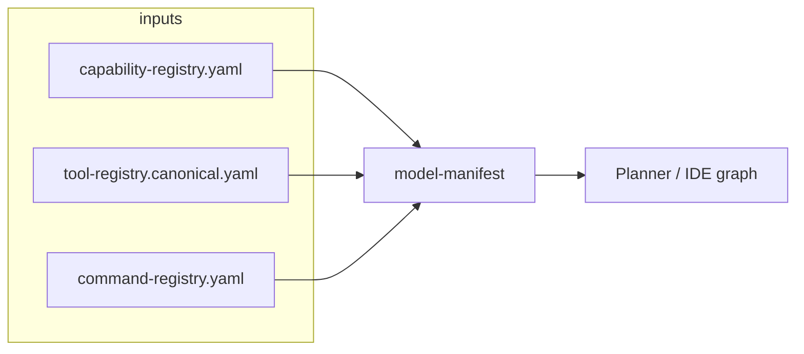

# Capability visualization views

This document specifies **what** to render and **which artifacts** to load. Implementation is optional; the contracts and CLI/MCP surfaces already exist.

## Capability map (graph)

- **Nodes:** implicit `mcp.*` and `cli.*` ids from [`capability-registry.yaml`](../../../contracts/capability/capability-registry.yaml) plus curated rows with `mcp_tool` / `cli_paths`.
- **Edges:** `runtime_builtin_maps` links, explicit `cli_paths` ↔ `mcp_tool` when both set on one row.
- **Source at runtime:** MCP **`vox_capability_model_manifest`** (merged JSON) or file [`model-manifest.generated.json`](../../../contracts/capability/model-manifest.generated.json) after **`vox ci capability-sync`**.

## Repo discovery strip

- **Payload:** [`repo-workspace-status.schema.json`](../../../contracts/repository/repo-workspace-status.schema.json) — CLI **`vox repo status --json`** or MCP **`vox_repo_status`**.
- **UI:** single row: `repository_id`, marker booleans, optional `cargo_workspace_members` count.

## Project scaffold

- **Write path:** CLI **`vox init`** or MCP **`vox_project_init`** (optional **`target_subdir`** under the bound repo).
- **Success payload:** [`vox-project-scaffold-result.schema.json`](../../../contracts/repository/vox-project-scaffold-result.schema.json).

## Agent handoff timeline

- **Payload:** takeover bundle in [`agent-vcs-facade.schema.json`](../../../contracts/orchestration/agent-vcs-facade.schema.json); CLI **`vox dei takeover-status`** (add **`--human`** for a text summary).
- **UI:** workspace card + last N snapshots + last N oplog entries (tables).

## Cross-repo query trace

- **Payload:** `CrossRepoQueryTrace` on `vox_repo_query_*` responses (`source_plane`, `trace_id`, latency).
- **UI:** collapsible “last query” panel for debugging polyrepo search.
