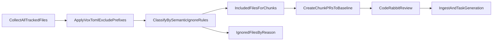

# CodeRabbit review coverage SSOT

This page defines how Vox achieves a practical 0-100% CodeRabbit review posture for repositories where CodeRabbit is primarily PR-diff driven.

## Scope and definitions

- **Coverage unit:** a repository path that is included in a semantic CodeRabbit chunk manifest.
- **Candidate set:** files collected by `vox review coderabbit semantic-submit --full-repo` after `Vox.toml` `exclude_prefixes` are applied.
- **Included set:** candidate files that survive hard semantic planner ignore rules and are assigned to chunk PRs.
- **Ignored set:** candidate files dropped by hard planner rules (for example generated artifacts, local tooling paths, and extension-level exclusions).

Coverage is therefore:

`coverage_ratio = included_set / candidate_set`

The semantic manifest now records all three counters (`candidate_files`, `included_files`, `ignored_files`) so each run has an auditable denominator and numerator.

## Canonical workflow for full-review waves

1. Run `vox review coderabbit semantic-submit --full-repo` in plan mode.
2. Confirm manifest coverage counters and ignored-reason summary match expectations.
3. Execute `vox review coderabbit semantic-submit --full-repo --execute`.
4. Use `.coderabbit/run-state.json` for resume (`--resume`) on interruptions.
5. Ingest findings with `vox review coderabbit ingest <pr>` and materialize tasks with `vox review coderabbit tasks <pr>`.

## Coverage policy defaults

- Full-repo coverage is anchored on `semantic-submit --full-repo` because it uses `git ls-files`.
- The default policy is **code-first coverage**; docs/data/tooling paths can remain excluded when they are not part of the review objective.
- If a release requires doc review, run a dedicated documentation wave by temporarily narrowing exclusions and re-running semantic-submit.

## Why 100% is operational, not absolute

CodeRabbit reviews PR changes and uses repository context. The system should not assume line-by-line commentary on files with no meaningful diff context. Vox therefore treats "100% reviewed" as:

- every in-scope path appears in at least one included chunk in the wave, and
- each chunk receives CodeRabbit review completion before wave closure.

## Lane hardening and persistent state

- **State file:** `.coderabbit/run-state.json` is authoritative for resumability.
- **Manifest file:** `.coderabbit/semantic-manifest.json` is authoritative for planned coverage and chunk mapping.
- **Workspace hygiene:** `.coderabbit/worktrees/` remains non-review tooling state and is never included as review payload.
- **VoxDB authority:** external review intelligence is persisted in `external_review_*` tables and treated as the authoritative source for ingest replay, reporting, and dataset export.

## Ingest contract (VoxDB-first)

- Placement kinds are canonicalized as `inline`, `review_summary`, `issue_comment`, `reply`.
- Identity fields are always captured: `finding_identity`, `thread_identity`, `source_payload_hash`.
- Ingest writes to VoxDB first; local `.coderabbit/ingested_findings.json` is an optional mirror.
- Re-ingest safety is enforced by fingerprint uniqueness and run-level idempotency keys.

## Recovery and dead-letter runbook

Use this sequence for broken ingest windows or parser drift:

1. Run `vox review coderabbit db-report <pr> --json` and inspect deadletter counts.
2. Retry specific rows with `vox review coderabbit deadletter-retry <id>`.
3. If historical local cache exists, run `vox review coderabbit db-backfill`.
4. Re-run ingest with explicit idempotency key and replay window metadata.
5. Confirm `db-report` shows stable finding counts and reduced deadletter backlog.

## Rollout stages (VoxDB-first cutover)

- **Stage A (dark launch):** run `ingest` with DB writes enabled and optional cache mirror (`--db-and-cache`), compare counts with historical cache snapshots.
- **Stage B (dataset sync):** enable `learning-sync` in scheduled loop and verify `review_findings.jsonl` validates every cycle.
- **Stage C (gate enforcement):** publish `review_metrics.json` per cycle and enforce `review_recurrence` eval gate thresholds.
- **Stage D (deprecate file-first):** keep `.coderabbit/ingested_findings.json` as recovery-only artifact, not operational source of truth.

## Failure checklist

Use this checklist when lanes fail or reviews do not trigger:

1. Verify GitHub App install and repository allowlist for CodeRabbit.
2. Verify PR author has an active CodeRabbit seat.
3. Confirm `Vox.toml` tier matches active account tier limits.
4. Confirm branch/base topology: chunk PRs must target the generated baseline.
5. For interrupted runs, continue with `--resume`; do not regenerate a conflicting baseline branch unless intentionally starting a new wave.

## Re-verification cadence

- Re-check CodeRabbit limit tables quarterly or when account tier changes.
- Keep `crates/vox-cli/src/commands/review/coderabbit/limits.rs` synchronized with verified limits and update the verification date.
