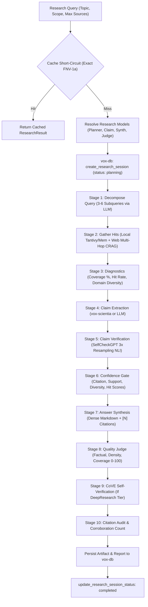
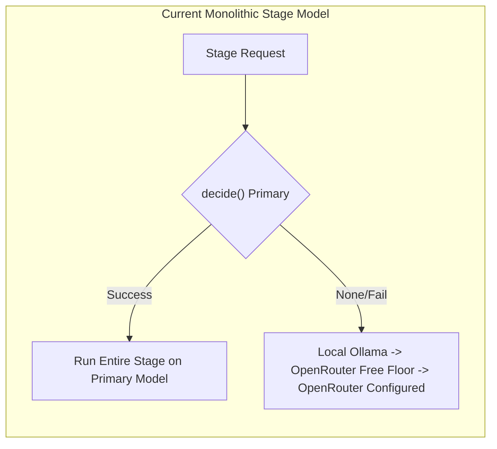
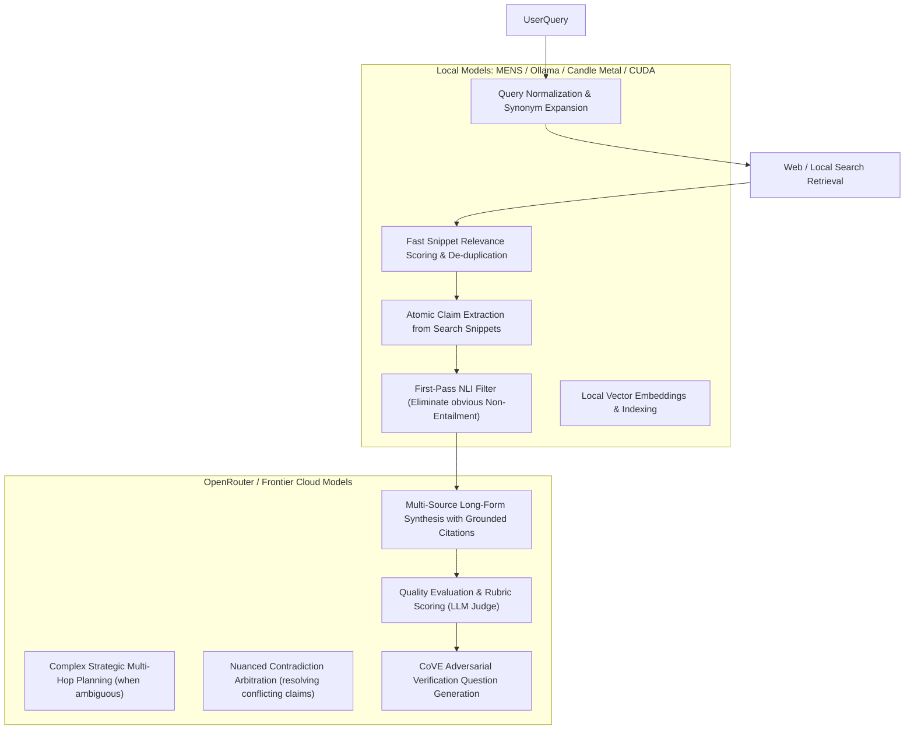
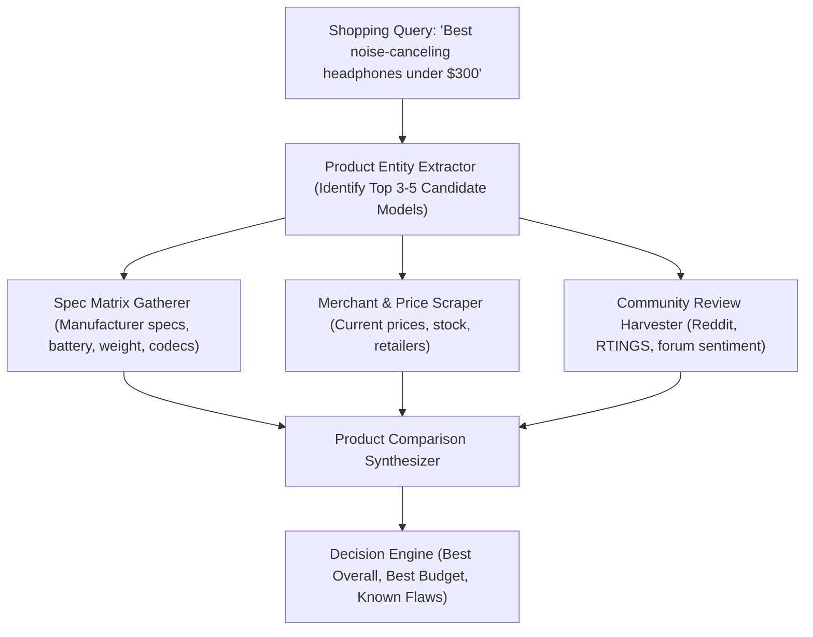
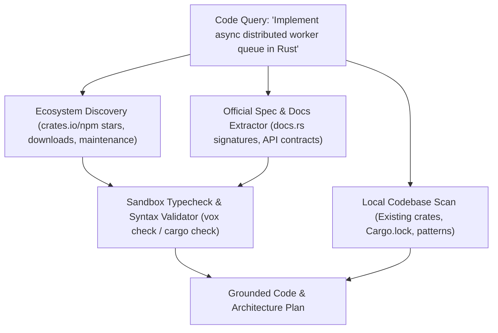
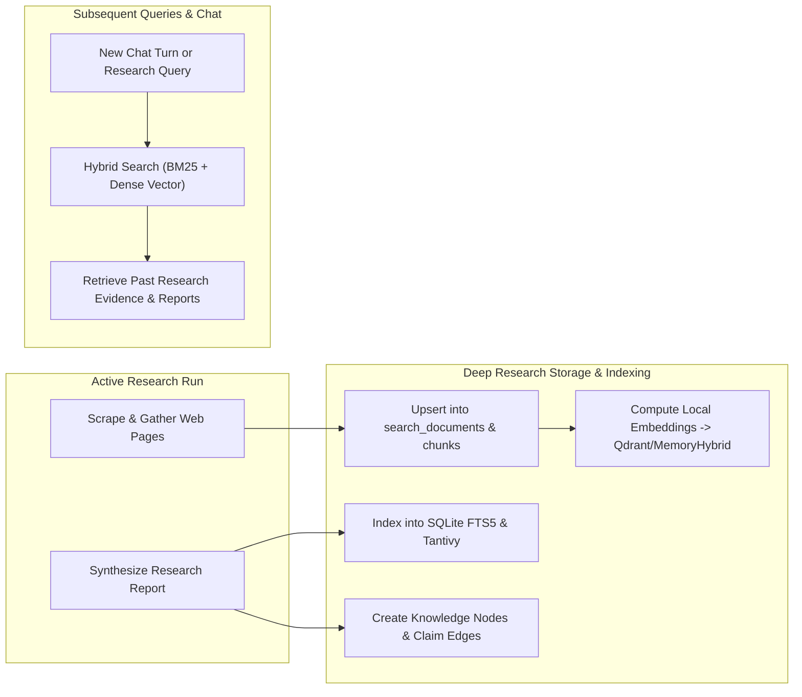
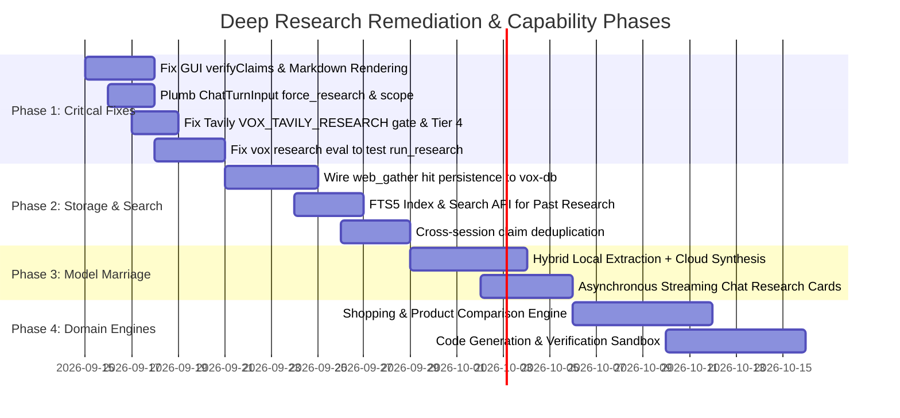

# Deep Research Full-Surface Audit, Architecture, and Roadmap (September 2026)

This document provides a comprehensive, code-level audit of the entire Deep Research capability surface in Vox—tracing from the lowest-level retrieval and search primitives in `vox-search`, up through the multi-stage research orchestrator in `vox-research-shim`, storage in `vox-db`, MCP and orchestrator daemon APIs, chat integration, and all the way to the Tauri IPC commands and React components in `vox-gui`.

It evaluates the functioning and accuracy of our system, examines how to marry OpenRouter and local models, details first-party answers to shopping/product and code-generation research, assesses the storage/search loops, and highlights critical bugs that currently prevent components from functioning or displaying properly.

---

## 1. Executive Summary & Shipped Reality vs. Intent

Vox has built extensive and mathematically principled infrastructure for verifiable, citation-backed deep research:
- **Ten-stage pipeline in `vox-research-shim`**: Query decomposition, multi-hop CRAG web/local gathering, retrieval diagnostics, claim extraction, SelfCheckGPT-style NLI resampling verification, 4-signal confidence gating, LLM answer synthesis, quality judging, CoVE self-verification, and citation precision auditing.
- **Search dispatcher in `vox-search`**: SearXNG, DuckDuckGo fallback, Tavily web search, Tavily `/research` tier, HTML scraping with text density filtering, MinHash novelty scoring, CrossRef/DOI retraction trust checking, and multi-domain corroboration scoring.
- **Durable data model in `vox-db`**: Tables for sessions, claims, verdicts, evidence spans, artifacts, and research metrics.
- **GUI and CLI interfaces**: A dedicated Research view in `vox-gui`, a Scientia research dashboard, and `vox research` CLI subcommands.

However, a rigorous trace across the codebase reveals **several critical disconnects, silent bugs, and architectural dead-ends**:

| Component | Shipped Code Reality | User Intent / Design Spec | Severity |
| :--- | :--- | :--- | :--- |
| **GUI Trust UI** | `startResearchAsync` in `ResearchView.tsx` omits `verifyClaims`. Backend defaults to `false`. `claim_verdicts` is empty. | `HeadlineVerdictBanner` and `ResearchClaimAccordion` should display claim verdicts, stability, and trust chips. | **Critical Bug** (Trust UI never renders for new GUI sessions) |
| **GUI Report Display** | Rendered inside a plain `<pre>` tag (`ResearchView.tsx:217`). | Rich Markdown with headings, tables, formatted citations, and clickable URLs. | **High UX Gap** |
| **Chat Research Wiring** | `ChatTurnInput` and `sync_tool_args` in `chat_turn.rs` completely drop `force_research` and `research_scope`. | Users should be able to trigger deep research from chat turns via toggle or slash command. | **High Gap** (Chat cannot invoke research without secret tag) |
| **Chat Research Execution** | Synchronous blocking call (`perform_autonomous_research`). Blocks chat turn for 30–60s with no stream. | Asynchronous, streamed progress updates with an embedded research artifact card. | **High Latency / Timeout Hazard** |
| **Research Storage Loop** | `web_gather.rs` receives `_db` and `_session_id`, marks them with underscores, and never saves hits. `ingest_research_document_async` is orphaned. | Full text of gathered pages and chunks should be indexed into `search_documents` and searchable by future research/chat. | **Critical Architectural Gap** (Research memory is amnesic) |
| **Tavily Integration** | Tavily `/research` requires `VOX_TAVILY_RESEARCH=1` even if `TAVILY_API_KEY` is present. Web search is Tier 4 fallback (starved if DDG returns 1 hit). | If user has `TAVILY_API_KEY`, Tavily should be prioritized or easily toggled without obscure env flags. | **Friction / Starvation Bug** |
| **Model Division of Labor** | Monolithic cascade per stage. No division between local models and cloud models. Local models are forced to do 10k token synthesis or nothing. | Local models handle high-frequency extraction, query expansion, and filtering; OpenRouter handles complex synthesis and arbitration. | **Architecture Gap** (Token waste / local failure) |
| **Evaluation Harness** | `vox research eval` (`eval.rs`) calls `execute_search_plan` directly and joins raw search snippets as `model_answer`. Never runs `run_research`! | Eval should measure end-to-end pipeline accuracy, claim hallucination rate, citation precision, and synthesis coherence. | **Verification Illusion** |
| **Domain Specialization** | Zero domain awareness for Shopping (specs, prices, merchants, reviews) or Code Generation (crates/npm metadata, docs.rs, AST validation). | First-party research extractors and synthesizers tailored for products and code generation. | **Missing Capability** |

---

## 2. End-to-End Architectural Pipeline Trace

The core research pipeline is implemented in `crates/vox-research-shim/src/research/orchestrator/pipeline.rs` via `run_research_with_context_and_session`.



### Stage-by-Stage Functioning & Findings

1. **Cache Short-Circuit (`pipeline_cache.rs`)**:
   - Computes FNV-1a hash of `(query, scope, max_sources, verify_claims)`.
   - Performs an exact-match lookup in `scientia_research_cache`.
   - *Limitation*: No semantic or embedding similarity. Minor query rewordings result in a complete cache miss.
2. **Model Resolution (`model_select.rs`, `model_dispatch.rs`)**:
   - Resolves 4 model roles: `planner_model`, `claim_model`, `synthesis_model`, `judge_model`.
   - Uses `SelectionIntent::research()` and `SelectionIntent::review()` against `vox_orchestrator::models::decide`.
3. **Stage 1 — Query Planning (`planner.rs`)**:
   - Uses LLM cascade to decompose the query into 3 to 6 targeted subqueries.
   - Falls back to `planner_degraded = true` with the single original query if the LLM fails or is unconfigured.
4. **Stage 2 — Web & Local Retrieval (`web_gather.rs`, `vox-search`)**:
   - **Local Retrieval**: Uses `SearchRuntimeContext` to query local repository files, Tantivy indices, memory markdown, and knowledge graph rows.
   - **Web Retrieval**:
     - Evaluates Tavily `/research` if `VOX_TAVILY_RESEARCH=1` is active.
     - Iterates subqueries through `ProviderRegistry::search` -> `WebSearchDispatcher::search`.
     - Hits are filtered for novelty via `NoveltyScorer` (4-gram shingle overlap).
     - Refines queries using `CragRouter` multi-hop loop (up to `web_search_max_hops`).
     - Scrapes pages if `web-scrape` feature is enabled.
   - *Critical Defect*: `gather_web_hits_for_plan` receives `_db: Option<&Codex>, _session_id: i64`, but marks both with underscores and ignores them completely. None of the fetched hits, scraped text, or web chunks are saved to the database.
5. **Stage 3 — Retrieval Diagnostics (`pipeline.rs:224-291`)**:
   - Calculates lexical query term coverage, subquery coverage percentage, provider score averages, and distinct domain counts.
6. **Stage 4 — Claim Extraction (`claims.rs`)**:
   - If feature `scientia-claims` is active, routes through `vox_scientia::claim_extractor`.
   - Otherwise, prompts LLM to output atomic JSON claims with heuristic flags (`is_numeric`, `is_recent`, `is_named_event`).
7. **Stage 5 — Claim Verification & Resampling (`verifier.rs`)**:
   - Implements SelfCheckGPT-style resampling: each claim is independently classified against evidence `RESAMPLE_COUNT = 3` times at temperature 0.3.
   - Compares verdicts (`Supported`, `Contradicted`, `Contested`, `Unverified`), selects the majority, and assigns `resample_stability = agreement_rate`.
   - Writes claims, verdicts, and evidence spans into `vox_db` (`scientia_claims`, `scientia_claim_verdicts`, `scientia_evidence_spans`).
8. **Stage 6 — Confidence Gating (`gate.rs`)**:
   - Calculates:
     $$\text{Confidence} = 0.35 \times \text{CitationScore} + 0.30 \times \text{ClaimSupportScore} + 0.20 \times \text{DiversityScore} + 0.15 \times \text{RetrievalScore}$$
   - Maps score to `RoutingTier`: Direct ($\ge 0.85$), Light ($\ge 0.60$), or DeepResearch ($< 0.60$).
9. **Stage 7 — Answer Synthesis (`stages.rs:447-458`)**:
   - LLM synthesizes structured Markdown with inline bracketed citations matching source indices.
   - *Limitation*: `config.synthesis_max_tokens` defaults to 1200, which is too brief for comprehensive deep research documents.
10. **Stage 8 — Quality Evaluation via LLM Judge (`stages.rs:75-140`)**:
    - Evaluates factual accuracy (0–33), citation density (0–33), and coverage (0–34) for a total score of 0–100.
11. **Stage 9 — Self-Verification / CoVE (`stages.rs:340-422`)**:
    - Generates 3–5 independent verification questions and answers them strictly from retrieved context. Flags critical inconsistency if $> 50\%$ disagree.
12. **Stage 10 — Citation Audit & Persistence (`pipeline.rs:558-670`)**:
    - Verifies evidence span text overlaps citations.
    - Computes distinct supporting domains per claim for corroboration chips.
    - Persists `ResearchRunArtifact` and Markdown report into `scientia_research_artifacts`.

---

## 3. The Full GUI Surface Audit

### 3.1 `ResearchView.tsx` and the Trust UI Disconnect

In `crates/vox-gui/ui/src/components/surfaces/Research/ResearchView.tsx`, the UI contains:
1. An input box: `<input placeholder="Ask a research question…" />`
2. A `Run` button that invokes `startResearchAsync({ query })`.
3. A timeline displaying `RESEARCH_STAGES`.
4. A recent sessions list.
5. A detail panel intended to render `HeadlineVerdictBanner`, the report text, and `ResearchClaimAccordion`.

#### The Critical GUI Bug: Omission of `verifyClaims`
In `ResearchView.tsx:134`:
```typescript
const handle = await startResearchAsync({ query });
```
`startResearchAsync` in `researchActions.ts` accepts `{ query, scope, maxSources, verifyClaims }`. Because `ResearchView.tsx` only passes `{ query }`:
- `verifyClaims` is `undefined`.
- In Tauri command `start_research_async` (`crates/vox-gui/src/commands/research.rs`), it arrives as `None` and is serialized to JSON as `null`.
- The daemon's `research.run` handler interprets `null` as `false` (`verify_claims: false`).
- In `pipeline.rs:323`:
  ```rust
  let claim_verdicts = if query.verify_claims && !draft_claims.is_empty() {
      verify_claims_with_config(...)
  } else {
      vec![]
  };
  ```
- Because `verify_claims` is false, **no claims are verified and `claim_verdicts` is empty**.
- When `openDetail(id)` loads the session detail in the GUI, `detail.claims` is empty.
- In `ResearchView.tsx:209`:
  ```typescript
  {claimRows.length > 0 && (
    <HeadlineVerdictBanner ... />
  )}
  ...
  {claimRows.length > 0 && (
    <ResearchClaimAccordion claims={claimRows} ... />
  )}
  ```
- **Result:** Neither the `HeadlineVerdictBanner` nor the `ResearchClaimAccordion` are EVER displayed for sessions initiated from the GUI! The entire trust and verification interface is rendered invisible.

#### The Report Rendering Defect
In `ResearchView.tsx:217`:
```tsx
<pre className="mt-2 max-h-[360px] overflow-auto whitespace-pre-wrap text-[12px] text-text-secondary">
  {detail.report_markdown ?? detail.artifact_json ?? '(no artifact persisted)'}
</pre>
```
The final synthesized research report is dumped into an unformatted `<pre>` tag. Headings, bullet points, source citations `[1]`, tables, and code blocks do not render as Markdown; they appear as raw plain text with no syntax highlighting or clickable links.

#### Missing User Controls
`ResearchView` lacks controls for:
- Scope: Toggle between `Web`, `Local Codebase`, and `Both`.
- Depth: Select `Quick Research` (<5s), `Standard`, or `Deep Multi-Hop`.
- Domain restriction: Input for `site_scope` (e.g., `docs.rs` or `github.com`).
- Max sources slider: Range 5–50.
- Search engine override: Select Tavily vs. SearXNG vs. DuckDuckGo.

---

### 3.2 Chat Surface Integration (`ChatSurface.tsx`, `chat_turn.rs`)

The user requested: *"The ability to call upon research capabilities, not necessarily deep or deep if needed, from the chat and general API."*

#### The Dropped Wire Arguments
In `crates/vox-orchestrator-mcp/src/chat_tools/params.rs`, `ChatMessageParams` defines:
```rust
pub force_research: Option<bool>,
pub research_scope: Option<String>,
```
In `crates/vox-orchestrator-mcp/src/chat_tools/chat/message.rs:653`:
```rust
if should_trigger_autonomous_research(&expanded_prompt, &bundle, params.force_research) {
    let scope = params.research_scope.as_deref().unwrap_or("both");
    state.orchestrator.perform_autonomous_research(None, None, queries, &trigger_reason).await;
}
```
However, in `crates/vox-gui/src/commands/chat_turn.rs`:
- `ChatTurnInput` **omits** `force_research` and `research_scope`.
- `sync_tool_args` **does not forward** `force_research` or `research_scope` to `vox_chat_message`.
- The GUI chat composer in `ChatSurface.tsx` provides no button, toggle, or slash command (`/research`) to set these parameters.
- Consequently, research can only be triggered in chat if the user manually types `[[research:topic]]` or if the heuristic confidence score happens to fall below 0.65.

#### The Synchronous Blocking Hazard
When autonomous research is triggered in `vox_chat_message`:
- It calls `perform_autonomous_research`, which awaits multi-hop web retrieval and Lane G LLM synthesis.
- This blocks the synchronous HTTP/Tauri chat turn for 30–60 seconds.
- There is no streaming progress in the chat window, leading to UI freezes, perceived hangs, or HTTP gateway timeouts.
- The resulting research is simply injected as raw prompt text (`[AUTONOMOUS RESEARCH — SYNTHESIS SUMMARY]`). The chat bubble renders plain text without citation pills, source preview cards, or confidence badges.

---

## 4. Marrying OpenRouter and Local Models

The user requested: *"How we can marry it to both OpenRouter and use local models to assist and facilitate... mostly we want to have our own answer to deep research."*

### Current Model Routing Architecture & Gaps

Currently, model resolution is handled through two disjoint mechanisms:
1. `primary_candidate_for_intent` via `vox_orchestrator::models::decide(&request, registry)`.
2. `cascade_for_research_stage` in `vox_actor_runtime::llm::cascade`.



**The Fatal Flaw**: This model selection is **monolithic per stage**.
- If `decide()` chooses a small local model (e.g., PopuliLocal / Ollama with a 4B–8B model like `mens-4b` or `llama-3.1-8b`):
  - That local model is tasked with complex 10,000-character multi-source synthesis and strict JSON schema judging.
  - Small models frequently fail JSON schema validation, hallucinate citations, or truncate output.
- If `decide()` chooses a frontier cloud model (e.g., Claude 3.7 Sonnet or Gemini 3.1 Pro via OpenRouter):
  - Cloud tokens are burned for simple tasks: decomposing queries, filtering web snippets, extracting atomic claims, and basic NLI checks.
  - Local GPU/NPU compute sits completely idle.

### The Proposed Asymmetric Local/Cloud Division of Labor

To marry OpenRouter and local models effectively, research tasks must be split by cognitive complexity:



1. **Local Task: Snippet Triage & Extraction**:
   - Web search yields 20–50 snippets of varying quality.
   - A local 4B/8B model runs high-throughput, zero-cost inference to discard marketing fluff, extract factual bullet points, and parse claims into JSON.
2. **Local Task: Pre-NLI Filtering**:
   - Verifying 20 claims with 3x resampling requires 60 LLM calls!
   - Calling OpenRouter 60 times is slow and expensive.
   - The local model performs an initial check. Claims with 0% lexical or semantic overlap are rejected locally. Only ambiguous or supported claims are sent to cloud verifiers.
3. **Cloud Task: Cross-Document Synthesis**:
   - Ingests the filtered, verified claims and snippets (10k–30k context).
   - Synthesizes a cohesive report resolving contradictions and structuring arguments.
4. **Cloud Task: Strict Quality Arbitration**:
   - Evaluates factual accuracy and citation adherence against the scoring rubric.

---

## 5. Tavily Integration & Search Engine Backends

The user noted: *"how we can do so using Tavoli [Tavily] if the user has the API key, but mostly we want to have our own answer to deep research."*

### Current Tavily Execution Paths & Bugs

Vox contains two Tavily integrations in `crates/vox-search/`:
1. `TavilySearchClient` (`tavily.rs`): Standard web search API via the `tavily` crate.
2. `TavilyResearchClient` (`tavily_research.rs`): Deep-research endpoint (`https://api.tavily.com/research`) via direct `reqwest` calls.

#### Bug 1: The Hidden `VOX_TAVILY_RESEARCH` Gate
In `crates/vox-search/src/tavily_research.rs:41`:
```rust
pub fn tavily_research_enabled() -> bool {
    match resolve_secret(SecretId::VoxTavilyResearch).expose() {
        Some(v) => matches!(v.trim(), "1" | "true" | "TRUE" | "yes" | "YES" | "on" | "ON"),
        None => false,
    }
}
```
If a user adds their Tavily API key (`TAVILY_API_KEY`), `try_tavily_research_hits` still returns empty unless they also set `VOX_TAVILY_RESEARCH=1`! This is undocumented and counterintuitive: providing a valid key should automatically enable the capability.

#### Bug 2: Tier-4 Starvation in `WebSearchDispatcher`
In `crates/vox-search/src/web_dispatcher.rs:16-85`:
```rust
// Tier 2: SearXNG
if let Some(base_url) = &policy.searxng_url { ... }

// Tier 3: DuckDuckGo Fallback
if results.is_empty() && policy.duckduckgo_fallback_enabled { ... }

// Tier 4: Tavily
if results.is_empty() && policy.tavily_enabled && let Some(client) = TavilySearchClient::from_env() { ... }
```
Tavily web search is positioned as Tier 4, invoked **only if SearXNG and DuckDuckGo return zero results**. If DuckDuckGo returns a single spam result, Tavily is never executed! Users paying for Tavily API access receive inferior DuckDuckGo HTML scrape results instead of clean Tavily search results.

### Recommended Search Provider Policy

1. **Key-Aware Auto-Promotion**:
   - If `resolve_secret(SecretId::TavilyApiKey)` is valid, automatically promote Tavily to the primary web search engine for research queries unless the user sets `VOX_SEARCH_PROVIDER=searxng`.
   - Remove the requirement for `VOX_TAVILY_RESEARCH=1` when `TAVILY_API_KEY` is present.
2. **First-Party Self-Hosted Stack**:
   - For users without API keys, default to SearXNG sidecar (`vox research up`) and direct DuckDuckGo/Wikipedia fallback.
   - Use our built-in HTML scraper (`scraper.rs`) to fetch clean markdown from search result URLs.

---

## 6. Our Own Answer: Shopping/Products and Code Generation Research

The user noted: *"mostly we want to have our own answer to deep research both for shopping and products as well as for code generation."*

Currently, Vox research treats all queries uniformly as academic/encyclopedic questions. It lacks specialized extractors, schemas, and comparison engines for products or code.

### 6.1 Product & Shopping Deep Research Engine

Shopping research requires structured tabular comparisons, merchant price verification, and review sentiment de-biasing.



#### Key Capabilities Required
1. **Product Spec Matrix Extraction**:
   - Automatically extract and tabulate specifications into a structured matrix (e.g., Battery Life, Weight, Noise Cancellation dB, Connectivity, Warranty).
2. **Merchant & Price Normalization**:
   - Scrape pricing across multiple retailers (Amazon, Best Buy, B&H, manufacturer direct).
   - Detect sales, refurbished discounts, and pricing history.
3. **Review De-biasing & Sentiment Aggregation**:
   - Filter out sponsored affiliate articles. Prioritize Reddit (`r/headphones`, `r/BuyItForLife`), specialized review sites (RTINGS, Wirecutter), and verified customer forums.
   - Extract recurring failure modes, build quality complaints, and long-term reliability issues.
4. **Structured Decision Output**:
   - Output clear verdicts: "Best Overall", "Best Value", "Runner Up", "Avoid If You Have Large Ears".

---

### 6.2 Code Generation Deep Research Engine

Code generation research requires understanding programming language ecosystems, verifying API signatures, checking compatibility, and analyzing the local workspace.



#### Key Capabilities Required
1. **Ecosystem & Package Intelligence**:
   - Query crates.io, npm, or PyPI APIs directly to check download trends, maintenance status, open issues, and licensing compatibility.
2. **Official Documentation & Signature Extraction**:
   - Fetch exact function signatures, error types, and trait implementations from `docs.rs` or TypeScript definitions. Avoid relying on outdated LLM training data.
3. **Language Invariant & Deprecation Auditing**:
   - Ensure proposed code complies with workspace rules (e.g., Vox bare-keyword blocks, no `@endpoint`, no banned crypto crates, Rust 2024 edition).
4. **Sandboxed Verification (`vox check` / `cargo check`)**:
   - Before returning code snippets to the user or chat, compile them in an isolated temporary sandbox to prove they compile without errors.
5. **Local Workspace Symbol Alignment**:
   - Use `vox-search` symbol proximity and Tantivy code indices to match the coding conventions, helper utilities, and error types already used in the repository.

---

## 7. Storage and Search of Research Information

The user noted: *"But deep research needs its own ability to store information and search for information."*

### The Current "Amnesic" Research Pipeline

Currently, deep research executes in a vacuum:
1. When `run_research` executes, `web_gather.rs` fetches dozens of web pages and extracts snippets.
2. The full page content is discarded.
3. Neither snippets nor full text are indexed into the local RAG corpus (`search_documents` or `search_document_chunks`).
4. `VoxDb::ingest_research_document_async` (in `crates/vox-db/src/research.rs`) was built to insert `knowledge_nodes` and `snippets` for external research, but it is **never called by `pipeline.rs`**.
5. Once a research run finishes, only the final markdown report and claim JSON are stored in `scientia_research_artifacts`.
6. There is **no full-text search (FTS5)** or semantic search over past research sessions. If a user asks "What did we find about battery life last week?", the system cannot search prior research!

### The Required Persistent Research Loop



1. **Automatic Evidence Ingestion**:
   - Every high-trust web hit and scraped document chunk gathered during research must be saved via `persist_text_document_chunk` into `search_documents`.
2. **Full-Text Search Index over Research Artifacts**:
   - Add an FTS5 virtual table (`scientia_research_fts`) indexing `query_text`, `report_markdown`, and claim texts.
   - Expose `db.search_research_sessions(query)` in `vox-db`.
3. **Cross-Session Claim Deduplication**:
   - When a claim is verified, check `scientia_claims` by text hash before running 3x LLM resampling. If verified recently with high confidence, reuse the verdict.
4. **Knowledge Graph Integration**:
   - Wire `finding_candidate_from_research_result` into `knowledge_nodes` and `knowledge_edges` so entities discovered during research link to existing project concepts.

---

## 8. Evaluation, Functioning, and Accuracy

The user requested: *"Audit what we currently have, its gaps, its bugs, and what it needs to do in order to be able to provably function and actually provably get results to research questions. Make sure that you do this to evaluate the functioning and accuracy of our system."*

### Audit of `vox research eval` (`crates/vox-cli-research/src/eval.rs`)

The repository includes a research evaluation harness intended to benchmark quality, citation precision, groundedness, and multi-hop completion.

#### The Evaluation Illusion Bug
Inspecting `crates/vox-cli-research/src/eval.rs:47-56`:
```rust
let plan = vox_db::heuristic_search_plan(query, false, None);
let execution = vox_search::execution::execute_search_plan(&ctx, query, &plan, 5, &policy, None)
    .await
    .map_err(|e| anyhow::anyhow!(e))?;

let duration = start.elapsed().as_millis() as i64;

let model_answer = execution.web_lines.join("\n");
let evidence_snippets = execution.web_lines.clone();
```
**`vox research eval` does not run the deep research pipeline at all!**
- It bypasses `vox_research_shim::run_research`.
- It executes `vox_search::execution::execute_search_plan` (a simple search plan).
- It concatenates raw search lines (`execution.web_lines.join("\n")`) and assigns that string to `model_answer`!
- It then calculates "groundedness" and "citation precision" of raw search snippets against themselves!
- **Impact**: The evaluation harness reports metrics that evaluate search snippet retrieval, but **completely fail to test whether the LLM synthesis, claim extraction, NLI verifier, or confidence gating actually work or produce accurate answers**.

### Multi-Threaded Test Race Condition in `vox-search`
In `crates/vox-search/src/policy.rs:620-643`:
- Tests `rrf_disabled_when_env_set_to_false` and `rrf_is_enabled_by_default_when_env_unset` modify process-global environment variable `VOX_SEARCH_PREFER_RRF` via `std::env::set_var` and `std::env::remove_var`.
- Because `cargo test` executes unit tests in parallel across threads, these two tests race against each other, intermittently causing assertion failures:
  ```
  thread 'policy::tests::rrf_disabled_when_env_set_to_false' panicked at 'VOX_SEARCH_PREFER_RRF=false must disable RRF'
  ```
- **Fix**: Use a thread-safe mutex or pass explicit configuration structs rather than mutating process-global environment variables in tests.

---

## 9. Actionable Remediation Roadmap



### Phase 1: Critical Bug Fixes & UI Wiring (Immediate)

1. **Fix GUI `verifyClaims` Omission**:
   - In `ResearchView.tsx`, pass `verifyClaims: true` (or a checkbox state) to `startResearchAsync`.
   - Update `HeadlineVerdictBanner` and `ResearchClaimAccordion` so they render properly when claims are present.
2. **Fix Report Markdown Rendering**:
   - Replace `<pre>` in `ResearchView.tsx` with a proper Markdown renderer supporting headings, lists, tables, syntax highlighting, and clickable citation links.
3. **Plumb Chat Research Controls**:
   - Add `force_research: Option<bool>` and `research_scope: Option<String>` to `ChatTurnInput` in `crates/vox-gui/src/commands/chat_turn.rs`.
   - Forward them in `sync_tool_args` to `vox_chat_message`.
   - Add a `/research` slash command and a Research Toggle button in the GUI composer.
4. **Fix Tavily Auto-Activation**:
   - In `crates/vox-search/src/tavily_research.rs`, activate Tavily `/research` if `TavilyApiKey` is present, without requiring `VOX_TAVILY_RESEARCH=1`.
   - In `WebSearchDispatcher`, prioritize Tavily when configured rather than relegating it behind DuckDuckGo.
5. **Fix `vox research eval`**:
   - Modify `crates/vox-cli-research/src/eval.rs` to invoke `vox_research_shim::run_research`, testing real synthesis, claim extraction, and NLI verification.

### Phase 2: Persistent Storage & Cross-Session Search

1. **Wire Web Evidence Ingestion**:
   - In `crates/vox-research-shim/src/research/orchestrator/web_gather.rs`, consume `db` and `session_id`.
   - Ingest all accepted web hits into `vox-db` `search_documents` and `search_document_chunks`.
2. **Add Full-Text Search over Research**:
   - Add SQLite FTS5 table `scientia_research_fts` in `vox-db`.
   - Implement `VoxDb::search_research_artifacts(query, limit)` and expose it via CLI (`vox research search <query>`) and GUI.
3. **Claim Cache**:
   - Before running 3x resampling on a claim in `verifier.rs`, query `scientia_claims` for recent matches to avoid redundant inference.

### Phase 3: Hybrid Local/Cloud Model Orchestration & Async Chat

1. **Dual-Tier Model Dispatch**:
   - Update `stages.rs` to route high-frequency, low-context tasks (snippet extraction, filtering, initial claim parsing) to local MENS/Ollama models.
   - Reserve OpenRouter frontier models for multi-source synthesis, nuanced dispute arbitration, and judge evaluation.
2. **Asynchronous Non-Blocking Chat Research**:
   - Decouple chat turns from deep research: when research is triggered in chat, emit a background task handle immediately.
   - Stream progress states (`planning` -> `retrieving` -> `verifying` -> `synthesizing`) to the chat transcript, rendering a rich interactive research card upon completion.

### Phase 4: Product Shopping & Code Generation Engines

1. **Product / Shopping Research Pipeline**:
   - Implement structured product entity extraction, spec comparison matrix generation, merchant price checking, and de-biased review summarization.
2. **Code Generation Research Pipeline**:
   - Integrate crates.io and npm registry metadata lookups.
   - Fetch exact function signatures from `docs.rs` and MDN.
   - Add sandboxed compilation (`vox check` / `cargo check`) to prove extracted code snippets are valid before presenting them.

---

## 10. Conclusion

Vox possesses the core primitives of an industry-leading, verifiable deep research platform. By resolving the critical GUI omissions, connecting the storage loop so research can remember and search its own discoveries, orchestrating local models for rapid extraction and OpenRouter for high-fidelity synthesis, and building domain-specific product and code engines, Vox can provide an open, verifiable alternative to proprietary cloud research tools.
