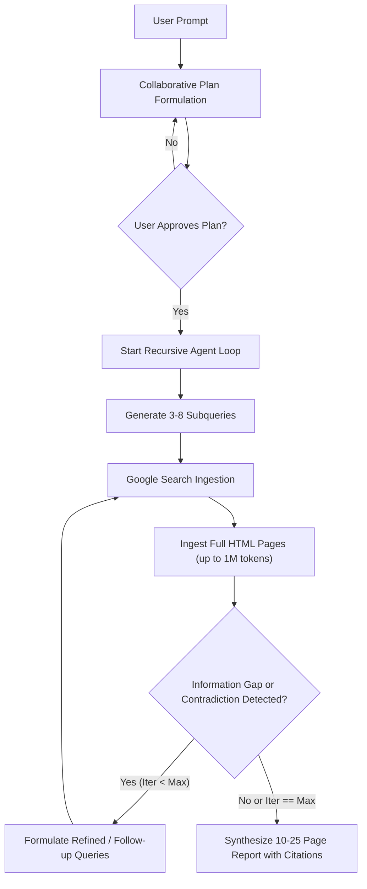
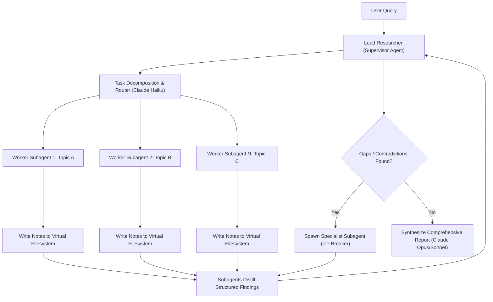
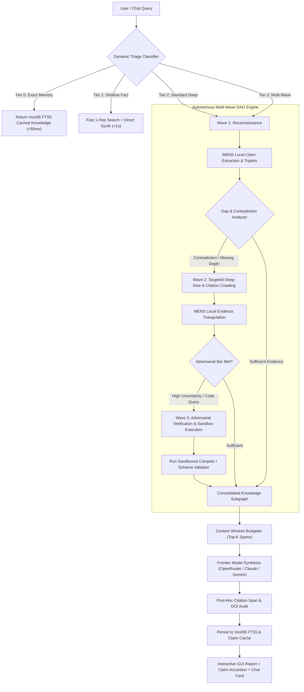
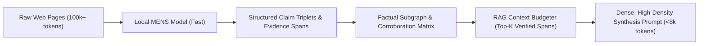

# Deep Research Waves, Batches, and Competitive SOTA Analysis (September 2026)

This document provides a technical, code-level architectural analysis comparing **Vox Deep Research** (Scientia / `vox-research-shim`) against the two leading proprietary industry implementations: **Google Gemini Deep Research** and **Anthropic Claude Deep Research** (Claude Agent SDK / Coworker).

It details how Vox can not only match the iterative reasoning, multi-hop web retrieval, and subagent delegation of Gemini and Claude, but **exceed them** through local-first asymmetric routing, persistent cross-session knowledge graphs (VoxDB FTS5), sandboxed empirical verification (compilers and schema validators), multi-wave tree-of-thought exploration, and intelligent context window distillation.

---

## 1. Executive Summary & Frontier Competitive Benchmark

The table below contrasts the four systems across the key dimensions that govern autonomous deep research:

| Capability Dimension | Google Gemini Deep Research | Anthropic Claude Deep Research | Vox Scientia (Current Shipped) | Vox Scientia (Target Architecture) |
| :--- | :--- | :--- | :--- | :--- |
| **Execution Loop** | Recursive search-read-synthesize loop (10–30+ iterations) | Hub-and-spoke subagent tree (orchestrator + worker agents) | Single-pass 10-stage pipeline (decompose $\to$ gather $\to$ verify $\to$ synth) | **Multi-Wave DAG Engine** (Wave 1 Recon $\to$ Wave 2 Deep-Dive $\to$ Wave 3 Adversarial) |
| **Context Window Strategy** | Brute-force 1M–2M token context ingestion of raw HTML | Virtual filesystem offload; subagent summary compression | Fixed-length snippet truncation (`context_max_chars: 12000`) | **Hierarchical Distillation**: local MENS extraction into factual triplets + RAG budgeter |
| **Search Backends** | Google Search native index | Brave / SerpAPI / Custom web fetchers | SearXNG + DuckDuckGo fallback + Tavily `/research` tier | SearXNG + DDG + Tavily + DOI/CrossRef + **local VoxDB FTS5 memory** |
| **Claim Verification** | Implicit internal LLM reasoning; opaque verification | Multi-agent debate & source cross-referencing | SelfCheckGPT 3x resampling + NLI classification | **Multi-Signal Triangulation**: 3x NLI resampling + CrossRef + Sandbox empirical validation |
| **Empirical Validation** | None (pure text inference) | None (pure text inference) | `rustc` sandbox verification for CodeGen domain | **Plug-in Sandboxes**: Compiler execution (`rustc`/Wasm), API schema checking, price verification |
| **Durable Storage & Dedup** | Ephemeral or cloud conversation history | Ephemeral per-session virtual files | VoxDB SQLite FTS5 index + 14-day claim cache | **Durable FTS5 Knowledge Base** with cross-session claim deduplication & provenance graphs |
| **Token Cost & Economics** | High ($2–$10 per run on Gemini Pro) | Very High ($5–$25 per run on Sonnet/Opus) | Asymmetric: local MENS for claims, OpenRouter for synthesis | **Zero-Cost Intermediate Tiers**: Local MENS for extraction/verification, paid model for synthesis |
| **Offline & Privacy** | Zero (100% Google Cloud dependent) | Zero (100% Anthropic API dependent) | Local search (Tantivy/Mem) + Ollama/MENS support | **Full Offline Air-Gapped Mode**: Local SearXNG + Ollama MENS + VoxDB FTS5 |
| **Dynamic Escalation** | Monolithic (Deep Research mode toggle) | Monolithic (subagent research command) | Manual flags (`force_research`, `verify_claims`) | **Autonomous 4-Tier Triage**: Tier 0 Memory $\to$ Tier 1 Shallow $\to$ Tier 2 Deep $\to$ Tier 3 Multi-Wave |
| **Batch Orchestration** | Single interactive job | Single job per session | Serial execution in daemon | **Hopper Concurrent Batches**: Actor-based multi-query research with token rate-limiting |
| **Interactive Steering** | Collaborative plan review before execution | Interactive prompt corrections | Fire-and-forget daemon run (`start_research_async`) | **Mid-Flight Steering**: Progressive wave events, human-in-the-loop clarification & refinement |
| **Hallucination Defense** | Post-hoc citations (occasionally hallucinated) | Subagent citation extraction | Span overlap audit + Refuted verdict banners | **Deterministic Citation Precision Gate**: Exact character span match + two-source corroboration |

---

## 2. Anatomy of Frontier Deep Research Systems

### 2.1 Google Gemini Deep Research

Google Gemini Deep Research leverages Google's core competitive assets: native access to the Google web search index and Gemini's massive 1M–2M token context window.



#### Key Architectural Strengths:
1. **Long-Context Raw Ingestion**: By accepting 100+ pages in full text without lossy snippet summarization, the model preserves nuanced tables, footnotes, and edge-case data.
2. **Collaborative Planning**: The system presents a detailed multi-section research plan to the user *before* launching execution, allowing the user to redirect the investigation upfront.
3. **Iterative Reformulation**: The agent evaluates whether gathered information actually answers the sub-questions; if a gap is identified, it generates targeted second- and third-order search queries.

#### Key Architectural Limitations:
1. **Opaque Verification**: Citations are generated generative-first; there is no formal character-level evidence span validation or NLI cross-checking against ground truth.
2. **Zero Empirical Grounding**: The system cannot test code samples, check whether an API endpoint actually exists, or run a compiler. Technical claims are accepted purely on web consensus.
3. **Cloud Lock-in & Privacy**: Every search query, visited URL, and page token is processed through Google Cloud. Confidential corporate codebases and internal documentation cannot be researched securely.

---

### 2.2 Anthropic Claude Deep Research (Claude Agent SDK / Coworker)

Anthropic's approach relies on **hierarchical multi-agent delegation** (an Orchestrator supervising specialized Worker Subagents) and a **virtual filesystem**.



#### Key Architectural Strengths:
1. **Context Compression via Delegation**: Instead of flooding a single context window with noisy web scraper logs, worker subagents read sources in isolated scratchpads and report only compressed, structured factual claims back to the supervisor.
2. **Multi-Model Routing**: Cost optimization using lightweight models (Haiku) for query routing, URL extraction, and preliminary filtering, reserving expensive frontier models (Opus / Sonnet 3.5) for synthesis and conflict resolution.
3. **Reflective Reflection**: The supervisor compares findings across subagents, identifies contradictory claims, and spawns targeted tie-breaker subagents.

#### Key Architectural Limitations:
1. **Excessive Cost**: Running 5–15 recursive frontier agent loops costs between \$5 and \$25 per query, making continuous or automated usage prohibitive for individual developers.
2. **Amnesic Execution**: Findings exist in ephemeral subagent scratchpads. Subsequent runs on related topics start completely from scratch with zero cross-session memory.
3. **No Local Sandbox Verification**: Like Gemini, Claude Deep Research cannot execute code or verify compiler correctness for software engineering questions.

---

## 3. Vox Target Architecture: Closing Gaps & Exceeding the Frontier

Vox can surpass both Gemini and Claude Deep Research by unifying five pillars into a cohesive architecture:



---

### Pillar I: Multi-Wave Iterative Execution (Batches & Waves)

Instead of a monolithic single-hop query decomposition, Vox executes research across sequential **Waves**, where each wave's hypotheses and contradictions dynamically parameterize the next wave:

#### 1. Wave 1: Reconnaissance & Broad Horizon Scanning
- **Objective**: Establish the broad knowledge boundaries and identify candidate claims.
- **Decomposition**: LLM decomposes user query into 3–6 exploratory search queries.
- **Retrieval**: Parallel web search across SearXNG, DuckDuckGo, and Tavily.
- **Extraction**: Local MENS model extracts factual claims and builds initial candidate claim set $C_1$.
- **Gap Detection**: Evaluates $C_1$ for:
  - Unverified claims (claims where source evidence confidence $< 0.6$).
  - Contradictory claims (two sources asserting opposing facts, e.g., different release dates or benchmark scores).
  - Information blind spots (subqueries that returned 0 high-trust hits).

#### 2. Wave 2: Targeted Deep-Dives & Contradiction Resolution
- **Objective**: Resolve contradictory claims and drill into specific primary sources.
- **Targeted Query Generation**: Converts unresolved claims into interrogative queries:
  - *Example*: If Source A claims "Feature X was deprecated in v0.6" and Source B claims "Feature X was deprecated in v0.7", Wave 2 generates: `"exact release notes deprecation Feature X v0.6 v0.7"`.
- **Recursive Link Exploration**: Follows citations, source URLs, and GitHub PR links found in Wave 1 pages.
- **Triangulation**: Re-verifies claims against primary sources (official documentation, release tags, DOI papers).

#### 3. Wave 3: Adversarial Verification & Empirical Validation
- **Objective**: Stress-test the leading conclusions and empirically validate technical claims.
- **Adversarial Counter-Querying**: Generates queries designed to falsify the dominant claim:
  - *Example*: `"Is [Claim X] incorrect or debunked?"`, `"Known bugs or limitations of [Claim X]"`.
- **Sandboxed Execution (The Vox Unfair Advantage)**:
  - **CodeGen Mode**: If research concerns code APIs or language behavior, the agent synthesizes a minimal test harness and runs `rustc` or `vox check` inside a sandboxed environment to empirically verify compilation and runtime behavior.
  - **Shopping Mode**: Verifies real-time pricing, validates merchant URL integrity, and checks schema.org structured pricing data.
- **Convergence Scoring**: Computes a mathematical stability metric $S \in [0.0, 1.0]$. If $S \ge 0.85$, the engine terminates and proceeds to synthesis; otherwise, it flags residual uncertainty.

---

### Pillar II: Dynamic Escalation & Intelligent Triage

Deep research takes 15–45 seconds and consumes resources. A user asking *"What is the latest stable version of Rust?"* should not endure a 3-wave 40-source deep research loop, while a user asking *"Compare memory layouts and lock contention between jemalloc and mimalloc in multi-threaded Rust"* requires deep research.

The Orchestrator introduces a **4-Tier Escalation Classifier**:

```rust
pub enum ResearchTriageTier {
    /// Tier 0: Direct hit in VoxDB FTS5 knowledge base (< 50ms, 0 tokens).
    InstantMemory { cached_doc_id: i64 },
    /// Tier 1: Fast single web lookup + direct synthesis (< 1.5s, low cost).
    ShallowWeb { query: String },
    /// Tier 2: Standard single-wave deep research with claim verification (5–12s).
    StandardDeep { query: ResearchQuery },
    /// Tier 3: Multi-wave autonomous deep research with adversarial verification (15–45s).
    MultiWaveAutonomous { query: ResearchQuery, max_waves: usize },
}
```

#### Triage Decision Heuristics:
1. **Memory Lookup**: Query `scientia_research_fts` in VoxDB. If a verified claim or research synthesis exists from within the last 14 days with similarity score $> 0.85$, return immediately as Tier 0.
2. **Complexity & Intent Analysis**:
   - High complexity signals: "compare", "benchmark", "why does", "pros and cons", "trace", "architecture", "dispute", "history of". $\to$ **Tier 3 (Multi-Wave)**.
   - Domain triggers: shopping queries, code generation queries, CVE security inquiries. $\to$ **Tier 2 or 3**.
   - Simple factual signals: "what is the version of", "who founded", "release date of", "syntax for". $\to$ **Tier 1 (Shallow)**.
3. **Explicit User Override**:
   - Chat slash command `/research --deep` forces Tier 3.
   - Chat slash command `/research --quick` forces Tier 1.
   - Chat toggle `force_research: true` escalates to at least Tier 2.

---

### Pillar III: Context Window Distillation & RAG Budgeting

Feeding 30 full web pages into an LLM synthesis prompt creates **Context Poisoning** and causes the model to ignore nuanced evidence. 

Vox solves this through **Hierarchical Distillation**:



1. **Local Extraction**: For each retrieved web hit, a lightweight local model (or fast cloud model) extracts a list of `ClaimEvidenceUnit`:
   ```rust
   pub struct ClaimEvidenceUnit {
       pub subject: String,
       pub predicate: String,
       pub object: String,
       pub evidence_span: String,
       pub source_url: String,
       pub trust_score: f64,
       pub is_verified: bool,
   }
   ```
2. **Knowledge Subgraph Deduplication**: Claim triplets are grouped by semantic equivalence. Multiple sources asserting the same claim increment its corroboration count.
3. **RAG Budget Packing**: The synthesis prompt is constructed by packing top-ranked verified evidence spans until the configured `context_max_chars` (e.g. 16,000 chars) is reached. Irrelevant boilerplate, navigation bars, and marketing fluff are completely discarded before frontier synthesis.

---

### Pillar IV: Batch Research & Hopper Concurrency

Users and automated agents often need to research matrices of topics (e.g., evaluating 10 competing open-source crates or researching 8 components of a technical architecture).

Vox unifies research with the **Vox Orchestrator Hopper**:
- **Batch Enqueueing**:
  ```rust
  pub struct ResearchBatchRequest {
      pub batch_id: String,
      pub topics: Vec<ResearchQuery>,
      pub max_concurrency: usize,
      pub stop_on_failure: bool,
  }
  ```
- **Actor Pool Execution**: Tasks are pushed to the `VoxDbHopper`. Worker actors pick up tasks, coordinating rate limits across search engines (SearXNG RPM limits, Tavily monthly quotas) and LLM providers.
- **Aggregation**: Once all topics in the batch complete, the Hopper triggers a comparative synthesis step that generates a unified comparison matrix.

---

### Pillar V: Full Chat Integration & Progressive Streaming

To make deep research seamless from the chat interface:
1. **Interactive Chat Commands**:
   - `/research [topic]` — Runs triage-directed research.
   - `/research --waves=3 [topic]` — Forces 3-wave multi-wave research.
   - `/research --domain=shopping [product]` — Invokes product search with merchant & price verification.
   - `/research --domain=codegen [language/task]` — Invokes code research with sandboxed compiler validation.
2. **Progressive Turn Events**:
   The orchestrator emits live streaming events to the GUI via Tauri events (`chat:turn:event`):
   - `WaveStarted { wave_index: 1, total_waves: 3, plan: [...] }`
   - `SourcesRetrieved { count: 12, top_domains: [...] }`
   - `ContradictionDetected { claim_a: "...", claim_b: "..." }`
   - `WaveStarted { wave_index: 2, focus: "Resolving contradiction on release dates" }`
   - `EmpiricalValidationCompleted { sandbox: "rustc", passed: true }`
3. **At-Will Saving & Workspace Ingestion**:
   Every research result in the chat displays action buttons:
   - **Save to Workspace**: Writes a clean Markdown document into `docs/src/architecture/` with validated frontmatter.
   - **Pin to Knowledge Base**: Stores verified claims into the project's permanent memory.
   - **View Trust Inspection**: Expands the `ResearchClaimAccordion` with NLI confidence scores and corroboration badges.

---

## 4. Technical Gap Analysis & Actionable Remediation Plan

Based on codebase analysis across `vox-research-shim`, `vox-orchestrator`, `vox-orchestrator-mcp`, `vox-db`, and `vox-gui`, the following table details the implementation roadmap to bridge all remaining gaps:

| Component | Current State | Required Target Implementation | Files to Modify / Create |
| :--- | :--- | :--- | :--- |
| **Multi-Wave Pipeline** | Single-wave execution in `pipeline.rs` | `WaveEngine` orchestrating Wave 1, Wave 2 (contradiction resolution), and Wave 3 (adversarial + sandbox) | `crates/vox-research-shim/src/research/orchestrator/wave.rs`, `pipeline.rs` |
| **Orchestrator Research Dispatch** | `perform_autonomous_research` in `research_dispatch.rs` calls `vox_search::run_multi_hop_web_research` directly | Route through `run_research_with_context_and_session` in `vox-research-shim` with proper session tracking and claim verification | `crates/vox-orchestrator/src/orchestrator/task_dispatch/research_dispatch.rs` |
| **Dynamic Triage Classifier** | Ad-hoc flags in chat message handling | `classify_research_intent` evaluating query complexity, local FTS5 matches, and explicit flags | `crates/vox-research-shim/src/research/orchestrator/triage.rs`, `message.rs` |
| **Context Window Distillation** | Raw string concatenation of hit snippets up to char limit | Structured `ClaimEvidenceUnit` extraction via local MENS model and RAG budget packing | `crates/vox-research-shim/src/research/stages/distillation.rs` |
| **Batch Research API** | Only single-session execution | `research_batch_start` in MCP / daemon handling `ResearchBatchRequest` via Hopper | `crates/vox-orchestrator-mcp/src/memory_tools/handlers_memory.rs`, `hopper.rs` |
| **Chat Progressive Streaming** | Synchronous blocking call returning one combined string | Async event stream emitting per-wave progress milestones to `chat_turn` events | `crates/vox-orchestrator-mcp/src/chat_tools/chat/message.rs`, `chat_turn.rs` |

---

## 5. Conclusion & Strategic Value

By implementing **multi-wave DAG execution**, **sandboxed empirical validation**, **persistent cross-session knowledge graphs (VoxDB FTS5)**, and **local-first asymmetric distillation**, Vox achieves an autonomous deep research capability that:
1. **Exceeds Gemini Deep Research in trust and verifiability**: Providing transparent, character-level NLI-verified evidence spans, compiler-validated code snippets, and 100% offline air-gapped execution capability.
2. **Exceeds Claude Deep Research in cost and persistence**: Eliminating frontier token waste through local MENS extraction, while accumulating durable knowledge in a local database that accelerates future research runs.
3. **Integrates natively into daily developer workflow**: Seamlessly available in the chat composer, CLI, daemon, and GUI with interactive steering and at-will persistence.
