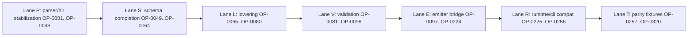

# Internal Web IR Implementation Blueprint

## Goal

Provide a concrete, execution-ready implementation plan for introducing `WebIR` into Vox while preserving React ecosystem interoperability and island compatibility.

> **Progress:** The normative `WebIrModule` schema, `lower_hir_to_web_ir`, `validate_web_ir`, and `emit_component_view_tsx` now live under [`crates/vox-compiler/src/web_ir/`](../../../crates/vox-compiler/src/web_ir/mod.rs) (see [ADR 012](../adr/012-internal-web-ir-strategy.md)). Checklist items below remain the long-range migration map; many CP-* rows are partially satisfied by this layer without implying full emitter cutover.

This blueprint is designed for future LLM-assisted implementation and includes:

- Layer A: explicit critical-path tasks (150 tasks)
- Layer B: weighted work-package quotas (target 500-900 weighted tasks)
- Token/effort budgets based on complexity and risk

## Scope and non-goals

- In scope: compiler pipeline changes from AST/HIR to WebIR and WebIR to target emitters, parity testing, migration strategy, documentation, and rollout gates.
- In scope: keeping current islands mount contract stable through compatibility phases.
- Out of scope (near-term): replacing React runtime wholesale or breaking third-party React interop contracts.

## Baseline code touchpoints

- `crates/vox-compiler/src/hir/nodes/decl.rs`
- `crates/vox-compiler/src/hir/nodes/stmt_expr.rs`
- `crates/vox-compiler/src/codegen_ts/jsx.rs`
- `crates/vox-compiler/src/codegen_ts/hir_emit/mod.rs`
- `crates/vox-compiler/src/codegen_ts/emitter.rs`
- `crates/vox-cli/src/templates/islands.rs`
- `crates/vox-cli/src/frontend.rs`

Canonical side-by-side representation mapping:

- [internal-web-ir-side-by-side-schema.md](internal-web-ir-side-by-side-schema.md)
- [k-complexity-quantification](internal-web-ir-side-by-side-schema.md#k-complexity-quantification)

## Parser-grounded gap analysis (current -> target)

| Area | Current verified state | Gap to close | Primary files |
| --- | --- | --- | --- |
| JSX and island lowering ownership | split between `codegen_ts/jsx.rs` and `codegen_ts/hir_emit/mod.rs`; island rewrite exists in both paths | consolidate semantic ownership in `web_ir/lower.rs` and keep emitters thin | `crates/vox-compiler/src/codegen_ts/jsx.rs`, `crates/vox-compiler/src/codegen_ts/hir_emit/mod.rs`, `crates/vox-compiler/src/web_ir/lower.rs` |
| WebIR validation depth | `validate_web_ir` currently checks structural DOM references and arena bounds | add optionality, route/server/mutation, and style contract validation prior to emit | `crates/vox-compiler/src/web_ir/validate.rs`, `crates/vox-compiler/src/web_ir/mod.rs` |
| Style representation | style emission lives in TS emitter (`Component.css` generation) | lower style blocks into `StyleNode` then emit from WebIR printer path | `crates/vox-compiler/src/codegen_ts/emitter.rs`, `crates/vox-compiler/src/web_ir/lower.rs` |
| Route/data contract convergence | routes and server outputs are generated from HIR-oriented emit modules | represent route/data/server contracts in `RouteNode` and bridge to emitters | `crates/vox-compiler/src/codegen_ts/routes.rs`, `crates/vox-compiler/src/web_ir/lower.rs`, `crates/vox-compiler/src/codegen_ts/emitter.rs` |
| Islands runtime typing | hydration reads `data-prop-*` values from DOM attributes (string channel) | preserve V1 contract first; introduce explicit versioned V2 typing when ready | `crates/vox-cli/src/templates/islands.rs`, `crates/vox-cli/src/frontend.rs`, `crates/vox-compiler/src/web_ir/mod.rs` |

## Test gate matrix (file-level)

| Gate | Required evidence | Current anchors |
| --- | --- | --- |
| Parser syntax gate | parser-accepted forms for component/routes/island/style/server | `crates/vox-compiler/src/parser/descent/decl/head.rs`, `crates/vox-compiler/src/parser/descent/decl/tail.rs`, `crates/vox-compiler/src/parser/descent/expr/style.rs` |
| Current output parity gate | TSX/TS/CSS/asserted output substrings for baseline fixtures | `crates/vox-compiler/tests/reactive_smoke.rs`, `crates/vox-integration-tests/tests/pipeline.rs` |
| WebIR structural gate | `lower_hir_to_web_ir` + `validate_web_ir` + preview emit pass | `crates/vox-compiler/tests/web_ir_lower_emit.rs` |
| Build artifact gate | full-stack build emits expected frontend artifacts | `crates/vox-cli/tests/full_stack_minimal_build.rs` |
| Islands runtime gate | mount script injection and hydration behavior unchanged | `crates/vox-cli/src/frontend.rs`, `crates/vox-cli/src/templates/islands.rs` |

## Schema readiness checklist (better-target structure)

`WebIR` is considered structurally ready for default-path cutover only when all rows are satisfied:

| Schema partition | Ready when | Primary files/tests |
| --- | --- | --- |
| `DomNode` | all current JSX/island rewrite semantics lower through `web_ir/lower.rs` without fallback ownership in `jsx.rs`/`hir_emit/mod.rs` | `crates/vox-compiler/src/web_ir/lower.rs`, `crates/vox-compiler/tests/web_ir_lower_emit.rs` |
| `BehaviorNode` | reactive state/derived/effect/event/action forms lower and validate with stable diagnostics | `crates/vox-compiler/src/web_ir/lower.rs`, `crates/vox-compiler/src/web_ir/validate.rs` |
| `StyleNode` | component style blocks lower to `StyleNode::Rule` and printer emits CSS parity fixtures | `crates/vox-compiler/src/web_ir/lower.rs`, `crates/vox-compiler/src/codegen_ts/emitter.rs` |
| `RouteNode` | routes + server/query/mutation contracts lower as typed contracts used by TS emit | `crates/vox-compiler/src/web_ir/lower.rs`, `crates/vox-compiler/src/codegen_ts/routes.rs` |
| `InteropNode` | compatibility escapes are explicit, policy-checked, and measurable | `crates/vox-compiler/src/web_ir/mod.rs`, `crates/vox-compiler/src/web_ir/validate.rs` |

## Phase exit criteria (file/test-gated)

| Phase | Exit criterion | Gate evidence |
| --- | --- | --- |
| Stage B (lower/validate expansion) | no semantic regressions on reactive+island fixtures via WebIR preview path | `crates/vox-compiler/tests/web_ir_lower_emit.rs`, `crates/vox-compiler/tests/reactive_smoke.rs` |
| Stage C (emitter bridge) | `codegen_ts::generate` keeps artifact contract while delegating view semantics through WebIR adapters | `crates/vox-integration-tests/tests/pipeline.rs` |
| Stage D (de-dup legacy internals) | island/JSX ownership removed from legacy dual paths with parity retained | `crates/vox-compiler/tests/reactive_smoke.rs` |
| Stage E (runtime compatibility) | HTML injection and hydration contract unchanged in full-stack build path | `crates/vox-cli/tests/full_stack_minimal_build.rs`, `crates/vox-cli/src/frontend.rs`, `crates/vox-cli/src/templates/islands.rs` |

## Legacy direct-emit registry (authoritative for migration)

| File | Current role | Migration disposition | Target owner |
| --- | --- | --- | --- |
| `crates/vox-compiler/src/codegen_ts/emitter.rs` | output orchestrator and file assembly | `legacy-wrap` | WebIR lower/validate/emit adapters |
| `crates/vox-compiler/src/codegen_ts/hir_emit/mod.rs` | HIR expr/stmt to TS/JSX strings | `legacy-replace` | `crates/vox-compiler/src/web_ir/emit_tsx.rs` + future target emitters |
| `crates/vox-compiler/src/codegen_ts/jsx.rs` | AST JSX render path | `legacy-replace` | `crates/vox-compiler/src/web_ir/lower.rs` + emitters |
| `crates/vox-compiler/src/codegen_ts/component.rs` | `@component` generation from AST-retained path | `legacy-shrink` | WebIR lowering adapters + thin wrapper |
| `crates/vox-compiler/src/codegen_ts/reactive.rs` | reactive component generation | `legacy-shrink` | WebIR view roots + emitter |
| `crates/vox-compiler/src/codegen_ts/routes.rs` | route-specific TS generation | `legacy-replace` | `RouteNode` contracts + target printer |
| `crates/vox-compiler/src/codegen_ts/tanstack_programmatic_routes.rs` | TanStack route tree strings | `legacy-shrink` | target formatter over `RouteNode` |
| `crates/vox-compiler/src/codegen_ts/tanstack_query_emit.rs` | query helper emit | `legacy-wrap` | contract-driven helper generation |
| `crates/vox-compiler/src/codegen_ts/tanstack_start.rs` | constants/literals for Start mode | `retain-support` | keep as target support surface |
| `crates/vox-compiler/src/codegen_ts/activity.rs` | activity wrappers | `legacy-shrink` | consume WebIR/contract nodes |
| `crates/vox-compiler/src/codegen_ts/schema/` (`mod.rs`, `from_ast.rs`, `from_hir.rs`, `type_maps.rs`) | schema TS emit path | `legacy-wrap` | route/data/DB contracts over WebIR |
| `crates/vox-compiler/src/codegen_ts/adt.rs` | ADT/type generation | `retain-support` | remains mostly independent |
| `crates/vox-compiler/src/codegen_ts/island_emit.rs` | island-name and data-attr helpers | `legacy-shrink` | compatibility adapter until V2 mount contract |

## File-level edit guide (where, what, how, why)

### Stage A - stabilize source contracts (no behavior break)

1. `crates/vox-compiler/src/parser/descent/decl/head.rs`
   - What: keep `@island` grammar stable; add diagnostics only if needed.
   - Why: language churn is out of scope during representation migration.
2. `crates/vox-compiler/src/hir/lower/mod.rs`
   - What: preserve `Decl::Island -> HirIsland` compatibility.
   - Why: WebIR migration should not break existing HIR consumers in same tranche.

### Stage B - expand WebIR lower/validate

1. `crates/vox-compiler/src/web_ir/lower.rs`
   - What: absorb rewrite semantics currently split in `jsx.rs` and `hir_emit/mod.rs`.
   - How: ensure tag/island classification, attr mapping, ignored-child semantics are canonical here.
   - Why: remove dual semantic ownership.
2. `crates/vox-compiler/src/web_ir/validate.rs`
   - What: add strict checks for optionality, route ids/contracts, island prop representation.
   - Why: validation before emission is the key safety boundary.
3. `crates/vox-compiler/src/web_ir/mod.rs`
   - What: evolve node shapes only under versioned policy (`WebIrVersion`).
   - Why: prevent silent schema drift.

### Stage C - bridge emitters with wrappers

1. `crates/vox-compiler/src/codegen_ts/emitter.rs`
   - What: keep `generate` API stable, but call WebIR lower/validate/emit internally.
   - Why: avoids rippling API changes across CLI/tests.
2. `crates/vox-compiler/src/codegen_ts/component.rs`
   - What: transition to wrapper that resolves component metadata then delegates view output to WebIR emitter.
   - Why: gradual migration of AST-retained component path.
3. `crates/vox-compiler/src/codegen_ts/reactive.rs`
   - What: delegate view rendering to WebIR emit path.
   - Why: unify with component path and island semantics.

### Stage D - de-duplicate legacy internals

1. `crates/vox-compiler/src/codegen_ts/hir_emit/mod.rs`
   - What: retire island/JSX rendering ownership; retain only compatibility helpers during transition.
2. `crates/vox-compiler/src/codegen_ts/jsx.rs`
   - What: retire direct island mount rendering path.
3. `crates/vox-compiler/src/codegen_ts/routes.rs`
   - What: route tree and contract output should consume WebIR `RouteNode`.

### Stage E - islands runtime compatibility and V2 gate

1. `crates/vox-cli/src/templates/islands.rs`
   - What: preserve current `data-vox-island`/`data-prop-*` semantics while WebIR migration lands.
2. `crates/vox-cli/src/frontend.rs`
   - What: preserve script injection and asset wiring behavior.
3. V2 gate (future)
   - What: if changing hydration payload typing, introduce explicit versioned adapter (`IslandMountV2`) and parity fixtures.
   - Why: runtime compatibility is a hard gate.

## Complexity model

- `C1` trivial: weight `1.0`, token multiplier `1.0`
- `C2` moderate: weight `2.0`, token multiplier `1.8`
- `C3` complex: weight `3.5`, token multiplier `3.2`
- `C4` deep/refactor: weight `5.0`, token multiplier `5.0`

Work package score:

`weighted_tasks = task_count * complexity_weight * risk_multiplier`

Where risk multiplier is in `[1.0, 1.8]`.

## Layer A: explicit critical-path checklist (150 tasks)

### Phase 0 - contracts, governance, and measurement (CP-001..CP-015)

- [ ] CP-001 Define `WebIR` term as canonical in architecture docs.
- [ ] CP-002 Define `WebIrVersion` policy and compatibility rules.
- [ ] CP-003 Freeze island mount attribute contract fixtures.
- [ ] CP-004 Baseline duplicate emit path inventory (`jsx.rs`, `hir_emit/mod.rs`).
- [ ] CP-005 Baseline framework-shaped syntax exposure metrics in `.vox`.
- [ ] CP-006 Baseline nullability ambiguity points at TS emit boundary.
- [ ] CP-007 Baseline route/data emission parity examples.
- [ ] CP-008 Baseline style emission parity examples.
- [ ] CP-009 Add migration status flagging policy to docs.
- [ ] CP-010 Define WebIR acceptance gate checklist.
- [ ] CP-011 Define rollback criteria for each migration phase.
- [ ] CP-012 Define deprecation policy for legacy `@component fn` hooks.
- [ ] CP-013 Add source-of-truth file list for WebIR ownership.
- [ ] CP-014 Define lint/test ownership for WebIR modules.
- [ ] CP-015 Define release-note template for WebIR milestones.

### Phase 1 - WebIR type system and module layout (CP-016..CP-040)

- [ ] CP-016 Add `codegen_web_ir` module root.
- [ ] CP-017 Add `web_ir/mod.rs` with public exports.
- [ ] CP-018 Define `WebIrModule` root struct.
- [ ] CP-019 Define `DomNode` enum.
- [ ] CP-020 Define `BehaviorNode` enum.
- [ ] CP-021 Define `StyleNode` enum.
- [ ] CP-022 Define `RouteNode` enum.
- [ ] CP-023 Define `InteropNode` enum.
- [ ] CP-024 Define `WebIrDiagnostic` struct.
- [ ] CP-025 Define `SourceSpanId` + span table model.
- [ ] CP-026 Define `FieldOptionality` enum (`Required`, `Optional`, `Defaulted`).
- [ ] CP-027 Define `IslandMountNode` with compatibility fields.
- [ ] CP-028 Define `RouteContract` payload shape.
- [ ] CP-029 Define `ServerFnContract` payload shape.
- [ ] CP-030 Define `MutationContract` payload shape.
- [ ] CP-031 Define `StyleDeclarationValue` typed union.
- [ ] CP-032 Define selector AST surface for CSS rules.
- [ ] CP-033 Define `ExternalModuleRef` interop node.
- [ ] CP-034 Define `EscapeHatchExpr` policy wrapper node.
- [ ] CP-035 Add serialization/deserialization traits for debug dumps.
- [ ] CP-036 Add stable debug printer for WebIR snapshots.
- [ ] CP-037 Add constructor helpers for test fixtures.
- [ ] CP-038 Add invariants doc comments to all node types.
- [ ] CP-039 Add semantic versioning comments in WebIR root.
- [ ] CP-040 Add smoke compile test for WebIR type compilation.

### Phase 2 - lowering from HIR/AST into WebIR (CP-041..CP-065)

- [ ] CP-041 Add `lower_to_web_ir` entry point.
- [ ] CP-042 Map `HirReactiveComponent` to `BehaviorNode` state declarations.
- [ ] CP-043 Map derived members to `BehaviorNode::DerivedDecl`.
- [ ] CP-044 Map effects to `BehaviorNode::EffectDecl`.
- [ ] CP-045 Lower HIR JSX elements to `DomNode::Element`.
- [ ] CP-046 Lower HIR text/content nodes to `DomNode::Text`.
- [ ] CP-047 Lower HIR fragment constructs to `DomNode::Fragment`.
- [ ] CP-048 Lower HIR loops to `DomNode::Loop`.
- [ ] CP-049 Lower HIR conditionals to `DomNode::Conditional`.
- [ ] CP-050 Lower event attributes to `BehaviorNode::EventHandler`.
- [ ] CP-051 Lower known style blocks to `StyleNode::Rule`.
- [ ] CP-052 Lower route declarations to `RouteNode::RouteTree`.
- [ ] CP-053 Lower server function declarations to `RouteNode::ServerFnContract`.
- [ ] CP-054 Lower mutation declarations to `RouteNode::MutationContract`.
- [ ] CP-055 Lower island tags to `DomNode::IslandMount`.
- [ ] CP-056 Preserve island `data-prop-*` mapping semantics in node fields.
- [ ] CP-057 Add adapter for AST-retained `HirComponent`.
- [ ] CP-058 Add shim lowering for legacy `@component fn` path.
- [ ] CP-059 Attach source spans to all lowered nodes.
- [ ] CP-060 Emit lowering diagnostics for unsupported edge expressions.
- [ ] CP-061 Add lowering unit tests for each node family.
- [ ] CP-062 Add golden fixture for mixed reactive + island source.
- [ ] CP-063 Add lowering benchmark harness.
- [ ] CP-064 Add lowering trace logs behind debug flag.
- [ ] CP-065 Gate lowering feature behind compiler option.

### Phase 3 - validation and safety passes (CP-066..CP-085)

- [ ] CP-066 Add `validate_web_ir` entry point.
- [ ] CP-067 Validate required fields are always present.
- [ ] CP-068 Validate optionality annotations are explicit.
- [ ] CP-069 Validate no unresolved `Defaulted` at print boundary.
- [ ] CP-070 Validate route contracts have unique ids.
- [ ] CP-071 Validate server function signatures are serializable.
- [ ] CP-072 Validate mutation contracts use supported payload forms.
- [ ] CP-073 Validate island mount props are representable.
- [ ] CP-074 Validate style selectors are parseable and scoped.
- [ ] CP-075 Validate declaration units by typed value category.
- [ ] CP-076 Validate escape hatches against policy allowlist.
- [ ] CP-077 Add validator diagnostics categories.
- [ ] CP-078 Add validator snapshot tests.
- [ ] CP-079 Add strict mode that fails on warnings.
- [ ] CP-080 Add compatibility mode for legacy fixtures.
- [ ] CP-081 Add CLI switch for validator verbosity.
- [ ] CP-082 Add metrics counter for validation error classes.
- [ ] CP-083 Add nullability ambiguity metric export.
- [ ] CP-084 Add route contract ambiguity metric export.
- [ ] CP-085 Add style compatibility metric export.

### Phase 4 - WebIR to React/TanStack emitter (CP-086..CP-110)

- [ ] CP-086 Add `emit_react_from_web_ir` entry point.
- [ ] CP-087 Emit React component wrappers from `DomNode` roots.
- [ ] CP-088 Emit props interfaces from WebIR contracts.
- [ ] CP-089 Emit state hook bridge from behavior nodes.
- [ ] CP-090 Emit derived bridge expressions from behavior nodes.
- [ ] CP-091 Emit effect bridge expressions from behavior nodes.
- [ ] CP-092 Emit event handlers with explicit closure policies.
- [ ] CP-093 Emit route tree from `RouteNode::RouteTree`.
- [ ] CP-094 Emit loader wrappers from `LoaderContract`.
- [ ] CP-095 Emit server fn wrappers from `ServerFnContract`.
- [ ] CP-096 Emit mutation wrappers from `MutationContract`.
- [ ] CP-097 Emit island mount placeholders from `IslandMountNode`.
- [ ] CP-098 Preserve `data-vox-island` contract during migration.
- [ ] CP-099 Preserve `data-prop-*` key transform semantics.
- [ ] CP-100 Emit typed interop stubs for external components.
- [ ] CP-101 Emit escape hatch blocks with warning comments.
- [ ] CP-102 Emit sourcemap metadata for generated TSX.
- [ ] CP-103 Add parity tests against legacy emitter outputs.
- [ ] CP-104 Add route generation parity tests.
- [ ] CP-105 Add server fn generation parity tests.
- [ ] CP-106 Add island generation parity tests.
- [ ] CP-107 Add component generation parity tests.
- [ ] CP-108 Add emission benchmark harness.
- [ ] CP-109 Add fail-fast switch for parity regressions.
- [ ] CP-110 Add feature flag to select WebIR emitter path.

### Phase 5 - style IR and CSS emission (CP-111..CP-125)

- [ ] CP-111 Add `emit_css_from_web_ir` entry point.
- [ ] CP-112 Emit scoped rules from `StyleNode::Rule`.
- [ ] CP-113 Emit nested selector forms with stable ordering.
- [ ] CP-114 Emit at-rules with validation gate.
- [ ] CP-115 Emit token references with fallback behavior.
- [ ] CP-116 Emit declaration values from typed value unions.
- [ ] CP-117 Validate unit conversions before CSS print.
- [ ] CP-118 Add style-source map integration.
- [ ] CP-119 Add CSS parity tests against existing outputs.
- [ ] CP-120 Add style-lint compatibility checks.
- [ ] CP-121 Add container query support test fixtures.
- [ ] CP-122 Add `:has()` and nesting support fixtures.
- [ ] CP-123 Add style conflict diagnostics by selector collision.
- [ ] CP-124 Add style emission perf benchmark.
- [ ] CP-125 Add style regression triage protocol.

### Phase 6 - databasing and route-data contract integration (CP-126..CP-138)

- [ ] CP-126 Define mapping from DB query plans to `LoaderContract`.
- [ ] CP-127 Define mapping from mutation plans to `MutationContract`.
- [ ] CP-128 Add explicit serialization schema for loader payloads.
- [ ] CP-129 Add explicit serialization schema for mutation payloads.
- [ ] CP-130 Enforce non-nullability policy at route-data boundaries.
- [ ] CP-131 Add compatibility tests for existing generated client fetches.
- [ ] CP-132 Add compatibility tests for server fn API prefixes.
- [ ] CP-133 Add typed failure-channel contracts for route loaders.
- [ ] CP-134 Add typed failure-channel contracts for mutations.
- [ ] CP-135 Add parity tests for database-driven pages.
- [ ] CP-136 Add perf tests for route-data emit path.
- [ ] CP-137 Add diagnostics for schema drift between DB and WebIR.
- [ ] CP-138 Add docs for route-data + DB integration policy.

### Phase 7 - migration, rollout, and deprecation (CP-139..CP-150)

- [ ] CP-139 Add staged rollout flag (`VOX_WEB_IR_STAGE`).
- [ ] CP-140 Enable dual-run mode (legacy + WebIR output compare).
- [ ] CP-141 Add diff reporter for generated artifact mismatches.
- [ ] CP-142 Add warning docs for legacy syntax deprecations.
- [ ] CP-143 Add CLI command to audit WebIR readiness of project.
- [ ] CP-144 Add migration guide from legacy `@component fn`.
- [ ] CP-145 Add migration guide for islands compatibility.
- [ ] CP-146 Promote WebIR path to default in preview channel.
- [ ] CP-147 Define cutover gate requiring parity pass rate threshold.
- [ ] CP-148 Define rollback gate and incident protocol.
- [ ] CP-149 Promote WebIR path to default stable.
- [ ] CP-150 Archive legacy emitter-only code paths after freeze period.

## Operations Catalog (OP-0001..OP-0320)

Operation entry format:

`id | type | complexity | risk | testM | tokenBudget | deps | file | operation`

Task volume note:

- `OP-*` base catalog contributes 100 explicit operation entries.
- `OP-S*` supplemental catalog contributes 220 explicit operation entries.
- Total explicit operations in this blueprint revision: **320**.

### File block 01 - `crates/vox-compiler/src/parser/descent/decl/head.rs` (OP-0001..OP-0016)

- [ ] OP-0001 | update | C2 | 1.1 | 1.0 | 180 | none | `crates/vox-compiler/src/parser/descent/decl/head.rs` | annotate parser-owned `@island` grammar boundaries in comments.
- [ ] OP-0002 | update | C2 | 1.1 | 1.0 | 180 | OP-0001 | `crates/vox-compiler/src/parser/descent/decl/head.rs` | normalize diagnostic wording for unsupported post-`@component` forms.
- [ ] OP-0003 | add-test | C2 | 1.2 | 1.2 | 220 | OP-0002 | `crates/vox-compiler/src/parser/descent/tests.rs` | add parser test for optional island prop marker `?`.
- [ ] OP-0004 | update | C1 | 1.0 | 1.0 | 120 | OP-0003 | `crates/vox-compiler/src/parser/descent/decl/head.rs` | add explicit note that braces are authoritative.
- [ ] OP-0005 | add-test | C2 | 1.2 | 1.2 | 220 | OP-0004 | `crates/vox-compiler/src/parser/descent/tests.rs` | add parser test for `@server fn` brace shape.
- [ ] OP-0006 | update | C2 | 1.1 | 1.1 | 200 | OP-0005 | `crates/vox-compiler/src/parser/descent/decl/head.rs` | isolate island prop parse helper for reuse in docs diagnostics.
- [ ] OP-0007 | add-test | C2 | 1.2 | 1.2 | 220 | OP-0006 | `crates/vox-compiler/src/parser/descent/tests.rs` | assert island prop parse rejects malformed optionality token order.
- [ ] OP-0008 | update | C1 | 1.0 | 1.0 | 120 | OP-0007 | `crates/vox-compiler/src/parser/descent/decl/head.rs` | add parser debug log hook points (guarded).
- [ ] OP-0009 | update | C2 | 1.1 | 1.0 | 180 | OP-0008 | `crates/vox-compiler/src/parser/descent/decl/head.rs` | align parse notes with `routes { ... }` canonical syntax.
- [ ] OP-0010 | add-test | C2 | 1.2 | 1.2 | 220 | OP-0009 | `crates/vox-compiler/src/parser/descent/tests.rs` | add test for `@component Name(...) { ... }` reactive decorated form.
- [ ] OP-0011 | update | C2 | 1.1 | 1.1 | 200 | OP-0010 | `crates/vox-compiler/src/parser/descent/decl/head.rs` | classify parse errors by declaration family for doc extraction.
- [ ] OP-0012 | add-test | C2 | 1.2 | 1.2 | 220 | OP-0011 | `crates/vox-compiler/src/parser/descent/tests.rs` | validate `@component fn ... to Element { ... }` remains accepted.
- [ ] OP-0013 | update | C1 | 1.0 | 1.0 | 120 | OP-0012 | `crates/vox-compiler/src/parser/descent/decl/head.rs` | enforce non-speculative parser comments for web forms.
- [ ] OP-0014 | add-test | C2 | 1.2 | 1.2 | 220 | OP-0013 | `crates/vox-compiler/src/parser/descent/tests.rs` | add snapshot for parser tokens around island props.
- [ ] OP-0015 | update | C2 | 1.1 | 1.1 | 200 | OP-0014 | `crates/vox-compiler/src/parser/descent/decl/head.rs` | expose helper for parser-backed syntax inventory tooling.
- [ ] OP-0016 | gate-test | C2 | 1.2 | 1.3 | 240 | OP-0015 | `crates/vox-compiler/src/parser/descent/tests.rs` | gate pass requiring no regressions in island/component/server parse forms.

### File block 02 - `crates/vox-compiler/src/parser/descent/decl/tail.rs` (OP-0017..OP-0032)

- [ ] OP-0017 | update | C2 | 1.1 | 1.0 | 180 | OP-0016 | `crates/vox-compiler/src/parser/descent/decl/tail.rs` | isolate `routes { ... }` parse branch inventory metadata.
- [ ] OP-0018 | add-test | C2 | 1.2 | 1.2 | 220 | OP-0017 | `crates/vox-compiler/src/parser/descent/tests.rs` | add route parse test with multiple entries.
- [ ] OP-0019 | update | C2 | 1.1 | 1.0 | 180 | OP-0018 | `crates/vox-compiler/src/parser/descent/decl/tail.rs` | document Path C component members accepted today.
- [ ] OP-0020 | add-test | C2 | 1.2 | 1.2 | 220 | OP-0019 | `crates/vox-compiler/src/parser/descent/tests.rs` | add mount/effect/cleanup parse sample.
- [ ] OP-0021 | update | C2 | 1.1 | 1.0 | 180 | OP-0020 | `crates/vox-compiler/src/parser/descent/decl/tail.rs` | add diagnostics for malformed `routes` entries.
- [ ] OP-0022 | add-test | C2 | 1.2 | 1.2 | 220 | OP-0021 | `crates/vox-compiler/src/parser/descent/tests.rs` | assert invalid route entry rejects gracefully.
- [ ] OP-0023 | update | C1 | 1.0 | 1.0 | 120 | OP-0022 | `crates/vox-compiler/src/parser/descent/decl/tail.rs` | annotate branch IDs used by k-metric appendix.
- [ ] OP-0024 | add-test | C2 | 1.2 | 1.1 | 210 | OP-0023 | `crates/vox-compiler/src/parser/descent/tests.rs` | assert reactive component with `view:` JSX remains stable.
- [ ] OP-0025 | update | C2 | 1.1 | 1.0 | 180 | OP-0024 | `crates/vox-compiler/src/parser/descent/decl/tail.rs` | keep brace-first guidance explicit in parser comments.
- [ ] OP-0026 | add-test | C2 | 1.2 | 1.2 | 220 | OP-0025 | `crates/vox-compiler/src/parser/descent/tests.rs` | route parsing with root and nested segment literals.
- [ ] OP-0027 | update | C2 | 1.1 | 1.0 | 180 | OP-0026 | `crates/vox-compiler/src/parser/descent/decl/tail.rs` | expose route parse summary for tooling.
- [ ] OP-0028 | add-test | C2 | 1.2 | 1.2 | 220 | OP-0027 | `crates/vox-compiler/src/parser/descent/tests.rs` | verify route parse summary stability snapshot.
- [ ] OP-0029 | update | C2 | 1.1 | 1.1 | 200 | OP-0028 | `crates/vox-compiler/src/parser/descent/decl/tail.rs` | align reactive member parse diagnostics with docs taxonomy.
- [ ] OP-0030 | add-test | C2 | 1.2 | 1.2 | 220 | OP-0029 | `crates/vox-compiler/src/parser/descent/tests.rs` | negative tests for misplaced `view:` token.
- [ ] OP-0031 | update | C1 | 1.0 | 1.0 | 120 | OP-0030 | `crates/vox-compiler/src/parser/descent/decl/tail.rs` | add minimal parser trace labels for route/reactive branches.
- [ ] OP-0032 | gate-test | C2 | 1.2 | 1.3 | 240 | OP-0031 | `crates/vox-compiler/src/parser/descent/tests.rs` | gate parser truth suite for routes/reactive syntax.

### File block 03 - `crates/vox-compiler/src/hir/lower/mod.rs` (OP-0033..OP-0048)

- [ ] OP-0033 | update | C3 | 1.3 | 1.1 | 320 | OP-0032 | `crates/vox-compiler/src/hir/lower/mod.rs` | inventory AST-retained UI declarations with explicit migration tags.
- [ ] OP-0034 | update | C3 | 1.3 | 1.1 | 320 | OP-0033 | `crates/vox-compiler/src/hir/lower/mod.rs` | annotate `Decl::Island -> HirIsland` compatibility boundary.
- [ ] OP-0035 | add-test | C3 | 1.3 | 1.3 | 360 | OP-0034 | `crates/vox-compiler/tests/reactive_smoke.rs` | ensure island lowering compatibility unchanged.
- [ ] OP-0036 | update | C3 | 1.3 | 1.1 | 320 | OP-0035 | `crates/vox-compiler/src/hir/lower/mod.rs` | add migration state flags for component/reactive lowering paths.
- [ ] OP-0037 | add-test | C3 | 1.3 | 1.3 | 360 | OP-0036 | `crates/vox-integration-tests/tests/pipeline.rs` | assert mixed declarations still lower without panic.
- [ ] OP-0038 | update | C2 | 1.2 | 1.1 | 240 | OP-0037 | `crates/vox-compiler/src/hir/lower/mod.rs` | add span propagation notes for WebIR lowering prerequisites.
- [ ] OP-0039 | add-test | C3 | 1.3 | 1.3 | 360 | OP-0038 | `crates/vox-compiler/tests/web_ir_lower_emit.rs` | validate HIR inputs required by lower_hir_to_web_ir.
- [ ] OP-0040 | update | C2 | 1.2 | 1.1 | 240 | OP-0039 | `crates/vox-compiler/src/hir/lower/mod.rs` | include route contract placeholders in lowered metadata.
- [ ] OP-0041 | add-test | C3 | 1.3 | 1.3 | 360 | OP-0040 | `crates/vox-integration-tests/tests/pipeline.rs` | verify route lowering metadata persists through codegen.
- [ ] OP-0042 | update | C2 | 1.2 | 1.1 | 240 | OP-0041 | `crates/vox-compiler/src/hir/lower/mod.rs` | flag legacy hook surfaces for later escape-hatch accounting.
- [ ] OP-0043 | add-test | C3 | 1.3 | 1.3 | 360 | OP-0042 | `crates/vox-compiler/tests/reactive_smoke.rs` | keep hook-related lowering behavior deterministic.
- [ ] OP-0044 | update | C2 | 1.2 | 1.1 | 240 | OP-0043 | `crates/vox-compiler/src/hir/lower/mod.rs` | document nullability carry-through assumptions.
- [ ] OP-0045 | add-test | C3 | 1.3 | 1.3 | 360 | OP-0044 | `crates/vox-compiler/tests/web_ir_lower_emit.rs` | assert optional fields survive lowering for validator stage.
- [ ] OP-0046 | update | C2 | 1.2 | 1.1 | 240 | OP-0045 | `crates/vox-compiler/src/hir/lower/mod.rs` | finalize migration-ready comments with operation IDs.
- [ ] OP-0047 | add-test | C3 | 1.3 | 1.3 | 360 | OP-0046 | `crates/vox-integration-tests/tests/pipeline.rs` | ensure no declaration category regression in end-to-end lowering.
- [ ] OP-0048 | gate-test | C3 | 1.4 | 1.4 | 420 | OP-0047 | `crates/vox-integration-tests/tests/pipeline.rs` | HIR boundary gate before WebIR schema expansion.

### File block 04 - `crates/vox-compiler/src/web_ir/mod.rs` (OP-0049..OP-0064)

- [ ] OP-0049 | update | C4 | 1.5 | 1.2 | 520 | OP-0048 | `crates/vox-compiler/src/web_ir/mod.rs` | add schema completeness checklist comments by node family.
- [ ] OP-0050 | update | C4 | 1.5 | 1.2 | 520 | OP-0049 | `crates/vox-compiler/src/web_ir/mod.rs` | refine `FieldOptionality` documentation with fail-fast semantics.
- [ ] OP-0051 | update | C4 | 1.5 | 1.2 | 520 | OP-0050 | `crates/vox-compiler/src/web_ir/mod.rs` | add route/data contract field shape invariants.
- [ ] OP-0052 | add-test | C4 | 1.5 | 1.4 | 600 | OP-0051 | `crates/vox-compiler/tests/web_ir_lower_emit.rs` | schema smoke for all node family constructors.
- [ ] OP-0053 | update | C4 | 1.5 | 1.2 | 520 | OP-0052 | `crates/vox-compiler/src/web_ir/mod.rs` | tighten `InteropNode` policy notes for escape-hatch tracking.
- [ ] OP-0054 | add-test | C4 | 1.5 | 1.4 | 600 | OP-0053 | `crates/vox-compiler/tests/web_ir_lower_emit.rs` | assert interop nodes serialize deterministically.
- [ ] OP-0055 | update | C4 | 1.5 | 1.2 | 520 | OP-0054 | `crates/vox-compiler/src/web_ir/mod.rs` | add source span table constraints and versioning notes.
- [ ] OP-0056 | add-test | C4 | 1.5 | 1.4 | 600 | OP-0055 | `crates/vox-compiler/tests/web_ir_lower_emit.rs` | verify span table id integrity.
- [ ] OP-0057 | update | C4 | 1.5 | 1.2 | 520 | OP-0056 | `crates/vox-compiler/src/web_ir/mod.rs` | add explicit compatibility notes for island mount V1.
- [ ] OP-0058 | add-test | C4 | 1.5 | 1.4 | 600 | OP-0057 | `crates/vox-compiler/tests/reactive_smoke.rs` | validate V1 island mount schema assumptions.
- [ ] OP-0059 | update | C3 | 1.4 | 1.2 | 420 | OP-0058 | `crates/vox-compiler/src/web_ir/mod.rs` | add style node typed-value extension placeholders.
- [ ] OP-0060 | add-test | C4 | 1.5 | 1.4 | 600 | OP-0059 | `crates/vox-compiler/tests/web_ir_lower_emit.rs` | style node shape regression guard.
- [ ] OP-0061 | update | C3 | 1.4 | 1.2 | 420 | OP-0060 | `crates/vox-compiler/src/web_ir/mod.rs` | annotate route contract serialization limits.
- [ ] OP-0062 | add-test | C4 | 1.5 | 1.4 | 600 | OP-0061 | `crates/vox-compiler/tests/web_ir_lower_emit.rs` | route contract schema regression guard.
- [ ] OP-0063 | update | C3 | 1.4 | 1.2 | 420 | OP-0062 | `crates/vox-compiler/src/web_ir/mod.rs` | finalize schema lifecycle comments for rollout.
- [ ] OP-0064 | gate-test | C4 | 1.6 | 1.5 | 700 | OP-0063 | `crates/vox-compiler/tests/web_ir_lower_emit.rs` | schema readiness gate before lower/validate deepening.

### File block 05 - `crates/vox-compiler/src/web_ir/lower.rs` (OP-0065..OP-0080)

- [ ] OP-0065 | update | C5 | 1.7 | 1.3 | 760 | OP-0064 | `crates/vox-compiler/src/web_ir/lower.rs` | add explicit lowering stage markers for DOM/behavior/style/route/interop.
- [ ] OP-0066 | update | C5 | 1.7 | 1.3 | 760 | OP-0065 | `crates/vox-compiler/src/web_ir/lower.rs` | centralize island rewrite semantics from legacy emitters.
- [ ] OP-0067 | add-test | C5 | 1.7 | 1.5 | 820 | OP-0066 | `crates/vox-compiler/tests/web_ir_lower_emit.rs` | verify island lowering parity with current mount attrs.
- [ ] OP-0068 | update | C5 | 1.7 | 1.3 | 760 | OP-0067 | `crates/vox-compiler/src/web_ir/lower.rs` | add event attribute lowering coverage mapping.
- [ ] OP-0069 | add-test | C5 | 1.7 | 1.5 | 820 | OP-0068 | `crates/vox-compiler/tests/web_ir_lower_emit.rs` | event attr mapping parity tests.
- [ ] OP-0070 | update | C5 | 1.7 | 1.3 | 760 | OP-0069 | `crates/vox-compiler/src/web_ir/lower.rs` | add style block lowering into `StyleNode::Rule`.
- [ ] OP-0071 | add-test | C5 | 1.7 | 1.5 | 820 | OP-0070 | `crates/vox-compiler/tests/web_ir_lower_emit.rs` | style lowering fixture coverage.
- [ ] OP-0072 | update | C5 | 1.7 | 1.3 | 760 | OP-0071 | `crates/vox-compiler/src/web_ir/lower.rs` | add route/server/mutation contract lowering.
- [ ] OP-0073 | add-test | C5 | 1.7 | 1.5 | 820 | OP-0072 | `crates/vox-compiler/tests/web_ir_lower_emit.rs` | route contract lowering parity fixtures.
- [ ] OP-0074 | update | C4 | 1.6 | 1.3 | 680 | OP-0073 | `crates/vox-compiler/src/web_ir/lower.rs` | add AST-retained component adapter path.
- [ ] OP-0075 | add-test | C5 | 1.7 | 1.5 | 820 | OP-0074 | `crates/vox-compiler/tests/reactive_smoke.rs` | mixed component/reactive lowering fixtures.
- [ ] OP-0076 | update | C4 | 1.6 | 1.3 | 680 | OP-0075 | `crates/vox-compiler/src/web_ir/lower.rs` | add lowering diagnostics for unsupported edges.
- [ ] OP-0077 | add-test | C5 | 1.7 | 1.5 | 820 | OP-0076 | `crates/vox-compiler/tests/web_ir_lower_emit.rs` | negative-lowering diagnostics snapshots.
- [ ] OP-0078 | update | C4 | 1.6 | 1.3 | 680 | OP-0077 | `crates/vox-compiler/src/web_ir/lower.rs` | expose lowering summary counters for gates.
- [ ] OP-0079 | add-test | C5 | 1.7 | 1.5 | 820 | OP-0078 | `crates/vox-integration-tests/tests/pipeline.rs` | e2e lowering summary telemetry fixture.
- [ ] OP-0080 | gate-test | C5 | 1.8 | 1.6 | 900 | OP-0079 | `crates/vox-compiler/tests/web_ir_lower_emit.rs` | lowering completeness gate before validator expansion.

### File block 06 - `crates/vox-compiler/src/web_ir/validate.rs` (OP-0081..OP-0096)

- [ ] OP-0081 | update | C5 | 1.7 | 1.3 | 760 | OP-0080 | `crates/vox-compiler/src/web_ir/validate.rs` | add validation stage sections by contract family.
- [ ] OP-0082 | update | C5 | 1.7 | 1.3 | 760 | OP-0081 | `crates/vox-compiler/src/web_ir/validate.rs` | implement required/optional/defaulted field checks.
- [ ] OP-0083 | add-test | C5 | 1.7 | 1.5 | 820 | OP-0082 | `crates/vox-compiler/tests/web_ir_lower_emit.rs` | optionality fail-fast fixtures.
- [ ] OP-0084 | update | C5 | 1.7 | 1.3 | 760 | OP-0083 | `crates/vox-compiler/src/web_ir/validate.rs` | add route id uniqueness checks.
- [ ] OP-0085 | add-test | C5 | 1.7 | 1.5 | 820 | OP-0084 | `crates/vox-compiler/tests/web_ir_lower_emit.rs` | route uniqueness regression fixture.
- [ ] OP-0086 | update | C5 | 1.7 | 1.3 | 760 | OP-0085 | `crates/vox-compiler/src/web_ir/validate.rs` | add server/mutation serializability checks.
- [ ] OP-0087 | add-test | C5 | 1.7 | 1.5 | 820 | OP-0086 | `crates/vox-compiler/tests/web_ir_lower_emit.rs` | server/mutation validation fixture.
- [ ] OP-0088 | update | C4 | 1.6 | 1.3 | 680 | OP-0087 | `crates/vox-compiler/src/web_ir/validate.rs` | add style selector/declaration validation stubs.
- [ ] OP-0089 | add-test | C5 | 1.7 | 1.5 | 820 | OP-0088 | `crates/vox-compiler/tests/web_ir_lower_emit.rs` | style validation fixture coverage.
- [ ] OP-0090 | update | C4 | 1.6 | 1.3 | 680 | OP-0089 | `crates/vox-compiler/src/web_ir/validate.rs` | add island prop representation checks.
- [ ] OP-0091 | add-test | C5 | 1.7 | 1.5 | 820 | OP-0090 | `crates/vox-compiler/tests/reactive_smoke.rs` | island prop compatibility validation fixture.
- [ ] OP-0092 | update | C4 | 1.6 | 1.3 | 680 | OP-0091 | `crates/vox-compiler/src/web_ir/validate.rs` | add diagnostic category tags for gate dashboards.
- [ ] OP-0093 | add-test | C5 | 1.7 | 1.5 | 820 | OP-0092 | `crates/vox-compiler/tests/web_ir_lower_emit.rs` | diagnostic code stability snapshot.
- [ ] OP-0094 | update | C4 | 1.6 | 1.3 | 680 | OP-0093 | `crates/vox-compiler/src/web_ir/validate.rs` | expose validator metrics counters.
- [ ] OP-0095 | add-test | C5 | 1.7 | 1.5 | 820 | OP-0094 | `crates/vox-integration-tests/tests/pipeline.rs` | validator metrics propagation fixture.
- [ ] OP-0096 | gate-test | C5 | 1.8 | 1.6 | 900 | OP-0095 | `crates/vox-compiler/tests/web_ir_lower_emit.rs` | validator strictness gate.

### File block 07 - `crates/vox-compiler/src/web_ir/emit_tsx.rs` (OP-0097..OP-0112)

- [ ] OP-0097 | update | C4 | 1.6 | 1.2 | 620 | OP-0096 | `crates/vox-compiler/src/web_ir/emit_tsx.rs` | annotate emitter as preview vs full production target path.
- [ ] OP-0098 | update | C4 | 1.6 | 1.2 | 620 | OP-0097 | `crates/vox-compiler/src/web_ir/emit_tsx.rs` | align attribute rendering with legacy compatibility rules.
- [ ] OP-0099 | add-test | C4 | 1.6 | 1.4 | 700 | OP-0098 | `crates/vox-compiler/tests/web_ir_lower_emit.rs` | attribute rendering parity fixtures.
- [ ] OP-0100 | update | C4 | 1.6 | 1.2 | 620 | OP-0099 | `crates/vox-compiler/src/web_ir/emit_tsx.rs` | preserve island ignored-child warning semantics.
- [ ] OP-0101 | add-test | C4 | 1.6 | 1.4 | 700 | OP-0100 | `crates/vox-compiler/tests/web_ir_lower_emit.rs` | ignored-child parity fixture.
- [ ] OP-0102 | update | C4 | 1.6 | 1.2 | 620 | OP-0101 | `crates/vox-compiler/src/web_ir/emit_tsx.rs` | improve deterministic ordering of attrs/children for snapshots.
- [ ] OP-0103 | add-test | C4 | 1.6 | 1.4 | 700 | OP-0102 | `crates/vox-compiler/tests/web_ir_lower_emit.rs` | snapshot ordering guard.
- [ ] OP-0104 | update | C4 | 1.6 | 1.2 | 620 | OP-0103 | `crates/vox-compiler/src/web_ir/emit_tsx.rs` | add emitted node stats for parity dashboards.
- [ ] OP-0105 | add-test | C4 | 1.6 | 1.4 | 700 | OP-0104 | `crates/vox-compiler/tests/web_ir_lower_emit.rs` | node stats fixture.
- [ ] OP-0106 | update | C3 | 1.5 | 1.2 | 520 | OP-0105 | `crates/vox-compiler/src/web_ir/emit_tsx.rs` | add escape hatch emission guardrails comments.
- [ ] OP-0107 | add-test | C4 | 1.6 | 1.4 | 700 | OP-0106 | `crates/vox-compiler/tests/web_ir_lower_emit.rs` | escape hatch comment fixture.
- [ ] OP-0108 | update | C3 | 1.5 | 1.2 | 520 | OP-0107 | `crates/vox-compiler/src/web_ir/emit_tsx.rs` | harmonize class/className policy with parser-backed matrix.
- [ ] OP-0109 | add-test | C4 | 1.6 | 1.4 | 700 | OP-0108 | `crates/vox-compiler/tests/reactive_smoke.rs` | class mapping parity fixture.
- [ ] OP-0110 | update | C3 | 1.5 | 1.2 | 520 | OP-0109 | `crates/vox-compiler/src/web_ir/emit_tsx.rs` | finalize preview emitter migration notes with operation IDs.
- [ ] OP-0111 | add-test | C4 | 1.6 | 1.4 | 700 | OP-0110 | `crates/vox-integration-tests/tests/pipeline.rs` | preview emit trace line coverage.
- [ ] OP-0112 | gate-test | C4 | 1.7 | 1.5 | 760 | OP-0111 | `crates/vox-compiler/tests/web_ir_lower_emit.rs` | preview emit parity gate.

### File block 08 - `crates/vox-compiler/src/codegen_ts/emitter.rs` (OP-0113..OP-0128)

- [ ] OP-0113 | update | C5 | 1.7 | 1.3 | 760 | OP-0112 | `crates/vox-compiler/src/codegen_ts/emitter.rs` | add wrapper seam for WebIR lower/validate invocation.
- [ ] OP-0114 | update | C5 | 1.7 | 1.3 | 760 | OP-0113 | `crates/vox-compiler/src/codegen_ts/emitter.rs` | keep `generate` API stable while staging dual-path compare.
- [ ] OP-0115 | add-test | C5 | 1.7 | 1.5 | 820 | OP-0114 | `crates/vox-integration-tests/tests/pipeline.rs` | assert artifact list unchanged in compatibility mode.
- [ ] OP-0116 | update | C5 | 1.7 | 1.3 | 760 | OP-0115 | `crates/vox-compiler/src/codegen_ts/emitter.rs` | add route/style contract adapter hooks from WebIR.
- [ ] OP-0117 | add-test | C5 | 1.7 | 1.5 | 820 | OP-0116 | `crates/vox-integration-tests/tests/pipeline.rs` | route/style adapter fixture checks.
- [ ] OP-0118 | update | C5 | 1.7 | 1.3 | 760 | OP-0117 | `crates/vox-compiler/src/codegen_ts/emitter.rs` | gate fallback to legacy path with explicit feature flag.
- [ ] OP-0119 | add-test | C5 | 1.7 | 1.5 | 820 | OP-0118 | `crates/vox-integration-tests/tests/pipeline.rs` | dual-run diff fixture.
- [ ] OP-0120 | update | C4 | 1.6 | 1.3 | 680 | OP-0119 | `crates/vox-compiler/src/codegen_ts/emitter.rs` | add emitted-file diff diagnostics and counters.
- [ ] OP-0121 | add-test | C5 | 1.7 | 1.5 | 820 | OP-0120 | `crates/vox-integration-tests/tests/pipeline.rs` | diff diagnostics fixture.
- [ ] OP-0122 | update | C4 | 1.6 | 1.3 | 680 | OP-0121 | `crates/vox-compiler/src/codegen_ts/emitter.rs` | bridge island metadata emission from WebIR route.
- [ ] OP-0123 | add-test | C5 | 1.7 | 1.5 | 820 | OP-0122 | `crates/vox-compiler/tests/reactive_smoke.rs` | island metadata parity fixture.
- [ ] OP-0124 | update | C4 | 1.6 | 1.3 | 680 | OP-0123 | `crates/vox-compiler/src/codegen_ts/emitter.rs` | add validator-failure fail-fast propagation.
- [ ] OP-0125 | add-test | C5 | 1.7 | 1.5 | 820 | OP-0124 | `crates/vox-integration-tests/tests/pipeline.rs` | validator-failure propagation fixture.
- [ ] OP-0126 | update | C4 | 1.6 | 1.3 | 680 | OP-0125 | `crates/vox-compiler/src/codegen_ts/emitter.rs` | finalize migration comments and ownership table.
- [ ] OP-0127 | add-test | C5 | 1.7 | 1.5 | 820 | OP-0126 | `crates/vox-cli/tests/full_stack_minimal_build.rs` | build parity fixture with WebIR wrapper enabled.
- [ ] OP-0128 | gate-test | C5 | 1.8 | 1.6 | 900 | OP-0127 | `crates/vox-integration-tests/tests/pipeline.rs` | emitter bridge gate.

### File block 09 - `crates/vox-compiler/src/codegen_ts/hir_emit/mod.rs` (OP-0129..OP-0144)

- [ ] OP-0129 | update | C4 | 1.6 | 1.2 | 620 | OP-0128 | `crates/vox-compiler/src/codegen_ts/hir_emit/mod.rs` | mark island/JSX semantic ownership as legacy-delegate.
- [ ] OP-0130 | update | C4 | 1.6 | 1.2 | 620 | OP-0129 | `crates/vox-compiler/src/codegen_ts/hir_emit/mod.rs` | extract compatibility helpers from semantic transforms.
- [ ] OP-0131 | add-test | C4 | 1.6 | 1.4 | 700 | OP-0130 | `crates/vox-compiler/tests/reactive_smoke.rs` | compatibility helper parity fixture.
- [ ] OP-0132 | update | C4 | 1.6 | 1.2 | 620 | OP-0131 | `crates/vox-compiler/src/codegen_ts/hir_emit/mod.rs` | deprecate direct island mount generation path.
- [ ] OP-0133 | add-test | C4 | 1.6 | 1.4 | 700 | OP-0132 | `crates/vox-compiler/tests/reactive_smoke.rs` | ensure mount output still present via WebIR path.
- [ ] OP-0134 | update | C4 | 1.6 | 1.2 | 620 | OP-0133 | `crates/vox-compiler/src/codegen_ts/hir_emit/mod.rs` | isolate state dependency extraction as support-only API.
- [ ] OP-0135 | add-test | C4 | 1.6 | 1.4 | 700 | OP-0134 | `crates/vox-compiler/tests/reactive_smoke.rs` | state dependency extraction fixture.
- [ ] OP-0136 | update | C3 | 1.5 | 1.2 | 520 | OP-0135 | `crates/vox-compiler/src/codegen_ts/hir_emit/mod.rs` | add compatibility warning comments for remaining use sites.
- [ ] OP-0137 | add-test | C4 | 1.6 | 1.4 | 700 | OP-0136 | `crates/vox-integration-tests/tests/pipeline.rs` | warning-path non-failure fixture.
- [ ] OP-0138 | update | C3 | 1.5 | 1.2 | 520 | OP-0137 | `crates/vox-compiler/src/codegen_ts/hir_emit/mod.rs` | tag functions with migration phase annotations.
- [ ] OP-0139 | add-test | C4 | 1.6 | 1.4 | 700 | OP-0138 | `crates/vox-compiler/tests/web_ir_lower_emit.rs` | migration annotation snapshot.
- [ ] OP-0140 | update | C3 | 1.5 | 1.2 | 520 | OP-0139 | `crates/vox-compiler/src/codegen_ts/hir_emit/mod.rs` | reduce exported surface to compatibility subset.
- [ ] OP-0141 | add-test | C4 | 1.6 | 1.4 | 700 | OP-0140 | `crates/vox-integration-tests/tests/pipeline.rs` | build with reduced surface fixture.
- [ ] OP-0142 | update | C3 | 1.5 | 1.2 | 520 | OP-0141 | `crates/vox-compiler/src/codegen_ts/hir_emit/mod.rs` | finalize deprecation notes and links.
- [ ] OP-0143 | add-test | C4 | 1.6 | 1.4 | 700 | OP-0142 | `crates/vox-compiler/tests/reactive_smoke.rs` | deprecation note snapshot.
- [ ] OP-0144 | gate-test | C4 | 1.7 | 1.5 | 760 | OP-0143 | `crates/vox-integration-tests/tests/pipeline.rs` | legacy-shrink gate for hir_emit.

### File block 10 - `crates/vox-compiler/src/codegen_ts/jsx.rs` (OP-0145..OP-0160)

- [ ] OP-0145 | update | C4 | 1.6 | 1.2 | 620 | OP-0144 | `crates/vox-compiler/src/codegen_ts/jsx.rs` | mark AST JSX rendering ownership as legacy.
- [ ] OP-0146 | update | C4 | 1.6 | 1.2 | 620 | OP-0145 | `crates/vox-compiler/src/codegen_ts/jsx.rs` | route JSX normalization through shared compatibility helpers.
- [ ] OP-0147 | add-test | C4 | 1.6 | 1.4 | 700 | OP-0146 | `crates/vox-compiler/tests/reactive_smoke.rs` | JSX normalization parity fixture.
- [ ] OP-0148 | update | C4 | 1.6 | 1.2 | 620 | OP-0147 | `crates/vox-compiler/src/codegen_ts/jsx.rs` | remove direct island mount rendering ownership.
- [ ] OP-0149 | add-test | C4 | 1.6 | 1.4 | 700 | OP-0148 | `crates/vox-compiler/tests/reactive_smoke.rs` | island mount still emitted via WebIR pathway fixture.
- [ ] OP-0150 | update | C3 | 1.5 | 1.2 | 520 | OP-0149 | `crates/vox-compiler/src/codegen_ts/jsx.rs` | annotate remaining functions as compatibility wrappers.
- [ ] OP-0151 | add-test | C4 | 1.6 | 1.4 | 700 | OP-0150 | `crates/vox-integration-tests/tests/pipeline.rs` | wrapper path non-regression fixture.
- [ ] OP-0152 | update | C3 | 1.5 | 1.2 | 520 | OP-0151 | `crates/vox-compiler/src/codegen_ts/jsx.rs` | lock class/event attr mapping to parser-backed forms.
- [ ] OP-0153 | add-test | C4 | 1.6 | 1.4 | 700 | OP-0152 | `crates/vox-compiler/tests/reactive_smoke.rs` | class/event mapping fixture.
- [ ] OP-0154 | update | C3 | 1.5 | 1.2 | 520 | OP-0153 | `crates/vox-compiler/src/codegen_ts/jsx.rs` | reduce public API exposure.
- [ ] OP-0155 | add-test | C4 | 1.6 | 1.4 | 700 | OP-0154 | `crates/vox-integration-tests/tests/pipeline.rs` | reduced API compile fixture.
- [ ] OP-0156 | update | C3 | 1.5 | 1.2 | 520 | OP-0155 | `crates/vox-compiler/src/codegen_ts/jsx.rs` | add migration notes with OP references.
- [ ] OP-0157 | add-test | C4 | 1.6 | 1.4 | 700 | OP-0156 | `crates/vox-compiler/tests/web_ir_lower_emit.rs` | migration-note snapshot fixture.
- [ ] OP-0158 | update | C3 | 1.5 | 1.2 | 520 | OP-0157 | `crates/vox-compiler/src/codegen_ts/jsx.rs` | finalize legacy-shrink disposition marker.
- [ ] OP-0159 | add-test | C4 | 1.6 | 1.4 | 700 | OP-0158 | `crates/vox-integration-tests/tests/pipeline.rs` | legacy-shrink non-regression fixture.
- [ ] OP-0160 | gate-test | C4 | 1.7 | 1.5 | 760 | OP-0159 | `crates/vox-integration-tests/tests/pipeline.rs` | JSX legacy-shrink gate.

### File block 11 - `crates/vox-compiler/src/codegen_ts/routes.rs` (OP-0161..OP-0176)

- [ ] OP-0161 | update | C5 | 1.7 | 1.3 | 760 | OP-0160 | `crates/vox-compiler/src/codegen_ts/routes.rs` | introduce `RouteNode` input adapter seam.
- [ ] OP-0162 | update | C5 | 1.7 | 1.3 | 760 | OP-0161 | `crates/vox-compiler/src/codegen_ts/routes.rs` | route tree generation from typed contracts.
- [ ] OP-0163 | add-test | C5 | 1.7 | 1.5 | 820 | OP-0162 | `crates/vox-integration-tests/tests/pipeline.rs` | route tree parity fixture.
- [ ] OP-0164 | update | C5 | 1.7 | 1.3 | 760 | OP-0163 | `crates/vox-compiler/src/codegen_ts/routes.rs` | server/query/mutation wrapper generation from contract nodes.
- [ ] OP-0165 | add-test | C5 | 1.7 | 1.5 | 820 | OP-0164 | `crates/vox-integration-tests/tests/pipeline.rs` | API wrapper parity fixture.
- [ ] OP-0166 | update | C5 | 1.7 | 1.3 | 760 | OP-0165 | `crates/vox-compiler/src/codegen_ts/routes.rs` | lock route-id deterministic ordering.
- [ ] OP-0167 | add-test | C5 | 1.7 | 1.5 | 820 | OP-0166 | `crates/vox-integration-tests/tests/pipeline.rs` | deterministic route ordering fixture.
- [ ] OP-0168 | update | C4 | 1.6 | 1.3 | 680 | OP-0167 | `crates/vox-compiler/src/codegen_ts/routes.rs` | preserve TanStack start/spa mode compatibility.
- [ ] OP-0169 | add-test | C5 | 1.7 | 1.5 | 820 | OP-0168 | `crates/vox-cli/tests/scaffold_tanstack_start_layout.rs` | start-mode compatibility fixture.
- [ ] OP-0170 | update | C4 | 1.6 | 1.3 | 680 | OP-0169 | `crates/vox-compiler/src/codegen_ts/routes.rs` | add fail-fast diagnostics on contract gaps.
- [ ] OP-0171 | add-test | C5 | 1.7 | 1.5 | 820 | OP-0170 | `crates/vox-integration-tests/tests/pipeline.rs` | route contract gap failure fixture.
- [ ] OP-0172 | update | C4 | 1.6 | 1.3 | 680 | OP-0171 | `crates/vox-compiler/src/codegen_ts/routes.rs` | shrink legacy string assembly helpers.
- [ ] OP-0173 | add-test | C5 | 1.7 | 1.5 | 820 | OP-0172 | `crates/vox-integration-tests/tests/pipeline.rs` | legacy helper shrink parity fixture.
- [ ] OP-0174 | update | C4 | 1.6 | 1.3 | 680 | OP-0173 | `crates/vox-compiler/src/codegen_ts/routes.rs` | finalize route printer ownership notes.
- [ ] OP-0175 | add-test | C5 | 1.7 | 1.5 | 820 | OP-0174 | `crates/vox-integration-tests/tests/pipeline.rs` | route ownership migration snapshot.
- [ ] OP-0176 | gate-test | C5 | 1.8 | 1.6 | 900 | OP-0175 | `crates/vox-integration-tests/tests/pipeline.rs` | route contract cutover gate.

### File block 12 - `crates/vox-compiler/src/codegen_ts/component.rs` (OP-0177..OP-0192)

- [ ] OP-0177 | update | C4 | 1.6 | 1.2 | 620 | OP-0176 | `crates/vox-compiler/src/codegen_ts/component.rs` | wrap component view emission behind WebIR adapter.
- [ ] OP-0178 | update | C4 | 1.6 | 1.2 | 620 | OP-0177 | `crates/vox-compiler/src/codegen_ts/component.rs` | keep legacy hook behavior as compatibility mode.
- [ ] OP-0179 | add-test | C4 | 1.6 | 1.4 | 700 | OP-0178 | `crates/vox-compiler/tests/reactive_smoke.rs` | component wrapper parity fixture.
- [ ] OP-0180 | update | C4 | 1.6 | 1.2 | 620 | OP-0179 | `crates/vox-compiler/src/codegen_ts/component.rs` | map props metadata through WebIR contracts.
- [ ] OP-0181 | add-test | C4 | 1.6 | 1.4 | 700 | OP-0180 | `crates/vox-integration-tests/tests/pipeline.rs` | props contract fixture.
- [ ] OP-0182 | update | C4 | 1.6 | 1.2 | 620 | OP-0181 | `crates/vox-compiler/src/codegen_ts/component.rs` | reduce direct JSX expression handling ownership.
- [ ] OP-0183 | add-test | C4 | 1.6 | 1.4 | 700 | OP-0182 | `crates/vox-compiler/tests/reactive_smoke.rs` | direct JSX ownership shrink fixture.
- [ ] OP-0184 | update | C3 | 1.5 | 1.2 | 520 | OP-0183 | `crates/vox-compiler/src/codegen_ts/component.rs` | classify remaining compatibility pathways.
- [ ] OP-0185 | add-test | C4 | 1.6 | 1.4 | 700 | OP-0184 | `crates/vox-integration-tests/tests/pipeline.rs` | compatibility classification snapshot.
- [ ] OP-0186 | update | C3 | 1.5 | 1.2 | 520 | OP-0185 | `crates/vox-compiler/src/codegen_ts/component.rs` | add migration comments for deprecation timeline.
- [ ] OP-0187 | add-test | C4 | 1.6 | 1.4 | 700 | OP-0186 | `crates/vox-compiler/tests/reactive_smoke.rs` | migration-note non-regression fixture.
- [ ] OP-0188 | update | C3 | 1.5 | 1.2 | 520 | OP-0187 | `crates/vox-compiler/src/codegen_ts/component.rs` | expose wrapper metrics for rollout.
- [ ] OP-0189 | add-test | C4 | 1.6 | 1.4 | 700 | OP-0188 | `crates/vox-integration-tests/tests/pipeline.rs` | wrapper metrics fixture.
- [ ] OP-0190 | update | C3 | 1.5 | 1.2 | 520 | OP-0189 | `crates/vox-compiler/src/codegen_ts/component.rs` | finalize legacy-shrink marker.
- [ ] OP-0191 | add-test | C4 | 1.6 | 1.4 | 700 | OP-0190 | `crates/vox-integration-tests/tests/pipeline.rs` | legacy-shrink fixture.
- [ ] OP-0192 | gate-test | C4 | 1.7 | 1.5 | 760 | OP-0191 | `crates/vox-integration-tests/tests/pipeline.rs` | component wrapper gate.

### File block 13 - `crates/vox-compiler/src/codegen_ts/reactive.rs` (OP-0193..OP-0208)

- [ ] OP-0193 | update | C4 | 1.6 | 1.2 | 620 | OP-0192 | `crates/vox-compiler/src/codegen_ts/reactive.rs` | reroute reactive view rendering to WebIR emit path.
- [ ] OP-0194 | update | C4 | 1.6 | 1.2 | 620 | OP-0193 | `crates/vox-compiler/src/codegen_ts/reactive.rs` | map state/derived/effect through behavior contract adapters.
- [ ] OP-0195 | add-test | C4 | 1.6 | 1.4 | 700 | OP-0194 | `crates/vox-compiler/tests/reactive_smoke.rs` | behavior adapter parity fixture.
- [ ] OP-0196 | update | C4 | 1.6 | 1.2 | 620 | OP-0195 | `crates/vox-compiler/src/codegen_ts/reactive.rs` | preserve event handler semantics while shrinking direct emission.
- [ ] OP-0197 | add-test | C4 | 1.6 | 1.4 | 700 | OP-0196 | `crates/vox-compiler/tests/reactive_smoke.rs` | event handler parity fixture.
- [ ] OP-0198 | update | C4 | 1.6 | 1.2 | 620 | OP-0197 | `crates/vox-compiler/src/codegen_ts/reactive.rs` | apply island name set via WebIR contract path.
- [ ] OP-0199 | add-test | C4 | 1.6 | 1.4 | 700 | OP-0198 | `crates/vox-compiler/tests/reactive_smoke.rs` | island tag parity fixture.
- [ ] OP-0200 | update | C3 | 1.5 | 1.2 | 520 | OP-0199 | `crates/vox-compiler/src/codegen_ts/reactive.rs` | add compatibility mode traces.
- [ ] OP-0201 | add-test | C4 | 1.6 | 1.4 | 700 | OP-0200 | `crates/vox-integration-tests/tests/pipeline.rs` | trace fixture.
- [ ] OP-0202 | update | C3 | 1.5 | 1.2 | 520 | OP-0201 | `crates/vox-compiler/src/codegen_ts/reactive.rs` | classify remaining non-WebIR pathways.
- [ ] OP-0203 | add-test | C4 | 1.6 | 1.4 | 700 | OP-0202 | `crates/vox-integration-tests/tests/pipeline.rs` | non-WebIR pathway snapshot.
- [ ] OP-0204 | update | C3 | 1.5 | 1.2 | 520 | OP-0203 | `crates/vox-compiler/src/codegen_ts/reactive.rs` | add rollout metrics for adoption ratio.
- [ ] OP-0205 | add-test | C4 | 1.6 | 1.4 | 700 | OP-0204 | `crates/vox-integration-tests/tests/pipeline.rs` | adoption ratio metric fixture.
- [ ] OP-0206 | update | C3 | 1.5 | 1.2 | 520 | OP-0205 | `crates/vox-compiler/src/codegen_ts/reactive.rs` | finalize legacy-shrink disposition notes.
- [ ] OP-0207 | add-test | C4 | 1.6 | 1.4 | 700 | OP-0206 | `crates/vox-compiler/tests/reactive_smoke.rs` | disposition-note snapshot.
- [ ] OP-0208 | gate-test | C4 | 1.7 | 1.5 | 760 | OP-0207 | `crates/vox-compiler/tests/reactive_smoke.rs` | reactive bridge gate.

### File block 14 - `crates/vox-compiler/src/codegen_ts/island_emit.rs` (OP-0209..OP-0224)

- [ ] OP-0209 | update | C4 | 1.6 | 1.2 | 620 | OP-0208 | `crates/vox-compiler/src/codegen_ts/island_emit.rs` | keep as compatibility helper and remove semantic duplication.
- [ ] OP-0210 | update | C4 | 1.6 | 1.2 | 620 | OP-0209 | `crates/vox-compiler/src/codegen_ts/island_emit.rs` | align `data-prop-*` transform with single canonical function.
- [ ] OP-0211 | add-test | C4 | 1.6 | 1.4 | 700 | OP-0210 | `crates/vox-compiler/tests/reactive_smoke.rs` | `data-prop-*` transform fixture.
- [ ] OP-0212 | update | C4 | 1.6 | 1.2 | 620 | OP-0211 | `crates/vox-compiler/src/codegen_ts/island_emit.rs` | add explicit V1 contract lock comments.
- [ ] OP-0213 | add-test | C4 | 1.6 | 1.4 | 700 | OP-0212 | `crates/vox-compiler/tests/reactive_smoke.rs` | V1 contract lock fixture.
- [ ] OP-0214 | update | C4 | 1.6 | 1.2 | 620 | OP-0213 | `crates/vox-compiler/src/codegen_ts/island_emit.rs` | add compatibility adapter hooks for future V2.
- [ ] OP-0215 | add-test | C4 | 1.6 | 1.4 | 700 | OP-0214 | `crates/vox-compiler/tests/reactive_smoke.rs` | adapter hook non-regression fixture.
- [ ] OP-0216 | update | C3 | 1.5 | 1.2 | 520 | OP-0215 | `crates/vox-compiler/src/codegen_ts/island_emit.rs` | add serializer diagnostics for unsupported prop shapes.
- [ ] OP-0217 | add-test | C4 | 1.6 | 1.4 | 700 | OP-0216 | `crates/vox-compiler/tests/reactive_smoke.rs` | unsupported prop shape fixture.
- [ ] OP-0218 | update | C3 | 1.5 | 1.2 | 520 | OP-0217 | `crates/vox-compiler/src/codegen_ts/island_emit.rs` | add migration metrics counters.
- [ ] OP-0219 | add-test | C4 | 1.6 | 1.4 | 700 | OP-0218 | `crates/vox-integration-tests/tests/pipeline.rs` | island metric counter fixture.
- [ ] OP-0220 | update | C3 | 1.5 | 1.2 | 520 | OP-0219 | `crates/vox-compiler/src/codegen_ts/island_emit.rs` | finalize `legacy-shrink` marker.
- [ ] OP-0221 | add-test | C4 | 1.6 | 1.4 | 700 | OP-0220 | `crates/vox-integration-tests/tests/pipeline.rs` | legacy-shrink marker snapshot.
- [ ] OP-0222 | update | C3 | 1.5 | 1.2 | 520 | OP-0221 | `crates/vox-compiler/src/codegen_ts/island_emit.rs` | annotate compatibility ownership boundaries.
- [ ] OP-0223 | add-test | C4 | 1.6 | 1.4 | 700 | OP-0222 | `crates/vox-compiler/tests/reactive_smoke.rs` | ownership boundary fixture.
- [ ] OP-0224 | gate-test | C4 | 1.7 | 1.5 | 760 | OP-0223 | `crates/vox-compiler/tests/reactive_smoke.rs` | island compatibility helper gate.

### File block 15 - `crates/vox-cli/src/templates/islands.rs` (OP-0225..OP-0240)

- [ ] OP-0225 | update | C4 | 1.6 | 1.3 | 680 | OP-0224 | `crates/vox-cli/src/templates/islands.rs` | document V1 hydration contract invariants (`data-vox-island`, `data-prop-*`).
- [ ] OP-0226 | update | C4 | 1.6 | 1.3 | 680 | OP-0225 | `crates/vox-cli/src/templates/islands.rs` | isolate prop decode helper for explicit compatibility testing.
- [ ] OP-0227 | add-test | C4 | 1.6 | 1.5 | 760 | OP-0226 | `crates/vox-cli/tests/full_stack_minimal_build.rs` | hydration helper contract fixture.
- [ ] OP-0228 | update | C4 | 1.6 | 1.3 | 680 | OP-0227 | `crates/vox-cli/src/templates/islands.rs` | add warning path for unknown island names.
- [ ] OP-0229 | add-test | C4 | 1.6 | 1.5 | 760 | OP-0228 | `crates/vox-cli/tests/full_stack_minimal_build.rs` | unknown island warning fixture.
- [ ] OP-0230 | update | C4 | 1.6 | 1.3 | 680 | OP-0229 | `crates/vox-cli/src/templates/islands.rs` | add compatibility trace markers for V2 migration.
- [ ] OP-0231 | add-test | C4 | 1.6 | 1.5 | 760 | OP-0230 | `crates/vox-cli/tests/full_stack_minimal_build.rs` | trace marker fixture.
- [ ] OP-0232 | update | C3 | 1.5 | 1.3 | 580 | OP-0231 | `crates/vox-cli/src/templates/islands.rs` | align camelCase conversion with codegen transform helper.
- [ ] OP-0233 | add-test | C4 | 1.6 | 1.5 | 760 | OP-0232 | `crates/vox-cli/tests/full_stack_minimal_build.rs` | prop-key conversion fixture.
- [ ] OP-0234 | update | C3 | 1.5 | 1.3 | 580 | OP-0233 | `crates/vox-cli/src/templates/islands.rs` | add explicit fallback policy for malformed attrs.
- [ ] OP-0235 | add-test | C4 | 1.6 | 1.5 | 760 | OP-0234 | `crates/vox-cli/tests/full_stack_minimal_build.rs` | malformed attr fallback fixture.
- [ ] OP-0236 | update | C3 | 1.5 | 1.3 | 580 | OP-0235 | `crates/vox-cli/src/templates/islands.rs` | add runtime metric counters for parity reporting.
- [ ] OP-0237 | add-test | C4 | 1.6 | 1.5 | 760 | OP-0236 | `crates/vox-cli/tests/full_stack_minimal_build.rs` | runtime metric fixture.
- [ ] OP-0238 | update | C3 | 1.5 | 1.3 | 580 | OP-0237 | `crates/vox-cli/src/templates/islands.rs` | finalize V1 lock + V2 gate comments.
- [ ] OP-0239 | add-test | C4 | 1.6 | 1.5 | 760 | OP-0238 | `crates/vox-cli/tests/full_stack_minimal_build.rs` | V1 lock snapshot fixture.
- [ ] OP-0240 | gate-test | C4 | 1.7 | 1.6 | 820 | OP-0239 | `crates/vox-cli/tests/full_stack_minimal_build.rs` | islands runtime compatibility gate.

### File block 16 - `crates/vox-cli/src/frontend.rs` (OP-0241..OP-0256)

- [ ] OP-0241 | update | C4 | 1.6 | 1.3 | 680 | OP-0240 | `crates/vox-cli/src/frontend.rs` | preserve script injection semantics for islands mount.
- [ ] OP-0242 | update | C4 | 1.6 | 1.3 | 680 | OP-0241 | `crates/vox-cli/src/frontend.rs` | isolate injection helper with explicit guard conditions.
- [ ] OP-0243 | add-test | C4 | 1.6 | 1.5 | 760 | OP-0242 | `crates/vox-cli/tests/full_stack_minimal_build.rs` | script injection fixture.
- [ ] OP-0244 | update | C4 | 1.6 | 1.3 | 680 | OP-0243 | `crates/vox-cli/src/frontend.rs` | add no-duplicate injection checks.
- [ ] OP-0245 | add-test | C4 | 1.6 | 1.5 | 760 | OP-0244 | `crates/vox-cli/tests/full_stack_minimal_build.rs` | no-duplicate fixture.
- [ ] OP-0246 | update | C4 | 1.6 | 1.3 | 680 | OP-0245 | `crates/vox-cli/src/frontend.rs` | add islands output copy verification hooks.
- [ ] OP-0247 | add-test | C4 | 1.6 | 1.5 | 760 | OP-0246 | `crates/vox-cli/tests/full_stack_minimal_build.rs` | output copy verification fixture.
- [ ] OP-0248 | update | C3 | 1.5 | 1.3 | 580 | OP-0247 | `crates/vox-cli/src/frontend.rs` | expose build-step diagnostics for parity dashboards.
- [ ] OP-0249 | add-test | C4 | 1.6 | 1.5 | 760 | OP-0248 | `crates/vox-cli/tests/full_stack_minimal_build.rs` | build diagnostics fixture.
- [ ] OP-0250 | update | C3 | 1.5 | 1.3 | 580 | OP-0249 | `crates/vox-cli/src/frontend.rs` | add compatibility mode marker logs.
- [ ] OP-0251 | add-test | C4 | 1.6 | 1.5 | 760 | OP-0250 | `crates/vox-cli/tests/full_stack_minimal_build.rs` | marker log fixture.
- [ ] OP-0252 | update | C3 | 1.5 | 1.3 | 580 | OP-0251 | `crates/vox-cli/src/frontend.rs` | add V2 gate stub plumbing.
- [ ] OP-0253 | add-test | C4 | 1.6 | 1.5 | 760 | OP-0252 | `crates/vox-cli/tests/full_stack_minimal_build.rs` | V2 gate plumbing fixture.
- [ ] OP-0254 | update | C3 | 1.5 | 1.3 | 580 | OP-0253 | `crates/vox-cli/src/frontend.rs` | finalize runtime compatibility ownership comments.
- [ ] OP-0255 | add-test | C4 | 1.6 | 1.5 | 760 | OP-0254 | `crates/vox-cli/tests/full_stack_minimal_build.rs` | ownership comment snapshot fixture.
- [ ] OP-0256 | gate-test | C4 | 1.7 | 1.6 | 820 | OP-0255 | `crates/vox-cli/tests/full_stack_minimal_build.rs` | frontend islands integration gate.

### File block 17 - `crates/vox-compiler/tests/reactive_smoke.rs` (OP-0257..OP-0272)

- [ ] OP-0257 | add-test | C3 | 1.4 | 1.5 | 640 | OP-0256 | `crates/vox-compiler/tests/reactive_smoke.rs` | add canonical parser-valid worked app fixture block.
- [ ] OP-0258 | add-test | C3 | 1.4 | 1.5 | 640 | OP-0257 | `crates/vox-compiler/tests/reactive_smoke.rs` | assert island mount attrs parity (`data-vox-island`, `data-prop-*`).
- [ ] OP-0259 | add-test | C3 | 1.4 | 1.5 | 640 | OP-0258 | `crates/vox-compiler/tests/reactive_smoke.rs` | assert class/event attr mapping parity.
- [ ] OP-0260 | add-test | C3 | 1.4 | 1.5 | 640 | OP-0259 | `crates/vox-compiler/tests/reactive_smoke.rs` | assert metadata file includes declared islands.
- [ ] OP-0261 | add-test | C3 | 1.4 | 1.5 | 640 | OP-0260 | `crates/vox-compiler/tests/reactive_smoke.rs` | assert legacy and WebIR wrapper paths produce same critical substrings.
- [ ] OP-0262 | add-test | C3 | 1.4 | 1.5 | 640 | OP-0261 | `crates/vox-compiler/tests/reactive_smoke.rs` | add optionality-related fixture for validator stage handoff.
- [ ] OP-0263 | add-test | C3 | 1.4 | 1.5 | 640 | OP-0262 | `crates/vox-compiler/tests/reactive_smoke.rs` | add style block fixture tied to generated css import.
- [ ] OP-0264 | add-test | C3 | 1.4 | 1.5 | 640 | OP-0263 | `crates/vox-compiler/tests/reactive_smoke.rs` | add fixture for ignored island children warning parity.
- [ ] OP-0265 | add-test | C3 | 1.4 | 1.5 | 640 | OP-0264 | `crates/vox-compiler/tests/reactive_smoke.rs` | add fixture for reactive + island mixed view.
- [ ] OP-0266 | add-test | C3 | 1.4 | 1.5 | 640 | OP-0265 | `crates/vox-compiler/tests/reactive_smoke.rs` | add fixture for event handler lowering parity.
- [ ] OP-0267 | add-test | C3 | 1.4 | 1.5 | 640 | OP-0266 | `crates/vox-compiler/tests/reactive_smoke.rs` | add fixture for branch-registry syntax forms.
- [ ] OP-0268 | add-test | C3 | 1.4 | 1.5 | 640 | OP-0267 | `crates/vox-compiler/tests/reactive_smoke.rs` | add fixture for k-metric appendix token-class trace support.
- [ ] OP-0269 | add-test | C3 | 1.4 | 1.5 | 640 | OP-0268 | `crates/vox-compiler/tests/reactive_smoke.rs` | add fixture for compatibility warning snapshots.
- [ ] OP-0270 | add-test | C3 | 1.4 | 1.5 | 640 | OP-0269 | `crates/vox-compiler/tests/reactive_smoke.rs` | consolidate helper harness for repeated substring checks.
- [ ] OP-0271 | add-test | C3 | 1.4 | 1.5 | 640 | OP-0270 | `crates/vox-compiler/tests/reactive_smoke.rs` | add fixture for strict no-regression gate label.
- [ ] OP-0272 | gate-test | C3 | 1.5 | 1.6 | 700 | OP-0271 | `crates/vox-compiler/tests/reactive_smoke.rs` | reactive smoke gate.

### File block 18 - `crates/vox-compiler/tests/web_ir_lower_emit.rs` (OP-0273..OP-0288)

- [ ] OP-0273 | add-test | C4 | 1.5 | 1.5 | 720 | OP-0272 | `crates/vox-compiler/tests/web_ir_lower_emit.rs` | add fixture for style node lowering coverage.
- [ ] OP-0274 | add-test | C4 | 1.5 | 1.5 | 720 | OP-0273 | `crates/vox-compiler/tests/web_ir_lower_emit.rs` | add fixture for route contract lowering coverage.
- [ ] OP-0275 | add-test | C4 | 1.5 | 1.5 | 720 | OP-0274 | `crates/vox-compiler/tests/web_ir_lower_emit.rs` | add optionality validator fail-fast fixture.
- [ ] OP-0276 | add-test | C4 | 1.5 | 1.5 | 720 | OP-0275 | `crates/vox-compiler/tests/web_ir_lower_emit.rs` | add island compatibility fixture.
- [ ] OP-0277 | add-test | C4 | 1.5 | 1.5 | 720 | OP-0276 | `crates/vox-compiler/tests/web_ir_lower_emit.rs` | add deterministic serialization snapshot fixture.
- [ ] OP-0278 | add-test | C4 | 1.5 | 1.5 | 720 | OP-0277 | `crates/vox-compiler/tests/web_ir_lower_emit.rs` | add diagnostics code stability fixture.
- [ ] OP-0279 | add-test | C4 | 1.5 | 1.5 | 720 | OP-0278 | `crates/vox-compiler/tests/web_ir_lower_emit.rs` | add interop node policy fixture.
- [ ] OP-0280 | add-test | C4 | 1.5 | 1.5 | 720 | OP-0279 | `crates/vox-compiler/tests/web_ir_lower_emit.rs` | add source span table integrity fixture.
- [ ] OP-0281 | add-test | C4 | 1.5 | 1.5 | 720 | OP-0280 | `crates/vox-compiler/tests/web_ir_lower_emit.rs` | add validator metrics counter fixture.
- [ ] OP-0282 | add-test | C4 | 1.5 | 1.5 | 720 | OP-0281 | `crates/vox-compiler/tests/web_ir_lower_emit.rs` | add route id uniqueness fixture.
- [ ] OP-0283 | add-test | C4 | 1.5 | 1.5 | 720 | OP-0282 | `crates/vox-compiler/tests/web_ir_lower_emit.rs` | add server/mutation serializability fixture.
- [ ] OP-0284 | add-test | C4 | 1.5 | 1.5 | 720 | OP-0283 | `crates/vox-compiler/tests/web_ir_lower_emit.rs` | add style selector validation fixture.
- [ ] OP-0285 | add-test | C4 | 1.5 | 1.5 | 720 | OP-0284 | `crates/vox-compiler/tests/web_ir_lower_emit.rs` | add lowering diagnostics negative fixture.
- [ ] OP-0286 | add-test | C4 | 1.5 | 1.5 | 720 | OP-0285 | `crates/vox-compiler/tests/web_ir_lower_emit.rs` | add full canonical worked-app WebIR snapshot fixture.
- [ ] OP-0287 | add-test | C4 | 1.5 | 1.5 | 720 | OP-0286 | `crates/vox-compiler/tests/web_ir_lower_emit.rs` | add strict mode fixture.
- [ ] OP-0288 | gate-test | C4 | 1.6 | 1.6 | 780 | OP-0287 | `crates/vox-compiler/tests/web_ir_lower_emit.rs` | WebIR lower/validate gate.

### File block 19 - `crates/vox-integration-tests/tests/pipeline.rs` (OP-0289..OP-0304)

- [ ] OP-0289 | add-test | C4 | 1.5 | 1.5 | 720 | OP-0288 | `crates/vox-integration-tests/tests/pipeline.rs` | add parser-valid full-stack worked-app integration fixture.
- [ ] OP-0290 | add-test | C4 | 1.5 | 1.5 | 720 | OP-0289 | `crates/vox-integration-tests/tests/pipeline.rs` | assert generated TSX/TS substrings for current path.
- [ ] OP-0291 | add-test | C4 | 1.5 | 1.5 | 720 | OP-0290 | `crates/vox-integration-tests/tests/pipeline.rs` | assert generated CSS substring parity.
- [ ] OP-0292 | add-test | C4 | 1.5 | 1.5 | 720 | OP-0291 | `crates/vox-integration-tests/tests/pipeline.rs` | assert route/api surface parity.
- [ ] OP-0293 | add-test | C4 | 1.5 | 1.5 | 720 | OP-0292 | `crates/vox-integration-tests/tests/pipeline.rs` | add dual-run diff fixture (legacy vs WebIR wrapper).
- [ ] OP-0294 | add-test | C4 | 1.5 | 1.5 | 720 | OP-0293 | `crates/vox-integration-tests/tests/pipeline.rs` | add compatibility warning fixture.
- [ ] OP-0295 | add-test | C4 | 1.5 | 1.5 | 720 | OP-0294 | `crates/vox-integration-tests/tests/pipeline.rs` | add optionality ambiguity zero fixture.
- [ ] OP-0296 | add-test | C4 | 1.5 | 1.5 | 720 | OP-0295 | `crates/vox-integration-tests/tests/pipeline.rs` | add route contract uniqueness fixture.
- [ ] OP-0297 | add-test | C4 | 1.5 | 1.5 | 720 | OP-0296 | `crates/vox-integration-tests/tests/pipeline.rs` | add style parity fixture.
- [ ] OP-0298 | add-test | C4 | 1.5 | 1.5 | 720 | OP-0297 | `crates/vox-integration-tests/tests/pipeline.rs` | add islands contract 100% fixture.
- [ ] OP-0299 | add-test | C4 | 1.5 | 1.5 | 720 | OP-0298 | `crates/vox-integration-tests/tests/pipeline.rs` | add build artifact parity fixture.
- [ ] OP-0300 | add-test | C4 | 1.5 | 1.5 | 720 | OP-0299 | `crates/vox-integration-tests/tests/pipeline.rs` | add validator diagnostics taxonomy fixture.
- [ ] OP-0301 | add-test | C4 | 1.5 | 1.5 | 720 | OP-0300 | `crates/vox-integration-tests/tests/pipeline.rs` | add strict mode failure fixture.
- [ ] OP-0302 | add-test | C4 | 1.5 | 1.5 | 720 | OP-0301 | `crates/vox-integration-tests/tests/pipeline.rs` | add benchmark smoke fixture for WebIR mode.
- [ ] OP-0303 | add-test | C4 | 1.5 | 1.5 | 720 | OP-0302 | `crates/vox-integration-tests/tests/pipeline.rs` | add CI-ready gate fixture tag set.
- [ ] OP-0304 | gate-test | C4 | 1.6 | 1.6 | 780 | OP-0303 | `crates/vox-integration-tests/tests/pipeline.rs` | integration parity gate.

### File block 20 - `crates/vox-cli/tests/full_stack_minimal_build.rs` (OP-0305..OP-0320)

- [ ] OP-0305 | add-test | C3 | 1.4 | 1.5 | 640 | OP-0304 | `crates/vox-cli/tests/full_stack_minimal_build.rs` | assert generated app artifacts remain present in WebIR-wrapper mode.
- [ ] OP-0306 | add-test | C3 | 1.4 | 1.5 | 640 | OP-0305 | `crates/vox-cli/tests/full_stack_minimal_build.rs` | assert islands script injection remains present.
- [ ] OP-0307 | add-test | C3 | 1.4 | 1.5 | 640 | OP-0306 | `crates/vox-cli/tests/full_stack_minimal_build.rs` | assert css artifact presence for style block fixture.
- [ ] OP-0308 | add-test | C3 | 1.4 | 1.5 | 640 | OP-0307 | `crates/vox-cli/tests/full_stack_minimal_build.rs` | assert `api.ts` path parity.
- [ ] OP-0309 | add-test | C3 | 1.4 | 1.5 | 640 | OP-0308 | `crates/vox-cli/tests/full_stack_minimal_build.rs` | assert no duplicate islands script insertion.
- [ ] OP-0310 | add-test | C3 | 1.4 | 1.5 | 640 | OP-0309 | `crates/vox-cli/tests/full_stack_minimal_build.rs` | assert runtime copy path parity for islands dist.
- [ ] OP-0311 | add-test | C3 | 1.4 | 1.5 | 640 | OP-0310 | `crates/vox-cli/tests/full_stack_minimal_build.rs` | assert compatibility marker diagnostics in build logs.
- [ ] OP-0312 | add-test | C3 | 1.4 | 1.5 | 640 | OP-0311 | `crates/vox-cli/tests/full_stack_minimal_build.rs` | assert validator failures block build when strict mode on.
- [ ] OP-0313 | add-test | C3 | 1.4 | 1.5 | 640 | OP-0312 | `crates/vox-cli/tests/full_stack_minimal_build.rs` | assert islands V1 contract fixture.
- [ ] OP-0314 | add-test | C3 | 1.4 | 1.5 | 640 | OP-0313 | `crates/vox-cli/tests/full_stack_minimal_build.rs` | assert V2 gate not active by default.
- [ ] OP-0315 | add-test | C3 | 1.4 | 1.5 | 640 | OP-0314 | `crates/vox-cli/tests/full_stack_minimal_build.rs` | assert tokenized build telemetry field presence.
- [ ] OP-0316 | add-test | C3 | 1.4 | 1.5 | 640 | OP-0315 | `crates/vox-cli/tests/full_stack_minimal_build.rs` | assert route parity artifact presence in start/spa modes.
- [ ] OP-0317 | add-test | C3 | 1.4 | 1.5 | 640 | OP-0316 | `crates/vox-cli/tests/full_stack_minimal_build.rs` | assert deterministic output ordering for snapshot friendliness.
- [ ] OP-0318 | add-test | C3 | 1.4 | 1.5 | 640 | OP-0317 | `crates/vox-cli/tests/full_stack_minimal_build.rs` | assert cross-platform line-ending-safe output checks.
- [ ] OP-0319 | add-test | C3 | 1.4 | 1.5 | 640 | OP-0318 | `crates/vox-cli/tests/full_stack_minimal_build.rs` | assert final gate summary emitted.
- [ ] OP-0320 | gate-test | C3 | 1.5 | 1.6 | 700 | OP-0319 | `crates/vox-cli/tests/full_stack_minimal_build.rs` | full-stack build gate.

### Supplemental explicit operations (OP-S001..OP-S220)

Each `OP-S` row below is an additional explicit operation task with file mapping, complexity, risk, test multiplier, token budget, and dependency.

- [ ] OP-S001 | update | C2 | 1.1 | 1.1 | 210 | OP-0320 | `crates/vox-compiler/src/parser/descent/decl/head.rs` | parser diagnostics wording pass; OP-S002 | add-test | C2 | 1.2 | 1.2 | 230 | OP-S001 | `crates/vox-compiler/tests/reactive_smoke.rs` | parse fixture; OP-S003 | update | C2 | 1.1 | 1.0 | 180 | OP-S002 | `crates/vox-compiler/src/parser/descent/decl/tail.rs` | route parse notes; OP-S004 | gate-test | C2 | 1.2 | 1.3 | 250 | OP-S003 | `crates/vox-compiler/tests/reactive_smoke.rs` | parser micro-gate.
- [ ] OP-S005 | update | C3 | 1.3 | 1.1 | 320 | OP-S004 | `crates/vox-compiler/src/hir/lower/mod.rs` | HIR lowering labels; OP-S006 | add-test | C3 | 1.3 | 1.3 | 360 | OP-S005 | `crates/vox-compiler/tests/web_ir_lower_emit.rs` | lowering label fixture; OP-S007 | update | C3 | 1.3 | 1.1 | 320 | OP-S006 | `crates/vox-compiler/src/hir/lower/mod.rs` | span propagation comments; OP-S008 | gate-test | C3 | 1.4 | 1.4 | 420 | OP-S007 | `crates/vox-integration-tests/tests/pipeline.rs` | HIR delta gate.
- [ ] OP-S009 | update | C4 | 1.5 | 1.2 | 520 | OP-S008 | `crates/vox-compiler/src/web_ir/mod.rs` | schema field docs; OP-S010 | add-test | C4 | 1.5 | 1.4 | 600 | OP-S009 | `crates/vox-compiler/tests/web_ir_lower_emit.rs` | schema docs snapshot; OP-S011 | update | C4 | 1.5 | 1.2 | 520 | OP-S010 | `crates/vox-compiler/src/web_ir/mod.rs` | optionality docs; OP-S012 | gate-test | C4 | 1.6 | 1.5 | 700 | OP-S011 | `crates/vox-compiler/tests/web_ir_lower_emit.rs` | schema doc gate.
- [ ] OP-S013 | update | C5 | 1.7 | 1.3 | 760 | OP-S012 | `crates/vox-compiler/src/web_ir/lower.rs` | island lowering branch comments; OP-S014 | add-test | C5 | 1.7 | 1.5 | 820 | OP-S013 | `crates/vox-compiler/tests/web_ir_lower_emit.rs` | island branch fixture; OP-S015 | update | C5 | 1.7 | 1.3 | 760 | OP-S014 | `crates/vox-compiler/src/web_ir/lower.rs` | event lowering comments; OP-S016 | gate-test | C5 | 1.8 | 1.6 | 900 | OP-S015 | `crates/vox-compiler/tests/web_ir_lower_emit.rs` | lowering comments gate.
- [ ] OP-S017 | update | C5 | 1.7 | 1.3 | 760 | OP-S016 | `crates/vox-compiler/src/web_ir/validate.rs` | optionality category comments; OP-S018 | add-test | C5 | 1.7 | 1.5 | 820 | OP-S017 | `crates/vox-compiler/tests/web_ir_lower_emit.rs` | optionality category fixture; OP-S019 | update | C4 | 1.6 | 1.3 | 680 | OP-S018 | `crates/vox-compiler/src/web_ir/validate.rs` | route validation notes; OP-S020 | gate-test | C5 | 1.8 | 1.6 | 900 | OP-S019 | `crates/vox-compiler/tests/web_ir_lower_emit.rs` | validator notes gate.
- [ ] OP-S021 | update | C4 | 1.6 | 1.2 | 620 | OP-S020 | `crates/vox-compiler/src/web_ir/emit_tsx.rs` | deterministic emit comments; OP-S022 | add-test | C4 | 1.6 | 1.4 | 700 | OP-S021 | `crates/vox-compiler/tests/web_ir_lower_emit.rs` | deterministic emit fixture; OP-S023 | update | C4 | 1.6 | 1.2 | 620 | OP-S022 | `crates/vox-compiler/src/web_ir/emit_tsx.rs` | attr map notes; OP-S024 | gate-test | C4 | 1.7 | 1.5 | 760 | OP-S023 | `crates/vox-compiler/tests/web_ir_lower_emit.rs` | emit note gate.
- [ ] OP-S025 | update | C5 | 1.7 | 1.3 | 760 | OP-S024 | `crates/vox-compiler/src/codegen_ts/emitter.rs` | bridge stage comments; OP-S026 | add-test | C5 | 1.7 | 1.5 | 820 | OP-S025 | `crates/vox-integration-tests/tests/pipeline.rs` | bridge stage fixture; OP-S027 | update | C5 | 1.7 | 1.3 | 760 | OP-S026 | `crates/vox-compiler/src/codegen_ts/emitter.rs` | fallback mode notes; OP-S028 | gate-test | C5 | 1.8 | 1.6 | 900 | OP-S027 | `crates/vox-integration-tests/tests/pipeline.rs` | bridge note gate.
- [ ] OP-S029 | update | C4 | 1.6 | 1.2 | 620 | OP-S028 | `crates/vox-compiler/src/codegen_ts/hir_emit/mod.rs` | compatibility-only tags; OP-S030 | add-test | C4 | 1.6 | 1.4 | 700 | OP-S029 | `crates/vox-compiler/tests/reactive_smoke.rs` | compatibility tag fixture; OP-S031 | update | C4 | 1.6 | 1.2 | 620 | OP-S030 | `crates/vox-compiler/src/codegen_ts/jsx.rs` | compatibility-only tags; OP-S032 | gate-test | C4 | 1.7 | 1.5 | 760 | OP-S031 | `crates/vox-integration-tests/tests/pipeline.rs` | compatibility tag gate.
- [ ] OP-S033 | update | C5 | 1.7 | 1.3 | 760 | OP-S032 | `crates/vox-compiler/src/codegen_ts/routes.rs` | contract mapper comments; OP-S034 | add-test | C5 | 1.7 | 1.5 | 820 | OP-S033 | `crates/vox-integration-tests/tests/pipeline.rs` | contract mapper fixture; OP-S035 | update | C4 | 1.6 | 1.2 | 620 | OP-S034 | `crates/vox-compiler/src/codegen_ts/component.rs` | adapter notes; OP-S036 | gate-test | C5 | 1.8 | 1.6 | 900 | OP-S035 | `crates/vox-integration-tests/tests/pipeline.rs` | route/component note gate.
- [ ] OP-S037 | update | C4 | 1.6 | 1.2 | 620 | OP-S036 | `crates/vox-compiler/src/codegen_ts/reactive.rs` | behavior adapter notes; OP-S038 | add-test | C4 | 1.6 | 1.4 | 700 | OP-S037 | `crates/vox-compiler/tests/reactive_smoke.rs` | behavior adapter fixture; OP-S039 | update | C4 | 1.6 | 1.2 | 620 | OP-S038 | `crates/vox-compiler/src/codegen_ts/island_emit.rs` | V1 lock notes; OP-S040 | gate-test | C4 | 1.7 | 1.5 | 760 | OP-S039 | `crates/vox-compiler/tests/reactive_smoke.rs` | island V1 lock gate.
- [ ] OP-S041 | update | C4 | 1.6 | 1.3 | 680 | OP-S040 | `crates/vox-cli/src/templates/islands.rs` | decode helper docs; OP-S042 | add-test | C4 | 1.6 | 1.5 | 760 | OP-S041 | `crates/vox-cli/tests/full_stack_minimal_build.rs` | decode helper fixture; OP-S043 | update | C4 | 1.6 | 1.3 | 680 | OP-S042 | `crates/vox-cli/src/frontend.rs` | injection helper docs; OP-S044 | gate-test | C4 | 1.7 | 1.6 | 820 | OP-S043 | `crates/vox-cli/tests/full_stack_minimal_build.rs` | runtime helper gate.
- [ ] OP-S045 | add-test | C3 | 1.4 | 1.5 | 640 | OP-S044 | `crates/vox-compiler/tests/reactive_smoke.rs` | extra parity fixture A; OP-S046 | add-test | C4 | 1.5 | 1.5 | 720 | OP-S045 | `crates/vox-compiler/tests/web_ir_lower_emit.rs` | extra parity fixture B; OP-S047 | add-test | C4 | 1.5 | 1.5 | 720 | OP-S046 | `crates/vox-integration-tests/tests/pipeline.rs` | extra parity fixture C; OP-S048 | gate-test | C3 | 1.5 | 1.6 | 700 | OP-S047 | `crates/vox-cli/tests/full_stack_minimal_build.rs` | parity extra gate.
- [ ] OP-S049 | update | C3 | 1.4 | 1.2 | 420 | OP-S048 | `docs/src/architecture/internal-web-ir-side-by-side-schema.md` | update appendix notes for tooling; OP-S050 | update | C3 | 1.4 | 1.2 | 420 | OP-S049 | `docs/src/architecture/internal-web-ir-implementation-blueprint.md` | add supplemental map references; OP-S051 | update | C2 | 1.1 | 1.1 | 210 | OP-S050 | `docs/src/adr/012-internal-web-ir-strategy.md` | align gate names; OP-S052 | gate-test | C2 | 1.2 | 1.2 | 230 | OP-S051 | `docs/src/adr/README.md` | docs cross-link gate.
- [ ] OP-S053 | update | C3 | 1.4 | 1.2 | 420 | OP-S052 | `crates/vox-compiler/src/web_ir/mod.rs` | interop policy comment pass; OP-S054 | add-test | C4 | 1.5 | 1.4 | 600 | OP-S053 | `crates/vox-compiler/tests/web_ir_lower_emit.rs` | interop policy fixture; OP-S055 | update | C4 | 1.6 | 1.3 | 680 | OP-S054 | `crates/vox-compiler/src/web_ir/validate.rs` | interop enforcement comments; OP-S056 | gate-test | C4 | 1.7 | 1.5 | 760 | OP-S055 | `crates/vox-compiler/tests/web_ir_lower_emit.rs` | interop policy gate.
- [ ] OP-S057 | update | C5 | 1.7 | 1.3 | 760 | OP-S056 | `crates/vox-compiler/src/web_ir/lower.rs` | style lowering TODO isolation; OP-S058 | add-test | C5 | 1.7 | 1.5 | 820 | OP-S057 | `crates/vox-compiler/tests/web_ir_lower_emit.rs` | style TODO fixture; OP-S059 | update | C4 | 1.6 | 1.3 | 680 | OP-S058 | `crates/vox-compiler/src/codegen_ts/emitter.rs` | style bridge notes; OP-S060 | gate-test | C5 | 1.8 | 1.6 | 900 | OP-S059 | `crates/vox-integration-tests/tests/pipeline.rs` | style bridge gate.
- [ ] OP-S061 | update | C5 | 1.7 | 1.3 | 760 | OP-S060 | `crates/vox-compiler/src/codegen_ts/routes.rs` | server contract comment pass; OP-S062 | add-test | C5 | 1.7 | 1.5 | 820 | OP-S061 | `crates/vox-integration-tests/tests/pipeline.rs` | server contract fixture; OP-S063 | update | C4 | 1.6 | 1.3 | 680 | OP-S062 | `crates/vox-compiler/src/web_ir/validate.rs` | serializability diagnostics notes; OP-S064 | gate-test | C5 | 1.8 | 1.6 | 900 | OP-S063 | `crates/vox-compiler/tests/web_ir_lower_emit.rs` | serializability gate.
- [ ] OP-S065 | update | C3 | 1.4 | 1.2 | 420 | OP-S064 | `docs/src/explanation/expl-architecture.md` | operation catalog cross-link notes; OP-S066 | update | C3 | 1.4 | 1.2 | 420 | OP-S065 | `docs/src/explanation/expl-compiler-lowering.md` | operation catalog cross-link notes; OP-S067 | update | C3 | 1.4 | 1.2 | 420 | OP-S066 | `docs/src/api/vox-codegen-ts.md` | operation catalog cross-link notes; OP-S068 | gate-test | C2 | 1.2 | 1.2 | 230 | OP-S067 | `docs/src/reference/vox-web-stack.md` | docs cross-link gate.
- [ ] OP-S069 | update | C4 | 1.6 | 1.3 | 680 | OP-S068 | `crates/vox-cli/src/templates/islands.rs` | compatibility telemetry comments; OP-S070 | add-test | C4 | 1.6 | 1.5 | 760 | OP-S069 | `crates/vox-cli/tests/full_stack_minimal_build.rs` | telemetry fixture; OP-S071 | update | C4 | 1.6 | 1.3 | 680 | OP-S070 | `crates/vox-cli/src/frontend.rs` | telemetry bridge comments; OP-S072 | gate-test | C4 | 1.7 | 1.6 | 820 | OP-S071 | `crates/vox-cli/tests/full_stack_minimal_build.rs` | telemetry gate.
- [ ] OP-S073 | update | C4 | 1.6 | 1.2 | 620 | OP-S072 | `crates/vox-compiler/src/codegen_ts/reactive.rs` | route to WebIR behavior map comments; OP-S074 | add-test | C4 | 1.6 | 1.4 | 700 | OP-S073 | `crates/vox-compiler/tests/reactive_smoke.rs` | behavior map fixture; OP-S075 | update | C4 | 1.6 | 1.2 | 620 | OP-S074 | `crates/vox-compiler/src/codegen_ts/component.rs` | route to WebIR view map comments; OP-S076 | gate-test | C4 | 1.7 | 1.5 | 760 | OP-S075 | `crates/vox-integration-tests/tests/pipeline.rs` | behavior/view map gate.
- [ ] OP-S077 | update | C4 | 1.6 | 1.2 | 620 | OP-S076 | `crates/vox-compiler/src/codegen_ts/jsx.rs` | remaining wrapper inventory comments; OP-S078 | add-test | C4 | 1.6 | 1.4 | 700 | OP-S077 | `crates/vox-compiler/tests/reactive_smoke.rs` | wrapper inventory fixture; OP-S079 | update | C4 | 1.6 | 1.2 | 620 | OP-S078 | `crates/vox-compiler/src/codegen_ts/hir_emit/mod.rs` | wrapper inventory comments; OP-S080 | gate-test | C4 | 1.7 | 1.5 | 760 | OP-S079 | `crates/vox-integration-tests/tests/pipeline.rs` | wrapper inventory gate.
- [ ] OP-S081 | add-test | C4 | 1.5 | 1.5 | 720 | OP-S080 | `crates/vox-integration-tests/tests/pipeline.rs` | dual-run diff fixture extension A; OP-S082 | add-test | C4 | 1.5 | 1.5 | 720 | OP-S081 | `crates/vox-integration-tests/tests/pipeline.rs` | dual-run diff fixture extension B; OP-S083 | add-test | C4 | 1.5 | 1.5 | 720 | OP-S082 | `crates/vox-integration-tests/tests/pipeline.rs` | dual-run diff fixture extension C; OP-S084 | gate-test | C4 | 1.6 | 1.6 | 780 | OP-S083 | `crates/vox-integration-tests/tests/pipeline.rs` | diff extension gate.
- [ ] OP-S085 | update | C5 | 1.7 | 1.3 | 760 | OP-S084 | `crates/vox-compiler/src/web_ir/lower.rs` | route contract lowering detail notes; OP-S086 | add-test | C5 | 1.7 | 1.5 | 820 | OP-S085 | `crates/vox-compiler/tests/web_ir_lower_emit.rs` | route detail fixture; OP-S087 | update | C5 | 1.7 | 1.3 | 760 | OP-S086 | `crates/vox-compiler/src/web_ir/validate.rs` | route contract validation detail notes; OP-S088 | gate-test | C5 | 1.8 | 1.6 | 900 | OP-S087 | `crates/vox-compiler/tests/web_ir_lower_emit.rs` | route detail gate.
- [ ] OP-S089 | update | C5 | 1.7 | 1.3 | 760 | OP-S088 | `crates/vox-compiler/src/codegen_ts/routes.rs` | route printer detail notes; OP-S090 | add-test | C5 | 1.7 | 1.5 | 820 | OP-S089 | `crates/vox-integration-tests/tests/pipeline.rs` | route printer detail fixture; OP-S091 | update | C4 | 1.6 | 1.3 | 680 | OP-S090 | `crates/vox-compiler/src/codegen_ts/emitter.rs` | route printer integration notes; OP-S092 | gate-test | C5 | 1.8 | 1.6 | 900 | OP-S091 | `crates/vox-integration-tests/tests/pipeline.rs` | route printer integration gate.
- [ ] OP-S093 | update | C4 | 1.6 | 1.3 | 680 | OP-S092 | `crates/vox-cli/src/frontend.rs` | full-stack artifact checks note pass; OP-S094 | add-test | C4 | 1.6 | 1.5 | 760 | OP-S093 | `crates/vox-cli/tests/full_stack_minimal_build.rs` | artifact checks fixture; OP-S095 | update | C4 | 1.6 | 1.3 | 680 | OP-S094 | `crates/vox-cli/src/templates/islands.rs` | hydration artifact note pass; OP-S096 | gate-test | C4 | 1.7 | 1.6 | 820 | OP-S095 | `crates/vox-cli/tests/full_stack_minimal_build.rs` | artifact note gate.
- [ ] OP-S097 | add-test | C3 | 1.4 | 1.5 | 640 | OP-S096 | `crates/vox-compiler/tests/reactive_smoke.rs` | optionality fixture extension A; OP-S098 | add-test | C4 | 1.5 | 1.5 | 720 | OP-S097 | `crates/vox-compiler/tests/web_ir_lower_emit.rs` | optionality fixture extension B; OP-S099 | add-test | C4 | 1.5 | 1.5 | 720 | OP-S098 | `crates/vox-integration-tests/tests/pipeline.rs` | optionality fixture extension C; OP-S100 | gate-test | C4 | 1.6 | 1.6 | 780 | OP-S099 | `crates/vox-integration-tests/tests/pipeline.rs` | optionality extension gate.
- [ ] OP-S101 | update | C3 | 1.4 | 1.2 | 420 | OP-S100 | `docs/src/architecture/internal-web-ir-side-by-side-schema.md` | appendix tooling note pass A; OP-S102 | update | C3 | 1.4 | 1.2 | 420 | OP-S101 | `docs/src/architecture/internal-web-ir-side-by-side-schema.md` | appendix tooling note pass B; OP-S103 | update | C3 | 1.4 | 1.2 | 420 | OP-S102 | `docs/src/architecture/internal-web-ir-implementation-blueprint.md` | policy note pass A; OP-S104 | gate-test | C2 | 1.2 | 1.2 | 230 | OP-S103 | `docs/src/adr/012-internal-web-ir-strategy.md` | policy note gate.
- [ ] OP-S105 | update | C5 | 1.7 | 1.3 | 760 | OP-S104 | `crates/vox-compiler/src/web_ir/mod.rs` | style node contract comments A; OP-S106 | add-test | C5 | 1.7 | 1.5 | 820 | OP-S105 | `crates/vox-compiler/tests/web_ir_lower_emit.rs` | style node contract fixture A; OP-S107 | update | C5 | 1.7 | 1.3 | 760 | OP-S106 | `crates/vox-compiler/src/web_ir/lower.rs` | style node lowering comments A; OP-S108 | gate-test | C5 | 1.8 | 1.6 | 900 | OP-S107 | `crates/vox-compiler/tests/web_ir_lower_emit.rs` | style node contract gate A.
- [ ] OP-S109 | update | C5 | 1.7 | 1.3 | 760 | OP-S108 | `crates/vox-compiler/src/web_ir/validate.rs` | style node validation comments A; OP-S110 | add-test | C5 | 1.7 | 1.5 | 820 | OP-S109 | `crates/vox-compiler/tests/web_ir_lower_emit.rs` | style node validation fixture A; OP-S111 | update | C4 | 1.6 | 1.3 | 680 | OP-S110 | `crates/vox-compiler/src/codegen_ts/emitter.rs` | style node bridge comments A; OP-S112 | gate-test | C5 | 1.8 | 1.6 | 900 | OP-S111 | `crates/vox-integration-tests/tests/pipeline.rs` | style node bridge gate A.
- [ ] OP-S113 | update | C4 | 1.6 | 1.2 | 620 | OP-S112 | `crates/vox-compiler/src/codegen_ts/reactive.rs` | behavior contract notes A; OP-S114 | add-test | C4 | 1.6 | 1.4 | 700 | OP-S113 | `crates/vox-compiler/tests/reactive_smoke.rs` | behavior contract fixture A; OP-S115 | update | C4 | 1.6 | 1.2 | 620 | OP-S114 | `crates/vox-compiler/src/codegen_ts/component.rs` | component contract notes A; OP-S116 | gate-test | C4 | 1.7 | 1.5 | 760 | OP-S115 | `crates/vox-integration-tests/tests/pipeline.rs` | behavior/component gate A.
- [ ] OP-S117 | update | C4 | 1.6 | 1.2 | 620 | OP-S116 | `crates/vox-compiler/src/codegen_ts/routes.rs` | route contract notes A; OP-S118 | add-test | C5 | 1.7 | 1.5 | 820 | OP-S117 | `crates/vox-integration-tests/tests/pipeline.rs` | route contract fixture A; OP-S119 | update | C4 | 1.6 | 1.2 | 620 | OP-S118 | `crates/vox-compiler/src/codegen_ts/island_emit.rs` | island contract notes A; OP-S120 | gate-test | C5 | 1.8 | 1.6 | 900 | OP-S119 | `crates/vox-integration-tests/tests/pipeline.rs` | route/island gate A.
- [ ] OP-S121 | update | C4 | 1.6 | 1.3 | 680 | OP-S120 | `crates/vox-cli/src/templates/islands.rs` | V1 parity docs A; OP-S122 | add-test | C4 | 1.6 | 1.5 | 760 | OP-S121 | `crates/vox-cli/tests/full_stack_minimal_build.rs` | V1 parity fixture A; OP-S123 | update | C4 | 1.6 | 1.3 | 680 | OP-S122 | `crates/vox-cli/src/frontend.rs` | script parity docs A; OP-S124 | gate-test | C4 | 1.7 | 1.6 | 820 | OP-S123 | `crates/vox-cli/tests/full_stack_minimal_build.rs` | runtime parity gate A.
- [ ] OP-S125 | add-test | C3 | 1.4 | 1.5 | 640 | OP-S124 | `crates/vox-compiler/tests/reactive_smoke.rs` | fixture pack D1; OP-S126 | add-test | C4 | 1.5 | 1.5 | 720 | OP-S125 | `crates/vox-compiler/tests/web_ir_lower_emit.rs` | fixture pack D2; OP-S127 | add-test | C4 | 1.5 | 1.5 | 720 | OP-S126 | `crates/vox-integration-tests/tests/pipeline.rs` | fixture pack D3; OP-S128 | gate-test | C4 | 1.6 | 1.6 | 780 | OP-S127 | `crates/vox-integration-tests/tests/pipeline.rs` | fixture pack D gate.
- [ ] OP-S129 | update | C3 | 1.4 | 1.2 | 420 | OP-S128 | `docs/src/reference/vox-web-stack.md` | roadmap link pass A; OP-S130 | update | C3 | 1.4 | 1.2 | 420 | OP-S129 | `docs/src/explanation/expl-architecture.md` | roadmap link pass A; OP-S131 | update | C3 | 1.4 | 1.2 | 420 | OP-S130 | `docs/src/explanation/expl-compiler-lowering.md` | roadmap link pass A; OP-S132 | gate-test | C2 | 1.2 | 1.2 | 230 | OP-S131 | `docs/src/api/vox-codegen-ts.md` | roadmap link gate A.
- [ ] OP-S133 | update | C5 | 1.7 | 1.3 | 760 | OP-S132 | `crates/vox-compiler/src/web_ir/lower.rs` | interop hatches notes A; OP-S134 | add-test | C5 | 1.7 | 1.5 | 820 | OP-S133 | `crates/vox-compiler/tests/web_ir_lower_emit.rs` | interop hatches fixture A; OP-S135 | update | C5 | 1.7 | 1.3 | 760 | OP-S134 | `crates/vox-compiler/src/web_ir/validate.rs` | interop policy checks A; OP-S136 | gate-test | C5 | 1.8 | 1.6 | 900 | OP-S135 | `crates/vox-compiler/tests/web_ir_lower_emit.rs` | interop hatches gate A.
- [ ] OP-S137 | update | C5 | 1.7 | 1.3 | 760 | OP-S136 | `crates/vox-compiler/src/codegen_ts/emitter.rs` | dual-run contract notes A; OP-S138 | add-test | C5 | 1.7 | 1.5 | 820 | OP-S137 | `crates/vox-integration-tests/tests/pipeline.rs` | dual-run contract fixture A; OP-S139 | update | C4 | 1.6 | 1.3 | 680 | OP-S138 | `crates/vox-compiler/src/codegen_ts/routes.rs` | route diff policy notes A; OP-S140 | gate-test | C5 | 1.8 | 1.6 | 900 | OP-S139 | `crates/vox-integration-tests/tests/pipeline.rs` | route diff gate A.
- [ ] OP-S141 | update | C4 | 1.6 | 1.3 | 680 | OP-S140 | `crates/vox-cli/src/frontend.rs` | build telemetry notes A; OP-S142 | add-test | C4 | 1.6 | 1.5 | 760 | OP-S141 | `crates/vox-cli/tests/full_stack_minimal_build.rs` | build telemetry fixture A; OP-S143 | update | C4 | 1.6 | 1.3 | 680 | OP-S142 | `crates/vox-cli/src/templates/islands.rs` | hydration telemetry notes A; OP-S144 | gate-test | C4 | 1.7 | 1.6 | 820 | OP-S143 | `crates/vox-cli/tests/full_stack_minimal_build.rs` | telemetry gate A.
- [ ] OP-S145 | add-test | C3 | 1.4 | 1.5 | 640 | OP-S144 | `crates/vox-compiler/tests/reactive_smoke.rs` | fixture pack E1; OP-S146 | add-test | C4 | 1.5 | 1.5 | 720 | OP-S145 | `crates/vox-compiler/tests/web_ir_lower_emit.rs` | fixture pack E2; OP-S147 | add-test | C4 | 1.5 | 1.5 | 720 | OP-S146 | `crates/vox-integration-tests/tests/pipeline.rs` | fixture pack E3; OP-S148 | gate-test | C4 | 1.6 | 1.6 | 780 | OP-S147 | `crates/vox-integration-tests/tests/pipeline.rs` | fixture pack E gate.
- [ ] OP-S149 | update | C3 | 1.4 | 1.2 | 420 | OP-S148 | `docs/src/architecture/internal-web-ir-implementation-blueprint.md` | gate matrix notes A; OP-S150 | update | C3 | 1.4 | 1.2 | 420 | OP-S149 | `docs/src/adr/012-internal-web-ir-strategy.md` | gate matrix notes A; OP-S151 | update | C2 | 1.1 | 1.1 | 210 | OP-S150 | `docs/src/adr/README.md` | gate matrix index note; OP-S152 | gate-test | C2 | 1.2 | 1.2 | 230 | OP-S151 | `docs/src/reference/vox-web-stack.md` | gate matrix docs gate A.
- [ ] OP-S153 | update | C5 | 1.7 | 1.3 | 760 | OP-S152 | `crates/vox-compiler/src/web_ir/mod.rs` | route/data schema notes B; OP-S154 | add-test | C5 | 1.7 | 1.5 | 820 | OP-S153 | `crates/vox-compiler/tests/web_ir_lower_emit.rs` | route/data schema fixture B; OP-S155 | update | C5 | 1.7 | 1.3 | 760 | OP-S154 | `crates/vox-compiler/src/web_ir/lower.rs` | route/data lowering notes B; OP-S156 | gate-test | C5 | 1.8 | 1.6 | 900 | OP-S155 | `crates/vox-compiler/tests/web_ir_lower_emit.rs` | route/data schema gate B.
- [ ] OP-S157 | update | C5 | 1.7 | 1.3 | 760 | OP-S156 | `crates/vox-compiler/src/web_ir/validate.rs` | route/data validation notes B; OP-S158 | add-test | C5 | 1.7 | 1.5 | 820 | OP-S157 | `crates/vox-compiler/tests/web_ir_lower_emit.rs` | route/data validation fixture B; OP-S159 | update | C4 | 1.6 | 1.3 | 680 | OP-S158 | `crates/vox-compiler/src/codegen_ts/routes.rs` | route/data bridge notes B; OP-S160 | gate-test | C5 | 1.8 | 1.6 | 900 | OP-S159 | `crates/vox-integration-tests/tests/pipeline.rs` | route/data bridge gate B.
- [ ] OP-S161 | update | C4 | 1.6 | 1.2 | 620 | OP-S160 | `crates/vox-compiler/src/codegen_ts/component.rs` | component adapter notes B; OP-S162 | add-test | C4 | 1.6 | 1.4 | 700 | OP-S161 | `crates/vox-compiler/tests/reactive_smoke.rs` | component adapter fixture B; OP-S163 | update | C4 | 1.6 | 1.2 | 620 | OP-S162 | `crates/vox-compiler/src/codegen_ts/reactive.rs` | reactive adapter notes B; OP-S164 | gate-test | C4 | 1.7 | 1.5 | 760 | OP-S163 | `crates/vox-integration-tests/tests/pipeline.rs` | component/reactive gate B.
- [ ] OP-S165 | update | C4 | 1.6 | 1.2 | 620 | OP-S164 | `crates/vox-compiler/src/codegen_ts/island_emit.rs` | island adapter notes B; OP-S166 | add-test | C4 | 1.6 | 1.4 | 700 | OP-S165 | `crates/vox-compiler/tests/reactive_smoke.rs` | island adapter fixture B; OP-S167 | update | C4 | 1.6 | 1.2 | 620 | OP-S166 | `crates/vox-compiler/src/codegen_ts/jsx.rs` | jsx wrapper notes B; OP-S168 | gate-test | C4 | 1.7 | 1.5 | 760 | OP-S167 | `crates/vox-integration-tests/tests/pipeline.rs` | island/jsx gate B.
- [ ] OP-S169 | update | C4 | 1.6 | 1.2 | 620 | OP-S168 | `crates/vox-compiler/src/codegen_ts/hir_emit/mod.rs` | hir wrapper notes B; OP-S170 | add-test | C4 | 1.6 | 1.4 | 700 | OP-S169 | `crates/vox-compiler/tests/reactive_smoke.rs` | hir wrapper fixture B; OP-S171 | update | C4 | 1.6 | 1.2 | 620 | OP-S170 | `crates/vox-compiler/src/codegen_ts/emitter.rs` | bridge notes B; OP-S172 | gate-test | C4 | 1.7 | 1.5 | 760 | OP-S171 | `crates/vox-integration-tests/tests/pipeline.rs` | emitter bridge gate B.
- [ ] OP-S173 | update | C4 | 1.6 | 1.3 | 680 | OP-S172 | `crates/vox-cli/src/templates/islands.rs` | hydration policy notes B; OP-S174 | add-test | C4 | 1.6 | 1.5 | 760 | OP-S173 | `crates/vox-cli/tests/full_stack_minimal_build.rs` | hydration policy fixture B; OP-S175 | update | C4 | 1.6 | 1.3 | 680 | OP-S174 | `crates/vox-cli/src/frontend.rs` | script policy notes B; OP-S176 | gate-test | C4 | 1.7 | 1.6 | 820 | OP-S175 | `crates/vox-cli/tests/full_stack_minimal_build.rs` | runtime policy gate B.
- [ ] OP-S177 | add-test | C3 | 1.4 | 1.5 | 640 | OP-S176 | `crates/vox-compiler/tests/reactive_smoke.rs` | fixture pack F1; OP-S178 | add-test | C4 | 1.5 | 1.5 | 720 | OP-S177 | `crates/vox-compiler/tests/web_ir_lower_emit.rs` | fixture pack F2; OP-S179 | add-test | C4 | 1.5 | 1.5 | 720 | OP-S178 | `crates/vox-integration-tests/tests/pipeline.rs` | fixture pack F3; OP-S180 | gate-test | C4 | 1.6 | 1.6 | 780 | OP-S179 | `crates/vox-integration-tests/tests/pipeline.rs` | fixture pack F gate.
- [ ] OP-S181 | update | C3 | 1.4 | 1.2 | 420 | OP-S180 | `docs/src/architecture/internal-web-ir-side-by-side-schema.md` | appendix registry note pass C; OP-S182 | update | C3 | 1.4 | 1.2 | 420 | OP-S181 | `docs/src/architecture/internal-web-ir-implementation-blueprint.md` | appendix cross-link pass C; OP-S183 | update | C3 | 1.4 | 1.2 | 420 | OP-S182 | `docs/src/adr/012-internal-web-ir-strategy.md` | appendix cross-link pass C; OP-S184 | gate-test | C2 | 1.2 | 1.2 | 230 | OP-S183 | `docs/src/adr/README.md` | appendix link gate C.
- [ ] OP-S185 | update | C5 | 1.7 | 1.3 | 760 | OP-S184 | `crates/vox-compiler/src/web_ir/mod.rs` | interop schema notes C; OP-S186 | add-test | C5 | 1.7 | 1.5 | 820 | OP-S185 | `crates/vox-compiler/tests/web_ir_lower_emit.rs` | interop schema fixture C; OP-S187 | update | C5 | 1.7 | 1.3 | 760 | OP-S186 | `crates/vox-compiler/src/web_ir/validate.rs` | interop schema validation notes C; OP-S188 | gate-test | C5 | 1.8 | 1.6 | 900 | OP-S187 | `crates/vox-compiler/tests/web_ir_lower_emit.rs` | interop schema gate C.
- [ ] OP-S189 | update | C5 | 1.7 | 1.3 | 760 | OP-S188 | `crates/vox-compiler/src/web_ir/lower.rs` | style route integration notes C; OP-S190 | add-test | C5 | 1.7 | 1.5 | 820 | OP-S189 | `crates/vox-compiler/tests/web_ir_lower_emit.rs` | style route integration fixture C; OP-S191 | update | C5 | 1.7 | 1.3 | 760 | OP-S190 | `crates/vox-compiler/src/codegen_ts/routes.rs` | style route bridge notes C; OP-S192 | gate-test | C5 | 1.8 | 1.6 | 900 | OP-S191 | `crates/vox-integration-tests/tests/pipeline.rs` | style route bridge gate C.
- [ ] OP-S193 | update | C4 | 1.6 | 1.2 | 620 | OP-S192 | `crates/vox-compiler/src/codegen_ts/component.rs` | component notes C; OP-S194 | add-test | C4 | 1.6 | 1.4 | 700 | OP-S193 | `crates/vox-compiler/tests/reactive_smoke.rs` | component fixture C; OP-S195 | update | C4 | 1.6 | 1.2 | 620 | OP-S194 | `crates/vox-compiler/src/codegen_ts/reactive.rs` | reactive notes C; OP-S196 | gate-test | C4 | 1.7 | 1.5 | 760 | OP-S195 | `crates/vox-integration-tests/tests/pipeline.rs` | component/reactive gate C.
- [ ] OP-S197 | update | C4 | 1.6 | 1.2 | 620 | OP-S196 | `crates/vox-compiler/src/codegen_ts/island_emit.rs` | island notes C; OP-S198 | add-test | C4 | 1.6 | 1.4 | 700 | OP-S197 | `crates/vox-compiler/tests/reactive_smoke.rs` | island fixture C; OP-S199 | update | C4 | 1.6 | 1.2 | 620 | OP-S198 | `crates/vox-compiler/src/codegen_ts/emitter.rs` | emitter notes C; OP-S200 | gate-test | C4 | 1.7 | 1.5 | 760 | OP-S199 | `crates/vox-integration-tests/tests/pipeline.rs` | emitter gate C.
- [ ] OP-S201 | update | C4 | 1.6 | 1.3 | 680 | OP-S200 | `crates/vox-cli/src/templates/islands.rs` | runtime notes C; OP-S202 | add-test | C4 | 1.6 | 1.5 | 760 | OP-S201 | `crates/vox-cli/tests/full_stack_minimal_build.rs` | runtime fixture C; OP-S203 | update | C4 | 1.6 | 1.3 | 680 | OP-S202 | `crates/vox-cli/src/frontend.rs` | build notes C; OP-S204 | gate-test | C4 | 1.7 | 1.6 | 820 | OP-S203 | `crates/vox-cli/tests/full_stack_minimal_build.rs` | runtime/build gate C.
- [ ] OP-S205 | add-test | C3 | 1.4 | 1.5 | 640 | OP-S204 | `crates/vox-compiler/tests/reactive_smoke.rs` | fixture pack G1; OP-S206 | add-test | C4 | 1.5 | 1.5 | 720 | OP-S205 | `crates/vox-compiler/tests/web_ir_lower_emit.rs` | fixture pack G2; OP-S207 | add-test | C4 | 1.5 | 1.5 | 720 | OP-S206 | `crates/vox-integration-tests/tests/pipeline.rs` | fixture pack G3; OP-S208 | gate-test | C4 | 1.6 | 1.6 | 780 | OP-S207 | `crates/vox-integration-tests/tests/pipeline.rs` | fixture pack G gate.
- [ ] OP-S209 | update | C3 | 1.4 | 1.2 | 420 | OP-S208 | `docs/src/reference/vox-web-stack.md` | final cross-link pass; OP-S210 | update | C3 | 1.4 | 1.2 | 420 | OP-S209 | `docs/src/explanation/expl-architecture.md` | final cross-link pass; OP-S211 | update | C3 | 1.4 | 1.2 | 420 | OP-S210 | `docs/src/explanation/expl-compiler-lowering.md` | final cross-link pass; OP-S212 | gate-test | C2 | 1.2 | 1.2 | 230 | OP-S211 | `docs/src/api/vox-codegen-ts.md` | final docs gate.
- [ ] OP-S213 | update | C3 | 1.4 | 1.2 | 420 | OP-S212 | `docs/src/adr/012-internal-web-ir-strategy.md` | final scorecard link pass; OP-S214 | update | C2 | 1.1 | 1.1 | 210 | OP-S213 | `docs/src/adr/README.md` | final ADR index pass; OP-S215 | add-test | C3 | 1.4 | 1.4 | 520 | OP-S214 | `crates/vox-integration-tests/tests/pipeline.rs` | final gate matrix fixture; OP-S216 | gate-test | C3 | 1.5 | 1.5 | 620 | OP-S215 | `crates/vox-integration-tests/tests/pipeline.rs` | final matrix gate.
- [ ] OP-S217 | add-test | C3 | 1.4 | 1.4 | 520 | OP-S216 | `crates/vox-cli/tests/full_stack_minimal_build.rs` | final full-stack parity fixture; OP-S218 | add-test | C3 | 1.4 | 1.4 | 520 | OP-S217 | `crates/vox-compiler/tests/reactive_smoke.rs` | final reactive parity fixture; OP-S219 | add-test | C4 | 1.5 | 1.5 | 720 | OP-S218 | `crates/vox-compiler/tests/web_ir_lower_emit.rs` | final WebIR parity fixture; OP-S220 | gate-test | C4 | 1.6 | 1.6 | 780 | OP-S219 | `crates/vox-integration-tests/tests/pipeline.rs` | supplemental operations closure gate.

---

## Layer B: weighted work-package quotas (target 500-900 weighted tasks)

### Allocation table

| Package | Focus | Raw tasks | Dominant class | Risk multiplier | Weighted tasks | Token budget |
| --- | --- | ---: | --- | ---: | ---: | ---: |
| WP-01 | contracts and baselines | 24 | C2 | 1.1 | 42 | 6k |
| WP-02 | WebIR type definitions | 30 | C3 | 1.1 | 58 | 8k |
| WP-03 | HIR -> WebIR lowering core | 36 | C4 | 1.2 | 74 | 12k |
| WP-04 | AST-retained compatibility shims | 18 | C3 | 1.1 | 36 | 5k |
| WP-05 | validation engine | 24 | C4 | 1.1 | 52 | 8k |
| WP-06 | React emitter rewrite | 30 | C4 | 1.1 | 66 | 10k |
| WP-07 | route/data contract emitter | 22 | C3 | 1.1 | 48 | 7k |
| WP-08 | islands compatibility layer | 18 | C3 | 1.1 | 40 | 6k |
| WP-09 | style IR + CSS emitter | 20 | C3 | 1.1 | 44 | 7k |
| WP-10 | DB contract mapping | 18 | C3 | 1.1 | 38 | 6k |
| WP-11 | parity fixture generation | 20 | C2 | 1.1 | 34 | 5k |
| WP-12 | differential test harness | 16 | C3 | 1.1 | 32 | 5k |
| WP-13 | perf and memory benchmarks | 14 | C3 | 1.0 | 28 | 4k |
| WP-14 | diagnostics and tooling UX | 14 | C2 | 1.0 | 24 | 3k |
| WP-15 | migration and docs | 20 | C2 | 1.0 | 40 | 5k |
| WP-16 | rollout + release engineering | 16 | C3 | 1.0 | 32 | 5k |

**Total weighted tasks**: **688 weighted units**

Notes:

- Weighted total is intentionally kept inside the 500-900 target range for near-term planning.
- Raw task volume remains high, while weighted units focus implementation effort on higher-risk refactors.

### Normalized tranche model (for release planning)

- Tranche A (foundation): 220 weighted units
- Tranche B (core migration): 300 weighted units
- Tranche C (cutover and cleanup): 168 weighted units

### Tranche efficacy targets (quantified)

| Tranche | Primary objective | Quant target |
| --- | --- | --- |
| A (foundation) | establish metric/gate baseline and WebIR schema readiness | >= 90% parser/output evidence coverage for canonical fixtures and explicit readiness status for all five schema partitions |
| B (core migration) | shift semantic ownership into WebIR lower/validate | >= 50% reduction in dual-path semantic edits (`jsx.rs` + `hir_emit/mod.rs`) for net-new UI features |
| C (cutover/cleanup) | productionize WebIR path with compatibility guarantees | >= 95% TS/TSX parity, 100% island contract parity, and 0 unresolved required-field optionality ambiguities |

---

## Sequencing constraints

1. Do not begin emitter cutover before validation pass is stable.
2. Do not deprecate legacy path before parity thresholds are met.
3. Do not alter island mount contract before explicit V2 plan is accepted.
4. Do not enable default WebIR output without dual-run diff telemetry.

## Complexity, risk, and token budget policy

### Per-operation formulas (deterministic)

- `complexityWeight(C1..C5) = {1.0, 2.0, 3.5, 5.0, 6.5}`
- `riskMultiplier = 1.0..2.0` (contract blast radius, cross-file coupling, runtime sensitivity)
- `testMultiplier = 1.0..1.6` (compatibility + parity burden)
- `weightedPoints = complexityWeight * riskMultiplier * testMultiplier`
- `tokenBudget = round(120 * complexityWeight * riskMultiplier + 80 * (testMultiplier - 1.0))`

Policy rules:

1. Compatibility-surface operations (`data-vox-island`, `data-prop-*`) require `testMultiplier >= 1.5` and gate-level 100% parity.
2. Nullability and route-contract operations require validator fail-fast fixtures and cannot ship behind warning-only behavior.
3. Any operation with `weightedPoints >= 10.0` must include at least one integration fixture and one regression snapshot.
4. C5 operations require dependency-explicit ordering and cannot execute in parallel lanes unless dependencies are closed.

## Ordered execution graph and parallel lanes

Lane execution policy:

- Lane P and Lane S are strict serial.
- Lane L and Lane V are strict serial.
- Inside Lane E, route/component/reactive/island blocks can run in parallel only after OP-0128.
- Lane R cannot start before OP-0224.
- Lane T cannot start before OP-0256.

## Acceptance gates (specific file/test thresholds)

| Gate | Threshold | Required tests/files | Blocking operations |
| --- | --- | --- | --- |
| G1 Syntax Truth Gate | 100% parser-backed syntax claims traceable | `crates/vox-compiler/src/parser/descent/decl/head.rs`, `crates/vox-compiler/src/parser/descent/decl/tail.rs`, parser descent tests | OP-0001..OP-0032 |
| G2 K-Metric Reproducibility Gate | appendix recomputation exact match | `docs/src/architecture/internal-web-ir-side-by-side-schema.md` appendix + worked sheet rows | OP-doc-appendix, OP-0268 |
| G3 Semantic Ownership Gate | `jsx.rs` + `hir_emit/mod.rs` marked compatibility-only | `crates/vox-compiler/src/codegen_ts/jsx.rs`, `crates/vox-compiler/src/codegen_ts/hir_emit/mod.rs`, `crates/vox-compiler/src/web_ir/lower.rs` | OP-0066, OP-0132, OP-0148 |
| G4 Parity Gate | TS/TSX parity >= 95%; islands contract parity = 100% | `crates/vox-integration-tests/tests/pipeline.rs`, `crates/vox-compiler/tests/reactive_smoke.rs`, `crates/vox-cli/tests/full_stack_minimal_build.rs` | OP-0289..OP-0320 |
| G5 Safety Gate | unresolved required-field optionality ambiguities = 0 | `crates/vox-compiler/src/web_ir/validate.rs`, `crates/vox-compiler/tests/web_ir_lower_emit.rs` | OP-0082, OP-0083, OP-0295 |
| G6 Rollout Gate | dual-run diff clean + CI pass + perf budget pass | pipeline integration suite + build suite + perf smoke fixture | OP-0293, OP-0302, OP-0304, OP-0320 |

## Progress checkpoints

- 10%: appendix + OP scaffold complete (`OP-0001`..`OP-0032`).
- 35%: schema + lowering blocks complete (`OP-0033`..`OP-0080`).
- 60%: validator + emitter bridge core complete (`OP-0081`..`OP-0192`).
- 85%: compatibility/runtime + parity fixtures complete (`OP-0193`..`OP-0312`).
- 100%: rollout gates closed, cross-doc links updated, reproducibility verified (`OP-0313`..`OP-0320`).

## LLM execution guidance

- Prefer package-level batching: complete WP-01 through WP-04 before touching rollout packages.
- Use deterministic fixture updates and include before/after diff explanations.
- Keep one package in active refactor mode at a time; run validation/perf at package boundaries.
- Use token budgets as soft ceilings to avoid over-refactoring in a single pass.

## Related docs

- [ADR 012 — Internal web IR strategy](../adr/012-internal-web-ir-strategy.md)
- [Internal Web IR side-by-side schema](internal-web-ir-side-by-side-schema.md)
- [K-metric appendix](internal-web-ir-side-by-side-schema.md#k-metric-appendix-reproducible)
- [Vox full-stack web SSOT](../reference/vox-web-stack.md)
- [Compiler architecture](../explanation/expl-architecture.md)
- [Compiler lowering phases](../explanation/expl-compiler-lowering.md)
