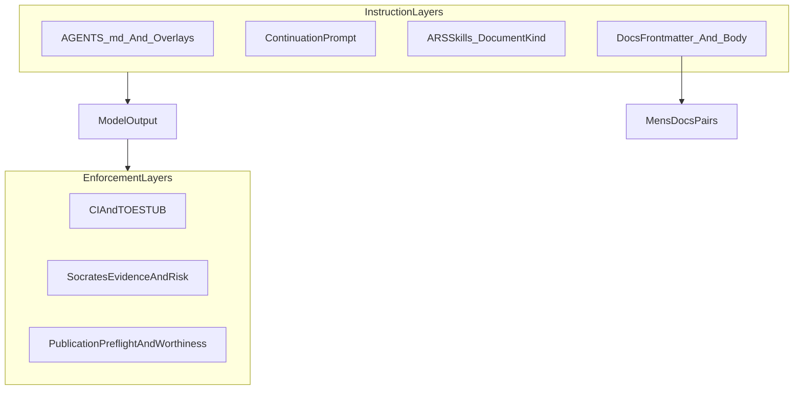

# Prompt engineering, system prompts, document-skills, and SCIENTIA

This page records research findings on prompt engineering and system-prompt design, and maps them onto Vox systems: continuation prompts, ARS skills, documentation extraction, and SCIENTIA publication flows.

It is research guidance, not a shipped contract. Contract and policy surfaces remain in `contracts/`, CI gates, and crate-level SSOT documentation.

## Executive summary

1. Prompt quality depends more on layered instruction architecture than on one large prompt.
2. Skills-as-documents is now an industry-standard pattern; Vox can reuse this pattern with existing ARS trust and sandbox controls.
3. Document ingestion and retrieval increase indirect prompt-injection risk and require explicit trust boundaries.
4. SCIENTIA automation must preserve human accountability for claims, ethics, and venue disclosures.
5. Legacy submission ecosystems (journal portals, arXiv workflows, DOI metadata channels) require explicit AI-use disclosure and citation integrity checks.

## What external guidance converges on

### Layered instruction design

- OpenAI recommends clear role separation and explicit instructions, with strong emphasis on structured prompting and eval-driven iteration ([OpenAI prompt engineering](https://developers.openai.com/api/docs/guides/prompt-engineering/), [OpenAI reasoning best practices](https://developers.openai.com/api/docs/guides/reasoning-best-practices)).
- Anthropic recommends strict structure, tagged sections, and context management as a first-class engineering concern ([Anthropic system prompts](https://docs.anthropic.com/en/docs/system-prompts), [Claude prompt best practices](https://www.claude.com/blog/best-practices-for-prompt-engineering), [effective context engineering](https://www.anthropic.com/engineering/effective-context-engineering-for-ai-agents)).
- Google guidance similarly treats system instructions as durable policy context and emphasizes instruction ordering and explicit constraints ([Vertex system instructions](https://docs.cloud.google.com/vertex-ai/generative-ai/docs/learn/prompts/system-instructions), [Gemini prompting strategies](https://ai.google.dev/gemini-api/docs/prompting-strategies)).

### Long-context behavior and recency

Long-context studies and vendor practice show strong positional bias in model attention. In practical terms, this supports keeping durable policy short and relocating session-critical behavioral reinforcement near the active context edge (for example continuation prompts and machine-verifiable gates).

References: [Lost-in-the-middle summary](https://www.morphllm.com/lost-in-the-middle-llm), [Found in the Middle paper index](https://www.semanticscholar.org/paper/Found-in-the-Middle%3A-Calibrating-Positional-Bias-Hsieh-Chuang/9f3c17e20dff7321ddc849f8bf5194ba94370c46), [arXiv:2406.02536](https://arxiv.org/pdf/2406.02536).

## Skills-as-documents and progressive disclosure

External ecosystems now package reusable agent capabilities as markdown plus front matter:

- Cursor Skills use `SKILL.md` with metadata and project/user discovery paths ([Cursor skills docs](https://www.cursor.com/docs/context/skills)).
- Anthropic Agent Skills use metadata + markdown body + optional progressive resource loading ([Agent skills overview](https://docs.anthropic.com/en/docs/agents-and-tools/agent-skills/overview), [skill best practices](https://docs.anthropic.com/en/docs/agents-and-tools/agent-skills/best-practices)).

This aligns with Vox `SKILL.md` concepts documented in [Vox Skill Marketplace](../reference/skill_marketplace.md). It also aligns with ARS support for `SkillKind::Document` and trust-aware runtime policies in `vox-skills`.

## Prompt security and untrusted document flows

### Threat model

- OWASP ranks prompt injection as a top LLM risk family, including direct and indirect attacks ([OWASP LLM01:2025](https://genai.owasp.org/llmrisk/llm01-prompt-injection/)).
- Indirect prompt injection in retrieval-heavy systems means untrusted document text can alter behavior if treated as instruction rather than data ([Rag 'n Roll](https://arxiv.org/html/2408.05025v1), [MSRC indirect prompt injection defenses](https://msrc.microsoft.com/blog/2025/07/how-microsoft-defends-against-indirect-prompt-injection-attacks)).

### Implication for Vox document workflows

When using skills, docs, or publication metadata as context, default posture should be:

- trusted instructions are explicit, versioned, and bounded,
- retrieved documents are treated as untrusted data until validated,
- policy and quality gates remain outside model free-form output.

## SCIENTIA and legacy publication implications

SCIENTIA publication automation already encodes hard boundaries for fabricated or undisclosed AI use in [SCIENTIA publication automation SSOT](scientia-publication-automation-ssot.md) and companion publication readiness docs.

External publication policy direction is consistent:

| Policy source | Practical implication for Vox SCIENTIA |
| --- | --- |
| [COPE AI tools position](https://publicationethics.org/guidance/cope-position/authorship-and-ai-tools) | AI cannot be an author; humans remain accountable. |
| [ICMJE AI use by authors](https://www.icmje.org/recommendations/browse/artificial-intelligence/ai-use-by-authors.html) | Disclosure in submission workflow and manuscript body is expected. |
| [WAME revised recommendations](https://www.wame.org/news-details.php?nid=40) | Tool/version/method disclosure and author responsibility. |
| [Nature AI policy](http://www.npg.nature.com/nature-portfolio/editorial-policies/ai) | Disclosure requirements and stricter controls on generated media. |
| [Elsevier journal AI policy](https://www.elsevier.com/en-gb/about/policies-and-standards/generative-ai-policies-for-journals) | Mandatory disclosure and human verification of references/claims. |
| [arXiv AI tool policy](https://blog.arxiv.org/2023/01/31/arxiv-announces-new-policy-on-chatgpt-and-similar-tools/) | Significant AI use disclosure; authors own all content quality. |
| [IEEE AI text guidance](https://open.ieee.org/author-guidelines-for-artificial-intelligence-ai-generated-text) | Disclosure in article sections and strict accountability. |
| [BMJ AI use policy](https://authors.bmj.com/policies/ai-use/) | Natural-person authorship and explicit usage disclosure. |
| [JAMA reporting guidance](https://jamanetwork.com/journals/jama/fullarticle/2816213) | Structured reporting of tool details and usage surface. |
| [Crossref metadata requirements](https://www.crossref.org/documentation/schema-library/required-recommended-elements/) | Metadata completeness and provenance remain mandatory. |
| [Zenodo software metadata guidance](https://help.zenodo.org/docs/github/describe-software/) | Deposit metadata integrity (`CITATION.cff`, `.zenodo.json`) is operationally important. |

### Legacy systems

Legacy systems in this context means journal web portals, email-driven editorial pipelines, and manually mediated archive submissions. These systems still require human attestation, policy-aware disclosures, and rigorous citation checks. Prompt libraries and document-skills can accelerate preparation, but cannot replace accountable authorship workflows.

## Integration guidance for Vox

### Near-term, low-risk moves

1. Publish venue-specific document-skills (for disclosure templates, checklist transforms, and metadata hygiene) using existing ARS trust boundaries.
2. Keep policy gates deterministic and machine-checkable (`publication_preflight`, Socrates evidence checks, CI contracts).
3. Add explicit disclosure fields in publication metadata pathways where needed, while preserving current SSOT ownership.

### Research-to-implementation boundaries

- Do not treat citation or readership projections as hard publish gates by default.
- Do not allow free-form model outputs to bypass digest-bound approvals or preflight findings.
- Do not mark policy claims as shipped until linked code paths and contracts exist.

## Related Vox sources

- [Continuation Prompt Engineering](../contributors/continuation-prompt-engineering.md)
- [Documentation governance](../contributors/documentation-governance.md)
- [ADR 002 — Diataxis documentation architecture](../adr/002-diataxis-doc-architecture.md)
- [SCIENTIA publication automation SSOT](scientia-publication-automation-ssot.md)
- [SCIENTIA publication readiness audit](scientia-publication-readiness-audit.md)
- [Vox Skill Marketplace](../reference/skill_marketplace.md)

## Bibliography (external)

- [https://developers.openai.com/api/docs/guides/prompt-engineering/](https://developers.openai.com/api/docs/guides/prompt-engineering/)
- [https://developers.openai.com/api/docs/guides/reasoning-best-practices](https://developers.openai.com/api/docs/guides/reasoning-best-practices)
- [https://docs.anthropic.com/en/docs/system-prompts](https://docs.anthropic.com/en/docs/system-prompts)
- [https://www.claude.com/blog/best-practices-for-prompt-engineering](https://www.claude.com/blog/best-practices-for-prompt-engineering)
- [https://www.anthropic.com/engineering/effective-context-engineering-for-ai-agents](https://www.anthropic.com/engineering/effective-context-engineering-for-ai-agents)
- [https://docs.cloud.google.com/vertex-ai/generative-ai/docs/learn/prompts/system-instructions](https://docs.cloud.google.com/vertex-ai/generative-ai/docs/learn/prompts/system-instructions)
- [https://ai.google.dev/gemini-api/docs/prompting-strategies](https://ai.google.dev/gemini-api/docs/prompting-strategies)
- [https://genai.owasp.org/llmrisk/llm01-prompt-injection/](https://genai.owasp.org/llmrisk/llm01-prompt-injection/)
- [https://arxiv.org/html/2408.05025v1](https://arxiv.org/html/2408.05025v1)
- [https://msrc.microsoft.com/blog/2025/07/how-microsoft-defends-against-indirect-prompt-injection-attacks](https://msrc.microsoft.com/blog/2025/07/how-microsoft-defends-against-indirect-prompt-injection-attacks)
- [https://publicationethics.org/guidance/cope-position/authorship-and-ai-tools](https://publicationethics.org/guidance/cope-position/authorship-and-ai-tools)
- [https://www.icmje.org/recommendations/browse/artificial-intelligence/ai-use-by-authors.html](https://www.icmje.org/recommendations/browse/artificial-intelligence/ai-use-by-authors.html)
- [https://www.wame.org/news-details.php?nid=40](https://www.wame.org/news-details.php?nid=40)
- [http://www.npg.nature.com/nature-portfolio/editorial-policies/ai](http://www.npg.nature.com/nature-portfolio/editorial-policies/ai)
- [https://www.elsevier.com/en-gb/about/policies-and-standards/generative-ai-policies-for-journals](https://www.elsevier.com/en-gb/about/policies-and-standards/generative-ai-policies-for-journals)
- [https://blog.arxiv.org/2023/01/31/arxiv-announces-new-policy-on-chatgpt-and-similar-tools/](https://blog.arxiv.org/2023/01/31/arxiv-announces-new-policy-on-chatgpt-and-similar-tools/)
- [https://open.ieee.org/author-guidelines-for-artificial-intelligence-ai-generated-text](https://open.ieee.org/author-guidelines-for-artificial-intelligence-ai-generated-text)
- [https://authors.bmj.com/policies/ai-use/](https://authors.bmj.com/policies/ai-use/)
- [https://jamanetwork.com/journals/jama/fullarticle/2816213](https://jamanetwork.com/journals/jama/fullarticle/2816213)
- [https://www.crossref.org/documentation/schema-library/required-recommended-elements/](https://www.crossref.org/documentation/schema-library/required-recommended-elements/)
- [https://help.zenodo.org/docs/github/describe-software/](https://help.zenodo.org/docs/github/describe-software/)
