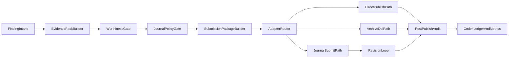

## SCIENTIA publication automation SSOT

This is the primary SSOT for turning Vox/Populi findings into publishable scientific artifacts quickly, safely, and reproducibly.

Scope:

- direct publication and self-archival paths (`arXiv`, Zenodo-style deposition, Crossref-grade metadata),
- journal submission readiness (`JMLR`, `TMLR`, `JAIR`, major publisher AI policies),
- Vox-native orchestration (`vox-orchestrator`, Populi mesh, Socrates, eval gates, SCIENTIA manifest lifecycle).

## North-star outcome

Minimize time from validated finding to submission-ready package while preserving:

- epistemic integrity (no fabricated claims/citations/data),
- reproducibility (before/after evidence with replayability),
- policy compliance (journal, ethics, AI disclosure, metadata quality),
- provenance (digest-bound state transitions and auditable pipeline decisions).

## Source anchors

Internal SSOT and implementation anchors:

- `docs/src/architecture/scientia-publication-readiness-audit.md`
- `docs/src/architecture/prompt-engineering-document-skills-scientia-research-2026.md`
- `docs/src/architecture/scientia-publication-worthiness-ssot-unification-research-2026.md`
- `docs/src/architecture/scientia-implementation-wave-playbook-2026.md`
- `docs/src/adr/011-scientia-publication-ssot.md`
- `docs/src/how-to/how-to-scientia-publication.md`
- `docs/src/reference/socrates-protocol.md`
- `docs/src/architecture/populi-workflow-guide.md`
- `docs/src/reference/external-repositories.md`
- `crates/vox-publisher/src/publication.rs`
- `crates/vox-publisher/src/publication_preflight.rs`
- `crates/vox-publisher/src/scientific_metadata.rs`
- `crates/vox-publisher/src/zenodo_metadata.rs`
- `crates/vox-cli/src/commands/scientia.rs`
- `crates/vox-cli/src/commands/db.rs`
- `crates/vox-orchestrator/src/mcp_tools/tools/scientia_tools.rs`
- `crates/vox-db/src/schema/domains/publish_cloud.rs` (publication tables in the `publish_cloud` Arca fragment)
- Impact / readership projection (research seed, **not** a publish gate): [scientia-impact-readership-research-2026.md](scientia-impact-readership-research-2026.md), `contracts/scientia/impact-readership-projection.seed.v1.yaml`

External requirements anchors (authoritative policies/guides):

- JMLR final prep and style requirements
- TMLR author/submission/ethics pages (OpenReview + double-blind + broader impact)
- JAIR formatting/final prep
- arXiv moderation and format requirements
- COPE authorship and AI-tools position
- ICMJE AI recommendations
- Nature Portfolio AI policy
- Elsevier generative AI writing policy
- Crossref required/recommended metadata guidance

## Scientia package-family topology

To avoid `vox-publisher` becoming a god-object crate, the Scientia namespace is split into
package boundaries:

- `vox-scientia-core`: publication manifest, preflight, worthiness, metadata/evidence modeling.
- `vox-scientia-social`: channel syndication DTOs/outcomes and social adapter surface.
- `vox-scientia-runtime`: runtime composition boundary for orchestrator-facing flows.
- `vox-scientia-api`: API composition boundary for CLI/MCP surfaces.

`vox-publisher` remains as a compatibility shim while downstream imports migrate.

## Pipeline SSOT

## Automation boundary matrix

|Workflow element|Automate|Assist|Never automate|
|---|---|---|---|
|Artifact capture (run metadata, hashes, manifests, metrics export)|yes|n/a|no|
|Schema and policy preflight checks|yes|n/a|no|
|Citation syntax and resolvability checks|yes|n/a|no|
|Journal template/package scaffolding|yes|n/a|no|
|Metadata normalization (`authors`, ORCID, funding, license)|yes|n/a|no|
|DOI/adapter payload generation|yes|n/a|no|
|Final scientific claim selection and framing|no|yes|yes (fully autonomous)|
|Novelty judgment|no|yes|yes (fully autonomous)|
|Impact / “what gets cited or read” projection|no|yes|yes (as a hard gate or sole promotion criterion)|
|Significance scoring decomposition (inspectable axes)|yes|yes|yes (uncritical promotion from scores alone)|
|Fabrication-prone narrative sections without evidence|no|no|yes|
|Inclusion of unverifiable benchmark deltas|no|no|yes|
|Undisclosed AI authorship/content generation|no|no|yes|
|Safety/ethics risk acceptance|no|yes|yes (fully autonomous)|
|Final submission button with external legal/accountability implications|no|yes|yes (unless explicitly policy-approved human-in-loop)|

## Biggest AI-slop failure modes and controls

|Failure mode|Why it harms science|Vox control surface|Required gate|
|---|---|---|---|
|Fabricated citations|corrupts scholarly graph and reproducibility|citation parse/resolution checks + Socrates evidence linking|hard fail|
|Benchmark gaming/cherry-picking|false claims of improvement|before/after benchmark protocol + eval gate traces|hard fail|
|Confident unsupported claims|hallucination masquerading as findings|Socrates risk decision (`Answer/Ask/Abstain`) and contradiction metrics|hard fail for publication path|
|Undisclosed AI generation in restricted contexts|policy breach / desk reject risk|policy profile in publication preflight|hard fail|
|AI-generated figures in disallowed venues|legal and integrity breach|policy gate by target venue|hard fail|
|Metadata incompleteness|DOI and discoverability failures|structured scientific metadata + completeness score|fail for external deposit paths|

## Journal/direct-publication requirement-to-gate mapping

|Requirement|Gate in Vox pipeline|Status|
|---|---|---|
|Double-blind + anonymization (`TMLR`)|`publication_preflight` profile `double_blind` + additional anonymization checks|partial (email heuristic present, broader anonymization missing)|
|Camera-ready source bundle and compileability (`JMLR`/`JAIR`)|`SubmissionPackageBuilder` + compile preflight|missing|
|Broader impact / ethics disclosure (`TMLR`, publisher policies)|structured `scientific_publication.ethics_and_impact` + policy gate|partial|
|AI disclosure and no AI authorship (COPE/ICMJE/Nature/Elsevier)|policy gate + metadata declarations|partial|
|arXiv format/moderation constraints|package + format preflight profile `arxiv`|missing|
|DOI-quality metadata (Crossref)|metadata completeness + export mapper|partial|
|Self-archive metadata (`Zenodo`)|`zenodo_metadata` generation|partial (metadata done, upload/deposit not done)|

## Vox capability map for publication automation

### Already usable now

- SCIENTIA canonical manifest lifecycle with digest-bound approvals and submission ledger.
- Structured scholarly metadata in `metadata_json.scientific_publication`.
- Preflight checks with readiness score, profile-aware gating, consolidated `manual_required` / `confidence`, and ordered `next_actions`; CLI/MCP status surfaces now embed the same checklist so operators can keep one default attention surface open.
- Syndication hydrate accepts canonical `metadata_json.syndication`, legacy `scientia_distribution`, and contract `channels`/`channel_payloads` normalization; Twitter uses the same retry budget machinery as other HTTP adapters; `publication-retry-failed` skips channels already marked `Success` for the current digest.
- Scholarly adapters already include `local_ledger`, `echo_ledger`, `zenodo`, and `openreview`, while arXiv remains operator-assist via staging export + handoff events.
- Zenodo deposition metadata JSON generation.
- MCP/CLI parity for core prepare/approve/submit/status and preflight.
- Socrates anti-hallucination telemetry and gate concepts.
- `metadata_json.scientia_evidence` (see `vox_publisher::scientia_evidence`): optional Socrates rollup (merged from VoxDb when using preflight `--with-worthiness`), eval-gate snapshot, benchmark baseline/candidate pair, and human attestations; folded into `publication_worthiness` scoring with manifest preflight heuristics.

### Reusable orchestration/mesh assets

- A2A messaging and handoff payloads for reviewer-style multi-agent workflows.
- Populi coordination patterns (distributed lock, heartbeats, conflict paths).
- Reliability and benchmark telemetry pathways for publication KPIs.

### Non-automatable or human-accountability-critical steps

- final claims and novelty significance assertion,
- ethical risk acceptance and framing,
- legal/publisher final attestation steps,
- submission authorization where account liability is personal/institutional.

## Before/after benchmark protocol (publication-grade)

Required evidence pair per claim:

1. `baseline_run` and `candidate_run` with immutable run IDs and repository context.
2. Identical benchmark manifest and policy profile.
3. Captured outputs:
   - eval JSON,
   - gate JSON,
   - telemetry summary,
   - manifest digest,
   - environment and dependency fingerprints.
4. Reported delta set:
   - effect size,
   - confidence/variance window or repeated-run stability proxy,
   - failure-mode deltas (not only headline wins).
5. Publishability condition:
   - no regression in critical safety/quality gates unless explicitly justified and approved.

## Gap priorities and solutions

### Gap 1: package builder and venue profiles (complex)

- **Where:** `vox-publisher` has metadata/preflight but no camera-ready package builder.
- **Why:** manual packaging dominates cycle time and introduces policy errors.
- **Minimum viable fix:** add `SubmissionPackageBuilder` with profiles `jmlr`, `tmlr`, `jair`, `arxiv`; emit deterministic archive manifest.
- **Expanded solution (how/where/when/why):**
  - add `crates/vox-publisher/src/submission/mod.rs` with profile-specific validators;
  - wire CLI/MCP commands `publication-package-build` and `publication-package-validate`;
  - persist package artifact metadata in publication tables with digest linkage;
  - run compile/format checks and include machine-readable report in manifest metadata.
- **Success criteria:** >=95% package validation pass in CI dry-runs before human submission.

### Gap 2: operator routing still dominates more than it should (medium)

- **Where:** the code already has multiple adapters, but the user still has to think in terms of low-level surfaces (`preflight`, approvals, pipeline, status, social simulation, retry).
- **Why:** time is still lost on choosing the right command sequence rather than following one obvious happy path.
- **Minimum viable fix:** standardize on `publication-preflight` / `publication-status` as the checklist surfaces and `publication-scholarly-pipeline-run` as the default scholarly path.
- **Expanded solution:**
  - keep low-level commands, but lead docs and MCP/CLI outputs with ordered `next_actions`;
  - make `publication-status` the persistent operator checklist for approvals, worker outcomes, and retries;
  - keep adapter work focused on hard gaps (`Crossref`, journal portals) instead of inventing a new orchestration layer.
- **Success criteria:** a new operator can follow one obvious scholarly path without reconstructing the command graph from docs.

### Gap 3: anti-slop policy gate depth (medium)

- **Where:** current preflight catches core checks but not full anti-slop taxonomy.
- **Why:** fabricated or weakly supported science can still pass narrow checks.
- **Minimum viable fix:** add citation resolvability + claim-evidence linkage completeness checks.
- **Expanded solution:** integrate Socrates outputs as hard publication predicates for factual claims.
- **Success criteria:** zero unresolved fabricated-reference incidents in internal publication trials.

### Gap 4: benchmark provenance unification (complex)

- **Where:** benchmarks, Mens/Populi artifacts, and publication manifests are not fully unified.
- **Why:** difficult to prove reproducibility and before/after integrity at publication time.
- **Minimum viable fix:** define a single `EvidencePack` schema and attach to manifest metadata.
- **Expanded solution:** orchestrated evidence pack builder pulls eval/gate/telemetry + commit/env fingerprints and signs report digest.
- **Success criteria:** every publication candidate has a complete evidence pack with replay instructions.

### Gap 5: worthiness classification consistency (medium)

- **Where:** no dedicated publishability rubric in SSOT form.
- **Why:** inconsistent decisions about what is scientifically worthy.
- **Minimum viable fix:** adopt explicit `Publish/AskForEvidence/Abstain` rubric with numeric thresholds.
- **Expanded solution:** policy engine consuming worthiness metrics and producing deterministic decision traces.
- **Success criteria:** decision disagreement rate between reviewers and rubric <15% after calibration period.

## KPI set for this SSOT

- `submission_readiness_score`
- `metadata_completeness_rate`
- `evidence_pack_completeness_rate`
- `policy_gate_pass_rate`
- `time_to_submission_ms`
- `adapter_submission_success_rate`
- `revision_turnaround_ms`
- `socrates_contradiction_ratio_for_publishables`

## Decision policy

Use the companion rules doc:

- `docs/src/reference/scientia-publication-worthiness-rules.md`

This architecture SSOT defines pipeline shape, boundaries, and implementation priorities; the rules doc defines scientific-worthiness classification and hard red lines.

## Scientia social distribution (2026)

Scientia publication manifests should use `metadata_json.syndication` for
cross-channel routing metadata and policy. Canonical schema artifacts:

- `contracts/scientia/distribution.schema.json`
- `contracts/scientia/distribution.default.yaml`
- `contracts/scientia/distribution.topic-packs.yaml`
- `contracts/scientia/social-execution-board.template.yaml`
- `contracts/scientia/social-execution-board.generated.yaml`

Platform constraints and automation boundaries:

- Reddit: Data API/OAuth with `submit` scope and strict User-Agent policy.
- Hacker News: official API remains read-only; use manual-assist submit links.
- YouTube: `videos.insert` requires OAuth user flow and quota budgeting; unverified projects are private-only until audit-approved.

Required controls for live distribution:

- digest-bound approvals remain mandatory,
- per-channel attempts are ledgered in `publication_attempts`,
- retries follow explicit profile budgets (no unbounded retry loops),
- secrets are resolved through env/keyring/auth fallback precedence and never embedded into manifest payloads,
- channel routing decisions honor topic filters and per-channel worthiness floors when configured.

Distribution precedence:

1. explicit per-item manifest/channel overrides,
2. `metadata_json.syndication.distribution_policy.channel_policy`,
3. orchestrator runtime/env overrides for live operations.

## External policy URL appendix

- JMLR author and final style information: [https://jmlr.org/author-info.html](https://jmlr.org/author-info.html)
- TMLR overview and policies: [https://jmlr.org/tmlr/](https://jmlr.org/tmlr/)
- TMLR OpenReview venue and submission details: [https://openreview.net/group?id=TMLR](https://openreview.net/group?id=TMLR)
- JAIR submission and formatting guidance: [https://www.jair.org/index.php/jair/about/submissions](https://www.jair.org/index.php/jair/about/submissions)
- arXiv submission and moderation policy: [https://info.arxiv.org/help/submit/index.html](https://info.arxiv.org/help/submit/index.html)
- COPE AI tools position statement: [https://publicationethics.org/cope-position-statements/ai-author](https://publicationethics.org/cope-position-statements/ai-author)
- ICMJE recommendations, including AI guidance: [https://www.icmje.org/recommendations/](https://www.icmje.org/recommendations/)
- Nature Portfolio AI policy for authors: [https://www.nature.com/nature-portfolio/editorial-policies/ai](https://www.nature.com/nature-portfolio/editorial-policies/ai)
- Elsevier generative AI in publishing policy: [https://www.nature.com/nature-portfolio/editorial-policies/ai](https://www.nature.com/nature-portfolio/editorial-policies/ai)
- Crossref metadata best practices: [https://www.crossref.org/documentation/schema-library/markup-guide-metadata-segments/](https://www.crossref.org/documentation/schema-library/markup-guide-metadata-segments/)
- Reddit Data API Wiki: [https://support.reddithelp.com/hc/en-us/articles/16160319875092-Reddit-Data-API-Wiki](https://support.reddithelp.com/hc/en-us/articles/16160319875092-Reddit-Data-API-Wiki)
- Reddit Developer Terms: [https://www.redditinc.com/policies/developer-terms](https://www.redditinc.com/policies/developer-terms)
- Reddit Data API Terms: [https://www.redditinc.com/policies/data-api-terms](https://www.redditinc.com/policies/data-api-terms)
- Hacker News API README: [https://raw.githubusercontent.com/HackerNews/API/master/README.md](https://raw.githubusercontent.com/HackerNews/API/master/README.md)
- Y Combinator Hacker News API note: [https://www.ycombinator.com/blog/hacker-news-api](https://www.ycombinator.com/blog/hacker-news-api)
- YouTube videos.insert reference: [https://developers.google.com/youtube/v3/docs/videos/insert](https://developers.google.com/youtube/v3/docs/videos/insert)
- YouTube quota reference: [https://developers.google.com/youtube/v3/determine_quota_cost](https://developers.google.com/youtube/v3/determine_quota_cost)
