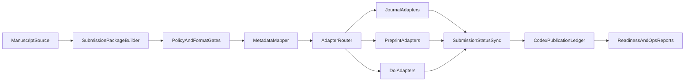

## SCIENTIA publication readiness audit

Primary companion SSOT documents:

- `docs/src/architecture/scientia-publication-automation-ssot.md`
- `docs/src/reference/scientia-publication-worthiness-rules.md`
- `docs/src/reference/scientia-ssot-handbook.md` (glossary, status vocabulary, checklists, SLOs)

## Goal and scope

This audit maps the current SCIENTIA publication architecture in Vox to publication requirements needed for:

- core AI journals and workflows (`JMLR`, `TMLR`, `JAIR`, and common ML journal expectations),
- self-publication and archival identifiers (`arXiv`, `Zenodo`, `Crossref`-grade metadata).

It also defines the implementation gap between where the codebase is now and what is needed for end-to-end automated scientific publication.

## Current architecture baseline (where we are)

### Implemented publication surfaces

- CLI facade: `vox scientia` delegates to `vox db` publication lifecycle handlers.
  - `crates/vox-cli/src/commands/scientia.rs`
  - `crates/vox-cli/src/commands/db.rs`
- Canonical publication object with digest hashing:
  - `crates/vox-publisher/src/publication.rs`
- Scholarly adapter interface and current local adapter:
  - `crates/vox-publisher/src/scholarly/`
- Persistence and state ledger:
  - `crates/vox-db/src/schema/domains/publish_cloud.rs`
  - `crates/vox-db/src/store/ops_publication.rs`
- MCP parity tooling:
  - `crates/vox-mcp/src/tools/scientia_tools.rs`
  - `contracts/mcp/tool-registry.canonical.yaml`
- Existing docs and decision record:
  - `docs/src/adr/011-scientia-publication-ssot.md`
  - `docs/src/how-to/how-to-scientia-publication.md`

### Implemented workflow

1. Prepare manifest (`publication-prepare`)
2. Run `publication-preflight` and follow ordered `next_actions`
3. Record digest-bound approvals (`publication-approve`)
4. Use `publication-scholarly-pipeline-run` as the default scholarly path (dry-run first, then live)
5. Track state/submissions/checklist state in `publication-status`

### Architecture strengths

- Canonical `PublicationManifest` with stable digest.
- Strong digest-bound approval semantics (dual approver gate).
- Durable ledger tables for manifest, approvals, attempts, scholarly submissions, and status events.
- CLI and MCP both expose the same lifecycle primitives.

### Current adapter reality (2026-03)

Code ships `local_ledger`, `echo_ledger`, and credentialed **`zenodo`** / **`openreview`** adapters behind `VOX_SCHOLARLY_ADAPTER`, plus operator-assisted **arXiv** via staging export + handoff events. Journal portals (ScholarOne, native TMLR UI-only flows) and automated `Crossref` deposit remain out of scope until wired.

### Phase 0 metadata (implemented)

Publication manifests may embed structured scholarly fields under `metadata_json.scientific_publication` (see `vox_publisher::scientific_metadata`). CLI: `vox scientia publication-prepare … --scholarly-metadata-json <file>`. MCP: optional `scholarly_metadata` object on `vox_scientia_publication_prepare`. This keeps the digest-bound contract while normalizing authors, license, funding, and reproducibility attestations for upcoming adapters.

## External requirements matrix (where the target ecosystem is)

### Core AI journals and venues

|Venue/workflow|Key requirements relevant to automation|Source|
|---|---|---|
|`JMLR`|Mandatory official style, camera-ready source archive, reproducible build of manuscript, strict final preparation checks.|[JMLR author guide](https://www.jmlr.org/format/authors-guide.html)|
|`TMLR`|OpenReview submission flow, mandatory TMLR template, anonymized double-blind submission, ethics/broader-impact conditions when risk applies, supplementary reproducibility artifacts encouraged.|[TMLR author guide](https://www.jmlr.org/tmlr/author-guide.html), [TMLR submissions](https://jmlr.org/tmlr/submissions.html)|
|`JAIR`|Mandatory JAIR style/template, production-ready source bundle, final formatting checklist, publication agreement and source package expectations.|[JAIR final preparation](https://www.jair.org/index.php/jair/authorinstrs), [JAIR formatting](https://www.jair.org/index.php/jair/formatting)|
|Common ML journal norm|Replication-oriented methodology, software/data disclosure expectations, statistical reporting quality.|[Machine Learning journal info summary](https://webdocs.cs.ualberta.ca/~holte/mlj/info-for-authors.html)|

### Self-publication and identifier systems

|Platform|Key requirements relevant to automation|Source|
|---|---|---|
|`arXiv`|Registered submitter flow, accepted source/figure constraints, strict packaging/file naming, metadata quality and moderation rules.|[arXiv submission guidelines](https://info.arxiv.org/help/submit/index.html), [arXiv format policy](https://info.arxiv.org/help/policies/format_requirements.html)|
|`Zenodo`|GitHub release archiving flow, `.zenodo.json` and/or `CITATION.cff`, metadata precedence and richer Zenodo-specific metadata support.|[Zenodo .zenodo.json](https://help.zenodo.org/docs/github/describe-software/zenodo-json/), [Zenodo CITATION.cff](https://help.zenodo.org/docs/github/describe-software/citation-file/)|
|`Crossref`|DOI-quality metadata schema with required and recommended fields; richer records require contributors, ORCID, funding, license, citations, abstracts.|[Crossref required/recommended metadata](https://crossref.org/documentation/schema-library/required-recommended-elements/)|

## Automation feasibility notes

- `OpenReview` (relevant to `TMLR`) supports API-based note/submission operations, but venue-level invitations and permissions still govern what automation can execute.
  - [OpenReview API notes docs](https://docs.openreview.net/getting-started/using-the-api/objects-in-openreview/introduction-to-notes)
  - [OpenReview create/change/delete notes](https://docs.openreview.net/how-to-guides/workflow/how-to-create-change-and-delete-notes)
- `ScholarOne` exposes web services APIs, but practical automation requires site-specific API provisioning and credentials from the hosting publisher.
  - [ScholarOne API overview](https://developer.scholarone.com/docs/overview-copy)
- `arXiv` automation is generally packaging-focused; final submit flow is account and policy bound.

## Gap analysis (where we need to go)

### Lifecycle stage 1: authoring and package assembly

|Item|Current SCIENTIA state|Gap|Risk|Recommended slice|
|---|---|---|---|---|
|Journal template support|Stores markdown body only|No template-aware build for JMLR/TMLR/JAIR|Submission rejects or manual rebuilds|Add `SubmissionPackageBuilder` with template profiles (`jmlr`, `tmlr`, `jair`, `arxiv`)|
|Source bundle generation|No camera-ready archive builder|No zip/tar source pack with compile validation|Delays and formatting failures|Add package artifact table + generated archives + compile check|
|Figure and asset checks|No figure policy validation|No arXiv/journal file format checks|Hard submission failures|Add preflight validator (`file names`, `format family`, missing includes)|

### Lifecycle stage 2: metadata normalization

|Item|Current SCIENTIA state|Gap|Risk|Recommended slice|
|---|---|---|---|---|
|Author metadata|Primary `author` string plus optional `metadata_json.scientific_publication.authors`|Digest and CLI still use single `author` for simplicity; full co-author list lives in JSON block|Mismatches if `author` string disagrees with `authors[]`|Prefer deriving display `author` from first scientific author when present; validate consistency in preflight (Phase 1)|
|Funding/COI/license|Free-form `metadata_json` only|No normalized compliance fields|Compliance omissions|Add strongly typed compliance block|
|Citations|Optional `citations_json` blob|No schema/validation/export adapters (BibTeX/JATS/Crossref maps)|Inconsistent citation data|Add citation schema + exporters|

### Lifecycle stage 3: policy and compliance gates

|Item|Current SCIENTIA state|Gap|Risk|Recommended slice|
|---|---|---|---|---|
|Double-blind readiness|Dual approver gate exists|No anonymization gate/checklist|Desk reject risk for blind review venues|Add anonymization scanner and attestation|
|Ethics/broader impact|No explicit policy object|No risk flag / statement requirements|Ethics non-compliance|Add policy declarations + required fields by venue|
|Data/code availability|No reproducibility declaration schema|No explicit artifact disclosure gate|Reproducibility review friction|Add reproducibility checklist schema + gate|

### Lifecycle stage 4: submission adapters

|Item|Current SCIENTIA state|Gap|Risk|Recommended slice|
|---|---|---|---|---|
|Journal/preprint connectors|`local_ledger`, `echo_ledger`, `zenodo`, `openreview`, plus arXiv-assist staging/handoff|No `Crossref` or journal-portal adapters; some venues remain human-submit by design|Manual steps persist for account-bound portals and DOI deposit|Keep current adapters, add `Crossref` export/deposit only when operationally real|
|Venue-specific payloads|Manifest + staging/export helpers exist for Zenodo/OpenReview/arXiv-assist|Still no single default checklist across scholarly/social surfaces without reading multiple docs|Operator routing overhead|Use `publication-preflight` / `publication-status` as the checklist surfaces and `publication-scholarly-pipeline-run` as the default path|
|Retry/idempotency semantics|Digest-bound jobs, polling, and retry taxonomy exist|Worker preflight and permanent-vs-retryable classification need to stay aligned with operator preflight|Operational fragility if workers retry conceptually permanent failures|Reuse preflight in worker ticks and keep a small explicit classification enum|

### Lifecycle stage 5: post-submission tracking

|Item|Current SCIENTIA state|Gap|Risk|Recommended slice|
|---|---|---|---|---|
|External status sync|Records local submit receipt/state|No remote status poll/ingest|State drift|Add periodic status sync job + transition mapping|
|Revision lifecycle|Version increments on digest change|No venue revision linkage semantics|Confusing revision history|Add external revision ID mapping|
|Acceptance/publication milestones|Generic status rows|No normalized milestone model|Weak reporting|Add milestone events (`submitted`, `under_review`, `accepted`, `published`)|

### Lifecycle stage 6: archival and citation outputs

|Item|Current SCIENTIA state|Gap|Risk|Recommended slice|
|---|---|---|---|---|
|DOI and identifier strategy|No real DOI submission adapter|No DOI minting workflow support|No persistent identifier automation|Add DOI adapter path (`Zenodo` first, `Crossref` metadata export next)|
|Citation files|No generated `CITATION.cff` / `.zenodo.json`|Missing machine-readable citation assets|Reduced discoverability and citation quality|Add deterministic metadata exporters|
|Publication package provenance|Digest present|No signed or policy-bound package attestation|Trust and audit gaps|Add package provenance manifest derived from digest|

## Detailed architecture recommendation

## Implementation roadmap

### Phase 0 (immediate): schema and policy groundwork

- Extend publication metadata shape in `vox-publisher` and `vox-db` with:
  - `authors[]` with ORCID/affiliation,
  - funding/conflict/license fields,
  - reproducibility and ethics declarations.
- Keep backward compatibility by storing new typed blocks in additive fields before strict migration.

### Phase 1 (MVP automation): package and gate engine

- **Done (core):** `vox_publisher::publication_preflight` (metadata parse, author alignment, citations JSON, double-blind email scan, readiness score). CLI: `publication-prepare --preflight`, `publication-prepare-validated`, `publication-preflight`. MCP: `vox_scientia_publication_prepare` (`preflight`, `preflight_profile`), `vox_scientia_publication_preflight`.
- **Done (Zenodo bridge):** `vox_publisher::zenodo_metadata::zenodo_deposition_metadata` + CLI `publication-zenodo-metadata` (metadata JSON only; no HTTP).
- **Remaining:** LaTeX/camera-ready package builder, figure/filename validators, template compliance against JMLR/TMLR/JAIR style packs.

### Phase 2 (first external adapters): self-publication first

- Implement adapters in this order:
  1. `Zenodo` archive/DOI submission path,
  2. `OpenReview` submission pathway for `TMLR`-style workflows,
  3. assisted `arXiv` package export and submit handoff,
  4. `Crossref` metadata export/deposit pathway when operationally enabled.
- Persist adapter credentials/config via existing `VOX_*` conventions and policy gates.

### Phase 3 (operations): status sync and revision intelligence

- Add scheduled status synchronization and retry jobs.
- Normalize external status transitions into `publication_status_events`.
- Add revision mapping between local digest versions and external revision IDs.

### Phase 4 (reporting and governance)

- Add readiness dashboards and compliance reports:
  - metadata completeness rate,
  - submission success/failure rate by adapter,
  - median time from draft to submitted/published.
- Add CI checks for publication metadata schema conformance.

## Concrete code touchpoints for implementation

- Contract and model:
  - `crates/vox-publisher/src/publication.rs`
  - `crates/vox-publisher/src/scholarly/`
- DB schema and operations:
  - `crates/vox-db/src/schema/domains/publish_cloud.rs`
  - `crates/vox-db/src/store/ops_publication.rs`
- CLI:
  - `crates/vox-cli/src/commands/db.rs`
  - `crates/vox-cli/src/commands/scientia.rs`
- MCP:
  - `crates/vox-mcp/src/tools/scientia_tools.rs`
  - `contracts/mcp/tool-registry.canonical.yaml`

## Recommended KPIs

- `submission_readiness_score`: percent of required fields and checks passed for target venue.
- `time_to_submission_ms`: draft to first external submission.
- `submission_success_rate`: successful submissions per adapter.
- `revision_turnaround_ms`: digest update to remote revision acknowledgement.
- `metadata_completeness_rate`: share of records with ORCID/funding/license/citations populated.

## Rollout stages, legacy modes, and ledger metrics

**Stages (recommended):**

1. **Dev / CI** — `local_ledger` / `echo_ledger` only; no live repository credentials.
2. **Staging** — turn on one live adapter with Clavis-backed secrets and per-adapter `VOX_SCHOLARLY_DISABLE_*` kill-switches; run `publication-preflight` (and venue staging export) before submit.
3. **Production** — dual digest-bound approval enforced; a scheduler or supervisor runs `publication-external-jobs-tick` and `publication-scholarly-remote-status-sync-batch` (or their loop variants with bounded iterations). Operator-assisted arXiv uses `publication-arxiv-handoff-record` for append-only audit rows.

**Legacy / restricted:** Treat echo-only and dry-run paths as non-production. Shared developer profiles must not embed production Zenodo/OpenReview tokens.

**Operational metrics:** `vox scientia publication-external-pipeline-metrics` (alias: `vox db publication-external-pipeline-metrics`) returns a read-only JSON rollup: job counts by status and adapter (plus in-window slices), attempt/retry totals, `error_class` histogram, terminal latency averages and p50/p90/p99 in the window, per-adapter terminal success and retry ratios (`metrics_schema_version` **2**), snapshot activity, scholarly submission rows (in-window slice), and `publication_attempts` counts by channel. **KPI baselines:** capture periodic snapshots of this JSON (e.g. weekly) for regression review.

**Fast local acceptance slice:** `pwsh -File scripts/scientia/acceptance_matrix.ps1` runs publication DB integration tests and `scholarly_remote_status` unit tests.

## Conclusion

SCIENTIA already has a strong publication ledger and governance core (manifest + digest + approvals + durable state tracking). The main gap is not control-plane integrity; it is publication-system interoperability and venue-specific packaging/compliance automation. The recommended path is to keep the current SSOT model and add typed metadata, preflight gates, and real adapters in phased order.
