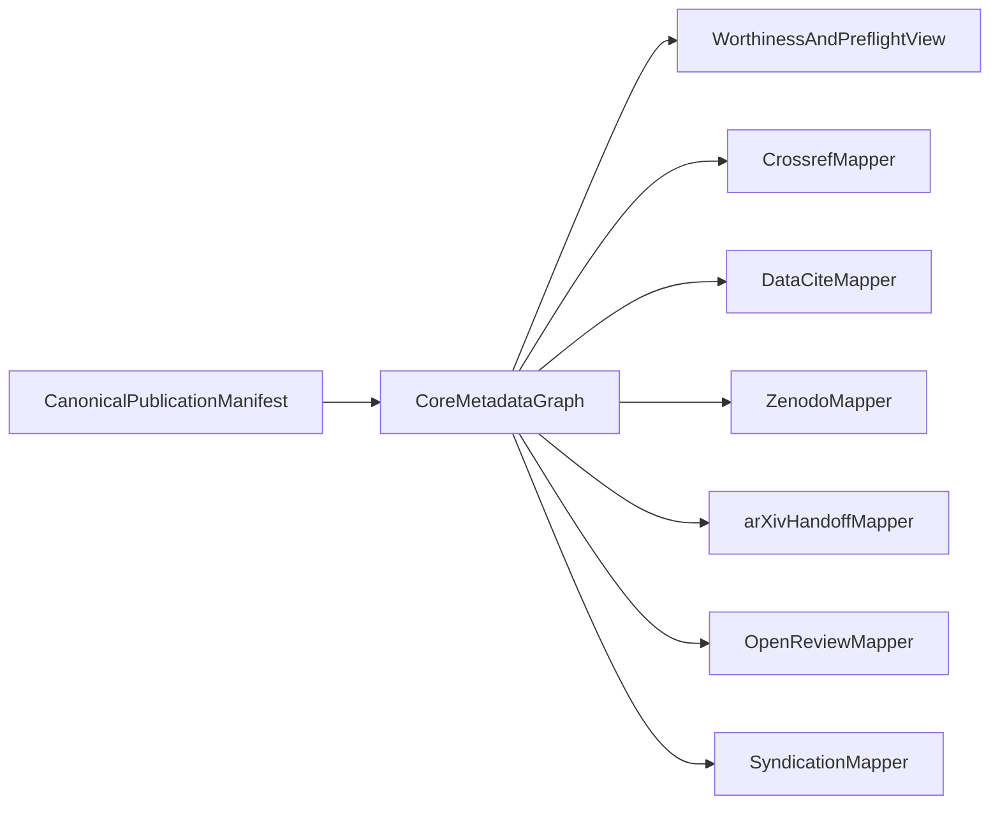

# SCIENTIA publication-worthiness and SSOT unification (research 2026)

This document implements the current research-plan deliverables for improving publication-worthiness generation and detection, while unifying single-source metadata across legacy and modern publication pathways.

Scope:

- AI and software engineering publication requirements,
- Canonical metadata SSOT for transformation into multiple venue formats,
- Automation boundaries that preserve scientific and ethical accountability.

It is a research and design artifact, not an implementation blueprint.

## Baseline assumptions

- Canonical publication lifecycle remains manifest-centered (`publication_manifests`, `publication_approvals`, `scholarly_submissions`, `publication_status_events`).
- Existing worthiness/preflight controls remain authoritative until replaced by versioned contracts.
- External bibliometric and policy APIs remain assistive, not sole publication gates.

Primary internal anchors:

- [SCIENTIA publication automation SSOT](scientia-publication-automation-ssot.md)
- [SCIENTIA publication readiness audit](scientia-publication-readiness-audit.md)
- [SCIENTIA publication worthiness rules](../reference/scientia-publication-worthiness-rules.md)
- `contracts/scientia/*.schema.json`

## Deliverable 1: standards-to-signals matrix

The matrix maps external standards into machine-checkable Vox signals.

| Standard source | Requirement class | Signal class | Vox check today | Gap | Proposed machine check |
| --- | --- | --- | --- | --- | --- |
| COPE/ICMJE/Nature/Elsevier/JAMA/BMJ/IEEE | AI-use disclosure, no AI authorship | `hard_gate` + `metadata_required` | Partial policy/preflight fields | Granularity by tool/version/scope | Add `ai_disclosure_profile` block with policy-profile validation |
| Crossref/DataCite | DOI-grade metadata completeness | `metadata_required` | Partial metadata mapper coverage | Inconsistent normalized field set | Add canonical metadata completeness score + adapter-specific required-field checks |
| JATS/legacy journal workflows | Structured article/package interchange | `metadata_recommended` + `diagnostic` | Limited package scaffolding | No unified JATS readiness profile | Add `jats_export_readiness` signal and profile checks |
| TMLR/JMLR/AAAI/NeurIPS reproducibility practices | Evidence support and reproducibility | `soft_gate` + `diagnostic` | Existing evidence/preflight scoring | Weak variance/seed/ablation specificity | Add `seed_count_transparency`, `uncertainty_reporting`, `ablation_adequacy` signals |
| arXiv policies | Source package and moderation constraints | `hard_gate` + `metadata_required` | arXiv-assist and handoff contract | No full format preflight profile | Add `arxiv_format_profile` and package static checks |
| ACM/EMSE open science artifact norms | Replication package quality | `soft_gate` + `diagnostic` | Partial through evidence fields | No explicit artifact quality taxonomy | Add `artifact_replay_bundle_quality` score and reason codes |
| FAIR/RSMD principles | Rich, reusable metadata | `metadata_recommended` | Some structured fields | No explicit FAIR coverage metric | Add `fair_metadata_coverage` metric as non-blocking diagnostic |
| Integrity research on fabricated references | Citation verification | `hard_gate` | Existing citation checks are partial | Confidence and provenance under-specified | Add `citation_verification_confidence` and `unresolved_reference_count` hard fail thresholds |
| Contamination/benchmark leakage research | Evaluation integrity | `soft_gate` + `diagnostic` | Partial benchmark evidence controls | No contamination-risk signal | Add `contamination_risk_flag` with traceable rationale |
| Peer-review ethics guidance | Human accountability boundaries | `never_automate` ledger | Existing boundary matrix | Needs explicit binding to system actions | Add action-level boundary policy IDs in runtime reports |

### Normalized signal catalog

- `hard_gate`: mandatory pass before publication submission attempt.
- `soft_gate`: failure does not block by default, but raises `next_actions`.
- `diagnostic`: explainability signal for operators and reviewers.
- `metadata_required`: route-specific required metadata.
- `metadata_recommended`: quality-improving, non-blocking metadata.

## Deliverable 2: canonical SSOT metadata graph proposal

### Canonical graph objective

Use one manifest-centered metadata graph (`metadata_json.scientific_publication` and adjacent blocks) as the single authoring source, then compile outward to route-specific payloads.



### Proposed canonical graph domains

1. `identity`
   - title, abstract, keywords, domain tags, venue target profile.
2. `contributors`
   - authors array, ORCID, affiliations (ROR), contributor roles.
3. `provenance`
   - manifest digest, evidence pack digest, repository/commit context, run IDs.
4. `evidence`
   - claim-evidence links, benchmark pair summary, seed/variance report, contradiction summary.
5. `policy`
   - AI-use disclosure, ethics/broader-impact statements, anonymization attestation.
6. `rights_and_funding`
   - license, funding references, COI declaration, access rights.
7. `distribution`
   - route intents (journal/preprint/repository/social), required profile variants.

### Adapter crosswalk policy

- Adapters do not own canonical truth.
- Adapters only transform from canonical graph into target payload shape.
- Required fields per route are checked twice:
  - in canonical preflight,
  - in adapter pre-submit validation.

## Deliverable 3: worthiness detection-quality research protocol

### Objective

Improve publication-worthiness triage precision/recall without converting uncertain external signals into brittle hard gates.

### Candidate signals to evaluate

- `seed_count_transparency`
- `uncertainty_reporting`
- `ablation_adequacy`
- `contamination_risk_flag`
- `citation_verification_confidence`
- `claim_evidence_density`
- `fair_metadata_coverage`

### Experimental design (offline research stage)

1. Build stratified evaluation set:
   - accepted-quality exemplars,
   - borderline submissions requiring evidence,
   - known low-integrity patterns (fabricated citations, weak evidence links).
2. Replay current worthiness scoring as baseline.
3. Add candidate signals incrementally and evaluate:
   - precision/recall/F1 for `Publish` vs `AskForEvidence` vs `Abstain`,
   - false-positive rate for hard-gate triggers,
   - explanation quality via operator audit sampling.
4. Calibrate thresholds by route profile (journal, preprint, repository, social).
5. Keep external bibliometric signals assistive unless confidence and stability meet governance thresholds.

### Calibration guardrails

- Never hard-fail solely on one external API datum.
- Require provenance stamp (`source`, `retrieved_at`, `confidence`) for external-derived signals.
- Require periodic drift checks for API field changes and coverage drops.

## Deliverable 4: Codex persistence blueprint (research snapshot model)

### Persistence principles

- Store research snapshots as additive, typed payloads linked to `publication_id`.
- Preserve immutable audit trails through status events for each recomputation.
- Keep backward compatibility with existing manifest lifecycle.

### Proposed persisted artifact shape (concept)

```json
{
  "version": "v1-research-snapshot",
  "publication_id": "pub_...",
  "policy_profile": "journal_double_blind",
  "signals": {
    "hard_gate": {},
    "soft_gate": {},
    "diagnostic": {}
  },
  "coverage": {
    "metadata_required": 0.0,
    "metadata_recommended": 0.0
  },
  "citation_verification": {
    "verified_count": 0,
    "unresolved_count": 0,
    "confidence": 0.0
  },
  "external_signal_provenance": [
    {
      "source": "openalex",
      "retrieved_at": 0,
      "confidence": 0.0,
      "notes": ""
    }
  ]
}
```

### Event semantics proposal

- Add status-event detail payload variants:
  - `worthiness_snapshot_computed`
  - `worthiness_snapshot_recomputed`
  - `worthiness_snapshot_superseded`
- Include previous snapshot hash in recompute events for chain-of-custody.

### Read-model expectations (CLI/MCP)

- `publication-status` and MCP lifecycle tools should expose:
  - latest snapshot summary,
  - delta from previous snapshot,
  - unresolved hard/soft gate reasons,
  - source provenance completeness.

## Deliverable 5: automation boundaries ledger (explicit)

| Workflow action | Automate | Assist | Never automate | Rationale |
| --- | --- | --- | --- | --- |
| Hashing, digests, evidence pack indexing | yes | n/a | no | deterministic and auditable |
| Metadata normalization and schema checks | yes | n/a | no | deterministic validation |
| Citation syntax, DOI shape, resolvability checks | yes | n/a | no | integrity hardening |
| Claim-evidence link extraction and scoring | yes | yes | no | machine supports triage, human validates interpretation |
| Novelty scoring and impact projection | no | yes | yes (autonomous final decision) | epistemic judgment remains human-accountable |
| Ethics/safety acceptance decision | no | yes | yes (autonomous acceptance) | policy/legal responsibility |
| Final manuscript framing and significance claim | no | yes | yes (autonomous authorship) | authorship accountability |
| Final submission action on external account-bound portals | no | yes | yes (unless explicit approved HITL control) | legal/account-level control |
| Venue policy profile recommendations | no | yes | no | advisory only |
| Reviewer-facing evidence summaries | yes | yes | no | structured aid with human verification |

## Risks and research constraints

- Policy drift risk: journal and publisher rules change faster than static docs.
- Signal overfitting risk: venue-specific heuristics may fail cross-domain generalization.
- API reliability risk: external metadata sparsity and schema drift reduce confidence.
- Over-automation risk: scoring can be mistaken for scientific judgment.

## Conversion criteria for implementation planning

Proceed to implementation planning only when all are true:

1. Signal catalog approved (`hard_gate`, `soft_gate`, `diagnostic`, metadata classes).
2. Canonical metadata graph ownership boundaries approved.
3. Snapshot payload and event semantics accepted as backward-compatible.
4. Boundary ledger accepted by governance owners for human-accountability controls.

## External research anchors used in this cycle

- TMLR/JMLR/AAAI/NeurIPS reproducibility and submission guidance.
- COPE/ICMJE/Nature/Elsevier/arXiv/IEEE/BMJ/JAMA AI-use policies.
- Crossref/DataCite/JATS/CFF/CodeMeta/ORCID/ROR metadata and interoperability surfaces.
- FAIR/RSMD metadata principles.
- Reproducibility and integrity literature on citation hallucination, contamination risk, and claim-evidence attribution.
