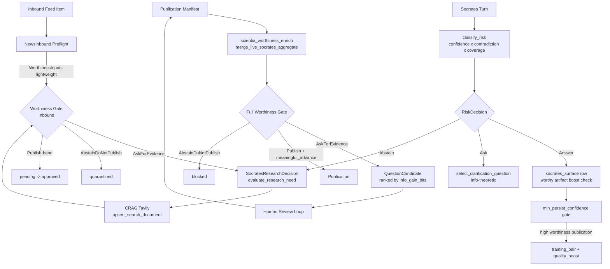

# Scientia Worthiness × Socrates Protocol: Unification Analysis

**Status:** Research / Design Proposal  
**Author:** Vox Antigravity  
**Date:** 2026-04-12  
**Feeds into:** `docs/src/architecture/`, `contracts/scientia/`, `crates/vox-socrates-policy/`

---

## 1. What Each System Is (Grounded in Code)

### Scientia Worthiness (`vox-publisher::publication_worthiness`)

A **publication-gate** system. It answers: **"Is this research artifact ready to be published?"**

Core machinery:
- **`WorthinessInputs`**: five weighted dimensions — `epistemic`, `reproducibility`, `novelty`, `reliability`, `metadata_policy` — plus five hard metric floors (`claim_evidence_coverage`, `artifact_replayability`, `before_after_pair_integrity`, `metadata_completeness`, `ai_disclosure_compliance`).
- **`PublicationWorthinessContract`** (YAML in `contracts/scientia/publication-worthiness.default.yaml`): human-auditable, machine-validated, weights must sum to 1.0, publish/abstain thresholds ordered.
- **`WorthinessDecision`**: `Publish | AskForEvidence | AbstainDoNotPublish`.
- **`HardRedLine`**: named violations (`fabricated_citation`, etc.) that bypass scoring entirely to force abstain.
- **`apply_prior_art_to_worthiness_inputs`**: novelty cap from live semantic search against `search_documents`.
- **`meaningful_advance: bool`**: the one purely human/LLM-judge signal — cannot be computed from metadata alone.
- **Via `scientia_worthiness_enrich.rs`**: a live Socrates rollup from `socrates_surface` rows in Arca is merged into `metadata_json.scientia_evidence` before evaluating worthiness.

### Socrates Protocol (`vox-socrates-policy`)

A **real-time epistemic confidence gate**. It answers: **"Should the agent answer, ask for help, or abstain — right now, mid-turn?"**

Core machinery:
- **`ConfidencePolicy`**: `abstain_threshold`, `ask_for_help_threshold`, `max_contradiction_ratio_for_answer`, `min_persist_confidence`, `min_training_pair_confidence`.
- **`classify_risk(confidence, contradiction_ratio, citation_coverage) -> RiskBand`**: three-band output (High / Medium / Low) with the Coverage Paradox heuristic.
- **`evaluate_risk_decision -> RiskDecision`**: `Answer | Ask | Abstain`.
- **`QuestioningPolicy`**: information-theoretic question selection with entropy budget (`min_information_gain_bits`), user-cost ceiling, turn budget, and wall-time attention budget (`max_clarification_attention_ms`).
- **`select_clarification_question`**: utility-maximizing selector (`gain / cost`).
- **`evaluate_research_need`**: bridges Socrates → CRAG, turning a `RiskBand` into a Tavily dispatch decision with a suggested query refinement.
- **`SocratesComplexityJudge`**: simple 1–10 complexity estimate to route tasks.

---

## 2. Relationship Map (Current State)

```
Socrates (real-time turn gate)
  ↓ socrates_surface rows in VoxDb
  ↓ merged by scientia_worthiness_enrich.rs
Scientia Worthiness (publication gate)
```

The current connection is **one-directional and delayed**: Socrates produces telemetry; worthiness _later_ consumes an aggregate of it. There is no live feedback loop in the other direction, and Socrates knows nothing about worthiness scores.

---

## 3. Shared Language / Structural Isomorphisms

The two systems already speak the same language in four key ways:

| Concept | Socrates | Worthiness |
|---|---|---|
| Three-outcome triage | `Answer / Ask / Abstain` | `Publish / AskForEvidence / AbstainDoNotPublish` |
| Hard floor violations | contradiction > threshold forces Abstain | `HardRedLine` violations bypass scoring |
| Weak-evidence "ask" band | `RiskBand::Medium` → Ask | Score between abstain_max and publish_min → AskForEvidence |
| Contradiction pressure | `contradiction_ratio` | `repeated_unresolved_contradiction: bool` |
| Information density | `expected_information_gain_bits` | `claim_evidence_coverage` |
| Evidence quality | `citation_coverage`, `min_persist_confidence` | `before_after_pair_integrity`, `artifact_replayability` |

This isomorphism is not incidental — both systems model epistemic trust at different time granularities.

---

## 4. Forty+ Integration Opportunities

### 4.1 Shared Numeric Language (Zero Implementation Risk)

**Idea 1: Surface `ConfidencePolicy` constants in the worthiness contract**
`publication-worthiness.default.yaml` should reference or import the Socrates `abstain_threshold` (0.35) and `ask_for_help_threshold` (0.55) as advisory baselines for the `abstain_score_max` and the gap to `publish_score_min`. Today these are independently tuned with overlapping intent. A shared "epistemic floor assertion" in the contract validator could enforce that `abstain_score_max >= ConfidencePolicy::DEFAULT_ABSTAIN_THRESHOLD`.

**Idea 2: Unified contradiction flag**
`WorthinessInputs::repeated_unresolved_contradiction: bool` should be populated directly from the Socrates aggregate — specifically the ratio of `socrates_surface` rows where the agent abstained due to `contradiction_ratio > max_contradiction_ratio_for_answer`. Today it is set manually or heuristically.

**Idea 3: `citation_coverage` → `claim_evidence_coverage` passthrough**
The `SearchDiagnostics::citation_coverage` signal from `vox-search` is already computed. A mapping function in `scientia_worthiness_enrich.rs` should compute `WorthinessInputs::claim_evidence_coverage` from the median of `citation_coverage` values across all `socrates_surface` events for the relevant `repository_id`, rather than using a fixed proxy derived from body word count.

**Idea 4: `min_persist_confidence` as minimum worthiness epistemic weight**
The Socrates `min_persist_confidence = 0.60` is the floor for persistence. The worthiness contract's `epistemic` weight currently has no defined coupling to this floor. Add a contract validation rule: `weights.epistemic * publish_score_min >= min_persist_confidence_proxy` to ensure high-epistemic weight publications aren't allowed to slip through with a low individual dimension score.

**Idea 5: `RiskBand` as a first-class worthiness input axis**
Add a `socrates_risk_band_aggregate: Option<RiskBand>` field to `WorthinessInputs` (alongside the existing metrics). When present, a `RiskBand::Low` aggregate should set a minimum multiplier on `epistemic` regardless of the YAML-declared weight. This preserves contract-driven tuning but hardens the floor.

---

### 4.2 Inbound Pipeline Feedback (Medium Complexity)

**Idea 6: Socrates `NewsInbound` preflight → `WorthinessInputs` for inbound**
`PreflightProfile::NewsInbound` (just added) already validates abstract presence and source URL. Extend it to emit a lightweight `WorthinessInputs` with only `claim_evidence_coverage` (from abstract length heuristic), `metadata_completeness`, and `reliability` populated. This gives the orchestrator a worthiness _estimate_ for inbound items before any LLM processing, enabling fast rejection of low-quality feeds without an LLM call.

**Idea 7: Worthiness floor as `pending` → `quarantined` transition gate**
In `scientia_external_intelligence`, items transition from `pending` to `approved` after preflight. Add a `worthiness_score` column. Items below `abstain_score_max` go to `quarantined`, items in the ask band go to `needs_review`, items above `publish_score_min` auto-promote. This gives the inbound pipeline the same three-state logic as publication.

**Idea 8: Adaptive feed prioritization from worthiness scores**
Once items are scored, feeds whose items consistently produce high worthiness scores should have their `crawl_interval_ms` reduced (crawl more frequently). Feeds with consistently low worthiness scores should have their interval increased. `VoxDb` already stores `last_crawled_at_ms` on `scientia_feed_sources`. Add a `feed_quality_ewma` column and a maintenance worker that adjusts intervals from aggregated worthiness outcomes.

**Idea 9: Socrates `evaluate_research_need` triggered by inbound item failing worthiness**
When an inbound item is scored below `publish_score_min` but above `abstain_score_max` (the "ask band"), the orchestrator should invoke `evaluate_research_need` with the item's title + abstract as the query. The CRAG loop can then fetch supporting evidence from Tavily and re-score. This closes the loop: worthiness → Socrates research decision → evidence → re-worthiness.

**Idea 10: `SocratesResearchDecision::suggested_query` populated from worthiness deficit**
When `evaluate_research_need` is triggered from a failed worthiness gate, enrich the `suggested_query` with which _dimension_ failed. If `novelty` is below threshold, append "recent prior art" context. If `reproducibility` is low, append "replication study" context. This makes the CRAG query semantically aware of the worthiness gap, not just the surface query.

---

### 4.3 Worthiness Signals Enriching Socrates at Runtime

**Idea 11: `worthiness_score` as a soft confidence boost for Answer decisions**
When a Socrates turn is about a document or finding that already has a `worthiness_score >= publish_score_min` in Arca, the `confidence` input to `classify_risk` should be boosted by a tunable `worthiness_confidence_boost_coef` (e.g., 0.05). This prevents Socrates from forcing re-verification of already-vetted content. Gate: only when the turn's `repository_id` matches a published artifact.

**Idea 12: Hard red-line set as Socrates abstain triggers**
Active `HardRedLine` ids (e.g., `fabricated_citation`, `unverifiable_benchmark_delta`) should be exposed as named signals that Socrates can use to trigger immediate `Abstain` independently of its numeric `contradiction_ratio`. A lookup in `VoxDb` for active violations on the queried publication should short-circuit the `classify_risk` path.

**Idea 13: Worthiness `AskForEvidence` decision → Socrates `QuestionCandidate` generation**
When a publication returns `AskForEvidence` with reasons, those reasons should be translated into `QuestionCandidate` entries for the Socrates clarification loop. Example: `"meaningful_advance_required_for_publish"` → prompt "Can you provide before/after benchmark evidence supporting this finding?". The `expected_information_gain_bits` of such questions can be estimated from what percentage of the worthiness score gap the answer would fill.

**Idea 14: `min_training_pair_confidence` gated by worthiness**
The Socrates constant `min_training_pair_confidence = 0.75` filters MENS training pairs. A training pair from a turn over a document that later received `WorthinessDecision::AbstainDoNotPublish` should be retroactively excluded from the training set, even if the Socrates confidence was >= 0.75 at turn time. Add a `worthiness_decision` column to training pair tables or a post-filter pass.

---

### 4.4 A2A Communication Evaluation

**Idea 15: Socrates as inbound A2A message quality gate**
Agent-to-agent messages already persist to `a2a_messages`. Apply a lightweight Socrates confidence evaluation to each incoming A2A message: does the claim meet `min_persist_confidence`? If not, flag the message with a `socrates_risk_band` before it influences any downstream state. This prevents low-quality agent decisions from cascading.

**Idea 16: A2A trust score → contradiction_ratio input**
`trust_rollups` and `trust_observations` exist for endpoints and agents. The `contradiction_ratio` passed to Socrates' `classify_risk` should factor in the historical trust score of the sending agent, not just the textual contradiction signal. An agent with `endpoint_reliability < 0.6` should contribute to elevating the `contradiction_ratio` for its messages.

**Idea 17: Worthiness dimensions for A2A claim evaluation**
For A2A messages that carry research claims (not just task directives), evaluate a lightweight subset of `WorthinessInputs`: `claim_evidence_coverage` (does the message cite its source?), `reproducibility` (does the claim include enough detail to verify?). Agents making repeated claims that fail these micro-checks should have their `trust_rollup` downgraded.

**Idea 18: Socrates `QuestionCandidate` for A2A disambiguation**
When a Socrates gate returns `RiskDecision::Ask` on an A2A message, the orchestrator should send a structured clarification request _back to the sending agent_ using the `QuestionCandidate` format, rather than surfacing it to the human operator. This enables agent-to-agent epistemic clarification before human escalation.

**Idea 19: `ClarificationStopReason::AttentionBudgetExceeded` in A2A contexts**
For A2A clarification, the `max_clarification_attention_ms` budget has a different meaning than for human interactions (no 23-minute Gloria Mark interruption cost). When used in A2A mode, use a much tighter budget (e.g., 500ms × number of active clarification rounds), and the stop reason should escalate to a human operator rather than silently proceeding.

**Idea 20: Per-agent `ConfidencePolicy` override via `ConfidencePolicyOverride`**
`ConfidencePolicyOverride` already exists. It should be loadable from agent profile records in the `agents` table. Agents with specialized domain expertise (e.g., a "Vox compiler analysis agent") should have lower `abstain_threshold` for their domain because their contradiction signals are expected to be higher (they detect more edge cases). This prevents Socrates from being over-conservative when evaluating specialized-domain A2A messages.

---

### 4.5 Structural Hardening and Observability

**Idea 21: Shared `EpistemicSignal` struct**
Define a shared `EpistemicSignal { confidence: f64, contradiction_ratio: f64, citation_coverage: f64, risk_band: RiskBand }` struct in a new `vox-epistemic-core` crate (or add to `vox-socrates-policy`). Both `WorthinessInputs` construction and Socrates `classify_risk` would accept or produce this struct, ensuring the triple `(confidence, contradiction, coverage)` is never assembled inconsistently.

**Idea 22: Unified "epistemic audit trail" in VoxDb**
Both systems currently emit to different tables (`socrates_surface`, `publication_approvals`, `audit_log`). Create a single `epistemic_decisions` table that records every triage decision from both systems with a common schema: `{ subject_kind, subject_id, decision, confidence, risk_band, worthiness_score?, red_line_violations?, trigger, timestamp }`. This powers the SSOT for compliance auditing.

**Idea 23: `RiskBand` stored on `scientia_external_intelligence`**
Add `socrates_risk_band TEXT` and `socrates_confidence REAL` columns to `scientia_external_intelligence`. The orchestrator loop that evaluates `pending` items should populate these before making the `approved`/`quarantined`/`needs_review` transition. Future inbound worthiness analysis can then use risk band as a feature.

**Idea 24: Contradiction ratio persistence on `scientia_discoveries`**
When a research discovery is recorded in `scientia_discoveries`, persist the source Socrates `contradiction_ratio` at extraction time. This makes the contradiction signal durable — if the same underlying fact is queried later and contradiction appears, the system can distinguish "fresh contradiction" from "contradiction already known at discovery time."

**Idea 25: EWMA of `claim_evidence_coverage` per topic**
Similar to how `trust_rollups` EWMA endpoint reliability, compute a rolling `epistemic_coverage_ewma` per topic label in `scientia_external_intelligence`. Items on topics where recent inbound coverage is high can have a lower initial worthiness floor (the topic is well-evidenced in the corpus); items on sparse topics need stronger individual evidence.

**Idea 26: Worthiness contract version pinning in Socrates telemetry**
`socrates_surface` events should include the `worthiness_contract_version` active at the time of the turn. This is critical for replay analysis: if thresholds change, you need to know which contract was in effect when Socrates made each decision.

**Idea 27: `SocratesResearchDecision::suggested_query` stored in `scientia_external_intelligence.provenance_json`**
When CRAG is triggered by a worthiness gap and a suggested query is generated, store that query in the provenance JSON of the resulting external intelligence row. This creates a complete audit trail: "this item was fetched because worthiness gap in [dimension] triggered research on [query]."

---

### 4.6 Contract and Policy Governance

**Idea 28: Worthiness contract schema enforces Socrates constant alignment**
Add a `socrates_alignment` section to `publication-worthiness.schema.json`:
```json
"socrates_alignment": {
  "description": "Advisory assertions linking worthiness thresholds to Socrates policy constants.",
  "abstain_score_max_lower_bound": 0.35,
  "publish_score_min_lower_bound": 0.55
}
```
The `vox ci scientia-worthiness-contract` validator should warn when the contract drifts out of alignment from Socrates defaults.

**Idea 29: `HardRedLine` ids shared with Socrates force-abstain logic**
The named `HardRedLine` ids should be importable from a machine-readable YAML (already partially exists in the worthiness contract). Socrates should be able to load these as named abstain triggers via a `SocratesRedLinePolicy` struct — separate from the probabilistic confidence path, but using the same id namespace.

**Idea 30: Venue profiles map to `PreflightProfile` variants**
`VenueProfile` in the worthiness contract describes per-venue required checks (e.g., `double_blind_anonymization`). These should map 1:1 to `PreflightProfile` variants. Today, `PreflightProfile::DoubleBlind` and the `venue_profiles.double_blind` contract entry are defined independently. Adding a `venue_profile_key: Option<&'static str>` field to `PreflightProfile` would create a compile-time mapping.

**Idea 31: `distribution.default.yaml` `worthiness_floor` enforced via Socrates risk band**
Per-channel `worthiness_floor` values in `distribution.default.yaml` (e.g., 0.82 for Zenodo) should trigger a Socrates-style risk evaluation at route selection time: if the manifest's worthiness score is below the channel's floor, treat the routing decision as `RiskDecision::Abstain` for that channel, not just a silent failure. This surfaces the failure with the same triage vocabulary as agent decisions.

---

### 4.7 MENS Training & Learning Pipelines

**Idea 32: Worthiness score as a training pair quality signal**
The Socrates `min_training_pair_confidence = 0.75` is a point-in-time filter. Complement it with a retrospective worthiness filter: training pairs harvested from a session where the resulting publication was `WorthinessDecision::Publish` should receive a `quality_boost_coef` in the training data pipeline. Pairs from sessions ending in `AbstainDoNotPublish` should be penalized or excluded entirely.

**Idea 33: `meaningful_advance` as a MENS reward signal**
`meaningful_advance: bool` in `WorthinessInputs` is the most semantically rich signal in the worthiness system. When it is `true` following a Socrates-approved research turn, that turn should be flagged as a high-reward example in the GRPO training loop. This creates a pipeline where Socrates + Worthiness jointly gate the MENS training flywheel.

**Idea 34: Coverage Paradox recovery sequences as synthetic training data**
The Coverage Paradox path (high contradiction, low coverage → downgrade to Ask rather than Abstain) is a nuanced epistemic behavior. Generate synthetic training pairs that demonstrate this recovery — question asked, evidence retrieved, contradiction resolved — from real sessions where CRAG closed a Coverage Paradox. These are high-value training examples for teaching the model when to seek evidence vs. refuse.

---

### 4.8 CLI / MCP Surface Consistency

**Idea 35: `vox scientia preflight` output includes Socrates aggregate**
`PreflightReport` (the output of `run_preflight`) should include a `socrates_aggregate: Option<SocratesAggregateSummary>` when Arca has data for the `repository_id`. This summary would show `mean_confidence`, `abstain_rate`, and `mean_contradiction_ratio` from `socrates_surface` rows, making Socrates signal visible at preflight time without a separate CLI call.

**Idea 36: MCP tool `scientia_evaluate_worthiness` returns both decisions in one call**
Today, `run_preflight` and `evaluate_worthiness` are separate code paths that callers compose. Create a single MCP/CLI surface that returns a unified `{ preflight_report, worthiness_evaluation, socrates_aggregate }` envelope — a "publication readiness briefing" that operators get in one shot.

**Idea 37: `vox socrates aggregate` command surfaces worthiness for queried repo**
The `codex_cmd.rs` Socrates aggregate JSON should include the `worthiness_score` of any publication manifests associated with the queried `repository_id`. This makes the operator CLI a single pane of glass across both systems.

**Idea 38: Unified "epistemic dashboard" in the VSCode extension**
The VSCode extension research (`vscode-extension-redesign-research-2026.md`) already identifies the Socrates gate as a first-tier UI element. Extend it to show a miniaturized worthiness progress meter alongside the Socrates risk band for active publication workflows, so operators can see both gates simultaneously.

---

## 5. What Each System Should Borrow

### Socrates Should Borrow From Worthiness

| Worthiness Pattern | How Socrates Should Use It |
|---|---|
| Named violation IDs (`HardRedLine`) | Named abstain triggers that bypass numeric confidence — e.g., `known_fabricated_source` forces `Abstain` regardless of `confidence = 0.99` |
| Dimension decomposition (epistemic, novelty, reproducibility) | `RiskBand::Medium` should decompose into _which_ dimension is weak, not just "weak evidence" — enables targeted `QuestionCandidate` generation |
| YAML-driven contract | Socrates thresholds are currently hard-coded constants. A `socrates-policy.yaml` contract would allow operator tuning without recompilation, like worthiness already supports |
| `meaningful_advance` gating | Socrates' `min_persist_confidence` is purely numeric. A `human_attested_advance` boolean could be a prerequisite for persisting high-risk research claims, analogous to `meaningful_advance` gating publication |
| Venue profiling | Publication venues require different confidence profiles (arXiv vs. JMLR vs. blog). Socrates could use a per-"context" policy profile (code review, research generation, social post generation) with different thresholds |

### Worthiness Should Borrow From Socrates

| Socrates Pattern | How Worthiness Should Use It |
|---|---|
| Information-theoretic question selection | When `WorthinessDecision::AskForEvidence`, the system currently just says "ask." It should generate ranked `QuestionCandidate` options with estimated `information_gain_bits` per question type, making human review time-efficient |
| Attention budget | The worthiness review loop has no time budget. Add `max_review_attention_ms` to the worthiness contract — if an item stays in `AskForEvidence` state beyond the budget, escalate or auto-reject |
| Coverage Paradox handling | Worthiness has no coverage paradox guard. A publication with high `contradiction_ratio` but very low `citation_coverage` may be a nascent topic, not a fraudulent one. Worthiness should borrow the 0.30 coverage threshold heuristic to avoid penalizing novel work too harshly |
| Research dispatch (`evaluate_research_need`) | Worthiness `AskForEvidence` should have a structured research trigger path analogous to Socrates CRAG dispatch — not just "go ask a human," but first "can CRAG retrieve evidence to close the gap?" |
| EWMA decay | Socrates' `min_persist_confidence` is static. Worthiness scores of items in the feed pipeline degrade over time if no new corroborating evidence appears. Apply EWMA decay to `worthiness_score` for items that remain `pending` without new evidence |

---

## 6. What Must Stay Separate

**Hard separation of concerns that must not be violated:**

| Concern | Why It Must Stay Separate |
|---|---|
| Socrates is per-turn; Worthiness is per-artifact | Socrates operates in milliseconds, inline with LLM inference. Worthiness operates on completed research artifacts, potentially hours after inference. Merging them into one evaluation loop would slow the hot path |
| Socrates threshold numeric calibration | Socrates constants (0.35, 0.55, 0.40) are calibrated for real-time dialogue safety. Worthiness thresholds (0.75 publish floor) are calibrated for scientific publication quality. They must not share numeric values even if they share vocabulary — a 0.55 "medium confidence" in dialogue and a 0.55 "ask for evidence" in publication carry very different stakes |
| `meaningful_advance` is human-only in worthiness | Socrates cannot set `meaningful_advance = true` autonomously, even if it has high confidence. This is the deliberate human-in-the-loop gate. Do not add any path that allows Socrates `RiskDecision::Answer` to map to `meaningful_advance = true` |
| Red-line violation claims | `HardRedLine` ids should be asserted by inspectable code paths (citation parsers, metadata checkers), not by Socrates' probabilistic confidence machinery. A `fabricated_citation` violation must never be the output of an LLM confidence estimate — it must come from a structural check |
| Contract governance | The worthiness YAML contract is human-auditable by design. Socrates policy constants are in Rust code for compile-time verification. Do not migrate Socrates constants to YAML just to match worthiness governance — the different governance models reflect different criticality profiles |
| A2A Socrates gate vs. publication Socrates rollup | When Socrates is used to gate A2A messages, it operates on message content in isolation, with no awareness of prior publication worthiness scores for that agent's topic domain. Adding that cross-pollination would create hidden coupling where an agent's publication history influences their current message trust — which is correct for human trust modelling but requires careful, explicit design to avoid gaming |

---

## 7. Unification Risk Map

| Idea | Implementation Risk | SSOT Risk | Recommended Phase |
|---|---|---|---|
| Shared three-outcome vocabulary in docs | Trivial | None | Immediate |
| `contradiction_ratio` → `repeated_unresolved_contradiction` bridge | Low | None | Wave 1 |
| `citation_coverage` → `claim_evidence_coverage` passthrough | Medium | Low | Wave 1 |
| Socrates `evaluate_research_need` triggered by worthiness gap | Medium | Low | Wave 2 |
| `EpistemicSignal` shared struct | Medium | Medium (new crate boundary) | Wave 2 |
| `worthiness_score` as Socrates confidence boost | High | High (inference path change) | Wave 3 after A/B test |
| YAML contract for Socrates thresholds | High | High (breaks compile-time safety) | Not recommended without RFC |
| HardRedLine ids shared with Socrates abstain triggers | Medium | Low | Wave 2 |
| Per-agent `ConfidencePolicyOverride` from `agents` table | Medium | Low | Wave 2 |
| `meaningful_advance` as MENS reward signal | Low | None | Wave 1 |

---

## 8. Proposed Canonical Data Flow (Post-Unification)



---

## 9. Recommended Next Steps

### Immediate (no new code, alignment only)
- [ ] Add a note to `confidence_policy.rs` documenting the isomorphism with `WorthinessDecision` labels.
- [ ] Add a YAML comment in `publication-worthiness.default.yaml` referencing Socrates' `abstain_threshold` (0.35) as a calibration anchor.
- [ ] Update `scientia-publication-automation-ssot.md` with the unified vocabulary table from section 3.

### Wave 1 (additive, low risk)
- [ ] `scientia_worthiness_enrich.rs`: compute `claim_evidence_coverage` from median Socrates `citation_coverage` per `repository_id`.
- [ ] `WorthinessInputs::repeated_unresolved_contradiction`: populate from `socrates_surface` aggregate where abstain reason was contradiction.
- [ ] Flag training pairs from `AbstainDoNotPublish` sessions for MENS exclusion.
- [ ] `meaningful_advance = true` sessions: flag as GRPO reward signal.

### Wave 2 (medium complexity)
- [ ] `scientia_external_intelligence`: add `socrates_risk_band`, `socrates_confidence`, `worthiness_score` columns.
- [ ] `evaluate_research_need` triggered from worthiness ask-band with dimension-aware query enrichment.
- [ ] `HardRedLine` ids exposed via machine-readable YAML; Socrates `SocratesRedLinePolicy` consuming them.
- [ ] `PreflightReport` extended with `socrates_aggregate` field.
- [ ] Unified MCP tool `scientia_readiness_briefing` returning preflight + worthiness + Socrates aggregate.

### Wave 3 (high complexity, requires testing)
- [ ] Per-agent `ConfidencePolicyOverride` loaded from `agents` table.
- [ ] `worthiness_score`-boosted Socrates confidence (with explicit A/B telemetry to validate).
- [ ] Inbound feed `crawl_interval_ms` adaptation from `feed_quality_ewma`.
- [ ] `EpistemicSignal` shared struct (evaluate whether a new crate boundary is warranted vs. adding to `vox-socrates-policy`).

---

## 10. SSOT Impact Assessment

| Document / Crate | Required Update |
|---|---|
| `docs/src/architecture/scientia-publication-automation-ssot.md` | Add section 3 unified vocabulary table; update pipeline diagram |
| `contracts/scientia/publication-worthiness.default.yaml` | Add `socrates_alignment` section (advisory) |
| `contracts/scientia/publication-worthiness.schema.json` | Add `socrates_alignment` schema block |
| `crates/vox-socrates-policy/src/policy_types.rs` | Document `RiskDecision` isomorphism with `WorthinessDecision` |
| `crates/vox-publisher/src/scientia_worthiness_enrich.rs` | Add `citation_coverage` and contradiction passthrough |
| `crates/vox-db/src/store/ops_external_intelligence.rs` | Add `socrates_risk_band`, `socrates_confidence`, `worthiness_score` columns |
| `docs/src/reference/socrates-protocol.md` | Add section on worthiness integration points |
| `docs/src/architecture/research-index.md` | Register this document |
