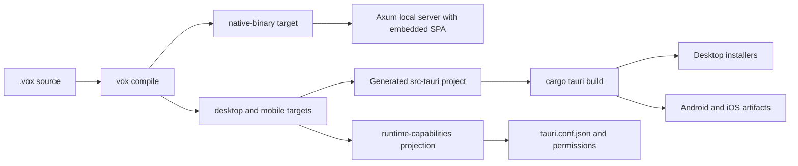

# Tauri convergence migration plan (2026-Q2)

<!-- markdownlint-disable MD022 MD032 -->

> **Decision record:** [ADR 037 — Tauri Convergence](../adr/037-tauri-convergence.md).  
> **Audit baseline:** [Tauri audit (2026-05-11)](tauri-audit-2026.md).  
> **Scope:** Seed and execute a full codebase-wide migration from Capacitor + Axum-as-app toward Tauri 2 for generated desktop and mobile applications.

---

## Table of Contents

1. [How to use this document](#how-to-use-this-document)
2. [Mandatory preamble](#mandatory-preamble)
3. [Glossary](#glossary)
4. [Target architecture](#target-architecture)
5. [Phase 0 — Decision and guardrails](#phase-0--decision-and-guardrails)
6. [Phase 1 — Free-win cleanup](#phase-1--free-win-cleanup)
7. [Phase 2 — Tauri desktop shell](#phase-2--tauri-desktop-shell)
8. [Phase 3 — Tauri mobile shell](#phase-3--tauri-mobile-shell)
9. [Phase 4 — Sherpa Tauri plugin](#phase-4--sherpa-tauri-plugin)
10. [Phase 5 — Mental-tracker migration](#phase-5--mental-tracker-migration)
11. [Phase 6 — CI and build pipeline](#phase-6--ci-and-build-pipeline)
12. [Phase 7 — Enforce retirement](#phase-7--enforce-retirement)
13. [Phase 8 — Final removal](#phase-8--final-removal)
14. [Appendix A — Surface inventory](#appendix-a--surface-inventory)
15. [Appendix B — Replacement map](#appendix-b--replacement-map)
16. [Change log](#change-log)

---

## How to use this document

1. Work tasks in numerical order unless a task explicitly says it can run in parallel.
2. Start each task by reading the listed files, then run the first verification command before editing when the task asks for a failing check.
3. Remove one `exempt_files` entry only when the corresponding migration task has passed its acceptance criteria.
4. Commit messages should include the task ID, for example `TASK-2.3 generate real tauri config`.
5. Do not preserve compatibility with unshipped branch code. Replace in-progress stubs rather than layering shims.
6. If a task touches Rust `pub fn` or Vox `fn` surfaces, follow the repo's test-first policy in `AGENTS.md`.
7. If a task introduces project automation, it must be a `.vox` file executed through `vox run`; do not add shell, Python, or PowerShell glue.

### Execution methodology (migration hygiene)

1. **Audit before claim:** Read emit paths and contracts in-tree; confirm with `cargo test` / `cargo run` on this branch before treating a task as done.
2. **SSOT order:** Edit [`contracts/operations/catalog.v1.yaml`](../../../contracts/operations/catalog.v1.yaml) first, then run `vox ci operations-sync --write`, then commit derived registry YAMLs together.
3. **Generated layout:** `target/generated/src-tauri/Cargo.toml` path dependencies use `../../../crates/...` (manifest lives three levels below repo root). Do not confuse with workspace `Cargo.toml` under `target/generated/` which may still use `../../crates/...`.
4. **Sherpa split:** Codegen + [`vox-tauri-sherpa`](../../../crates/vox-tauri-sherpa/) own Rust registration, ACL, and TS invoke surface; Kotlin/Swift on-device backends are separate port tasks until wired into the `transcribe` command.
5. **CI hygiene:** After contract or arch-check changes, run `cargo run -p vox-arch-check` and focused crate tests (`cargo test -p vox-codegen …`) before a full workspace test sweep.
6. **Automation scripts:** Prefer real `process` / `fs` calls over stubs; gate destructive behavior with explicit env flags; keep paths repo-relative (no hardcoded home directories or stale machine-specific “facts” in output). Reference script: [`scripts/clean-build-artifacts.vox`](../../../scripts/clean-build-artifacts.vox) (CI: `cargo run -p vox-cli -- check scripts/clean-build-artifacts.vox`). Minimal language golden pointer: [`examples/golden/clean_build_stdlib_reference.vox`](../../../examples/golden/clean_build_stdlib_reference.vox).

---

## Mandatory preamble

### Required reading

- `AGENTS.md` — retired surfaces, VoxScript-first automation, test-first policy, and archive protocol.
- `docs/src/adr/037-tauri-convergence.md` — accepted decision.
- `docs/src/architecture/tauri-audit-2026.md` — current-state evidence.
- `docs/src/architecture/vox-application-packaging-ssot-2026.md` — target packaging contract.
- `docs/src/architecture/where-things-live.md` — consult before adding crates or modules.
- `docs/src/architecture/layers.toml` — architecture guardrails.

### Global verification commands

Run the relevant subset for every task; run the full set at phase boundaries:

```bash
cargo run -p vox-arch-check
cargo test -p vox-cli
cargo test -p vox-codegen
vox doc-pipeline --mode linkcheck docs/src/architecture/tauri-convergence-migration-plan-2026.md
markdownlint docs/src/architecture/tauri-convergence-migration-plan-2026.md
```

On Windows agent shells, invoke Cargo through the full path when needed:

```powershell
& "$env:USERPROFILE\.cargo\bin\cargo.exe" test -p vox-cli
```

### Escalation triggers

Stop and ask for human direction if:

- Tauri mobile cannot expose the existing Sherpa native APIs on Android or iOS without dropping a user-visible feature.
- A task requires adding a new long-lived native shell besides Tauri.
- A task would remove `native-binary`; that target is intentionally retained as the Axum + embedded SPA local-server lane.
- CI cannot run Tauri mobile due missing runner toolchains; document the blocked lane and continue only with desktop guardrails.

---

## Glossary

| Term | Meaning |
| --- | --- |
| Tauri convergence | The migration where `desktop`, `mobile-android`, and `mobile-ios` generated app targets produce real Tauri 2 projects and builds. |
| Axum-as-app | The current generated user-app shape: a local Axum server on `127.0.0.1` serving embedded assets. It remains valid only for `native-binary` and server/dashboard lanes. |
| Capacitor-shaped plugin | A mobile plugin implemented around Capacitor APIs such as `registerPlugin`, `@CapacitorPlugin`, and `CAPPlugin`. |
| Vestigial code | Code that exists only because the migration is incomplete and must carry a retirement annotation plus a `layers.toml` exemption. |
| Retirement annotation | Inline marker: `// vox-deprecated-since=\"0.6.0\" retire-by=\"0.7.0\" reason=\"tauri-convergence\" canonical=\"...\"`. |
| Exemption shrink | Removing a file from `layers.toml` `exempt_files` after its corresponding migration task passes. |

---

## Target architecture



Axum remains the correct shell for explicit server and dashboard lanes. Tauri becomes the only generated GUI application shell.

---

<a id="phase-0--decision-and-guardrails"></a>
## Phase 0 — Decision and guardrails

> **Goal:** make the decision and retirement mechanism impossible to miss before production code moves.

### TASK-0.1 — Land ADR 037

**Phase**: 0  
**Estimated effort**: 1 hour  
**Preconditions**: Tauri audit exists at `docs/src/architecture/tauri-audit-2026.md`.  
**Blocks**: All later tasks.

**Why**: The migration needs an accepted decision before codegen, mobile, and CI paths start changing.

**Files to read first**:
- `docs/src/adr/024-dashboard-axum-spa.md:24-38` — style and Axum dashboard boundary.
- `docs/src/architecture/tauri-audit-2026.md:11-20` — current-state summary.
- `docs/src/adr/index.md:39-52` — ADR index ordering.

**Files to create**:
- `docs/src/adr/037-tauri-convergence.md`

**Files to modify**:
- `docs/src/adr/index.md`

**Step-by-step work**:
1. Create ADR 037 with status `Accepted` and date `2026-05-11`.
2. In **Decision**, state that Tauri 2 is canonical for `desktop`, `mobile-android`, and `mobile-ios`.
3. In **Decision**, state that Axum remains for dashboard/server/native-binary lanes only.
4. In **Decision**, state that Capacitor is retired and `vox-sherpa-transcribe` is ported to Tauri.
5. Add ADR 037 to `docs/src/adr/index.md` after ADR 036.

**Verification commands**:

```bash
rg "ADR 037" docs/src/adr/037-tauri-convergence.md docs/src/adr/index.md
vox doc-pipeline --mode linkcheck docs/src/adr/037-tauri-convergence.md
```

**Acceptance criteria**:
- ADR 037 exists and references the audit, packaging SSOT, ADR-024, and this migration plan.
- ADR index lists ADR 037.

**Do NOT**:
- Reopen the strategic split-vs-converge decision in this task.
- Rewrite the packaging SSOT here; that happens in TASK-7.4.

---

### TASK-0.2 — Land this executable migration plan

**Phase**: 0  
**Estimated effort**: 3 hours  
**Preconditions**: TASK-0.1 drafted or in progress.  
**Blocks**: All implementation phases.

**Why**: Later agents need task-level instructions with file references, acceptance criteria, and explicit non-goals.

**Files to read first**:
- `docs/src/architecture/vox-gui-native-roadmap-2026.md` — form reference.
- `docs/src/architecture/tauri-audit-2026.md:100-128` — retirement candidates and ADR decision criteria.
- `docs/src/architecture/research-index.md:39-45` — audit cluster placement.

**Files to create**:
- `docs/src/architecture/tauri-convergence-migration-plan-2026.md`

**Files to modify**:
- `docs/src/architecture/research-index.md`
- `docs/src/architecture/tauri-audit-2026.md`
- `docs/src/architecture/vox-application-packaging-ssot-2026.md`

**Step-by-step work**:
1. Create the plan with frontmatter matching other architecture roadmaps.
2. Include phases 0 through 8 and all `TASK-N.M` headings.
3. Include the three-layer retirement marker convention.
4. Cross-link the new plan from the research index and audit.
5. Keep this document actionable: every task must include files, steps, verification, acceptance, and do-not lists.

**Verification commands**:

```bash
rg "TASK-8.5" docs/src/architecture/tauri-convergence-migration-plan-2026.md
vox doc-pipeline --mode linkcheck docs/src/architecture/tauri-convergence-migration-plan-2026.md
```

**Acceptance criteria**:
- A future agent can begin at TASK-0.1 without this conversation.
- Every code citation is a repo-relative path with an optional line range.

**Do NOT**:
- Create a summary-only doc. This document is an execution plan.

---

### TASK-0.3 — Install hard forbidden-pattern guardrails

**Phase**: 0  
**Estimated effort**: 2 hours  
**Preconditions**: ADR 037 exists.  
**Blocks**: Phase 1 and later exemption shrink tasks.

**Why**: The migration needs CI to prevent new Capacitor and Axum-as-app code from growing while existing code is retired.

**Files to read first**:
- `docs/src/architecture/layers.toml:209-259` — existing `[[forbidden_pattern]]` examples.
- `crates/vox-arch-check/src/forbidden_patterns.rs:17-27` — TOML schema.
- `crates/vox-arch-check/src/forbidden_patterns.rs:44-90` — scan behavior.

**Files to modify**:
- `docs/src/architecture/layers.toml`

**Step-by-step work**:
1. Add `no-capacitor-in-app-codegen` for `@capacitor/` in `crates/vox-codegen/**/*.rs`.
2. Add `no-cap-sync-in-cli` for `npx cap sync|run|update` in `crates/vox-cli/**/*.rs`.
3. Add `no-axum-in-generated-app-emit` for Axum server markers in `crates/vox-codegen/src/codegen_rust/emit/**/*.rs`.
4. Add `no-rust-embed-in-generated-cargo` for `rust-embed` in generated Rust emit code.
5. Add `no-capacitor-deps-in-apps` for `\"@capacitor/` in `apps/**/package.json`.
6. Populate `exempt_files` with current known call sites so the rules land green.

**Verification commands**:

```bash
cargo run -p vox-arch-check
```

**Acceptance criteria**:
- `vox-arch-check` reports no new failures on the landing commit.
- Each rule includes an `allow_annotation` and a reason referencing ADR 037.

**Do NOT**:
- Add broad globs that catch `docs/` examples or the Tauri audit.
- Leave rules warning-only; these are hard guardrails.

---

### TASK-0.4 — Document retired surfaces in AGENTS.md

**Phase**: 0  
**Estimated effort**: 1 hour  
**Preconditions**: ADR 037 exists.  
**Blocks**: Future LLM sessions.

**Why**: Agents receive `AGENTS.md` at session start. Retired Tauri/Capacitor guidance must be in the always-loaded context.

**Files to read first**:
- `AGENTS.md:214-240` — existing Retired Surfaces table including Tauri convergence rows.
- `AGENTS.md:242-276` — deprecation annotations and versioning policy for `retire-by` values.

**Files to modify**:
- `AGENTS.md`

**Step-by-step work**:
1. Append Capacitor package rows to the Retired Surfaces table.
2. Append Axum-as-app and `rust-embed Assets` rows.
3. Append `vox-sherpa-transcribe` to `vox-tauri-sherpa`.
4. Add a `Deprecation Annotations` subsection immediately after the retired table.
5. Document the exact marker syntax and the rule that every vestigial call site must carry it.

**Verification commands**:

```bash
rg "vox-deprecated-since" AGENTS.md
rg "@capacitor/core" AGENTS.md
```

**Acceptance criteria**:
- New agents see both retired symbols and canonical replacements before editing.

**Do NOT**:
- Remove existing retired-surface rows.

---

### TASK-0.5 — Add retirement-audit placeholder

**Phase**: 0  
**Estimated effort**: 4 hours  
**Preconditions**: TASK-0.4 complete.  
**Blocks**: TASK-7.2.

**Why**: The command name should exist early so docs and CI references have a stable surface.

**Files to read first**:
- `crates/vox-cli/src/commands/ci/mod.rs`
- `crates/vox-cli/src/commands/ci/cmd_enums.rs`
- `crates/vox-cli/tests/ci_workflow_contract.rs`

**Files to modify**:
- `crates/vox-cli/src/commands/ci/mod.rs`
- `crates/vox-cli/src/commands/ci/cmd_enums.rs`
- `crates/vox-cli/tests/ci_workflow_contract.rs`
- `contracts/cli/command-registry.yaml`

**Step-by-step work**:
1. Add a `vox ci retirement-audit` subcommand that scans for `vox-deprecated-since` markers and reports count only.
2. Do not enforce dates yet; that is TASK-7.2.
3. Add a command-registry entry.
4. Add a CLI contract test that the command exists and returns success.

**Verification commands**:

```bash
cargo test -p vox-cli ci_retirement_audit -- --nocapture
cargo run -p vox-cli -- ci retirement-audit
```

**Acceptance criteria**:
- Command exists and exits 0.
- Output states enforcement is not active until TASK-7.2.

**Do NOT**:
- Implement retire-by date failure in Phase 0.

---

<a id="phase-1--free-win-cleanup"></a>
## Phase 1 — Free-win cleanup

> **Goal:** remove misleading or dead seams before large build-system changes.

### TASK-1.1 — Delete unused Tauri stub emitter

**Phase**: 1  
**Estimated effort**: 1 hour  
**Preconditions**: TASK-0.3 guardrails landed.  
**Blocks**: Nothing.

**Why**: `tauri_stub.rs` advertises a codegen seam that is not used by real generation.

**Files to read first**:
- `crates/vox-codegen/src/codegen_rust/emit/tauri_stub.rs:10-12`
- `crates/vox-codegen/src/codegen_rust/emit/mod.rs:77`

**Files to modify**:
- `crates/vox-codegen/src/codegen_rust/emit/mod.rs`

**Files to delete**:
- `crates/vox-codegen/src/codegen_rust/emit/tauri_stub.rs`

**Step-by-step work**:
1. Run `rg "emit_tauri_command_stub_banner|tauri_stub" crates/vox-codegen`.
2. Remove the module and re-export.
3. Delete the stub file.

**Verification commands**:

```bash
rg "emit_tauri_command_stub_banner|tauri_stub" crates/vox-codegen || true
cargo test -p vox-codegen
```

**Acceptance criteria**:
- No stub symbol remains.

**Do NOT**:
- Delete `vox-tauri-codegen`; that crate still emits packaging artifacts until Phase 2.

---

### TASK-1.2 — Provision Tauri JS API dependencies

**Phase**: 1  
**Estimated effort**: 2 hours  
**Preconditions**: TASK-0.3.  
**Blocks**: Phase 2/3 TS generation.

**Why**: `mobile_emit` can generate `@tauri-apps/api` imports but the template dependency surface does not consistently provision them.

**Files to read first**:
- `crates/vox-codegen/src/codegen_ts/mobile_emit.rs:26-31`
- `crates/vox-cli/src/templates/spa.rs`
- `crates/vox-cli/src/templates/tanstack.rs`

**Files to modify**:
- `crates/vox-cli/src/templates/spa.rs`
- `crates/vox-cli/src/templates/tanstack.rs`
- Relevant snapshot tests under `crates/vox-codegen/tests/snapshots/`

**Step-by-step work**:
1. Add `@tauri-apps/api` to generated app package templates.
2. Add any plugin packages already referenced by generated code.
3. Update snapshots.

**Verification commands**:

```bash
cargo test -p vox-codegen mobile_emit
rg "@tauri-apps/api" crates/vox-cli/src/templates crates/vox-codegen/tests/snapshots
```

**Acceptance criteria**:
- Generated package metadata includes all generated Tauri JS imports.

**Do NOT**:
- Add Capacitor packages as a fallback.

---

### TASK-1.3 — Fix init next-step path

**Phase**: 1  
**Estimated effort**: 1 hour  
**Preconditions**: None.  
**Blocks**: Nothing.

**Why**: `vox init` currently risks telling users to inspect `target/generated/tauri-packaging` when the mobile template writes `tauri-packaging/` in the project root.

**Files to read first**:
- `crates/vox-cli/src/commands/init.rs:33-35`
- `crates/vox-cli/src/commands/init.rs:94-103`

**Files to modify**:
- `crates/vox-cli/src/commands/init.rs`
- A focused CLI test under `crates/vox-cli/tests/`

**Step-by-step work**:
1. Add a failing test for the printed next-step path.
2. Update the message to point at `{project}/tauri-packaging/README.md`.
3. Keep wording clear that Phase 2 replaces hints with real Tauri project generation.

**Verification commands**:

```bash
cargo test -p vox-cli init_tauri_packaging_path -- --nocapture
```

**Acceptance criteria**:
- Init output points at the actual emitted directory.

**Do NOT**:
- Change the project layout in this task.

---

<a id="phase-2--tauri-desktop-shell"></a>
## Phase 2 — Tauri desktop shell

> **Goal:** make `vox compile --target desktop` produce and build a real Tauri desktop project.

### TASK-2.1 — Add Tauri Rust app emitter

**Phase**: 2  
**Estimated effort**: 2 days  
**Preconditions**: Phase 1 complete.  
**Blocks**: TASK-2.2, TASK-2.4.

**Why**: The generated app currently gets `src/main.rs` from Axum emit code.

**Files to read first**:
- `crates/vox-codegen/src/codegen_rust/emit/mod.rs:112-116`
- `crates/vox-codegen/src/codegen_rust/emit/http.rs:207-231`
- `crates/vox-codegen/src/codegen_rust/emit/http.rs:400-410`

**Files to create**:
- `crates/vox-codegen/src/codegen_rust/emit/tauri_app.rs`

**Files to modify**:
- `crates/vox-codegen/src/codegen_rust/emit/mod.rs`
- `crates/vox-codegen/tests/`

**Step-by-step work**:
1. Add a target-aware generation branch for app targets.
2. Emit `src-tauri/main.rs` containing `tauri::Builder::default().run(tauri::generate_context!())`.
3. Preserve server/native-binary generation through existing `http.rs`.
4. Add snapshot tests for Tauri output.

**Verification commands**:

```bash
cargo test -p vox-codegen tauri_app -- --nocapture
rg "tauri::Builder" crates/vox-codegen/tests/snapshots
```

**Acceptance criteria**:
- Desktop app snapshots contain Tauri builder code.
- Native-binary snapshots still contain Axum.

**Do NOT**:
- Remove `http.rs`; it remains for native-binary and server lanes.

---

### TASK-2.2 — Emit Tauri Cargo metadata for app targets

**Phase**: 2  
**Estimated effort**: 1 day  
**Preconditions**: TASK-2.1.  
**Blocks**: TASK-2.4.

**Why**: Generated app `Cargo.toml` currently includes `axum`, `tokio`, `tower-http`, `rust-embed`, and related local-server dependencies.

**Files to read first**:
- `crates/vox-codegen/src/codegen_rust/emit/mod.rs:198-226`

**Files to modify**:
- `crates/vox-codegen/src/codegen_rust/emit/mod.rs`
- `crates/vox-codegen/tests/`

**Step-by-step work**:
1. Add a failing snapshot asserting desktop app `Cargo.toml` contains `tauri = \"2\"`.
2. Add a failing snapshot asserting desktop app `Cargo.toml` does not contain `axum` or `rust-embed`.
3. Split generated dependencies by target kind.
4. Add `tauri-build = \"2\"` in `[build-dependencies]`.

**Verification commands**:

```bash
cargo test -p vox-codegen generated_tauri_cargo -- --nocapture
```

**Acceptance criteria**:
- Desktop app dependency set is Tauri-based.
- Native-binary dependency set remains Axum-based.

**Do NOT**:
- Delete `axum` dependencies from native-binary.

---

### TASK-2.3 — Generate real Tauri config from Vox manifest

**Phase**: 2  
**Estimated effort**: 2 days  
**Preconditions**: TASK-2.1.  
**Blocks**: TASK-2.4 and Phase 3.

**Why**: `vox-tauri-codegen` currently emits config hints under `tauri-packaging/`, not the build-time `src-tauri/tauri.conf.json` that Tauri consumes.

**Files to read first**:
- `crates/vox-tauri-codegen/src/lib.rs:195-246`
- `crates/vox-cli/src/commands/compile.rs:251-272`
- `contracts/capability/runtime-capabilities.v1.yaml`

**Files to modify**:
- `crates/vox-tauri-codegen/src/lib.rs`
- `crates/vox-cli/src/commands/compile.rs`
- `crates/vox-tauri-codegen/tests/`

**Step-by-step work**:
1. Add an API that emits `src-tauri/tauri.conf.json` directly for real app targets.
2. Keep hint emission only for compatibility if `native-binary` explicitly requests it.
3. Merge `[bundle]` manifest fields into Tauri config.
4. Feed compiler-derived capability projection into Tauri permissions/capabilities files.

**Verification commands**:

```bash
cargo test -p vox-tauri-codegen
rg "tauri.conf.json" crates/vox-tauri-codegen/tests
```

**Acceptance criteria**:
- Desktop target output includes a real `src-tauri/tauri.conf.json`.
- Capability projection is consumed, not merely documented.

**Do NOT**:
- Hard-code `.vox/` paths; use existing config/path helpers.

---

### TASK-2.4 — Invoke `cargo tauri build` for desktop compile

**Phase**: 2  
**Estimated effort**: 2 days  
**Preconditions**: TASK-2.1 through TASK-2.3.  
**Blocks**: Phase 6 CI.

**Why**: `CompileKind::Desktop` currently calls `bundle::run(..., BundleMode::App)` and emits hints.

**Files to read first**:
- `crates/vox-cli/src/commands/compile.rs:66-75`
- `crates/vox-cli/src/commands/bundle.rs:86-160`
- `crates/vox-cli/src/commands/compile.rs:251-272`

**Files to modify**:
- `crates/vox-cli/src/commands/compile.rs`
- `crates/vox-cli/tests/`

**Step-by-step work**:
1. Add a failing test that `desktop` compile plans a Tauri build command.
2. Preserve `native-binary` as the Axum bundle path.
3. For `desktop`, generate app files, then run `cargo tauri build` from the generated project.
4. Respect `--release` by forwarding Tauri release/debug flags.
5. Emit helpful error output if `cargo-tauri` is missing.

**Verification commands**:

```bash
cargo test -p vox-cli compile_desktop_tauri -- --nocapture
cargo run -p vox-cli -- compile --help
```

**Acceptance criteria**:
- `desktop` no longer stops after hint emission.
- `native-binary` behavior is unchanged.

**Do NOT**:
- Run mobile Tauri commands in this desktop task.

---

### TASK-2.5 — Shrink Axum-as-app exemptions for desktop

**Phase**: 2  
**Estimated effort**: 1 hour  
**Preconditions**: TASK-2.1 through TASK-2.4 complete.  
**Blocks**: Phase 7.

**Why**: The `layers.toml` exemptions are the migration progress ledger.

**Files to read first**:
- `docs/src/architecture/layers.toml`

**Files to modify**:
- `docs/src/architecture/layers.toml`

**Step-by-step work**:
1. Remove `crates/vox-codegen/src/codegen_rust/emit/mod.rs` from `no-rust-embed-in-generated-cargo` if desktop no longer emits it.
2. Keep `http.rs` exemption only if the rule still sees server/native-binary paths.
3. Add a comment explaining why native-binary/server Axum remains legal.

**Verification commands**:

```bash
cargo run -p vox-arch-check
```

**Acceptance criteria**:
- The exemption list shrinks without breaking the valid server/native-binary path.

**Do NOT**:
- Ban Axum repo-wide.

---

<a id="phase-3--tauri-mobile-shell"></a>
## Phase 3 — Tauri mobile shell

> **Goal:** make mobile app targets use Tauri 2 mobile for non-Sherpa features.

### TASK-3.1 — Add Tauri mobile compile path

**Phase**: 3  
**Estimated effort**: 3 days  
**Preconditions**: Phase 2 desktop shell.  
**Blocks**: TASK-3.2, TASK-3.3, Phase 5.

**Why**: `mobile-android` and `mobile-ios` currently share the desktop bundle/hint path and mobile dev still calls Capacitor sync.

**Files to read first**:
- `crates/vox-cli/src/commands/compile.rs:66-75`
- `crates/vox-cli/src/commands/build.rs:353-368`

**Files to modify**:
- `crates/vox-cli/src/commands/compile.rs`
- `crates/vox-cli/tests/`

**Step-by-step work**:
1. Add a dry-run test for `mobile-android` command planning.
2. For Android, run idempotent `cargo tauri android init` if required, then `cargo tauri android build`.
3. For iOS, run idempotent `cargo tauri ios init` if required, then `cargo tauri ios build`.
4. Gate iOS path with macOS/Xcode diagnostics.

**Verification commands**:

```bash
cargo test -p vox-cli compile_mobile_tauri -- --nocapture
```

**Acceptance criteria**:
- Mobile compile no longer references `npx cap sync`.

**Do NOT**:
- Implement Sherpa in this task.

---

### TASK-3.2 — Replace Capacitor feature imports in TS codegen

**Phase**: 3  
**Estimated effort**: 2 days  
**Preconditions**: TASK-3.1.  
**Blocks**: TASK-3.4, Phase 5.

**Why**: TS HIR emit still generates Capacitor imports for mobile-native features.

**Files to read first**:
- `crates/vox-codegen/src/codegen_ts/hir_emit/mod.rs:789-822`
- `crates/vox-codegen/src/codegen_ts/hir_emit/mod.rs:789-794`

**Files to modify**:
- `crates/vox-codegen/src/codegen_ts/hir_emit/mod.rs`
- `crates/vox-codegen/tests/snapshots/`

**Step-by-step work**:
1. Add failing snapshots for haptics, clipboard, filesystem, notifications, and share codegen.
2. Replace `@capacitor/*` imports with `@tauri-apps/plugin-*` equivalents.
3. Keep unsupported features as explicit diagnostics, not silent fallbacks.

**Verification commands**:

```bash
cargo test -p vox-codegen hir_emit_mobile_plugins -- --nocapture
rg "@capacitor/" crates/vox-codegen/src/codegen_ts/hir_emit/mod.rs
```

**Acceptance criteria**:
- `rg "@capacitor/" crates/vox-codegen/src/codegen_ts/hir_emit/mod.rs` returns no generated import strings.

**Do NOT**:
- Use `(window as any).Capacitor` as a compatibility shim.

---

### TASK-3.3 — Replace generic native invoke bridge

**Phase**: 3  
**Estimated effort**: 2 days  
**Preconditions**: TASK-3.1.  
**Blocks**: Phase 4 and Phase 5.

**Why**: Native bridge emit uses `Capacitor.Plugins.VoxNative.invoke(...)`.

**Files to read first**:
- `crates/vox-codegen/src/codegen_ts/hir_emit/mod.rs:737-774`
- `crates/vox-codegen/src/codegen_ts/hir_emit/mod.rs:771`

**Files to modify**:
- `crates/vox-codegen/src/codegen_ts/hir_emit/mod.rs`
- `crates/vox-codegen/tests/`

**Step-by-step work**:
1. Add a failing test for generic native invoke output.
2. Emit `import { invoke } from '@tauri-apps/api/core'`.
3. Lower `VoxNative.invoke(name, payload)` to `invoke(name, payload)`.
4. Remove `window.Capacitor` fallback checks.

**Verification commands**:

```bash
cargo test -p vox-codegen native_invoke_tauri -- --nocapture
rg "Capacitor.Plugins|window as any\\)\\.Capacitor" crates/vox-codegen/src/codegen_ts/hir_emit/mod.rs
```

**Acceptance criteria**:
- Generic native invoke code is Tauri-only.

**Do NOT**:
- Keep a dual Capacitor/Tauri dispatch branch.

---

### TASK-3.4 — Update app package templates for Tauri plugins

**Phase**: 3  
**Estimated effort**: 1 day  
**Preconditions**: TASK-3.2 and TASK-3.3.  
**Blocks**: Phase 5.

**Why**: Generated package metadata must match generated imports.

**Files to read first**:
- `crates/vox-cli/src/templates/spa.rs`
- `crates/vox-cli/src/templates/tanstack.rs`

**Files to modify**:
- `crates/vox-cli/src/templates/spa.rs`
- `crates/vox-cli/src/templates/tanstack.rs`
- Any template snapshot tests.

**Step-by-step work**:
1. Add `@tauri-apps/api`.
2. Add in-use `@tauri-apps/plugin-*` packages.
3. Remove any stale Capacitor wording.

**Verification commands**:

```bash
cargo test -p vox-cli templates -- --nocapture
rg "@capacitor/" crates/vox-cli/src/templates crates/vox-codegen/src/codegen_ts
```

**Acceptance criteria**:
- Template package metadata supports generated Tauri JS.

**Do NOT**:
- Add unused Tauri plugin packages.

---

<a id="phase-4--sherpa-tauri-plugin"></a>
## Phase 4 — Sherpa Tauri plugin

> **Goal:** remove the only concrete mobile blocker by porting the custom ASR bridge.

### How generated Tauri apps wire VoxSherpa (Rust, ADR 037)

For `RustAppShell::TauriApp`, [`vox-codegen`](../../../crates/vox-codegen/) emits the following under `target/generated/src-tauri/` (paths below are relative to that crate root):

| Artifact | Responsibility |
|----------|------------------|
| `src/main.rs` | Calls `.plugin(vox_tauri_sherpa::plugin::init())` on the Tauri builder. |
| `build.rs` | Registers inlined plugin ACL for id `vox-sherpa` with command `transcribe` (`tauri_build::Attributes::plugin` / `InlinedPlugin`). |
| `capabilities/default.json` | Grants `vox-sherpa:default` in addition to `core:default`. |
| `Cargo.toml` | Depends on `vox-tauri-sherpa` with `features = ["tauri-plugin"]`; in-repo path deps use `../../../crates/...` so resolution reaches the workspace [`crates/`](../../../crates/) tree from `target/generated/src-tauri/`. |

**Verification after changing emit:** `cargo test -p vox-codegen tauri_` and `cargo test -p vox-codegen tauri_convergence_snapshots`.

**Hand-maintained Tauri apps** (not produced by `vox compile`): follow [`crates/vox-tauri-sherpa/README.md`](../../../crates/vox-tauri-sherpa/README.md) for `plugin::init()`, `Cargo.toml`, and guest JS `invoke`. JNI/Swift work remains in TASK-4.2 / TASK-4.3 until the Rust `transcribe` command calls into those backends.

---

### TASK-4.1 — Create `vox-tauri-sherpa` crate and plugin scaffold

**Phase**: 4  
**Estimated effort**: 2 days  
**Preconditions**: Phase 3 mobile shell.  
**Blocks**: TASK-4.2 through TASK-4.5.

**Why**: The existing plugin lives under an app and is shaped around Capacitor.

**Files to read first**:
- `docs/src/architecture/where-things-live.md`
- `apps/vox-mental-tracker/plugins/vox-sherpa-transcribe/package.json:12`
- `apps/vox-mental-tracker/plugins/vox-sherpa-transcribe/package.json:17-23`

**Files to create**:
- `crates/vox-tauri-sherpa/Cargo.toml`
- `crates/vox-tauri-sherpa/src/lib.rs`
- `crates/vox-tauri-sherpa/guest-js/index.ts`
- `crates/vox-tauri-sherpa/android/`
- `crates/vox-tauri-sherpa/ios/`

**Files to modify**:
- `Cargo.toml`
- `docs/src/architecture/where-things-live.md`

**Step-by-step work**:
1. Add the crate using workspace versioning.
2. Scaffold a Tauri 2 plugin with Android and iOS mobile folders.
3. Expose a command named `transcribe`.
4. Add the concept row to `where-things-live.md`.

**Verification commands**:

```bash
cargo check -p vox-tauri-sherpa
rg "vox-tauri-sherpa" Cargo.toml docs/src/architecture/where-things-live.md
```

**Acceptance criteria**:
- Crate compiles.
- Plugin surface exists for both platforms.

**Do NOT**:
- Depend on `@capacitor/core`.

---

### TASK-4.2 — Port Android Sherpa bridge

**Phase**: 4  
**Estimated effort**: 3 days  
**Preconditions**: TASK-4.1.  
**Blocks**: TASK-4.5.

**Why**: Android on-device ASR is the concrete blocker for Tauri mobile adoption.

**Files to read first**:
- `apps/vox-mental-tracker/plugins/vox-sherpa-transcribe/android/src/main/java/com/vox/plugins/voxsherpatranscribe/VoxSherpaTranscribePlugin.kt`
- `apps/vox-mental-tracker/plugins/vox-sherpa-transcribe/android/build.gradle`
- `apps/vox-mental-tracker/plugins/vox-sherpa-transcribe/android/src/main/AndroidManifest.xml`

**Files to modify**:
- `crates/vox-tauri-sherpa/android/`
- `crates/vox-tauri-sherpa/src/lib.rs`

**Step-by-step work**:
1. Move ASR pipeline logic into the Tauri Android plugin entrypoint.
2. Replace Capacitor annotations/classes with Tauri mobile plugin APIs.
3. Preserve Android permissions and model asset expectations.
4. Add logging around command payload shape and model path resolution.

**Verification commands**:

```bash
cargo check -p vox-tauri-sherpa
rg "CapacitorPlugin|PluginCall|@Capacitor" crates/vox-tauri-sherpa/android || true
```

**Acceptance criteria**:
- Android plugin code has no Capacitor symbols.
- Existing Sherpa native behavior is retained.

**Do NOT**:
- Rewrite the ASR algorithm while porting the bridge.

---

### TASK-4.3 — Port iOS Sherpa bridge

**Phase**: 4  
**Estimated effort**: 3 days  
**Preconditions**: TASK-4.1.  
**Blocks**: TASK-4.5.

**Why**: iOS must not remain tied to the old Capacitor plugin layout.

**Files to read first**:
- `apps/vox-mental-tracker/plugins/vox-sherpa-transcribe/ios/Plugin.swift`
- `apps/vox-mental-tracker/plugins/vox-sherpa-transcribe/ios/Plugin.m`
- `apps/vox-mental-tracker/plugins/vox-sherpa-transcribe/ios/AppleSpeechBackend.swift`

**Files to modify**:
- `crates/vox-tauri-sherpa/ios/`

**Step-by-step work**:
1. Move Swift logic into the Tauri iOS plugin scaffold.
2. Replace Capacitor bridge classes with Tauri iOS plugin entrypoints.
3. Preserve Apple Speech fallback behavior.
4. Keep Objective-C bridge only if Tauri iOS requires it.

**Verification commands**:

```bash
rg "CAPPlugin|CAPBridgedPlugin|Capacitor" crates/vox-tauri-sherpa/ios || true
cargo check -p vox-tauri-sherpa
```

**Acceptance criteria**:
- iOS plugin code has no Capacitor symbols.

**Do NOT**:
- Remove Apple Speech fallback without product approval.

---

### TASK-4.4 — Add TypeScript guest facade

**Phase**: 4  
**Estimated effort**: 1 day  
**Preconditions**: TASK-4.1.  
**Blocks**: TASK-5.1.

**Why**: App code should call a stable `@vox/tauri-sherpa` facade, not raw plugin internals.

**Files to read first**:
- `apps/vox-mental-tracker/plugins/vox-sherpa-transcribe/src/index.ts:1`

**Files to modify**:
- `crates/vox-tauri-sherpa/guest-js/index.ts`
- `crates/vox-tauri-sherpa/package.json` if the plugin needs a JS package.

**Step-by-step work**:
1. Export `transcribe(input): Promise<TranscribeResult>`.
2. Use `invoke` from `@tauri-apps/api/core`.
3. Type payloads explicitly; do not use `any`.
4. Add debug logging of payload shape before invoke.

**Verification commands**:

```bash
pnpm --dir crates/vox-tauri-sherpa test
rg "@capacitor/core|registerPlugin" crates/vox-tauri-sherpa
```

**Acceptance criteria**:
- Guest facade has no Capacitor imports.

**Do NOT**:
- Expose platform-specific APIs to the app layer.

---

### TASK-4.5 — Add Sherpa differential acceptance test

**Phase**: 4  
**Estimated effort**: 2 days  
**Preconditions**: TASK-4.2 through TASK-4.4.  
**Blocks**: Phase 5.

**Why**: The port must preserve transcription behavior, not just compile.

**Files to read first**:
- `contracts/speech-to-code/benchmark-fixtures.manifest.txt`
- `contracts/speech-to-code/canary.kpi.json`
- `apps/vox-mental-tracker/plugins/vox-sherpa-transcribe/README.md`

**Files to create/modify**:
- A focused test under `crates/vox-tauri-sherpa/tests/`
- Any necessary test fixture manifest entry.

**Step-by-step work**:
1. Pick one committed small audio fixture.
2. Run the old plugin path only from a preserved fixture or mock, not production app code.
3. Run the new Tauri plugin path.
4. Assert equivalent transcription within the existing KPI tolerance.

**Verification commands**:

```bash
cargo test -p vox-tauri-sherpa sherpa_differential -- --nocapture
```

**Acceptance criteria**:
- Test proves the Tauri plugin preserves accepted output for at least one fixture.

**Do NOT**:
- Add large binary fixtures without updating artifact policy.

---

<a id="phase-5--mental-tracker-migration"></a>
## Phase 5 — Mental-tracker migration

> **Goal:** move the real app from Capacitor to Tauri.

### TASK-5.1 — Swap app Sherpa import to Tauri facade

**Phase**: 5  
**Estimated effort**: 1 day  
**Preconditions**: Phase 4 complete.  
**Blocks**: TASK-5.2.

**Why**: App code must consume the new Tauri plugin.

**Files to read first**:
- `apps/vox-mental-tracker/plugins/vox-sherpa-transcribe/src/index.ts:1`
- `apps/vox-mental-tracker/src/runtime.ts:47-59`

**Files to modify**:
- `apps/vox-mental-tracker/src/**`
- `apps/vox-mental-tracker/package.json`

**Step-by-step work**:
1. Replace local plugin import path with `@vox/tauri-sherpa`.
2. Update runtime comments to name Tauri, not Capacitor.
3. Run the mental-tracker focused tests.

**Verification commands**:

```bash
pnpm --dir apps/vox-mental-tracker test
rg "vox-sherpa-transcribe|@capacitor/core|registerPlugin" apps/vox-mental-tracker/src apps/vox-mental-tracker/plugins
```

**Acceptance criteria**:
- App code no longer imports the Capacitor Sherpa facade.

**Do NOT**:
- Delete the old plugin before TASK-5.5.

---

### TASK-5.2 — Replace Capacitor dependencies in mental-tracker

**Phase**: 5  
**Estimated effort**: 1 day  
**Preconditions**: TASK-5.1.  
**Blocks**: TASK-5.3.

**Why**: `package.json` currently lists nine `@capacitor/*` deps and `@capacitor/cli`.

**Files to read first**:
- `apps/vox-mental-tracker/package.json:8-16`
- `apps/vox-mental-tracker/package.json:23`
- `apps/vox-mental-tracker/package.json:40-42`

**Files to modify**:
- `apps/vox-mental-tracker/package.json`
- `apps/vox-mental-tracker/pnpm-lock.yaml` if present.

**Step-by-step work**:
1. Remove all `@capacitor/*` deps and devdeps.
2. Add `@tauri-apps/api` and the Tauri plugin packages used by the app.
3. Replace `cap:*` scripts with Tauri scripts.
4. Run `pnpm install` from the correct workspace/app directory if lockfile updates are required.

**Verification commands**:

```bash
rg "\"@capacitor/" apps/vox-mental-tracker/package.json
pnpm --dir apps/vox-mental-tracker install --lockfile-only
```

**Acceptance criteria**:
- `apps/vox-mental-tracker/package.json` contains no `@capacitor/*`.

**Do NOT**:
- Use npm; use pnpm.

---

### TASK-5.3 — Replace Capacitor config with Tauri config

**Phase**: 5  
**Estimated effort**: 1 day  
**Preconditions**: TASK-5.2.  
**Blocks**: TASK-5.4.

**Why**: The app has `capacitor.config.ts`; it needs a real `src-tauri/tauri.conf.json`.

**Files to read first**:
- `apps/vox-mental-tracker/capacitor.config.ts:1-20`

**Files to create**:
- `apps/vox-mental-tracker/src-tauri/tauri.conf.json`

**Files to delete**:
- `apps/vox-mental-tracker/capacitor.config.ts`

**Step-by-step work**:
1. Translate app ID, app name, web dir, and splash behavior into Tauri config.
2. Delete the Capacitor config after Tauri config is present.
3. Ensure app bundle identifiers match existing mobile distribution needs.

**Verification commands**:

```bash
test -f apps/vox-mental-tracker/src-tauri/tauri.conf.json
test ! -f apps/vox-mental-tracker/capacitor.config.ts
```

**Acceptance criteria**:
- Tauri config exists and Capacitor config is gone.

**Do NOT**:
- Change the product bundle identifier without release approval.

---

### TASK-5.4 — Replace app build script

**Phase**: 5  
**Estimated effort**: 1 hour  
**Preconditions**: TASK-5.3.  
**Blocks**: Phase 6.

**Why**: The app-specific Vox script calls `npx cap sync`.

**Files to read first**:
- `apps/vox-mental-tracker/scripts/build.vox:10`

**Files to modify**:
- `apps/vox-mental-tracker/scripts/build.vox`

**Step-by-step work**:
1. Replace `shell_exec(\"npx cap sync\")` with the relevant Tauri build command.
2. Keep this automation in `.vox`; do not add a shell script.
3. Add a comment only if platform branching is non-obvious.

**Verification commands**:

```bash
vox check apps/vox-mental-tracker/scripts/build.vox
rg "npx cap|cap sync" apps/vox-mental-tracker/scripts/build.vox
```

**Acceptance criteria**:
- Build script is VoxScript and Tauri-based.

**Do NOT**:
- Create `.sh`, `.ps1`, or `.py` helper scripts.

---

### TASK-5.5 — Tombstone old Capacitor Sherpa plugin

**Phase**: 5  
**Estimated effort**: 1 hour  
**Preconditions**: TASK-5.1 through TASK-5.4.  
**Blocks**: TASK-7.1.

**Why**: The old plugin should remain only as a migration artifact until final removal.

**Files to move**:
- `apps/vox-mental-tracker/plugins/vox-sherpa-transcribe/`

**Step-by-step work**:
1. Move the plugin to `archive/2026-q2-capacitor-vox-sherpa-transcribe/`.
2. Add a tombstone README in the archive directory stating it must not be used as a source for new code.
3. Update `layers.toml` exemptions to point only at any remaining archive references if the scanner needs them.

**Verification commands**:

```bash
test ! -d apps/vox-mental-tracker/plugins/vox-sherpa-transcribe
rg "vox-sherpa-transcribe" apps/vox-mental-tracker crates/vox-tauri-sherpa docs/src/architecture/tauri-convergence-migration-plan-2026.md
```

**Acceptance criteria**:
- Production app tree no longer contains the Capacitor plugin.

**Do NOT**:
- Read or copy patterns from archive in future tasks except for final deletion/accounting.

---

### TASK-5.6 — Update mental-tracker documentation

**Phase**: 5  
**Estimated effort**: 1 hour  
**Preconditions**: TASK-5.5.  
**Blocks**: Phase 7 docs update.

**Why**: The README currently names Tauri-native Sherpa as a blocker.

**Files to read first**:
- `apps/vox-mental-tracker/README.md:5`

**Files to modify**:
- `apps/vox-mental-tracker/README.md`

**Step-by-step work**:
1. Replace blocker language with current Tauri mobile packaging instructions.
2. Link ADR 037 and this migration plan.

**Verification commands**:

```bash
rg "Capacitor|blocker|Sherpa equivalent" apps/vox-mental-tracker/README.md
```

**Acceptance criteria**:
- README no longer describes Capacitor as the app path.

**Do NOT**:
- Claim iOS/Android artifacts pass unless CI has run.

---

<a id="phase-6--ci-and-build-pipeline"></a>
## Phase 6 — CI and build pipeline

> **Goal:** make CI prove the new shell instead of the old one.

### TASK-6.1 — Replace Android E2E Capacitor build

**Phase**: 6  
**Estimated effort**: 2 days  
**Preconditions**: Phase 5 complete.  
**Blocks**: TASK-7.1.

**Why**: Android E2E currently builds through Capacitor and Gradle.

**Files to read first**:
- `.github/workflows/mobile-e2e-android.yml:31-43`

**Files to modify**:
- `.github/workflows/mobile-e2e-android.yml`

**Step-by-step work**:
1. Replace `pnpm build && npx cap sync android` with the Tauri Android build command.
2. Update artifact paths from `android/app/build/...` to Tauri Android output paths.
3. Preserve emulator test intent.

**Verification commands**:

```bash
rg "npx cap|cap sync|android/app/build" .github/workflows/mobile-e2e-android.yml
```

**Acceptance criteria**:
- Workflow no longer mentions Capacitor.

**Do NOT**:
- Switch self-hosted runner labels away from repo CI conventions.

---

### TASK-6.2 — Add desktop Tauri compile smoke

**Phase**: 6  
**Estimated effort**: 1 day  
**Preconditions**: Phase 2 complete.  
**Blocks**: Phase 7.

**Why**: Compile matrix currently smokes help and native-binary workspace only.

**Files to read first**:
- `.github/workflows/compile-matrix.yml`
- `examples/compile-suite/README.md`

**Files to modify**:
- `.github/workflows/compile-matrix.yml`
- `crates/vox-cli/src/commands/ci/compile_matrix.rs` if local parity needs updating.

**Step-by-step work**:
1. Add a Linux self-hosted desktop Tauri smoke against `examples/compile-suite`.
2. Keep it debug-only to control build time.
3. Mirror behavior in `vox ci compile-matrix` if appropriate.

**Verification commands**:

```bash
cargo run -p vox-cli -- ci compile-matrix
rg "tauri" .github/workflows/compile-matrix.yml
```

**Acceptance criteria**:
- CI has at least one real Tauri desktop build smoke.

**Do NOT**:
- Add mobile Tauri smoke to every PR unless runner cost is approved.

---

### TASK-6.3 — Remove CLI Capacitor sync branch

**Phase**: 6  
**Estimated effort**: 1 day  
**Preconditions**: TASK-3.1 and TASK-6.1.  
**Blocks**: TASK-7.1.

**Why**: `vox build` still has a mobile path that calls `npx cap sync`.

**Files to read first**:
- `crates/vox-cli/src/commands/build.rs:353-368`

**Files to modify**:
- `crates/vox-cli/src/commands/build.rs`
- `crates/vox-cli/tests/`

**Step-by-step work**:
1. Add a failing test that mobile build does not spawn `npx`.
2. Remove the Capacitor sync branch.
3. Route mobile build through the compile/Tauri path or print a clear command handoff.

**Verification commands**:

```bash
cargo test -p vox-cli mobile_build_no_capacitor -- --nocapture
rg "npx|cap sync|Capacitor" crates/vox-cli/src/commands/build.rs
```

**Acceptance criteria**:
- Build command no longer shells to Capacitor.

**Do NOT**:
- Add shell-specific wrappers.

---

### TASK-6.4 — Extend compile doctor for Tauri prerequisites

**Phase**: 6  
**Estimated effort**: 2 days  
**Preconditions**: Phase 2 and TASK-3.1.  
**Blocks**: Phase 7 docs accuracy.

**Why**: Packaging SSOT promises `vox doctor --compile-target` style prerequisites.

**Files to read first**:
- `crates/vox-cli/src/commands/diagnostics/doctor/checks_standard/compile_target.rs`
- `docs/src/architecture/vox-application-packaging-ssot-2026.md:67-72`

**Files to modify**:
- `crates/vox-cli/src/commands/diagnostics/doctor/checks_standard/compile_target.rs`
- `crates/vox-cli/tests/`

**Step-by-step work**:
1. Check for `cargo tauri` for desktop/mobile app targets.
2. Check Android SDK/NDK for `mobile-android`.
3. Check Xcode/iOS tooling for `mobile-ios` on macOS.
4. Emit actionable remediation text.

**Verification commands**:

```bash
cargo test -p vox-cli compile_target_doctor -- --nocapture
```

**Acceptance criteria**:
- Missing Tauri toolchain yields a clear doctor finding.

**Do NOT**:
- Install toolchains automatically.

---

<a id="phase-7--enforce-retirement"></a>
## Phase 7 — Enforce retirement

> **Goal:** make the old pipeline impossible to use accidentally.

### TASK-7.1 — Remove all Tauri-convergence exemptions

**Phase**: 7  
**Estimated effort**: 1 day  
**Preconditions**: Phases 2 through 6 complete.  
**Blocks**: TASK-7.3.

**Why**: The allowlist is only a migration ledger, not a permanent compatibility layer.

**Files to read first**:
- `docs/src/architecture/layers.toml`

**Files to modify**:
- `docs/src/architecture/layers.toml`

**Step-by-step work**:
1. Remove all `exempt_files` entries from Tauri-convergence forbidden rules.
2. Keep `allow_annotation` only for future audited exceptions.
3. Run arch-check.

**Verification commands**:

```bash
cargo run -p vox-arch-check
```

**Acceptance criteria**:
- Arch-check passes with empty Tauri-convergence exempt lists.

**Do NOT**:
- Delete the forbidden rules; they guard the future.

---

### TASK-7.2 — Enforce retire-by annotations

**Phase**: 7  
**Estimated effort**: 2 days  
**Preconditions**: TASK-0.5 and TASK-7.1.  
**Blocks**: TASK-8.2.

**Why**: Inline markers need a CI gate, not just documentation.

**Files to read first**:
- `AGENTS.md` Deprecation Annotations section.
- `Cargo.toml` `[workspace.package] version`.
- `crates/vox-cli/src/commands/ci/`

**Files to modify**:
- `crates/vox-cli/src/commands/ci/`
- `crates/vox-cli/tests/`

**Step-by-step work**:
1. Parse `vox-deprecated-since` markers.
2. Parse `retire-by`.
3. Compare against workspace package version.
4. Fail when current version is greater than or equal to `retire-by`.
5. Emit file/line and canonical replacement.

**Verification commands**:

```bash
cargo test -p vox-cli retirement_audit -- --nocapture
cargo run -p vox-cli -- ci retirement-audit
```

**Acceptance criteria**:
- Expired markers fail tests.
- Future markers report but pass.

**Do NOT**:
- Treat malformed markers as warnings; fail them.

---

### TASK-7.3 — Add final generated-app snapshots

**Phase**: 7  
**Estimated effort**: 1 day  
**Preconditions**: TASK-7.1.  
**Blocks**: TASK-8.1.

**Why**: Snapshots should lock the final Tauri-vs-Axum target split.

**Files to modify**:
- `crates/vox-codegen/tests/`

**Step-by-step work**:
1. Add a desktop generated app snapshot.
2. Assert it contains `tauri = \"2\"` and `tauri::Builder`.
3. Assert it does not contain `axum`, `rust-embed`, or `@capacitor`.
4. Add a native-binary snapshot showing Axum remains there.

**Verification commands**:

```bash
cargo test -p vox-codegen tauri_convergence_snapshots -- --nocapture
```

**Acceptance criteria**:
- Tests lock both allowed and forbidden target shapes.

**Do NOT**:
- Make snapshots so broad they churn on unrelated formatting.

---

### TASK-7.4 — Rewrite packaging SSOT to current truth

**Phase**: 7  
**Estimated effort**: 2 hours  
**Preconditions**: TASK-7.3.  
**Blocks**: Release notes.

**Why**: The SSOT currently overstates Tauri execution; after this phase it should be true.

**Files to read first**:
- `docs/src/architecture/vox-application-packaging-ssot-2026.md:59-65`

**Files to modify**:
- `docs/src/architecture/vox-application-packaging-ssot-2026.md`

**Step-by-step work**:
1. Replace hint/scaffolding wording with real Tauri build wording.
2. Clarify `native-binary` as the Axum + embedded SPA lane.
3. Link ADR 037 and this plan.

**Verification commands**:

```bash
vox doc-pipeline --mode linkcheck docs/src/architecture/vox-application-packaging-ssot-2026.md
```

**Acceptance criteria**:
- SSOT describes implemented behavior, not planned behavior.

**Do NOT**:
- Remove the Tauri audit link; keep it as historical baseline.

---

### TASK-7.5 — Mark audit resolved

**Phase**: 7  
**Estimated effort**: 1 hour  
**Preconditions**: TASK-7.4.  
**Blocks**: Nothing.

**Why**: Future readers should know the audit is a baseline, not the current implementation.

**Files to modify**:
- `docs/src/architecture/tauri-audit-2026.md`

**Step-by-step work**:
1. Add a short status note near the executive summary.
2. Link ADR 037 and this plan.
3. State that historical findings remain for traceability.

**Verification commands**:

```bash
vox doc-pipeline --mode linkcheck docs/src/architecture/tauri-audit-2026.md
```

**Acceptance criteria**:
- Audit clearly points to the resolving ADR and migration plan.

**Do NOT**:
- Delete audit evidence.

---

<a id="phase-8--final-removal"></a>
## Phase 8 — Final removal

> **Goal:** delete the compatibility debris after one release window.

### TASK-8.1 — Delete archived Capacitor Sherpa plugin

**Phase**: 8  
**Estimated effort**: 1 hour  
**Preconditions**: A release has shipped with `vox-tauri-sherpa`.  
**Blocks**: TASK-8.2.

**Why**: Archive is a temporary tombstone, not a second source of truth.

**Files to delete**:
- `archive/2026-q2-capacitor-vox-sherpa-transcribe/`

**Step-by-step work**:
1. Confirm no package or doc links require the archive.
2. Delete the archive directory.
3. Run the final Capacitor search.

**Verification commands**:

```bash
rg "@capacitor/|Capacitor|cap sync|npx cap" apps crates .github contracts docs/src/architecture --glob '!docs/src/architecture/tauri-audit-2026.md' --glob '!docs/src/architecture/tauri-convergence-migration-plan-2026.md'
```

**Acceptance criteria**:
- No production path references Capacitor.

**Do NOT**:
- Delete historical docs that explain why the migration happened.

---

### TASK-8.2 — Remove expired deprecation markers

**Phase**: 8  
**Estimated effort**: 1 hour  
**Preconditions**: TASK-8.1.  
**Blocks**: TASK-8.3.

**Why**: Completed migration code should not carry temporary markers.

**Files to modify**:
- Any file containing `vox-deprecated-since=\"0.6.0\" reason=\"tauri-convergence\"`.

**Step-by-step work**:
1. Search for Tauri-convergence markers.
2. Remove markers only after the underlying code has been migrated or deleted.
3. Run retirement audit.

**Verification commands**:

```bash
rg "vox-deprecated-since=.*tauri-convergence" .
cargo run -p vox-cli -- ci retirement-audit
```

**Acceptance criteria**:
- No expired Tauri-convergence markers remain.

**Do NOT**:
- Remove markers for unrelated migrations.

---

### TASK-8.3 — Confirm guardrails are permanent

**Phase**: 8  
**Estimated effort**: 30 minutes  
**Preconditions**: TASK-8.2.  
**Blocks**: Release tag.

**Why**: The forbidden rules are future protection.

**Files to read first**:
- `docs/src/architecture/layers.toml`

**Files to modify**:
- `docs/src/architecture/layers.toml` only if comments are stale.

**Step-by-step work**:
1. Confirm all Tauri-convergence rules still exist.
2. Confirm `exempt_files` is absent or empty for those rules.
3. Run arch-check.

**Verification commands**:

```bash
cargo run -p vox-arch-check
```

**Acceptance criteria**:
- Guardrails remain active without exemptions.

**Do NOT**:
- Delete rules just because migration is complete.

---

### TASK-8.4 — Tag the convergence point

**Phase**: 8  
**Estimated effort**: 30 minutes  
**Preconditions**: TASK-8.3 and release approval.  
**Blocks**: TASK-8.5.

**Why**: Future archaeology needs a clear convergence boundary.

**Step-by-step work**:
1. Confirm the workspace version and release date.
2. Create a tag such as `v0.6.0-tauri-converged` only with release-manager approval.
3. Do not push unless explicitly instructed.

**Verification commands**:

```bash
git status --short
git tag --list "v*-tauri-converged"
```

**Acceptance criteria**:
- Release boundary is auditable.

**Do NOT**:
- Create or push tags from an agent session without explicit approval.

---

### TASK-8.5 — Update changelog

**Phase**: 8  
**Estimated effort**: 1 hour  
**Preconditions**: TASK-8.4.  
**Blocks**: Nothing.

**Why**: Users need a concise migration summary.

**Files to modify**:
- `CHANGELOG.md`

**Step-by-step work**:
1. Add a release entry for the convergence version.
2. Mention Tauri desktop/mobile, Sherpa plugin port, and Capacitor retirement.
3. Mention `native-binary` remains the local-server Axum lane.

**Verification commands**:

```bash
rg "Tauri|Capacitor|native-binary" CHANGELOG.md
```

**Acceptance criteria**:
- Changelog states what changed and what remains supported.

**Do NOT**:
- Claim unsupported platform artifacts.

---

## Appendix A — Surface inventory

Current known migration surfaces:

- `apps/vox-mental-tracker/package.json:8-16` — `@capacitor/*` runtime deps.
- `apps/vox-mental-tracker/package.json:23` — `@capacitor/cli` dev dep.
- `apps/vox-mental-tracker/package.json:40` — `cap:sync`.
- `apps/vox-mental-tracker/capacitor.config.ts:1-20` — Capacitor config.
- `apps/vox-mental-tracker/scripts/build.vox:10` — `npx cap sync`.
- `apps/vox-mental-tracker/plugins/vox-sherpa-transcribe/src/index.ts:1` — `registerPlugin` import.
- `apps/vox-mental-tracker/plugins/vox-sherpa-transcribe/android/src/main/java/com/vox/plugins/voxsherpatranscribe/VoxSherpaTranscribePlugin.kt` — Android native plugin body.
- `apps/vox-mental-tracker/plugins/vox-sherpa-transcribe/ios/Plugin.swift` — iOS plugin bridge.
- `apps/vox-mental-tracker/plugins/vox-sherpa-transcribe/ios/AppleSpeechBackend.swift` — iOS speech backend.
- `.github/workflows/mobile-e2e-android.yml:31-43` — Capacitor Android CI.
- `crates/vox-cli/src/commands/build.rs:353-368` — CLI `npx cap sync`.
- `crates/vox-cli/src/commands/compile.rs:66-75` — desktop/mobile compile branch.
- `crates/vox-codegen/src/codegen_rust/emit/http.rs:207-231` — embedded asset serving.
- `crates/vox-codegen/src/codegen_rust/emit/http.rs:400-410` — Axum bind/serve.
- `crates/vox-codegen/src/codegen_rust/emit/mod.rs:198-226` — generated Axum/rust-embed deps.
- `crates/vox-codegen/src/codegen_ts/hir_emit/mod.rs:737-774` — Capacitor native invoke docs/emit.
- `crates/vox-codegen/src/codegen_ts/hir_emit/mod.rs:789-822` — Capacitor mobile imports.
- `crates/vox-codegen/src/codegen_rust/emit/tauri_stub.rs:10-12` — unused Tauri stub.

---

## Appendix B — Replacement map

| Retired surface | Replacement |
| --- | --- |
| `@capacitor/core` | `@tauri-apps/api` |
| `@capacitor/clipboard` | `@tauri-apps/plugin-clipboard-manager` |
| `@capacitor/filesystem` | `@tauri-apps/plugin-fs` |
| `@capacitor/haptics` | `@tauri-apps/plugin-haptics` |
| `@capacitor/share` | `@tauri-apps/plugin-share` |
| `@capacitor/push-notifications` | `@tauri-apps/plugin-notification` |
| `@capacitor/splash-screen` | Tauri native splash/window config |
| `Capacitor.Plugins.VoxNative.invoke(...)` | `invoke(...)` from `@tauri-apps/api/core` |
| `npx cap sync` | `cargo tauri android build` or `cargo tauri ios build` |
| Generated app `axum::serve` | Generated app `tauri::Builder::default().run(...)` |
| Generated app `rust-embed Assets` | Tauri `dist/` bundling |
| `vox-sherpa-transcribe` app plugin | `crates/vox-tauri-sherpa` |

---

## Change log

- 2026-05-11 — Initial executable plan filed from the Tauri audit and ADR 037 decision.

**End of roadmap.**
