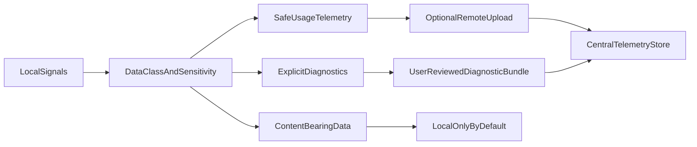

# Telemetry unification research findings 2026

## Purpose

This document is a research dossier for a trust-preserving telemetry strategy in Vox.

### Implementation follow-ups (SSOT)

- [Telemetry trust boundary and SSOT map](telemetry-trust-ssot.md) — authoritative map and critique fold-in
- [Telemetry taxonomy and contracts SSOT](telemetry-taxonomy-contracts-ssot.md) — roadmap taxonomy
- [Telemetry retention and sensitivity SSOT](telemetry-retention-sensitivity-ssot.md) — roadmap retention classes
- [Telemetry client disclosure SSOT](telemetry-client-disclosure-ssot.md) — VS Code / MCP host disclosure
- [Telemetry implementation blueprint 2026](telemetry-implementation-blueprint-2026.md) — phased plan
- [Telemetry implementation backlog 2026](telemetry-implementation-backlog-2026.md) — executable checklist

The goal is to answer a practical and political question: how Vox can learn from real usage at scale without crossing lines that make developers and organizations reject the product.

This is intentionally research-only. It does not define migrations, rollout phases, schema diffs, or implementation sequencing.

## Executive summary

Vox already has enough telemetry and observability surface to support meaningful product improvement, but the current state is fragmented and mostly operator-oriented:

- `research_metrics` event rows and contracts,
- completion-quality telemetry (`ci_completion_*`),
- structured tracing in orchestrator context lifecycle,
- Mens JSONL telemetry streams,
- richer persisted chat/agent/session data in VoxDB.

The strategic risk is not lack of data. It is trust collapse caused by unclear boundaries between:

- product telemetry (safe aggregate signals),
- diagnostics (sensitive but controllable),
- content-bearing interaction data (high sensitivity).

The recommendation from this research pass is a trust-first posture:

1. local-first collection,
2. explicit remote upload enablement,
3. clear data classes with hard red lines,
4. inspectable payload behavior,
5. organization-level governance and hard-off controls,
6. additive transparency whenever scope changes.

## Scope and non-goals

### In scope

- Strategic analysis of telemetry trust trade-offs.
- Mapping current Vox telemetry and persistence surfaces.
- Defining safe, risky, and too-far data classes.
- Documenting communication guidance and political risk controls.
- Identifying how existing Vox contracts can be leveraged later.

### Out of scope

- New environment variables.
- Database or schema changes.
- New CLI/MCP commands.
- Rollout plans with dates.
- UX copy finalized for consent dialogs.
- Implementation blueprint details.

## Current Vox baseline

### Existing telemetry-like surfaces

Current code and contract surface already includes:

- `research_metrics` shape, namespaces, and limits in [Telemetry and research_metrics contract](../reference/telemetry-metric-contract.md) and [`crates/vox-db/src/research_metrics_contract.rs`](../../../crates/vox-db/src/research_metrics_contract.rs).
- Opt-in benchmark/syntax-k writes in [`crates/vox-cli/src/benchmark_telemetry.rs`](../../../crates/vox-cli/src/benchmark_telemetry.rs) (`VOX_BENCHMARK_TELEMETRY`, `VOX_SYNTAX_K_TELEMETRY`).
- Completion-quality telemetry schemas and CI ingestion surfaces in [Completion policy SSOT](completion-policy-ssot.md) and `contracts/telemetry/completion-*.v1.schema.json`.
- Structured context-lifecycle tracing and policy-enforced validation in [`crates/vox-orchestrator/src/context_lifecycle.rs`](../../../crates/vox-orchestrator/src/context_lifecycle.rs).
- MCP LLM cost event controls in [Crate API: vox-mcp](../api/vox-mcp.md) and [Environment variables (SSOT)](../reference/env-vars.md) (`VOX_MCP_LLM_COST_EVENTS`).
- Existing privacy mode precedent (`full|hash|omit`) for tool arguments in [`crates/vox-ludus/src/mcp_privacy.rs`](../../../crates/vox-ludus/src/mcp_privacy.rs).
- Retention hints in [`contracts/db/retention-policy.yaml`](../../../contracts/db/retention-policy.yaml) (for example, `research_metrics` at 365 days).

### Important baseline finding

Vox does not have a single centralized telemetry trust model yet. It has per-surface controls and documentation, which is good infrastructure, but not a cohesive user-facing social contract.

### Data-bearing adjacency risk

VoxDB currently contains tables and events that can include richer interaction and workflow context (for example, chat/session/agent payload-bearing surfaces). If a future "central telemetry" effort blurs these boundaries, users may reasonably interpret it as hidden content collection rather than product telemetry.

That distinction is both political and technical:

- political: trust is based on perceived intent and reversibility,
- technical: data shape and entropy determine re-identification and misuse risk.

## Why telemetry becomes a political problem

Telemetry arguments in developer tools are usually not about "metrics exist." They are about power asymmetry:

- maintainers gain visibility,
- users absorb surveillance risk,
- organizations absorb compliance risk,
- and users rarely have enough runtime visibility to verify claims.

Trust breaks fastest when three factors compound:

1. surprise (unexpected network/data behavior),
2. sensitivity (code/content/identity-rich data),
3. irreversibility (data already uploaded and hard to retract).

## Public ecosystem evidence and lessons

### Go telemetry: local-first with explicit upload choice

- Go 1.23 ships local telemetry by default and requires explicit user action (`go telemetry on`) -> enable upload, with `go telemetry off` disabling even local collection.
- The Go team publicly documented that earlier assumptions about default upload acceptability did not hold for the community.

Reference: [Go blog - Telemetry in Go 1.23 and beyond](https://go.dev/blog/gotelemetry).

### Rust metrics initiative: trust-first local metrics framing

- Rust project guidance is explicit: "NO TELEMETRY, NO NETWORK CONNECTIONS" for compiler metrics initiative scope.
- The emphasis is local metrics artifacts, manual/explicit sharing, and transparent public discussion because metrics/telemetry topics are contentious.

References:

- [Rust project goals - Metrics Initiative](https://rust-lang.github.io/rust-project-goals/2025h1/metrics-initiative.html)
- [Rust tracking issue #128914](https://github.com/rust-lang/rust/issues/128914)

### Homebrew analytics: public docs, debug visibility, opt-out

- Homebrew documents collected fields, retention period, transport details, and opt-out paths.
- A notable trust-building pattern is inspectability (`HOMEBREW_ANALYTICS_DEBUG=1`) and public aggregate reporting.

Reference: [Homebrew analytics docs](https://docs.brew.sh/Analytics.html).

### VS Code: telemetry controls plus caveats

- VS Code provides telemetry level controls and event inspection features.
- It also clearly states an important caveat: extension telemetry may be independent from core telemetry controls.

Reference: [VS Code telemetry docs](https://code.visualstudio.com/docs/configure/telemetry).

### Cross-case synthesis

Projects keep trust when they:

- separate data classes clearly,
- expose concrete controls,
- provide inspectable behavior,
- and document limits and caveats plainly.

Backlash happens when controls are ambiguous, incomplete, or contradicted by observed behavior.

## Primary backlash triggers for developer tools

Ordered by trust severity:

1. Hidden or disputed outbound network behavior.
2. Default-on remote collection for rich/high-entropy data.
3. Collection of source/prompt/workspace content under "telemetry" branding.
4. Weak anonymization claims that still allow practical re-identification.
5. Inconsistent opt-out behavior across CLI/editor/extension/server surfaces.
6. No organization-wide hard-off control for enterprise policy enforcement.
7. Opaque retention and unclear secondary-use boundaries.
8. Nagging, manipulative, or coercive consent UX.

## Data class boundaries for Vox

### Safe by default (acceptable for baseline product telemetry)

These are generally acceptable when documented and bounded:

- coarse feature counters,
- command/tool invocation counts (without raw args/content),
- latency distributions and bucketed timings,
- error/failure class counts,
- version/platform/runtime-capability aggregates,
- sampled reliability signals with low-cardinality metadata,
- contract-reviewed event names and bounded payload sizes.

### Sensitive but potentially acceptable with stronger controls

These require stronger guardrails, explicit user choice, and governance:

- hashed or bucketed repository/session pseudonyms,
- higher-cardinality operational identifiers,
- narrowly scoped diagnostic bundles for bug reports,
- local logs that users may explicitly review and upload.

Recommended minimum conditions:

- explicit opt-in path,
- minimal retention,
- redaction/pseudonymization defaults,
- inspect-before-send capability,
- enterprise policy override support.

### Too far for default centralized collection

These should not be default-upload telemetry:

- source code text,
- prompts and model outputs,
- full tool arguments,
- repository names and raw file paths,
- commit messages and full stack traces with user path data,
- full chat transcripts,
- raw retrieval query text and retrieved document bodies,
- stable long-lived device fingerprints.

If any of these are ever needed for support, they should live in a separate explicit diagnostic-upload flow, not standard telemetry.

## Strategic posture for Vox

### Recommended trust model

1. **Local-first:** local observability is not equivalent to remote telemetry.
2. **Explicit remote enablement:** no ambiguous default upload posture.
3. **Data minimization by construction:** schema-level field allowlists and bounded payloads.
4. **Separation of concerns:** usage telemetry, diagnostics, and content-bearing data are distinct planes.
5. **Inspectable behavior:** users/operators can see what would be sent.
6. **Policy hierarchy:** individual controls plus organization-level hard-off.
7. **Retention transparency:** one published retention table for telemetry classes.
8. **Scope-change transparency:** release notes should show telemetry deltas explicitly.

### Messaging principles (transparent without overselling or fear inflation)

- Prefer plain factual language over aspirational/privacy marketing copy.
- State both "what we collect" and "what we do not collect."
- Name data triggers and transmission conditions.
- Acknowledge caveats and limits up front.
- Avoid euphemistic language that blurs diagnostics/content/telemetry boundaries.
- Avoid catastrophe framing; be concrete, scoped, and technical.

## Leveraging what Vox already has

This section is strategic direction only (not implementation sequencing).

### Assets already available

- Existing contract discipline around metric shape and limits (`research_metrics`).
- Existing telemetry schemas in `contracts/telemetry/`.
- Existing retention-policy contract in `contracts/db/retention-policy.yaml`.
- Existing environment-gated telemetry toggles in [Environment variables (SSOT)](../reference/env-vars.md).
- Existing privacy-mode precedent (`full|hash|omit`) in Ludus MCP argument storage.
- Existing structured tracing in context lifecycle and orchestration flows.

### Strategic reuse opportunities

- Reuse current contract governance style for telemetry event vocabulary and sensitivity classification.
- Extend retention documentation from table-based hints to data-class-based rationale.
- Generalize privacy controls beyond one subsystem with explicit redaction classes.
- Keep rich chat/session persistence logically separate from centralized telemetry.
- Treat local traces/JSONL as local observability artifacts unless explicitly exported.

## Conceptual model (research)

Interpretation:

- `SafeUsageTelemetry` is eligible for centralized aggregation under documented controls.
- `ExplicitDiagnostics` is user-mediated and scoped.
- `ContentBearingData` stays local by default and is outside ordinary telemetry.

## Practical guardrails checklist (policy-level)

- Telemetry field introduced only with a documented purpose.
- Each field assigned a sensitivity class.
- Each event assigned a retention class.
- Each event path tied to an explicit control mode.
- Each remote-sent payload inspectable in local debug mode.
- Each transport caveat documented (for example extension boundaries).
- Each scope expansion called out in release notes.

## Open questions for the follow-up blueprint

These are intentionally deferred:

- canonical event taxonomy for a unified telemetry plane,
- exact policy precedence between local/user/org controls,
- redaction and hashing standards per field class,
- whether centralized ingestion is direct DB write, staged export, or both,
- governance process for approving new telemetry fields.

## Conclusion

Vox can expand telemetry safely, but only if telemetry is treated as a user trust interface rather than an internal metrics pipeline.

The project already has strong technical building blocks. The critical next step is to preserve legitimacy through strict data boundaries, explicit controls, inspectability, and transparent change management.

Any subsequent implementation blueprint should inherit this trust model as a non-negotiable constraint.
