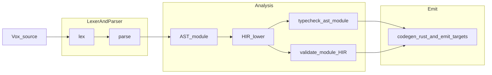

# Vox compiler architecture (research)

**Authority:** This page is **research / orientation**. Normative language rules and phased enforcement live in [Vox Language Rules & Enforcement — Top-Level Plan (2026)](vox-language-rules-and-enforcement-plan-2026.md). Crate placement is summarized in [where-things-live.md](where-things-live.md).

## Pipeline overview

At runtime, user-facing commands (`vox check`, `vox build`, LSP validation, parts of MCP) fan into the **`vox-compiler`** crate as the unified front door for parsing and analysis.

## Module map (conceptual)

| Stage | Primary location | Notes |
| --- | --- | --- |
| Lexing | `crates/vox-compiler/src/lexer/` | Token stream consumed by parser. |
| Parsing | `crates/vox-compiler/src/parser/` | AST construction; grammar evolution ties to [Phase 1 SSOT collapse](vox-language-rules-phase1-ssot-collapse-2026.md). |
| AST | `crates/vox-compiler/src/ast/` | Span-carrying surface syntax. |
| HIR | `crates/vox-compiler/src/hir/` | Lowered representation; durability / workflow shapes tracked in [durability-runtime-audit-2026.md](durability-runtime-audit-2026.md). |
| Typecheck | `crates/vox-compiler/src/typeck/` | Diagnostics, severity, suggestions/fixes consumed by LSP — see [language-diagnostic-drift-findings-2026.md](language-diagnostic-drift-findings-2026.md). |
| Codegen | `crates/vox-compiler/src/codegen_rust/` (+ related) | Rust and other emit paths; Web IR / frontend convergence in [frontend-convergence-findings-2026.md](frontend-convergence-findings-2026.md). |
| Interpreter tier | `crates/vox-compiler/src/eval/` | `--interp` path; must stay aligned with shell stdlib SSOT. |

Downstream **`vox-codegen`** consumes analysis artifacts for Web IR and extracted IR — see [where-things-live.md](where-things-live.md) (`vox-codegen` row).

## Extension points

- **New syntax / keywords:** Prefer decorators over bare keywords per root [`AGENTS.md`](../../../AGENTS.md); any new bare keyword should go through ADR + xtask flow described in Phase 1 plan.
- **New diagnostics:** Stable IDs and catalog discipline — [Phase 2 lint extension](vox-language-rules-phase2-lint-extension-2026.md) and [diagnostic UX (research)](vox-diagnostic-ux-ssot-2026.md).
- **Runtime-visible behavior:** Separately tracked in runtime crates (`vox-actor-runtime`, orchestrator, mesh plans); compiler-only parses do not imply execution — see durability audit.

## Related docs

- [GUI-Native Roadmap Execution Status](gui-native-roadmap-status-2026.md)
- [Feature growth boundaries](feature-growth-boundaries.md)
- [Mesh Phase 1 — Language spine](mesh-phase1-language-spine-plan-2026.md) (distributed language features)
