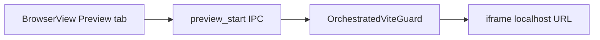
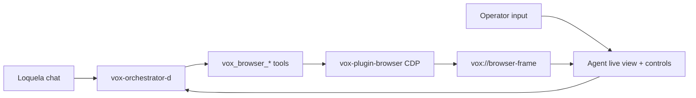
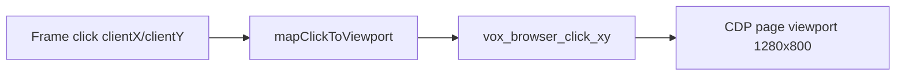

# Vox GUI Browser Support (2026)

The operator **vox-gui** surface now exposes browser workflows in two tabs:

1. **Preview** — embed a localhost URL in an `<iframe>` (direct URL or Vite dev server via `OrchestratedViteGuard`).
2. **Agent live view** — mirror and control CDP browser sessions (screencast-frame first, screenshot fallback) with URL bar, back/forward/reload/stop, tab list/attach, click/scroll/key input, and a server-enforced user/agent control-mode lock.

Playwright is a **validation harness** for preview URLs, not the agent automation engine. Production browser driving remains **chromiumoxide CDP** via [`vox-plugin-browser`](../../../crates/vox-plugin-browser/).

## Layer map

| Layer | Path | Role |
| --- | --- | --- |
| GUI surface | `crates/vox-gui/ui/src/components/surfaces/Browser/` | Preview iframe, agent frame viewer, launch-mode toolbar (Ephemeral / Named / Connect Chrome), tab strip, URL/nav controls, ref overlay, interactive input mapping |
| Tauri commands | `crates/vox-gui/src/commands/browser.rs` | `preview_start/stop`, `browser_open/attach/list/page_info/navigate/goto/scroll/click_xy/type/key`, `browser_screenshot_frame`, `browser_snapshot`, `browser_validate_playwright` |
| Event stream | `vox://browser-frame`, `vox://preview-available` | Browser frame snapshots and auto-preview notifications |
| MCP tools | `crates/vox-orchestrator-mcp/src/browser_tools.rs` | `vox_browser_*` dispatched through orchestrator daemon — including `vox_browser_snapshot`, `vox_browser_click_ref`, `vox_browser_fill_ref`, `vox_browser_open_ex`, `vox_browser_cookies_export`, `vox_browser_cookies_import` |
| CDP engine | `crates/vox-plugin-browser/` | `BrowserAutomation` revision 5 (chromiumoxide): snapshot/refs, host map, named profiles, Chrome attach |
| Dev server | `crates/vox-cli/src/frontend.rs` | `OrchestratedViteGuard` spawns `pnpm run dev:ssr-upstream` or `pnpm run dev` |
| Playwright E2E | `crates/vox-gui/ui/e2e/browser-*.spec.ts` | Surface smoke + preview URL harness |

## Preview flow

- **Direct URL:** pass `url` to `preview_start` — no child process.
- **Vite app:** pass `app_dir` (relative to repo root); requires `package.json` with `dev:ssr-upstream` or `dev`.
- **Auto-preview bootstrap:** if `VOX_SSR_DEV_URL` is present when `vox-gui` starts, backend emits `vox://preview-available` and the Browser surface preloads the preview URL.

## Agent live view + control flow

- GUI can also open sessions via `browser_open_session` (ephemeral wraps `vox_browser_open`; Named / Connect Chrome wrap `vox_browser_open_ex`).
- GUI can attach to any existing agent page via `browser_list_pages` + `browser_attach_session` (`attach` here means “select `page_id`”, not Connect Chrome).
- Live frames try `vox_browser_screencast_frame` first and fall back to `vox_browser_screenshot_viewport`.
- GUI sends `actor: "human"` for interactive controls and toggles `vox_browser_set_control_lock` on mode changes (`human`, `agent`, or clear on close). The GUI daemon spawn sets `VOX_MCP_CALLER_ROLE=human`.

## Snapshot + refs + launch modes

Normative contract: [agent-browser-driver-design (2026-09-07)](../../superpowers/specs/2026-09-07-agent-browser-driver-design.md).

Toolbar launch modes (label **Connect Chrome**, not “Attach”):

| Mode | MCP | Disk |
| --- | --- | --- |
| **Ephemeral** | `vox_browser_open` | Writes **nothing** under `vox_config::paths::browser_profiles_dir()` after `close` of the last ephemeral tab. chromiumoxide may still leave `$TMP/chromiumoxide-runner`; that is out of scope — do not claim zero temp dirs. |
| **Named** | `vox_browser_open_ex` (`mode: named`, kebab `profile_id`) | User data under `$VOX_DATA_DIR/browser-profiles` (override `VOX_BROWSER_PROFILES_DIR`). Not Tier D. Requires `save_profile` or stored `consents.json`. |
| **Connect Chrome** | `vox_browser_open_ex` (`mode: attach`, loopback `cdp_url`) | Connects to a user-started Chrome (`chrome --remote-debugging-port=9222` or Chrome 144+ remote debugging). Last-page close disconnects; it does not kill the user’s Chrome. |

**Semantic loop (shipped):** `vox_browser_snapshot` → compact AX tree with `[ref=eN]` → `vox_browser_click_ref` / `vox_browser_fill_ref`. Optional numbered-bbox overlay on the agent frame (`browser_snapshot` with `include_boxes: true`; GUI checkbox **Show refs**).

**Chat `click_ref` success** is on an **unlocked** page or a page whose lock owner is `agent` — not a GUI-opened human-locked tab.

Cookie export/import return a **count** and a profile-relative path, never cookie values. Attach-mode export uses the same explicit consent as named save.

**Accepted v1 gaps (once):** no Vox `Browser.*` builtins for refs (CSS-only); no cross-origin iframe AX merge; no SPA `MutationObserver` invalidation; no NeedsYou rows (`needs_human` is MCP JSON + GUI toast / `action_log`).

## Playwright role

- **Validate (Playwright)** runs `e2e/browser-preview.spec.ts` against `VOX_PREVIEW_URL`.
- Full GUI E2E remains `scripts/ci/gui-e2e-check.vox` + `pnpm run test:e2e`.
- Defer `playwright-rust` engine binding per [vox-native-scraping-scoping-2026-06-03.md](./vox-native-scraping-scoping-2026-06-03.md).

## Governance

- `Browser.*` / `Scrape.*` builtins require `Net` capability (`stdlib_module_capability` in `effect_check.rs`).
- Browser MCP tools are registered in `contracts/operations/catalog.v1.yaml` and surface through the GUI action manifest automatically.

## Deferred follow-up

- Continuous high-FPS screencast loop (current implementation captures one screencast frame per poll tick and acknowledges it, then falls back when unavailable).
- High-stakes HITL confirmation flow (server-side lock exists; confirmation policy layer is still pending).

## Related docs

- [2026-09-07 agent browser driver spec](../../superpowers/specs/2026-09-07-agent-browser-driver-design.md) — snapshot, profiles, Connect Chrome
- [agent-browser-driver-research-2026.md](./agent-browser-driver-research-2026.md) — Approach A rationale
- [vox-native-scraping-scoping-2026-06-03.md](./vox-native-scraping-scoping-2026-06-03.md) — CDP vs Playwright engine decision
- [where-things-live.md](./where-things-live.md) — crate lookup table
- [data-storage-ssot-2026.md](./data-storage-ssot-2026.md) §4.5 — Chromium profiles are user data, not Tier D
- [contracts/frontend/surface-ownership.v1.yaml](../../../contracts/frontend/surface-ownership.v1.yaml) — canonical GUI surfaces
