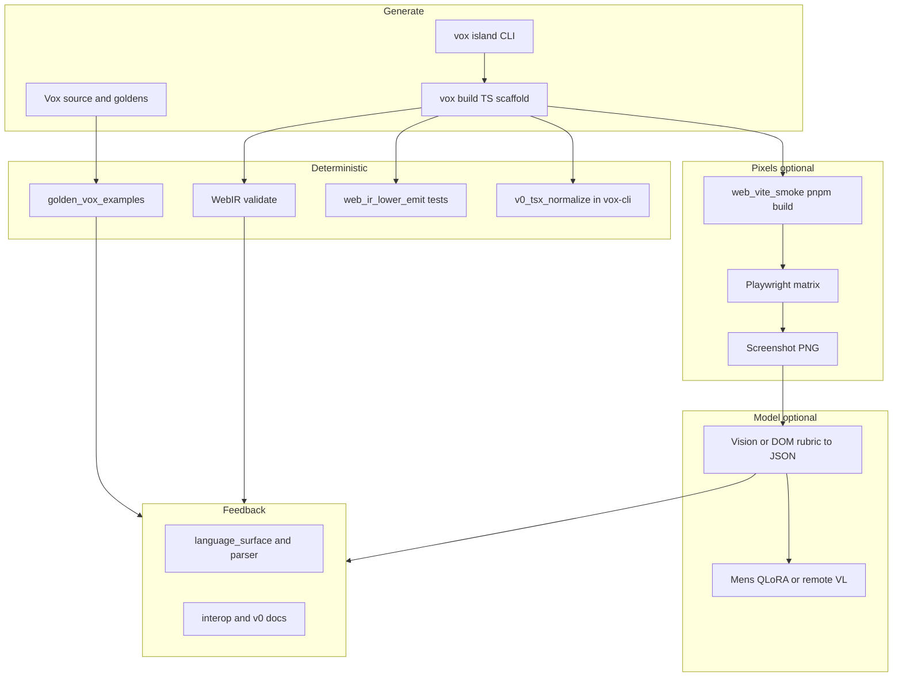

# GUI, v0/islands, vision, and Mens Qwen — virtuous-cycle implementation plan (2026)

## Legend (read first)

| Tag | Meaning |
| --- | --- |
| **Shipped** | Landed in the default repo path; may still be opt-in via env in CI. |
| **Partial** | Some plumbing exists; expand coverage or docs before treating as “done”. |
| **RFC** | Contract or behavior is specified first; implementation follows once types land. |

Prior research SSOT: [vox-corpus-lab-research-2026.md](vox-corpus-lab-research-2026.md), [mens-vision-multimodal-research-2026.md](mens-vision-multimodal-research-2026.md), [mens-qwen-family-migration-research-2026.md](mens-qwen-family-migration-research-2026.md), [vox-source-to-mens-pipeline-ssot.md](vox-source-to-mens-pipeline-ssot.md).

## 1. Purpose and “machine builds machine” loop

**Goal:** Use **deterministic compiler artifacts** (HIR / WebIR / golden gates) plus **optional pixels** (screenshots, design PNGs referenced by `@v0 from`) plus **optional VLMs** to tighten the loop:

1. **Generate** — Vox source, `vox island generate`, shadcn stubs, scaffolds.
2. **Verify** — `vox build`, WebIR validate, TS named-export checks, headless UI capture.
3. **Interpret** — Vision model or a11y DOM JSON → **structured rubric** (not free-form prose in CI); validate against [`contracts/eval/vision-rubric-output.schema.json`](../../../contracts/eval/vision-rubric-output.schema.json) when tooling lands.
4. **Train / route** — Mens `vox_codegen` rows and/or orchestrator `RoutingProfile::Vision` for specialist agents.
5. **Simplify surface** — Fewer islands, less deferred lowering, clearer LSP snippets when metrics show pain.

## 2. Ground truth inventory (where work plugs in)

| Concern | Primary anchors |
| --- | --- |
| Web UI IR | `crates/vox-compiler/src/web_ir/` — `lower.rs` (`IslandMount`, routes, behaviors), `validate/` |
| v0 syntax | `crates/vox-compiler/src/parser/descent/decl/tail.rs` — `@v0 "id" Name` and `@v0 from "design.png"` |
| TS emit + islands | `crates/vox-compiler/src/codegen_ts/` — `emitter.rs`, `island_emit.rs` (no `v0_tsx_normalize` in this crate) |
| Deterministic GUI spine | `crates/vox-compiler/tests/web_ir_lower_emit.rs` — lowering + emit regression without a browser |
| CLI v0 lint + v0 HTTP | `crates/vox-cli/src/v0_tsx_normalize.rs`, `v0.rs` (`VOX_V0_API_URL` override for tests/mocks), `commands/build.rs` named-export validation |
| Island pipeline | `crates/vox-cli/src/commands/island/` — `generate` with `--image`, cache, shadcn stub |
| Golden UI | `examples/golden/dashboard_ui.vox`, `v0_shadcn_island.vox`, `web_routing_fullstack.vox`, `reactive_counter.vox` |
| Vite build smoke (**Shipped**, opt-in) | `crates/vox-integration-tests/tests/web_vite_smoke.rs` (`VOX_WEB_VITE_SMOKE=1`) — `pnpm install` + `vite build` only |
| Playwright golden (**Partial**, opt-in) | `crates/vox-integration-tests/playwright/`, `tests/playwright_golden_route.rs` (`VOX_GUI_PLAYWRIGHT=1`) — screenshot + `accessibility.snapshot()` JSON |
| CI bundle | `vox ci gui-smoke` — always runs `web_ir_lower_emit`; enables Vite / Playwright lanes when the respective env vars are set |
| Browser tools | `crates/vox-orchestrator/src/mcp_tools/tools/browser_tools.rs` — `vox_browser_screenshot` |
| Vision routing | `crates/vox-orchestrator/src/dei_shim/selection/resolve.rs`, `task_routing.rs` — heuristics today; see RFC below for explicit attachments |
| Mens defaults | `crates/vox-populi/src/mens/mod.rs` — `DEFAULT_MODEL_ID`, Candle `candle_inference_serve.rs` (text-only today) |
| Training rows | `crates/vox-tensor/src/data.rs` — `TrainingPair` (text-only; vision lane = research) |
| Secrets | `crates/vox-clavis/src/lib.rs` — `V0_API_KEY` remediation for v0 API |

## 3. Where vision helps most (ranked)

| Rank | Surface | Why vision pays off | Cheaper alternative first? |
| ---: | --- | --- | --- |
| 1 | **Post-`vox build` golden routes** | Catches “compiles but wrong UI” (layout regressions, missing CTA). | **Yes** — `cargo test -p vox-compiler --test web_ir_lower_emit` for deterministic structure; Playwright a11y snapshot + DOM query before paying VL. |
| 2 | **`@v0 from "design.png"`** | Parser already admits design PNG path — natural join between **design intent** and **generated island**. | Template diff of stub vs filled TSX before VL. |
| 3 | **Island hydration mismatches** | `IslandMount.ignored_child_count` and `data-prop-*` parity — vision can flag “hydration error” banners. | Console log scrape from Playwright. |
| 4 | **Cross-browser CSS** | Flaky pixels; vision good for “roughly same” when baselines drift. | Percy-style pixel diff (future) cheaper than VL. |
| 5 | **Mens-generated Vox repair** | When model emits broken `.vox`, vision of **error overlay** is weak — prefer compiler JSON. | **Skip VL** for parse errors. |

**Conclusion:** Vision is **highest ROI** on **integration slack** (browser + CSS + hydration) and **design fidelity** (`@v0 from`). Compiler-side WebIR + `web_ir_lower_emit` already cover much “wrong structure” risk without pixels—position vision as the **next layer**, not a duplicate of WebIR unit tests.

---

## 4. Implementation ideas (checked against repo)

Section tags mirror the legend (**Shipped** / **Partial** / **RFC**). “Vision?” and “Qwen3.5 note” columns are unchanged from the prior table.

### A. Compiler and WebIR (deterministic spine)

1. **Shipped / Partial — WebIR → “expected widgets” JSON for tests** — `web_ir/mod.rs`, `validate/` — Emit a stable JSON projection (`route_id → [button labels…]`) beside `web-ir.v1.json` in CI; diff across commits. — Optional: vision compares rendered screenshot to JSON. — Fine-tune on **text** diff summaries, not pixels.
2. **RFC — Golden metric dashboard** — `golden_vox_examples.rs` — Nightly job aggregates `lower_summary` into one HTML under `target/` artifact. — No. — N/A.
3. **RFC — Lower `classic_components_deferred` to zero on UI goldens** — `lower.rs` summary fields, `internal-web-ir-implementation-blueprint.md` — Per-fixture task list until deferred count trends down. — After fixed, screenshot should match richer DOM. — N/A.
4. **Partial — Interop node parity tests** — `lower.rs` comments on `InteropNode` — When interop expands, add `web_ir_lower_emit` cases. — Optional rubric on hybrid pages. — N/A.
5. **RFC — Route manifest ↔ WebIR route id crosswalk** — `codegen_ts` manifest emit, WebIR `RouteNode` — Single test asserts every manifest route has WebIR contract. — No. — N/A.
6. **RFC — Syntax-K trend line per golden** — `syntax_k.rs`, golden test — Store in `research_metrics` when enabled. — No. — Telemetry for **training data selection** (hard vs easy fixtures).
7. **RFC — HIR `legacy_ast_nodes` gate on Tier-B batch** — `pipeline.rs`, corpus lab doc — Batch driver fails if non-empty on success lane. — No. — N/A.
8. **RFC — Emit “component tree fingerprint” from WebIR DOM arena** — `web_ir/mod.rs` `DomNode` — Hash of tag+attrs skeleton (strip text) for stable UI structure tests. — Vision validates text content vs skeleton. — Distill skeleton+text pairs for SFT.

### B. v0, islands, and CLI

9. **Partial — `vox island generate --image` → attach to v0 API** — `island/mod.rs`, `actions::generate`, `v0.rs` — Threaded end-to-end; **`VOX_V0_API_URL`** supports mocked HTTP in `vox-cli` tests (see `v0_wiremock_tests`). — Yes — Use same image in **eval** for VL rubric “matches layout”.
10. **RFC — Normalize v0 TSX with AST (not regex only)** — `v0_tsx_normalize.rs` — Prefer a **workspace-owned** parser path (for example a small `napi-rs`/`oxc` crate or subprocess contract). **Do not** assume `vox-vscode/` `esbuild` is callable from the Rust CLI—different package graph and policy. — No. — N/A.
11. **RFC — `vox doctor` check: v0 env + islands dir** — `vox doctor` modules — Surface `V0_API_KEY` / islands readiness from Clavis + paths (not wired today). — No. — N/A.
12. **RFC — Cache key includes design PNG hash** — island cache — Invalidate when `@v0 from` file changes. — Yes — Vision rubric keyed by PNG sha.
13. **RFC — `vox build` warning when island stub still placeholder** — `emitter.rs` placeholder comment — Detect `pending v0 CLI` substring. — Yes — Screenshot should still show placeholder; rubric fails until replaced.
14. **RFC — Shadcn `stub_shadcn` path + golden parity** — `stub_shadcn.rs`, `v0_shadcn_island.vox` — Expand goldens for second component. — Optional. — N/A.
15. **RFC — `vox island upgrade` with compiler diagnostics** — `upgrade.rs` — Pipe `check_file` errors into upgrade prompt context (text). — No. — Mens **trajectory repair** rows.
16. **RFC — Codegen pairs from `codegen_vox`** — `crates/vox-corpus/src/codegen_vox/part_02.rs` — Align snippets with `@v0` island patterns in docs. — No. — Training diversity.

### C. CI, Playwright, and screenshots

17. **Partial — Matrix: N goldens on browser runner** — `web_vite_smoke.rs`, `.github/workflows/ci.yml` — Parameterize additional goldens behind env (today: one fixture + Vite build). — Yes — One screenshot per route when Playwright lane is on.
18. **RFC — Playwright trace on failure** — `vox-integration-tests` — Attach trace zip as CI artifact. — Human first; VL later. — N/A.
19. **RFC — MCP `vox_browser_screenshot` in orchestrator eval** — `browser_tools.rs`, `vox-eval` / mesh tool bridge — Wire screenshots into an eval driver crate (`crates/vox-eval`) or Ludus-hosted harness so runs are reproducible JSON, not ad hoc shell. — Yes. — Specialist agent loop.
20. **Partial — DOM + a11y JSON artifact** — Playwright `accessibility.snapshot()` in `playwright/golden_route.spec.ts` — Written beside PNG under `VOX_PLAYWRIGHT_OUT_DIR`. — VL only on disagreement between DOM and PNG hash when baseline changed.
21. **RFC — Flake policy: SSIM threshold** — CI docs — Document acceptable pixel drift; avoid VL in tight inner loop. — Optional. — N/A.
22. **Shipped — `vox ci gui-smoke`** — `crates/vox-cli/src/commands/ci/gui_smoke.rs`, `contracts/operations/catalog.v1.yaml` — Runs `web_ir_lower_emit` always; opt-in `VOX_WEB_VITE_SMOKE=1` / `VOX_GUI_PLAYWRIGHT=1` for integration lanes. — Yes. — N/A.

### D. VS Code extension and developer UX

23. **RFC — “Open golden preview” command** — `vox-vscode/README.md` — Deep-link to built `dist/` for active golden. — Yes for side-by-side with design PNG. — N/A.
24. **RFC — Diagnostic code links to WebIR doc** — `vox-lsp` — On WebIR-related errors, show markdown link to blueprint. — No. — N/A.
25. **RFC — Snippet updates for `component` vs `@component`** — `language_surface.rs`, grammar export — Reduce dual-path confusion per research. — No. — Mens prompts updated in `vox_corpus::training::generate_training_system_prompt`.
26. **RFC — Visual editor: pipe screenshot to rubric command** — extension host — Optional config `vox.visionRubricCommand`. — Yes. — Local Qwen-VL or remote.

### E. Mens Qwen3.5 and optional vision lane

27. **RFC — Keep text QLoRA default; add `lane: vox_vision_rubric` (opt-in)** — Future `mens/config/mix.yaml` + `vox-corpus` mix — **Not present today**; align with [mens-vision-multimodal-research-2026.md](mens-vision-multimodal-research-2026.md) as a future mix lane. JSONL rows = rubric checklist + expected JSON; images only by hash ref. — **Training target is JSON**, images used at **eval** only unless HF multimodal later.
28. **`TrainingPair` v2 RFC in contracts** — `contracts/` new schema — Versioned optional `attachments`; **strict loader** behavior documented. — Future native multimodal. — Do **not** block Qwen3.5 text training on this.
29. **RFC — Distill VL rubric → text SFT rows** — corpus pipeline — `prompt` = Vox+compiler context, `response` = canonical Vox patch; provenance `derived_from_vision_sha256`. — Two-stage: VL offline, Mens online text-only. — Best bang for **fine-tuned Qwen3.5** without Candle vision encoder.
30. **RFC — Eval harness: same JSONL on base vs adapter** — `vox-populi` serve + `vox-eval` — Record pass@k for UI codegen tasks. — Optional VL judge for subjective “looks like design”. — Qwen3.5 adapter metrics.
31. **RFC — Thinking-token strip policy** — `training_text.rs` ChatML — Document and test for `vox_codegen` lane. — No. — Prevents LoRA learning hidden chains.
32. **RFC — Preset `gui_repair` in `training-presets.v1.yaml`** — contracts — Small batch high-quality repair pairs from corpus lab failures. — Optional vision context in **prompt text** (“screenshot shows error X”). — Text-only multimodal **description**, not bytes in JSONL.
33. **RFC — Schola / external VL for judge only** — `mens-training.md` external serving — Run VL on GPU workstation; never in default CI. — Yes. — Qwen3.5 text does codegen; Qwen-VL judges.

### F. Orchestrator and MCP

34. **RFC — Structured `attachment_manifest` on tasks** — Orchestrator task types — MIME+hash; bypass substring `infer_prompt_capability_hints` when present. Spec: [orchestrator-attachment-manifest-rfc-2026.md](orchestrator-attachment-manifest-rfc-2026.md). — Yes when images attached. — Routes to vision-capable model reliably.
35. **RFC — Tool: `vox_vision_rubric` JSON schema validate** — `vox-mcp` or `vox-cli` — Input: image path + rubric id; output: JSON validated against [`contracts/eval/vision-rubric-output.schema.json`](../../../contracts/eval/vision-rubric-output.schema.json) or quarantine. — Yes. — Shared by CI and agents.
36. **RFC — A2A trace with `image_sha256`** — `tool_workflow_corpus.rs` — Extend serde types behind `schema_version`. — Yes for replay. — Mens trajectory rows.
37. **RFC — Budget: vision model cost multiplier** — orchestrator budget modules — Prevent accidental VL storm in mesh. — Yes. — Ops safety.

### G. Boilerplate reduction and automation

38. **RFC — `vox scaffold ui-test` from WebIR** — new CLI — Generate Playwright test skeleton from route list. — Uses selectors from stable `data-testid` convention (parser + lowering **not** shipped yet). — Partially vision-free.
39. **RFC — Auto-`data-testid` from Vox `id:` or `testid:` attr** — parser + lower — If grammar allows, map to DOM attr in WebIR/emit. — Makes vision and DOM align. — N/A.
40. **RFC — Component library “tokens” file from theme** — Tailwind + Vox — Single source for colors; vision rubric checks contrast heuristic. — Yes simple CV heuristics or VL. — N/A.
41. **RFC — `vox migrate web --vision-suggest` (experimental)** — migration — VL proposes Tailwind class patches; human approves. — Yes high value, high risk — Gate behind env and log to quarantine JSONL.

### H. Docs and governance

42. **RFC — Single “GUI verification playbook”** — `docs/src/how-to/` — Links golden, Playwright, MCP, Mens. — Yes. — Onboarding.
43. **RFC — Update `tanstack-web-backlog.md` with vision row** — architecture — Checkbox for optional VL stage. — Yes. — Tracking.
44. **RFC — `react-interop-hybrid-adapter-cookbook.md` § Vision** — cookbook — When to use DOM vs VL. — Yes. — Reduces wrong tool use.
45. **Shipped — Research index entry** — `research-index.md` — Link to this plan (already listed under corpus lab / vision cluster). — N/A. — N/A.

### I. Security and privacy

46. **RFC — Redact screenshots in CI artifacts** — workflows — Crop to viewport; strip EXIF; short TTL. — Yes sensitive. — Align with [`contracts/operations/workspace-artifact-retention.v1.yaml`](../../../contracts/operations/workspace-artifact-retention.v1.yaml), [telemetry-trust-ssot.md](telemetry-trust-ssot.md), and **no raw secrets** in rubric prompts ([`crates/vox-clavis/src/lib.rs`](../../../crates/vox-clavis/src/lib.rs)).
47. **RFC — Clavis for any new VL API key** — `spec.rs` — Mirror `V0_API_KEY` pattern. — Yes. — No raw env reads in tools.

### J. Performance and cost

48. **RFC — Tiered pipeline: DOM rubric first, VL on failure only** — eval driver — Saves 90%+ VL calls on clean builds. — Yes. — Cost control for Qwen-VL.
49. **RFC — Batch screenshots with shared browser context** — Playwright — One context, many routes. — Yes throughput. — N/A.
50. **RFC — Cache VL outputs by `(image_sha256, rubric_id, model_id)`** — local disk cache — Deterministic regen. — Yes. — Reproducible Mens eval.

### K. “Fine-tuned Qwen3.5 + vision lane” decision

51. **Short term (recommended):** **Do not** add Candle vision encoder to Mens. Use **text Qwen3.5 QLoRA** for codegen; use **remote Qwen-VL** (or other VL) for rubric JSON in eval and optional distill rows (idea 29).
52. **Medium term:** If `TrainingPair` v2 ships and HF multimodal templates are stable, pilot **small** image+text rows for **non-codegen** lanes only (`vox_vision_rubric`), still validate with `validate-batch` extensions.
53. **Long term:** If in-tree VL training becomes a product requirement, new ADR + `FineTuneContract` kernel split — **out of scope** for this plan’s first execution wave.

---

## 5. Execution waves (dependency order)

| Wave | Scope | Exit criteria |
| --- | --- | --- |
| **W0** | Docs playbook (item 42) + research index + cookbook § (44) | Contributors can run golden + build + optional Vite (`VOX_WEB_VITE_SMOKE`) without ambiguity |
| **W1** | Deterministic expansion (`web_ir_lower_emit` in default PR paths) + first Playwright golden (`VOX_GUI_PLAYWRIGHT`, [`docs/src/ci/runner-contract.md`](../ci/runner-contract.md) browser pool) | `vox ci gui-smoke` green without browser env; optional job produces PNG + `a11y.json` |
| **W2** | WebIR projections (1, 6, 8) + widen golden/Vite matrix | CI fails on route/widget regression using **compiler + Vite** gates; treat **`vox ci gui-smoke` Playwright half** as follow-up once browser pool is stable |
| **W3** | Rubric tool + cache (35, 50) + orchestrator `attachment_manifest` (34) | VL runs only on demand; JSON schema validated |
| **W4** | Mens lane `vox_vision_rubric` + distill (27–29, 32) | Opt-in JSONL in mix; text-only training gains structured UI labels |
| **W5** | v0/island hardening (9–14) | Fewer placeholder islands in goldens; doctor checks |

---

## 6. Explicit non-goals (first year)

- Replacing compiler diagnostics with VL for **parse errors**.
- Training Candle QLoRA on raw pixels inside default `vox mens train`.
- Mandatory VL in default PR CI (cost + flake risk).

## See also

- [Internal Web IR implementation blueprint](internal-web-ir-implementation-blueprint.md)
- [Orchestrator attachment_manifest RFC (2026)](orchestrator-attachment-manifest-rfc-2026.md)
- [Tanstack web backlog](tanstack-web-backlog.md) / [Tanstack web roadmap](tanstack-web-roadmap.md)
- [React interop hybrid adapter cookbook](react-interop-hybrid-adapter-cookbook.md)
- [Mens training reference](../reference/mens-training.md)
- [vscode-extension-redesign-research-2026.md](vscode-extension-redesign-research-2026.md) (v0.dev workflow depth)
- [Runner contract: labels + env](../ci/runner-contract.md) (browser pool for Playwright jobs)
