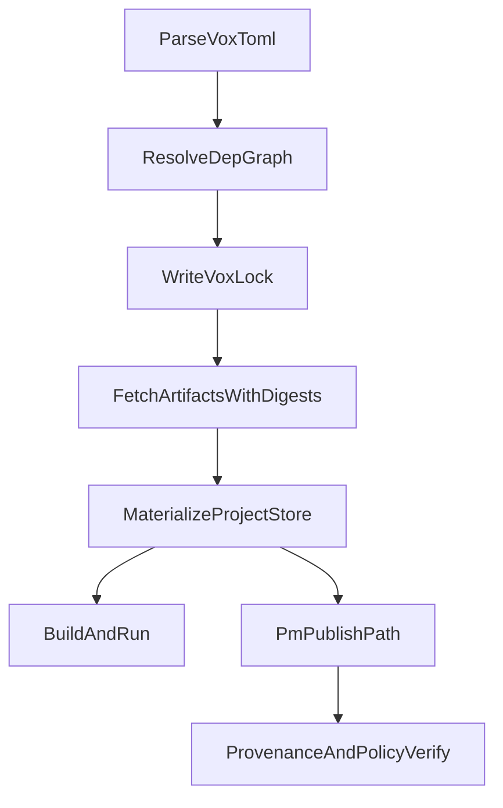

## Purpose

This blueprint defines the target architecture and migration strategy for package management and shipping in Vox, aligned to hard constraints:

- no strategic Python/UV lane,
- no package-management use of `vox install`,
- hybrid PM command model,
- strict separation of `update` vs `upgrade`.

This is a planning blueprint, not the execution checklist. The execution checklist is produced in the full implementation plan document.

## Target command grammar

### Top-level common dependency verbs

- `vox add <dep> [--version ...] [--path ...]`
- `vox remove <dep>`
- `vox update [<dep>|--all]`
- `vox lock [--locked|--offline|--frozen]`
- `vox sync [--locked|--offline|--frozen]`

### Namespaced advanced PM verbs

- `vox pm search`
- `vox pm info`
- `vox pm publish`
- `vox pm yank`
- `vox pm vendor`
- `vox pm verify`
- `vox pm cache ...`

### Toolchain/self lane

- `vox upgrade` is reserved for upgrading Vox itself (binary/source channel), not dependency graph operations.

### Forbidden semantics

- `vox install` must not perform package graph operations.

## Namespace policy (authoritative)

### One verb, one meaning

- Project dependency graph changes are `add/remove/update/lock/sync`.
- Vox runtime/tooling self-evolution is `upgrade`.
- Domain-specific upgrades can exist only under noun scopes (`vox island upgrade`).

### Explicit noun scoping

- `upgrade` without noun scope maps to toolchain lane.
- Noun-scoped upgrades (`island upgrade`) remain local to that domain and must not mutate package dependency lock state unless explicitly documented.

### Ambiguity guardrails

- CI command-compliance checks must reject introducing new near-synonyms for existing package verbs.
- Docs and command registry must encode migration hints for any retired aliases.

## Current-to-target migration mapping

| Current surface | Current state | Target surface | Migration action |
| --- | --- | --- | --- |
| `vox install` | active command entry, runtime stub | retired package verb | keep transitional error-only alias with migration text, then remove |
| `commands/add.rs` | implemented but not first-class wired | `vox add` | wire to CLI and command registry |
| `commands/remove.rs` | implemented but not first-class wired | `vox remove` | wire to CLI and command registry |
| `commands/update.rs` | implemented but not first-class wired | `vox update` | wire, add explicit lock policy semantics |
| `commands/vendor.rs` | references stale `vox install` path | `vox pm vendor` | move under `pm` and update messaging |
| `train-uv` | retired in runtime and registry | removed lane | remove residual docs/code references |

## Compatibility and deprecation policy

### Phase A: compatibility error aliases

- Keep `vox install` only as an explicit error with actionable migration:
  - suggest `vox add`, `vox sync`, `vox pm ...`.
- Keep deprecation horizon explicit in docs.

### Phase B: hard removal

- Remove `Install` variant from CLI enum.
- Remove command registry active row for `install`.
- Remove stale references in docs/tests/tooltips.

## Package lifecycle architecture

## Lifecycle invariants

- `Vox.toml` is desired-state input.
- `vox.lock` is resolved-state contract.
- Materialization must be lock-aware in locked/frozen mode.
- Fetch must validate digest/integrity data before use.
- Build/deploy must be reproducible from lock + fetched artifacts.

## Storage and repository model

### Canonical roles

- Manifest layer: declarative requirements (`Vox.toml`).
- Lock layer: exact resolved graph (`vox.lock`).
- Materialized layer: project-local dependency artifacts (`.vox_modules` or successor layout).
- Cache layer: reusable artifact cache/CAS.
- Registry layer: discover/publish metadata and payloads.

### Required clarifications for implementation

- Define whether `.vox_modules/local_store.db` remains canonical or becomes an internal implementation detail behind PM APIs.
- Ensure all PM commands mutate state through one consistent service boundary (not ad-hoc direct store access per command).

## Cargo execution policy

- All cargo process invocation in package/build paths should be mediated through shared execution service abstractions.
- Direct `Command::new("cargo")` paths in user-impacting flows are migration targets.
- Required outcomes:
  - shared environment policy,
  - shared telemetry and failure handling,
  - shared cross-platform behavior.

## Python/UV hard-retirement policy

### Strategic policy

- No active package/runtime path depends on Python/UV.

### Migration categories

- Already retired surfaces: keep explicit retired state until removed.
- Active code still containing UV/Python logic: remove or gate behind unsupported errors, then delete.
- Docs: rewrite to reflect Rust-only supported path; historical context only in superseded ADR/changelog notes.

## Docker integration blueprint

### Required behavior

- Dependency materialization in images must honor lock policy.
- Locked builds must fail on unresolved drift.
- Offline/frozen lanes must be testable and deterministic.

### Release policy tie-in

- Package/release artifacts should carry provenance metadata.
- CI/release lanes verify provenance policy before promotion.

## Risk register

### R1: CLI breakage

- Risk: users/scripts still call `vox install`.
- Mitigation: transitional error alias with exact replacement commands and docs migration matrix.

### R2: partial retirement drift

- Risk: code, registry, and docs disagree about Python support.
- Mitigation: one hard-cut checklist tracked across code paths, command registry, and docs inventory.

### R3: semantic regression for update/upgrade

- Risk: reintroducing overloaded verbs.
- Mitigation: command-compliance rule plus explicit tests for verb ownership.

### R4: storage contract drift

- Risk: `.vox_modules`, lock, and cache semantics diverge per command.
- Mitigation: central PM service boundary and invariant tests.

## Rollback triggers (during implementation phase)

- If lock mode semantics break reproducibility tests in CI.
- If command migration causes unresolvable script breakage without deterministic alias guidance.
- If hard Python removal blocks critical release lane without Rust-native replacement.

## Blueprint acceptance criteria

- Hybrid command grammar is fully specified and consistent.
- `install` retirement path is explicit and time-bounded.
- `update` vs `upgrade` semantic boundary is enforceable via tests and compliance checks.
- Python/UV hard-retirement coverage is represented across code, command registry, and docs.
- Docker reproducibility and lock-policy requirements are encoded as mandatory behaviors.
