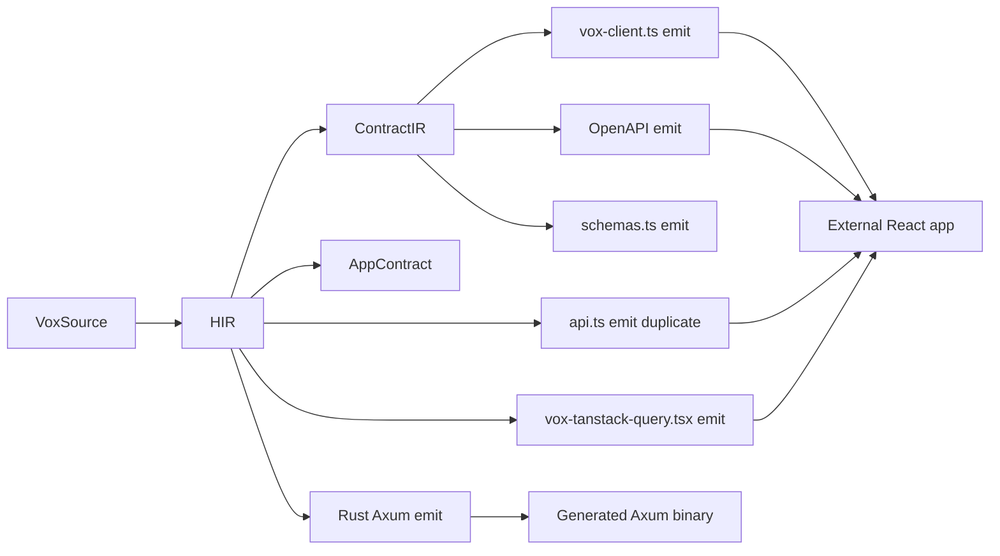

# Vox–React backend interop audit (2026)

> **Self-critique note (v2).** This is the second pass. The v1 of this doc undersold three problems and missed three artifacts entirely; corrections are listed in **§9 Audit self-critique** at the end. Use the v2 findings, not the older summary.

## 0. How to read this document

The audit is structured to be executable by a less-capable LLM follower:

- Every claim has at least one **file path with line range** as evidence.
- Every milestone has a **discrete task list** ordered by dependency and gives **acceptance commands** (mostly `cargo test` / `rg`) that confirm completion without ambiguity.
- Vox-specific policies (no new shell scripts; `.vox` automation only; secrets via `vox-secrets`) are honored throughout — see [AGENTS.md](../../../AGENTS.md).

If you are an automation agent: do **not** start coding from §6 alone. Read **§1–§5** first so you understand which doc and which crate own each surface.

---

## 1. Original intent and audit scope

**Original user intent (2026-05-11):**
> *Audit how Vox as a language interoperates with the React environment, enhancing its capabilities as a backend-only service and API provider for React frontends that exist.*

The audit covers three workstreams:

1. **API contract quality** — wire format, OpenAPI parity, versioning, error envelope.
2. **Build-target ergonomics** — `server` and `client` outputs, plus the supporting `vox emit` / `vox dev` surfaces.
3. **Runtime ops hardening** — auth, CORS, rate limits, request IDs, observability.

Scope was **expanded** during v2 to additionally cover:

- Streaming (SSE / chunked) and file uploads / multipart.
- Duplicate TS client emission (`api.ts` vs `vox-client.ts`).
- TanStack Query helper emit alignment.
- npm-publishable client packaging (per Phase 1 spec).
- `Vox.toml [build]` and `VOX_BUILD_TARGET` env-var wiring.
- Container output for backend-only mode.
- Documentation drift between [`phase-numbering-index.md`](phase-numbering-index.md) ("Phases 1–4 complete") and code reality.

---

## 2. System map (current code reality)



Files behind each node:

| Node | File | Role |
|------|------|------|
| HIR | [`crates/vox-compiler/src/hir/lower/mod.rs`](../../../crates/vox-compiler/src/hir/lower/mod.rs) | Lowers AST and stamps `route_path` per [`web_prefixes.rs`](../../../crates/vox-compiler/src/web_prefixes.rs). |
| ContractIR | [`crates/vox-compiler/src/contract_ir/project.rs`](../../../crates/vox-compiler/src/contract_ir/project.rs) | Wire-shape projection (`Decimal`/`BigInt` → string, `Option` → optional). |
| AppContract | [`crates/vox-compiler/src/app_contract.rs`](../../../crates/vox-compiler/src/app_contract.rs) | Stable JSON contract; `VOX_PORT`, `VOX_SSR_DEV_URL` baked in. |
| OpenAPI emit | [`crates/vox-codegen/src/codegen_ts/openapi_emit.rs`](../../../crates/vox-codegen/src/codegen_ts/openapi_emit.rs) | OpenAPI 3.1; `servers.url = "/api/v1"`. |
| `vox-client.ts` | [`crates/vox-codegen/src/codegen_ts/vox_client.rs`](../../../crates/vox-codegen/src/codegen_ts/vox_client.rs) | Modern typed client (Zod, `VITE_API_URL`, `VoxApiError`). |
| `api.ts` (duplicate) | [`crates/vox-codegen/src/codegen_rust/emit/client.rs`](../../../crates/vox-codegen/src/codegen_rust/emit/client.rs) | Older client emitted from the **Rust** path; `API_BASE = ''`; `throw new Error`. |
| Zod / `schemas.ts` | [`crates/vox-codegen/src/codegen_ts/zod_emit.rs`](../../../crates/vox-codegen/src/codegen_ts/zod_emit.rs) | Runtime validators consumed by `vox-client.ts`. |
| TanStack Query | [`crates/vox-codegen/src/codegen_ts/tanstack_query_emit.rs`](../../../crates/vox-codegen/src/codegen_ts/tanstack_query_emit.rs) | Generic `useVoxServerQuery` provider; **not per-endpoint**. |
| Rust Axum emit | [`crates/vox-codegen/src/codegen_rust/emit/http.rs`](../../../crates/vox-codegen/src/codegen_rust/emit/http.rs) | `main.rs` + per-endpoint Axum handlers. |
| HIR HTTP ergonomics | [`crates/vox-compiler/src/hir/nodes/http_ergonomics.rs`](../../../crates/vox-compiler/src/hir/nodes/http_ergonomics.rs) | `HirCorsPolicy`, `HirRateLimitPolicy` defined and tested at language layer. |

---

## 3. API contract and wire parity

### 3.1 What works (true positives)

- **GET vs POST split** matches SSOT §2 across emitters and the Axum router (`vox_client.rs`, `emit_query_fn_handler`/`emit_server_fn_handler` in `http.rs`).
- **Sorted lexicographic query keys** + `JSON.stringify` + `encodeURIComponent` align between client (`voxQueryString`) and server decode (`Query<BTreeMap<String, String>>`).
- **Type projection is single-source.** `Decimal` / `BigInt` → string, `Option` → absent key, sum types → `_tag` are enforced once in [`contract_ir::project`](../../../crates/vox-compiler/src/contract_ir/project.rs) and re-used by Zod, OpenAPI, and the typed client.

### 3.2 Critical contract bugs

| ID | Issue | Code evidence | SSOT evidence | Severity |
|----|-------|---------------|---------------|----------|
| **C1** | OpenAPI `servers[0].url = "/api/v1"` combined with absolute path keys (e.g. `/api/query/foo`) yields **`/api/v1/api/query/foo`** in any standard OpenAPI client. | `openapi_emit.rs` line 46 (`servers`); line 60 (`path_item.entry(e.path.clone())`); test asserts `servers[0]["url"] == "/api/v1"` line 256. | [`wire-format-v1-ssot.md`](wire-format-v1-ssot.md) §2 base URL `/api/v1/`. | **P0** |
| **C2** | SSOT example URLs (`/api/v1/search_items?...`) do not exist; routes are `/api/query/<name>`, `/api/mutation/<name>`, `/api/<server>` per [`web_prefixes.rs`](../../../crates/vox-compiler/src/web_prefixes.rs). | `web_prefixes.rs` (constants); `hir/lower/mod.rs` line 165–175. | SSOT §2.1 example. | **P0** |
| **C3** | SSOT §6 error envelope (`{ ok: false, code, message, request_id?, details? }`) is **not emitted**. Generated handlers either return raw success JSON or, only in mutation+`@table` paths, `Json({"error": e.to_string()})`. | `http.rs` `emit_server_fn_handler` line 399; `emit_query_fn_handler` line 419 — no envelope wrap. | SSOT §6. | **P0** |
| **C4** | Two divergent TS client files are emitted into the same `dist/`: `vox-client.ts` (Zod, `VITE_API_URL`, `VoxApiError`) and `api.ts` (`API_BASE = ''`, `throw new Error("Server error: ${status}")`). React consumers can call either with different error semantics. | `commands/build.rs` line 178–182 writes `api.ts`; `vox_client.rs` always emitted via `emitter.rs`. | None — undocumented duplication. | **P1** |
| **C5** | OpenAPI describes each `query` parameter with its declared type (e.g. `{type: "string"}`) but the on-the-wire encoding is always **a JSON-text string** (`encodeURIComponent(JSON.stringify(value))`). For composite types the OpenAPI parameter `schema` lies; for scalars it accidentally works because `JSON.stringify("x")` is `"\"x\""` which most servers tolerate. | `vox_client.rs` `voxQueryString`; `openapi_emit.rs` `parameters` block (line 86–98). | SSOT §2.1. | **P1** |
| **C6** | SSOT §8 promises golden tests under `tests/golden/wire-format/`. The directory does not exist. (`Glob **/tests/golden/wire-format/**` → 0 files.) | None. | SSOT §8. | **P2** |
| **C7** | HIR has no representation for **error response types** (Result / tagged error). OpenAPI emits only a `200` success response and no `4xx`/`5xx` schemas. | `openapi_emit.rs` `emit_operation` line 130–141 (only `responses.200`). | SSOT §6 implies error shape exists. | **P1** |

### 3.3 Recommended wire-format reconciliation

Two valid resolutions for **C1/C2**; pick exactly one (avoid dual canon):

**Option A (preferred): keep code, fix doc.** Update `wire-format-v1-ssot.md` §2 to state that v1 is the implicit version and the canonical layout is `/api/query/<name>`, `/api/mutation/<name>`, `/api/<name>` (server fns). Change OpenAPI emit to `servers[0].url = ""` (or omit servers entirely, which is OpenAPI-3-valid and falls back to the spec URL).

**Option B: change code, keep doc.** Insert `/v1` into `web_prefixes.rs` (`/api/v1/query/`, …); migrate snapshots; provide backward-compat aliases under `/api/query/` for one minor.

Either choice **requires** OpenAPI `servers` to compose to the same effective URL as the typed client. Add a snapshot test that asserts:

```rust
let server = spec["servers"][0]["url"].as_str().unwrap();
let path  = spec["paths"].as_object().unwrap().keys().next().unwrap();
let composed = format!("{server}{path}");
assert!(composed.starts_with("/api/")); // and exactly one `/api/` segment
assert!(composed.matches("/api/").count() == 1);
```

---

## 4. Build-target readiness (`fullstack` | `server` | `client`)

Reference: [`phase1-build-targets-spec-2026.md`](phase1-build-targets-spec-2026.md).

### 4.1 What is actually wired vs documented

| Capability | Spec / docs | Code reality | Verdict |
|------------|-------------|--------------|---------|
| `BuildTarget` enum | Phase 1 spec §1 | `crates/vox-config/src/config/gamify_web.rs` lines 55–93 | **Landed** |
| `Vox.toml [build] target = "server"` | Phase 1 spec §2 | Test `reads_build_target_server_from_vox_toml` in [`config/impl_ops.rs`](../../../crates/vox-config/src/config/impl_ops.rs) line 499 confirms parse | **Landed** |
| `VOX_BUILD_TARGET` env var precedence | Documented in `gamify_web.rs` line 57 | **No `env::var("VOX_BUILD_TARGET")` exists in the workspace** (`rg VOX_BUILD_TARGET crates → only doc-comment hit`) | **False — doc-only** |
| CLI `--target=fullstack|server|client` accepted | `BuildArgs.build_target` in [`cli_args.rs`](../../../crates/vox-cli/src/cli_args.rs) line 57 | Accepted by clap, but **not propagated**: [`cli_dispatch/lanes.rs`](../../../crates/vox-cli/src/cli_dispatch/lanes.rs) lines 134–143 calls `build::run(&a.file, &a.out_dir, a.mobile_target.clone(), …)`. The third positional arg is **`mobile_target`**, not `build_target`. `a.build_target` is **read nowhere**. | **Wiring bug** |
| `vox build` codegen branches on target | Phase 1 spec §1 | [`commands/build.rs`](../../../crates/vox-cli/src/commands/build.rs) always runs `codegen_ts::generate_with_options` AND `codegen_rust::generate` (lines 40–55). `CodegenOptions.target` is forwarded only to mobile helper emission ([`codegen_ts/emitter.rs`](../../../crates/vox-codegen/src/codegen_ts/emitter.rs) line 405). | **Not implemented** |
| `vox dev --target=server` | Phase 1 spec §3 | [`commands/dev.rs`](../../../crates/vox-cli/src/commands/dev.rs) takes only `(file, out_dir, port, open)`; no target. | **Missing** |
| `vox emit client --lang=ts --out=…` | Phase 1 spec §1.2 | **No `Cli::Emit` variant**, no `commands/emit.rs`. | **Missing** |
| `vox init --kind=backend` | Phase 1 spec §1.4 | Not present in CLI surface. | **Missing** |
| `vox bundle` skipping Vite when `target=server` | Implied | [`commands/run.rs`](../../../crates/vox-cli/src/commands/run.rs) `resolve_has_frontend` honors `BuildTarget::Server` (line 273) — works at run-time only. | **Partial (run only)** |
| Lean Dockerfile for backend-only | Phase 1 spec §1.5 | [`crates/vox-container`](../../../crates/vox-container/) emits a Rust-first image regardless of target. | **Out of scope today** |

### 4.2 Documentation drift

[`phase-numbering-index.md`](phase-numbering-index.md) line 17 states: **"Frontend interop: Phases 1–4 complete; Phase 5 in plan."** Code reality of Phase 1: enum + Vox.toml read landed; **everything else is paper**. The doc is incorrect; either land Phase 1 or downgrade the index.

---

## 5. Runtime ops hardening

| Concern | Language surface | Codegen reality | Notes |
|---------|------------------|-----------------|-------|
| CORS | `HirCorsPolicy` defined in [`http_ergonomics.rs`](../../../crates/vox-compiler/src/hir/nodes/http_ergonomics.rs); attached as `HirEndpointFn.cors: Option<HirCorsPolicy>` ([`hir/nodes/decl.rs`](../../../crates/vox-compiler/src/hir/nodes/decl.rs) line 416). HIR lowering populates it ([`hir/lower/mod.rs`](../../../crates/vox-compiler/src/hir/lower/mod.rs) line 197). | **`rg CorsLayer\|tower_http::cors crates/vox-codegen` → 0 hits.** Policy is never read by emitters. | True positive in v1, sharpened. |
| Rate limit | `HirRateLimitPolicy` defined; attached as `HirEndpointFn.rate_limit` line 419. | **No emission.** | Same |
| Auth (`@auth(...)` / `@public`) | Parsed and validated in `vox-compiler/src/typeck`. | **Codegen never emits middleware.** No JWT, no session cookie, no header check. | |
| Request ID propagation | None | None — `tracing_subscriber::fmt::init()` only ([`http.rs`](../../../crates/vox-codegen/src/codegen_rust/emit/http.rs) line 164). | New in v2. |
| Streaming / SSE | None in HIR or codegen — `rg SSE\|EventSource\|text/event-stream\|axum::response::sse crates/vox-codegen → 0 hits` | Generated handlers always return `Json<serde_json::Value>`. Long-poll, SSE, chunked — unsupported. | New in v2. |
| File uploads / multipart | None | `rg multipart crates/vox-codegen → 0 hits`. | New in v2. |
| WebSockets | Orchestrator MCP gateway has WS ([`vox-orchestrator-mcp/src/http_gateway/ws.rs`](../../../crates/vox-orchestrator-mcp/src/http_gateway/ws.rs)); generated user apps **do not**. | | |
| Pagination | Convention-only via `@query` params | None enforced. | |
| Idempotency keys | None | None | Web-app archetype coverage doc lists this as a blocker. |

The `tower-http` crate is **already used in the workspace** (e.g. `vox-orchestrator-mcp/src/http_gateway/mod.rs`), so emitting `CorsLayer`/`TraceLayer` from codegen is a dependency-graph addition, not a new third-party adoption decision.

---

## 6. Prioritized gap analysis (v2)

Severity follows `P0` (blocker for an external React+backend team) → `P3` (paper cut). Effort is **S** (≤1 day), **M** (~1 week), **L** (>1 week).

| ID | Gap | Sev | Effort | Owner crate(s) | Evidence |
|----|-----|-----|--------|----------------|----------|
| G1 | OpenAPI `servers` + paths compose to a duplicate `/api/` segment | P0 | S | `vox-codegen` | §3.2 C1 |
| G2 | SSOT path examples disagree with emitted routes | P0 | S | docs | §3.2 C2 |
| G3 | Error envelope unimplemented | P0 | M | `vox-codegen`, `vox-runtime` | §3.2 C3 |
| G4 | `BuildArgs.build_target` not threaded into `build::run`; `vox build` does not branch | P0 | M | `vox-cli`, `vox-codegen` | §4.1 row 4 |
| G5 | `VOX_BUILD_TARGET` env var documented but unread | P1 | S | `vox-config` | §4.1 row 3 |
| G6 | `vox emit client` subcommand does not exist | P1 | M | `vox-cli`, new `vox-codegen-client` crate | §4.1 row 7 |
| G7 | Two divergent TS client files (`api.ts` + `vox-client.ts`) | P1 | S–M | `vox-codegen` | §3.2 C4 |
| G8 | CORS/rate-limit lowered into HIR but not emitted | P1 | M | `vox-codegen` | §5 row 1–2 |
| G9 | `vox dev --target=server` missing | P1 | S | `vox-cli` | §4.1 row 6 |
| G10 | OpenAPI omits non-200 responses; no error schema | P1 | M | `vox-codegen`, contract IR | §3.2 C7 |
| G11 | OpenAPI parameter encoding lies for composite query types | P1 | S–M | `vox-codegen` | §3.2 C5 |
| G12 | No request-id propagation / structured tracing layer | P2 | M | `vox-codegen` | §5 row 4 |
| G13 | No SSE / streaming / multipart codegen | P2 | L | `vox-compiler`, `vox-codegen` | §5 rows 5–6 |
| G14 | Wire-format §8 golden fixtures missing | P2 | M | `vox-codegen` tests | §3.2 C6 |
| G15 | `phase-numbering-index.md` overstates Phase 1 completion | P2 | S | docs | §4.2 |
| G16 | `vox init --kind=backend` missing | P3 | S–M | `vox-cli` | §4.1 row 8 |
| G17 | Backend-only Dockerfile lane | P3 | M | `vox-container` | §4.1 row 10 |

---

## 7. Implementation roadmap (step-by-step, agent-followable)

Each milestone lists **discrete tasks** with a **single file as the unit of work** wherever possible, plus an **acceptance command** that returns success/failure unambiguously.

> **Vox-policy reminders for the implementing agent:**
> - Do **not** add `.ps1` / `.sh` / `.py` automation; use `vox run scripts/<name>.vox`. ([AGENTS.md §VoxScript-First Glue Code](../../../AGENTS.md))
> - Do **not** read secrets via `std::env::var`; use `vox_secrets::resolve_secret(...)`.
> - Test-first per [AGENTS.md §Test-First Policy](../../../AGENTS.md): write the failing test before adding any new `pub fn`.
> - Run `cargo` via the absolute Cargo path on Windows: `& "$env:USERPROFILE\.cargo\bin\cargo.exe"`.

### Milestone A — Contract truth (P0; 1 PR; 0.5–1 day)

**Goal:** OpenAPI, `vox-client.ts`, and SSOT all describe the **same URL** for the same endpoint. Pick Option A (fix doc; minimize code change) unless the team explicitly prefers Option B.

**Tasks (Option A):**

1. **Edit OpenAPI server URL.** In [`crates/vox-codegen/src/codegen_ts/openapi_emit.rs`](../../../crates/vox-codegen/src/codegen_ts/openapi_emit.rs) line 46, change `servers` to `[{ "url": "" }]` or remove the key entirely. Update existing test at line 256.
2. **Add a new test `openapi_paths_compose_with_one_api_segment`** in the same file that builds a representative `ContractIr`, emits, and asserts the composed `server + path` for each endpoint contains exactly one `"/api/"` substring.
3. **Update [`wire-format-v1-ssot.md`](wire-format-v1-ssot.md)** §2 and §2.1 examples to use the canonical paths emitted by [`web_prefixes.rs`](../../../crates/vox-compiler/src/web_prefixes.rs): `/api/query/<name>`, `/api/mutation/<name>`, `/api/<server>`.
4. **Acceptance:**
   - `cargo test -p vox-codegen openapi_paths_compose_with_one_api_segment`
   - `cargo test -p vox-codegen --test golden_ts_test` (snapshots may need `cargo insta accept` after review).
   - Manual: `npx openapi-typescript dist/openapi.json -o /tmp/api.ts` produces a file that calls the same URLs `vox-client.ts` does.

### Milestone B — Error envelope unification (P0; 1 PR; 2–3 days)

**Goal:** Every generated handler returns SSOT §6 envelope on failure, on every kind (`@query`, `@mutation`, `@server`), with the same shape.

**Tasks:**

1. **Add a runtime helper crate `vox-http-envelope`** (or place inside an existing utility crate) that defines:
   ```rust
   pub struct ErrorEnvelope { pub ok: bool /* always false */, pub code: String,
                              pub message: String, pub request_id: Option<String>,
                              pub details: Option<serde_json::Value> }
   pub fn err_response(status: StatusCode, code: &str, msg: impl Into<String>) -> Response;
   ```
   Add a `From<E>` for any `vox-db` / runtime error you want to map.
2. **Modify `emit_server_fn_handler`** ([`http.rs`](../../../crates/vox-codegen/src/codegen_rust/emit/http.rs) line 362). Replace today's two endings (`Json(serde_json::Value::Null)` and `Err(e) => Json(serde_json::json!({"error": e.to_string()}))`) with calls into the helper.
3. **Modify `emit_query_fn_handler`** (line 419) similarly: when query parse fails or handler body returns `Err`, map to envelope. Currently the function silently coerces missing params to `Value::Null`; add a structured 400 instead with `code = "BAD_REQUEST"` and `details = { param: "<name>" }`.
4. **Modify `emit_route_handler`** (line 337) for raw `http` routes — same envelope.
5. **Add an OpenAPI default response** in [`openapi_emit.rs`](../../../crates/vox-codegen/src/codegen_ts/openapi_emit.rs) `emit_operation` so each operation declares `default: ErrorEnvelope` (and define the schema once in `components.schemas.ErrorEnvelope`).
6. **Acceptance:**
   - New integration test under `crates/vox-integration-tests/tests/error_envelope.rs` that boots the emitted Axum app for a fixture `.vox` file, sends a malformed POST, asserts `{ok:false, code:"BAD_REQUEST"}`.
   - `rg "ok\":\\s*false" crates/vox-codegen → ≥1 hit in `http.rs`.

### Milestone C — Build-target wire-up (P0/P1; 1 PR; 3–5 days)

**Goal:** `vox build --target=server` skips TS codegen; `--target=client` skips Rust codegen; `--target=fullstack` is unchanged. `Vox.toml [build]` and `VOX_BUILD_TARGET` are honored.

**Tasks:**

1. **Read `VOX_BUILD_TARGET`.** Extend [`crates/vox-config/src/config/impl_ops.rs`](../../../crates/vox-config/src/config/impl_ops.rs) (the `build_target` merge sits at line 226) so that after the `Vox.toml` merge, an environment override is applied. Use the existing `vox_config::env_parse::resolve_config_str("VOX_BUILD_TARGET", "")` helper from [`env_parse.rs`](../../../crates/vox-config/src/env_parse.rs) and parse via `BuildTarget::from_str` ([`gamify_web.rs`](../../../crates/vox-config/src/config/gamify_web.rs) line 71). Keep precedence per `gamify_web.rs` line 57: CLI flag > env > Vox.toml > default.
   - **Test in `impl_ops.rs`:** set env var via `std::env::set_var` inside a tempdir test, assert override beats Vox.toml. Use a serial-test guard if other tests in the file mutate process env.
2. **Thread `BuildArgs.build_target` into `commands::build::run`.** Two changes:
   - Rename `commands/build.rs::run` parameter `target` → `mobile_target` to remove the long-standing naming confusion.
   - Add a new parameter `build_target: Option<vox_config::BuildTarget>` (defaulting to `None`); when `None`, fall back to `VoxConfig::load().build_target`.
   - Update **all 8 callers** (`cli_dispatch/lanes.rs:135`, `compilerd.rs:203,346,392,437`, `commands/run.rs:130`, `commands/test.rs:22`, `commands/bundle.rs:94`).
3. **Branch on `build_target` in `commands/build.rs`:**
   ```text
   match resolved_target {
     Server    => only run codegen_rust + write Rust files; skip TS files; skip api.ts.
     Client    => only run codegen_ts in Library mode + write TS bundle to out_dir; skip Rust write.
     Fullstack => current behavior.
   }
   ```
4. **Update `commands/run.rs`** so `BuildTarget::Client` short-circuits with a friendly error: "client target produces a TS package; use `npm publish` to ship it".
5. **Acceptance:**
   - `cargo test -p vox-cli build_target` (new tests).
   - `cargo run -p vox-cli -- build examples/golden/crud_api.vox --target=server -o /tmp/server-only` produces **only** files under `/tmp/server-only` from Rust path; `find /tmp/server-only -name "*.tsx"` → empty.
   - Same with `--target=client` → no `target/generated/Cargo.toml`.
6. **Docs:** add a row to [`docs/src/reference/cli.md`](../../../docs/src/reference/cli.md) and follow the [.cursor/rules/cli-command-registry](../../../.cursor/rules/cli-command-registry.mdc) rule (`vox ci operations-sync --target cli --write`).

### Milestone D — `vox emit client` subcommand (P1; 1 PR; 3–7 days)

**Goal:** Produce an npm-publishable client package independent of the full-stack build.

**Tasks:**

1. **Add `Cli::Emit { kind: EmitKind, lang: EmitLang, out: PathBuf, source: PathBuf }`** in `crates/vox-cli/src/main.rs` (mirror existing `Cli::*` enum style) and `EmitKind = Client` (extensible) / `EmitLang = Ts` (extensible).
2. **New module `crates/vox-cli/src/commands/emit.rs`** that reads `source`, drives the compiler frontend through `pipeline::run_frontend`, then calls a new emitter that produces a directory with:
   - `package.json` (name from `Vox.toml [package].name + "-client"`, version from workspace, `exports` map for ESM/CJS/`.d.ts`).
   - `src/index.ts` re-exporting `vox-client.ts` body but with `BASE` taken from constructor parameter, not `import.meta.env`.
   - `src/schemas.ts`, `src/types.ts`.
   - `tsconfig.json` (consumed only at publish-time; library-mode emit).
   - `README.md` with one usage snippet.
3. **Reproducibility:** the subcommand MUST be byte-deterministic for identical input HIR. Add a snapshot test under `crates/vox-codegen/tests/` (or a new `vox-codegen-client` crate when LoC justifies extraction; layer rules in [`docs/src/architecture/layers.toml`](layers.toml)).
4. **Acceptance:**
   - `cargo run -p vox-cli -- emit client --source examples/golden/crud_api.vox --out /tmp/api-client` succeeds.
   - `cd /tmp/api-client && pnpm install && pnpm tsc --noEmit` succeeds.
   - Running twice yields byte-identical files (`diff -r run1 run2` empty).

### Milestone E — Lower CORS / rate-limit / auth into Axum (P1; 1 PR; 5–10 days)

**Goal:** Decorators a Vox author already writes are honored at runtime by the generated Axum binary.

**Tasks:**

1. **CORS:** in [`http.rs`](../../../crates/vox-codegen/src/codegen_rust/emit/http.rs), iterate `module.endpoint_fns` and gather distinct `cors` policies. If any present:
   - Add `tower-http = { version = "0.5", features = ["cors", "trace"] }` to the generated `Cargo.toml` ([`emit/mod.rs`](../../../crates/vox-codegen/src/codegen_rust/emit/mod.rs) `emit_cargo_toml`).
   - Emit per-route `.layer(CorsLayer::new().allow_origin(...).allow_credentials(...))` from the policy.
2. **Rate limit:** emit `tower::limit::RateLimitLayer` (or `tower_governor` if included) per-route using `HirRateLimitPolicy::{window_secs, max_requests, by}`. Decline silently for `RateLimitBy::ApiKey` until header extraction is wired.
3. **Auth:** generate a marker middleware that reads the `Authorization: Bearer` header for endpoints **without** `@public`; reject 401 via the §6 error envelope. JWT verification is out of scope here — leave a comment describing the contract for [Phase 3 spec](phase3-http-ergonomics-spec-2026.md).
4. **Acceptance:**
   - Snapshot test for a fixture `.vox` file with `@cors(origins=["https://app.example"])` produces `CorsLayer::new()...allow_origin(["https://app.example"])` in `main.rs`.
   - Integration test boots the binary and `curl -i -X OPTIONS -H 'Origin: https://app.example'` returns `access-control-allow-origin`.

### Milestone F — Collapse the duplicate TS client (P1; 1 PR; 1 day)

**Goal:** One client, one error model, one base-URL convention.

**Tasks:**

1. **Stop emitting `api.ts`** by removing the write at [`commands/build.rs`](../../../crates/vox-cli/src/commands/build.rs) line 178–182, and remove `emit_api_client` from the `pub use` at [`emit/mod.rs`](../../../crates/vox-codegen/src/codegen_rust/emit/mod.rs) line 21.
2. **Migrate any `import … from "./api"`** in goldens / snapshots / scaffolds to `vox-client`. Affected files (per `rg "from ['\"]\\./api['\"]" tests/ crates/`): expect 4–8 hits — verify before deleting.
3. **Add a deprecation note** in [`docs/src/reference/vox-fullstack-artifacts.md`](../reference/vox-fullstack-artifacts.md) lines 19–28 (the `api.ts` row) explaining the consolidation.
4. **Acceptance:**
   - `rg "fn emit_api_client" crates/ → 0 hits.`
   - `cargo test -p vox-codegen` and `-p vox-integration-tests` pass after snapshot updates.

### Milestone G — `vox dev --target=server` (P1; 1 PR; 1–2 days)

**Tasks:**

1. Extend [`commands/dev.rs`](../../../crates/vox-cli/src/commands/dev.rs) with a `target: BuildTarget` parameter (or read from `VoxConfig::load`).
2. When target == `Server`, do not start the Vite shell or open a browser; only restart the Axum binary on file change.
3. **Acceptance:** `cargo run -p vox-cli -- dev examples/golden/crud_api.vox --target=server` does not require `pnpm` or Node.

### Milestone H — Streaming / SSE / multipart (P2; multi-PR; >2 weeks)

This is **language work** (decorators / return types) before codegen, so plan as its own initiative:

- Add return type `Stream<T>` to HIR; lower to `axum::response::sse::Sse` for `@endpoint(kind: server)` returning `Stream<…>`.
- Add `@multipart` decorator on mutation params; lower to `axum::extract::Multipart`.
- Update Contract IR + OpenAPI to express both. Update `vox-client.ts` to expose a typed `EventSource`/`fetch` reader.

Defer until Milestones A–G land.

### Milestone I — Observability and request IDs (P2; 1 PR; 2–3 days)

**Tasks:**

1. Emit `tower_http::trace::TraceLayer::new_for_http()` and `tower_http::request_id::SetRequestIdLayer::x_request_id(MakeRequestUuid)` in `main.rs`.
2. Thread the request id into the §6 error envelope `request_id` field via an Axum extractor.

### Milestone J — Wire-format goldens + index correction (P2; 1 PR; 1–2 days)

**Tasks:**

1. Create `tests/golden/wire-format/` with at least: a query with composite query params, a mutation with `Decimal` body, an error-envelope response.
2. Add a `cargo test --test wire_format_goldens --check` flag matching SSOT §8.
3. **Update [`phase-numbering-index.md`](phase-numbering-index.md)** so the Phase 1 status reflects what is actually merged after Milestone C.

---

## 8. React integration playbook (today, before milestones land)

Practical recipes for a React team that can't wait:

| Need | Today's path |
|------|--------------|
| Typed fetch | Use `vox-client.ts` + `VITE_API_URL` pointing at the Axum origin. Ignore `api.ts`. |
| OpenAPI codegen (Orval / openapi-typescript) | After `vox build`, post-process `dist/openapi.json` to set `servers[0].url = ""`, then run codegen. Or wait for Milestone A. |
| TanStack Query | Wrap each `vox-client` call in `useVoxServerQuery(['name', ...args], () => name(...args))` from generated `vox-tanstack-query.tsx`. |
| Auth | Terminate at a reverse proxy (Caddy/Nginx). Verify Bearer tokens upstream; pass-through to Axum. |
| CORS | Same — proxy adds the headers until Milestone E lands. |
| Errors | Treat any non-2xx as opaque; **do not depend on SSOT §6 shape** until Milestone B. |
| Streaming | Not supported — fall back to polling `@query`. |

---

## 9. Audit self-critique (v1 → v2 deltas)

What the v1 of this doc got wrong or missed:

- **Missed entirely:** the **second client emitter** `crates/vox-codegen/src/codegen_rust/emit/client.rs` that produces `api.ts` separate from `vox-client.ts` (G7 / C4). v1's React playbook was therefore incomplete — a React team following v1 might import the wrong file.
- **Understated:** v1 framed the OpenAPI server-URL bug as "needs reconciliation"; it is actually a **broken composition** (duplicate `/api/` segment) that breaks every standard OpenAPI client. Sharpened to **C1**.
- **Understated:** v1 said CORS/auth "not emitted"; v2 adds the precise observation that **HIR fields exist and are populated at lowering time** (`HirEndpointFn.cors`, `.rate_limit`) — making this a pure codegen-side gap, much smaller than v1 implied.
- **False positive risk:** v1 implied `BuildTarget` was paper-only; v2 confirms `Vox.toml [build] target` IS read (test at `impl_ops.rs:499`). The real bug is narrower: env var unwired and CLI flag dropped.
- **Newly added:** SSE / streaming / multipart / request-id / pagination / idempotency — all P1–P2 gaps for a "real" React backend.
- **Newly added:** `phase-numbering-index.md` doc drift (G15).
- **Sharpened verifications:** every gap now has a `rg`/`cargo test` acceptance command, not just a prose claim.

---

## 10. Related documents

- [Wire Format v1 SSOT](wire-format-v1-ssot.md) — needs §2 path examples updated (Milestone A).
- [Phase 1: Build Target Split](phase1-build-targets-spec-2026.md) — spec for Milestones C, D, G.
- [Phase 3 HTTP ergonomics](phase3-http-ergonomics-spec-2026.md) — spec for Milestone E.
- [External frontend interop plan](external-frontend-interop-plan-2026.md) — five-phase strategy.
- [Phase numbering index](phase-numbering-index.md) — needs status correction (Milestone J).
- [vox-fullstack-artifacts](../reference/vox-fullstack-artifacts.md) — needs `api.ts` deprecation note (Milestone F).
- [vox-web-stack](../reference/vox-web-stack.md) — consumer-facing guide.
- [Web app archetype coverage 2026](web-app-archetype-coverage-2026.md) — broader blocker map (CC-* items intersect Milestones B, E, H).
