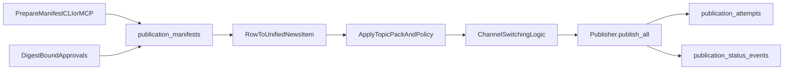

# VoxGiantia publication architecture (beginner map)

Companion docs: [operator inputs vs derived fields](../how-to/scientia-publication-operator-inputs.md), [failure playbook](../reference/scientia-publication-playbook.md), [scholarly digest-bound invariants](scholarly-digest-approval-invariants.md), [external jobs schema plan](scholarly-external-schema-plan.md).

This document explains, in practical terms, how VoxGiantia supports the goal:

- write once (one publication manifest),
- publish many times (scholarly + social channels),
- with clear policy gates and auditable outcomes.

## Core lingo

- **manifest**: one canonical publication record (`publication_manifests`) containing title, author, body, metadata, and digest.
- **digest**: content hash (`content_sha3_256`) used as an immutable fingerprint for approvals and attempts.
- **approval**: a reviewer attestation bound to one digest. If content changes, digest changes, and approvals must be redone.
- **attempt**: one execution record in `publication_attempts` for route simulation, publish, or retry.
- **channel**: destination platform (`rss`, `twitter`, `github`, `open_collective`, `reddit`, `hacker_news`, `youtube`, modeled `crates_io`).
- **topic pack**: named contract bundle from `contracts/scientia/distribution.topic-packs.yaml` that can merge policy and channel allowlists.
- **policy gate**: rules that can disable a channel (`enabled`, topic filters, worthiness floors).
- **dry run**: compute routing/output without sending live platform API requests.

## Big-picture architecture

## Main components and responsibilities

### `vox-db` (source of truth storage)

- persists manifests, approvals, attempts, status events, scholarly submissions, media assets.
- all operator surfaces (CLI/MCP/orchestrator) converge on these records.

### `vox-cli` operator paths

- `vox scientia ...`: scholarly lifecycle facade (`prepare`, `preflight`, `approve`, `submit-local`, `status`).
- `vox db publication-*`: route simulation, selective publish, retry failed channels.

### `vox-mcp` tool paths

- MCP equivalents for prepare/preflight/approve/submit/status/media/simulate/publish/retry.
- same DB tables and same `Publisher` core runtime.

### `vox-orchestrator` live news path

- builds/updates manifests for scheduled news work.
- applies publish gate controls and records attempts/events.

### `vox-publisher` routing engine

- turns a manifest-derived item into per-channel outcomes.
- applies policy checks, dry-run behavior, platform adapters, and decision reasons.

## How “write once, publish everywhere” works

1. Prepare one manifest (markdown + structured metadata).
2. Gain digest-bound approvals.
3. Convert manifest row to runtime item (`UnifiedNewsItem`).
4. Merge optional topic pack policy.
5. Apply channel switching logic:
   - explicit operator allowlist (if provided),
   - channel policy (`enabled`, topic filters, worthiness floors),
   - runtime dry-run and credential/feature availability.
6. Execute `Publisher.publish_all`.
7. Record each outcome in `publication_attempts` and status timelines.
8. Retry only failed channels from the latest matching digest attempt.

## Platform vagaries (what differs by destination)

- **RSS**: file update path, no external token required.
- **Twitter/X**: short text limits and optional chunking/thread behavior.
- **GitHub**: repo + post-type semantics (release vs discussion).
- **Open Collective**: slug + tokenized GraphQL flow.
- **Reddit**: OAuth client/secret/refresh token/user-agent required.
- **Hacker News**: manual-assist submit-link flow (official API is read-only).
- **YouTube**: requires real local video asset and OAuth upload flow.
- **crates_io**: currently modeled in config/contracts; execution support should be treated as explicit runtime capability, not implied by schema alone.

## Why switching logic must stay centralized

If CLI and MCP implement routing details separately, drift appears quickly:

- one path may retry against stale digest attempts,
- one path may normalize channels differently,
- one path may classify feature-gated channels differently.

Centralized switching primitives make behavior deterministic across interfaces.

## Current gaps (post–routing hardening)

- **Scholarly:** `local_ledger` (default) and `echo_ledger` (deterministic, no external network); `VOX_SCHOLARLY_ADAPTER` rejects unknown values (no silent stub).
- **crates.io:** schema/contract allow payloads; runtime stays explicit dry-run / not-implemented style outcomes until a real adapter ships.
- **Policy knobs:** `retry_profile` / `approval_required` in `distribution_policy` are mainly contract/documentation; live gating is digest + armed + DB (see gate module)—do not assume `approval_required: false` bypasses Codex approvals.
- **Worthiness:** orchestrator news enforces optional global floors; CLI and MCP compute the same aggregate score from the default contract + manifest preflight, set `PublisherConfig.worthiness_score` for per-channel policy floors, and can **block live publish** when enforcement enabled (`VOX_SOCIAL_WORTHINESS_*` and/or `[news].worthiness_*` on MCP).
- **Automation:** discovery → manifest → approval → publish is still multi-step; faster scholar UX needs richer prepare defaults (citations ORCID, license templates) and optional CI hooks (out of scope for this doc).

## Related docs

- `docs/src/how-to/how-to-scientia-publication.md`
- `docs/src/architecture/scientia-publication-automation-ssot.md`
- `docs/src/architecture/scientia-publication-readiness-audit.md`
- `docs/src/reference/scientia-publication-worthiness-rules.md`
