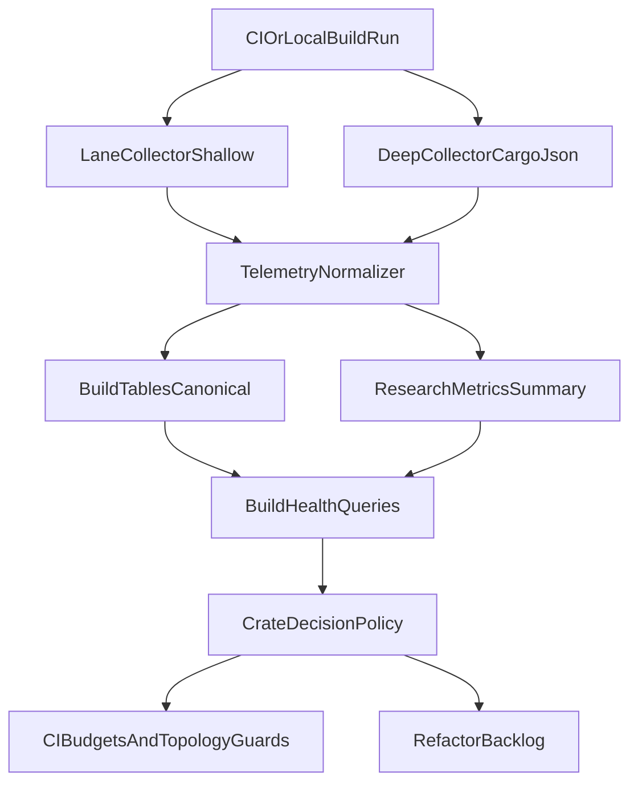

---
status: archived
archived_date: 2026-04-13
training_eligible: false
schema_type: "TechArticle"
title: "Archived Plan: build_telemetry_dependency_architecture_44d67a23.plan"
---

> [!WARNING]
> **ARCHIVED COMPONENT**: This file was archived on 2026-04-13. It is intentionally excluded from active AI context. It must not be referenced for contemporary development.

# Persistent Build Telemetry + Crate Architecture Plan

## Goal
Create one durable, low-noise telemetry loop where build timing and dependency-shape metrics are persisted in VoxDB and used to make explicit crate-organization decisions (separation of concerns vs build speed), with SSOT-compliant trust/retention rules.

## Verified Current State (Code-Accurate)
- **Two collectors exist**:
  - Shallow lane timing (`vox ci build-timings`) in [`crates/vox-cli/src/commands/ci/run_body_helpers/timings.rs`](crates/vox-cli/src/commands/ci/run_body_helpers/timings.rs).
  - Deep `cargo --message-format=json` parse (`--deep`) in [`crates/vox-cli/src/commands/ci/build_timings.rs`](crates/vox-cli/src/commands/ci/build_timings.rs).
- **Persistence is split**:
  - Shallow path writes `benchmark_event` only when `VOX_BENCHMARK_TELEMETRY=1`, using `record_opt_blocking` (currently no explicit unit field).
  - Deep path attempts `build_run/build_crate_sample/build_warning` writes, then falls back to `benchmark_event` only if telemetry env is enabled.
- **Config resolver mismatch exists**:
  - Deep Arca path uses `DbConfig::from_env()` (can resolve to memory).
  - Benchmark telemetry uses `DbConfig::resolve_canonical()` (durable local default).
- **Design signals exist but are not decision-closed**:
  - Lane budgets in `docs/ci/build-timings/budgets.json`.
  - Sprawl/god-object governance in [`docs/agents/governance.md`](docs/agents/governance.md).
  - Crate topology guidance in [`docs/src/architecture/crate-topology-buckets.md`](docs/src/architecture/crate-topology-buckets.md).

## Critical Design Review (What To Improve)
1. **Primary risk: inconsistent durability semantics.** Identical command family can persist or not persist depending on path/env.
2. **Contract drift risk: units/naming ambiguity.** Shallow path records milliseconds without explicit unit, while contract examples emphasize explicit unit semantics.
3. **Observability gap: failure reasons hidden.** Deep path returns `false` on any DB step failure and silently falls back, reducing diagnosability.
4. **Architecture loop not closed.** Build telemetry is collected, but no explicit policy translates metrics into crate split/merge/feature-gating actions.
5. **Over-engineering hazard if we add too much schema now.** New tables for dependency graph edges are unnecessary before query demand is proven.

## Refined Architectural Decisions
- **Decision A (SSOT data plane):** Keep `build_run/build_crate_sample/build_warning` as the canonical structured source for build analytics.
- **Decision B (compatibility plane):** Keep `research_metrics:benchmark_event` as a summarized/compatibility stream; do not make it the only source for build health.
- **Decision C (resolver consistency):** All build telemetry writers must use canonical durable DB resolution semantics unless explicitly running in test mode.
- **Decision D (minimal schema growth):** Add dependency-shape metrics first as bounded JSON fields (or summary columns) tied to `build_run`; defer edge-level normalized tables until proven necessary.
- **Decision E (decision policy over raw data):** Add explicit thresholds and actions (warn/fail/refactor ticket) so telemetry drives crate topology, not just dashboards.

## Target Architecture

## Implementation Plan (Improved, Non-Overengineered)

### Wave 1 - Persistence Consistency (Must Have)
- Align deep path DB resolution with canonical durable behavior used by benchmark telemetry.
- Ensure shallow path writes explicit `metric_value_unit` when scalar is present.
- Add bounded debug logs at parser and persistence boundaries (payload shape and write outcome), without log spam.
- Keep local-first and explicit upload posture unchanged.

Primary files:
- [`crates/vox-cli/src/commands/ci/run_body_helpers/timings.rs`](crates/vox-cli/src/commands/ci/run_body_helpers/timings.rs)
- [`crates/vox-cli/src/commands/ci/build_timings.rs`](crates/vox-cli/src/commands/ci/build_timings.rs)
- [`crates/vox-cli/src/benchmark_telemetry.rs`](crates/vox-cli/src/benchmark_telemetry.rs)
- [`crates/vox-db/src/config.rs`](crates/vox-db/src/config.rs)

### Wave 2 - Queryable Build Health Surface
- Standardize event names and units in one contract source.
- Add query ops for:
  - lane trend deltas,
  - slowest crates over time,
  - warning hotspots by crate/feature profile.
- Expose those via CLI/MCP read paths so humans and agents can evaluate architecture from one surface.

Primary files:
- [`crates/vox-db/src/store/ops_build.rs`](crates/vox-db/src/store/ops_build.rs)
- [`crates/vox-db/src/schema/domains/toestub_build.rs`](crates/vox-db/src/schema/domains/toestub_build.rs)
- [`crates/vox-mcp/src/tools/benchmark_tools.rs`](crates/vox-mcp/src/tools/benchmark_tools.rs)
- [`docs/src/reference/telemetry-metric-contract.md`](docs/src/reference/telemetry-metric-contract.md)

### Wave 3 - Dependency-Shape Metrics (Bounded Scope)
- Capture one snapshot per run with bounded fields:
  - crate count,
  - edge count,
  - top N fan-in/fan-out crates,
  - feature-set signature,
  - dep fingerprint.
- Persist this with minimal schema overhead (summary JSON/columns tied to `build_run`).
- Add regression checks for coupling growth and feature explosion.
- Do **not** add per-edge historical tables in this wave.

Primary files:
- [`crates/vox-cli/src/commands/ci/build_timings.rs`](crates/vox-cli/src/commands/ci/build_timings.rs)
- [`crates/vox-cli/src/commands/ci/run_body_helpers/timings.rs`](crates/vox-cli/src/commands/ci/run_body_helpers/timings.rs)
- [`crates/vox-db/src/store/ops_build.rs`](crates/vox-db/src/store/ops_build.rs)
- [`docs/src/architecture/crate-topology-buckets.md`](docs/src/architecture/crate-topology-buckets.md)

### Wave 4 - Telemetry-Driven Crate Decision Policy
- Define explicit policy rules:
  - Split crate only when both compile pain and coupling threshold are exceeded.
  - Prefer module refactor when coupling is local and public surface is stable.
  - Prefer feature-gating when optional domain weight dominates but ownership remains cohesive.
- Add policy outputs to CI in tiers:
  - `info`: trend only,
  - `warn`: threshold approaching,
  - `fail`: sustained regression window exceeded.

Primary files:
- [`docs/src/architecture/crate-topology-buckets.md`](docs/src/architecture/crate-topology-buckets.md)
- [`docs/agents/governance.md`](docs/agents/governance.md)
- [`docs/src/ci/cli-baseline-metrics.md`](docs/src/ci/cli-baseline-metrics.md)
- [`contracts/operations/catalog.v1.yaml`](contracts/operations/catalog.v1.yaml)

### Wave 5 - CI/Governance Hardening
- Make CI persistence behavior explicit:
  - when telemetry is expected,
  - when degraded optional mode is accepted.
- Add checks for telemetry contract drift (name/unit/schema consistency).
- Update retention/sensitivity docs for any new fields.

Primary files:
- [`.github/workflows/ci.yml`](.github/workflows/ci.yml)
- [`docs/src/architecture/telemetry-trust-ssot.md`](docs/src/architecture/telemetry-trust-ssot.md)
- [`docs/src/architecture/telemetry-retention-sensitivity-ssot.md`](docs/src/architecture/telemetry-retention-sensitivity-ssot.md)
- [`contracts/db/retention-policy.yaml`](contracts/db/retention-policy.yaml)

## Design Guardrails (Balance Without Bloat)
- Every crate topology change requires pre/post telemetry comparison over at least one stable window.
- Prefer lower-cost interventions first: module cleanup -> feature-gating -> crate split.
- Keep telemetry S0/S1 by default; S2 fields require explicit justification and SSOT updates.
- Prefer additive compatibility changes before hard cutovers (dual-write transition where needed, then deprecate).
- Avoid new dashboards/engines until existing CLI/MCP surfaces prove insufficient.

## Acceptance Criteria
- Shallow and deep commands both persist to durable VoxDB consistently under documented env conditions.
- Metric names/units are explicit and contract-aligned.
- A single query surface can answer:
  - fastest/slowest crate trends,
  - lane regressions,
  - coupling growth hotspots.
- CI emits actionable policy outcomes (info/warn/fail) for crate architecture regressions.
- SSOT, retention, and sensitivity docs are updated and pass drift checks.

## Risks and Mitigations
- **Risk:** False positives from noisy timing samples.
  **Mitigation:** use rolling windows and median/p95, not single-run fail decisions.
- **Risk:** Telemetry cardinality creep.
  **Mitigation:** bounded key set, bounded top N lists, enforce payload size checks.
- **Risk:** Silent fallback hides persistence failures.
  **Mitigation:** structured debug logs and explicit persistence status in command output.
- **Risk:** Over-coupling policy to one benchmark lane.
  **Mitigation:** require multi-lane corroboration before hard fails.

## Execution Order (Practical)
1. Resolver + unit consistency fixes.
2. Persistence outcome visibility and debug logging.
3. Query surfaces on existing `build_*` tables.
4. Bounded dependency-shape metrics.
5. CI policy tiers and governance docs.

## Deliverables
- Durable, consistent build telemetry persistence semantics.
- Queryable build and dependency-shape intelligence in VoxDB.
- Explicit policy for crate organization actions grounded in telemetry.
- CI and SSOT alignment that prevents drift.
