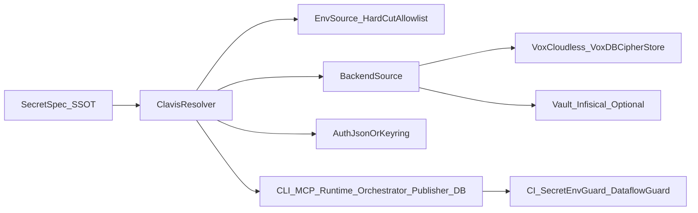
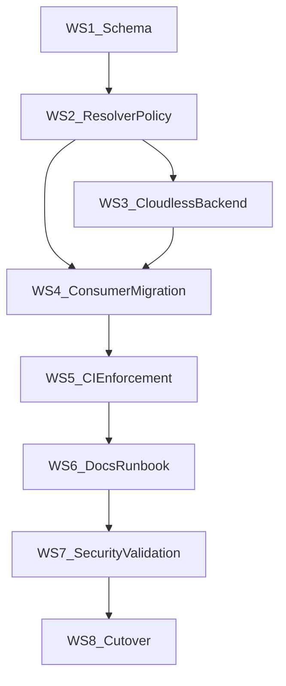

---
status: archived
archived_date: 2026-04-13
training_eligible: false
schema_type: "TechArticle"
title: "Archived Plan: clavis_cloudless_implementation_blueprint_0867ba6f.plan"
---

> [!WARNING]
> **ARCHIVED COMPONENT**: This file was archived on 2026-04-13. It is intentionally excluded from active AI context. It must not be referenced for contemporary development.

# Clavis Cloudless Implementation Blueprint (High-Specificity)

## Objective

Implement a **Cloudless-first, account-scoped secret control plane** where Clavis remains SSOT for secret identity/policy and VoxDB becomes the durable encrypted store for account-level secrets, while aggressively removing legacy direct-env secret paths under a controlled hard-cut boundary.

This blueprint is optimized for execution by a weaker model: every phase has explicit files, sequence, acceptance checks, and anti-foot-gun constraints.

## Proven code constraints (must treat as hard facts)

- Resolver precedence is currently env-first in [`c:/Users/Owner/vox/crates/vox-clavis/src/resolver.rs`](c:/Users/Owner/vox/crates/vox-clavis/src/resolver.rs).
- Backend auto mode is env-signaled in [`c:/Users/Owner/vox/crates/vox-clavis/src/lib.rs`](c:/Users/Owner/vox/crates/vox-clavis/src/lib.rs).
- Secret schema and policy inventory is centralized in [`c:/Users/Owner/vox/crates/vox-clavis/src/lib.rs`](c:/Users/Owner/vox/crates/vox-clavis/src/lib.rs).
- DB credential resolution still contains compatibility aliases in [`c:/Users/Owner/vox/crates/vox-db/src/config.rs`](c:/Users/Owner/vox/crates/vox-db/src/config.rs).
- MCP gateway bearer tokens are direct env reads in [`c:/Users/Owner/vox/crates/vox-orchestrator/src/mcp_tools/http_gateway.rs`](c:/Users/Owner/vox/crates/vox-orchestrator/src/mcp_tools/http_gateway.rs).
- Runtime model registry supports arbitrary `api_key_env` direct reads in [`c:/Users/Owner/vox/crates/vox-runtime/src/llm/types.rs`](c:/Users/Owner/vox/crates/vox-runtime/src/llm/types.rs).
- Publisher OpenReview readiness mixes env token and Clavis email/password in [`c:/Users/Owner/vox/crates/vox-publisher/src/publication_preflight.rs`](c:/Users/Owner/vox/crates/vox-publisher/src/publication_preflight.rs).
- Orchestrator social credentials are direct env reads in [`c:/Users/Owner/vox/crates/vox-orchestrator/src/config/impl_env.rs`](c:/Users/Owner/vox/crates/vox-orchestrator/src/config/impl_env.rs).
- Existing CI enforcement entrypoint is [`c:/Users/Owner/vox/crates/vox-cli/src/commands/ci/run_body_helpers/guards.rs`](c:/Users/Owner/vox/crates/vox-cli/src/commands/ci/run_body_helpers/guards.rs).

## Target architecture

## Decision policy (non-negotiable)

- **Greenfield hard-cut is permitted.**
- Legacy compatibility behavior is removed by explicit boundary, not by gradual deprecation.
- Migration scaffolding is only allowed where required to preserve system integrity during one release boundary.
- New direct secret env reads are blocked outside sanctioned Clavis source modules.

## Workstreams and detailed task graph

## WS0 - Program control and execution safety

1. Define implementation charter update in [`c:/Users/Owner/vox/docs/src/architecture/clavis-secrets-env-research-2026.md`](c:/Users/Owner/vox/docs/src/architecture/clavis-secrets-env-research-2026.md) that states hard-cut policy and out-of-scope items.
2. Add explicit success criteria section to [`c:/Users/Owner/vox/.cursor/plans/clavis_implementation_plan_seed_2026-04-06.plan.md`](c:/Users/Owner/vox/.cursor/plans/clavis_implementation_plan_seed_2026-04-06.plan.md).
3. Define release-boundary naming (`ClavisCloudlessCutoverV1`) and reference in docs and CI messages.
4. Add dependency order notes so weaker agents do not begin service migrations before schema/resolver tasks complete.

Acceptance:

- One authoritative cutover identifier appears in docs and CI diagnostics.
- Execution order is explicit and machine-followable.

## WS1 - Secret schema normalization (Clavis SSOT expansion)

5. Audit all `SecretId` entries in [`c:/Users/Owner/vox/crates/vox-clavis/src/lib.rs`](c:/Users/Owner/vox/crates/vox-clavis/src/lib.rs) into classes: `runtime`, `operator`, `account`, `integration`, `transport`.
6. Add classification metadata field(s) to `SecretSpec` (for example `class`, `scope`, `rotation_class`) with strict enum typing.
7. Add explicit `secret_material_kind` (api_key, oauth_refresh, bearer, hmac_secret, endpoint_url, username, password).
8. Mark secrets eligible for account-level persistence (`persistable_account_secret: bool`).
9. Mark secrets prohibited from account sync (`device_local_only: bool`) for sensitive local machine credentials.
10. Add per-secret minimum source policy (`allowed_sources`), enabling hard denial for env-only on selected secrets.
11. Add source policy docs in [`c:/Users/Owner/vox/docs/src/reference/clavis-ssot.md`](c:/Users/Owner/vox/docs/src/reference/clavis-ssot.md).
12. Add `spec.rs` tests ensuring every `SecretId` has fully populated metadata.
13. Add compile-time or test-time completeness checks for new fields.

Acceptance:

- `SecretSpec` metadata is complete for all IDs.
- Tests fail when new secrets omit class/scope/source policy.

## WS2 - Resolver policy model and hard-cut behavior

14. Introduce policy profiles in resolver options (for example `DevLenient`, `ProdStrict`, `HardCutStrict`) in [`c:/Users/Owner/vox/crates/vox-clavis/src/resolver.rs`](c:/Users/Owner/vox/crates/vox-clavis/src/resolver.rs).
15. Implement source-order matrix by profile; keep deterministic behavior.
16. Add hard-cut mode that refuses deprecated aliases and disallowed source classes.
17. Add explicit typed rejection reason in `ResolutionStatus` (for example `RejectedBySourcePolicy`, `RejectedLegacyAlias`).
18. Extend `ResolvedSecret.detail` usage with machine-parsable policy rejection text.
19. Add resolver tracing hooks that never emit secret value, only metadata (id/source/status).
20. Update `resolve_secret` backend auto behavior in [`c:/Users/Owner/vox/crates/vox-clavis/src/lib.rs`](c:/Users/Owner/vox/crates/vox-clavis/src/lib.rs) to support hard-cut override env for deterministic CI.
21. Add unit tests covering all profile x source permutations.
22. Add regression tests for empty env value handling (`InvalidEmpty`) and policy rejections.

Acceptance:

- Hard-cut mode prevents legacy/forbidden reads even when env vars are present.
- No resolver logs contain secret material.

## WS3 - Vox Cloudless backend (VoxDB encrypted account store)

23. Define account secret record model in VoxDB crate(s): `account_id`, `secret_id`, `ciphertext`, `version`, `key_ref`, `updated_at`, `rotation_due_at`, `source_audit`.
24. Implement envelope encryption contract: DEK per secret record encrypted by account KEK reference.
25. Define KEK custody model (local keyring bootstrap + optional operator-supplied master reference).
26. Implement backend adapter in Clavis backend module (new `vox_cloudless` backend or evolve `vox_vault`).
27. Add write/read/update/delete APIs with optimistic version checks.
28. Add rotation metadata update path decoupled from ciphertext update.
29. Implement safe failure semantics: backend unavailable yields typed status, never plaintext fallback in strict profiles.
30. Add load/perf benchmarks for lookup latency and contention using existing benchmark infrastructure where applicable.
31. Add integration tests for local-only mode and remote VoxDB mode.
32. Add corruption-handling tests (invalid ciphertext, wrong key ref, stale key ref).

Acceptance:

- End-to-end read/write for persistable account secrets passes.
- Backend errors are explicit and non-leaky.

## WS4 - Consumer migration (eliminate direct secret env reads)

33. Migrate MCP HTTP bearer/read bearer token loading from direct env in [`c:/Users/Owner/vox/crates/vox-orchestrator/src/mcp_tools/http_gateway.rs`](c:/Users/Owner/vox/crates/vox-orchestrator/src/mcp_tools/http_gateway.rs) to Clavis IDs.
34. Add new `SecretId` entries for MCP gateway tokens if absent, with canonical env names and policy.
35. Migrate runtime `api_key_env` behavior in [`c:/Users/Owner/vox/crates/vox-runtime/src/llm/types.rs`](c:/Users/Owner/vox/crates/vox-runtime/src/llm/types.rs) to Clavis-first registry resolution (retain non-secret endpoint config envs).
36. Migrate publisher OpenReview access-token env path in [`c:/Users/Owner/vox/crates/vox-publisher/src/publication_preflight.rs`](c:/Users/Owner/vox/crates/vox-publisher/src/publication_preflight.rs) to Clavis `SecretId`.
37. Migrate orchestrator social credential env reads in [`c:/Users/Owner/vox/crates/vox-orchestrator/src/config/impl_env.rs`](c:/Users/Owner/vox/crates/vox-orchestrator/src/config/impl_env.rs) to Clavis resolution.
38. Migrate DB credential compatibility reads in [`c:/Users/Owner/vox/crates/vox-db/src/config.rs`](c:/Users/Owner/vox/crates/vox-db/src/config.rs) to hard-cut policy path (or strict toggle).
39. Ensure consumer code only receives redacted status/boolean readiness when possible.
40. Add per-consumer tests to prove behavior in strict profile.

Acceptance:

- All high-risk direct secret env reads removed from these target files.
- Feature behavior preserved except intentional hard-cut breaks.

## WS5 - CI and static policy enforcement expansion

41. Extend `secret-env-guard` in [`c:/Users/Owner/vox/crates/vox-cli/src/commands/ci/run_body_helpers/guards.rs`](c:/Users/Owner/vox/crates/vox-cli/src/commands/ci/run_body_helpers/guards.rs) with hard-cut mode and stricter allowlist policy.
42. Add guard for secret serialization anti-patterns (for example `Debug`/`serde` paths on `ResolvedSecret` payload objects exposed externally).
43. Add guard for model-context secret leakage patterns in MCP/runtime serializer boundaries.
44. Add guard for new secret IDs missing `clavis-ssot` documentation.
45. Add CI command docs update in [`c:/Users/Owner/vox/docs/src/ci/command-compliance-ssot.md`](c:/Users/Owner/vox/docs/src/ci/command-compliance-ssot.md).
46. Add dry-run mode output for developer ergonomics (clear offender path list).
47. Add test fixtures proving the guard catches known bypass patterns.

Acceptance:

- CI fails on new direct secret env reads outside sanctioned modules.
- CI fails on detectable secret dataflow leaks in guarded boundaries.

## WS6 - Documentation and operator ergonomics

48. Update [`c:/Users/Owner/vox/docs/src/reference/clavis-ssot.md`](c:/Users/Owner/vox/docs/src/reference/clavis-ssot.md) with hard-cut policy table and source-policy semantics.
49. Update [`c:/Users/Owner/vox/docs/src/reference/env-vars.md`](c:/Users/Owner/vox/docs/src/reference/env-vars.md) to reflect removed compatibility envs under hard-cut profile.
50. Add Cloudless operator runbook in architecture docs explaining key custody, backup, restore, rotate.
51. Add troubleshooting section for strict-mode failures and source-policy rejections.
52. Add security disclosure notes: what metadata can appear in logs and what cannot.
53. Add explicit examples for `vox clavis doctor` failure messages under hard-cut.

Acceptance:

- Docs match runtime behavior and CI parity checks pass.
- Operators can execute runbook without reading source.

## WS7 - Security and reliability validation

54. Add integration tests verifying no secret value appears in logs/traces during failure and success paths.
55. Add fuzz/property tests around resolver input combinations (empty, malformed, conflicting sources).
56. Add chaos tests for backend unavailability and stale key references.
57. Add replay/revocation validation for token classes with rotation metadata.
58. Add penetration-test checklist for prompt/tool-output exfil vectors.
59. Add performance tests for resolver latency under concurrent loads.
60. Add memory hygiene verification for secret wrappers and temporary plaintext lifetimes.

Acceptance:

- Test suite demonstrates fail-closed behavior and no-value-leak guarantees.
- Performance baseline remains acceptable vs current resolver behavior.

## WS8 - Release choreography and cutover

61. Add cutover feature flags: `clavis_hard_cut`, `clavis_cloudless_backend`, `clavis_consumer_strict`.
62. Implement staged enablement matrix by environment (dev/ci/prod).
63. Add one-way cutover checklist and go/no-go criteria.
64. Add rollback policy limited to backend availability, not legacy secret source reintroduction (unless emergency flag explicitly set).
65. Add release notes template with explicit breaking changes list.
66. Add post-cutover audit query/report for unresolved secret source-policy violations.
67. Add sunset task deleting emergency compatibility toggles after defined window.

Acceptance:

- Cutover can be executed with deterministic gates.
- Breaking changes are intentional, documented, and test-enforced.

## Dependency order (strict)

Rules:

- Do not start WS4 before WS2 strict policy primitives exist.
- Do not enable cutover flags before WS5 and WS7 are complete.

## Explicit non-goals

- No attempt to keep all legacy aliases functioning indefinitely.
- No broad silent fallback to plaintext env reads in strict profiles.
- No storing plaintext secrets in VoxDB rows.

## Implementation verification checklist

- All changed secret callsites have tests.
- `secret-env-guard` and `clavis-parity` remain green.
- New CI guards pass on repository baseline and fail on seeded negative fixtures.
- Docs, contracts, and command help are synchronized.
- Final cutover rehearsal succeeds in CI profile before production enablement.
