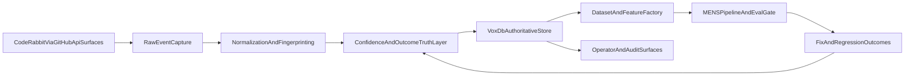
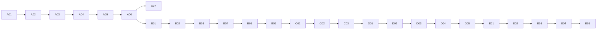

---
status: archived
archived_date: 2026-04-13
training_eligible: false
schema_type: "TechArticle"
title: "Archived Plan: coderabbit-voxdb-mens-e2e_9897eaec.plan"
---

> [!WARNING]
> **ARCHIVED COMPONENT**: This file was archived on 2026-04-13. It is intentionally excluded from active AI context. It must not be referenced for contemporary development.

# Full implementation plan rewrite: CodeRabbit intelligence -> VoxDB -> MENS prevention loop

## Why this rewrite is stricter than the previous plan

- The prior plan was broad but under-specified in the highest-risk area: full ingest semantics across all CodeRabbit review placements and future-proof correctness handling.
- This rewrite makes ingestion semantics explicit, separates signal capture from model trust, and introduces lineage-backed quality controls so “possibly wrong but useful” findings improve MENS instead of degrading it.
- The plan is restructured as an implementation graph with hard acceptance criteria per phase.

## Target architecture and constraints

Core constraints:

- Fully automatic loop remains enabled by default.
- VoxDB is authoritative. `.coderabbit/*.json` become optional mirrors and recovery artifacts.
- No review signal is discarded, including low-confidence or incorrect findings. Instead, uncertain findings are labeled and controlled via training weights and eval policies.
- Maintain compatibility with existing command surfaces in [crates/vox-cli/src/commands/review/coderabbit/mod.rs](crates/vox-cli/src/commands/review/coderabbit/mod.rs) and [docs/src/reference/cli.md](docs/src/reference/cli.md).

## Critical ingest semantics (authoritative contract)

CodeRabbit signals arrive in different GitHub surfaces and must all be ingested:

- Inline review comments (file/line anchored, including outdated anchors).
- Review summaries (PR review body/status-level commentary).
- Issue comments (`@coderabbitai` interactions and follow-up reasoning).
- Reply chains and resolved/unresolved state transitions.
- Meta-signals: severity/category, suggested patch blocks, confidence/hedging language, and command-trigger context (`review` vs `full review`).

Canonical ingest principles:

- Capture raw payload first, normalize second.
- Preserve original identity fields for replay.
- Separate unique finding identity from mutable lifecycle state.
- Track whether a finding was later contradicted or superseded.

## Phased implementation with hard acceptance gates

### Phase 0 (0% -> 8%): Authority, scope, and migration baseline

Tasks:

1. Define authoritative dataflow and ownership in:
   - [docs/src/architecture/coderabbit-review-coverage-ssot.md](docs/src/architecture/coderabbit-review-coverage-ssot.md)
   - [docs/src/reference/cli.md](docs/src/reference/cli.md)
2. Freeze current behavior map from:
   - [crates/vox-cli/src/commands/review/coderabbit/ingest.rs](crates/vox-cli/src/commands/review/coderabbit/ingest.rs)
   - [crates/vox-cli/src/commands/review/coderabbit/tasks.rs](crates/vox-cli/src/commands/review/coderabbit/tasks.rs)
   - [crates/vox-cli/src/commands/review/coderabbit/run_state.rs](crates/vox-cli/src/commands/review/coderabbit/run_state.rs)
3. Define rollout and rollback toggles (feature flags + CLI switches).

Exit criteria:

- Single authoritative spec for what is persisted, where, and why.
- Operators can identify old vs new persistence path without ambiguity.

### Phase 1 (8% -> 22%): Exhaustive ingest contract and normalization model

Tasks:

1. Define normalized schema version contract in [crates/vox-cli/src/commands/review/coderabbit/ingest.rs](crates/vox-cli/src/commands/review/coderabbit/ingest.rs):
   - `finding_identity`
   - `placement_kind` (`inline`, `review_summary`, `issue_comment`, `reply`)
   - `thread_identity`
   - `line_anchor_state` (`current`, `outdated`, `missing`)
   - `extraction_confidence`
   - `source_payload_hash`
2. Introduce parsing strategy matrix:
   - structured extraction from known markers
   - fallback text extraction for malformed/changed formats
   - hard-fail to dead-letter only on non-recoverable parse errors
3. Add parser diagnostics policy:
   - debug logs for raw payload slices and extraction outcomes
   - low-noise periodic ingest progress logs (no progress bars)

Exit criteria:

- All CodeRabbit placement types are represented in normalized output.
- Unknown format changes degrade gracefully instead of losing data.

### Phase 2 (22% -> 40%): VoxDB domain and typed operations

Tasks:

1. Add new domain in [crates/vox-db/src/schema/domains/](crates/vox-db/src/schema/domains/) and register via:
   - [crates/vox-db/src/schema/domains/mod.rs](crates/vox-db/src/schema/domains/mod.rs)
   - [crates/vox-db/src/schema/manifest.rs](crates/vox-db/src/schema/manifest.rs)
2. Add tables:
   - `external_review_run`
   - `external_review_finding`
   - `external_review_finding_state_history`
   - `external_review_comment_thread`
   - `external_review_outcome`
   - `external_review_deadletter`
3. Add `impl VoxDb` ops in new store module under [crates/vox-db/src/store/](crates/vox-db/src/store/):
   - insert/upsert/query by run, PR, fingerprint, category, confidence, status
   - lineage query across finding -> task -> fix -> eval outcome
4. Add row/param types in:
   - [crates/vox-db/src/store/types/rows_extended.rs](crates/vox-db/src/store/types/rows_extended.rs)
   - [crates/vox-db/src/store/types/params.rs](crates/vox-db/src/store/types/params.rs)

Exit criteria:

- Full replay capability from raw payload to normalized state.
- Idempotent ingest and state transitions are enforceable at DB constraint level.

### Phase 3 (40% -> 56%): Ingest engine rewrite and migration

Tasks:

1. Refactor [crates/vox-cli/src/commands/review/coderabbit/ingest.rs](crates/vox-cli/src/commands/review/coderabbit/ingest.rs) to:
   - write VoxDB first
   - optionally mirror local JSON cache
   - support replay windows and idempotency key
2. Add backfill command under [crates/vox-cli/src/commands/review/coderabbit/mod.rs](crates/vox-cli/src/commands/review/coderabbit/mod.rs) for historical `.coderabbit/ingested_findings.json`.
3. Attach semantic run lineage from:
   - [crates/vox-cli/src/commands/review/coderabbit/semantic_planner/submit.rs](crates/vox-cli/src/commands/review/coderabbit/semantic_planner/submit.rs)
   - [crates/vox-cli/src/commands/review/coderabbit/run_state.rs](crates/vox-cli/src/commands/review/coderabbit/run_state.rs)
4. Add ingest health checks and dead-letter retry command.

Exit criteria:

- Existing ingest use-cases continue to work with new defaults.
- Historical and new signals coexist without duplicates.

### Phase 4 (56% -> 68%): Truth model for “helpful but possibly wrong”

Tasks:

1. Add correctness states at finding level:
   - `unverified`
   - `confirmed_true`
   - `likely_true`
   - `likely_false`
   - `confirmed_false`
2. Derive truth updates from:
   - merged code changes that reference finding/thread
   - follow-up comments contradicting original finding
   - regression tests/eval outcomes
3. Define training weights:
   - higher weight for confirmed true findings
   - reduced but non-zero weight for unverified/likely false findings
4. Persist provenance for every training example:
   - source finding IDs
   - confidence history
   - transformation version

Exit criteria:

- The loop remains fully automatic while reducing misinformation risk.
- Every training row is auditable back to original review context.

### Phase 5 (68% -> 80%): Dataset and feature factory

Tasks:

1. Add exporter module in [crates/vox-corpus/src/](crates/vox-corpus/src/) modeled after [crates/vox-corpus/src/arca_replay.rs](crates/vox-corpus/src/arca_replay.rs):
   - `review_fix_pairs`
   - `review_antipattern_memory`
   - `review_regression_challenges`
2. Add corpus actions in [crates/vox-cli/src/commands/corpus/mod.rs](crates/vox-cli/src/commands/corpus/mod.rs):
   - `review-export`
   - `review-validate`
   - `review-stats`
3. Align contracts with:
   - [crates/vox-corpus/src/training/preflight.rs](crates/vox-corpus/src/training/preflight.rs)
   - [mens/config/training_contract.yaml](mens/config/training_contract.yaml)
   - [mens/config/mix.yaml](mens/config/mix.yaml)
4. Add deterministic dataset versioning and snapshot manifest.

Exit criteria:

- Review-derived datasets are reproducible, versioned, and auditable.
- Invalid or low-integrity datasets are blocked pre-training.

### Phase 6 (80% -> 90%): MENS integration and regression prevention

Tasks:

1. Add pipeline stages in [crates/vox-cli/src/commands/mens/pipeline.rs](crates/vox-cli/src/commands/mens/pipeline.rs):
   - `ReviewIngest`
   - `ReviewDatasetBuild`
   - `ReviewEvalPackBuild`
2. Integrate stage plumbing in [crates/vox-cli/src/commands/mens/populi/action_prelude.rs](crates/vox-cli/src/commands/mens/populi/action_prelude.rs).
3. Extend eval-gates in:
   - [MENS/config/eval-gates.yaml](MENS/config/eval-gates.yaml)
   - [crates/vox-cli/src/commands/mens/eval_gate/mod.rs](crates/vox-cli/src/commands/mens/eval_gate/mod.rs)
4. Add anti-repeat metrics:
   - repeated category rate
   - repeated file-pattern rate
   - post-train recurrence delta

Exit criteria:

- MENS training/eval consumes review intelligence every cycle automatically.
- Gate failures stop promotion when recurrence worsens.

### Phase 7 (90% -> 96%): Operator surfaces, reporting, and maintainability

Tasks:

1. Add/extend `vox review coderabbit` commands:
   - `db-status`
   - `db-backfill`
   - `db-report`
   - `learning-sync`
   - `deadletter-retry`
2. Provide one KPI export command with trend windows.
3. Update runbooks and SSOT docs:
   - [docs/src/architecture/coderabbit-review-coverage-ssot.md](docs/src/architecture/coderabbit-review-coverage-ssot.md)
   - [docs/src/reference/cli.md](docs/src/reference/cli.md)
   - [docs/src/architecture/architecture-index.md](docs/src/architecture/architecture-index.md)

Exit criteria:

- New operators can run, debug, and audit the loop without code spelunking.
- Command/doc parity checks pass.

### Phase 8 (96% -> 100%): Validation, rollout, and deprecation

Tasks:

1. Testing:
   - unit: normalization, identity, parser resilience, truth-state transitions
   - integration: ingest -> VoxDB -> exporter -> mix -> train input
   - regression: recurrence reduction across synthetic and historical windows
   - migration: cache backfill, replay idempotency, rollback switch safety
2. Rollout:
   - Stage A: dual-write dark launch
   - Stage B: VoxDB-first default with cache optional
   - Stage C: full automatic MENS loop enabled
   - Stage D: deprecate file-first operational docs and flags
3. Post-rollout hardening:
   - retention policy integration with [crates/vox-db/src/store/ops_retention.rs](crates/vox-db/src/store/ops_retention.rs)
   - dead-letter SLOs
   - ingestion drift alerts when external format changes

Exit criteria:

- VoxDB-first review intelligence is stable and auditable.
- MENS recurrence metrics improve for targeted error classes over at least one full evaluation window.
- Legacy file-first persistence is no longer required for normal operation.

## Maintainability design rules (applies to all phases)

- Version every normalization and dataset transform.
- Never overwrite raw source payloads; append state history.
- Keep parse logic modular by placement kind to survive API shape changes.
- Prefer additive schema migrations; avoid destructive changes in active rollout.
- Ensure all new commands include machine-readable output mode for automation.

## Final acceptance checklist

- Exhaustive ingest coverage: inline, review summary, issue comments, replies, and state transitions.
- Proven lineage: finding -> task -> fix -> eval outcome -> training example.
- Controlled learning from uncertainty: wrong findings do not vanish, but are down-weighted and labeled.
- Automatic loop reliability: idempotent replay, dead-letter recovery, and deterministic dataset generation.
- Operator confidence: one command path to inspect health, quality, and regression trend.

## Atomic execution cards (for weaker model execution)

Use cards in order. Do not start a card until dependencies are complete. Each card is intentionally narrow and file-scoped.

### Card format contract

- **Goal:** one concrete outcome.
- **Edit files:** exact paths allowed for this card.
- **Do:** explicit steps only.
- **Done when:** measurable completion checks.
- **Depends on:** prerequisite card IDs.

### Wave A — Ingest contract and schema backbone

#### Card A01 — Freeze ingest contract document

- **Goal:** Lock authoritative ingest contract and placement taxonomy before code changes.
- **Edit files:** [docs/src/architecture/coderabbit-review-coverage-ssot.md](docs/src/architecture/coderabbit-review-coverage-ssot.md)
- **Do:**
  - Add canonical placement kinds and definitions.
  - Add identity/fingerprint contract and versioning policy.
  - Add drift policy for API format changes.
- **Done when:**
  - Placement kinds include `inline`, `review_summary`, `issue_comment`, `reply`.
  - Contract includes `source_payload_hash`, `finding_identity`, `thread_identity`.
- **Depends on:** none

#### Card A02 — CLI contract alignment text

- **Goal:** Prevent operator ambiguity during migration.
- **Edit files:** [docs/src/reference/cli.md](docs/src/reference/cli.md)
- **Do:**
  - Document VoxDB-first default and optional local cache mirror.
  - Add expected outputs for ingest/report commands in machine-readable mode.
- **Done when:** Docs clearly state authoritative store and fallback path.
- **Depends on:** A01

#### Card A03 — New schema domain file scaffold

- **Goal:** Create external review schema fragment with no runtime wiring yet.
- **Edit files:** `crates/vox-db/src/schema/domains/external_review.rs`
- **Do:**
  - Define DDL constants for run, finding, state history, thread, outcome, deadletter tables.
  - Include indexes and uniqueness constraints for idempotency.
- **Done when:** File compiles and exports fragment string.
- **Depends on:** A01

#### Card A04 — Register schema domain

- **Goal:** Make new schema fragment part of baseline manifest ordering.
- **Edit files:** [crates/vox-db/src/schema/domains/mod.rs](crates/vox-db/src/schema/domains/mod.rs), [crates/vox-db/src/schema/manifest.rs](crates/vox-db/src/schema/manifest.rs)
- **Do:**
  - Export `external_review`.
  - Add fragment to `SCHEMA_FRAGMENTS` in stable order.
  - Bump/adjust baseline version if required by project convention.
- **Done when:** `baseline_sql()` includes external review DDL.
- **Depends on:** A03

#### Card A05 — Row and param types

- **Goal:** Add strongly typed rows/params for external review operations.
- **Edit files:** [crates/vox-db/src/store/types/rows_extended.rs](crates/vox-db/src/store/types/rows_extended.rs), [crates/vox-db/src/store/types/params.rs](crates/vox-db/src/store/types/params.rs)
- **Do:**
  - Add structs for run insert, finding upsert, state transition insert, deadletter insert.
  - Include normalization/version fields.
- **Done when:** Types compile and are re-exported where needed.
- **Depends on:** A04

#### Card A06 — Store ops module skeleton

- **Goal:** Create `VoxDb` method stubs and query shapes.
- **Edit files:** `crates/vox-db/src/store/ops_external_review.rs`, [crates/vox-db/src/store/mod.rs](crates/vox-db/src/store/mod.rs)
- **Do:**
  - Add methods for insert/upsert/query/list by repo/pr/fingerprint.
  - Add lineage query method signature.
- **Done when:** Module wired into store and compiles.
- **Depends on:** A05

#### Card A07 — DB migration and ops tests (foundation)

- **Goal:** Prove schema installs and core idempotency constraints hold.
- **Edit files:** `crates/vox-db/tests/ops_external_review_tests.rs`
- **Do:**
  - Test unique finding upsert by fingerprint scope.
  - Test deadletter write/read.
  - Test state history append semantics.
- **Done when:** New tests pass in crate-level test run.
- **Depends on:** A06

### Wave B — Ingest engine rewrite (VoxDB-first)

#### Card B01 — Normalization model upgrade

- **Goal:** Extend normalized finding model to capture all review placements.
- **Edit files:** [crates/vox-cli/src/commands/review/coderabbit/ingest.rs](crates/vox-cli/src/commands/review/coderabbit/ingest.rs)
- **Do:**
  - Add fields for placement kind, anchor state, thread identity, payload hash, extraction confidence.
  - Add explicit schema version constant.
- **Done when:** Existing JSON output still works, with additive fields.
- **Depends on:** A01, A06

#### Card B02 — Fetch all GitHub review surfaces

- **Goal:** Ensure ingest pulls review comments, issue comments, review summaries, and replies.
- **Edit files:** [crates/vox-cli/src/commands/review/coderabbit/ingest.rs](crates/vox-cli/src/commands/review/coderabbit/ingest.rs)
- **Do:**
  - Add separate fetchers per surface.
  - Merge streams with deterministic ordering.
- **Done when:** Surface counts are logged and non-zero on known PR fixtures.
- **Depends on:** B01

#### Card B03 — Parser resilience and fallback extraction

- **Goal:** Avoid data loss on format drift.
- **Edit files:** [crates/vox-cli/src/commands/review/coderabbit/ingest.rs](crates/vox-cli/src/commands/review/coderabbit/ingest.rs)
- **Do:**
  - Implement structured parse first, fallback regex/text parse second.
  - Route hard parse failures to deadletter payload model.
  - Add debug logging of raw payload slices and parse outcomes.
- **Done when:** Malformed sample payloads produce either normalized rows or deadletter rows, never silent drop.
- **Depends on:** B02

#### Card B04 — VoxDB-first write path

- **Goal:** Persist normalized results to VoxDB as primary sink.
- **Edit files:** [crates/vox-cli/src/commands/review/coderabbit/ingest.rs](crates/vox-cli/src/commands/review/coderabbit/ingest.rs)
- **Do:**
  - Replace current file-primary logic with DB-primary transaction flow.
  - Keep optional local cache mirror flag.
- **Done when:** DB writes occur even when cache mirror is disabled.
- **Depends on:** A06, B03

#### Card B05 — Idempotency and replay windows

- **Goal:** Re-ingest same PR/range safely.
- **Edit files:** [crates/vox-cli/src/commands/review/coderabbit/ingest.rs](crates/vox-cli/src/commands/review/coderabbit/ingest.rs), [crates/vox-cli/src/commands/review/coderabbit/mod.rs](crates/vox-cli/src/commands/review/coderabbit/mod.rs)
- **Do:**
  - Add idempotency key option and replay window options.
  - Enforce dedupe by fingerprint + provider scope + source hash.
- **Done when:** Two identical ingests produce zero net duplicates.
- **Depends on:** B04

#### Card B06 — Backfill command from legacy cache

- **Goal:** Migrate `.coderabbit/ingested_findings.json` into VoxDB.
- **Edit files:** [crates/vox-cli/src/commands/review/coderabbit/mod.rs](crates/vox-cli/src/commands/review/coderabbit/mod.rs), [crates/vox-cli/src/commands/review/coderabbit/ingest.rs](crates/vox-cli/src/commands/review/coderabbit/ingest.rs)
- **Do:**
  - Add `db-backfill` command.
  - Record migration run metadata.
- **Done when:** Backfill is replay-safe and reports migrated/skipped counts.
- **Depends on:** B05

### Wave C — Truth and confidence model

#### Card C01 — Correctness state schema + ops

- **Goal:** Track whether findings were true, false, or unresolved over time.
- **Edit files:** `crates/vox-db/src/schema/domains/external_review.rs`, `crates/vox-db/src/store/ops_external_review.rs`
- **Do:**
  - Add correctness state enum contract.
  - Add append-only state transition write op.
- **Done when:** State transitions are queryable by finding ID in time order.
- **Depends on:** A06

#### Card C02 — Outcome ingestion hooks

- **Goal:** Update correctness states from downstream evidence.
- **Edit files:** [crates/vox-cli/src/commands/review/coderabbit/tasks.rs](crates/vox-cli/src/commands/review/coderabbit/tasks.rs), [crates/vox-cli/src/commands/review/coderabbit/ingest.rs](crates/vox-cli/src/commands/review/coderabbit/ingest.rs)
- **Do:**
  - Add hooks for linking findings to task/fix outcomes.
  - Add contradiction/superseded transitions.
- **Done when:** A finding can be promoted/demoted by new evidence.
- **Depends on:** C01, B06

#### Card C03 — Training weight policy artifact

- **Goal:** Encode automatic weighting for uncertain vs validated findings.
- **Edit files:** [MENS/config/eval-gates.yaml](MENS/config/eval-gates.yaml), `mens/config/review-weight-policy.yaml` (new)
- **Do:**
  - Define default weight multipliers by correctness state.
  - Define hard exclusions for clearly invalid payloads only.
- **Done when:** Policy file is parsed and referenced by exporter flow.
- **Depends on:** C02

### Wave D — Dataset factory and MENS integration

#### Card D01 — Review exporter module scaffold

- **Goal:** Create VoxDB -> JSONL exporter entrypoint for review intelligence.
- **Edit files:** `crates/vox-corpus/src/external_review_replay.rs`, [crates/vox-corpus/src/lib.rs](crates/vox-corpus/src/lib.rs)
- **Do:**
  - Add query-to-row transforms for three datasets.
  - Include provenance columns.
- **Done when:** Exporter compiles and writes deterministic row order.
- **Depends on:** B06, C03

#### Card D02 — Dataset contracts and schema docs

- **Goal:** Lock training/eval dataset shape for maintainability.
- **Edit files:** `docs/src/reference/review-fix-pairs-contract.md`, `docs/src/reference/review-antipattern-catalog-contract.md`, `docs/src/reference/review-regression-challenges-contract.md`
- **Do:**
  - Document required fields, optional fields, and versioning strategy.
  - Include compatibility notes with training preflight.
- **Done when:** Contracts match exporter fields exactly.
- **Depends on:** D01

#### Card D03 — Corpus CLI commands

- **Goal:** Expose review dataset flows through CLI.
- **Edit files:** [crates/vox-cli/src/commands/corpus/mod.rs](crates/vox-cli/src/commands/corpus/mod.rs), [crates/vox-cli/src/commands/corpus/stats.rs](crates/vox-cli/src/commands/corpus/stats.rs)
- **Do:**
  - Add `review-export`, `review-validate`, `review-stats`.
  - Emit machine-readable JSON output for automation.
- **Done when:** Commands appear in CLI surface and execute against fixture DB.
- **Depends on:** D01

#### Card D04 — Mix and training preflight integration

- **Goal:** Feed review datasets into existing train path safely.
- **Edit files:** [mens/config/mix.yaml](mens/config/mix.yaml), [crates/vox-corpus/src/training/preflight.rs](crates/vox-corpus/src/training/preflight.rs), [crates/vox-corpus/src/training/mix_prepare.rs](crates/vox-corpus/src/training/mix_prepare.rs)
- **Do:**
  - Register review sources in mix config.
  - Ensure preflight validates review dataset contracts.
- **Done when:** `train_path` resolves with review rows included when enabled.
- **Depends on:** D03

#### Card D05 — MENS pipeline stage wiring

- **Goal:** Run review ingest/export as first-class pipeline stages.
- **Edit files:** [crates/vox-cli/src/commands/mens/pipeline.rs](crates/vox-cli/src/commands/mens/pipeline.rs), [crates/vox-cli/src/commands/mens/populi/action_prelude.rs](crates/vox-cli/src/commands/mens/populi/action_prelude.rs)
- **Do:**
  - Add stages `ReviewIngest`, `ReviewDatasetBuild`, `ReviewEvalPackBuild`.
  - Add stage telemetry/progress updates.
- **Done when:** Pipeline can run end-to-end without manual step insertion.
- **Depends on:** D04

### Wave E — Regression prevention, operator surfaces, rollout

#### Card E01 — Anti-repeat metrics and eval gates

- **Goal:** Block promotion when repeated error classes regress.
- **Edit files:** [MENS/config/eval-gates.yaml](MENS/config/eval-gates.yaml), [crates/vox-cli/src/commands/mens/eval_gate/mod.rs](crates/vox-cli/src/commands/mens/eval_gate/mod.rs)
- **Do:**
  - Add recurrence delta metrics and thresholds.
  - Add failure messages tied to category/file-pattern trend.
- **Done when:** Eval gate can fail based on review-derived recurrence.
- **Depends on:** D05

#### Card E02 — DB-backed review reporting commands

- **Goal:** Provide operational observability without ad hoc SQL.
- **Edit files:** [crates/vox-cli/src/commands/review/coderabbit/mod.rs](crates/vox-cli/src/commands/review/coderabbit/mod.rs), `crates/vox-cli/src/commands/review/coderabbit/report.rs` (new)
- **Do:**
  - Add `db-status`, `db-report`, `deadletter-retry`, `learning-sync`.
  - Add JSON mode output for each.
- **Done when:** Commands show run health, deadletter counts, recurrence trend.
- **Depends on:** E01

#### Card E03 — Retention and deadletter operations

- **Goal:** Keep store sustainable and recoverable.
- **Edit files:** [crates/vox-db/src/store/ops_retention.rs](crates/vox-db/src/store/ops_retention.rs), `crates/vox-db/src/store/ops_external_review.rs`
- **Do:**
  - Add retention classes and purge methods for external review tables.
  - Add deadletter retry state transitions.
- **Done when:** Retention job can prune old raw payloads per policy without breaking lineage.
- **Depends on:** E02

#### Card E04 — Docs and SSOT parity

- **Goal:** Ensure code and docs stay synchronized for future maintenance.
- **Edit files:** [docs/src/architecture/coderabbit-review-coverage-ssot.md](docs/src/architecture/coderabbit-review-coverage-ssot.md), [docs/src/reference/cli.md](docs/src/reference/cli.md), [docs/src/architecture/architecture-index.md](docs/src/architecture/architecture-index.md)
- **Do:**
  - Update runbook commands and dataflow diagrams.
  - Add failure troubleshooting matrix (ingest drift, idempotency, deadletter).
- **Done when:** Documentation reflects all new command surfaces and persistence semantics.
- **Depends on:** E03

#### Card E05 — End-to-end validation matrix

- **Goal:** Verify safety and effectiveness before defaulting to VoxDB-first only.
- **Edit files:** `crates/vox-cli/tests/coderabbit_e2e.rs` (new), `crates/vox-db/tests/ops_external_review_tests.rs`, `docs/src/architecture/coderabbit-review-coverage-ssot.md`
- **Do:**
  - Add test matrix for ingest/replay/backfill/deadletter/training feed/eval gate.
  - Add rollout checklist with pass/fail evidence fields.
- **Done when:** Matrix passes and rollout checklist is complete.
- **Depends on:** E04

## Dependency summary

## Progress scoring rubric

- **0-20%:** Wave A complete
- **21-45%:** Wave B complete
- **46-60%:** Wave C complete
- **61-82%:** Wave D complete
- **83-100%:** Wave E complete

