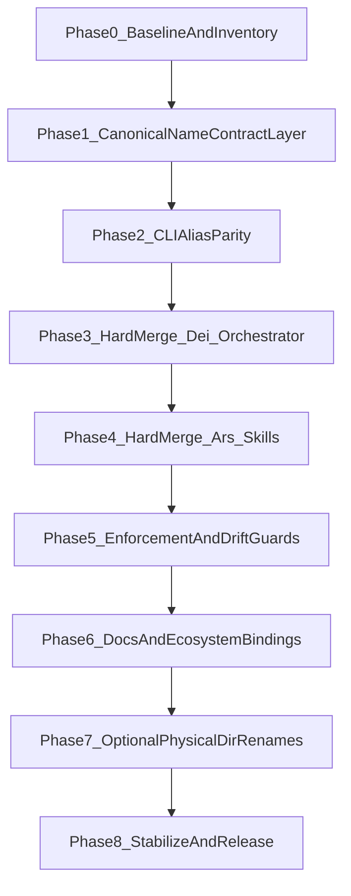

---
status: archived
archived_date: 2026-04-13
training_eligible: false
schema_type: "TechArticle"
title: "Archived Plan: english_core_latin_alias_refactor_49ae44c3.plan"
---

> [!WARNING]
> **ARCHIVED COMPONENT**: This file was archived on 2026-04-13. It is intentionally excluded from active AI context. It must not be referenced for contemporary development.

# Vox English-Core + Latin Alias Refactor (Phased, Safe, Explicit)

## Locked Decisions

- Structural strategy: **staged safety-first** (keep existing `crates/vox-`* directories initially).
- Duplicate concept policy: **hard-merge now** with strict removals after compatibility gates pass.
- English becomes canonical in contracts/docs/CLI semantics; Latin remains first-class alias layer.

## Architecture Baseline (what exists now)

- Workspace membership and internal dependency anchors live in `[Cargo.toml](Cargo.toml)`.
- CLI command parse + dispatch roots live in `[crates/vox-cli/src/lib.rs](crates/vox-cli/src/lib.rs)` and `[crates/vox-cli/src/cli_dispatch/mod.rs](crates/vox-cli/src/cli_dispatch/mod.rs)`.
- Latin lane command types live in `[crates/vox-cli/src/latin_cmd.rs](crates/vox-cli/src/latin_cmd.rs)`.
- Command compliance gate lives in `[crates/vox-cli/src/commands/ci/command_compliance/mod.rs](crates/vox-cli/src/commands/ci/command_compliance/mod.rs)` and validators in `[crates/vox-cli/src/commands/ci/command_compliance/validators.rs](crates/vox-cli/src/commands/ci/command_compliance/validators.rs)`.
- Operations catalog and projection checks live in `[crates/vox-cli/src/commands/ci/operations_catalog.rs](crates/vox-cli/src/commands/ci/operations_catalog.rs)`.
- Command contracts are in `[contracts/operations/catalog.v1.yaml](contracts/operations/catalog.v1.yaml)`, `[contracts/cli/command-registry.yaml](contracts/cli/command-registry.yaml)`, `[contracts/mcp/tool-registry.canonical.yaml](contracts/mcp/tool-registry.canonical.yaml)`, and `[contracts/capability/capability-registry.yaml](contracts/capability/capability-registry.yaml)`.
- Current nomenclature policy anchor is `[docs/src/architecture/nomenclature-migration-map.md](docs/src/architecture/nomenclature-migration-map.md)`.

## Safety Strategy (anti-decay / anti-skeleton)

- Every structural rename concept is represented in all SSOT layers before any code deletion.
- Every merge has a temporary forwarding bridge + parity tests + CI enforcement before cutoff.
- Every phase has explicit go/no-go checks and rollback points.
- No crate removal occurs until dependency graph is clean (`cargo metadata` + no transitive users).
- Add hard CI checks that fail when canonical English command lacks Latin alias metadata, or when new Latin-only structural crates appear.

## Phase 0 - Baseline Lock + Inventory (T001-T024)

- T001: Snapshot workspace members from `[Cargo.toml](Cargo.toml)` into a temporary migration ledger.
- T002: Record current command registry hashes for `[contracts/cli/command-registry.yaml](contracts/cli/command-registry.yaml)`.
- T003: Record current operations catalog hash for `[contracts/operations/catalog.v1.yaml](contracts/operations/catalog.v1.yaml)`.
- T004: Record current capability registry hash for `[contracts/capability/capability-registry.yaml](contracts/capability/capability-registry.yaml)`.
- T005: Run `cargo metadata --locked --no-deps` baseline and archive output.
- T006: Enumerate all crates under `crates/*` and classify canonical concept domain.
- T007: Build explicit mapping table: `orchestrator↔dei`, `skills↔ars`, `forge↔fabrica`, `database↔codex`, `secrets↔clavis`, `speech↔oratio`, `ml↔populi`, `gamification↔ludus`, `tutorial↔schola`, `package_manager↔arca`.
- T008: Inventory all clap-visible aliases from `[crates/vox-cli/src/lib.rs](crates/vox-cli/src/lib.rs)`.
- T009: Inventory nested Latin command structures in `[crates/vox-cli/src/latin_cmd.rs](crates/vox-cli/src/latin_cmd.rs)`.
- T010: Inventory dispatch routes in `[crates/vox-cli/src/cli_dispatch/mod.rs](crates/vox-cli/src/cli_dispatch/mod.rs)`.
- T011: Inventory CI checks currently executed in `[.github/workflows/ci.yml](.github/workflows/ci.yml)`.
- T012: Inventory docs with nomenclature rules in `[docs/src/architecture/nomenclature-migration-map.md](docs/src/architecture/nomenclature-migration-map.md)`.
- T013: Inventory docs that enumerate crate surface in `[docs/src/architecture/orphan-surface-inventory.md](docs/src/architecture/orphan-surface-inventory.md)`.
- T014: Inventory any references to `vox-dei` and `vox-ars` across workspace manifests.
- T015: Inventory APIs exported by `[crates/vox-dei/src/lib.rs](crates/vox-dei/src/lib.rs)`.
- T016: Inventory APIs exported by `[crates/vox-orchestrator/src/lib.rs](crates/vox-orchestrator/src/lib.rs)`.
- T017: Inventory APIs exported by `[crates/vox-ars/src/lib.rs](crates/vox-ars/src/lib.rs)`.
- T018: Inventory APIs exported by `[crates/vox-skills/src/lib.rs](crates/vox-skills/src/lib.rs)`.
- T019: Baseline build timings for `vox-cli`, `vox-orchestrator`, `vox-skills`.
- T020: Baseline test pass set for `vox-cli`, `vox-mcp`, `vox-orchestrator` targeted suites.
- T021: Baseline docs generation for command surface.
- T022: Baseline capability sync verify output.
- T023: Baseline command compliance output.
- T024: Publish migration risk log (single source file in docs architecture section).

## Phase 1 - Canonical English Naming in Contract Layer (T025-T066)

- T025: Extend operations catalog schema to add explicit canonical English concept field (if absent) in `[contracts/operations/catalog.v1.schema.json](contracts/operations/catalog.v1.schema.json)`.
- T026: Add Latin alias list field in operations schema with cardinality constraints (>=1 for governed command families).
- T027: Add grammar policy enum/pattern for Latin aliases (lowercase, 1-3 syllable guidance as metadata).
- T028: Add validation docs in `[docs/src/architecture/operations-catalog-ssot.md](docs/src/architecture/operations-catalog-ssot.md)`.
- T029: Update `[contracts/operations/catalog.v1.yaml](contracts/operations/catalog.v1.yaml)` entries for orchestrator/dei.
- T030: Update catalog entries for skills/ars.
- T031: Update catalog entries for forge/fabrica.
- T032: Update catalog entries for database/codex.
- T033: Update catalog entries for secrets/clavis.
- T034: Update catalog entries for speech/oratio.
- T035: Update catalog entries for ml/populi.
- T036: Update catalog entries for gamification/ludus.
- T037: Update catalog entries for tutorial/schola.
- T038: Update catalog entries for package manager/arca.
- T039: Ensure each catalog operation has canonical English `id` or canonical key.
- T040: Ensure each Latin alias maps to exactly one canonical command (inject uniqueness checks).
- T041: Regenerate CLI projection from operations catalog.
- T042: Regenerate MCP projection from operations catalog.
- T043: Regenerate capability projection from operations catalog.
- T044: Regenerate command registry schema docs if needed.
- T045: Add compliance check: English canonical command must declare at least one Latin alias.
- T046: Add compliance check: Latin alias cannot be canonical structural identifier.
- T047: Add compliance check: no alias collision across CLI/MCP surfaces.
- T048: Add compliance check: no orphan English command without operations catalog entry.
- T049: Add compliance check: no orphan Latin alias without canonical command.
- T050: Add compliance check: no Latin alias references retired commands.
- T051: Add negative fixtures for collisions.
- T052: Add negative fixtures for missing alias.
- T053: Add negative fixtures for invalid alias grammar tags.
- T054: Add positive fixture for interchangeable invocation parity metadata.
- T055: Update docs in `[docs/src/reference/command-compliance.md](docs/src/reference/command-compliance.md)`.
- T056: Update docs in `[docs/src/reference/cli.md](docs/src/reference/cli.md)`.
- T057: Update docs in `[docs/src/reference/cli-command-surface.generated.md](docs/src/reference/cli-command-surface.generated.md)` via generator, not manual edits.
- T058: Add migration note in `[CHANGELOG.md](CHANGELOG.md)` for nomenclature policy v1.
- T059: Add policy cross-link in `[AGENTS.md](AGENTS.md)`.
- T060: Add policy cross-link in `[docs/src/contributors/documentation-governance.md](docs/src/contributors/documentation-governance.md)`.
- T061: Add CI reminder in `[.cursor/rules/cli-command-registry.mdc](.cursor/rules/cli-command-registry.mdc)`.
- T062: Ensure `command-sync` verify reflects alias metadata presence.
- T063: Ensure `operations-verify` fails on alias parity drift.
- T064: Ensure contracts index references any new schema files.
- T065: Re-run contracts index verification and fix link/checksum references.
- T066: Lock phase with a dedicated regression snapshot.

## Phase 2 - CLI Interchangeability + Alias Routing Parity (T067-T104)

- T067: Add canonical alias map structure in `[crates/vox-cli/src/lib.rs](crates/vox-cli/src/lib.rs)` or dedicated module.
- T068: Ensure top-level clap subcommands expose both English and Latin entry points where intended.
- T069: Normalize `visible_alias` usage for consistency (single policy, no ad-hoc strings).
- T070: Add helper to derive aliases from contract metadata rather than hardcoded duplicates.
- T071: Wire helper into parse layer.
- T072: Wire helper into command catalog generation.
- T073: Ensure dispatch routes normalize both names to single handler in `[crates/vox-cli/src/cli_dispatch/mod.rs](crates/vox-cli/src/cli_dispatch/mod.rs)`.
- T074: Ensure nested latin lanes in `[crates/vox-cli/src/latin_cmd.rs](crates/vox-cli/src/latin_cmd.rs)` remain ergonomic shorthand.
- T075: Add explicit parity tests for `vox dei` == `vox orchestrator` path.
- T076: Add parity tests for `vox ars` == `vox skills` path.
- T077: Add parity tests for `vox clavis` == `vox secrets` path.
- T078: Add parity tests for `vox oratio` == `vox speech` path.
- T079: Add parity tests for `vox fabrica` == `vox forge` path.
- T080: Add parity tests for `vox populi` == `vox ml` path.
- T081: Add parity tests for `vox ludus` == `vox gamification` path.
- T082: Add parity tests for `vox schola` == `vox tutorial` path.
- T083: Add parity tests for `vox arca` == `vox pm` path.
- T084: Add snapshot tests for `--help` output equivalence.
- T085: Add snapshot tests for error output equivalence.
- T086: Add snapshot tests for command telemetry labels using canonical names.
- T087: Ensure command analytics store canonical English key + alias_used field.
- T088: Ensure deprecation warnings (if any) are deterministic and non-spammy.
- T089: Add CLI test fixture for ambiguous alias rejection.
- T090: Add CLI test fixture for reserved alias rejection.
- T091: Add CLI test fixture for unknown alias suggestion.
- T092: Ensure generated command surface table lists canonical + aliases in stable order.
- T093: Ensure docs generator does not duplicate alias entries as separate commands.
- T094: Ensure completion scripts (if generated) include aliases correctly.
- T095: Ensure shell examples in docs prefer canonical English and mention Latin shortcut.
- T096: Ensure `vox status` or equivalent introspection shows alias map source.
- T097: Add unit tests for alias map parser.
- T098: Add unit tests for alias map collision detection.
- T099: Add unit tests for alias map normalization (`-`, `_`, case).
- T100: Add unit tests for alias map deterministic sorting.
- T101: Ensure command compliance checks consume same alias map source.
- T102: Ensure MCP tool aliases remain independent but cross-validated.
- T103: Run command-compliance and fix all parity warnings as errors.
- T104: Freeze phase outputs (catalog/registry/docs snapshots).

## Phase 3 - Hard Merge `vox-dei` into `vox-orchestrator` (T105-T148)

- T105: Build explicit API migration matrix: exported items in `vox-dei` -> destination paths in `vox-orchestrator`.
- T106: Move unique logic from `[crates/vox-dei/src](crates/vox-dei/src)` into target modules under `[crates/vox-orchestrator/src](crates/vox-orchestrator/src)`.
- T107: Preserve behavior with adapter layer in orchestrator.
- T108: Add root crate doc alias banner in `[crates/vox-orchestrator/src/lib.rs](crates/vox-orchestrator/src/lib.rs)` linking `Vox Dei` alias.
- T109: Add `Cargo.toml` keywords update in `[crates/vox-orchestrator/Cargo.toml](crates/vox-orchestrator/Cargo.toml)` including `dei`.
- T110: Remove reverse dependency from orchestrator to dei if present.
- T111: Update workspace dependency entries in `[Cargo.toml](Cargo.toml)` to prefer orchestrator.
- T112: Replace `vox-dei` dependencies in all consuming crates (pass 1).
- T113: Replace `vox-dei` dependencies in all consuming crates (pass 2 tests-driven).
- T114: Update imports in CLI command modules referencing `vox-dei`.
- T115: Update imports in MCP modules referencing `vox-dei`.
- T116: Update imports in docs examples referencing `vox-dei` as structure.
- T117: Keep transitional `vox-dei` crate as forwarding shim for one phase only.
- T118: Mark forwarding shim deprecated with compile warnings.
- T119: Ensure forwarding shim has zero external dependencies not already in orchestrator.
- T120: Ensure forwarding shim re-exports only canonical orchestrator APIs.
- T121: Add test verifying shim and canonical outputs match.
- T122: Add test verifying no new code added to shim except forwarding.
- T123: Add CI check: fail if `vox-dei/src` contains non-forwarding modules.
- T124: Add CI check: fail if new crates depend on `vox-dei` directly.
- T125: Add CI check: permit-list legacy internal crates during migration window.
- T126: Migrate all allowlisted dependents off `vox-dei`.
- T127: Remove allowlist when complete.
- T128: Delete `vox-dei` forwarding internals and keep minimal deprecation façade.
- T129: Remove `vox-dei` from workspace dependencies list once zero dependents.
- T130: Remove `crates/vox-dei` from workspace members (if explicit).
- T131: Delete `crates/vox-dei` directory only after checks pass.
- T132: Add tombstone mention to migration docs.
- T133: Update orphan surface inventory list accordingly.
- T134: Update any CI scripts that referenced `vox-dei` path.
- T135: Update architecture docs that mention dual-crate orchestrator/dei split.
- T136: Update API docs references.
- T137: Run targeted tests for orchestrator daemon paths.
- T138: Run targeted tests for DEI command paths.
- T139: Run targeted tests for MCP orchestrator tooling.
- T140: Run targeted compile checks for all previous `vox-dei` consumers.
- T141: Validate no cargo feature regression.
- T142: Validate no binary size regression beyond threshold.
- T143: Validate no startup latency regression beyond threshold.
- T144: Validate telemetry naming canonicalization (orchestrator canonical, dei alias).
- T145: Validate contract sync still clean.
- T146: Validate docs build after deletions.
- T147: Lock removal commit boundary and rollback tag.
- T148: Close merge track A in migration ledger.

## Phase 4 - Hard Merge `vox-ars` into `vox-skills` (T149-T188)

- T149: Build API migration matrix: `vox-ars` exports -> `vox-skills` target modules.
- T150: Move unique logic from `[crates/vox-ars/src](crates/vox-ars/src)` into `[crates/vox-skills/src](crates/vox-skills/src)`.
- T151: Add root crate alias banner in `[crates/vox-skills/src/lib.rs](crates/vox-skills/src/lib.rs)` linking `Vox Ars` alias.
- T152: Add keywords update in `[crates/vox-skills/Cargo.toml](crates/vox-skills/Cargo.toml)` with `ars`.
- T153: Update workspace deps to canonical `vox-skills`.
- T154: Replace `vox-ars` dependencies in all consuming crates.
- T155: Update CLI modules importing `vox-ars`.
- T156: Update MCP tools importing `vox-ars`.
- T157: Add transitional forwarding shim in `vox-ars` (short window only).
- T158: Add deprecation compile warning in shim.
- T159: Add test parity shim vs canonical outputs.
- T160: Add CI guard against non-forwarding code in `vox-ars` during transition.
- T161: Add CI guard against new direct `vox-ars` dependencies.
- T162: Migrate remaining dependents to `vox-skills`.
- T163: Remove temporary allowlist once complete.
- T164: Remove `vox-ars` workspace dependency entry.
- T165: Delete `crates/vox-ars` once dependency graph clean.
- T166: Update docs and architecture maps for skills canonicalization.
- T167: Update command reference examples using `ars` as alias not structure.
- T168: Update migration docs with completion status.
- T169: Run targeted tests for skill execution paths.
- T170: Run compile checks for previous `vox-ars` consumers.
- T171: Run command parity tests (`ars` alias).
- T172: Validate docs build.
- T173: Validate capability sync.
- T174: Validate command-compliance.
- T175: Validate operations-verify.
- T176: Validate no telemetry key drift.
- T177: Validate no feature flag drift.
- T178: Validate no orphan imports remain.
- T179: Tag rollback boundary.
- T180: Close merge track B in migration ledger.
- T181: Remove leftover mentions in contributor docs.
- T182: Remove leftover mentions in roadmap docs.
- T183: Remove leftover mentions in changelog pending section.
- T184: Remove leftover mentions in VS Code extension docs (if any).
- T185: Re-run workspace grep sanity for `vox-ars` non-history references.
- T186: Re-run workspace grep sanity for `vox-dei` non-history references.
- T187: Confirm all deprecation notices removed or intentionally retained.
- T188: Freeze phase outputs.

## Phase 5 - Rogue-Crate Prevention + Naming Enforcement (T189-T236)

- T189: Add CI rule: forbid creation of new top-level Latin structural crate directories.
- T190: Define denylist patterns for `crates/*` structural names that are Latin-only and noncanonical.
- T191: Define allowlist exceptions for historical crates still canonical by policy.
- T192: Add explicit enforcement command under `[crates/vox-cli/src/commands/ci](crates/vox-cli/src/commands/ci)`.
- T193: Wire command into CI workflow in `[.github/workflows/ci.yml](.github/workflows/ci.yml)`.
- T194: Add tests for denylist hit.
- T195: Add tests for false-positive avoidance.
- T196: Add tests for allowlist behavior.
- T197: Add tests for migration-mode temporary exceptions.
- T198: Add check ensuring every canonical English command has Latin alias metadata in catalog.
- T199: Add check ensuring no Latin alias points to deleted canonical command.
- T200: Add check ensuring no duplicate Latin alias across command families.
- T201: Add check ensuring Latin namespace (`latin_ns`) values match approved enum.
- T202: Extend `KNOWN_LATIN_NS` policy with source-of-truth doc cross-check.
- T203: Add check comparing docs nomenclature map to validator constants.
- T204: Add check that command registry + docs surface output remain synchronized.
- T205: Add check that capability manifest still references canonical English IDs.
- T206: Add check that MCP registry aliases map to canonical command IDs.
- T207: Add check that telemetry taxonomy uses canonical names.
- T208: Add check that crate docs include alias anchors for designated core crates.
- T209: Add check that Cargo keywords include Latin alias tags for designated core crates.
- T210: Add check that no new `vox-` prefixed path references appear in docs where canonical English should be shown.
- T211: Add check that docs do not claim removed crates exist.
- T212: Add check that `orphan-surface-inventory` reflects actual workspace crates.
- T213: Add check that removed crates are absent from workspace dependencies.
- T214: Add check that all workspace crates resolve with `cargo metadata --locked`.
- T215: Add check that no path dependency points to deleted crates.
- T216: Add check that no feature list references deleted crates.
- T217: Add check that no tests import deleted crates.
- T218: Add check that no benches import deleted crates.
- T219: Add check that no examples import deleted crates.
- T220: Add check that no integration fixtures reference deleted crates.
- T221: Add check that command compliance fails loudly (error, not advisory) for alias drift.
- T222: Add check that operations verify fails loudly for missing alias metadata.
- T223: Add check that capability sync fails when projections drift.
- T224: Add check that command sync verify fails when docs drift.
- T225: Add check that docs quality workflow catches nomenclature drift.
- T226: Add check that CI runner docs remain aligned after command additions.
- T227: Add regression fixture bundle for all naming policy failures.
- T228: Add developer-facing remediation messages for each failure type.
- T229: Add machine-readable diagnostics code set for naming failures.
- T230: Add contributor onboarding note for naming policy.
- T231: Add AGENTS guidance entry for new crate proposals.
- T232: Add template for proposing new canonical English command + Latin alias.
- T233: Add policy that alias additions require command parity tests.
- T234: Add policy that crate merges require dependency graph report.
- T235: Add policy that crate deletions require docs inventory update.
- T236: Close enforcement phase with all checks green.

## Phase 6 - LLM Interoperability Bindings (T237-T268)

- T237: Add standardized alias header template to canonical core crates (`//! Alias:` style).
- T238: Apply header to orchestrator crate root.
- T239: Apply header to skills crate root.
- T240: Apply header to forge crate root.
- T241: Apply header to db crate root.
- T242: Apply header to clavis crate root.
- T243: Apply header to oratio crate root.
- T244: Apply header to populi crate root.
- T245: Apply header to ludus crate root.
- T246: Apply header to schola crate root.
- T247: Apply header to pm crate root.
- T248: Add canonical+alias keywords in each mapped crate `Cargo.toml`.
- T249: Validate keywords arrays remain concise and relevant.
- T250: Add CI check ensuring required alias keywords exist in mapped crates.
- T251: Add CI check ensuring alias headers are present and format-valid.
- T252: Add docs section explaining canonical-vs-alias semantics for LLM context windows.
- T253: Add docs section explaining search/discoverability rationale.
- T254: Add docs section explaining alias grammar constraints.
- T255: Add docs section explaining contributor workflow for new aliases.
- T256: Update contributor hub links.
- T257: Update architecture index links.
- T258: Update CLI reference with canonical-first examples.
- T259: Update telemetry-trust doc references where naming semantics matter.
- T260: Update operations-catalog SSOT with alias identity binding examples.
- T261: Add consistency examples across CLI + MCP + capability docs.
- T262: Add migration cookbook for legacy references.
- T263: Add troubleshooting FAQ for alias conflicts.
- T264: Add deterministic sort/order policy for alias lists.
- T265: Add schema examples in contracts docs.
- T266: Add negative example docs (what not to do).
- T267: Run docs link check and fix broken links.
- T268: Freeze LLM-binding phase outputs.

## Phase 7 - Optional Physical Directory Renames (deferred, gated) (T269-T312)

- T269: Open gate only if Phases 1-6 are green for two consecutive CI runs.
- T270: Draft rename matrix from `crates/vox-*` dirs to `crates/<english>` dirs.
- T271: Validate whether package names stay `vox-*` for crates.io continuity.
- T272: Validate workspace tooling assumptions for `crates/*` glob.
- T273: Validate path dependencies impact in all crate manifests.
- T274: Validate docs path references impact.
- T275: Validate CI script path references impact.
- T276: Rename one pilot crate (low-risk) and test full toolchain.
- T277: Evaluate compile cache/build timing impact of rename churn.
- T278: Evaluate developer ergonomics impact.
- T279: Decide go/no-go for bulk rename.
- T280: If go: batch rename canonical core crates one by one with checks.
- T281: Update root workspace dependency paths per rename batch.
- T282: Update all inter-crate path dependencies per rename batch.
- T283: Update docs links per rename batch.
- T284: Update CI scripts per rename batch.
- T285: Update generated inventories per rename batch.
- T286: Update VS Code extension references per rename batch.
- T287: Update MCP tooling references per rename batch.
- T288: Re-run command compliance after each batch.
- T289: Re-run operations verify after each batch.
- T290: Re-run capability sync verify after each batch.
- T291: Re-run docs quality checks after each batch.
- T292: Re-run targeted crate tests after each batch.
- T293: Re-run workspace compile after each batch.
- T294: Track and fix lockfile churn deterministically.
- T295: Ensure no lingering old-path dependencies remain.
- T296: Ensure no old-path docs links remain.
- T297: Ensure no old-path workflow refs remain.
- T298: Add temporary path redirect notes in docs.
- T299: Remove temporary notes after stabilization.
- T300: Run final grep for `crates/vox-` structural mentions where disallowed.
- T301: Keep approved exceptions list for crate package names.
- T302: Verify package names unchanged where required.
- T303: Verify published API paths unaffected.
- T304: Verify semver impact notes documented.
- T305: Verify migration guide completeness.
- T306: Verify changelog completeness.
- T307: Verify contributor docs completeness.
- T308: Verify rule files completeness.
- T309: Verify no dangling empty directories.
- T310: Verify no orphan workspace metadata.
- T311: Create final rename audit report artifact.
- T312: Close optional phase.

## Phase 8 - Stabilization, Release, and Post-Merge Watch (T313-T344)

- T313: Execute full workspace compile check.
- T314: Execute targeted high-risk test suites.
- T315: Execute command-compliance.
- T316: Execute operations-verify.
- T317: Execute contracts-index verify.
- T318: Execute check-docs-ssot.
- T319: Execute capability-sync verify.
- T320: Execute docs quality workflow equivalent locally.
- T321: Verify generated files committed and consistent.
- T322: Verify no stale generated docs remain.
- T323: Verify no stale generated contracts remain.
- T324: Verify no stale embedded registry blobs remain.
- T325: Verify no stale alias tables remain.
- T326: Verify telemetry metrics still stable.
- T327: Verify CLI help text quality.
- T328: Verify error remediation hints quality.
- T329: Verify migration notes in changelog.
- T330: Verify contributor-facing docs updated.
- T331: Verify architecture SSOT cross-links updated.
- T332: Verify capability registry docs updated.
- T333: Verify command compliance docs updated.
- T334: Verify nomenclature map reflects final state.
- T335: Publish deprecation completion status for merged crates.
- T336: Remove temporary migration flags/allowlists.
- T337: Remove temporary CI bypasses (if any).
- T338: Confirm all enforcement checks are hard-fail.
- T339: Add post-merge monitoring checklist for 2 release cycles.
- T340: Add incident playbook for alias regression.
- T341: Add incident playbook for crate drift.
- T342: Add final architecture decision note (if required).
- T343: Cut release candidate and run smoke tests.
- T344: Mark migration complete.

## Explicit Per-Phase Validation Gate

- Gate A (after Phase 1): `command-compliance`, `operations-verify`, contracts schema validation all green.
- Gate B (after Phase 2): command alias parity tests and help snapshots green.
- Gate C (after Phase 3): no `vox-dei` production dependents, no non-forwarding code in shim.
- Gate D (after Phase 4): no `vox-ars` production dependents, no non-forwarding code in shim.
- Gate E (after Phase 5): rogue-crate guard and missing-alias guard hard-failing in CI.
- Gate F (after Phase 6): alias doc headers + Cargo keywords checks green.
- Gate G (after optional Phase 7): no path drift, full compile/test green.
- Gate H (Phase 8): release readiness checklist complete.

## Critical Files to Touch (core subset)

- `[Cargo.toml](Cargo.toml)`
- `[crates/vox-cli/src/lib.rs](crates/vox-cli/src/lib.rs)`
- `[crates/vox-cli/src/latin_cmd.rs](crates/vox-cli/src/latin_cmd.rs)`
- `[crates/vox-cli/src/cli_dispatch/mod.rs](crates/vox-cli/src/cli_dispatch/mod.rs)`
- `[crates/vox-cli/src/commands/ci/command_compliance/mod.rs](crates/vox-cli/src/commands/ci/command_compliance/mod.rs)`
- `[crates/vox-cli/src/commands/ci/command_compliance/validators.rs](crates/vox-cli/src/commands/ci/command_compliance/validators.rs)`
- `[crates/vox-cli/src/commands/ci/operations_catalog.rs](crates/vox-cli/src/commands/ci/operations_catalog.rs)`
- `[contracts/operations/catalog.v1.yaml](contracts/operations/catalog.v1.yaml)`
- `[contracts/operations/catalog.v1.schema.json](contracts/operations/catalog.v1.schema.json)`
- `[contracts/cli/command-registry.yaml](contracts/cli/command-registry.yaml)`
- `[contracts/cli/command-registry.schema.json](contracts/cli/command-registry.schema.json)`
- `[contracts/capability/capability-registry.yaml](contracts/capability/capability-registry.yaml)`
- `[docs/src/architecture/nomenclature-migration-map.md](docs/src/architecture/nomenclature-migration-map.md)`
- `[docs/src/architecture/orphan-surface-inventory.md](docs/src/architecture/orphan-surface-inventory.md)`
- `[docs/src/reference/command-compliance.md](docs/src/reference/command-compliance.md)`
- `[docs/src/reference/cli.md](docs/src/reference/cli.md)`
- `[CHANGELOG.md](CHANGELOG.md)`
- `[AGENTS.md](AGENTS.md)`
- `[.github/workflows/ci.yml](.github/workflows/ci.yml)`

## Completion Tracking

- Milestone count: 8 phases (+ optional phase 7).
- Task ledger size: **344 explicit tasks**.
- Current completion toward goal: **0% (planning complete, execution not started)**.
- Required success condition: all mandatory phases complete and all validation gates A-H pass.

