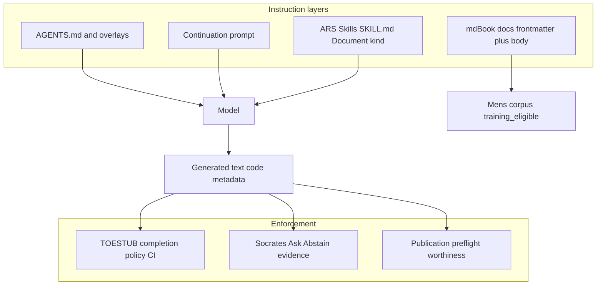

---
status: archived
archived_date: 2026-04-13
training_eligible: false
schema_type: "TechArticle"
title: "Archived Plan: prompt_research_doc_plan_1a695b60.plan"
---

> [!WARNING]
> **ARCHIVED COMPONENT**: This file was archived on 2026-04-13. It is intentionally excluded from active AI context. It must not be referenced for contemporary development.

# Prompt engineering, system prompts, document-skills, and SCIENTIA

## Research summary (what the literature and vendors converge on)

### Prompt and “context” engineering

- **Layering roles:** Vendors recommend separating stable behavior (persona, tone, global rules) from task-specific detail and examples—OpenAI explicitly suggests overall tone/role in the system path and specifics in user messages ([OpenAI prompt engineering](https://developers.openai.com/api/docs/guides/prompt-engineering/)); Anthropic documents dedicated system-prompt guidance and structured prompting ([Anthropic system prompts](https://docs.anthropic.com/en/docs/system-prompts), [Claude prompting blog](https://www.claude.com/blog/best-practices-for-prompt-engineering)).
- **Structure beats prose:** Delimiters, sections, and **XML-style tags** for examples/context/instructions are repeatedly recommended for frontier models (Anthropic docs/blog above). This aligns with Vox’s own [continuation prompt design](docs/src/contributors/continuation-prompt-engineering.md), which already justifies XML boundaries and recency-biased re-anchoring.
- **Context as a finite resource:** Anthropic’s engineering post on **effective context engineering for agents** frames curation of system + tools + retrieval + history as a first-class problem—not just “one big system prompt” ([Anthropic context engineering](https://www.anthropic.com/engineering/effective-context-engineering-for-ai-agents)). Gemini/Vertex guidance similarly stresses ordering constraints (e.g., critical restrictions late in system instructions) ([Vertex system instructions](https://docs.cloud.google.com/vertex-ai/generative-ai/docs/learn/prompts/system-instructions), [Gemini prompting strategies](https://ai.google.dev/gemini-api/docs/prompting-strategies)).
- **Long-context failure modes:** The **lost-in-the-middle** / U-shaped attention pattern (middle of context weaker than start/end) supports Vox’s three-layer model (AGENTS.md + continuation prompt + CI gates) in [continuation-prompt-engineering.md](docs/src/contributors/continuation-prompt-engineering.md); external summaries point to Liu et al.–style findings (e.g. [Morph explainer](https://www.morphllm.com/lost-in-the-middle-llm); follow-up work such as [arXiv:2406.02536](https://arxiv.org/pdf/2406.02536)).
- **Reasoning models (o-series):** OpenAI documents **reasoning best practices**—simpler direct instructions, less reliance on explicit chain-of-thought in the user prompt, `reasoning_effort`, large-input structuring ([OpenAI reasoning best practices](https://developers.openai.com/api/docs/guides/reasoning-best-practices); [Azure Foundry blog on o1/o3-mini](https://techcommunity.microsoft.com/blog/azure-ai-foundry-blog/prompt-engineering-for-openai%E2%80%99s-o1-and-o3-mini-reasoning-models/4374010)). Implication for Vox: document- and publication-facing prompts may need **profile-specific** playbooks (coding agents vs. scientific drafting vs. metadata-only tasks).

### Security and document-shaped attacks

- **Prompt injection remains OWASP #1** for LLM apps (direct, indirect, multi-turn, semantic variants) ([OWASP LLM01:2025](https://genai.owasp.org/llmrisk/llm01-prompt-injection/)). RAG and fine-tuning are **not** sufficient mitigations per OWASP framing.
- **Untrusted documents = indirect injection surface:** Retrieved or ingested text can carry hidden instructions; research and industry writeups highlight RAG poisoning and high success rates under adversarial conditions (e.g. [Rag ’n Roll arXiv](https://arxiv.org/html/2408.05025v1); [Microsoft MSRC on indirect prompt injection](https://msrc.microsoft.com/blog/2025/07/how-microsoft-defends-against-indirect-prompt-injection-attacks)).
- **Implication for “skills as documents”:** Treat `SKILL.md`-like bodies, scraped docs, and user-supplied markdown as **semi-trusted or untrusted** unless signed, reviewed, and version-pinned—consistent with sandbox policy already keyed off `SkillKind` and trust in [`crates/vox-skills/src/sandbox/policy.rs`](crates/vox-skills/src/sandbox/policy.rs) and the `SkillKind::Document` path in [`crates/vox-skills/src/ars_shim/manifest.rs`](crates/vox-skills/src/ars_shim/manifest.rs).

### Industry parallel: Agent Skills = progressive disclosure

- **Cursor Agent Skills:** YAML front matter + markdown body, project/user discovery paths ([Cursor Skills docs](https://cursor.com/docs/context/skills)).
- **Anthropic Agent Skills:** Same shape; **three-level disclosure** (metadata always in context → full `SKILL.md` when triggered → auxiliary resources on demand) ([Anthropic Agent Skills overview](https://docs.anthropic.com/en/docs/agents-and-tools/agent-skills/overview), [skill authoring best practices](https://docs.anthropic.com/en/docs/agents-and-tools/agent-skills/best-practices)).

This is structurally similar to Vox’s [skill marketplace](docs/src/reference/skill_marketplace.md) (TOML front matter + body) and ARS’s document-kind skills—suggesting Vox can **reuse the same pattern for document workflows** (style guides, venue checklists, transformation recipes) while keeping **promotion/registry** and **sandbox** as the control plane.

### Scholarly publication and “legacy systems”

Cross-cutting publisher and archive rules (aligned with what [scientia-publication-automation-ssot.md](docs/src/architecture/scientia-publication-automation-ssot.md) already lists):

| Source | Theme relevant to prompts + generated docs |
|--------|---------------------------------------------|
| [COPE — authorship and AI tools](https://publicationethics.org/guidance/cope-position/authorship-and-ai-tools) | No AI authors; disclose use; human accountability |
| [ICMJE — AI use by authors](https://www.icmje.org/recommendations/browse/artificial-intelligence/ai-use-by-authors.html) | Disclosure in cover letter + manuscript; nondisclosure may be misconduct |
| [WAME revised recommendations](https://www.wame.org/news-details.php?nid=40) | Declare tool, version, method; human responsibility |
| [Nature Portfolio AI policy](http://www.npg.nature.com/nature-portfolio/editorial-policies/ai) | Methods disclosure; carve-out for light copy-editing; strict rules on AI figures |
| [Elsevier generative AI policies](https://www.elsevier.com/en-gb/about/policies-and-standards/generative-ai-policies-for-journals) | Disclosure statement; verify references; no substitute for critical thinking |
| [arXiv policy on ChatGPT-like tools](https://blog.arxiv.org/2023/01/31/arxiv-announces-new-policy-on-chatgpt-and-similar-tools/) | Report significant use; authors responsible for all content |
| [IEEE AI-generated text guidelines](https://open.ieee.org/author-guidelines-for-artificial-intelligence-ai-generated-text) | Acknowledgment disclosure with system, sections, usage |
| [BMJ AI use](https://authors.bmj.com/policies/ai-use/) / [JAMA Network guidance](https://jamanetwork.com/journals/jama/fullarticle/2816213) | Structured disclosure; nonhuman tools not authors |
| [Crossref metadata elements](https://www.crossref.org/documentation/schema-library/required-recommended-elements/) | Rich contributor/ORCID/funding/license metadata (no standard “AI prompt hash” field—policy is in prose disclosures and methods) |
| [Zenodo CFF vs `.zenodo.json`](https://help.zenodo.org/docs/github/describe-software/) | Provenance and citation metadata for deposits |

**Implications for Vox SCIENTIA:** The automation matrix in [scientia-publication-automation-ssot.md](docs/src/architecture/scientia-publication-automation-ssot.md) already marks **undisclosed AI** and **fabrication-prone narrative** as hard boundaries. External policies reinforce that **prompt libraries, skills, and model outputs are not substitutes** for human attestation, Methods-style disclosure, and citation integrity (Socrates + preflight gates). Venues increasingly expect **granular** disclosure (tool name/version/dates/what was AI-assisted)—see JAMA’s submission-system style requirements in search summaries above.

### Melding with Vox’s existing systems (conceptual map)

- **ARS / skills for documents:** Use `SkillKind::Document` (already in shim) to package **venue-specific prompt recipes**, checklist skills, and “safe drafting” patterns with the same registry/promotion story as code-oriented skills—while **sandbox and trust** remain authoritative ([`run_skill.rs`](crates/vox-cli/src/commands/extras/ars/run_skill.rs) shows document kind in the execution path).
- **Docs SSOT:** New page lives under `docs/src/architecture/` with `status: research` per [documentation-governance.md](docs/src/contributors/documentation-governance.md) and front matter per [ADR 002](docs/src/adr/002-diataxis-doc-architecture.md); optionally `training_eligible: true` if you want it eligible for doc-derived pairs (see [expl-ml-pipeline.md](docs/src/explanation/expl-ml-pipeline.md))—**recommend `true`** for consistency with other research pages unless you want to exclude meta-instruction content from training.
- **SCIENTIA / legacy submission:** Treat externally bound packages as **policy-constrained outputs**: preflight profiles (`double_blind`, future `arxiv`) plus explicit **AI disclosure** fields in scholarly metadata (already partially modeled in SSOT tables). “Legacy systems” here means human journal portals, email submission, and hand-staged arXiv—not something prompts can safely automate away.

## Implementation (after you approve Agent mode)

1. **Add** [`docs/src/architecture/prompt-engineering-document-skills-scientia-research-2026.md`](docs/src/architecture/prompt-engineering-document-skills-scientia-research-2026.md) (name can be shortened) with:
   - YAML front matter: `title`, `description`, `category: architecture`, `status: research`, `last_updated: 2026-04-06`, `training_eligible` (your choice), optional `sort_order`.
   - Sections: executive summary; layered instructions vs context engineering; skills-as-documents and progressive disclosure; security (OWASP, RAG poisoning); publication ethics matrix (table + links); **Vox integration** (links to continuation prompt, skill marketplace, `vox-skills` manifest/sandbox, SCIENTIA SSOT, Socrates, preflight); limitations (web research date, need for primary-source re-reads).
2. **Update** [`docs/src/architecture/research-index.md`](docs/src/architecture/research-index.md) with one bullet under an appropriate subsection (new “Agent instructions & publication ethics” or under SCIENTIA).
3. **Regenerate navigation** per repo policy: run `cargo run -p vox-doc-pipeline` from repo root so [`docs/src/SUMMARY.md`](docs/src/SUMMARY.md) picks up `sort_order` / category (see comment at top of SUMMARY).
4. **Optional, minimal cross-links** (only if you want stronger graph navigation): add a “Related research” bullet in [continuation-prompt-engineering.md](docs/src/contributors/continuation-prompt-engineering.md) and a short “Prompt/skill research” pointer in [scientia-publication-automation-ssot.md](docs/src/architecture/scientia-publication-automation-ssot.md) under source anchors.

## Web research count

**23** `WebSearch` calls performed for this plan (requirement: ≥20).

