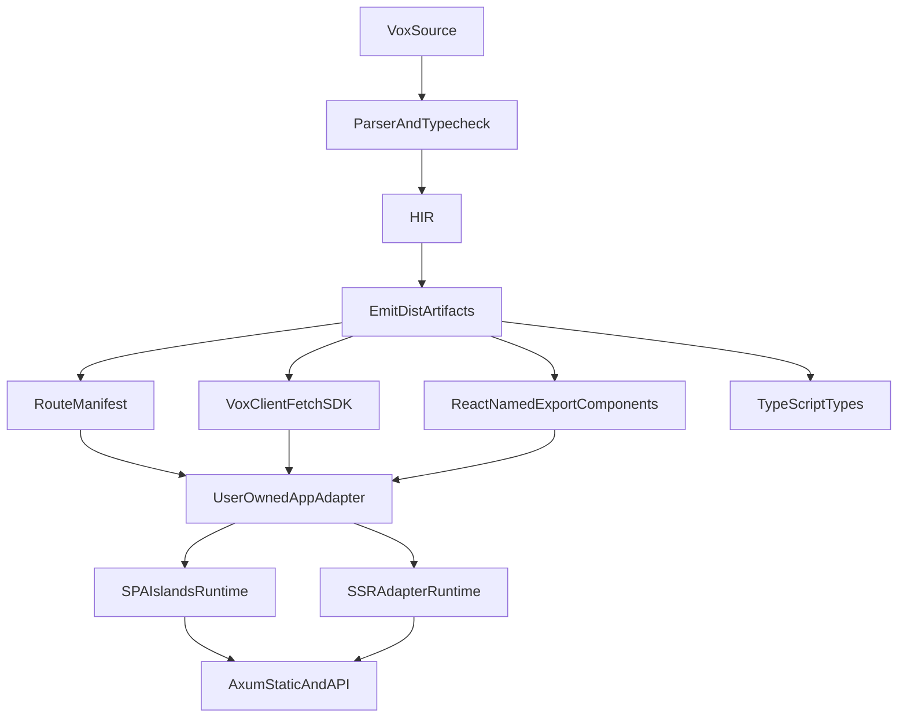

---
status: archived
archived_date: 2026-04-13
training_eligible: false
schema_type: "TechArticle"
title: "Archived Plan: react-interop-full-repo-migration-2026_523ef5f2.plan"
---

> [!WARNING]
> **ARCHIVED COMPONENT**: This file was archived on 2026-04-13. It is intentionally excluded from active AI context. It must not be referenced for contemporary development.

# Full-Repo React Interop Migration Plan (2026)

## Ground Truth Ingested
- Existing research and strategy docs were validated and will be treated as SSOT seeds:
  - [c:\Users\Owner\vox\docs\src\architecture\react-interop-research-findings-2026.md](c:\Users\Owner\vox\docs\src\architecture\react-interop-research-findings-2026.md)
  - [c:\Users\Owner\vox\docs\src\architecture\react-interop-implementation-plan-2026.md](c:\Users\Owner\vox\docs\src\architecture\react-interop-implementation-plan-2026.md)
  - [c:\Users\Owner\vox\docs\src\architecture\react-interop-minimal-shell-strategy.md](c:\Users\Owner\vox\docs\src\architecture\react-interop-minimal-shell-strategy.md)
- Key migration surfaces confirmed:
  - Compiler/TS emit: [c:\Users\Owner\vox\crates\vox-compiler\src\codegen_ts](c:\Users\Owner\vox\crates\vox-compiler\src\codegen_ts)
  - Web IR path: [c:\Users\Owner\vox\crates\vox-compiler\src\web_ir](c:\Users\Owner\vox\crates\vox-compiler\src\web_ir)
  - CLI orchestration/templates: [c:\Users\Owner\vox\crates\vox-cli\src](c:\Users\Owner\vox\crates\vox-cli\src)
  - SSG shell generation: [c:\Users\Owner\vox\crates\vox-ssg\src\lib.rs](c:\Users\Owner\vox\crates\vox-ssg\src\lib.rs)
  - CI workflow: [c:\Users\Owner\vox\.github\workflows\ci.yml](c:\Users\Owner\vox\.github\workflows\ci.yml)
  - Non-core workspaces included by request:
    - [c:\Users\Owner\vox\vox-vscode](c:\Users\Owner\vox\vox-vscode)
    - [c:\Users\Owner\vox\tools\visualizer](c:\Users\Owner\vox\tools\visualizer)
    - [c:\Users\Owner\vox\tree-sitter-vox](c:\Users\Owner\vox\tree-sitter-vox)

## Selected Direction (Locked)
- Success target: 100% migration, no legacy frontend path.
- Scope: full repository including non-core workspaces.
- Runtime default: hybrid adapter track.
  - SPA + islands is the default implementation path.
  - SSR adapter is first-class and developed in parallel.

## Architecture Map

## Completion Model
- Current estimated completion toward final target: 14%.
  - Research, strategic direction, and initial implementation blueprint exist.
  - Full implementation, migration, and hard cutover are pending.
- Plan completion checkpoints:
  - 25%: syntax and emitter pivots landed behind flags.
  - 50%: new shell/client/manifest defaulted in compiler+CLI.
  - 70%: docs/tests/CI and migration tooling complete.
  - 85%: non-core workspaces aligned.
  - 100%: legacy path removed and release cut.

## Mega Task Backlog (260 Tasks)

### WS01 - Program Governance and Lock-In (10 tasks)
- T001 Define migration charter and single owner list.
- T002 Freeze architecture vocabulary for manifest/client/shell terms.
- T003 Publish decision log for hybrid adapter baseline.
- T004 Add explicit no-legacy policy with cutover criteria.
- T005 Add migration risk register with owners and mitigations.
- T006 Define release train (alpha/beta/ga) milestones.
- T007 Define rollback policy for each migration wave.
- T008 Define success KPIs for interop, reliability, and DX.
- T009 Add weekly architecture checkpoint protocol.
- T010 Add repo-wide migration status scoreboard.

### WS02 - Parser and Syntax Migration (10 tasks)
- T011 Add parser support for route loader clause.
- T012 Add parser support for per-route pending clause.
- T013 Add parser support for route layout grouping syntax.
- T014 Add parser support for route-level not_found binding.
- T015 Add parser support for route-level error binding.
- T016 Add hard parser error for `@component fn` legacy form.
- T017 Add hard parser error for `@hook fn` legacy form.
- T018 Add hard parser error for `@provider fn` legacy form.
- T019 Add hard parser error for `page:` legacy form.
- T020 Add migration-hint diagnostics with docs references.

### WS03 - Typecheck and Semantic Diagnostics (10 tasks)
- T021 Promote legacy decorator warnings to errors.
- T022 Add diagnostics for unresolved loader function names.
- T023 Add diagnostics for unresolved pending component names.
- T024 Add diagnostics for invalid nested layout graph.
- T025 Add diagnostics for duplicate route path collisions.
- T026 Add diagnostics for unsupported loader signatures.
- T027 Add diagnostics for invalid not_found component signatures.
- T028 Add diagnostics for invalid error boundary signatures.
- T029 Add machine-readable diagnostic codes for migrations.
- T030 Add strict-mode enforcement toggle and defaults.

### WS04 - HIR Ownership and De-Deprecation (10 tasks)
- T031 Remove deprecated tags from canonical web fields.
- T032 Update field ownership map to AppContract status.
- T033 Add layouts/loadings/not_founds/error_boundaries to semantic HIR.
- T034 Remove temporary deprecated allowances in emit path.
- T035 Add HIR invariants for route-tree normalization.
- T036 Add HIR serialization tests for new route metadata.
- T037 Add HIR deserialization compatibility tests.
- T038 Add deterministic ordering for route entries.
- T039 Add HIR version bump and compatibility note.
- T040 Add HIR migration utility for persisted snapshots.

### WS05 - Route Manifest Emitter Core (10 tasks)
- T041 Create dedicated route manifest emitter module.
- T042 Emit `VoxRoute` canonical type definition.
- T043 Emit `voxRoutes` array with deterministic sort.
- T044 Emit nested `children` route groups from layouts.
- T045 Emit root/index route normalization rules.
- T046 Emit optional per-route `loader` functions.
- T047 Emit optional per-route `pendingComponent` values.
- T048 Emit optional per-route `errorComponent` values.
- T049 Emit global notFound/globalPending exports.
- T050 Add snapshot tests for manifest formatting stability.

### WS06 - Route Manifest Runtime Interop (10 tasks)
- T051 Generate manifest imports for all referenced components.
- T052 Generate manifest-safe symbol naming and dedupe.
- T053 Add manifest compile guard for missing components.
- T054 Add adapter-facing helper typings for loaders.
- T055 Add route params extraction helper contract.
- T056 Add URL query merge helper contract.
- T057 Add loader error propagation contract.
- T058 Add manifest code comments for user adapters.
- T059 Add source map friendliness checks.
- T060 Add manifest backward-compat adapter shim (temporary).

### WS07 - vox-client Typed Fetch SDK (10 tasks)
- T061 Create `vox-client.ts` emitter module.
- T062 Emit shared BASE URL resolution via env.
- T063 Emit internal `$get` helper.
- T064 Emit internal `$post` helper.
- T065 Emit typed `@query` functions as GET.
- T066 Emit typed `@mutation` functions as POST.
- T067 Emit typed `@server` functions as POST.
- T068 Emit query param serialization for multi-arg queries.
- T069 Emit response decode/error contract.
- T070 Add golden tests for generated SDK signatures.

### WS08 - Legacy Codegen Retirement (10 tasks)
- T071 Remove TanStack-specific route-tree generation output.
- T072 Remove `createServerFn` generation path.
- T073 Remove deprecated `serverFns.ts` output.
- T074 Remove stale `VoxTanStackRouter.tsx` generation.
- T075 Remove stale `__root.tsx` generation path.
- T076 Remove stale page/context/provider emit branches.
- T077 Remove dead imports from TS emitter modules.
- T078 Remove dead code tests and snapshots.
- T079 Add failure tests proving legacy outputs no longer emitted.
- T080 Add migration note in release docs for removed outputs.

### WS09 - Scaffold Generator (10 tasks)
- T081 Create scaffold emitter module.
- T082 Emit one-time `app/main.tsx` scaffold.
- T083 Emit one-time `app/App.tsx` adapter scaffold.
- T084 Emit one-time Tailwind v4 `app/globals.css` scaffold.
- T085 Emit one-time `app/components.json` scaffold with `rsc:false`.
- T086 Emit one-time root `vite.config.ts` scaffold.
- T087 Emit one-time root `tsconfig.json` scaffold.
- T088 Emit one-time root `package.json` scaffold.
- T089 Add overwrite-skip policy and clear user messaging.
- T090 Add scaffold idempotency tests.

### WS10 - Hybrid Adapter Pack (SPA + SSR) (10 tasks)
- T091 Add SPA adapter template consuming manifest.
- T092 Add SSR adapter template consuming manifest.
- T093 Add common adapter utilities shared by SPA/SSR.
- T094 Add route loader suspense/pending integration in SPA.
- T095 Add route loader server-prefetch contract in SSR.
- T096 Add notFound/error adapter wiring examples.
- T097 Add adapter switch docs and script helpers.
- T098 Add adapter compatibility tests with same manifest.
- T099 Add adapter performance smoke benchmark.
- T100 Add adapter fallback behavior for missing optional features.

### WS11 - Islands Runtime and Hydration (10 tasks)
- T101 Preserve existing `@island` contract surface.
- T102 Validate island registry output stability.
- T103 Enforce stable `data-vox-island` mount attributes.
- T104 Enforce stable island prop serialization contract.
- T105 Add hydration retry behavior for transient mount errors.
- T106 Add hydration error diagnostics without log spam.
- T107 Add island chunk loading fallback UX contract.
- T108 Add island render boundary tests.
- T109 Add island manifest-to-runtime integrity test.
- T110 Add island + v0 interop golden example validation.

### WS12 - v0 and shadcn Interop (10 tasks)
- T111 Enforce named-export TSX output conventions.
- T112 Enforce alias strategy for `@/components/ui/*`.
- T113 Enforce `components.json` schema correctness.
- T114 Add shadcn dry-run compatibility verification.
- T115 Add v0 component import compatibility checks.
- T116 Add `lucide-react` dependency guard in scaffold.
- T117 Add compatibility test for v0-generated block insertion.
- T118 Add compatibility test for shadcn add/update paths.
- T119 Add docs for v0 no-codegen integration workflow.
- T120 Add CLI doctor check for v0/shadcn readiness.

### WS13 - Tailwind v4 and Design Tokens (10 tasks)
- T121 Enforce `@import "tailwindcss"` scaffold default.
- T122 Remove any legacy `@tailwind` directives in templates.
- T123 Add Tailwind v4 token extension example in docs.
- T124 Add compile smoke test for Tailwind v4 scaffold.
- T125 Add migration checker for legacy tailwind config usage.
- T126 Add fallback docs for projects retaining PostCSS.
- T127 Add dark mode variant policy in scaffold docs.
- T128 Add CSS variable naming convention guidance.
- T129 Add design token override integration test.
- T130 Add v0 + Tailwind v4 coexistence smoke test.

### WS14 - CLI Build/Run/Bundle Flow (10 tasks)
- T131 Update `vox build` to emit manifest+client by default.
- T132 Update `vox build --scaffold` behavior and messaging.
- T133 Update `vox run` for simplified SPA+API dev topology.
- T134 Update `vox bundle` static output assembly rules.
- T135 Remove TanStack CLI generation dependencies in run path.
- T136 Add robust missing-pnpm diagnostics.
- T137 Add robust missing-node diagnostics.
- T138 Add workspace-safe output path checks.
- T139 Add deterministic build summary output.
- T140 Add CLI integration tests for new command behavior.

### WS15 - Axum Topology and Serving Contracts (10 tasks)
- T141 Validate Axum static ServeDir + SPA fallback policy.
- T142 Validate `/api` precedence over static fallback.
- T143 Add production static path contract tests.
- T144 Add dev proxy contract tests from Vite to Axum.
- T145 Add API error envelope consistency checks.
- T146 Add cache-control policy for static assets.
- T147 Add cache-busting filename policy validation.
- T148 Add health endpoint behavior in hybrid mode.
- T149 Add reverse-proxy deployment recipe docs.
- T150 Add integration test for deep-link reload behavior.

### WS16 - WebIR and Emitter Unification (10 tasks)
- T151 Map manifest model into WebIR node schema.
- T152 Map vox-client model into WebIR side-channel.
- T153 Add WebIR lowering for route loader metadata.
- T154 Add WebIR lowering for pending/error/notfound metadata.
- T155 Add WebIR validator checks for route graph integrity.
- T156 Add side-by-side output diff tests (legacy vs WebIR path).
- T157 Enable optional manifest emit from WebIR feature flag.
- T158 Enable optional client emit from WebIR feature flag.
- T159 Add migration gate to flip default emitter source.
- T160 Remove dual-path divergence once parity is proven.

### WS17 - Contracts and Schema Updates (10 tasks)
- T161 Update command registry for new flags/behavior.
- T162 Update capability registry for hybrid adapter support.
- T163 Update operations catalog entries for new workflows.
- T164 Update grammar artifact for retired syntax errors.
- T165 Update eval event schema for manifest/client metrics.
- T166 Add contract tests for route manifest invariants.
- T167 Add contract tests for scaffold invariants.
- T168 Add contract tests for retirement diagnostics.
- T169 Add changelog notes in contract docs.
- T170 Add contract version bump + migration notes.

### WS18 - Testing Expansion and Golden Baselines (10 tasks)
- T171 Add parser golden for new route clauses.
- T172 Add parser golden for hard-error legacy syntax.
- T173 Add codegen golden for route manifest basic case.
- T174 Add codegen golden for nested layout routes.
- T175 Add codegen golden for loaders and pending states.
- T176 Add codegen golden for notfound/error wiring.
- T177 Add codegen golden for vox-client query/mutation/server.
- T178 Add scaffold golden for all generated app files.
- T179 Add integration golden combining full-stack blog sample.
- T180 Add regression harness to prevent legacy artifact return.

### WS19 - CI/CD Pipeline Migration (10 tasks)
- T181 Add CI job for manifest/client generation smoke.
- T182 Add CI job for scaffold idempotency checks.
- T183 Update existing web-vite smoke to new outputs.
- T184 Add CI job for v0/shadcn compatibility checks.
- T185 Add CI job for hybrid adapter matrix (SPA/SSR).
- T186 Add CI gate for legacy syntax hard-error coverage.
- T187 Add CI gate for no legacy artifact emission.
- T188 Add docs link check updates for new pages.
- T189 Update self-hosted runner labels per policy docs.
- T190 Add release pipeline check for migration completion badge.

### WS20 - Documentation and Developer Education (10 tasks)
- T191 Update architecture index with new SSOT links.
- T192 Update web model reference with manifest/client design.
- T193 Update CLI reference for scaffold and adapter switches.
- T194 Add migration guide for retired decorators.
- T195 Add v0+shadcn+Tailwind v4 operational guide.
- T196 Add hybrid adapter cookbook (SPA and SSR).
- T197 Add troubleshooting guide for proxy/fallback issues.
- T198 Add examples index updates for new golden files.
- T199 Add release notes template for migration waves.
- T200 Add contributor onboarding checklist for new frontend model.

### WS21 - Workspace: vox-vscode Alignment (10 tasks)
- T201 Audit extension routes/components coupling assumptions.
- T202 Align webview React conventions with named-export guidance.
- T203 Align extension docs with manifest/client terminology.
- T204 Add compatibility notes for generated app adapters.
- T205 Update extension diagnostics to recognize new artifact names.
- T206 Add workspace script checks for new frontend assumptions.
- T207 Add webview smoke using updated scaffold patterns.
- T208 Remove stale references to legacy TanStack emit artifacts.
- T209 Add extension test fixtures reflecting new codegen outputs.
- T210 Add extension release note entry for migration compatibility.

### WS22 - Workspace: tools/visualizer Alignment (10 tasks)
- T211 Audit visualizer for hardcoded old artifact names.
- T212 Update visualizer ingestion model for manifest routes.
- T213 Update visualizer panels for vox-client endpoints.
- T214 Add visualizer support for hybrid adapter metadata.
- T215 Add visualizer fixture set from new golden outputs.
- T216 Add visualizer smoke tests for route graph rendering.
- T217 Add visualizer smoke tests for loader/pending states.
- T218 Add visualizer docs for new architecture overlays.
- T219 Remove stale legacy-mode toggles from visualizer UX.
- T220 Add visualizer release checklist item for migration gates.

### WS23 - Workspace: tree-sitter-vox Alignment (10 tasks)
- T221 Update grammar to parse new route clause forms.
- T222 Update grammar to parse layout-group route blocks.
- T223 Add grammar rejects for retired legacy decorator forms.
- T224 Update corpus tests for accepted route syntax.
- T225 Update corpus tests for rejected syntax diagnostics.
- T226 Update highlight queries for new keywords/tokens.
- T227 Update locals queries where syntax graph changed.
- T228 Regenerate parser artifacts and validate outputs.
- T229 Update tree-sitter README migration examples.
- T230 Publish grammar compatibility note for editor consumers.

### WS24 - Migration Tooling and Auto-Fixes (10 tasks)
- T231 Implement `vox migrate` rules for `@component fn` conversion.
- T232 Implement `vox migrate` rules for `page:` to `routes` hints.
- T233 Implement `vox migrate` rules for context/hook/provider removal.
- T234 Add dry-run mode for all migrations.
- T235 Add patch preview mode for all migrations.
- T236 Add migration safety checks and backups.
- T237 Add migration report output with unresolved items.
- T238 Add migration e2e tests on representative fixtures.
- T239 Add docs and examples for migration command usage.
- T240 Add CI gate for migration command deterministic output.

### WS25 - Performance, Reliability, and Telemetry (10 tasks)
- T241 Add build time benchmarks for old vs new emit paths.
- T242 Add run time benchmarks for SPA and SSR adapters.
- T243 Add telemetry counters for route manifest generation stats.
- T244 Add telemetry counters for vox-client generation stats.
- T245 Add telemetry counters for scaffold skip/write counts.
- T246 Add reliability tests for malformed route graphs.
- T247 Add reliability tests for API failure handling in loaders.
- T248 Add reliability tests for hydration failures and retries.
- T249 Add telemetry docs updates to architecture references.
- T250 Add perf budget thresholds and CI assertions.

### WS26 - Release Cutover and Legacy Removal (10 tasks)
- T251 Flip default generation to manifest/client/scaffold path.
- T252 Remove feature flags guarding new path after soak.
- T253 Remove remaining legacy TS emitter modules.
- T254 Remove legacy docs and add archive pointers.
- T255 Run full-repo migration command on internal samples.
- T256 Validate all golden fixtures compile and run.
- T257 Cut beta release and collect migration issues.
- T258 Resolve beta blockers and re-run full test matrix.
- T259 Cut GA release with migration completion checklist.
- T260 Mark migration complete and lock future policy checks.

## Execution Order (Strict)
1. WS01-WS04
2. WS05-WS08
3. WS09-WS11
4. WS12-WS16
5. WS17-WS20
6. WS21-WS23
7. WS24-WS26

## Definition of Done
- New generated frontend artifacts are only manifest/client/scaffold based.
- Legacy frontend codegen paths are removed, not just deprecated.
- SPA and SSR adapters both pass integration tests from same manifest.
- v0/shadcn/Tailwind v4 interop validated end-to-end.
- Compiler/CLI/contracts/docs/CI and included workspaces are all aligned.

## Immediate Actionable Next Steps (to reach 25%)
- Start WS01 and WS02 in parallel with strict branch protection.
- Implement WS05 skeleton emitter and WS07 skeleton emitter with tests.
- Wire WS09 minimal scaffold generation and validate idempotency.
- Add first CI smoke gates from WS19 (manifest/client/scaffold).
- Prepare migration command scaffolding from WS24 before hard cutover.
