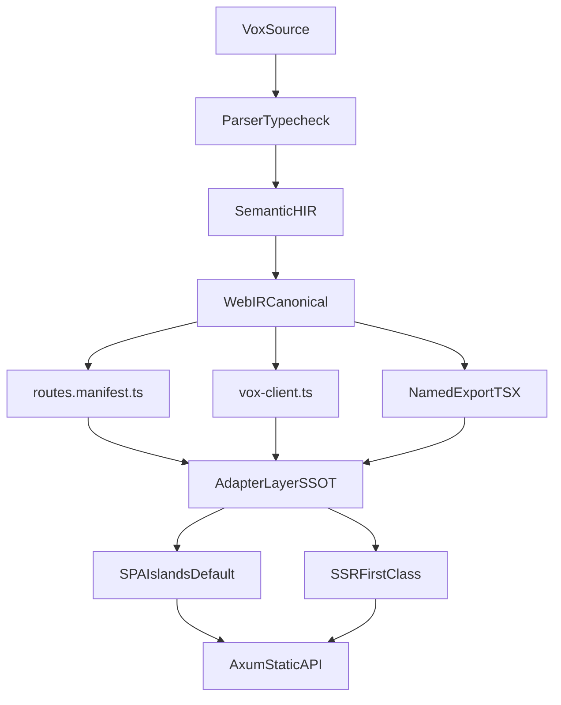

---
status: archived
archived_date: 2026-04-13
training_eligible: false
schema_type: "TechArticle"
title: "Archived Plan: react-interop-ssot-convergence-v2_c9f431bc.plan"
---

> [!WARNING]
> **ARCHIVED COMPONENT**: This file was archived on 2026-04-13. It is intentionally excluded from active AI context. It must not be referenced for contemporary development.

# React Interop SSOT Convergence Plan (V2)

## Current Reality (Critique + Gap Map)

What exists now:
- Manifest/client foundation is in place: [`crates/vox-compiler/src/codegen_ts/route_manifest.rs`](crates/vox-compiler/src/codegen_ts/route_manifest.rs), [`crates/vox-compiler/src/codegen_ts/vox_client.rs`](crates/vox-compiler/src/codegen_ts/vox_client.rs), wired by [`crates/vox-compiler/src/codegen_ts/emitter.rs`](crates/vox-compiler/src/codegen_ts/emitter.rs).
- Legacy router emitter was removed in compiler; WebIR counters were extended in [`crates/vox-compiler/src/web_ir/mod.rs`](crates/vox-compiler/src/web_ir/mod.rs) and [`crates/vox-compiler/src/web_ir/lower.rs`](crates/vox-compiler/src/web_ir/lower.rs).
- CLI added migration scan and doctor checks: [`crates/vox-cli/src/commands/migrate/mod.rs`](crates/vox-cli/src/commands/migrate/mod.rs), [`crates/vox-cli/src/commands/diagnostics/doctor/checks_standard/web_frontend.rs`](crates/vox-cli/src/commands/diagnostics/doctor/checks_standard/web_frontend.rs).

Critical defects to fix:
- Shell/runtime divergence: SPA/Start templates do not consistently consume `routes.manifest.ts`.
- Spec drift: docs still describe `VoxTanStackRouter.tsx` / `serverFns.ts` in multiple places.
- WebIR is not yet default authority for TS emit pathway decisions.
- `vox migrate web` is scan/report only; no deterministic autofix pipeline.
- SSR track is not fully operationally validated in CI.

## Simplified Target Architecture (single way)

## Non-Negotiable Decisions

- Compiler emits only manifest/client/components/types/contracts for web UI; no framework-specific router-tree artifacts.
- WebIR becomes default source-of-truth for web emission decisions.
- One package manager policy for web app flows (`pnpm`) unless an explicit documented exception exists.
- `vox migrate` becomes deterministic and patch-capable for retired syntax.
- Docs/contracts/CI/workspaces converge to one terminology and one flow.

## Token-Weighted Execution Model

- `TW1` (small/low risk): 1 task unit.
- `TW2` (moderate): 2 units.
- `TW3` (complex): 3 units.
- `TW4` (high risk/cross-cutting): 5 units.
- `TW5` (dangerous/migration cutover): 8 units.

Use more tasks for TW4/TW5 domains to force precision and reduce LLM under-specification.

## 220-Task Catalog (Explicit)

### WS01 Program Reset and SSOT Lock (T001-T010)
- T001 (TW2) Publish V2 charter replacing prior migration sequencing.
- T002 (TW2) Freeze canonical artifact list in architecture docs.
- T003 (TW2) Mark conflicting TanStack-era docs as historical/deprecated.
- T004 (TW2) Define single adapter ownership model (compiler vs user).
- T005 (TW2) Define strict acceptance gates for legacy retirement.
- T006 (TW2) Define rollback protocol for each high-risk workstream.
- T007 (TW2) Define KPI instrumentation schema for migration progress.
- T008 (TW2) Add weekly architectural drift review routine.
- T009 (TW2) Add bug taxonomy for LLM-induced regressions.
- T010 (TW2) Add SSOT conflict detector checklist for reviewers.

### WS02 Parser Hard Retirement (T011-T020)
- T011 (TW3) Make `@component fn` parse path hard-error by default.
- T012 (TW3) Hard-error `@hook fn` parse path with actionable code.
- T013 (TW3) Hard-error `@provider fn` parse path.
- T014 (TW3) Hard-error legacy page declaration parse path.
- T015 (TW2) Preserve explicit migration hints in parse diagnostics.
- T016 (TW2) Ensure route `with loader/pending` grammar remains stable.
- T017 (TW2) Validate nested route-group parse normalization.
- T018 (TW2) Add parser tests for strict-mode defaults.
- T019 (TW2) Add parser tests for migration-hint code richness.
- T020 (TW2) Remove parser wording that implies legacy support is normal.

### WS03 Typecheck Semantic Enforcement (T021-T030)
- T021 (TW3) Promote legacy component lint to hard error default.
- T022 (TW3) Keep optional escape hatch only behind explicit opt-out flag.
- T023 (TW2) Enforce unresolved loader diagnostics with stable codes.
- T024 (TW2) Enforce unresolved pending component diagnostics.
- T025 (TW2) Enforce duplicate route path collision diagnostics.
- T026 (TW2) Enforce invalid not_found signature diagnostics.
- T027 (TW2) Enforce invalid error-boundary signature diagnostics.
- T028 (TW2) Ensure migration diagnostics are machine-readable and unique.
- T029 (TW2) Add tests proving retirement codes are deterministic.
- T030 (TW2) Add tests for strict defaults in CLI/check/build paths.

### WS04 HIR and AppContract Consolidation (T031-T040)
- T031 (TW3) Remove remaining migration-only legacy buckets from HIR where possible.
- T032 (TW2) Finalize field ownership map as AppContract authoritative.
- T033 (TW2) Validate deterministic route ordering in HIR serialization.
- T034 (TW2) Add HIR invariant checks for nested route trees.
- T035 (TW2) Add snapshot tests for HIR route metadata.
- T036 (TW2) Add compatibility tests for HIR version transitions.
- T037 (TW2) Ensure no deprecated annotations remain in core web fields.
- T038 (TW2) Add explicit invariant docs beside HIR structs.
- T039 (TW2) Add fail-fast messages for malformed HIR route state.
- T040 (TW2) Add migration note and changelog for HIR cutover.

### WS05 WebIR as Canonical Emitter Input (T041-T050)
- T041 (TW5) Define canonical WebIR-to-TS emitter contract and freeze it.
- T042 (TW4) Route manifest generation from WebIR projection.
- T043 (TW4) Vox-client generation from WebIR contracts.
- T044 (TW4) Component emission parity checks against WebIR nodes.
- T045 (TW4) Remove dual-path emit divergence toggles after parity proof.
- T046 (TW3) Expand WebIR summary metrics for route/loader/pending/error.
- T047 (TW3) Add validation errors for route graph integrity edge cases.
- T048 (TW3) Add side-by-side diff harness for old vs WebIR emit.
- T049 (TW3) Flip default to WebIR-backed emit in build/check pipeline.
- T050 (TW4) Remove or quarantine non-WebIR fallback code paths.

### WS06 Route Manifest Completion (T051-T060)
- T051 (TW3) Add deterministic symbol dedupe/import naming strategy.
- T052 (TW3) Add per-route error component support or remove unsupported type field.
- T053 (TW2) Normalize root/index route semantics for nested trees.
- T054 (TW2) Add route params helper contracts for adapters.
- T055 (TW2) Add query merge helper contracts for loaders.
- T056 (TW2) Add loader failure propagation contract helpers.
- T057 (TW2) Add source-map-friendly formatting tests.
- T058 (TW2) Add manifest comments with adapter integration guidance.
- T059 (TW2) Add compile guard diagnostics for missing component symbols.
- T060 (TW2) Add backwards-compat shim policy and sunset date.

### WS07 Vox Client Completion (T061-T070)
- T061 (TW4) Decide and lock `@query` transport semantics (GET vs POST) as SSOT.
- T062 (TW4) Align Rust HTTP routes and TS client implementation with that decision.
- T063 (TW3) Implement shared URL resolution contract with explicit defaults.
- T064 (TW2) Add robust response decode/error envelope behavior.
- T065 (TW2) Add serialization coverage for multi-arg query params.
- T066 (TW2) Add client generation tests for query/mutation/server variants.
- T067 (TW2) Add typed helper export consistency checks.
- T068 (TW2) Add generation guards for conflicting endpoint symbols.
- T069 (TW2) Add docs for client consumption in SPA and SSR adapters.
- T070 (TW2) Add CI assertion that no legacy `createServerFn` appears in generated output.

### WS08 Compiler Legacy Purge (T071-T080)
- T071 (TW4) Verify zero usages of removed router emitter modules.
- T072 (TW4) Remove stale constants/docs/comments that imply legacy output support.
- T073 (TW3) Remove dead tests/snapshots tied to legacy artifacts.
- T074 (TW3) Add negative tests proving `VoxTanStackRouter.tsx` never emits.
- T075 (TW3) Add negative tests proving `serverFns.ts` never emits.
- T076 (TW3) Remove stale imports and feature hooks from TS codegen modules.
- T077 (TW2) Update module-level docs to manifest-first language.
- T078 (TW2) Update architecture references to removed compiler files.
- T079 (TW2) Add compiler-level migration warnings for removed artifact assumptions.
- T080 (TW2) Add release note entry for permanent legacy purge.

### WS09 Scaffold Generator Hardening (T081-T090)
- T081 (TW3) Finalize one-time scaffold write policy and messaging.
- T082 (TW3) Ensure scaffold path ownership is unambiguous (`repo/app` vs `dist/app`).
- T083 (TW3) Add idempotency checks for all scaffold files.
- T084 (TW2) Enforce Tailwind v4 scaffold defaults.
- T085 (TW2) Enforce shadcn `components.json` schema defaults.
- T086 (TW2) Ensure scaffold `App.tsx` consumes full manifest exports.
- T087 (TW2) Add missing not-found/error/pending wiring in scaffold adapter.
- T088 (TW2) Add tests for scaffold behavior when files pre-exist.
- T089 (TW2) Add CLI docs for scaffold trigger strategy.
- T090 (TW2) Add diagnostics when scaffold and runtime layouts diverge.

### WS10 Adapter Pack (SPA + SSR) Realization (T091-T100)
- T091 (TW5) Implement first-class SPA adapter consuming manifest and client contracts.
- T092 (TW5) Implement first-class SSR adapter consuming same manifest.
- T093 (TW4) Add shared adapter utilities for params/loader/error mapping.
- T094 (TW4) Add SPA suspense/pending integration policy from manifest.
- T095 (TW4) Add SSR prefetch + hydration contract from manifest/client.
- T096 (TW3) Add not-found and error wiring examples in code templates.
- T097 (TW3) Add adapter switch scripts and docs for developers.
- T098 (TW3) Add compatibility tests proving same manifest drives both adapters.
- T099 (TW3) Add fallback behavior for optional fields.
- T100 (TW3) Add benchmark smoke for adapter performance regressions.

### WS11 Islands Runtime Completion (T101-T110)
- T101 (TW3) Validate stable `data-vox-island` mount attributes.
- T102 (TW3) Validate stable prop serialization protocol.
- T103 (TW3) Add hydration retry semantics for transient failures.
- T104 (TW2) Add hydration error diagnostics without log spam.
- T105 (TW2) Add chunk-loading fallback UX contract.
- T106 (TW2) Add island render boundary tests.
- T107 (TW2) Add island manifest/runtime integrity tests.
- T108 (TW2) Add v0-island interop golden fixtures.
- T109 (TW2) Add docs for island runtime troubleshooting.
- T110 (TW2) Add CI gate for island contract regressions.

### WS12 v0 + shadcn End-to-End Interop (T111-T120)
- T111 (TW3) Enforce named-export TSX conventions across generated surfaces.
- T112 (TW3) Enforce alias strategy `@/components/ui/*` consistency.
- T113 (TW3) Add shadcn dry-run compatibility checks.
- T114 (TW3) Add v0 block insertion compatibility checks.
- T115 (TW3) Add doctor readiness checks with actionable remediation.
- T116 (TW2) Add `lucide-react` dependency checks where required.
- T117 (TW2) Add docs for no-codegen v0 integration workflows.
- T118 (TW2) Add integration fixtures proving shadcn add/update still works.
- T119 (TW2) Add CI smoke for v0/shadcn matrix.
- T120 (TW2) Add release guidance for v0/shadcn upgrade paths.

### WS13 Tailwind v4 + Tokens (T121-T130)
- T121 (TW3) Enforce `@import "tailwindcss"` in all scaffolds/templates.
- T122 (TW3) Remove legacy `@tailwind` directives from remaining templates/docs.
- T123 (TW2) Add token extension examples and validated snippets.
- T124 (TW2) Add Tailwind compile smoke tests for scaffold outputs.
- T125 (TW2) Add migration check for legacy tailwind config patterns.
- T126 (TW2) Add fallback docs for PostCSS-retained projects.
- T127 (TW2) Add dark-mode variant policy in scaffold docs.
- T128 (TW2) Add CSS variable naming conventions and examples.
- T129 (TW2) Add token override integration tests.
- T130 (TW2) Add v0+Tailwind coexistence smoke tests.

### WS14 CLI Flow Unification (T131-T140)
- T131 (TW4) Ensure `vox build` default emits manifest/client/components contracts.
- T132 (TW4) Introduce explicit `vox build --scaffold` and de-emphasize hidden env flow.
- T133 (TW4) Align `vox run` shell generation with same adapter architecture as build.
- T134 (TW4) Align `vox bundle` behavior with run/build (no divergent assumptions).
- T135 (TW3) Replace npm usage with pnpm in bundle unless documented exception.
- T136 (TW3) Improve missing-node/pnpm diagnostics and remediation text.
- T137 (TW2) Add workspace-safe output path checks.
- T138 (TW2) Add deterministic build summary output format.
- T139 (TW2) Add integration tests for new command behavior matrix.
- T140 (TW2) Update CLI docs and command contracts for flow convergence.

### WS15 Axum Serving Contracts (T141-T150)
- T141 (TW3) Validate static serving + SPA fallback policy.
- T142 (TW3) Validate `/api` precedence over static fallback.
- T143 (TW3) Add production static path contract tests.
- T144 (TW3) Add dev proxy contract tests from Vite to Axum.
- T145 (TW2) Add API error envelope consistency checks.
- T146 (TW2) Add cache-control policy tests.
- T147 (TW2) Add cache-busting filename validation.
- T148 (TW2) Add health endpoint behavior in hybrid mode.
- T149 (TW2) Add reverse-proxy deployment recipes.
- T150 (TW2) Add deep-link reload integration tests.

### WS16 WebIR Validation and Default Gates (T151-T160)
- T151 (TW4) Make WebIR validation enabled by default in standard build pipeline.
- T152 (TW4) Add override flags with explicit risk semantics for disabling validation.
- T153 (TW3) Add fail-fast diagnostics for route graph anomalies.
- T154 (TW3) Add fail-fast diagnostics for loader signature mismatches.
- T155 (TW3) Add diff tests proving emit parity through WebIR default path.
- T156 (TW3) Remove obsolete legacy parity toggles once validated.
- T157 (TW2) Add telemetry counters for WebIR gate outcomes.
- T158 (TW2) Add docs for WebIR validation behavior and escape hatches.
- T159 (TW2) Add CI gate requiring WebIR-valid output for web fixtures.
- T160 (TW2) Add release checklist item for WebIR default lock-in.

### WS17 Contracts and Schemas (T161-T170)
- T161 (TW3) Update command registry entries for migrate/scaffold/default flags.
- T162 (TW3) Update capability registry entries with new migrate and adapter semantics.
- T163 (TW3) Update operations catalog with migrated web workflows.
- T164 (TW2) Update grammar artifacts for retired syntax status.
- T165 (TW2) Extend eval telemetry schema with manifest/client/webir metrics.
- T166 (TW2) Add contract tests for route manifest invariants.
- T167 (TW2) Add contract tests for scaffold invariants.
- T168 (TW2) Add contract tests for retirement diagnostics.
- T169 (TW2) Add contract version bump + migration notes.
- T170 (TW2) Add changelog references across contract docs.

### WS18 Testing and Goldens Expansion (T171-T180)
- T171 (TW3) Add parser goldens for strict retirement diagnostics.
- T172 (TW3) Add parser goldens for route clauses and nested groups.
- T173 (TW3) Add codegen goldens for manifest basic and nested cases.
- T174 (TW3) Add codegen goldens for loader/pending/error wiring.
- T175 (TW3) Add codegen goldens for vox-client signatures.
- T176 (TW3) Add scaffold goldens for all generated files.
- T177 (TW3) Add full-stack blog/sample integration golden.
- T178 (TW3) Add negative goldens proving legacy artifacts never return.
- T179 (TW2) Add migrate-web report goldens and exit-code tests.
- T180 (TW2) Add brittle-substring replacement with stronger structured assertions.

### WS19 CI/CD Migration (T181-T190)
- T181 (TW4) Add CI job for manifest/client generation smoke.
- T182 (TW4) Add CI job for scaffold idempotency checks.
- T183 (TW4) Add CI job for Start/SSR adapter smoke where intended.
- T184 (TW4) Add CI job for v0/shadcn compatibility checks.
- T185 (TW4) Add CI matrix for SPA+SSR from same manifest.
- T186 (TW3) Add CI gate for hard-error legacy syntax coverage.
- T187 (TW3) Add CI gate for no legacy artifacts in generated output.
- T188 (TW3) Add CI docs-link consistency checks for SSOT pages.
- T189 (TW2) Ensure runner labels conform to runner contract docs.
- T190 (TW2) Add release pipeline migration-completion badge check.

### WS20 Documentation Convergence (T191-T200)
- T191 (TW4) Rewrite stale TanStack/legacy docs to one canonical story.
- T192 (TW4) Mark historical docs clearly where retained.
- T193 (TW3) Update `vox-web-stack.md` with manifest-first architecture.
- T194 (TW3) Add retired syntax migration guide (hard errors + fixes).
- T195 (TW3) Expand v0/shadcn/Tailwind operational guide.
- T196 (TW3) Complete hybrid adapter cookbook with SPA+SSR code paths.
- T197 (TW2) Add troubleshooting guide for proxy/fallback/layout divergence.
- T198 (TW2) Update examples index and references to new goldens.
- T199 (TW2) Add release-notes template for migration waves.
- T200 (TW2) Add contributor onboarding checklist for the new web model.

### WS21 Workspace: vox-vscode (T201-T210)
- T201 (TW3) Audit extension assumptions about old generated artifact names.
- T202 (TW3) Update extension diagnostics for manifest/client outputs.
- T203 (TW3) Update webview conventions for named-export component assumptions.
- T204 (TW2) Update docs and command docs to manifest-first terminology.
- T205 (TW2) Add fixture set reflecting new generated outputs.
- T206 (TW2) Add workspace script checks for frontend assumption drift.
- T207 (TW2) Add webview smoke test against updated scaffold patterns.
- T208 (TW2) Remove stale references to legacy outputs from extension docs.
- T209 (TW2) Add release note entry for migration compatibility.
- T210 (TW2) Add CI/validation hook for extension compatibility assertions.

### WS22 Workspace: visualizer (T211-T220)
- T211 (TW3) Audit visualizer for hardcoded old artifact names.
- T212 (TW3) Implement manifest route graph ingestion model.
- T213 (TW3) Implement vox-client endpoint panel ingestion.
- T214 (TW3) Add hybrid adapter metadata overlays.
- T215 (TW2) Add visualizer fixture set from current golden outputs.
- T216 (TW2) Add route graph smoke tests.
- T217 (TW2) Add loader/pending state smoke tests.
- T218 (TW2) Remove stale legacy-mode toggles from UX.
- T219 (TW2) Add visualizer migration docs and release checklist entries.
- T220 (TW2) Add CI sanity check for visualizer ingesting manifest output.

## Sequencing

1. WS01-WS04 (strict retirement + semantic correctness)
2. WS05-WS08 (WebIR canonical emit + compiler purge)
3. WS09-WS11 (scaffold/adapters/islands hardening)
4. WS12-WS16 (interop + runtime + validation defaults)
5. WS17-WS20 (contracts/tests/CI/docs convergence)
6. WS21-WS22 (workspace parity)

## Definition of Done

- Web generation has one compiler path: WebIR-backed manifest/client/components/contracts.
- Legacy router/server-fn artifacts are impossible to emit and impossible to document as current.
- SPA and SSR adapters are both operational, tested, and fed from the same manifest/client contracts.
- `vox migrate` has deterministic scans and practical autofix workflow for retired syntax.
- CI enforces no-regression gates for compiler/runtime/docs/contracts/workspaces.

