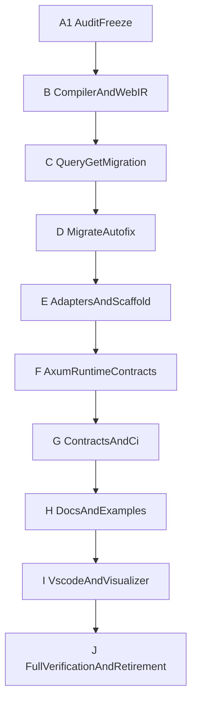

---
status: archived
archived_date: 2026-04-13
training_eligible: false
schema_type: "TechArticle"
title: "Archived Plan: react_interop_v2_laziness_closure_bb97691a.plan"
---

> [!WARNING]
> **ARCHIVED COMPONENT**: This file was archived on 2026-04-13. It is intentionally excluded from active AI context. It must not be referenced for contemporary development.

# React Interop V2 Laziness Closure Plan

## Goal
Deliver the original V2 outcomes end-to-end with no lazy shortcuts: WebIR-first emit authority, GET-based `@query`, hard retirement of legacy paths, exhaustive doc/example convergence, stronger tests, and CI guards that prevent regressions.

## Scope Baseline (from repo audit)
- Remaining code gaps cluster in compiler/CLI/CI/contracts and workspace tooling parity.
- Biggest unresolved architectural choice is now decided: `@query` will migrate to GET.
- Legacy retirement mode is now decided: hard-retire old paths/docs where possible, not just “historical” tags.

## Execution Map

## Detailed Task Plan (Atomic)

### A. Freeze an accurate baseline (prevent fake completion)
- Re-open and verify each existing todo against current tree before coding starts.
- Produce a gap ledger file in-memory workflow (not committed artifact) mapping each V2 task id to concrete code/tests/docs targets.
- Identify and mark any already-done items with evidence, then keep only unresolved items active.

### B. Compiler + WebIR authority completion
- Remove remaining non-essential HIR fallback emit paths for manifest/client decision points in [`crates/vox-compiler/src/codegen_ts/emitter.rs`](crates/vox-compiler/src/codegen_ts/emitter.rs).
- Enforce route manifest emission from validated WebIR route tree only in [`crates/vox-compiler/src/codegen_ts/route_manifest.rs`](crates/vox-compiler/src/codegen_ts/route_manifest.rs).
- Add diagnostics for unresolved manifest component/loader symbols during emit.
- Add nested-route parity tests covering children + pending + error + not-found in [`crates/vox-compiler/tests/web_ir_lower_emit.rs`](crates/vox-compiler/tests/web_ir_lower_emit.rs).
- Add a hard test ensuring no route-manifest codepath can be selected without WebIR validation when gate is enabled.

### C. `@query` GET migration (hard switch)
- Change Rust HTTP route wiring so `@query` handlers register as GET in [`crates/vox-compiler/src/codegen_rust/emit/http.rs`](crates/vox-compiler/src/codegen_rust/emit/http.rs).
- Implement deterministic query-arg encoding/decoding contract for scalar and multi-arg query params.
- Update generated TS client to use GET for `@query` and POST for `@mutation`/`@server` in [`crates/vox-compiler/src/codegen_ts/vox_client.rs`](crates/vox-compiler/src/codegen_ts/vox_client.rs).
- Add client URL resolution/error envelope updates for GET path + querystring handling.
- Add compiler tests for GET/POST verb split and multi-arg query serialization.
- Add integration test covering `@query` GET roundtrip through generated Axum + client contract.

### D. `vox migrate web` deterministic autofix expansion
- Extend patch engine in [`crates/vox-cli/src/commands/migrate/mod.rs`](crates/vox-cli/src/commands/migrate/mod.rs) beyond `@component fn` to additional retired surfaces (`context`, `@hook`, `@provider`, retired page syntax) with deterministic transforms where safe.
- For non-safe transforms, emit machine-readable actionable diagnostics with stable codes.
- Add explicit exit-code behavior matrix for `--check`, `--write`, parse-failure paths.
- Add structured JSON report tests (schema fields + deterministic counts + deterministic ordering).
- Add smoke tests for write idempotency and no-op second run.

### E. Scaffold + adapter hardening
- Unify SPA scaffold to consume `routes.manifest.ts` rather than single-component fallback in [`crates/vox-cli/src/templates/spa.rs`](crates/vox-cli/src/templates/spa.rs) and [`crates/vox-cli/src/frontend.rs`](crates/vox-cli/src/frontend.rs).
- Upgrade Start/SSR reference adapter templates to consume manifest + `vox-client` consistently in [`crates/vox-cli/src/templates/tanstack.rs`](crates/vox-cli/src/templates/tanstack.rs).
- Add shared route/loader/error helper template module for SPA+SSR adapters.
- Add scaffold idempotency tests for pre-existing files and unchanged second run.
- Ensure generated scaffold covers pending/notFound/error wiring with clear user-owned extension points.

### F. CLI unification and package-manager consistency
- Replace remaining `npm` invocation in bundle flow with `pnpm` in [`crates/vox-cli/src/commands/bundle.rs`](crates/vox-cli/src/commands/bundle.rs).
- Align `run`/`bundle`/`build --scaffold` output path assumptions and stale artifact checks.
- Add deterministic build summary fields (JSON/text) for web outputs and adapter mode.
- Add tests asserting pnpm-only behavior and no npm fallback in web build paths.

### G. Axum runtime contract completion
- Add tests for static-vs-`/api` precedence and SSR proxy behavior (GET non-API only) in compiler/runtime tests.
- Add tests for deep-link fallback behavior with and without SSR proxy env.
- Add tests for generated error envelope consistency for query/mutation/server failures.
- Add cache/health/docs recipes updates tied to generated behavior.

### H. Contracts + CI gate expansion
- Update capability/operations/command registries for GET-query semantics, migrate write/check semantics, and WebIR gate surfaces:
  - [`contracts/capability/capability-registry.yaml`](contracts/capability/capability-registry.yaml)
  - [`contracts/operations/catalog.v1.yaml`](contracts/operations/catalog.v1.yaml)
  - [`contracts/cli/command-registry.yaml`](contracts/cli/command-registry.yaml)
- Add CI jobs for:
  - manifest/client structured smoke
  - scaffold idempotency
  - SPA+SSR adapter build matrix (opt-in Node)
  - legacy output/string gate (no `createServerFn`, no legacy files)
  - docs stale-link/string gate for retired module paths
- Keep runner labels compliant with [`docs/src/ci/runner-contract.md`](docs/src/ci/runner-contract.md).

### I. Hard legacy retirement
- Remove or quarantine remaining legacy codepaths that can still emit or imply retired artifacts.
- Remove obsolete tests tied to retired outputs and replace with manifest/client assertions.
- Add a single “forbidden legacy surface” assertion suite in compiler tests.

### J. Documentation + `.vox` examples full convergence
- Rewrite normative references to manifest-first + GET-query model across:
  - [`docs/src/reference/vox-web-stack.md`](docs/src/reference/vox-web-stack.md)
  - [`docs/src/reference/vox-fullstack-artifacts.md`](docs/src/reference/vox-fullstack-artifacts.md)
  - [`docs/src/api/vox-codegen-ts.md`](docs/src/api/vox-codegen-ts.md)
  - [`docs/src/architecture/react-interop-hybrid-adapter-cookbook.md`](docs/src/architecture/react-interop-hybrid-adapter-cookbook.md)
- Hard-retire stale TanStack legacy docs/backlogs or move to explicitly archived sections with no unchecked active tasks:
  - [`docs/src/architecture/tanstack-start-codegen-spec.md`](docs/src/architecture/tanstack-start-codegen-spec.md)
  - [`docs/src/architecture/tanstack-start-implementation-backlog.md`](docs/src/architecture/tanstack-start-implementation-backlog.md)
  - [`docs/src/architecture/tanstack-web-backlog.md`](docs/src/architecture/tanstack-web-backlog.md)
- Update `.vox` example comments/headers to remove retired syntax language and align with Path C naming.
- Add docs guard rule for forbidden legacy references in normative docs paths.

### K. Workspace parity completion (`vox-vscode` + `visualizer`)
- Align VSCode artifact import diagnostics with CLI import-resolution logic in [`vox-vscode/src/features/webArtifactDiagnostics.ts`](vox-vscode/src/features/webArtifactDiagnostics.ts).
- Add filesystem watcher revalidation and activation events for TS artifact docs.
- Add optional config switch to disable artifact diagnostics.
- Implement visualizer ingestion hardening with tests in [`tools/visualizer/src/ingest/artifacts.ts`](tools/visualizer/src/ingest/artifacts.ts).
- Add visualizer test script + CI build/lint/test hook.
- Normalize workspace terminology (`Web artifacts` vs `Web IR`) and remove legacy UX toggles/labels.

### L. Final verification + retirement proof
- Run targeted compiler/CLI/workspace tests for each changed subsystem.
- Run `cargo check --workspace` + relevant focused tests.
- Run docs guard checks and command/capability parity checks.
- Run `vox stub-check --path` on touched dirs.
- Produce completion report in chat: done tasks, verification evidence, residual risks (if any), and percentage complete.

## Progress/Completion Policy
- Start at 0% with only verified completions counted.
- Report progress by completed atomic tasks, not category labels.
- Target 100% of this plan; if blocked, explicitly mark blocker + mitigation and continue remaining tasks.

