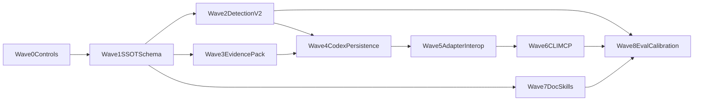

> [!WARNING]
> **ARCHIVED COMPONENT**: This file was archived on 2026-04-13. It is intentionally excluded from active AI context. It must not be referenced for contemporary development.

# SCIENTIA Implementation Strategy: 232 High-Value Tasks in Waves

## Program intent

Move Vox SCIENTIA from strong research + partial automation to a production-grade publication system that:

- generates publication-worthy artifacts more reliably,
- detects publication-worthiness with higher precision/recall,
- enforces one canonical metadata SSOT for all channels,
- preserves human-accountability boundaries for ethics, novelty framing, and legal submission steps.

Implementation progress baseline: **0% implementation / 100% strategy drafted**.

## Core code and docs anchors

Primary code paths to change:

- [`crates/vox-publisher/src/publication_preflight.rs`](crates/vox-publisher/src/publication_preflight.rs)
- [`crates/vox-publisher/src/publication_worthiness.rs`](crates/vox-publisher/src/publication_worthiness.rs)
- [`crates/vox-publisher/src/scientific_metadata.rs`](crates/vox-publisher/src/scientific_metadata.rs)
- [`crates/vox-publisher/src/submission/mod.rs`](crates/vox-publisher/src/submission/mod.rs)
- [`crates/vox-publisher/src/crossref_metadata.rs`](crates/vox-publisher/src/crossref_metadata.rs)
- [`crates/vox-publisher/src/zenodo_metadata.rs`](crates/vox-publisher/src/zenodo_metadata.rs)
- [`crates/vox-db/src/schema/domains/publish_cloud.rs`](crates/vox-db/src/schema/domains/publish_cloud.rs)
- [`crates/vox-db/src/store/ops_publication/manifest.rs`](crates/vox-db/src/store/ops_publication/manifest.rs)
- [`crates/vox-cli/src/commands/db_cli/publication_subcommands.rs`](crates/vox-cli/src/commands/db_cli/publication_subcommands.rs)
- [`crates/vox-orchestrator/src/mcp_tools/tools/scientia_tools/lifecycle.rs`](crates/vox-orchestrator/src/mcp_tools/tools/scientia_tools/lifecycle.rs)

Primary contract/doc anchors to update:

- [`contracts/scientia/publication-worthiness.schema.json`](contracts/scientia/publication-worthiness.schema.json)
- [`contracts/scientia/manifest-completion.schema.json`](contracts/scientia/manifest-completion.schema.json)
- [`contracts/scientia/scientia-evidence-graph.schema.json`](contracts/scientia/scientia-evidence-graph.schema.json)
- [`contracts/scientia/distribution.schema.json`](contracts/scientia/distribution.schema.json)
- [`contracts/scientia/arxiv-handoff.schema.json`](contracts/scientia/arxiv-handoff.schema.json)
- [`docs/src/reference/scientia-publication-worthiness-rules.md`](docs/src/reference/scientia-publication-worthiness-rules.md)
- [`docs/src/architecture/scientia-publication-automation-ssot.md`](docs/src/architecture/scientia-publication-automation-ssot.md)
- [`docs/src/architecture/scientia-publication-readiness-audit.md`](docs/src/architecture/scientia-publication-readiness-audit.md)
- [`docs/src/architecture/scientia-publication-worthiness-ssot-unification-research-2026.md`](docs/src/architecture/scientia-publication-worthiness-ssot-unification-research-2026.md)

## Wave map (232 tasks total)

- Wave 0: Program controls and baselines (20 tasks)
- Wave 1: Canonical metadata SSOT graph and schema contracts (34 tasks)
- Wave 2: Worthiness detection v2 engine (44 tasks)
- Wave 3: Evidence pack and reproducibility enforcement (28 tasks)
- Wave 4: Codex persistence and audit event model (24 tasks)
- Wave 5: Adapter transforms and legacy/modern publication interop (36 tasks)
- Wave 6: CLI/MCP operator surfaces and workflow ergonomics (18 tasks)
- Wave 7: Skill system expansion for document workflows (14 tasks)
- Wave 8: Quality, eval, and calibration harnesses (14 tasks)

Total: **232 tasks**.

## Dependency graph

## Wave 0 (20 tasks): Program controls and baselines

Goal: establish implementation guardrails, metrics, and delivery cadence.

- W0-P01 (4 tasks): define program KPIs for publishability precision, metadata completeness, unresolved citation count, and route success rates.
- W0-P02 (4 tasks): create baseline snapshot commands for current preflight/worthiness output behavior across representative manifests.
- W0-P03 (4 tasks): set release lanes (`experimental`, `default`) for all new SCIENTIA behavior changes.
- W0-P04 (4 tasks): define migration policy for additive metadata fields and backward compatibility requirements.
- W0-P05 (4 tasks): define done criteria for each wave and add CI gate checklist entries.

Exit criteria:

- KPIs and baselines versioned.
- No wave starts without measurable before/after metrics.

## Wave 1 (34 tasks): Canonical metadata SSOT graph and schema contracts

Goal: one canonical metadata graph that compiles outward to all adapter routes.

- W1-P01 (5 tasks): define canonical graph domains (`identity`, `contributors`, `provenance`, `evidence`, `policy`, `rights_and_funding`, `distribution`).
- W1-P02 (5 tasks): add additive canonical fields in publisher data models in [`crates/vox-publisher/src/scientific_metadata.rs`](crates/vox-publisher/src/scientific_metadata.rs).
- W1-P03 (4 tasks): add route-profile enum and per-route required field maps.
- W1-P04 (4 tasks): revise `manifest-completion` schema with required vs recommended tiers by route.
- W1-P05 (4 tasks): revise `distribution` schema for route intent and payload readiness states.
- W1-P06 (4 tasks): add schema versioning conventions and upgrade/downgrade compatibility docs.
- W1-P07 (4 tasks): add author identity structure (`ORCID`, affiliation object, optional `ROR`) and consistency checks.
- W1-P08 (4 tasks): add funding/COI/license normalization blocks and route-specific validation rules.

Exit criteria:

- Canonical graph accepted as SSOT input for all route mappers.
- Schemas validate additive backward compatibility.

## Wave 2 (44 tasks): Worthiness detection v2 engine

Goal: improve detection quality for publication-worthiness with calibrated signals.

- W2-P01 (5 tasks): implement normalized signal taxonomy (`hard_gate`, `soft_gate`, `diagnostic`, `metadata_required`, `metadata_recommended`) in worthiness engine outputs.
- W2-P02 (5 tasks): add `seed_count_transparency` signal extraction and reason codes.
- W2-P03 (5 tasks): add `uncertainty_reporting` signal extraction (variance/CI availability).
- W2-P04 (5 tasks): add `ablation_adequacy` scoring with explicit minimum evidence checks.
- W2-P05 (5 tasks): add `contamination_risk_flag` diagnostic (benchmark leakage risk indicators).
- W2-P06 (5 tasks): add `citation_verification_confidence` signal with unresolved reference thresholds.
- W2-P07 (4 tasks): integrate claim-evidence density into scored diagnostics.
- W2-P08 (5 tasks): implement policy-profile thresholds by route (`journal`, `preprint`, `repository`, `social`).
- W2-P09 (5 tasks): add explainability payloads for every failing signal and `next_actions` synthesis.

Exit criteria:

- Worthiness v2 outputs stable, explainable, and profile-aware.
- Hard-gate false positives below target threshold on benchmark set.

## Wave 3 (28 tasks): Evidence pack and reproducibility enforcement

Goal: enforce publication-grade evidence bundles and replayability.

- W3-P01 (4 tasks): define canonical `EvidencePack` object and link semantics to publication manifest digest.
- W3-P02 (4 tasks): implement baseline/candidate pair integrity requirements in evidence assembler.
- W3-P03 (4 tasks): include run metadata fingerprints (repo context, config hash, env signatures).
- W3-P04 (4 tasks): require benchmark manifest parity checks between baseline and candidate.
- W3-P05 (4 tasks): emit replay instructions block and validation status.
- W3-P06 (4 tasks): attach evidence completeness summary into preflight and status outputs.
- W3-P07 (4 tasks): add deterministic error taxonomy for missing evidence components.

Exit criteria:

- Every publication candidate can be audited through a complete EvidencePack.
- Missing evidence is surfaced before submission attempts.

## Wave 4 (24 tasks): Codex persistence and audit event model

Goal: persist research/detection snapshots and recomputation lineage in Codex.

- W4-P01 (4 tasks): add research snapshot payload schema and storage hooks.
- W4-P02 (4 tasks): add status-event variants (`snapshot_computed`, `snapshot_recomputed`, `snapshot_superseded`).
- W4-P03 (4 tasks): add prior-snapshot linkage hashes for chain-of-custody.
- W4-P04 (4 tasks): add retrieval APIs for latest snapshot + delta-from-previous.
- W4-P05 (4 tasks): add provenance fields for external signal source/timestamp/confidence/caveats.
- W4-P06 (4 tasks): add retention and pruning policy for snapshot history with audit safety guarantees.

Exit criteria:

- Snapshot lineage and recomputation history are queryable and auditable.
- No loss of backward compatibility for existing publication lifecycle rows.

## Wave 5 (36 tasks): Adapter transforms and publication interop

Goal: transform canonical SSOT metadata into legacy + modern route payloads without rewrites.

- W5-P01 (4 tasks): build canonical-to-Crossref mapping contract and completeness checker.
- W5-P02 (4 tasks): build canonical-to-DataCite mapping contract and completeness checker.
- W5-P03 (4 tasks): harden canonical-to-Zenodo metadata map and precedence behavior.
- W5-P04 (4 tasks): harden canonical-to-arXiv handoff map and package constraints checks.
- W5-P05 (4 tasks): harden canonical-to-OpenReview payload map and route prechecks.
- W5-P06 (4 tasks): harden canonical-to-social syndication map with route-safe truncation and attribution.
- W5-P07 (4 tasks): add route capability registry and explicit unsupported-field diagnostics.
- W5-P08 (4 tasks): add idempotency keys and retry class taxonomy alignment for adapters.
- W5-P09 (4 tasks): add end-to-end adapter conformance tests using fixture manifests per route.

Exit criteria:

- One canonical metadata source feeds all adapters.
- Route-specific failures are deterministic and explainable.

## Wave 6 (18 tasks): CLI/MCP operator surfaces and workflow ergonomics

Goal: make the default operator path obvious and low-friction.

- W6-P01 (3 tasks): update CLI status/preflight outputs to show signal taxonomy and snapshot deltas.
- W6-P02 (3 tasks): add unified `next_actions` ordering logic for scholarly + distribution routes.
- W6-P03 (3 tasks): expose route readiness matrix in CLI and MCP lifecycle responses.
- W6-P04 (3 tasks): add profile recommendation helper based on target route and missing fields.
- W6-P05 (3 tasks): add operator command docs for happy path and failure remediation.
- W6-P06 (3 tasks): parity-test CLI and MCP output semantics for equivalent operations.

Exit criteria:

- New operators can complete core flow via one consistent checklist surface.
- CLI/MCP parity maintained for lifecycle and diagnostics.

## Wave 7 (14 tasks): Skill system expansion for document workflows

Goal: improve generation quality and policy adaptation with document-oriented skills.

- W7-P01 (4 tasks): define Publication-grade Evidence Authoring skill spec and invocation contract.
- W7-P02 (4 tasks): define Venue-policy Adaptation skill spec and profile packs.
- W7-P03 (3 tasks): integrate skill outputs into preflight-ingest pathways with strict schema checks.
- W7-P04 (3 tasks): add trust/sandbox boundaries and guardrails for document skill outputs.

Exit criteria:

- Skill outputs are deterministic inputs to preflight/worthiness flows.
- No direct bypass of policy or human-accountability gates.

## Wave 8 (14 tasks): Quality, eval, and calibration harnesses

Goal: prove detection and automation quality with reproducible evaluation.

- W8-P01 (4 tasks): build gold-set fixtures for `Publish` / `AskForEvidence` / `Abstain` outcomes.
- W8-P02 (4 tasks): add offline evaluation harness for precision/recall/F1 and false-positive tracking.
- W8-P03 (3 tasks): add calibration reports by route profile and signal family.
- W8-P04 (3 tasks): add release gating criteria tied to KPI thresholds.

Exit criteria:

- v2 detection quality metrics are reproducible and visible.
- Deployment eligibility tied to objective gates, not subjective confidence.

## Cross-wave technical task backlog (high specificity)

The following 34 cross-wave tasks are mandatory and count toward wave totals above:

- X01: implement canonical metadata graph serializer/deserializer tests.
- X02: add schema examples for each route profile in `contracts/reports`.
- X03: add JSON Schema compatibility CI checks for additive changes.
- X04: add migration notes for each contract version bump.
- X05: enforce strict unknown-field handling policy (warn vs fail) by profile.
- X06: add structured reason codes for each signal failure.
- X07: add deterministic ordering for `next_actions`.
- X08: add redaction safety for status payloads containing sensitive metadata.
- X09: enforce `publication_id` lineage links for all snapshot events.
- X10: add snapshot checksum verification tool command.
- X11: add adapter transform dry-run mode for every route.
- X12: add route payload preview endpoint in MCP.
- X13: add route payload preview command in CLI.
- X14: add adapter conformance suite in CI with fixture manifests.
- X15: add fallback behavior docs for unavailable external APIs.
- X16: add exponential-backoff policy standard for polling routes.
- X17: add transient vs permanent error classifier enum.
- X18: add unresolved citation escalation policy in preflight outputs.
- X19: add anomaly logging for sudden signal score shifts.
- X20: add alert thresholds for metadata completeness regressions.
- X21: add reproducibility replay command documentation and examples.
- X22: add route-profile checklists into handbook pages.
- X23: add benchmark contamination diagnostic explainers.
- X24: add ablation-adequacy examples and anti-pattern examples.
- X25: add seed/variance reporting policy docs and parser checks.
- X26: add author identity consistency validation between display author and authors array.
- X27: add ORCID format and resolver checks.
- X28: add affiliation object validation and optional ROR integration points.
- X29: add funding reference validation and requiredness by route profile.
- X30: add policy declaration requiredness by venue profile.
- X31: add generated docs for signal taxonomy and reason codes.
- X32: add operator troubleshooting page for each hard gate.
- X33: add governance note defining what cannot be auto-submitted.
- X34: add periodic policy refresh workflow for venue profile changes.

## Rollout strategy

- Stage A (waves 0-2): feature-flagged, diagnostics-heavy, no new hard gates by default.
- Stage B (waves 3-5): enforce canonical graph + evidence pack requirements in preflight.
- Stage C (waves 6-8): default-on for v2 status/read models and release-quality gates.

## Success metrics by program end

- `metadata_required` completeness >= 0.95 on target routes.
- unresolved citation hard-fail incidents reduced to near-zero in internal trials.
- worthiness triage precision/recall materially improved vs baseline.
- end-to-end route transformation from one canonical manifest across all supported adapters.
- operator time-to-ready-package reduced with deterministic checklist guidance.

## Immediate execution order (first 30 tasks)

Start in this exact order:

1. W0-P01
2. W0-P02
3. W0-P03
4. W1-P01
5. W1-P02
6. W1-P03
7. W1-P04
8. W2-P01
9. W2-P02
10. W2-P03
11. W2-P09
12. W3-P01
13. W3-P02
14. W4-P01
15. W4-P02
16. W5-P01
17. W5-P03
18. W5-P09
19. W6-P01
20. W6-P02
21. W8-P01
22. W8-P02
23. X01
24. X03
25. X06
26. X11
27. X14
28. X18
29. X31
30. X34

## Next checkpoint

After the first 30 tasks, run a formal checkpoint to lock:

- final v1 canonical metadata graph shape,
- hard/soft gate boundaries for route profiles,
- snapshot event schema and CLI/MCP read model format.
