---
status: archived
archived_date: 2026-04-13
training_eligible: false
schema_type: "TechArticle"
title: "Archived Plan: scientia_novelty_automation_f275c584.plan"
---

> [!WARNING]
> **ARCHIVED COMPONENT**: This file was archived on 2026-04-13. It is intentionally excluded from active AI context. It must not be referenced for contemporary development.

# Vox SCIENTIA Detection, Novelty, and Publication Automation Plan

## Priority weighting (inferred from current SSOT + your intent)

- **35% Novelty validation / prior-art guardrails**: prevent rediscovering already-published claims.
- **30% Evidence quality + significance scoring**: improve scientific value ranking and downstream usefulness.
- **20% End-to-end automation throughput**: reduce operator command choreography and manual synthesis.
- **15% Publication packaging and venue execution**: package/submit faster once a finding is proven worthwhile.

## Current-state pain points (largest user burden first)

- **Manual novelty judgment remains dominant**: `novelty` and red-line violations are largely caller-supplied in `[contracts/scientia/publication-worthiness.default.yaml](contracts/scientia/publication-worthiness.default.yaml)` and evaluated in `[crates/vox-publisher/src/publication_worthiness.rs](crates/vox-publisher/src/publication_worthiness.rs)`.
- **No first-class live prior-art checker**: existing SCIENTIA discovery is structural/internal in `[crates/vox-publisher/src/scientia_discovery.rs](crates/vox-publisher/src/scientia_discovery.rs)`, but web verification is not a hardened pipeline primitive.
- **Policy profiles are advisory, not fully enforced**: `venue_profiles.required_checks` are explicitly advisory in `[contracts/scientia/publication-worthiness.schema.json](contracts/scientia/publication-worthiness.schema.json)`.
- **Operator routing complexity**: user still stitches multiple commands/surfaces (`preflight`, approvals, scan, submit) across `[crates/vox-cli/src/commands/scientia.rs](crates/vox-cli/src/commands/scientia.rs)` and MCP tool families.
- **Research findings are split across architecture docs and SCIENTIA lifecycle**: indexing exists in `[docs/src/architecture/research-index.md](docs/src/architecture/research-index.md)`, but there is no unified “candidate finding -> novelty check -> publication decision” ledger.
- **CI coverage gap for some SSOT checks**: important drift/data guards live in CLI but are not consistently enforced in the main CI path.

## Target architecture (safety-phased)

```mermaid
flowchart LR
findingSignals[InternalFindingSignals] --> candidateGraph[CandidateGraphBuilder]
candidateGraph --> noveltyPack[NoveltyCheckPack]
noveltyPack --> webPriorArt[WebPriorArtFederator]
webPriorArt --> noveltyScore[NoveltyConfidenceScorer]
candidateGraph --> significanceScore[SignificanceImpactScorer]
noveltyScore --> decisionEngine[WorthinessDecisionEngine]
significanceScore --> decisionEngine
decisionEngine --> humanReview[HumanReviewGate]
humanReview --> publishPipeline[ScientiaPublicationPipeline]
publishPipeline --> ledger[CodexAndTelemetryLedger]
ledger --> calibrator[ThresholdCalibrationLoop]
calibrator --> decisionEngine
```

## Phase 0: Establish one canonical finding ledger (foundation)

- Add a canonical **Finding Candidate** contract and persistence path that ties together:
  - internal signal provenance from `[contracts/scientia/discovery-signal.schema.json](contracts/scientia/discovery-signal.schema.json)`,
  - novelty evidence snapshots,
  - worthiness decision traces.
- Extend operations catalog + command registry to include the new SCIENTIA novelty operations in `[contracts/operations/catalog.v1.yaml](contracts/operations/catalog.v1.yaml)`.
- Ensure generated registry parity via operations sync and command compliance flow in `[crates/vox-cli/src/commands/ci/operations_catalog.rs](crates/vox-cli/src/commands/ci/operations_catalog.rs)`.

## Phase 1: Internal candidate detection upgrade (repo-first)

- Evolve deterministic discovery to generate **typed candidate classes** (algorithmic improvement, reproducibility infra improvement, policy/governance finding, telemetry/trust finding).
- Expand evidence families and provenance richness using existing schema extension points in `[contracts/scientia/discovery-signal.schema.json](contracts/scientia/discovery-signal.schema.json)`.
- Add confidence decomposition output in discovery explain paths (signal strength, reproducibility support, contradiction risk).

## Phase 2: Live web novelty verification federator

- Build a federated prior-art subsystem with pluggable sources (OpenAlex, Crossref, Semantic Scholar first) and normalized output schema.
- For each candidate finding, run:
  - lexical query,
  - semantic query,
  - citation graph adjacency checks,
  - recency and overlap scoring.
- Persist a **novelty evidence bundle** with deterministic hashes and query traces for auditability.
- Add strict rate-limit/backoff + caching to minimize operator friction and API volatility.

## Phase 3: Significance and impact scoring (value, not only novelty)

- Introduce a multi-axis significance model:
  - practical impact (affected users/surfaces),
  - scientific delta size,
  - reproducibility quality,
  - transferability beyond Vox,
  - risk if incorrect.
- Feed this model into worthiness scoring and keep score components inspectable in preflight outputs.
- Calibrate thresholds from historical findings (accepted/rejected) and record drift over time.

## Phase 4: Enforceable decision policy (upgrade from advisory)

- Promote currently advisory venue/profile checks to enforceable where safe.
- Convert hard red-line detection from mostly caller-attested inputs to machine-assisted checks with explicit unresolved-state outputs.
- Keep autonomous boundaries: no fully automated final claim framing or legal/accountability submission actions.

## Phase 5: Operator burden reduction and automation UX

- Create one default command/tool happy-path: candidate intake -> novelty verification -> worthiness decision -> publication readiness package.
- Surface ordered `next_actions` and missing evidence in one status endpoint/screen, reusing preflight/status primitives from SCIENTIA docs.
- Provide “why blocked” and “what evidence closes this gap” outputs to reduce manual diagnosis loops.

## Phase 6: Continuous governance and calibration loop

- Add telemetry fields for:
  - false novelty alarms,
  - missed prior-art incidents,
  - reviewer disagreement rate,
  - time-to-decision/time-to-submission.
- Add CI gates for schema parity and minimal novelty-check coverage for findings entering publication flow.
- Schedule periodic policy calibration and explicit threshold revision logs.

## Concrete code touchpoints to implement

- Detection/evidence/ranking:
  - `[crates/vox-publisher/src/scientia_discovery.rs](crates/vox-publisher/src/scientia_discovery.rs)`
  - `[crates/vox-publisher/src/scientia_evidence.rs](crates/vox-publisher/src/scientia_evidence.rs)`
- Decision policy:
  - `[crates/vox-publisher/src/publication_worthiness.rs](crates/vox-publisher/src/publication_worthiness.rs)`
  - `[contracts/scientia/publication-worthiness.default.yaml](contracts/scientia/publication-worthiness.default.yaml)`
  - `[contracts/scientia/publication-worthiness.schema.json](contracts/scientia/publication-worthiness.schema.json)`
- CLI/MCP surfaces:
  - `[crates/vox-cli/src/commands/scientia.rs](crates/vox-cli/src/commands/scientia.rs)`
  - `[crates/vox-orchestrator/src/mcp_tools/tools/scientia_tools/discovery.rs](crates/vox-orchestrator/src/mcp_tools/tools/scientia_tools/discovery.rs)`
  - `[crates/vox-orchestrator/src/mcp_tools/tools/scientia_tools/preflight.rs](crates/vox-orchestrator/src/mcp_tools/tools/scientia_tools/preflight.rs)`
  - `[contracts/mcp/tool-registry.canonical.yaml](contracts/mcp/tool-registry.canonical.yaml)`
- Registry/CI/policy enforcement:
  - `[contracts/operations/catalog.v1.yaml](contracts/operations/catalog.v1.yaml)`
  - `[crates/vox-cli/src/commands/ci/command_compliance/mod.rs](crates/vox-cli/src/commands/ci/command_compliance/mod.rs)`
  - `[crates/vox-cli/src/commands/ci/operations_catalog.rs](crates/vox-cli/src/commands/ci/operations_catalog.rs)`
  - `[.github/workflows/ci.yml](.github/workflows/ci.yml)`
- Research architecture continuity:
  - `[docs/src/architecture/research-index.md](docs/src/architecture/research-index.md)`
  - `[docs/src/architecture/telemetry-unification-research-findings-2026.md](docs/src/architecture/telemetry-unification-research-findings-2026.md)`

## Biggest gaps this plan directly addresses

- Missing automated novelty verification against live literature.
- Overreliance on human-attested red-line and novelty inputs.
- Advisory-only policy checks that should become enforceable.
- Fragmented candidate-to-publication lifecycle visibility.
- High cognitive load in command orchestration.

## User effort remaining after this plan (and how it is reduced)

- **Still required**: final scientific claim accountability, ethical framing, final external submission authorization.
- **Partially automated**: prior-art retrieval/similarity checks, significance decomposition, policy red-line detection, evidence completeness diagnostics, route recommendation.
- **New default behavior**: system blocks low-confidence publication candidates with explicit remediation actions rather than requiring users to manually infer what is missing.

## Completion and execution tracking

- **Planning/research completion:** 100% for architecture-level plan.
- **Implementation completion:** 0% (no code changes yet; awaiting plan acceptance and build phase).
- **Definition of done for execution:** novelty federator live, calibrated significance scoring, enforceable worthiness checks, single happy-path UX, CI-backed policy parity and telemetry calibration loop.

