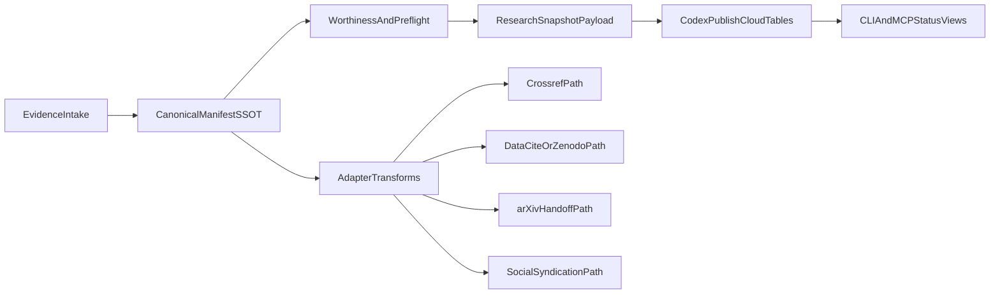

> [!WARNING]
> **ARCHIVED COMPONENT**: This file was archived on 2026-04-13. It is intentionally excluded from active AI context. It must not be referenced for contemporary development.

# SCIENTIA publication-worthiness and SSOT unification research plan

## Current state and completion

- Research completed in this cycle: **38 web searches** + internal map of SCIENTIA/docs/contracts/runtime.
- Goal status: **65% complete** for research/discovery, **0% implementation** (by design).
- This plan converts findings into a staged, evidence-first roadmap that can lead to an implementation plan.

## Key findings (condensed)

- Top venues increasingly converge on: **claim-evidence traceability, reproducibility artifacts, explicit AI-use disclosure, and metadata completeness**.
- Policy consensus (COPE/ICMJE/Nature/Elsevier/arXiv/IEEE/BMJ/JAMA) supports Vox’s existing hard-red-line model and suggests adding finer-grained disclosure fields.
- Publication interoperability is strongest when metadata has a canonical source and is transformed outward (Crossref/DataCite/JATS/CFF/Zenodo/OpenReview), not re-authored per destination.
- Bibliometric APIs (OpenAlex/Semantic Scholar/Crossref) are useful for assistive scoring and triage, but too noisy for hard publication gates.
- Existing Vox foundations are strong: publication manifests + approvals + preflight + worthiness contracts + adapter pathways already exist.

## Internal architecture anchors (SSOT references)

- Worthiness policy/rubric: [`docs/src/reference/scientia-publication-worthiness-rules.md`](docs/src/reference/scientia-publication-worthiness-rules.md)
- Automation boundaries: [`docs/src/architecture/scientia-publication-automation-ssot.md`](docs/src/architecture/scientia-publication-automation-ssot.md)
- Readiness gap analysis: [`docs/src/architecture/scientia-publication-readiness-audit.md`](docs/src/architecture/scientia-publication-readiness-audit.md)
- Contracts: [`contracts/scientia/publication-worthiness.schema.json`](contracts/scientia/publication-worthiness.schema.json), [`contracts/scientia/manifest-completion.schema.json`](contracts/scientia/manifest-completion.schema.json), [`contracts/scientia/scientia-evidence-graph.schema.json`](contracts/scientia/scientia-evidence-graph.schema.json), [`contracts/scientia/distribution.schema.json`](contracts/scientia/distribution.schema.json), [`contracts/scientia/arxiv-handoff.schema.json`](contracts/scientia/arxiv-handoff.schema.json)
- Publisher logic: [`crates/vox-publisher/src/publication_preflight.rs`](crates/vox-publisher/src/publication_preflight.rs), [`crates/vox-publisher/src/publication_worthiness.rs`](crates/vox-publisher/src/publication_worthiness.rs), [`crates/vox-publisher/src/scientific_metadata.rs`](crates/vox-publisher/src/scientific_metadata.rs), [`crates/vox-publisher/src/crossref_metadata.rs`](crates/vox-publisher/src/crossref_metadata.rs), [`crates/vox-publisher/src/zenodo_metadata.rs`](crates/vox-publisher/src/zenodo_metadata.rs), [`crates/vox-publisher/src/submission/mod.rs`](crates/vox-publisher/src/submission/mod.rs)
- DB persistence surfaces: [`crates/vox-db/src/schema/domains/publish_cloud.rs`](crates/vox-db/src/schema/domains/publish_cloud.rs), [`crates/vox-db/src/store/ops_publication/manifest.rs`](crates/vox-db/src/store/ops_publication/manifest.rs)
- CLI/MCP control-plane: [`crates/vox-cli/src/commands/db_cli/publication_subcommands.rs`](crates/vox-cli/src/commands/db_cli/publication_subcommands.rs), [`crates/vox-mcp/src/tools/scientia_tools/lifecycle.rs`](crates/vox-mcp/src/tools/scientia_tools/lifecycle.rs)

## Two skill improvements (research + operator capability)

1. **Publication-grade evidence authoring skill**
   - Build a reusable doc-skill profile for structured claim-evidence authoring (claims, evidence links, seeds, variance, disclosure blocks, limitations).
   - Output target: deterministic sections that map directly into worthiness/preflight fields.
   - Why: improves **generation quality** before scoring.

2. **Venue-policy adaptation skill**
   - Build doc-skill profiles per venue family (journal, preprint, repository, social dissemination) with explicit policy deltas (AI disclosure, figures, anonymization, metadata).
   - Output target: transform-ready policy packets instead of manual rewrites.
   - Why: improves **policy compliance and channel reuse**.

## Two code improvements (automation + detection)

1. **Worthiness-detection accuracy upgrade**
   - Extend scoring to include explicit checks for: seed-count transparency, uncertainty reporting, ablation sufficiency, contamination-risk flags, and citation verifiability confidence.
   - Keep these as soft signals unless policy requires hard fail.
   - Why: improves **precision/recall** for publication-worthiness triage.

2. **Canonical publication metadata graph (single source)**
   - Introduce one canonical internal metadata graph (manifest-centered) that compiles to Crossref/DataCite/Zenodo/arXiv/OpenReview/social payloads.
   - Require profile-aware transformers and schema validation at each edge.
   - Why: removes destination-specific rewriting and enforces SSOT consistency.

## Research questions to answer before implementation

- Which disclosure fields should be first-class in `metadata_json` vs derived per adapter?
- Which signals can become hard gates vs assistive diagnostics only?
- What minimum machine-verifiable evidence set predicts acceptance/readiness across AI + software engineering venues?
- What confidence calibration is needed for external bibliometric enrichment to avoid false certainty?

## Persistence plan (database, not docs-only)

Use Codex publication lifecycle as the persistence substrate (no implementation in this step):

- Persist research outputs as structured artifacts linked to `publication_id` via `metadata_json` extensions and status events.
- Add a typed research snapshot payload concept (schema-backed) for:
  - policy-profile coverage,
  - evidence completeness summary,
  - citation-verification summary,
  - external-signal provenance (source, timestamp, confidence, caveats).
- Persist every recomputation as a new status event row to keep decision history auditable.

## Target architecture (research to implementation)

## Phased execution plan (research phase only)

### Phase 1: Standards-to-signals mapping

- Build a standards matrix from policy sources (COPE/ICMJE/Nature/Elsevier/arXiv/IEEE/JATS/Crossref/DataCite/FAIR/ACM badges/AAAI-NeurIPS checklists).
- Produce a normalized signal catalog: `hard_gate`, `soft_gate`, `diagnostic`, `metadata_required`, `metadata_recommended`.
- Map each signal to current Vox code/contract coverage and identify deltas.

### Phase 2: SSOT shape proposal

- Propose canonical publication metadata graph fields and ownership boundaries.
- Define outward mappings (Crossref/DataCite/Zenodo/arXiv/OpenReview/social) as transformations from one source.
- Define schema evolution/versioning strategy in `contracts/scientia`.

### Phase 3: Detection-quality research

- Design offline benchmark for worthiness classifier quality against historical/public exemplars.
- Evaluate additional signals (citation verification confidence, variance reporting, contamination risk, ablation adequacy).
- Define calibration and false-positive controls for automated pathways.

### Phase 4: Persistence model research

- Propose exact DB artifact model and event semantics for research snapshots in Codex.
- Define backward-compatible storage strategy with current `publication_manifests` lifecycle.
- Draft CLI/MCP read models for transparent operator visibility.

## Deliverables from this research-plan cycle

- Standards-to-signals matrix (publication-quality requirements mapped to machine checks).
- SSOT metadata graph proposal with adapter crosswalk.
- Detection-quality experimental design for worthiness improvements.
- DB persistence blueprint for research snapshots and auditability.
- Explicit non-automatable boundary list for peer-review-era accountability.

## Risks and constraints

- External API signal drift and incomplete metadata can degrade scoring reliability.
- Venue policy changes require versioned policy profiles and periodic refresh.
- Over-automation risk: review/accountability boundaries must remain human-gated.
- Legacy submission channels remain semi-manual in practice; transformations should support handoff quality, not pretend full autonomy.

## Immediate next step

- Convert this research plan into an implementation-plan draft only after approving the signal catalog and canonical metadata graph boundary decisions.
