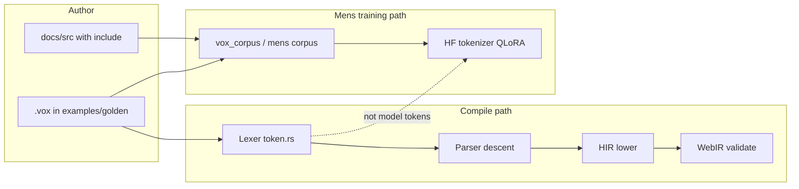

---
status: archived
archived_date: 2026-04-13
training_eligible: false
schema_type: "TechArticle"
title: "Archived Plan: vox_pipeline_and_language_gaps_404418be.plan"
---

> [!WARNING]
> **ARCHIVED COMPONENT**: This file was archived on 2026-04-13. It is intentionally excluded from active AI context. It must not be referenced for contemporary development.

# Vox sources, docs, lexer, and Mens pipeline — gaps and full-stack plan

## Current state (verified)

- **Example policy:** [`examples/examples.ssot.v1.yaml`](examples/examples.ssot.v1.yaml) — all `examples/**/*.vox` must be under `golden/` or `parser-inventory/`; doc `{{#include}}` targets must live under `examples/golden/`.
- **Enforcement:** [`crates/vox-compiler/tests/golden_vox_examples.rs`](crates/vox-compiler/tests/golden_vox_examples.rs) (parse → HIR → WebIR → Syntax-K) and [`crates/vox-compiler/tests/examples_ssot.rs`](crates/vox-compiler/tests/examples_ssot.rs) (includes + orphans).
- **Persistent pipeline doc:** [`docs/src/architecture/vox-source-to-mens-pipeline-ssot.md`](docs/src/architecture/vox-source-to-mens-pipeline-ssot.md) already maps lexer → goldens → docs → corpus → **HF tokenizer** for Mens (vs compile lexer). Populi vs Mens: [`docs/src/architecture/populi-data-pipeline.md`](docs/src/architecture/populi-data-pipeline.md).
- **Goldens:** ~29 files under [`examples/golden/`](examples/golden/) covering UI, HTTP, actors, workflows, MCP, mesh noop, etc. SSOT gap table (scheduled / pure / HTTP errors) is in §5 of the pipeline SSOT page.
- **mdBook `SUMMARY.md`:** Auto-generated by [`crates/vox-doc-pipeline`](crates/vox-doc-pipeline) (`<!-- AUTO-GENERATED ... -->`). Several architecture pages (e.g. [`docs/src/architecture/compiler-ir-pipeline.md`](docs/src/architecture/compiler-ir-pipeline.md), [`ir-emission-ssot.md`](docs/src/architecture/ir-emission-ssot.md), pipeline SSOT) exist with valid frontmatter but **do not appear** in the checked-in [`docs/src/SUMMARY.md`](docs/src/SUMMARY.md) — **SUMMARY is stale** relative to `docs/src/architecture/*.md` (regenerate after lint passes).

## Critical language / doc mismatch (drives “full stack”)

| Surface | mdBook / API | Lexer [`token.rs`](crates/vox-compiler/src/lexer/token.rs) | Parser [`parse_decl` / `parse_fn_decl`](crates/vox-compiler/src/parser/descent/mod.rs) |
|--------|----------------|---------------------|------------------------|
| `@scheduled` | Listed in [`docs/src/SUMMARY.md`](docs/src/SUMMARY.md) API decorators; stub [`docs/src/api/decorators/scheduled.md`](docs/src/api/decorators/scheduled.md) | **No** `AtScheduled` token | **No** arm in `parse_decl`; `Decl::Scheduled` / [`ScheduledDecl`](crates/vox-compiler/src/ast/decl/fundecl.rs) unused by parser |
| `@pure` | API page exists | **No** `AtPure` token | `FnDecl.is_pure` hardcoded **false** in [`parse_fn_decl`](crates/vox-compiler/src/parser/descent/decl/head.rs) |

Lexer [`lex`](crates/vox-compiler/src/lexer/cursor.rs) **drops** unrecognized spans (`Err(_) => None`), so undocumented `@foo` silently disappears—worth documenting in pipeline SSOT and optionally tightening later (non-trivial behavior change).

## Implementation plan (full stack, ordered)

### 1) Documentation navigation and SSOT cross-links (low risk, first merge)

- Run **`cargo run -p vox-doc-pipeline`** from repo root (fix any **lint hard errors** first: raw `.vox` fences, broken `{{#include}}` anchors, unknown frontmatter categories). This refreshes [`docs/src/SUMMARY.md`](docs/src/SUMMARY.md) so **Compiler IR**, **IR emission**, **Vox source → Mens pipeline**, **Populi data pipeline**, etc. appear under **Architecture SSOTs**.
- Tighten cross-links: from [`docs/src/journeys/native-training.md`](docs/src/journeys/native-training.md) (if present), [`docs/src/how-to/examples-corpus.md`](docs/src/how-to/examples-corpus.md), and [`docs/src/explanation/expl-ml-pipeline.md`](docs/src/explanation/expl-ml-pipeline.md) → pipeline SSOT + [`docs/src/reference/mens-training.md`](docs/src/reference/mens-training.md) + [`docs/src/reference/mens-training-data-contract.md`](docs/src/reference/mens-training-data-contract.md).
- Expand stub decorator pages ([`scheduled.md`](docs/src/api/decorators/scheduled.md), [`pure.md`](docs/src/api/decorators/pure.md) if thin) using **`{{#include}}`** from new goldens once they exist (AGENTS.md hygiene).

### 2) Lexer: dedicated tokens for documented decorators

- In [`crates/vox-compiler/src/lexer/token.rs`](crates/vox-compiler/src/lexer/token.rs), add **`#[token("@pure")]`**, **`#[token("@scheduled")]`**, and any other API-listed decorators that should be first-class (e.g. **`@deprecated`** if used on `fn`). Mirror in `Display` impl.
- Extend [`crates/vox-compiler/src/lexer/cursor.rs`](crates/vox-compiler/src/lexer/cursor.rs) unit tests with token streams for the new decorators (keep existing `@component` coverage).

### 3) Parser: wire `@pure` / `@deprecated` on functions

- In [`parse_fn_decl`](crates/vox-compiler/src/parser/descent/decl/head.rs), extend the **pre-`fn` attribute loop** (same block as `Token::AtRequire`) to consume **`AtPure`** → `is_pure = true`, **`AtDeprecated`** → `is_deprecated = true` (field already exists on [`FnDecl`](crates/vox-compiler/src/ast/decl/fundecl.rs)).
- Update [`recover_to_top_level`](crates/vox-compiler/src/parser/descent/mod.rs) and any **`parse_decl`** / `async` / `pub` inner matches so new tokens do not break recovery (mirror `AtRequire` lists).

### 4) Parser + lowering: `@scheduled` end-to-end

- Implement **`parse_scheduled`**: e.g. `@scheduled("1h") fn name(...) { ... }` aligned with [`ScheduledDecl`](crates/vox-compiler/src/ast/decl/fundecl.rs) (reuse string-literal patterns from [`parse_test`](crates/vox-compiler/src/parser/descent/decl/head.rs)).
- Add **`Token::AtScheduled`** arm to **`parse_decl`** and **`recover_to_top_level`**.
- **HIR lowering:** locate module lowering entry (e.g. [`crates/vox-compiler/src/hir/lower/mod.rs`](crates/vox-compiler/src/hir/lower/mod.rs) or equivalent) and either **lower `Decl::Scheduled` into existing `module.scheduled`** (see [`hir/dead_code.rs`](crates/vox-compiler/src/hir/dead_code.rs)) or emit a **clear diagnostic** if runtime support is intentionally not wired yet (prefer real lowering if `module.scheduled` is already consumed downstream).
- **Typecheck / WebIR:** ensure scheduled functions pass the same pipeline gates as other goldens (or mark feature behind a lint until WebIR supports it—**golden tests must stay green**).

### 5) Golden examples and SSOT table update

- Add **`examples/golden/ref_effects.vox`** — minimal `fn` with `@pure`, `@require(...)`, maybe `@ensure` regions for doc includes.
- Add **`examples/golden/scheduled_tick.vox`** — minimal `@scheduled("...") fn ...` once lowering validates.
- Update §5 table in [`vox-source-to-mens-pipeline-ssot.md`](docs/src/architecture/vox-source-to-mens-pipeline-ssot.md) to reflect new coverage; optionally add **`examples/golden/http_error_mapping.vox`** later if error patterns need a dedicated file.

### 6) CI and grammar export

- Run **`cargo test -p vox-compiler --test golden_vox_examples`** and **`examples_ssot`** after each milestone.
- If CI runs **grammar export / syntax-k** gates, update generated artifacts or contracts as required by existing workflows (see [`crates/vox-grammar-export`](crates/vox-grammar-export) and repo CI docs).

### 7) Language surface SSOT alignment

- Update [`docs/src/architecture/language-surface-ssot.md`](docs/src/architecture/language-surface-ssot.md) (and any MCP introspection merge lists if applicable per that doc) so **documented decorators = lexer + parser** for the ones you implement.

## Risks and mitigations

- **WebIR / runtime gaps:** If `@scheduled` cannot be represented in WebIR yet, ship **parser + typecheck-only** support with a targeted error at lowering **or** complete lowering—**do not** merge a parser that produces goldens that fail `golden_vox_examples`.
- **Lexer silent skip:** Document in pipeline SSOT; changing `lex` to error on bad spans is a **separate** behavioral change—defer unless explicitly desired.

## Success criteria

- `cargo run -p vox-doc-pipeline` succeeds; **SUMMARY** lists pipeline + IR SSOT pages.
- `cargo test -p vox-compiler --test golden_vox_examples` and **`examples_ssot`** pass with new goldens.
- `@pure` / `@scheduled` behave consistently in lexer, parser, and (where applicable) HIR; mdBook decorator pages reference real goldens.

