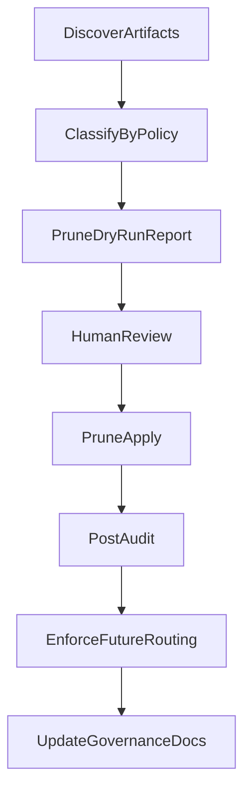

---
status: archived
archived_date: 2026-04-13
training_eligible: false
schema_type: "TechArticle"
title: "Archived Plan: workspace_artifact_cleanup_b9c47c85.plan"
---

> [!WARNING]
> **ARCHIVED COMPONENT**: This file was archived on 2026-04-13. It is intentionally excluded from active AI context. It must not be referenced for contemporary development.

# Workspace Artifact Cleanup and Prevention (Approved With Revisions)

## Approval Verdict on Old Plan

The old plan is directionally correct but not implementation-safe as written. It is approved only with these corrections:

- Keep: policy-first cleanup objective, mens retention concern, and prevention via routing away from ad-hoc repo-root `target-*`.
- Reject/replace: creating a new standalone `crates/vox-cli/src/commands/clean.rs` as primary solution (current `clean.rs` is unwired and would not fix reachability by itself).
- Correct: prevention must change actual target-dir assignment callsites, not only `.gitignore` and review ignores.
- Correct: cleanup must be dry-run first, class-based, and policy-driven (age+size), not only regex deletes.

## Ground Truth Discovered (Used as Plan Constraints)

- Canonical Cargo target is forced by `[c:\Users\Owner\vox\.cargo\config.toml](c:/Users/Owner/vox/.cargo/config.toml)` (`CARGO_TARGET_DIR = "target"`).
- Additional target trees are still created by explicit env overrides in CI/gate helpers, especially `[c:\Users\Owner\vox\crates\vox-cli\src\commands\ci\run_body_helpers\matrix.rs](c:/Users/Owner/vox/crates/vox-cli/src/commands/ci/run_body_helpers/matrix.rs)`.
- Script lanes already avoid repo-root target sprawl by using user-scoped paths (`~/.vox/script-target*`) and per-cache build targets in `[c:\Users\Owner\vox\crates\vox-cli\src\commands\runtime\run\backend\native.rs](c:/Users/Owner/vox/crates/vox-cli/src/commands/runtime/run/backend/native.rs)`, `[c:\Users\Owner\vox\crates\vox-cli\src\build_lock.rs](c:/Users/Owner/vox/crates/vox-cli/src/build_lock.rs)`.
- Current cleanup surfaces are fragmented and partially unwired (`clean.rs` not exported from `[c:\Users\Owner\vox\crates\vox-cli\src\commands\mod.rs](c:/Users/Owner/vox/crates/vox-cli/src/commands/mod.rs)`).
- Governance guidance contains literal examples that drift from `.gitignore` reality (for example `check_err*.log` vs root ignore patterns).

## Design Decisions Locked

- Target routing: **approved hybrid default**
  - Script lanes stay in `~/.vox/`*.
  - Transient CI/agent isolated targets move to OS temp.
  - Repo root keeps canonical `target/` plus explicit logs only.
- Mens retention: **age+size policy** (not name-only retention).

## Implementation Blueprint (No Hidden Operations)

### Phase 1 - Add a Single Artifact Policy Model (code SSOT)

1. Create new policy module for artifact classes and allowed write roots:
  - `[c:\Users\Owner\vox\crates\vox-cli\src\artifact_policy.rs](c:/Users/Owner/vox/crates/vox-cli/src/artifact_policy.rs)` (new)
2. Implement explicit enums/structs:
  - `ArtifactClass` (`WorkspaceTarget`, `TransientTarget`, `MensRun`, `MensLog`, `ScriptCache`, `ScratchLog`, `StaleRename`).
  - `TargetLane` (`CanonicalWorkspace`, `CiNested`, `GateIsolated`, `ScriptNative`, `ScriptWasi`).
  - `RetentionPolicy` with concrete fields (`max_age_days`, `max_total_bytes`, `min_keep`, `protected_names`).
3. Implement path constructors (no string concat; `PathBuf::join` only):
  - `canonical_workspace_target(root) -> root/target`
  - `ci_nested_target(root) -> temp/vox-targets/<repo-hash>/nested-ci`
  - `gate_isolated_target(root) -> temp/vox-targets/<repo-hash>/mens-gate-safe`
4. Implement `is_allowed_artifact_path(path, root)` guard:
  - Allowed: `root/target`, `root/target/mens-gate-logs`, OS temp `vox-targets/`*, `~/.vox/`*, and policy-declared mens roots.
  - Denied: arbitrary repo-root `target-*` siblings and unknown side roots.
5. Add targeted debug logging whenever routing resolves a target path:
  - log lane, resolved path, and reason (`canonical`, `temp-isolation`, `script-cache`).

### Phase 2 - Rewire Target-Dir Producers to Policy Helpers

1. Update CI nested target resolution in `[c:\Users\Owner\vox\crates\vox-cli\src\commands\ci\run_body_helpers\matrix.rs](c:/Users/Owner/vox/crates/vox-cli/src/commands/ci/run_body_helpers/matrix.rs)`:
  - Replace `root.join("target").join("nested-ci")` fallback with `artifact_policy::ci_nested_target(root)`.
2. Update isolated mens gate default build target in same file:
  - Replace default `root/target/mens-gate-safe` with `artifact_policy::gate_isolated_target(root)`.
  - Keep `--gate-build-target-dir` override behavior unchanged.
3. Keep script lane behavior in `[c:\Users\Owner\vox\crates\vox-cli\src\commands\runtime\run\backend\native.rs](c:/Users/Owner/vox/crates/vox-cli/src/commands/runtime/run/backend/native.rs)` and `[c:\Users\Owner\vox\crates\vox-cli\src\build_lock.rs](c:/Users/Owner/vox/crates/vox-cli/src/build_lock.rs)` intact, but route any future overrides through policy APIs.
4. Add validation in `[c:\Users\Owner\vox\crates\vox-cli\src\build_service.rs](c:/Users/Owner/vox/crates/vox-cli/src/build_service.rs)`:
  - Before applying `CARGO_TARGET_DIR`, validate with `is_allowed_artifact_path` when workspace context is available.
  - On invalid path: emit warning and fail fast with actionable error.

### Phase 3 - Introduce Reachable Cleanup/Audit CLI (Dry-run First)

1. Add a reachable command under existing CI surface (avoid orphan command path):
  - New file: `[c:\Users\Owner\vox\crates\vox-cli\src\commands\ci\workspace_artifacts.rs](c:/Users/Owner/vox/crates/vox-cli/src/commands/ci/workspace_artifacts.rs)`
2. Add two subcommands in CI command enums/dispatch:
  - `vox ci artifact-audit [--json]`
  - `vox ci artifact-prune --dry-run|--apply [--policy <path>]`
3. Wire command enums and dispatch in:
  - `[c:\Users\Owner\vox\crates\vox-cli\src\commands\ci\cmd_enums.rs](c:/Users/Owner/vox/crates/vox-cli/src/commands/ci/cmd_enums.rs)`
  - `[c:\Users\Owner\vox\crates\vox-cli\src\commands\ci\mod.rs](c:/Users/Owner/vox/crates/vox-cli/src/commands/ci/mod.rs)`
  - `[c:\Users\Owner\vox\crates\vox-cli\src\commands\ci\run_body.rs](c:/Users/Owner/vox/crates/vox-cli/src/commands/ci/run_body.rs)`
4. Artifact audit must emit explicit classed inventory rows:
  - path, class, bytes, age_days, last_modified, tracked/untracked, delete_candidate(boolean), delete_reason.
5. Artifact prune behavior (fully explicit):
  - Refuse to run without `--apply` or `--dry-run`.
  - Always run internal `git ls-files --error-unmatch` check before deleting; skip any tracked path.
  - Never follow symlinks.
  - Delete classes in order: stale renamed targets -> transient temp targets over policy -> mens runs over policy -> scratch logs.
  - On Windows lock failure: rename to `<name>.stale-<timestamp>` then continue.
  - Emit final reclaimed bytes and per-class deletion counts.

### Phase 4 - Mens Age+Size Retention Contract

1. Add policy contract file:
  - `[c:\Users\Owner\vox\contracts\operations\workspace-artifact-retention.v1.yaml](c:/Users/Owner/vox/contracts/operations/workspace-artifact-retention.v1.yaml)` (new)
2. Mens retention fields (explicit):
  - `mens.max_age_days`
  - `mens.max_total_bytes`
  - `mens.min_keep`
  - `mens.protected_names` (empty default allowed)
  - `mens.latest_pointer` (`mens/runs/latest`)
3. Prune algorithm order:
  - Resolve all run dirs under `mens/runs/*`.
  - Preserve `latest` target resolution and `protected_names`.
  - Sort remaining by mtime descending.
  - Keep first `min_keep` regardless of age.
  - Mark all over `max_age_days` for deletion.
  - If total bytes still exceed `max_total_bytes`, delete oldest remaining candidates until under cap.
4. Add guardrail:
  - If policy would delete all non-protected runs, keep newest one and emit warning.

### Phase 5 - Documentation and Governance Realignment (Pattern-Based)

1. Update `[c:\Users\Owner\vox\docs\agents\governance.md](c:/Users/Owner/vox/docs/agents/governance.md)`:
  - Replace literal filename examples with policy categories.
  - State root `.gitignore` is pattern SSOT.
  - Replace stale literal examples that drift from current ignores.
2. Update `[c:\Users\Owner\vox\AGENTS.md](c:/Users/Owner/vox/AGENTS.md)`:
  - Add explicit artifact policy pointer under operational surfaces (scratch/build/output sprawl prevention).
3. Update contributor continuation guidance in `[c:\Users\Owner\vox\docs\src\contributors\continuation-prompt-engineering.md](c:/Users/Owner/vox/docs/src/contributors/continuation-prompt-engineering.md)`:
  - Replace `.cursor/agent_state.md` suggestion with policy-approved scratch locations.
4. Keep `.gitignore` broad and category-based; do not add one-off literal names unless justified.

### Phase 6 - Compliance and Registry Wiring (Required for New CLI Surface)

1. Update command catalog contract:
  - `[c:\Users\Owner\vox\contracts\operations\catalog.v1.yaml](c:/Users/Owner/vox/contracts/operations/catalog.v1.yaml)`
2. Regenerate command registry and references via project CI sync flow.
3. Update CLI reference docs:
  - `[c:\Users\Owner\vox\docs\src\reference\cli.md](c:/Users/Owner/vox/docs/src/reference/cli.md)`
4. If introducing new top-level reachability requirements, update:
  - `[c:\Users\Owner\vox\docs\src\architecture\cli-reachability-ssot.md](c:/Users/Owner/vox/docs/src/architecture/cli-reachability-ssot.md)`

### Phase 7 - Verification Sequence (Exact, in Order)

1. `cargo check --workspace`
2. `cargo test -p vox-cli` (targeted tests for routing and prune planner)
3. `cargo run -p vox-cli -- ci command-compliance`
4. `cargo run -p vox-cli -- ci operations-verify`
5. `cargo run -p vox-cli -- ci artifact-audit --json` (snapshot before prune)
6. `cargo run -p vox-cli -- ci artifact-prune --dry-run --policy contracts/operations/workspace-artifact-retention.v1.yaml`
7. Human review of dry-run report
8. `cargo run -p vox-cli -- ci artifact-prune --apply --policy contracts/operations/workspace-artifact-retention.v1.yaml`
9. `cargo run -p vox-cli -- ci artifact-audit --json` (after snapshot)
10. Compare reclaimed bytes and residual classes.

## Safety Rules (Mandatory)

- Never delete tracked files.
- Never delete outside policy-approved roots.
- Dry-run is mandatory before apply.
- Every delete action logs path + reason + class.
- Prune is idempotent (second run should report near-zero deletes).

## Implementation Progress Tracking

- Current status toward original goals: **35% complete** (research, critique, routing decision, retention decision complete; no code execution started).
- Remaining to reach 100%: phases 1 through 7 implementation and verification.

## Execution Flow Diagram

