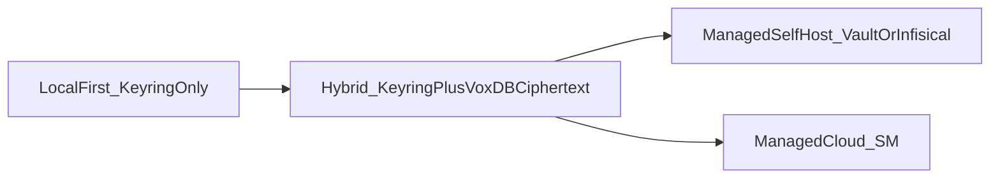

# Clavis secrets, env vars, and API key strategy research 2026

> **See also:** [Clavis as a one-stop secrets manager: research findings 2026](clavis-one-stop-secrets-research-2026.md) — extends this document with a complete env-var taxonomy, user-facing feature requirements, AI-agent credential isolation design, A2A delegation via RFC 8693, competitive gap analysis, and an 8-wave implementation roadmap.
>
> **Implementation plan:** [Clavis V2: Full Implementation Plan (2026)](clavis-implementation-plan-2026.md) — codebase-verified plan translating the research into concrete data structures, SQL schema, CLI surface, and 8-wave execution order.

Implementation support docs:

- [Clavis Cloudless Threat Model V1](clavis-cloudless-threat-model-v1.md)
- [Clavis Cloudless Implementation Catalog](clavis-cloudless-implementation-catalog.md)
- [Clavis Cloudless Ops Runbook](../operations/clavis-cloudless-ops-runbook.md)
- [Clavis Break-Glass Runbook](../operations/clavis-break-glass-runbook.md)

## Purpose

This document is a research dossier for evolving `vox-clavis` from a strong environment-variable-first baseline into a more durable, auditable, and AI-era-safe secret management system.

It is intentionally research-only. It does not define migrations, schema diffs, rollout sequencing, or implementation commits.

## Scope and non-goals

### In scope

- The most persistent friction points with environment-variable and API key management in modern teams.
- AI-agent-era risks (prompt injection and context leakage) that change secret-handling assumptions.
- Key-sprawl reduction strategies that preserve capability.
- Maintainability and SSOT improvements for Clavis and adjacent Vox surfaces.
- VoxDB account-level persistence considerations and trust boundaries.
- Candidate Rust ecosystem dependencies for optional backend support.

### Out of scope

- Immediate code changes to resolver precedence, `SecretId` inventory, or backend wiring.
- A final architecture decision on cloud-vault vs local-only storage policy.
- Concrete policy enforcement changes in `vox ci` beyond current guards.

## Executive summary

Vox already has a healthy Clavis foundation:

- Canonical metadata in `crates/vox-clavis/src/lib.rs`.
- Clear resolution precedence and compatibility tiers.
- CI enforcement (`secret-env-guard`, `clavis-parity`) for drift prevention.

The main strategic risk is no longer "missing secret support." It is fragmentation and leakage pressure across an expanding AI + automation surface:

1. Too many static credentials across domains (LLM, GPU providers, publication adapters, mesh, telemetry, DB, webhooks).
2. AI toolchains increase the chance that resolved secrets can leak into prompts, tool output, traces, and logs.
3. Environment variables remain useful but weak for lifecycle controls (rotation, auditability, and cross-machine consistency).

The recommended direction is a layered model:

- Keep Clavis as metadata and lookup SSOT.
- Reduce key count where possible via gateway and workload identity patterns.
- Distinguish irreducible domains where multiple credentials remain necessary.
- Add explicit redaction and secret-boundary rules for agent-facing data paths.
- Define account-scoped persistence policy for VoxDB with envelope encryption and role-scoped access semantics.

## As-built Vox Clavis baseline (code-grounded)

These files form the current architecture baseline:

- `crates/vox-clavis/src/lib.rs` defines `SecretId`/`SecretSpec`, canonical env names, aliases, deprecation, and requirement bundles.
- `crates/vox-clavis/src/resolver.rs` implements precedence (`env -> backend -> secure/compat stores`) and status reporting.
- `crates/vox-clavis/src/lib.rs` controls backend mode selection (`Auto`, `EnvOnly`, `Infisical`, `Vault`, `VoxCloud`).
- `crates/vox-clavis/src/backend/vox_vault.rs` provides encrypted vault behavior backed by local file or Turso remote connection.
- `crates/vox-clavis/src/sources/auth_json.rs` manages `~/.vox/auth.json` and secure keyring-backed token indirection.
- `crates/vox-cli/src/commands/ci/run_body_helpers/guards.rs` enforces `secret-env-guard` and `clavis-parity`.
- `crates/vox-db/src/secrets.rs` exposes a parallel keyring API surface that should be kept in explicit contract with Clavis boundaries.

Current SSOT documentation is `docs/src/reference/clavis-ssot.md`.

## C-L-A-V-I-S working mnemonic (research lens)

The codebase does not define this acronym formally. For this dossier, use it as an analytical lens:

- **C - Canonical metadata:** `SecretId` and canonical/alias naming policy.
- **L - Lookup precedence:** deterministic resolver order and compatibility semantics.
- **A - Auth sources:** backend + keyring + auth file + compatibility stores.
- **V - Vault backends:** local encrypted store and remote secret systems.
- **I - Integration boundaries:** CLI/MCP/runtime/database/publication/tooling surfaces.
- **S - SSOT governance:** docs parity, deprecation lifecycle, CI guardrails.

## Industry pain points: why env-var secrets remain annoying

### Lifecycle and auditability limitations

Environment variables are still simple and portable, but they do not natively provide:

- Read audit trails ("who accessed which secret, when").
- Rotation orchestration and expiry policy.
- Versioning and rollback of secret values.
- Drift detection across local, CI, and deployed environments.

Sources:

- [OWASP Secrets Management Cheat Sheet](https://cheatsheetseries.owasp.org/cheatsheets/Secrets_Management_Cheat_Sheet.html)
- [Twelve-Factor config guidance](https://12factor.net/config)
- [Doppler analysis on env-var production limits](https://www.doppler.com/blog/environment-variables-secrets-management)

### Exposure surface

- Env vars can leak via process inspection, crash dumps, shell history, and accidental logs.
- Repository leaks remain frequent; push-time scanning has become a baseline requirement.

Sources:

- [OWASP NHI Top 10: Secret leakage](https://owasp.org/www-project-non-human-identities-top-10/2025/2-secret-leakage/)
- [GitHub push protection docs](https://docs.github.com/en/code-security/secret-scanning/working-with-secret-scanning-and-push-protection)
- [GitHub changelog: configurable push-protection patterns (GA)](https://github.blog/changelog/2025-08-19-secret-scanning-configuring-patterns-in-push-protection-is-now-generally-available)

### Config-vs-credentials confusion

The classic guidance ("config in env vars") remains valid for non-sensitive deployment tuning, but modern practice increasingly separates credentials from generic config and applies stricter controls to credentials.

Source:

- [Configuration, credentials, and code (Beyond Twelve-Factor)](https://www.oreilly.com/content/configuration-credentials-and-code-in-cloud-native-apps/)

## 2026 AI-era threat model deltas

### Prompt injection + tool access multiplies blast radius

In agentic systems, untrusted content can influence tool calls and retrieval chains. This changes secret assumptions:

- Not enough to "store securely"; must also prevent secret propagation into model-visible context.
- Capability metadata should be separated from secret material.
- Any accidental secret inclusion in prompt context may propagate to third-party model logs.

Sources:

- [OWASP LLM Prompt Injection Prevention Cheat Sheet](https://cheatsheetseries.owasp.org/cheatsheets/LLM_Prompt_Injection_Prevention_Cheat_Sheet.html)
- [OpenClaw issue discussing API key exposure in model context](https://github.com/openclaw/openclaw/issues/11202)

### MCP local vs remote implications

- Local stdio MCP has an implicit trust boundary (host process owner).
- Remote MCP should favor OAuth 2.1 + PKCE and avoid query-parameter secrets.

Sources:

- [MCP specification](https://modelcontextprotocol.io/specification/latest/basic)
- [MCP registry auth guidance](https://modelcontextprotocol.io/registry/authentication)
- [MCP auth hardening overview](https://book.zuplo.com/learning-center/securing-mcp-servers-auth)

## Secret inventory stress-test: what can be reduced vs what is irreducible

### Domains currently represented in Clavis inventory

- LLM provider keys and compatibility aliases.
- Cloud GPU provider keys.
- Publication/syndication adapters (GitHub, Zenodo, OpenReview, Crossref, social APIs).
- Vox platform tokens (mesh roles/JWT/HMAC/runtime ingress).
- VoxDB/Turso credentials.
- Telemetry upload secrets.
- Webhook verification/authentication secrets.

### Reduction opportunities

1. **Inference routing consolidation**
   - Keep OpenRouter-first as default cloud gate where suitable.
   - Optionally add self-hosted unified gateway pattern for enterprises requiring stronger governance.
2. **Identity-first cloud auth**
   - Prefer workload identity and short-lived credentials where available.
3. **Token class simplification**
   - Split "operator bootstrap tokens" from "runtime service credentials" from "per-account user BYOK material" so each class has clear lifecycle and storage expectations.

### Likely irreducible categories

- Publication adapters using platform-specific OAuth/token contracts.
- GPU providers where no common broker fully replaces provider-native credentials.
- Cross-boundary webhook verification material.
- Mesh/routing auth when role-specific isolation is required.

## Strategy to reduce key count while preserving power

### 1) Multi-provider gateway as default abstraction layer

- Use one Clavis-managed gateway credential for common LLM workloads.
- Keep direct provider keys optional for advanced use cases, fallback, or compliance constraints.
- Gate direct-provider mode behind explicit profile/capability flags.

Supporting references:

- [LiteLLM gateway pattern](https://github.com/BerriAI/litellm)
- [AWS multi-provider generative AI gateway guidance](https://aws.amazon.com/solutions/guidance/multi-provider-generative-ai-gateway-on-aws)
- [LLM traffic governance concepts](https://www.solo.io/topics/ai-connectivity/llm-traffic-governance-gateway-strategies-for-secure-ai)

### 2) Move from static keys to short-lived identity where possible

- AWS: IAM Roles Anywhere or workload identity for non-AWS runtimes.
- Azure: Managed Identity where workloads run on Azure.
- GCP: Workload Identity Federation replacing service account keys.

Supporting references:

- [AWS IAM Roles Anywhere](https://aws.amazon.com/iam/roles-anywhere/)
- [Azure Managed Identities overview](https://learn.microsoft.com/en-us/azure/active-directory/managed-identities-azure-resources/overview)
- [Google Workload Identity Federation](https://cloud.google.com/iam/docs/workload-identity-federation)

### 3) Dynamic secrets for databases and high-value services

- Prefer generated, short-TTL credentials from a vault backend for DB-like integrations.
- Use static long-lived credentials only when dynamic issuance is unavailable.

Supporting reference:

- [HashiCorp Vault dynamic database credentials](https://developer.hashicorp.com/vault/tutorials/db-credentials/database-secrets)

## Maintainability and SSOT improvements for Clavis

### Keep one contract, many adapters

Maintain `SecretSpec` as the canonical control plane and treat backends as pluggable retrieval adapters. This keeps naming policy, required/optional semantics, deprecation windows, and docs parity centralized.

### Clarify the `vox-db::secrets` boundary

Document and enforce one of two explicit outcomes:

1. `vox-db::secrets` is a narrow low-level primitive and all product secret policy remains in Clavis; or
2. `vox-db::secrets` callsites migrate behind Clavis APIs to avoid dual behavior surfaces.

Unowned overlap should be considered an SSOT risk.

### Expand CI checks from parity to data-flow safety

Current checks already prevent direct env reads and docs drift. Future enforcement candidates:

- Secret value redaction checks in structured logs and telemetry.
- Guardrails preventing `ResolvedSecret` serialization to user/model-visible channels.
- Additional policy checks for deprecated alias removal readiness.

## VoxDB account-level persistence: research directions

Account-level persistence should start with explicit threat-model choices:

1. Device-local trust only (keyring-backed, optional cloud sync disabled).
2. Account-synced encrypted vault (VoxDB/Turso stores ciphertext only; master key outside DB rows).
3. Hybrid (local default; optional account sync for selected secrets/classes).

Research criteria:

- Secret classification by blast radius.
- Key hierarchy and envelope encryption design.
- Rotation semantics and credential version tracking.
- Access controls per account/workspace/profile.
- Incident response path (revoke, rotate, invalidate, replay-safe propagation).

## Rust ecosystem options (appendix for future implementation)

These are candidates, not commitments:

- Existing baseline in `vox-clavis`: `secrecy`, `keyring`, `aes-gcm`, `blake3`, `turso`.
- HashiCorp Vault client: [`vaultrs`](https://crates.io/crates/vaultrs).
- AWS Secrets Manager: [`aws-sdk-secretsmanager`](https://crates.io/crates/aws-sdk-secretsmanager).
- Google Secret Manager: [`google-cloud-secretmanager-v1`](https://crates.io/crates/google-cloud-secretmanager-v1).
- Linux secret service internals: [`secret-service`](https://docs.rs/secret-service/latest/secret_service/).
- Memory hygiene support: [`secrecy` docs](https://docs.rs/secrecy/latest/secrecy/), [`zeroize` docs](https://docs.rs/zeroize/latest/zeroize/).

Guidance:

- Keep backend crates behind optional features to control compile and MSRV impact.
- Preserve deterministic fallback behavior when optional backends are not enabled.

## Security issues to address explicitly

1. **Secret-in-context leaks for AI paths** (prompt/tool serialization boundaries).
2. **Secret-in-log leaks** (including debug, telemetry, panic messages).
3. **Static key overuse where identity federation is available.**
4. **Dual-storage ambiguity** (`vox-db` keyring helpers vs Clavis-managed surfaces).
5. **Rotation gaps for optional integrations** (social/publisher/provider keys with long lifetimes).
6. **Insufficient metadata on secret lifecycle state** (age, source, rotation status, owner, scope).

## Greenfield feasibility proof (code-evidenced)

### Conclusion

**Yes, greenfield cutover is feasible**, but only with explicit compatibility cuts accepted up front.  
If compatibility aliases and parallel env paths are not preserved, current users relying on those paths will break immediately by design.

### Evidence: where secret-like env reads still bypass Clavis

1. **Clavis itself is env-first by design**
   - `crates/vox-clavis/src/lib.rs` (`resolve_secret`) auto-selects backend based on env probes (`VOX_TURSO_URL`, `INFISICAL_*`, `VAULT_*`) before fallback.
   - `crates/vox-clavis/src/sources/env.rs` resolves canonical env, aliases, and deprecated aliases.
2. **DB credential path remains parallel**
   - `crates/vox-db/src/config.rs` reads `VOX_DB_*` and compatibility aliases (`VOX_TURSO_*`, `TURSO_*`) directly.
3. **MCP HTTP gateway tokens are env-only today**
   - `crates/vox-orchestrator/src/mcp_tools/http_gateway.rs` reads `VOX_MCP_HTTP_BEARER_TOKEN` and `VOX_MCP_HTTP_READ_BEARER_TOKEN`.
4. **Runtime model registry can read arbitrary api_key env names**
   - `crates/vox-runtime/src/llm/types.rs` checks `api_key_env` via `std::env::var` before provider-specific Clavis fallback.
5. **Publisher OpenReview path is mixed**
   - `crates/vox-publisher/src/publication_preflight.rs` reads `OPENREVIEW_ACCESS_TOKEN` / `VOX_OPENREVIEW_ACCESS_TOKEN` directly while also using Clavis for email/password.
6. **Orchestrator still reads social credentials directly**
   - `crates/vox-orchestrator/src/config/impl_env.rs` reads `VOX_SOCIAL_REDDIT_*` and `VOX_SOCIAL_YOUTUBE_*`.
7. **CI already enforces a partial boundary**
   - `crates/vox-cli/src/commands/ci/run_body_helpers/guards.rs` has `secret-env-guard` and `clavis-parity`, proving policy intent but not total migration completion.

### Breakpoints if compatibility is intentionally skipped

- Existing env-only deployments using Turso legacy aliases fail immediately.
- MCP HTTP deployments expecting `VOX_MCP_HTTP_*TOKEN` envs fail auth startup if not remapped.
- Runtime registry entries that rely on `api_key_env` fail provider auth unless replaced.
- OpenReview token-only paths fail unless a Clavis-native equivalent is introduced.
- Orchestrator social integrations fail unless Clavis-backed loading is wired consistently.

### Minimal guardrails required even in greenfield mode

- Keep one documented "hard cut" release boundary and reject legacy secret names at startup.
- Fail-closed secret resolution for production profiles (missing/invalid secret must stop action).
- Enforce no-secret-in-context/no-secret-in-logs checks in CI for MCP/runtime/tool outputs.
- Require explicit source annotation for each secret read path (`Clavis`, `keyring`, `vault`, `none`).

## 2026 platform decision matrix for Vox Cloudless

Compliance and liability notes below are technical risk framing, not legal advice.

| Platform | Capability depth | Rust integration path | Lock-in | Operational burden | Compliance/liability posture | Cloudless fit | AI-agent leakage risk profile |
| --- | --- | --- | --- | --- | --- | --- | --- |
| HashiCorp Vault | Very high (dynamic secrets, PKI, transit, policy) | HTTP API / optional `vaultrs` | Medium-high | High (HA, unseal, policy ops) | Strong control if operated well; ops failures are your liability | High (self-host) | Low-moderate if strict policy/redaction; high if broad token scopes |
| OpenBao (Vault-compatible fork) | High (Vault-style model) | HTTP API / Vault-compatible clients | Medium | High | Similar to Vault; self-host governance burden remains | High (self-host) | Similar to Vault; depends on policy discipline |
| Infisical (self-host/cloud) | High for app secrets and team workflows | HTTP API / existing Clavis backend direction | Medium | Medium | Better DX; self-host shifts liability to operator, SaaS shifts trust to vendor | High for self-host, medium for SaaS | Moderate; strong if centralized policy + short-lived access tokens |
| AWS Secrets Manager | High in AWS-centric estates | AWS SDK / HTTP + IAM | High | Low-medium (in AWS) | Strong cloud-native controls; vendor + IAM misconfig risk | Low-medium (not cloudless-first) | Moderate; strong server-side controls, but cross-env copying remains risk |
| Azure Key Vault | High in Azure-centric estates | Azure SDK / HTTP + Entra ID | High | Low-medium (in Azure) | Strong enterprise posture in Azure; identity/RBAC hygiene required | Low-medium | Moderate; similar to AWS pattern |
| GCP Secret Manager | High in GCP-centric estates | GCP SDK / HTTP + IAM | High | Low-medium (in GCP) | Strong in GCP compliance envelope; IAM complexity remains | Low-medium | Moderate; similar to AWS/Azure pattern |
| Doppler | Medium-high (excellent env distribution workflow) | CLI/API integration | High | Low | Vendor-managed security posture; contractual/vendor dependency | Low for strict cloudless | Moderate; centralization helps, but downstream prompt/log boundaries still yours |
| 1Password Secrets Automation | Medium (strong team secret workflows, less dynamic infra auth) | CLI/API/Connect server | Medium-high | Low-medium | Strong for org workflows; vendor dependence and service-account model | Medium | Moderate; good human+machine hygiene, still needs output redaction controls |
| SOPS + age | Medium (great static secret files, weaker dynamic issuance) | CLI-driven workflow (not runtime API-first) | Low-medium | Medium (process-heavy) | Strong Git history controls if managed well; key custody risk on operator | High | Moderate-high if decrypted artifacts leak in CI/tool logs |
| OS keyring only | Low-medium (device-local only) | Existing `keyring` crate usage | Medium (OS APIs) | Low | Good local boundary; weak central audit/revocation | High local-only | Moderate; local safety good, team-scale governance weak |

### Sources for platform matrix

- [HashiCorp Vault docs](https://developer.hashicorp.com/vault/docs)
- [OpenBao](https://openbao.org/)
- [Infisical](https://infisical.com/) and [Infisical GitHub](https://github.com/Infisical/infisical)
- [AWS Secrets Manager](https://aws.amazon.com/secrets-manager/)
- [Azure Key Vault](https://azure.microsoft.com/products/key-vault)
- [Google Secret Manager](https://cloud.google.com/security/products/secret-manager)
- [Doppler pricing/product](https://www.doppler.com/pricing)
- [1Password Secrets Automation](https://developer.1password.com/docs/secrets-automation)
- [SOPS](https://github.com/getsops/sops)
- [age](https://github.com/FiloSottile/age)

## Vox Cloudless operating models

### Local-first (KeyringOnly)

- **Secret classes owned:** local developer/provider keys, short-lived sandbox credentials.
- **Blast radius:** device compromise + local process leakage.
- **Operator burden:** low.
- **Developer ergonomics:** high for single-user/dev machines; weak for team sharing/rotation/audit.

### Hybrid (Keyring + VoxDB ciphertext)

- **Secret classes owned:** account-scoped keys, cross-device sync classes, policy metadata.
- **Blast radius:** account compromise can expose encrypted corpus if key hierarchy is weak.
- **Operator burden:** medium.
- **Developer ergonomics:** strong balance; one control plane with local bootstrap.

### Managed self-host (Vault/Infisical backend)

- **Secret classes owned:** production/system secrets requiring policy and audit controls.
- **Blast radius:** backend compromise can be broad without segmentation.
- **Operator burden:** high (especially Vault-class operations).
- **Developer ergonomics:** medium-high after setup; high policy power.

### Managed cloud secret manager

- **Secret classes owned:** cloud-native runtime credentials in a single cloud boundary.
- **Blast radius:** IAM/policy mistakes can cross workloads quickly.
- **Operator burden:** low-medium.
- **Developer ergonomics:** high in one cloud, lower in multi-cloud/cloudless narratives.

## In-house vs vendor boundary (technical and liability lens)

### Potential gains from in-house Cloudless model

- Unified SSOT semantics under Clavis across all providers/services.
- Lower long-term vendor lock-in pressure for core secret logic.
- Better control over agent-specific no-leak constraints and audit model.
- Ability to optimize for VoxDB account-level workflow directly.

### Costs and liabilities of in-house model

- You own incident response, key hierarchy mistakes, and rotation failures.
- You own secure defaults, audit retention correctness, and operational uptime.
- Compliance claims become implementation-dependent on your controls and evidence.

### What should usually remain external

- Hardware-rooted key custody and cloud identity federation primitives.
- Commodity secret scanning and provider-specific security telemetry.
- High-assurance compliance attestations that require dedicated governance staffing.

## Research gates (implementation readiness)

1. **Gate A: surface proof complete**
   - direct env + Clavis + parallel secret stores fully enumerated and source-linked.
2. **Gate B: platform decision matrix complete**
   - candidate platforms scored against Cloudless objectives and constraints.
3. **Gate C: liability/ops boundary complete**
   - explicit split of in-house vs vendor responsibilities.
4. **Gate D: implementation input package complete**
   - non-negotiables, constraints, and success criteria ready for engineering plan.

## Open research questions (feeding a later implementation plan)

1. What is the canonical account-scoped secret object in VoxDB (shape, encryption envelope, audit metadata)?
2. How should Clavis represent short-lived federated credentials vs static API keys in one model?
3. Which secrets can be fully abstracted behind one gateway credential, and which must remain explicit?
4. What minimum policy guarantees should apply to all MCP tool outputs and traces regarding secret redaction?
5. Which hard-cut release boundary should enforce greenfield compatibility removal, and how is it validated in CI?

## Research bibliography

- [OWASP Secrets Management Cheat Sheet](https://cheatsheetseries.owasp.org/cheatsheets/Secrets_Management_Cheat_Sheet.html)
- [OWASP NHI Top 10 - Secret Leakage](https://owasp.org/www-project-non-human-identities-top-10/2025/2-secret-leakage/)
- [OWASP LLM Prompt Injection Prevention Cheat Sheet](https://cheatsheetseries.owasp.org/cheatsheets/LLM_Prompt_Injection_Prevention_Cheat_Sheet.html)
- [NIST SP 800-57 Part 1 Rev. 6 (IPD)](https://csrc.nist.gov/pubs/sp/800/57/pt1/r6/ipd)
- [RFC 8693 OAuth 2.0 Token Exchange](https://rfc-editor.org/rfc/rfc8693)
- [The Twelve-Factor App - Config](https://12factor.net/config)
- [Beyond Twelve-Factor: configuration, credentials, and code](https://www.oreilly.com/content/configuration-credentials-and-code-in-cloud-native-apps/)
- [GitHub secret scanning and push protection docs](https://docs.github.com/en/code-security/secret-scanning/working-with-secret-scanning-and-push-protection)
- [GitHub changelog: push protection pattern configuration](https://github.blog/changelog/2025-08-19-secret-scanning-configuring-patterns-in-push-protection-is-now-generally-available)
- [MCP specification](https://modelcontextprotocol.io/specification/latest/basic)
- [MCP registry authentication](https://modelcontextprotocol.io/registry/authentication)
- [Zuplo: securing MCP server auth](https://book.zuplo.com/learning-center/securing-mcp-servers-auth)
- [LiteLLM repository](https://github.com/BerriAI/litellm)
- [AWS multi-provider generative AI gateway guidance](https://aws.amazon.com/solutions/guidance/multi-provider-generative-ai-gateway-on-aws)
- [Solo.io LLM traffic governance topic](https://www.solo.io/topics/ai-connectivity/llm-traffic-governance-gateway-strategies-for-secure-ai)
- [AWS IAM Roles Anywhere](https://aws.amazon.com/iam/roles-anywhere/)
- [Azure Managed Identity overview](https://learn.microsoft.com/en-us/azure/active-directory/managed-identities-azure-resources/overview)
- [Google Workload Identity Federation](https://cloud.google.com/iam/docs/workload-identity-federation)
- [HashiCorp Vault dynamic database credentials tutorial](https://developer.hashicorp.com/vault/tutorials/db-credentials/database-secrets)
- [secrecy crate docs](https://docs.rs/secrecy/latest/secrecy/)
- [zeroize crate docs](https://docs.rs/zeroize/latest/zeroize/)
- [vaultrs crate](https://crates.io/crates/vaultrs)
- [aws-sdk-secretsmanager crate](https://crates.io/crates/aws-sdk-secretsmanager)
- [google-cloud-secretmanager-v1 crate](https://crates.io/crates/google-cloud-secretmanager-v1)
- [secret-service crate docs](https://docs.rs/secret-service/latest/secret_service/)

