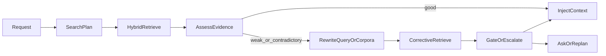
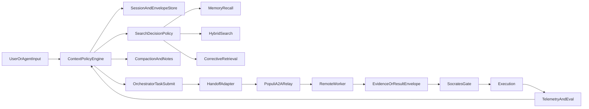

# Context management research findings 2026

## Purpose

This document is the research dossier for turning Vox context handling into a state-of-the-art system across:

- multi-session chat,
- zero-shot and retrieval-gated task execution,
- agent-to-agent handoff,
- MENs and Populi federation,
- search-tool selection and corrective retrieval,
- context conflict resolution, lineage, and observability.

It is a synthesis document, not a claim that every recommended behavior is already shipped.

## Executive summary

Vox already has a stronger context foundation than many agent stacks:

- `vox-mcp` persists session-scoped chat history and retrieval envelopes.
- `vox-orchestrator` can attach session retrieval context or run native shared retrieval.
- `vox-search` already unifies lexical, vector, hybrid, verification, Tantivy, and Qdrant paths.
- `vox-populi` already provides durable remote A2A delivery, lease semantics, and remote task envelopes.
- Socrates already provides a risk-aware gate with citation, contradiction, and evidence-quality signals.

The main gap is not absence of parts. It is absence of a single canonical context contract and a single policy plane deciding:

1. what context exists,
2. which context should be injected now,
3. when search should run instead of trusting memory,
4. how remote agents should receive context safely,
5. how conflicts should merge or escalate,
6. how the entire lifecycle should be observed and evaluated.

The recommendation of this research pass is to introduce a canonical `ContextEnvelope` contract, treat session, retrieval, task, and handoff data as variants of that contract, and then centralize search, compaction, conflict-resolution, and telemetry policy around it.

## Current Vox baseline

### Context-bearing surfaces in the current repo

| Surface | Current implementation | Scope model | Persistence | Main strength | Main gap |
| -------- | ------------------------- | ------------- | ------------- | --------------- | ---------- |
| MCP chat session history | `crates/vox-orchestrator/src/mcp_tools/tools/chat_tools/chat/message.rs` | `session_id`, default `"default"` | Context store + DB transcripts | Good multi-session isolation when client supplies IDs | Default session fallback can still bleed if clients omit IDs |
| Session retrieval bridge | `crates/vox-orchestrator/src/socrates.rs` and `crates/vox-orchestrator/src/orchestrator/task_dispatch/submit/goal.rs` | `retrieval_envelope:{session_id}` | Context store TTL-based | Clean bridge from chat retrieval to task gating | Envelope shape is narrow and session-coupled |
| Native task retrieval | `crates/vox-orchestrator/src/orchestrator/task_dispatch/submit/goal.rs` | task-local | derived at submit time | Shared `vox-search` path already available | No single policy plane for when to rely on this path |
| Search execution | `crates/vox-search/src/execution.rs` and `crates/vox-search/src/bundle.rs` | query + corpus plan | on-demand | Shared hybrid retrieval stack | Trigger budgets and search-vs-memory policy differ by surface |
| MCP explicit retrieval | `crates/vox-orchestrator/src/mcp_tools/memory/retrieval.rs` | tool turn or auto preamble | ephemeral + envelope | Rich diagnostics and telemetry shape | Not yet the canonical contract across all surfaces |
| Orchestrator A2A local bus | `crates/vox-orchestrator/src/types/messages.rs` and local bus modules | local agent/thread/task | ephemeral or DB-backed | Richer in-process semantics | Not mirrored in Populi transport contract |
| Populi A2A transport | `crates/vox-populi/src/transport/mod.rs` | sender/receiver/message_type | durable relay rows | Strong remote delivery and lease semantics | Conversation/session/thread fields are opaque payload conventions, not first-class contract |
| Remote task handoff | `crates/vox-orchestrator/src/a2a/envelope.rs` | task/campaign/lease | durable mesh | Good remote execution base | Context payload is still too thin and artifact refs are underused |
| MENs / routing visibility | `crates/vox-orchestrator/src/services/routing.rs` | node labels and hints | snapshot cache | Early federation and placement hints | Visibility and execution context are not yet unified |

### Baseline code-grounded observations

1. `vox-mcp` stores session retrieval evidence under `retrieval_envelope:{session_id}` and chat history under `chat_history:{session_id}`. This is the current bridge between chat context and task context.
2. `vox-orchestrator` tries `attach_session_retrieval_envelope_if_present(...)` first, then falls back to `attach_goal_search_context_with_retrieval(...)`, and finally to heuristic-only search hints when no DB-backed retrieval is available.
3. `vox-search` already supports a richer retrieval model than the rest of the platform currently exposes. In practice, context quality is limited more by policy and handoff shape than by retriever capability.
4. `vox-populi` has durable A2A and lease semantics, but the remote wire contract still treats context as opaque payload text. That prevents safe, structured interoperability for multi-turn or multi-agent context sharing.
5. Socrates already has the beginnings of a useful evidence gate, but the gate consumes multiple upstream envelope shapes instead of a single normalized context artifact.

## Second-pass critique of the initial blueprint

The first version of this program was directionally correct, but several assumptions were still too optimistic or too compressed.

### Pressure-tested assumptions

| Assumption from v1 | Status after code review | Why it is weak | Required correction |
| ------------------ | ------------------------ | -------------- | ------------------- |
| A shared policy engine can be centralized quickly | partial | `vox-search`, `vox-mcp`, and `vox-orchestrator` currently duplicate trigger concepts and policy entry points rather than sharing one crate-level policy surface | move toward a shared policy vocabulary first, then extract code only after interfaces stabilize |
| Remote task relay can easily carry task context | unsupported in current code | `submit_task_with_agent` builds and may relay `RemoteTaskEnvelope` before retrieval context is attached, and the relay payload is currently just `task_description` plus `assigned_agent_id` | split remote context work into ordering fixes, payload expansion, durable artifact references, and remote result reconciliation |
| Handoff continuity is mostly a metadata problem | unsupported in current code | `HandoffPayload` carries notes and metadata, but `accept_handoff` does not preserve session/thread identity or bridge retrieval envelopes/context-store references | treat handoff continuity as a dedicated implementation epic, not a small extension |
| Compaction can be treated as a straightforward first-wave feature | partial | Vox has memory and transcript surfaces, but there is no obvious in-tree compactor runtime hook yet, and `MemoryManager::bootstrap_context()` is not widely used by active call paths | define compaction ownership, persistence target, and injection order before scheduling major implementation |
| Conflict resolution can wait until late rollout | risky | precedence and trust semantics affect adapter design, envelope fields, and overwrite behavior from day one | define minimal conflict classes and envelope precedence fields at the contract stage, even if enforcement remains shadow-only |
| Web research is a near-term corpus leg | unsupported in current code | `SearchCorpus::WebResearch` exists in planning types, but the execution path does not implement a web corpus leg | mark web corpus as explicit future scope unless a concrete executor lands |
| MCP task submit already bridges retrieval context well enough | partial | MCP only attaches Socrates retrieval context after submit when the caller passes explicit `retrieval`; otherwise continuity depends on the orchestrator session envelope path | make MCP-to-task bridging a first-class, explicit design item |

### Code-backed hazards the blueprint must account for

1. **Remote relay ordering hazard:** in `crates/vox-orchestrator/src/orchestrator/task_dispatch/submit/task_submit.rs`, remote lease/relay flow is constructed before `attach_session_retrieval_envelope_if_present(...)` or `attach_goal_search_context_with_retrieval(...)` runs. That means remote workers cannot currently rely on retrieval context being present merely because the local task later acquires it.
2. **Handoff continuity gap:** `crates/vox-orchestrator/src/handoff.rs` and `crates/vox-orchestrator/src/orchestrator/agent_lifecycle.rs` do not model `session_id`, `thread_id`, or retrieval-envelope references as first-class handoff invariants.
3. **Policy duplication gap:** `crates/vox-search/src/bundle.rs`, `crates/vox-orchestrator/src/mcp_tools/memory/retrieval.rs`, and orchestrator submit paths share concepts but still keep parallel trigger and envelope mapping logic.
4. **Compaction surface ambiguity:** the repo has memory and transcript systems, but no single clear runtime owner for long-horizon conversation compaction and reinjection.
5. **Explicit retrieval asymmetry:** `crates/vox-orchestrator/src/mcp_tools/tools/task_tools.rs` only attaches explicit retrieval after submit when the caller provided it, so the local MCP submission path is less unified than the first blueprint implied.

### Corrections to the program shape

The improved version of this program should therefore prefer:

1. **shared contract before shared crate,**
2. **ordering fixes before remote feature expansion,**
3. **handoff identity work before remote enforce,**
4. **minimal conflict vocabulary early, full conflict engine later,**
5. **compaction ownership design before compaction implementation,**
6. **explicit scope tags for deferred work such as web corpus execution.**

## External research synthesis

### Production context-engineering patterns

The strongest recurring guidance from Anthropic, OpenAI, LangGraph, LlamaIndex, MemGPT, and related literature is consistent:

- treat context as a scarce working-memory resource, not a dump of everything available,
- maintain a hierarchy of short-term, episodic, semantic, and procedural memory,
- prefer just-in-time retrieval over loading everything eagerly,
- compact or summarize long histories aggressively but with lineage,
- isolate sub-agents so they return distilled findings instead of raw exploration traces,
- add corrective retrieval when evidence is weak, contradictory, or stale,
- instrument the whole context lifecycle so context bugs can be debugged like distributed systems bugs.

### Retrieval-specific findings

The most relevant retrieval research for Vox is not generic “use RAG.” It is policy and correction:

- **Self-RAG** supports retrieval on demand rather than mandatory retrieval every turn.
- **CRAG** adds a retrieval evaluator and corrective fallback path when evidence quality is low.
- **RRF / RAG-Fusion** remains a robust default for merging lexical and vector evidence without brittle score normalization.
- Production systems consistently recommend hybrid lexical + vector retrieval because vectors miss exact identifiers and BM25 misses paraphrase and semantic intent.

### Distributed agent findings

The most important interoperability takeaway is that MCP and A2A solve different layers:

- MCP is the agent-to-tool plane.
- A2A is the agent-to-agent plane.

Vox already has both layers. The missing piece is a contract that lets the same context object move cleanly between them.

### Observability findings

OpenTelemetry GenAI conventions are converging around:

- explicit conversation IDs,
- agent IDs and agent names,
- tool invocation spans,
- retrieval spans,
- token accounting,
- model/provider metadata,
- optional capture of input messages, tool definitions, and system instructions.

For Vox, this means context should be instrumented as a lifecycle, not as disconnected log lines.

## Design goals

1. **No context bleed by default.** Session, thread, workspace, agent, and node scope must be explicit.
2. **Search only when justified.** Retrieval should be policy-driven, not an accident of which surface was used.
3. **Structured remote handoff.** Cross-node and cross-agent context must survive transport boundaries.
4. **Conflict safety.** Contradictory context must merge deterministically or escalate.
5. **Observability by construction.** Every context decision must be explainable after the fact.
6. **Backward-compatible rollout.** New contracts must be additive and support adapters from current shapes.
7. **Ordering correctness before capability growth.** Context must be attached at the right time before it can be relied on remotely.
8. **Avoid premature monoliths.** Shared vocabulary and contracts come before centralizing all policy code into one module or crate.

## Recommended canonical contract

### `ContextEnvelope`

Machine-readable schema:

- [`contracts/communication/context-envelope.schema.json`](../../../contracts/communication/context-envelope.schema.json)

The envelope is the recommended normalization layer for:

- chat turn carry-forward,
- compacted session summaries,
- retrieval evidence,
- task submit context,
- agent handoff context,
- remote execution context,
- policy hints and structured notes.

### Required dimensions

| Dimension | Why it is required |
| ---------- | -------------------- |
| `schema_version` | Forward-compatible migration and additive parsing |
| `provenance` | Explains where the context came from and how it was produced |
| `trust` | Enables authority and evidence-based conflict resolution |
| `subject` | Prevents session/thread/workspace bleed |
| `content` | Separates actual context payload from transport details |
| `conflict_policy` | Makes merge behavior explicit instead of ad hoc |
| `budget` | Lets context selection reason about injection cost and refresh needs |

### Recommended envelope variants

| Variant | Typical producer | Typical consumer |
| -------- | ------------------- | ------------------ |
| `chat_turn` | `vox_chat_message` | session compactor, memory writer |
| `session_summary` | compactor or note writer | future turns, task submit, handoff |
| `retrieval_evidence` | `vox-search` caller | Socrates gate, planning, task submit |
| `task_context` | MCP submit path or orchestrator submit path | agent worker |
| `handoff_context` | agent handoff flow | receiving agent |
| `execution_context` | remote envelope emitter | remote worker |
| `policy_hint` | policy engine | retriever, compactor, injector |

## Adapter mapping

### Current shape -> target shape

| Existing shape | Mapping into `ContextEnvelope` |
| --------------- | -------------------------------- |
| `SessionRetrievalEnvelope` in `vox-orchestrator` | `retrieval_evidence` with `subject.session_id`, `trust.confidence`, `budget.injection_mode = inline` |
| MCP `RetrievalEvidenceEnvelope` | `retrieval_evidence` preserving planner and diagnostics in `content.structured_payload` |
| chat transcript entry | `chat_turn` with `subject.session_id` and repo/context file hints in `content.repo_paths` |
| `SocratesTaskContext` | `task_context` or derived `policy_hint` preserving risk budget, citation requirements, and recommended next action |
| Populi `A2ADeliverRequest` payload | wrapped `handoff_context` or `execution_context` stored as JSON instead of opaque free text |
| `RemoteTaskEnvelope` | `execution_context` plus durable artifact refs and lineage |

### Compatibility modes

1. **Adapter-first mode:** current producers keep emitting legacy payloads while new consumers normalize them.
2. **Dual-write mode:** producers emit both legacy payloads and `ContextEnvelope`.
3. **Canonical-write mode:** `ContextEnvelope` becomes source of truth; legacy forms become derived projections.

## Session identity model

### Canonical identity dimensions

| Field | Meaning | Invariant |
| ------ | --------- | ----------- |
| `workspace_id` | local repo/workspace surface | one workspace may host many sessions |
| `session_id` | logical user/editor conversation | must never silently collapse into another live session |
| `thread_id` | branch of work within a session | compaction and handoff should preserve thread lineage |
| `task_id` | concrete execution unit | derived from, but not equal to, session/thread identity |
| `agent_id` | executing agent identity | sender and receiver must both be available on handoff |
| `node_id` | physical or remote execution owner | required for remote authority and lease correlation |

### Anti-bleed invariants

1. The system must never rely on `"default"` as a stable long-lived multi-window identity.
2. Task submission must carry or derive the current `session_id` whenever user-visible continuity is expected.
3. Handoffs must preserve both `session_id` and `thread_id`; otherwise they are context resets and should be labeled as such.
4. Remote execution payloads must include context lineage, not just task description text.
5. Compaction outputs must preserve the root session and thread identifiers.

## Search decision policy

### When to trust memory vs when to search

| Situation | Preferred action |
| ---------- | ------------------ |
| Exact key/value or explicit stored note lookup | use memory recall / key-based access |
| Broad “what do we know about X in this repo or session?” | use hybrid retrieval |
| High-risk factual claim, codebase assumption, or remote handoff | require retrieval evidence |
| User intent is brainstorming, drafting, or low-risk ideation | memory and local working context may be enough |
| Contradiction, low evidence quality, or stale context | corrective retrieval or escalation |

### Recommended gating ladder

1. **No retrieval** for low-risk, purely local reasoning tasks.
2. **Heuristic retrieval** when intent suggests code navigation, repo structure, or factual lookup.
3. **Verified retrieval** when risk tier or evidence shape requires it.
4. **Corrective retrieval** when contradiction ratio is high, coverage is narrow, or evidence is stale.
5. **Escalation or replan** when corrective retrieval still leaves the task under-grounded.

### Recommended policy signals

The retrieval policy engine should decide using:

- declared task risk tier,
- session age and compaction generation,
- evidence freshness,
- contradiction ratio,
- source diversity,
- whether remote execution or handoff is involved,
- whether the task claims facts about code, environment, or external systems.

### Improvement over the first draft: remote context

The first blueprint treated a central retrieval-policy engine as mostly organizational work. The code review shows it is also a **dependency and crate-boundary** problem. The safer plan is:

1. define a shared policy contract,
2. preserve current call-site ownership temporarily,
3. add parity tests proving equivalent behavior across MCP and orchestrator,
4. only then extract common logic into a shared implementation surface.

## Corrective retrieval loop

Vox should adopt a CRAG-style correction stage around the existing `vox-search` pipeline.

### Proposed loop

### Trigger conditions

Run corrective retrieval when any of the following are true:

- `contradiction_count > 0`,
- `source_diversity <= 1` for a high-risk task,
- `evidence_quality < threshold`,
- `citation_coverage < threshold`,
- `recommended_next_action` indicates retry, broaden, or verify.

## MENs and Populi integration

### Current role of MENs and Populi

Today MENs and Populi primarily contribute:

- visibility,
- remote durable A2A transport,
- inbox leases,
- remote execution lease support,
- routing hints and node metadata.

The missing part is context shape.

### Improvement over the first draft: merge architecture

The first draft understated the degree of **ordering** and **authority** work required here. Remote context delivery is not just “add more fields to the envelope.” It requires:

- moving context assembly earlier in the submit path,
- deciding whether remote handoff uses embedded envelopes or durable artifact refs,
- defining who owns context freshness after relay,
- reconciling remote results with lease lineage and local task authority.

### Recommended remote context rules

1. Remote A2A payloads should carry `ContextEnvelope` or a durable artifact reference to one.
2. Remote task envelopes should include session/thread/task lineage and evidence references, not just task description.
3. Lease holders must be recorded alongside context lineage so remote results can be reconciled to the same authority chain.
4. Remote workers should be allowed to send `A2ARetrievalResponse` back as first-class evidence, not only opaque task results.

### Recommended remote retrieval flow

| Step | Producer | Artifact |
| ------ | ---------- | ---------- |
| request | orchestrator or peer agent | `A2ARetrievalRequest` |
| execution | remote node with DB/index access | shared `vox-search` pass |
| response | remote node | `A2ARetrievalResponse` wrapped as `retrieval_evidence` envelope |
| correction | requester or remote peer | `A2ARetrievalRefinement` if evidence weak |
| use | Socrates gate or planner | normalized `ContextEnvelope` |

## Conflict taxonomy and merge policy

### Conflict classes

| Conflict class | Example | Preferred handling |
| --------------- | --------- | -------------------- |
| temporal | newer build output contradicts older session note | freshness and authority precedence |
| semantic | two summaries disagree about an implementation fact | evidence-bound confidence merge or escalation |
| authority | user override conflicts with heuristic summary | user or system-verified source wins |
| source trust | external note conflicts with verified repo evidence | verified repo evidence wins |
| policy | stale low-cost context wants inline injection into a high-risk task | policy engine denies inline use and forces refresh |

### Merge strategy recommendations

| Situation | Strategy |
| ---------- | ---------- |
| append-only chat/event history | append-only |
| derived summaries with clear recency | last-write-wins with lineage preserved |
| evidence claims with scores | confidence-weighted merge |
| authority-bound overrides | authority precedence |
| distributed shared notes or counters | targeted CRDT use |
| unresolved semantic disagreement | manual review or question/abstain path |

## Rust-native implementation options

### Recommended crate posture

| Need | Candidate | Recommendation |
| ------ | ----------- | ---------------- |
| conflict-free shared state | `ditto`, `crdt-kit`, `cola` | use selectively; do not force CRDTs onto every context surface |
| lineage and replay | `esrc`, `eventastic`, `cqrs` | event-sourcing is useful for context lifecycle and audit trails |
| graph reasoning | `petgraph`, graph-store exploration | start with `petgraph` for in-process context lineage graphs |
| lexical retrieval | Tantivy | keep existing route |
| vector retrieval | Qdrant | keep existing route; strengthen tenancy and policy use |

### Recommendation

Do not rebuild the entire context system as a CRDT platform. Most Vox context is not collaborative text editing. The better split is:

- event sourcing for lineage and replay,
- precedence and confidence rules for merge semantics,
- selective CRDT use only where concurrent peer mutation truly exists,
- graph modeling for provenance and dependency traversal.

### Improvement over the first draft

The earlier blueprint was correct to avoid a CRDT-everywhere design, but it did not emphasize enough that **event sourcing and provenance** should be introduced before sophisticated merge mechanics. For Vox, replayability and auditability are more urgent than peer-to-peer convergence on most paths.

## Observability model

### Required span and event families

| Lifecycle stage | Suggested span name | Required identifiers |
| ---------------- | --------------------- | ---------------------- |
| context capture | `context.capture` | envelope id, session id, agent id |
| retrieval | `context.retrieve` | query id, conversation id, policy version |
| compaction | `context.compact` | parent envelope ids, compaction generation |
| selection | `context.select` | task id, injection mode, token budget |
| handoff | `context.handoff` | sender, receiver, node, lease id |
| conflict resolution | `context.resolve` | conflict class, merge strategy |
| gate | `context.gate` | risk budget, confidence, contradiction ratio |

### OpenTelemetry alignment

The following OpenTelemetry GenAI fields are especially relevant:

- `gen_ai.conversation.id`,
- `gen_ai.agent.id`,
- `gen_ai.agent.name`,
- `gen_ai.operation.name`,
- `gen_ai.request.model`,
- `gen_ai.usage.input_tokens`,
- `gen_ai.usage.output_tokens`,
- retrieval and tool-execution spans associated with the same conversation.

## Evaluation harness recommendations

### Deterministic benchmark families

1. **Session continuity:** a fact introduced in one turn remains available after compaction.
2. **Bleed prevention:** two concurrent sessions do not cross-pollinate chat or retrieval context.
3. **Search policy correctness:** high-risk tasks search when they should and avoid unnecessary search when they should not.
4. **Corrective retrieval:** contradiction or weak evidence triggers retry, broaden, or escalation.
5. **A2A integrity:** sender and receiver share the same session/thread/task lineage after handoff.
6. **Remote execution integrity:** remote result correlates to the same context authority and lease lineage.

### Minimum metrics

| Metric | Why it matters |
| ------- | ---------------- |
| context bleed rate | safety and user trust |
| unsupported factual claim rate | grounding quality |
| retrieval precision and recall | search quality |
| contradiction-resolution success rate | correction quality |
| handoff correlation failure rate | distributed execution correctness |
| latency and token overhead | cost of better context management |

## Recommended target architecture

### Architectural conclusion

The system should converge on:

- one canonical envelope,
- one session identity model,
- one shared context policy vocabulary,
- one retrieval decision ladder,
- one conflict-resolution taxonomy,
- one telemetry vocabulary.

The current Vox stack already has enough infrastructure to support this, but the code review shows that rollout must proceed in a stricter order than the first blueprint implied: **contract -> identity -> ordering fixes -> telemetry -> shared policy parity -> remote expansion -> enforcement**.

## Related implementation documents

- [Context management implementation blueprint](context-management-implementation-blueprint.md)
- [Context management phase 1 backlog](context-management-phase1-backlog.md)
- [Plan adequacy (thin plans & telemetry)](plan-adequacy.md)
- [Mesh / Populi SSOT (CPU-first)](../reference/populi.md)
- [Socrates protocol — single source of truth](../reference/socrates-protocol.md)

## External references

- [Anthropic: Effective context engineering for AI agents](https://www.anthropic.com/engineering/effective-context-engineering-for-ai-agents)
- [OpenAI: Compaction and context management](https://developers.openai.com/api/docs/guides/context-management)
- [A2A and MCP: complementary protocols](https://a2a-protocol.org/v0.2.0/topics/a2a-and-mcp/)
- [Self-RAG: Learning to Retrieve, Generate, and Critique through Self-Reflection](https://arxiv.org/abs/2310.11511)
- [Corrective Retrieval Augmented Generation](https://openreview.net/forum?id=JnWJbrnaUE)
- [OpenTelemetry GenAI semantic conventions](https://opentelemetry.io/docs/specs/semconv/gen-ai/gen-ai-agent-spans)

