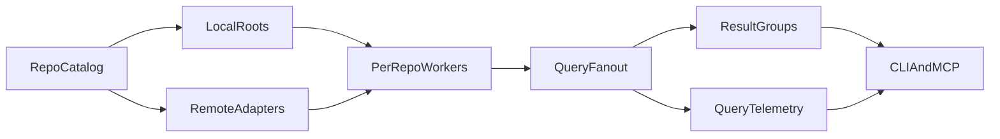

# Cross-repo querying and observability

This page is the architecture SSOT for how Vox should handle the common operator workflow of:

- inspecting another local repository
- comparing or reusing patterns across repositories
- querying related codebases without collapsing them into one filesystem root
- observing those multi-repo queries with shared repository and trace metadata

It is intentionally **local-first** for the first implementation phase and **adapter-based** for remote systems.

## Problem

Today, Vox has strong **single-repository** primitives:

- `vox-repository` discovers one `RepositoryContext`
- `vox-mcp` binds one `ServerState` to one repository root
- `vox_repo_index_*` returns bounded per-repo summary data
- trust and telemetry already carry `repository_id` in multiple paths

That is enough for per-repo tooling, but it does not yet provide a first-class answer to:

- "Search these three local clones for a pattern"
- "Read the same file path across several repos"
- "Compare recent history across related repos"
- "List remote repositories and map them into the same query surface later"

## Core decision

Vox should generalize cross-repo work by adding a **catalog + federation layer above existing single-repo safety boundaries**, not by widening one MCP process into an unrestricted filesystem reader.

## Terminology

| Term | Meaning |
| --- | --- |
| **Multi-repo query** | One request fans out over multiple repositories and returns grouped results. |
| **Cross-repo semantic navigation** | Compiler- or index-backed symbol navigation that can jump across repository boundaries. |
| **Repo catalog** | Explicit list of repositories that belong to one operator's working set. |
| **Per-repo worker** | Existing single-root execution context that reads exactly one repository safely. |
| **Remote adapter** | Metadata or query connector for non-local repository access such as MCP HTTP, Git host APIs, or a search/index service. |

## Scope and non-goals

### In scope now

- explicit multi-repo catalogs for local clones
- read-only fan-out querying across cataloged repositories
- shared query metadata for MCP, CLI, and gateway observability
- remote descriptor shapes for future adapters

### Out of scope now

- autonomous cross-repo code editing by MENS or MCP agents
- forced semantic indexing for every repository
- ambient machine-wide discovery of arbitrary repositories
- replacing existing single-repo path sandbox rules

## Architecture

## Local-first design

The first shipped workflow should be based on an explicit workspace manifest under:

- `.vox/repositories.yaml`

Why this shape:

- it is reproducible across machines
- it avoids implicit scanning of unrelated checkouts on disk
- it keeps path authorization narrow
- it lets Vox record both local and remote repository descriptors in one format

Each local repository entry resolves into a normal `RepositoryContext`. Cross-repo work then fans out across those resolved contexts.

## Remote-second design

Remote repositories should map into the same descriptor model but remain **adapter-based**:

| Adapter kind | Near-term role | Long-term role |
| --- | --- | --- |
| `remote_mcp` | Read-only repository metadata and MCP-served query access | Full remote query worker for repositories already exposed through MCP HTTP |
| `remote_git_host` | Repo discovery, refs, default branch, URL metadata | Optional history / file metadata enrichment via provider APIs |
| `remote_search_service` | Metadata for a semantic or text search backend | Preferred path for later semantic cross-repo navigation |

This keeps Vox from assuming:

- every remote repo is cloned locally
- one vendor defines the core model
- semantic navigation and plain text querying must ship at the same time

## Query surfaces

The MVP query surface is intentionally simple:

- `catalog_list`
- `catalog_refresh`
- `query_text`
- `query_file`
- `query_history`

### Query semantics

| Query | MVP behavior |
| --- | --- |
| `query_text` | Search cataloged local repositories and group hits by `repository_id` |
| `query_file` | Read the same path or a specific repo/path combination across the catalog |
| `query_history` | Return recent Git history per repository, optionally filtered by path or substring |
| `catalog_refresh` | Re-resolve descriptors and write a snapshot/cache without widening repo boundaries |

### Semantic navigation

Semantic cross-repo navigation is a later phase. It should use pluggable backends rather than forcing one in-repo indexing strategy immediately.

Current best reference models:

- multi-root editor workspaces
- Sourcegraph SCIP-backed cross-repository navigation
- MCP-exposed remote search services

## Safety model

Cross-repo support must preserve these invariants:

1. One execution context reads one repository root.
2. Catalog membership is explicit.
3. Relative paths are always resolved against one selected repository root.
4. Remote repository access is read-only by default.
5. Unsupported remote descriptors are surfaced as skipped entries, not silently treated as local roots.

## Observability contract

Cross-repo queries should emit a shared metadata block whether they run from CLI, MCP stdio, or the MCP HTTP gateway.

Required fields:

- `trace_id`
- `correlation_id`
- `conversation_id` when present
- `workspace_repository_id`
- `target_repository_ids`
- `repository_id`
- `origin_url`
- `vcs.repository.name`
- `vcs.repository.url.full`
- `vcs.ref.head.revision`
- `source_plane`
- `query_backend`
- `query_kind`
- `result_count`
- `latency_ms`

### Recommended vocabulary

- use OpenTelemetry-style producer/process/settle terminology for fan-out paths
- keep repository identity stable via `vox-repository`
- use trust observations for repo health and freshness signals, not for raw query payload storage
- use `research_metrics` or equivalent rollups for query events before adding new tables

## Relationship to existing Vox systems

### `vox-repository`

Remains the identity and local hydration layer. New cross-repo work should build on:

- `RepositoryContext`
- `repository_id`
- workspace-layout helpers

### `vox-mcp`

Remains a single-root worker model. New catalog and query tools should fan out over resolved repo descriptors rather than mutating `ServerState` into a multi-root authority.

### `vox-forge`

Provides the right starting point for `remote_git_host` metadata adapters but is not itself the cross-repo query layer.

### Trust and telemetry

The trust layer already recognizes `repository` as an entity type. Cross-repo querying should extend that instead of creating a separate reliability vocabulary.

## Implementation order

1. Define the repo catalog schema and workspace path.
2. Implement `RepoCatalog` in `vox-repository`.
3. Ship local read-only querying in CLI and MCP.
4. Attach shared query metadata and rollups.
5. Add remote descriptor/adaptor support.
6. Evaluate semantic cross-repo navigation later.

## External references

- VS Code multi-root workspaces
- Sourcegraph SCIP and MCP server documentation
- OpenTelemetry messaging and VCS semantic conventions

## Related

- [External repositories & workspace SSOT](../reference/external-repositories.md)
- [Language surface SSOT](language-surface-ssot.md)
- [MCP exposure from the Vox language (SSOT)](mcp-vox-language-exposure.md)
- [Protocol convergence research 2026](protocol-convergence-research-2026.md)
- [Trust Reliability Layer (SSOT)](trust-reliability-layer.md)
- [Telemetry and research_metrics contract](../reference/telemetry-metric-contract.md)
- [Multi-repo context isolation: research findings 2026](multi-repo-context-isolation-research-2026.md) — security model, scope guard, `.voxignore` SSOT, IDE isolation, and agent instruction file hierarchy

