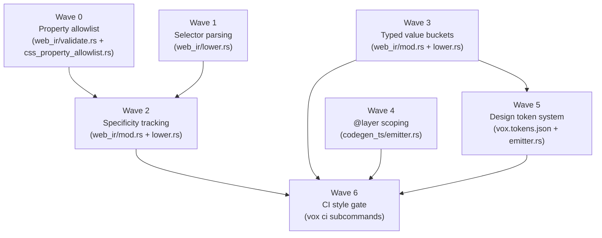

# CSS Determinism: Implementation Plan for Vox Style Emission

## The Core Problem, Stated Precisely

Vox emits CSS today. The pipeline is:

```
.vox source (style: blocks)
  → AST: StyleBlock { selector: String, properties: Vec<(String, String)> }
  → HIR: HirComponent.styles: Vec<StyleBlock>  (identical raw strings, no analysis)
  → WebIR: StyleNode::Rule { selector: StyleSelector::Unparsed(String), declarations: Vec<(String, StyleDeclarationValue::Raw(String))> }
  → emitter.rs: format!("{} {{\n", block.selector) + format!("  {}: {};\n", css_prop, val)
  → {ComponentName}.css file on disk
```

Every layer from AST through to disk emission uses **unvalidated strings**. There is no semantic analysis of selectors, no validation of property names or values, no specificity tracking, no cascade awareness, and no scoping enforcement. A typo in a property, a valid-but-overridden rule, or a color value that gets shadowed by a parent stylesheet — none of these produce any diagnostic at compile time.

This is the source of the "AI inference gap": an AI reading a `.vox` file can see the literal text of a `style:` block but cannot know:

1. **Whether the property name is valid** (camelCase-to-kebab conversion in the emitter silently converts `fontWeit` → `font-weit`, an invalid property, without error).
2. **Whether the value is valid** (the string `"red"` and the string `"rde"` are treated identically).
3. **What the actual computed color is** (parent stylesheets, browser defaults, specificity, and inheritance all contribute).
4. **Whether the selector actually matches any element** (an orphaned rule is emitted unchanged).

## Codebase Ground Truth (Verified April 2026)

### Where CSS Is Emitted

| File | Lines | What it does |
|---|---|---|
| `codegen_ts/emitter.rs:213-262` | ~50 | Iterates `hir.components` and `hir.reactive_components`, emits `{Name}.css` from `styles: Vec<StyleBlock>` |
| `codegen_ts/reactive.rs:659-661` | ~3 | Conditionally emits `import "./{name}.css"` in TSX if styles are non-empty |
| `codegen_ts/component.rs:67,171` | ~5 | Same import emit for classic `@component` |
| `web_ir/lower.rs:346-375` | ~30 | `lower_styles_from_classic_components` — maps `StyleBlock` → `StyleNode::Rule` with `StyleSelector::Unparsed` |
| `web_ir/validate.rs:259-287` | ~30 | `validate_styles` — only checks for empty declarations and empty property names |

### What the WebIR StyleNode Currently Represents

```rust
// web_ir/mod.rs
pub enum StyleDeclarationValue {
    Raw(String),         // Raw CSS text as emitted — no parsing, no validation
    TokenRef(String),    // Design token name — only planned for Phase 2
}

pub enum StyleNode {
    Rule {
        selector: StyleSelector,           // Usually StyleSelector::Unparsed(String)
        declarations: Vec<(String, StyleDeclarationValue)>,
        span: Option<SourceSpanId>,
    },
    // ...
}

pub enum StyleSelector {
    Class(String),
    Id(String),
    Unparsed(String),   // THIS is what lower.rs actually emits — the full raw string
    Compound(Vec<StyleSelector>),
    Pseudo { base: Box<StyleSelector>, pseudo: String },
}
```

**Finding:** `StyleDeclarationValue::TokenRef` and `StyleSelector::Class/Id/Compound/Pseudo` are defined but **never populated by the actual lowering pass**. The lowering pass (`lower_styles_from_classic_components`) only ever produces `StyleSelector::Unparsed` and `StyleDeclarationValue::Raw`. The richer variants are aspirational schema that was never wired up.

### What the WebIR Validator Checks Today

Only:
1. That a `Rule` has at least one declaration.
2. That declaration property names are not empty strings.

No validation of: selector syntax, CSS property validity, value syntax, specificity conflicts, or cascade interactions.

---

## What We Can Control (vs. Cannot Control)

This is the key framing. CSS's cascading nature means we cannot eliminate uncertainty at compile time — only bound it.

| Factor | Vox-Controllable | Strategy |
|---|---|---|
| Selector syntax validity | ✅ Yes | Parse selectors in the compiler; reject malformed ones |
| CSS property name validity | ✅ Yes | Maintain a whitelist of standard properties in the compiler |
| CSS value rough-validity | ✅ Partially | Basic type heuristics (numeric, color, keyword, length) |
| Specificity of emitted rules | ✅ Yes | Compute at emit time; emit a specificity map in the WebIR |
| Whether a rule is ever matched | ❌ No | Requires runtime DOM — too dynamic |
| Inheritance from parent scope | ❌ No | Parent may be user or framework CSS |
| Browser default styles | ❌ No | User-agent stylesheets vary; Vox cannot control them |
| `!important` override from external CSS | ❌ No | External CSS is outside compiler scope |
| Dynamic class application from state | ✅ Tracked | State-driven class toggles are in the HIR; can annotate |

**Design principle:** The compiler's job is to make its own emitted CSS **auditable and self-consistent**, not to model the entire cascade. We eliminate the errors we can control and document the boundaries clearly so AI agents and humans know exactly what the compiler guarantees vs. what requires runtime verification.

archived_date: 2026-04-18
---

## Implementation Waves

### Wave 0 — Property Allowlist and Name Validation (in `validate.rs`)

**Goal:** Catch typos in CSS property names at compile time. The camelCase → kebab-case conversion in `emitter.rs:223-231` currently runs silently on any string.

**What to build:** A static lookup table of known CSS properties in `vox-compiler`. The `validate_styles` function in `web_ir/validate.rs` walks `StyleNode::Rule` declarations — extend it to reject unknown property names.

**Implementation:**

1. Add `codegen_shared/css_property_allowlist.rs` — a `const` `phf_set!` (or sorted `&[&str]`) of the ~550 standard CSS property names plus common vendor prefixes (`-webkit-`, `-moz-`).
2. In `web_ir/validate.rs::validate_styles`, for each `(prop, _)` in a `Rule`'s declarations, check the property (after kebab-case normalization) against the allowlist. Emit `web_ir_validate.style.unknown_property` if not found.
3. In `codegen_ts/emitter.rs`, apply the same normalization pre-emit. Consider also emitting a `// vox-css-lint: unknown property 'font-weit'` comment inline so the emitted file is self-documenting.

**Scope:** `web_ir/validate.rs` + new `codegen_shared/css_property_allowlist.rs` + `codegen_ts/emitter.rs`

**Complexity:** Low. No AST changes. No schema changes. Pure validation addition.

---

### Wave 1 — Selector Parsing and `StyleSelector` Population

**Goal:** Stop using `StyleSelector::Unparsed` as the universal fallback and actually populate the typed variants the schema already defines.

**Current state:** `lower_styles_from_classic_components` in `web_ir/lower.rs:351-365` maps every selector to `StyleSelector::Unparsed(block.selector.clone())`. The `Class`, `Id`, `Compound`, and `Pseudo` variants exist in the schema but are never produced.

**What to build:** A lightweight selector parser within the Vox compiler that handles the common cases Vox components actually use. This does **not** need to be a full CSS Level 4 parser — just a structural recognizer for the subset of selectors that appear in `style:` blocks.

**Selector grammar subset to support:**

```
selector := simple | compound | pseudo
simple    := "." IDENT     -- class
           | "#" IDENT     -- id
           | IDENT         -- element
compound  := simple (" " | ">" | "+" | "~") simple  -- combinators
pseudo    := simple ":" IDENT     -- :hover, :focus, etc.
           | simple "::" IDENT    -- ::before, ::after
```

Selectors that fall outside this subset remain `Unparsed` but now emit a `web_ir_validate.style.complex_selector` informational diagnostic, making the limit explicit.

**Where to implement:** `web_ir/lower.rs` — replace the `StyleSelector::Unparsed(block.selector.clone())` call in `lower_styles_from_classic_components` with a call to a new `parse_style_selector(selector_str) -> StyleSelector` function.

**Validator extension:** `validate_styles` already walks `style_nodes`. Add a check that rejects `StyleSelector::Unparsed` unless accompanied by a `complex_selector` informational note. This enforces that every unknown selector is flagged, not silently accepted.

archived_date: 2026-04-18
---

### Wave 2 — Specificity Tracking in `WebIrModule`

**Goal:** Give the WebIR enough information so an AI (or human) reading a `WebIrModule` can predict which rules dominate without running a browser.

**What CSS specificity is:** Each selector has a specificity score `(A, B, C)`:
- `A` = number of ID selectors
- `B` = number of class / attribute / pseudo-class selectors
- `C` = number of element / pseudo-element selectors

Rules with higher specificity override rules with lower specificity regardless of source order.

**What to build:**

1. Add `specificity: (u8, u8, u8)` to `StyleNode::Rule` in `web_ir/mod.rs`.
2. Implement `compute_specificity(selector: &StyleSelector) -> (u8, u8, u8)` in `web_ir/lower.rs`.
3. Populate `specificity` during `lower_styles_from_classic_components`.
4. Add a `validate_styles` check for **specificity conflicts within the same component**: if two rules in the same component target the same selector (or selectors of equal specificity targeting the same element type) and declare the same property, emit `web_ir_validate.style.specificity_conflict`.

**Value to AI agents:** When `WebIrModule` is inspected programmatically, the `specificity` field on each `StyleNode::Rule` provides a machine-readable answer to "which rule wins" within the component's own scope.

---

### Wave 3 — Typed Value Buckets (Completing `StyleDeclarationValue`)

**Goal:** Populate `StyleDeclarationValue::TokenRef` and add structured value types so properties like `color: #3a86ff` carry semantic meaning rather than being opaque strings.

**Current state:** `StyleDeclarationValue::TokenRef` is defined but never produced by the lowering pass.

**What to build:** Extend `StyleDeclarationValue` with value categories:

```rust
// Proposed extension to web_ir/mod.rs
pub enum StyleDeclarationValue {
    Raw(String),         // Unknown or unparseable — kept as escape hatch
    TokenRef(String),    // CSS custom property reference (--vox-color-primary)
    Color(CssColor),     // Parsed color value
    Length(f64, LengthUnit),   // Numeric length with unit
    Keyword(String),     // Valid keyword (e.g., "flex", "none", "auto")
    Number(f64),         // Unitless number
}

pub enum CssColor {
    Hex(String),     // #rrggbb / #rgb
    Rgb(u8, u8, u8),
    Rgba(u8, u8, u8, f32),
    Named(String),   // "red", "blue", etc.
    Hsl(f32, f32, f32),
    Var(String),     // var(--token-name)
}

pub enum LengthUnit { Px, Rem, Em, Percent, Vw, Vh, }
```

**Lowering:** In `lower_styles_from_classic_components`, route each property value through `parse_css_value(prop: &str, val: &str) -> StyleDeclarationValue`. For known color properties (`color`, `background-color`, `border-color`, etc.), attempt to parse `CssColor`. For known length properties (`width`, `height`, `margin-*`, `padding-*`, `font-size`, etc.), attempt `Length`. Unrecognized values remain `Raw`.

**Value to AI agents:** An AI can now see `color: CssColor::Hex("#3a86ff")` instead of `color: Raw("#3a86ff")`. This lets it answer "what color is this?" with certainty for the emitted value, even if the cascade may override it.

archived_date: 2026-04-18
---

### Wave 4 — Scope Annotation and `data-vox-scope`

**Goal:** Enforce that emitted component styles cannot leak into other components' elements at runtime. This is a fundamental architectural improvement that reduces cascade ambiguity.

**Current approach:** Vox emits a bare `{ComponentName}.css` file. The CSS inside uses selectors as authored (e.g., `.btn { ... }`). A `.btn` class in `ButtonComponent.css` and a `.btn` class in `NavComponent.css` will cascade together in the browser if both are loaded.

**Solution:** Implement automatic scope attribute injection.

**Compiler side:**

1. During CSS emission in `emitter.rs`, prefix every emitted selector with a component-scoped attribute selector: `.btn` becomes `[data-vox-scope="ButtonComponent"] .btn`.
2. During TSX emission in `component.rs` / `reactive.rs`, add `data-vox-scope={ComponentName}` to the root element of every component's JSX.

This is exactly how Vue's Scoped Styles and CSS Modules work, implemented without a bundler-level transform.

**Alternative — CSS `@layer`:** Native CSS Cascade Layers (`@layer`) provide a declarative way to isolate style priority. Rather than scope attributes, each component's styles could be wrapped in a named `@layer`:

```css
/* ButtonComponent.css */
@layer ButtonComponent {
  .btn { background: #3a86ff; }
}
```

Layers have 94%+ browser support as of 2026 and are explicitly designed for this problem. Rules inside a lower-priority layer cannot override rules in a higher-priority layer, regardless of specificity. This eliminates a major class of cascade confusion.

**Recommendation:** Implement `@layer` wrapping for all emitted component CSS. This is a 3-line change to the emitter and produces provably scope-bounded CSS with no runtime attribute injection needed.

**WebIR annotation:** Add `scope: Option<StyleScope>` to `WebIrModule`:

```rust
pub enum StyleScope {
    Layer(String),       // @layer ComponentName { ... }
    DataAttribute(String), // [data-vox-scope="ComponentName"]
    None,               // No isolation (legacy)
}
```

---

### Wave 5 — Design Token System (`--vox-*` Custom Properties)

**Goal:** Replace magic color/spacing strings in `style:` blocks with a typed design token system that is analyzable at compile time.

**Problem with current approach:** A developer writes `color: "#3a86ff"` in ten components. When the design changes, all ten files must be updated manually. There is no way for an AI to know that `"#3a86ff"` is "the brand blue" vs. an arbitrary choice.

**Vox-native syntax:**

```vox
// vox:skip
// In a component style block:
style {
  .btn {
    backgroundColor: tokens.color.primary    // resolves to var(--vox-color-primary)
    padding: tokens.spacing.md               // resolves to var(--vox-spacing-md)
  }
}
```

**Compiler side:** A `vox.tokens.json` file at the project root defines the token map. The compiler reads this at `vox build` time and validates that every `tokens.*` reference resolves to a defined token. The emitter translates `tokens.color.primary` → `var(--vox-color-primary)`, and emits a `vox-tokens.css` file with the root-level `--vox-*` custom property declarations.

**WebIR representation:** `StyleDeclarationValue::TokenRef("vox-color-primary")` — already in the schema, now wired.

**Value:** An AI reading the WebIR can see `TokenRef("vox-color-primary")` and, by consulting `vox.tokens.json`, know the exact resolved color. This fully closes the "AI cannot determine color from source" gap for components that use the token system.

archived_date: 2026-04-18
---

### Wave 6 — CI Style Gate and Diagnostics in `vox ci`

**Goal:** Surface CSS quality issues as structured CI failures, not silent runtime bugs.

**New `vox ci` checks:**

| Check | Code | What it catches |
|---|---|---|
| `vox ci css-property-validity` | `css.lint.unknown_property` | Misspelled or unknown CSS property names |
| `vox ci css-selector-complexity` | `css.lint.complex_selector` | Selectors that could not be statically parsed |
| `vox ci css-specificity-conflicts` | `css.lint.specificity_conflict` | Multiple rules in same component targeting same property at same specificity |
| `vox ci css-unscoped-rules` | `css.lint.unscoped` | Rules emitted without `@layer` or `data-vox-scope` (Wave 4 regression guard) |
| `vox ci css-token-drift` | `css.lint.token_drift` | Hardcoded values matching a token's resolved value (should use the token) |

These checks run as part of `vox ci ssot-drift` (the existing compound CI gate) and are backed by the `WebIrDiagnostic` codes emitted in Waves 0–3.

---

## What This Implementation Does NOT Do

It is important to be honest about the limits:

- **Does not eliminate cascade ambiguity from external stylesheets.** Third-party CSS (Tailwind global styles, browser extensions, shadcn base styles) can still override Vox-emitted rules at runtime. The `@layer` approach (Wave 4) mitigates this significantly but does not eliminate it.
- **Does not validate runtime states.** Whether `.btn:hover` visually works correctly requires a browser or VLM screenshot audit (Vox Visus). Pseudo-selectors are structurally parsed but not tested against actual interaction states.
- **Does not perform cross-component specificity analysis.** If a user creates a global CSS file alongside Vox components, Vox cannot analyze it.
- **Does not replace Vox Visus for visual regression detection.** The compiler-level approach described here is about making the _source_ tractable. The [GUI Visual Intelligence](gui-visual-intelligence-research-2026.md) track handles _visual output_ verification.

archived_date: 2026-04-18
---

## Implementation Priority and Dependencies



**Recommended sequencing:**

| Priority | Wave | Rationale |
|---|---|---|
| P0 (immediate) | Wave 0 | Catches real bugs today. No schema changes. Low risk. |
| P0 (immediate) | Wave 4 (`@layer`) | 3-line emitter change with huge architectural payoff. |
| P1 (next sprint) | Wave 1 | Required for specificity tracking. |
| P1 (next sprint) | Wave 2 | Requires Wave 1. Core AI tractability improvement. |
| P2 (medium term) | Wave 3 | Adds depth to the value model. |
| P3 (medium term) | Wave 5 | Requires project-level tooling. |
| P3 (medium term) | Wave 6 | Requires Waves 0–4 complete. |

---

## Connection to Broader Architecture

- **[CSS and AI Inference Research](css-ai-inference-research-2026.md)** — The foundational research document this plan implements.
- **[GUI Visual Intelligence](gui-visual-intelligence-research-2026.md)** — Complementary: this plan addresses *source-level* auditability; Visus addresses *runtime output* verification.
- **[Web Framework Interop Backlog](web-framework-interop-backlog-2026.md)** — Item `CSS emission` (Wave-specific items should be extracted here once sequencing is confirmed).
- **[Web Architecture Analysis](web-architecture-analysis-2026.md)** — Section 1.3 notes CSS scoped modules at ~30 lines of complexity; Wave 4 likely triples that, which is acceptable given the scope guarantee it provides.
- **[Internal Web IR Blueprint](internal-web-ir-implementation-blueprint.md)** — Style stage `S` items in OP-0059 / CP-031 are directly extended by Waves 1–3.


