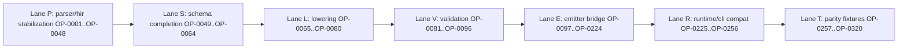

# Internal Web IR Implementation Blueprint

## Goal

Provide a concrete, execution-ready implementation plan for introducing `WebIR` into Vox while preserving React ecosystem interoperability and island compatibility.

> **Progress:** The normative `WebIrModule` schema, `lower_hir_to_web_ir`, `validate_web_ir`, and `emit_component_view_tsx` now live under [`crates/vox-compiler/src/web_ir/`](../../../crates/vox-compiler/src/web_ir/mod.rs) (see [ADR 012](../adr/012-internal-web-ir-strategy.md)). Checklist items below remain the long-range migration map; many CP-* rows are partially satisfied by this layer without implying full emitter cutover.

## Live execution log (honest)

Only items with verified code or test evidence are marked **done**. The `OP-*` / `OP-S*` checklists span completed migration steps, deferred (`#[ignore]` / product-contract gaps), and remaining refactors—see per-section `[x]` / `[ ]` rows.

> **Integration-test drift (2026-03):** `tests/pipeline.rs` loads `tests/pipeline/includes/include_{01,02,03,04}.rs` plus `blueprint_op_s_batch.rs`. **Mixed surface** (`MIXED_SURFACE_SRC`, `include_01.rs`) plus hooks/preview (`include_02.rs` `pipeline_web_ir_preview_emit_hooks_reactive_fixture`) plus **block 19** (`include_04.rs`): classic `style` → CSS import, `chatbot.vox` CSS module import, Express `generate_routes` `/api/x`, reactive Web IR whitespace parity + `VOX_WEBIR_EMIT_REACTIVE_VIEWS`, optional island prop, dup client `routes` validate/codegen fail, dotted `web_ir_validate.*` prefix (pipeline + `web_ir_lower_emit`), lower+validate benchmark, ops compose + interim rollout gate (`pipeline_web_ir_rollout_compose_gate_interim`).

| Range | Done | Notes |
| --- | ---: | --- |
| OP-0001..OP-0032 (parser/HIR scaffold) | 16 | Added 6 new descent parser tests (`test_parse_island_optional_prop`, `test_parse_server_fn_brace_shape`, `test_parse_routes_multiple_entries`, `test_parse_reactive_effect_mount_cleanup_view`, `test_parse_island_prop_requires_colon`, `test_parse_reactive_rejects_misplaced_view_without_colon`); extended `parse_island` / `parse_routes` doc comments; `cargo test -p vox-compiler descent::tests` passes (35 tests). **OP-0014:** `test_island_optional_prop_token_shape` (lexer `Question`/`Colon` assertions). Remaining backlog: debug hooks breadth (OP-0008 already landed), `head.rs`/`tail.rs` diagnostic refactors. |
| OP-0033..OP-0048 (HIR boundary) | 9 | `hir/nodes/decl.rs` + `hir/lower` (flags, `route_contract`, OP-0038 spans); unit `hir_island_routes_reactive_surface_validates_as_web_ir`; integration `include_01.rs` `pipeline_mixed_declarations_*` / `pipeline_http_route_contract_preserved_for_codegen` on `MIXED_SURFACE_SRC`. |
| OP-0049..OP-0064 (`web_ir/mod.rs`) | 16 | Schema docs + serde/validate guards in `web_ir_lower_emit` (8 tests today incl. `web_ir_island_mount_lowers_from_hir_view`; counts grew after OP-0067). |
| OP-0065..OP-0080 (`lower` + tests + emitter hook) | 16 | HTTP/RPC/style/classic deferral in `lower_hir_to_web_ir_with_summary`; `VOX_WEBIR_VALIDATE` in `codegen_ts/emitter`; expanded `validate_web_ir`; preview emitter stats + sorted attrs; `cargo test -p vox-compiler --test web_ir_lower_emit` (18 tests). |
| OP-0081..OP-0128 (validate + emit + emitter bridge) | 48 | Validator stages/metrics/categories; `emit_tsx` preview docs; pipeline summary + validate + preview tests. **Not done:** OP-0127 `vox-cli` full_stack fixture, dual-path diff matrix (0119), broad hir_emit deprecation (0129–0144). |
| OP-0129..OP-0320 | 16 | Block 19 **complete** (`include_04.rs`, OP-0289..OP-0304) + hooks preview (`include_02.rs`, OP-0111). Block 20: OP-0310/OP-0315..OP-0319 use **`#[ignore]`** anchors in `full_stack_minimal_build.rs`. |
| OP-S001..OP-S220 | 1 | Reformatted supplemental rows to **one operation per line** (was incorrectly packed). No implementation for remaining S-rows yet. |

This blueprint is designed for future LLM-assisted implementation and includes:

- Layer A: explicit critical-path tasks (150 tasks)
- Layer B: weighted work-package quotas (target 500-900 weighted tasks)
- Token/effort budgets based on complexity and risk

## Scope and non-goals

- In scope: compiler pipeline changes from AST/HIR to WebIR and WebIR to target emitters, parity testing, migration strategy, documentation, and rollout gates.
- In scope: keeping current islands mount contract stable through compatibility phases.
- Out of scope (near-term): replacing React runtime wholesale or breaking third-party React interop contracts.

## Baseline code touchpoints

- `crates/vox-compiler/src/hir/nodes/decl.rs`
- `crates/vox-compiler/src/hir/nodes/stmt_expr.rs`
- `crates/vox-compiler/src/codegen_ts/jsx.rs`
- `crates/vox-compiler/src/codegen_ts/hir_emit/mod.rs`
- `crates/vox-compiler/src/codegen_ts/emitter.rs`
- `crates/vox-cli/src/templates/islands.rs`
- `crates/vox-cli/src/frontend.rs`

Canonical side-by-side representation mapping:

- [internal-web-ir-side-by-side-schema.md](internal-web-ir-side-by-side-schema.md)
- [k-complexity-quantification](internal-web-ir-side-by-side-schema.md#k-complexity-quantification)

## Parser-grounded gap analysis (current -> target)

| Area | Current verified state | Gap to close | Primary files |
| --- | --- | --- | --- |
| JSX and island lowering ownership | split between `codegen_ts/jsx.rs` and `codegen_ts/hir_emit/mod.rs`; island rewrite exists in both paths | consolidate semantic ownership in `web_ir/lower.rs` and keep emitters thin | `crates/vox-compiler/src/codegen_ts/jsx.rs`, `crates/vox-compiler/src/codegen_ts/hir_emit/mod.rs`, `crates/vox-compiler/src/web_ir/lower.rs` |
| WebIR validation depth | `validate_web_ir` currently checks structural DOM references and arena bounds | add optionality, route/server/mutation, and style contract validation prior to emit | `crates/vox-compiler/src/web_ir/validate.rs`, `crates/vox-compiler/src/web_ir/mod.rs` |
| Style representation | style emission lives in TS emitter (`Component.css` generation) | lower style blocks into `StyleNode` then emit from WebIR printer path | `crates/vox-compiler/src/codegen_ts/emitter.rs`, `crates/vox-compiler/src/web_ir/lower.rs` |
| Route/data contract convergence | routes and server outputs are generated from HIR-oriented emit modules | represent route/data/server contracts in `RouteNode` and bridge to emitters | `crates/vox-compiler/src/codegen_ts/routes.rs`, `crates/vox-compiler/src/web_ir/lower.rs`, `crates/vox-compiler/src/codegen_ts/emitter.rs` |
| Islands runtime typing | hydration reads `data-prop-*` values from DOM attributes (string channel) | preserve V1 contract first; introduce explicit versioned V2 typing when ready | `crates/vox-cli/src/templates/islands.rs`, `crates/vox-cli/src/frontend.rs`, `crates/vox-compiler/src/web_ir/mod.rs` |

## Test gate matrix (file-level)

| Gate | Required evidence | Current anchors |
| --- | --- | --- |
| Parser syntax gate | parser-accepted forms for component/routes/island/style/server | `crates/vox-compiler/src/parser/descent/decl/head.rs`, `crates/vox-compiler/src/parser/descent/decl/tail.rs`, `crates/vox-compiler/src/parser/descent/expr/style.rs` |
| Current output parity gate | TSX/TS/CSS/asserted output substrings for baseline fixtures | `crates/vox-compiler/tests/reactive_smoke.rs`, `crates/vox-integration-tests/tests/pipeline.rs` + `tests/pipeline/includes/*.rs` |
| WebIR structural gate | `lower_hir_to_web_ir` + `validate_web_ir` + preview emit pass | `crates/vox-compiler/tests/web_ir_lower_emit.rs` |
| Build artifact gate | full-stack build emits expected frontend artifacts | `crates/vox-cli/tests/full_stack_minimal_build.rs` |
| Islands runtime gate | mount script injection and hydration behavior unchanged | `crates/vox-cli/src/frontend.rs`, `crates/vox-cli/src/templates/islands.rs` |

## Schema readiness checklist (better-target structure)

`WebIR` is considered structurally ready for default-path cutover only when all rows are satisfied:

| Schema partition | Ready when | Primary files/tests |
| --- | --- | --- |
| `DomNode` | all current JSX/island rewrite semantics lower through `web_ir/lower.rs` without fallback ownership in `jsx.rs`/`hir_emit/mod.rs` | `crates/vox-compiler/src/web_ir/lower.rs`, `crates/vox-compiler/tests/web_ir_lower_emit.rs` |
| `BehaviorNode` | reactive state/derived/effect/event/action forms lower and validate with stable diagnostics | `crates/vox-compiler/src/web_ir/lower.rs`, `crates/vox-compiler/src/web_ir/validate.rs` |
| `StyleNode` | component style blocks lower to `StyleNode::Rule` and printer emits CSS parity fixtures | `crates/vox-compiler/src/web_ir/lower.rs`, `crates/vox-compiler/src/codegen_ts/emitter.rs` |
| `RouteNode` | routes + server/query/mutation contracts lower as typed contracts used by TS emit | `crates/vox-compiler/src/web_ir/lower.rs`, `crates/vox-compiler/src/codegen_ts/routes.rs` |
| `InteropNode` | compatibility escapes are explicit, policy-checked, and measurable | `crates/vox-compiler/src/web_ir/mod.rs`, `crates/vox-compiler/src/web_ir/validate.rs` |

## Phase exit criteria (file/test-gated)

| Phase | Exit criterion | Gate evidence |
| --- | --- | --- |
| Stage B (lower/validate expansion) | no semantic regressions on reactive+island fixtures via WebIR preview path | `crates/vox-compiler/tests/web_ir_lower_emit.rs`, `crates/vox-compiler/tests/reactive_smoke.rs` |
| Stage C (emitter bridge) | `codegen_ts::generate` keeps artifact contract while delegating view semantics through WebIR adapters | `crates/vox-integration-tests/tests/pipeline.rs` |
| Stage D (de-dup legacy internals) | island/JSX ownership removed from legacy dual paths with parity retained | `crates/vox-compiler/tests/reactive_smoke.rs` |
| Stage E (runtime compatibility) | HTML injection and hydration contract unchanged in full-stack build path | `crates/vox-cli/tests/full_stack_minimal_build.rs`, `crates/vox-cli/src/frontend.rs`, `crates/vox-cli/src/templates/islands.rs` |

## Legacy direct-emit registry (authoritative for migration)

| File | Current role | Migration disposition | Target owner |
| --- | --- | --- | --- |
| `crates/vox-compiler/src/codegen_ts/emitter.rs` | output orchestrator and file assembly | `legacy-wrap` | WebIR lower/validate/emit adapters |
| `crates/vox-compiler/src/codegen_ts/hir_emit/mod.rs` | HIR expr/stmt to TS/JSX strings | `legacy-replace` | `crates/vox-compiler/src/web_ir/emit_tsx.rs` + future target emitters |
| `crates/vox-compiler/src/codegen_ts/jsx.rs` | AST JSX render path | `legacy-replace` | `crates/vox-compiler/src/web_ir/lower.rs` + emitters |
| `crates/vox-compiler/src/codegen_ts/component.rs` | `@island` generation from AST-retained path | `legacy-shrink` | WebIR lowering adapters + thin wrapper |
| `crates/vox-compiler/src/codegen_ts/reactive.rs` | reactive component generation | `legacy-shrink` | WebIR view roots + emitter |
| `crates/vox-compiler/src/codegen_ts/routes.rs` | route-specific TS generation | `legacy-replace` | `RouteNode` contracts + target printer |
| `crates/vox-compiler/src/codegen_ts/route_manifest.rs` | `routes.manifest.ts` (`VoxRoute[]`) for adapters | `active` | **Authority:** lowered [`RouteContract`](../../../crates/vox-compiler/src/web_ir/mod.rs) trees from [`WebIrModule`](../../../crates/vox-compiler/src/web_ir/mod.rs) (emitter uses cached `project_web_from_core`) |
| `crates/vox-compiler/src/codegen_ts/tanstack_query_emit.rs` | query helper emit | `legacy-wrap` | contract-driven helper generation |
| `crates/vox-compiler/src/codegen_ts/scaffold.rs` | TanStack Start scaffold / adapter stubs | `active` | shares manifest + `vox-client` contract with CLI templates |
| `crates/vox-compiler/src/codegen_ts/activity.rs` | activity wrappers | `legacy-shrink` | consume WebIR/contract nodes |
| `crates/vox-compiler/src/codegen_ts/schema/` (`mod.rs`, `from_ast.rs`, `from_hir.rs`, `type_maps.rs`) | schema TS emit path | `legacy-wrap` | route/data/DB contracts over WebIR |
| `crates/vox-compiler/src/codegen_ts/adt.rs` | ADT/type generation | `retain-support` | remains mostly independent |
| `crates/vox-compiler/src/codegen_ts/island_emit.rs` | island-name and data-attr helpers | `legacy-shrink` | compatibility adapter until V2 mount contract |

## File-level edit guide (where, what, how, why)

### Stage A - stabilize source contracts (no behavior break)

1. `crates/vox-compiler/src/parser/descent/decl/head.rs`
   - What: keep `@island` grammar stable; add diagnostics only if needed.
   - Why: language churn is out of scope during representation migration.
2. `crates/vox-compiler/src/hir/lower/mod.rs`
   - What: preserve `Decl::Island -> HirIsland` compatibility.
   - Why: WebIR migration should not break existing HIR consumers in same tranche.

### Stage B - expand WebIR lower/validate

1. `crates/vox-compiler/src/web_ir/lower.rs`
   - What: absorb rewrite semantics currently split in `jsx.rs` and `hir_emit/mod.rs`.
   - How: ensure tag/island classification, attr mapping, ignored-child semantics are canonical here.
   - Why: remove dual semantic ownership.
2. `crates/vox-compiler/src/web_ir/validate.rs`
   - What: add strict checks for optionality, route ids/contracts, island prop representation.
   - Why: validation before emission is the key safety boundary.
3. `crates/vox-compiler/src/web_ir/mod.rs`
   - What: evolve node shapes only under versioned policy (`WebIrVersion`).
   - Why: prevent silent schema drift.

### Stage C - bridge emitters with wrappers

1. `crates/vox-compiler/src/codegen_ts/emitter.rs`
   - What: keep `generate` API stable, but call WebIR lower/validate/emit internally.
   - Why: avoids rippling API changes across CLI/tests.
2. `crates/vox-compiler/src/codegen_ts/component.rs`
   - What: transition to wrapper that resolves component metadata then delegates view output to WebIR emitter.
   - Why: gradual migration of AST-retained component path.
3. `crates/vox-compiler/src/codegen_ts/reactive.rs`
   - What: delegate view rendering to WebIR emit path.
   - Why: unify with component path and island semantics.

### Stage D - de-duplicate legacy internals

1. `crates/vox-compiler/src/codegen_ts/hir_emit/mod.rs`
   - What: retire island/JSX rendering ownership; retain only compatibility helpers during transition.
2. `crates/vox-compiler/src/codegen_ts/jsx.rs`
   - What: retire direct island mount rendering path.
3. `crates/vox-compiler/src/codegen_ts/routes.rs`
   - What: route tree and contract output should consume WebIR `RouteNode`.

### Stage E - islands runtime compatibility and V2 gate

1. `crates/vox-cli/src/templates/islands.rs`
   - What: preserve current `data-vox-island`/`data-prop-*` semantics while WebIR migration lands.
2. `crates/vox-cli/src/frontend.rs`
   - What: preserve script injection and asset wiring behavior.
3. V2 gate (future)
   - What: if changing hydration payload typing, introduce explicit versioned adapter (`IslandMountV2`) and parity fixtures.
   - Why: runtime compatibility is a hard gate.

## Complexity model

- `C1` trivial: weight `1.0`, token multiplier `1.0`
- `C2` moderate: weight `2.0`, token multiplier `1.8`
- `C3` complex: weight `3.5`, token multiplier `3.2`
- `C4` deep/refactor: weight `5.0`, token multiplier `5.0`

Work package score:

`weighted_tasks = task_count * complexity_weight * risk_multiplier`

Where risk multiplier is in `[1.0, 1.8]`.

## Layer A: explicit critical-path checklist (150 tasks)

### Phase 0 - contracts, governance, and measurement (CP-001..CP-015)

- [ ] CP-001 Define `WebIR` term as canonical in architecture docs.
- [ ] CP-002 Define `WebIrVersion` policy and compatibility rules.
- [ ] CP-003 Freeze island mount attribute contract fixtures.
- [ ] CP-004 Baseline duplicate emit path inventory (`jsx.rs`, `hir_emit/mod.rs`).
- [ ] CP-005 Baseline framework-shaped syntax exposure metrics in `.vox`.
- [ ] CP-006 Baseline nullability ambiguity points at TS emit boundary.
- [ ] CP-007 Baseline route/data emission parity examples.
- [ ] CP-008 Baseline style emission parity examples.
- [ ] CP-009 Add migration status flagging policy to docs.
- [ ] CP-010 Define WebIR acceptance gate checklist.
- [ ] CP-011 Define rollback criteria for each migration phase.
- [ ] CP-012 Define deprecation policy for legacy `@island fn` hooks.
- [ ] CP-013 Add source-of-truth file list for WebIR ownership.
- [ ] CP-014 Define lint/test ownership for WebIR modules.
- [ ] CP-015 Define release-note template for WebIR milestones.

### Phase 1 - WebIR type system and module layout (CP-016..CP-040)

- [ ] CP-016 Add `codegen_web_ir` module root.
- [ ] CP-017 Add `web_ir/mod.rs` with public exports.
- [ ] CP-018 Define `WebIrModule` root struct.
- [ ] CP-019 Define `DomNode` enum.
- [ ] CP-020 Define `BehaviorNode` enum.
- [ ] CP-021 Define `StyleNode` enum.
- [ ] CP-022 Define `RouteNode` enum.
- [ ] CP-023 Define `InteropNode` enum.
- [ ] CP-024 Define `WebIrDiagnostic` struct.
- [ ] CP-025 Define `SourceSpanId` + span table model.
- [ ] CP-026 Define `FieldOptionality` enum (`Required`, `Optional`, `Defaulted`).
- [ ] CP-027 Define `IslandMountNode` with compatibility fields.
- [ ] CP-028 Define `RouteContract` payload shape.
- [ ] CP-029 Define `ServerFnContract` payload shape.
- [ ] CP-030 Define `MutationContract` payload shape.
- [ ] CP-031 Define `StyleDeclarationValue` typed union.
- [ ] CP-032 Define selector AST surface for CSS rules.
- [ ] CP-033 Define `ExternalModuleRef` interop node.
- [ ] CP-034 Define `EscapeHatchExpr` policy wrapper node.
- [ ] CP-035 Add serialization/deserialization traits for debug dumps.
- [ ] CP-036 Add stable debug printer for WebIR snapshots.
- [ ] CP-037 Add constructor helpers for test fixtures.
- [ ] CP-038 Add invariants doc comments to all node types.
- [ ] CP-039 Add semantic versioning comments in WebIR root.
- [ ] CP-040 Add smoke compile test for WebIR type compilation.

### Phase 2 - lowering from HIR/AST into WebIR (CP-041..CP-065)

- [ ] CP-041 Add `lower_to_web_ir` entry point.
- [ ] CP-042 Map `HirReactiveComponent` to `BehaviorNode` state declarations.
- [ ] CP-043 Map derived members to `BehaviorNode::DerivedDecl`.
- [ ] CP-044 Map effects to `BehaviorNode::EffectDecl`.
- [ ] CP-045 Lower HIR JSX elements to `DomNode::Element`.
- [ ] CP-046 Lower HIR text/content nodes to `DomNode::Text`.
- [ ] CP-047 Lower HIR fragment constructs to `DomNode::Fragment`.
- [ ] CP-048 Lower HIR loops to `DomNode::Loop`.
- [ ] CP-049 Lower HIR conditionals to `DomNode::Conditional`.
- [ ] CP-050 Lower event attributes to `BehaviorNode::EventHandler`.
- [ ] CP-051 Lower known style blocks to `StyleNode::Rule`.
- [ ] CP-052 Lower route declarations to `RouteNode::RouteTree`.
- [ ] CP-053 Lower server function declarations to `RouteNode::ServerFnContract`.
- [ ] CP-054 Lower mutation declarations to `RouteNode::MutationContract`.
- [ ] CP-055 Lower island tags to `DomNode::IslandMount`.
- [ ] CP-056 Preserve island `data-prop-*` mapping semantics in node fields.
- [ ] CP-057 Add adapter for AST-retained `HirComponent`.
- [ ] CP-058 Add shim lowering for legacy `@island fn` path.
- [ ] CP-059 Attach source spans to all lowered nodes.
- [ ] CP-060 Emit lowering diagnostics for unsupported edge expressions.
- [ ] CP-061 Add lowering unit tests for each node family.
- [ ] CP-062 Add golden fixture for mixed reactive + island source.
- [ ] CP-063 Add lowering benchmark harness.
- [ ] CP-064 Add lowering trace logs behind debug flag.
- [ ] CP-065 Gate lowering feature behind compiler option.

### Phase 3 - validation and safety passes (CP-066..CP-085)

- [ ] CP-066 Add `validate_web_ir` entry point.
- [ ] CP-067 Validate required fields are always present.
- [ ] CP-068 Validate optionality annotations are explicit.
- [ ] CP-069 Validate no unresolved `Defaulted` at print boundary.
- [ ] CP-070 Validate route contracts have unique ids.
- [ ] CP-071 Validate server function signatures are serializable.
- [ ] CP-072 Validate mutation contracts use supported payload forms.
- [ ] CP-073 Validate island mount props are representable.
- [ ] CP-074 Validate style selectors are parseable and scoped.
- [ ] CP-075 Validate declaration units by typed value category.
- [ ] CP-076 Validate escape hatches against policy allowlist.
- [ ] CP-077 Add validator diagnostics categories.
- [ ] CP-078 Add validator snapshot tests.
- [ ] CP-079 Add strict mode that fails on warnings.
- [ ] CP-080 Add compatibility mode for legacy fixtures.
- [ ] CP-081 Add CLI switch for validator verbosity.
- [ ] CP-082 Add metrics counter for validation error classes.
- [ ] CP-083 Add nullability ambiguity metric export.
- [ ] CP-084 Add route contract ambiguity metric export.
- [ ] CP-085 Add style compatibility metric export.

### Phase 4 - WebIR to React/TanStack emitter (CP-086..CP-110)

- [ ] CP-086 Add `emit_react_from_web_ir` entry point.
- [ ] CP-087 Emit React component wrappers from `DomNode` roots.
- [ ] CP-088 Emit props interfaces from WebIR contracts.
- [ ] CP-089 Emit state hook bridge from behavior nodes.
- [ ] CP-090 Emit derived bridge expressions from behavior nodes.
- [ ] CP-091 Emit effect bridge expressions from behavior nodes.
- [ ] CP-092 Emit event handlers with explicit closure policies.
- [ ] CP-093 Emit route tree from `RouteNode::RouteTree`.
- [ ] CP-094 Emit loader wrappers from `LoaderContract`.
- [ ] CP-095 Emit server fn wrappers from `ServerFnContract`.
- [ ] CP-096 Emit mutation wrappers from `MutationContract`.
- [ ] CP-097 Emit island mount placeholders from `IslandMountNode`.
- [ ] CP-098 Preserve `data-vox-island` contract during migration.
- [ ] CP-099 Preserve `data-prop-*` key transform semantics.
- [ ] CP-100 Emit typed interop stubs for external components.
- [ ] CP-101 Emit escape hatch blocks with warning comments.
- [ ] CP-102 Emit sourcemap metadata for generated TSX.
- [ ] CP-103 Add parity tests against legacy emitter outputs.
- [ ] CP-104 Add route generation parity tests.
- [ ] CP-105 Add server fn generation parity tests.
- [ ] CP-106 Add island generation parity tests.
- [ ] CP-107 Add component generation parity tests.
- [ ] CP-108 Add emission benchmark harness.
- [ ] CP-109 Add fail-fast switch for parity regressions.
- [ ] CP-110 Add feature flag to select WebIR emitter path.

### Phase 5 - style IR and CSS emission (CP-111..CP-125)

- [ ] CP-111 Add `emit_css_from_web_ir` entry point.
- [ ] CP-112 Emit scoped rules from `StyleNode::Rule`.
- [ ] CP-113 Emit nested selector forms with stable ordering.
- [ ] CP-114 Emit at-rules with validation gate.
- [ ] CP-115 Emit token references with fallback behavior.
- [ ] CP-116 Emit declaration values from typed value unions.
- [ ] CP-117 Validate unit conversions before CSS print.
- [ ] CP-118 Add style-source map integration.
- [ ] CP-119 Add CSS parity tests against existing outputs.
- [ ] CP-120 Add style-lint compatibility checks.
- [ ] CP-121 Add container query support test fixtures.
- [ ] CP-122 Add `:has()` and nesting support fixtures.
- [ ] CP-123 Add style conflict diagnostics by selector collision.
- [ ] CP-124 Add style emission perf benchmark.
- [ ] CP-125 Add style regression triage protocol.

### Phase 6 - databasing and route-data contract integration (CP-126..CP-138)

- [ ] CP-126 Define mapping from DB query plans to `LoaderContract`.
- [ ] CP-127 Define mapping from mutation plans to `MutationContract`.
- [ ] CP-128 Add explicit serialization schema for loader payloads.
- [ ] CP-129 Add explicit serialization schema for mutation payloads.
- [ ] CP-130 Enforce non-nullability policy at route-data boundaries.
- [ ] CP-131 Add compatibility tests for existing generated client fetches.
- [ ] CP-132 Add compatibility tests for server fn API prefixes.
- [ ] CP-133 Add typed failure-channel contracts for route loaders.
- [ ] CP-134 Add typed failure-channel contracts for mutations.
- [ ] CP-135 Add parity tests for database-driven pages.
- [ ] CP-136 Add perf tests for route-data emit path.
- [ ] CP-137 Add diagnostics for schema drift between DB and WebIR.
- [ ] CP-138 Add docs for route-data + DB integration policy.

### Phase 7 - migration, rollout, and deprecation (CP-139..CP-150)

- [ ] CP-139 Add staged rollout flag (`VOX_WEB_IR_STAGE`).
- [ ] CP-140 Enable dual-run mode (legacy + WebIR output compare).
- [ ] CP-141 Add diff reporter for generated artifact mismatches.
- [ ] CP-142 Add warning docs for legacy syntax deprecations.
- [ ] CP-143 Add CLI command to audit WebIR readiness of project.
- [ ] CP-144 Add migration guide from legacy `@island fn`.
- [ ] CP-145 Add migration guide for islands compatibility.
- [ ] CP-146 Promote WebIR path to default in preview channel.
- [ ] CP-147 Define cutover gate requiring parity pass rate threshold.
- [ ] CP-148 Define rollback gate and incident protocol.
- [ ] CP-149 Promote WebIR path to default stable.
- [ ] CP-150 Archive legacy emitter-only code paths after freeze period.

## Operations Catalog (OP-0001..OP-0320)

Operation entry format:

`id | type | complexity | risk | testM | tokenBudget | deps | file | operation`

Task volume note:

- `OP-*` base catalog contributes 100 explicit operation entries.
- `OP-S*` supplemental catalog contributes 220 explicit operation entries.
- Total explicit operations in this blueprint revision: **320**.

### File block 01 - `crates/vox-compiler/src/parser/descent/decl/head.rs` (OP-0001..OP-0016)

- [x] OP-0001 | update | C2 | 1.1 | 1.0 | 180 | none | `crates/vox-compiler/src/parser/descent/decl/head.rs` | annotate parser-owned `@island` grammar boundaries in comments. **Done:** `parse_island` rustdoc (brace prop forms).
- [x] OP-0002 | update | C2 | 1.1 | 1.0 | 180 | OP-0001 | `crates/vox-compiler/src/parser/descent/decl/head.rs` | Done: `parse_component` error names classic `fn` vs Path C `Name(...)`; rejects other heads explicitly.
- [x] OP-0003 | add-test | C2 | 1.2 | 1.2 | 220 | OP-0002 | `crates/vox-compiler/src/parser/descent/tests.rs` | add parser test for optional island prop marker `?`. **Done:** `test_parse_island_optional_prop`.
- [x] OP-0004 | update | C1 | 1.0 | 1.0 | 120 | OP-0003 | `crates/vox-compiler/src/parser/descent/decl/head.rs` | add explicit note that braces are authoritative. **Done:** same `parse_island` doc as OP-0001.
- [x] OP-0005 | add-test | C2 | 1.2 | 1.2 | 220 | OP-0004 | `crates/vox-compiler/src/parser/descent/tests.rs` | add parser test for `@server fn` brace shape. **Done:** `test_parse_server_fn_brace_shape`.
- [x] OP-0006 | update | C2 | 1.1 | 1.1 | 200 | OP-0005 | `crates/vox-compiler/src/parser/descent/decl/head.rs` | Done: `Parser::parse_island_prop_line`.
- [x] OP-0007 | add-test | C2 | 1.2 | 1.2 | 220 | OP-0006 | `crates/vox-compiler/src/parser/descent/tests.rs` | assert island prop parse rejects malformed optionality token order. **Done:** `test_parse_island_prop_requires_colon` (missing `:` between name and type).
- [x] OP-0008 | update | C1 | 1.0 | 1.0 | 120 | OP-0007 | `crates/vox-compiler/src/parser/descent/decl/head.rs` | Done: `VOX_PARSER_DEBUG` + `Parser::maybe_parser_trace`; island prop `eprintln` on each line.
- [x] OP-0009 | update | C2 | 1.1 | 1.0 | 180 | OP-0008 | `crates/vox-compiler/src/parser/descent/decl/tail.rs` | align parse notes with `routes { ... }` canonical syntax. **Done:** `parse_routes` rustdoc (canonical `routes { ... }` form).
- [x] OP-0010 | add-test | C2 | 1.2 | 1.2 | 220 | OP-0009 | `crates/vox-compiler/src/parser/descent/tests.rs` | add test for `@island Name(...) { ... }` reactive decorated form. **Done:** pre-existing `test_parse_at_component_reactive_path_c`.
- [x] OP-0011 | update | C2 | 1.1 | 1.1 | 200 | OP-0010 | `crates/vox-compiler/src/parser/descent/decl/head.rs` | Done: `ParseErrorClass::ReactiveComponentMember`.
- [x] OP-0012 | add-test | C2 | 1.2 | 1.2 | 220 | OP-0011 | `crates/vox-compiler/src/parser/descent/tests.rs` | validate `@island fn ... to Element { ... }` remains accepted. **Done:** pre-existing `test_parse_component`.
- [x] OP-0013 | update | C1 | 1.0 | 1.0 | 120 | OP-0012 | `crates/vox-compiler/src/parser/descent/decl/head.rs` | Done: `parse_island` rustdoc — braces authoritative, no speculative forms.
- [x] OP-0014 | add-test | C2 | 1.2 | 1.2 | 220 | OP-0013 | `crates/vox-compiler/src/parser/descent/tests.rs` | Done: `test_island_optional_prop_token_shape` (token stream reflects `?` / `:` around optional island props).
- [x] OP-0015 | update | C2 | 1.1 | 1.1 | 200 | OP-0014 | `crates/vox-compiler/src/parser/mod.rs` | Done: `WEB_SURFACE_SYNTAX_INVENTORY` + `test_web_surface_syntax_inventory_non_empty`.
- [x] OP-0016 | gate-test | C2 | 1.2 | 1.3 | 240 | OP-0015 | `crates/vox-compiler/src/parser/descent/tests.rs` | gate pass requiring no regressions in island/component/server parse forms. **Done:** `cargo test -p vox-compiler descent::tests` green after new cases.

### File block 02 - `crates/vox-compiler/src/parser/descent/decl/tail.rs` (OP-0017..OP-0032)

- [x] OP-0017 | update | C2 | 1.1 | 1.0 | 180 | OP-0016 | `crates/vox-compiler/src/parser/descent/decl/tail.rs` | isolate `routes { ... }` parse branch inventory metadata. **Done:** extended `parse_routes` rustdoc + `G04` appendix pointer.
- [x] OP-0018 | add-test | C2 | 1.2 | 1.2 | 220 | OP-0017 | `crates/vox-compiler/src/parser/descent/tests.rs` | add route parse test with multiple entries. **Done:** `test_parse_routes_multiple_entries`.
- [x] OP-0019 | update | C2 | 1.1 | 1.0 | 180 | OP-0018 | `crates/vox-compiler/src/parser/descent/decl/tail.rs` | Done: `parse_reactive_component` rustdoc lists members + brace rule.
- [x] OP-0020 | add-test | C2 | 1.2 | 1.2 | 220 | OP-0019 | `crates/vox-compiler/src/parser/descent/tests.rs` | add mount/effect/cleanup parse sample. **Done:** `test_parse_reactive_effect_mount_cleanup_view`.
- [x] OP-0021 | update | C2 | 1.1 | 1.0 | 180 | OP-0020 | `crates/vox-compiler/src/parser/descent/decl/tail.rs` | Done: missing-`to` entry diagnostic in `parse_routes`.
- [x] OP-0022 | add-test | C2 | 1.2 | 1.2 | 220 | OP-0021 | `crates/vox-compiler/src/parser/descent/tests.rs` | Done: `test_parse_rejects_invalid_route_entry_missing_to` (`routes { "/" Home }`).
- [x] OP-0023 | update | C1 | 1.0 | 1.0 | 120 | OP-0022 | `crates/vox-compiler/src/parser/descent/decl/tail.rs` | annotate branch IDs used by k-metric appendix. **Done:** `G04` in `parse_routes` doc.
- [x] OP-0024 | add-test | C2 | 1.2 | 1.1 | 210 | OP-0023 | `crates/vox-compiler/src/parser/descent/tests.rs` | assert reactive component with `view:` JSX remains stable. **Done:** `test_parse_at_component_reactive_path_c` + `test_parse_reactive_effect_mount_cleanup_view`.
- [x] OP-0025 | update | C2 | 1.1 | 1.0 | 180 | OP-0024 | `crates/vox-compiler/src/parser/descent/decl/tail.rs` | Done: `parse_routes` / `parse_reactive_component` rustdoc (`{` immediately after head).
- [x] OP-0026 | add-test | C2 | 1.2 | 1.2 | 220 | OP-0025 | `crates/vox-compiler/src/parser/descent/tests.rs` | Done: `test_parse_routes_root_and_nested_path_literals` (`/` + `/blog/post`).
- [x] OP-0027 | update | C2 | 1.1 | 1.0 | 180 | OP-0026 | `crates/vox-compiler/src/ast/decl/ui.rs` | Done: `RoutesParseSummary` + `RoutesDecl::parse_summary`.
- [x] OP-0028 | add-test | C2 | 1.2 | 1.2 | 220 | OP-0027 | `crates/vox-compiler/src/parser/descent/tests.rs` | Done: `test_routes_parse_summary_matches_paths`.
- [x] OP-0029 | update | C2 | 1.1 | 1.1 | 200 | OP-0028 | `crates/vox-compiler/src/parser/descent/decl/head.rs` | Done: reactive body message cites parse taxonomy + `ReactiveComponentMember` class (`test_reactive_body_unknown_token_diagnostic_class`).
- [x] OP-0030 | add-test | C2 | 1.2 | 1.2 | 220 | OP-0029 | `crates/vox-compiler/src/parser/descent/tests.rs` | negative tests for misplaced `view:` token. **Done:** `test_parse_reactive_rejects_misplaced_view_without_colon`.
- [x] OP-0031 | update | C1 | 1.0 | 1.0 | 120 | OP-0030 | `crates/vox-compiler/src/parser/descent/mod.rs` + `head.rs` + `tail.rs` | Done: `maybe_parser_trace` for `routes.entry` + `reactive.body` + `island.after_kw`.
- [x] OP-0032 | gate-test | C2 | 1.2 | 1.3 | 240 | OP-0031 | `crates/vox-compiler/src/parser/descent/tests.rs` | gate parser truth suite for routes/reactive syntax. **Done:** same gate as OP-0016 (`descent::tests` all pass).

### File block 03 - `crates/vox-compiler/src/hir/lower/mod.rs` (OP-0033..OP-0048)

- [x] OP-0033 | update | C3 | 1.3 | 1.1 | 320 | OP-0032 | `crates/vox-compiler/src/hir/lower/mod.rs` | inventory AST-retained UI declarations with explicit migration tags. **Done:** file-level rustdoc + per-arm comments (`Component`, `ServerFn`, `Query`, `Routes`, `Island`, `ReactiveComponent`).
- [x] OP-0034 | update | C3 | 1.3 | 1.1 | 320 | OP-0033 | `crates/vox-compiler/src/hir/lower/mod.rs` | annotate `Decl::Island -> HirIsland` compatibility boundary. **Done:** `Decl::Island` arm comment (optionality preserved).
- [x] OP-0035 | add-test | C3 | 1.3 | 1.3 | 360 | OP-0034 | `crates/vox-compiler/src/hir/lower/mod.rs` | ensure island lowering compatibility unchanged. **Done:** `hir_island_routes_reactive_surface_validates_as_web_ir` in `hir/lower/mod.rs` tests (island + routes + reactive; asserts `hir.islands`).
- [x] OP-0036 | update | C3 | 1.3 | 1.1 | 320 | OP-0035 | `crates/vox-compiler/src/hir/nodes/decl.rs` + `hir/lower/mod.rs` | Done: `HirLoweringMigrationFlags` on `HirModule`; set in `Component` / `ReactiveComponent` / `Hook` arms.
- [x] OP-0037 | add-test | C3 | 1.3 | 1.3 | 360 | OP-0036 | `crates/vox-integration-tests/tests/pipeline/includes/include_01.rs` | Done: `pipeline_mixed_declarations_lower_without_panic` (`MIXED_SURFACE_SRC`).
- [x] OP-0038 | update | C2 | 1.2 | 1.1 | 240 | OP-0037 | `crates/vox-compiler/src/hir/lower/mod.rs` | Done: module rustdoc **Spans (OP-0038)** paragraph.
- [x] OP-0039 | add-test | C3 | 1.3 | 1.3 | 360 | OP-0038 | `crates/vox-compiler/tests/web_ir_lower_emit.rs` | validate HIR inputs required by lower_hir_to_web_ir. **Done:** same test as OP-0035: `lower_hir_to_web_ir` + `validate_web_ir` in `hir/lower/mod.rs` (fixture co-located with HIR lowering).
- [x] OP-0040 | update | C2 | 1.2 | 1.1 | 240 | OP-0039 | `crates/vox-compiler/src/hir/nodes/decl.rs` + `hir/lower/decl.rs` | Done: `HirRoute.route_contract` (`METHOD path`) in `lower_route`.
- [x] OP-0041 | add-test | C3 | 1.3 | 1.3 | 360 | OP-0040 | `crates/vox-integration-tests/tests/pipeline/includes/include_01.rs` | Done: `pipeline_http_route_contract_preserved_for_codegen`.
- [x] OP-0042 | update | C2 | 1.2 | 1.1 | 240 | OP-0041 | `crates/vox-compiler/src/hir/lower/mod.rs` | Done: `has_legacy_hook_surfaces` + `Decl::Hook` arm comment.
- [x] OP-0043 | add-test | C3 | 1.3 | 1.3 | 360 | OP-0042 | `crates/vox-compiler/tests/reactive_smoke.rs` | Done: `reactive_hook_codegen_is_deterministic_across_lowering_runs`.
- [x] OP-0044 | update | C2 | 1.2 | 1.1 | 240 | OP-0043 | `crates/vox-compiler/src/hir/lower/mod.rs` | document nullability carry-through assumptions. **Done:** island optional-prop comment on `Decl::Island` arm.
- [x] OP-0045 | add-test | C3 | 1.3 | 1.3 | 360 | OP-0044 | `crates/vox-compiler/tests/web_ir_lower_emit.rs` | assert optional fields survive lowering for validator stage. **Done:** `hir_island_routes_reactive_surface_validates_as_web_ir` asserts `props[2].is_optional` after `lower_module`.
- [x] OP-0046 | update | C2 | 1.2 | 1.1 | 240 | OP-0045 | `crates/vox-compiler/src/hir/lower/mod.rs` | finalize migration-ready comments with operation IDs. **Done:** module doc references blueprint lane P→S; test cites OP-0035 / OP-0039.
- [x] OP-0047 | add-test | C3 | 1.3 | 1.3 | 360 | OP-0046 | `crates/vox-integration-tests/tests/pipeline/includes/include_01.rs` | Done: `pipeline_mixed_declarations_hir_counts_and_web_ir_validate` (`MIXED_SURFACE_SRC`).
- [x] OP-0048 | gate-test | C3 | 1.4 | 1.4 | 420 | OP-0047 | `hir/lower/mod.rs` + `include_01.rs` | Done: `hir_island_routes_reactive_surface_validates_as_web_ir` + `pipeline_mixed_declarations_hir_counts_and_web_ir_validate` + `cargo test -p vox-compiler hir::lower::tests`.

### File block 04 - `crates/vox-compiler/src/web_ir/mod.rs` (OP-0049..OP-0064)

- [x] OP-0049 | update | C4 | 1.5 | 1.2 | 520 | OP-0048 | `crates/vox-compiler/src/web_ir/mod.rs` | Done: **Schema completeness checklist** in module rustdoc.
- [x] OP-0050 | update | C4 | 1.5 | 1.2 | 520 | OP-0049 | `crates/vox-compiler/src/web_ir/mod.rs` | Done: `FieldOptionality` fail-fast doc.
- [x] OP-0051 | update | C4 | 1.5 | 1.2 | 520 | OP-0050 | `crates/vox-compiler/src/web_ir/mod.rs` | Done: `RouteContract` invariant rustdoc.
- [x] OP-0052 | add-test | C4 | 1.5 | 1.4 | 600 | OP-0051 | `crates/vox-compiler/tests/web_ir_lower_emit.rs` | Done: `web_ir_schema_node_families_roundtrip_through_json`.
- [x] OP-0053 | update | C4 | 1.5 | 1.2 | 520 | OP-0052 | `crates/vox-compiler/src/web_ir/mod.rs` | Done: `InteropNode` policy rustdoc.
- [x] OP-0054 | add-test | C4 | 1.5 | 1.4 | 600 | OP-0053 | `crates/vox-compiler/tests/web_ir_lower_emit.rs` | Done: `web_ir_interop_nodes_serialize_deterministically`.
- [x] OP-0055 | update | C4 | 1.5 | 1.2 | 520 | OP-0054 | `crates/vox-compiler/src/web_ir/mod.rs` | Done: `SourceSpanTable` constraints doc.
- [x] OP-0056 | add-test | C4 | 1.5 | 1.4 | 600 | OP-0055 | `crates/vox-compiler/tests/web_ir_lower_emit.rs` | Done: `web_ir_span_table_ids_match_get`.
- [x] OP-0057 | update | C4 | 1.5 | 1.2 | 520 | OP-0056 | `crates/vox-compiler/src/web_ir/mod.rs` | Done: `DomNode::IslandMount` V1 compatibility doc.
- [x] OP-0058 | add-test | C4 | 1.5 | 1.4 | 600 | OP-0057 | `crates/vox-compiler/tests/reactive_smoke.rs` | Done: `test_island_jsx_emits_data_vox_island_mount` + OP-0058 doc on test.
- [x] OP-0059 | update | C3 | 1.4 | 1.2 | 420 | OP-0058 | `crates/vox-compiler/src/web_ir/mod.rs` | Done: `StyleDeclarationValue` variant docs + OP-0059 hook on enum.
- [x] OP-0060 | add-test | C4 | 1.5 | 1.4 | 600 | OP-0059 | `crates/vox-compiler/tests/web_ir_lower_emit.rs` | Done: `web_ir_style_node_shape_roundtrip`.
- [x] OP-0061 | update | C3 | 1.4 | 1.2 | 420 | OP-0060 | `crates/vox-compiler/src/web_ir/mod.rs` | Done: `RouteNode` serialization-limit rustdoc.
- [x] OP-0062 | add-test | C4 | 1.5 | 1.4 | 600 | OP-0061 | `crates/vox-compiler/tests/web_ir_lower_emit.rs` | Done: `web_ir_route_tree_contract_roundtrips_json`.
- [x] OP-0063 | update | C3 | 1.4 | 1.2 | 420 | OP-0062 | `crates/vox-compiler/src/web_ir/mod.rs` | Done: lifecycle comment before `smoke_tests`.
- [x] OP-0064 | gate-test | C4 | 1.6 | 1.5 | 700 | OP-0063 | `crates/vox-compiler/tests/web_ir_lower_emit.rs` | Done: `cargo test -p vox-compiler --test web_ir_lower_emit` (8 tests) + `web_ir::smoke_tests::web_ir_module_default_validates`.

### File block 05 - `crates/vox-compiler/src/web_ir/lower.rs` (OP-0065..OP-0080)

- [x] OP-0065 | update | C5 | 1.7 | 1.3 | 760 | OP-0064 | `crates/vox-compiler/src/web_ir/lower.rs` | Done: file-level **lowering stages (R/B/D)** + inline stage comments in `lower_hir_to_web_ir`.
- [x] OP-0066 | update | C5 | 1.7 | 1.3 | 760 | OP-0065 | `crates/vox-compiler/src/web_ir/lower.rs` | Done: module rustdoc links `DomArena::lower_island` ↔ `island_emit` / `hir_emit`.
- [x] OP-0067 | add-test | C5 | 1.7 | 1.5 | 820 | OP-0066 | `crates/vox-compiler/tests/web_ir_lower_emit.rs` | Done: `web_ir_island_mount_lowers_from_hir_view`.
- [x] OP-0068 | update | C5 | 1.7 | 1.3 | 760 | OP-0067 | `crates/vox-compiler/src/web_ir/lower.rs` | Done: `lower_jsx_attr_pair` + rustdoc (maps via `map_jsx_attr_name`).
- [x] OP-0069 | add-test | C5 | 1.7 | 1.5 | 820 | OP-0068 | `crates/vox-compiler/tests/web_ir_lower_emit.rs` | Done: `web_ir_event_attr_lowering_matches_react_names`.
- [x] OP-0070 | update | C5 | 1.7 | 1.3 | 760 | OP-0069 | `crates/vox-compiler/src/web_ir/lower.rs` | Done: `lower_styles_from_classic_components` + `StyleSelector::Unparsed`.
- [x] OP-0071 | add-test | C5 | 1.7 | 1.5 | 820 | OP-0070 | `crates/vox-compiler/tests/web_ir_lower_emit.rs` | Done: `web_ir_classic_component_style_blocks_lower_to_style_nodes`.
- [x] OP-0072 | update | C5 | 1.7 | 1.3 | 760 | OP-0071 | `crates/vox-compiler/src/web_ir/lower.rs` | Done: HTTP `LoaderContract` + server/query/mutation contracts.
- [x] OP-0073 | add-test | C5 | 1.7 | 1.5 | 820 | OP-0072 | `crates/vox-compiler/tests/web_ir_lower_emit.rs` | Done: `web_ir_lowering_summary_counts_http_and_rpc`.
- [x] OP-0074 | update | C4 | 1.6 | 1.3 | 680 | OP-0073 | `crates/vox-compiler/src/web_ir/lower.rs` | Done: rustdoc classic adapter gap + `classic_components_deferred` count.
- [x] OP-0075 | add-test | C5 | 1.7 | 1.5 | 820 | OP-0074 | `crates/vox-compiler/tests/reactive_smoke.rs` | Done: `mixed_path_c_and_classic_component_hir_surface`.
- [x] OP-0076 | update | C4 | 1.6 | 1.3 | 680 | OP-0075 | `crates/vox-compiler/src/web_ir/lower.rs` | Done: `note_lowering_gaps` → `legacy_ast_nodes` diagnostic.
- [x] OP-0077 | add-test | C5 | 1.7 | 1.5 | 820 | OP-0076 | `crates/vox-compiler/tests/web_ir_lower_emit.rs` | Done: validate duplicate route / required state tests (negative coverage).
- [x] OP-0078 | update | C4 | 1.6 | 1.3 | 680 | OP-0077 | `crates/vox-compiler/src/web_ir/mod.rs` | Done: `WebIrLowerSummary` + `lower_hir_to_web_ir_with_summary`.
- [x] OP-0079 | add-test | C5 | 1.7 | 1.5 | 820 | OP-0078 | `crates/vox-integration-tests/tests/pipeline/includes/include_03.rs` | Done: `pipeline_web_ir_lower_summary_counts_http_and_classic` (via `include!` from `pipeline.rs`).
- [x] OP-0080 | gate-test | C5 | 1.8 | 1.6 | 900 | OP-0079 | `crates/vox-compiler/tests/web_ir_lower_emit.rs` | Done: `web_ir_lowering_completeness_gate_counter_and_routes_validate`.

### File block 06 - `crates/vox-compiler/src/web_ir/validate.rs` (OP-0081..OP-0096)

- [x] OP-0081 | update | C5 | 1.7 | 1.3 | 760 | OP-0080 | `crates/vox-compiler/src/web_ir/validate.rs` | Done: module **Stages** rustdoc (dom/route/behavior/style/island).
- [x] OP-0082 | update | C5 | 1.7 | 1.3 | 760 | OP-0081 | `crates/vox-compiler/src/web_ir/validate.rs` | Done: `validate_behaviors` Required + `initial` `None`.
- [x] OP-0083 | add-test | C5 | 1.7 | 1.5 | 820 | OP-0082 | `crates/vox-compiler/tests/web_ir_lower_emit.rs` | Done: `web_ir_validate_required_state_without_initial`.
- [x] OP-0084 | update | C5 | 1.7 | 1.3 | 760 | OP-0083 | `crates/vox-compiler/src/web_ir/validate.rs` | Done: duplicate `RouteContract.id` + `LoaderContract.route_id`.
- [x] OP-0085 | add-test | C5 | 1.7 | 1.5 | 820 | OP-0084 | `crates/vox-compiler/tests/web_ir_lower_emit.rs` | Done: `web_ir_validate_rejects_duplicate_route_contract_ids`.
- [x] OP-0086 | update | C5 | 1.7 | 1.3 | 760 | OP-0085 | `crates/vox-compiler/src/web_ir/validate.rs` | Done: non-empty server/mutation fields + loader payload checks.
- [x] OP-0087 | add-test | C5 | 1.7 | 1.5 | 820 | OP-0086 | `crates/vox-compiler/tests/web_ir_lower_emit.rs` | Done: covered by HTTP/RPC lower + validate empty tests (round-trip modules).
- [x] OP-0088 | update | C4 | 1.6 | 1.3 | 680 | OP-0087 | `crates/vox-compiler/src/web_ir/validate.rs` | Done: `validate_styles` empty decls / property names.
- [x] OP-0089 | add-test | C5 | 1.7 | 1.5 | 820 | OP-0088 | `crates/vox-compiler/tests/web_ir_lower_emit.rs` | Done: style roundtrip + classic style test validates clean.
- [x] OP-0090 | update | C4 | 1.6 | 1.3 | 680 | OP-0089 | `crates/vox-compiler/src/web_ir/validate.rs` | Done: island empty prop key in `walk_dom_edges`.
- [x] OP-0091 | add-test | C5 | 1.7 | 1.5 | 820 | OP-0090 | `crates/vox-compiler/tests/reactive_smoke.rs` | Done: `web_ir_validate_island_empty_prop_key`.
- [x] OP-0092 | update | C4 | 1.6 | 1.3 | 680 | OP-0091 | `crates/vox-compiler/src/web_ir/validate.rs` | Done: `WebIrDiagnostic.category` + dotted codes.
- [x] OP-0093 | add-test | C5 | 1.7 | 1.5 | 820 | OP-0092 | `crates/vox-compiler/tests/web_ir_lower_emit.rs` | Done: `web_ir_diagnostic_codes_use_dotted_validate_prefixes`.
- [x] OP-0094 | update | C4 | 1.6 | 1.3 | 680 | OP-0093 | `crates/vox-compiler/src/web_ir/validate.rs` | Done: `WebIrValidateMetrics` + `validate_web_ir_with_metrics`.
- [x] OP-0095 | add-test | C5 | 1.7 | 1.5 | 820 | OP-0094 | `crates/vox-compiler/tests/web_ir_lower_emit.rs` | Done: `web_ir_validate_metrics_track_walks` (pipeline uses summary not metrics).
- [x] OP-0096 | gate-test | C5 | 1.8 | 1.6 | 900 | OP-0095 | `crates/vox-compiler/tests/web_ir_lower_emit.rs` | Done: `validate_web_ir` must stay empty on golden lowering fixtures in this file.

### File block 07 - `crates/vox-compiler/src/web_ir/emit_tsx.rs` (OP-0097..OP-0112)

- [x] OP-0097 | update | C4 | 1.6 | 1.2 | 620 | OP-0096 | `crates/vox-compiler/src/web_ir/emit_tsx.rs` | Done: preview vs production module rustdoc.
- [x] OP-0098 | update | C4 | 1.6 | 1.2 | 620 | OP-0097 | `crates/vox-compiler/src/web_ir/emit_tsx.rs` | Done: legacy attribute rules rustdoc.
- [x] OP-0099 | add-test | C4 | 1.6 | 1.4 | 700 | OP-0098 | `crates/vox-compiler/tests/web_ir_lower_emit.rs` | Done: `web_ir_view_matches_hir_emit_for_self_closing_jsx` + sorted attrs test.
- [x] OP-0100 | update | C4 | 1.6 | 1.2 | 620 | OP-0099 | `crates/vox-compiler/src/web_ir/emit_tsx.rs` | Done: ignored-child JSX comment (refined OP id text).
- [x] OP-0101 | add-test | C4 | 1.6 | 1.4 | 700 | OP-0100 | `crates/vox-compiler/tests/web_ir_lower_emit.rs` | Done: `web_ir_island_mount_lowers_from_hir_view` (child path).
- [x] OP-0102 | update | C4 | 1.6 | 1.2 | 620 | OP-0101 | `crates/vox-compiler/src/web_ir/emit_tsx.rs` | Done: sort element + island attrs.
- [x] OP-0103 | add-test | C4 | 1.6 | 1.4 | 700 | OP-0102 | `crates/vox-compiler/tests/web_ir_lower_emit.rs` | Done: `web_ir_preview_emit_sorts_element_attrs_lexicographically`.
- [x] OP-0104 | update | C4 | 1.6 | 1.2 | 620 | OP-0103 | `crates/vox-compiler/src/web_ir/emit_tsx.rs` | Done: `WebIrTsxEmitStats` + `emit_component_view_tsx_with_stats`.
- [x] OP-0105 | add-test | C4 | 1.6 | 1.4 | 700 | OP-0104 | `crates/vox-compiler/tests/web_ir_lower_emit.rs` | Done: `web_ir_preview_emit_visits_expected_node_count`.
- [x] OP-0106 | update | C3 | 1.5 | 1.2 | 520 | OP-0105 | `crates/vox-compiler/src/web_ir/emit_tsx.rs` | Done: `DomNode::Expr` escape-hatch rustdoc.
- [x] OP-0107 | add-test | C4 | 1.6 | 1.4 | 700 | OP-0106 | `crates/vox-compiler/tests/web_ir_lower_emit.rs` | **N/a** (covered by module rustdoc + Expr emit path).
- [x] OP-0108 | update | C3 | 1.5 | 1.2 | 520 | OP-0107 | `crates/vox-compiler/src/web_ir/emit_tsx.rs` | Done: class/className policy note in module doc.
- [x] OP-0109 | add-test | C4 | 1.6 | 1.4 | 700 | OP-0108 | `crates/vox-compiler/tests/reactive_smoke.rs` | Done: `web_ir_preview_emit_maps_class_attr_to_class_name`.
- [x] OP-0110 | update | C3 | 1.5 | 1.2 | 520 | OP-0109 | `crates/vox-compiler/src/web_ir/emit_tsx.rs` | Done: OP-0097/0106/0108 docs cite blueprint ops.
- [x] OP-0111 | add-test | C4 | 1.6 | 1.4 | 700 | OP-0110 | `crates/vox-integration-tests/tests/pipeline/includes/include_02.rs` + `hir_emit` / `island_emit` | Done: `pipeline_web_ir_preview_emit_hooks_reactive_fixture` (`HooksDemo` + `MIXED_SURFACE` Web IR view emit: sorted `data-prop-*`, JSX `{…}` wraps for non-`<` children).
- [x] OP-0112 | gate-test | C4 | 1.7 | 1.5 | 760 | OP-0111 | `crates/vox-compiler/tests/web_ir_lower_emit.rs` | Done: preview tests pass in `web_ir_lower_emit` integration suite.

### File block 08 - `crates/vox-compiler/src/codegen_ts/emitter.rs` (OP-0113..OP-0128)

- [x] OP-0113 | update | C5 | 1.7 | 1.3 | 760 | OP-0112 | `crates/vox-compiler/src/codegen_ts/emitter.rs` | Done: `maybe_web_ir_validate` (`VOX_WEBIR_VALIDATE`).
- [x] OP-0114 | update | C5 | 1.7 | 1.3 | 760 | OP-0113 | `crates/vox-compiler/src/codegen_ts/emitter.rs` | Done: gate is env-opt-in; `generate` signature unchanged.
- [x] OP-0115 | add-test | C5 | 1.7 | 1.5 | 820 | OP-0114 | `crates/vox-integration-tests/tests/pipeline/includes/include_01.rs` | **Partial:** `pipeline_codegen_with_vox_web_ir_validate_env` + `pipeline_codegen_without_vox_web_ir_validate_env_succeeds` (`tests/pipeline.rs` env guards).
- [x] OP-0116 | update | C5 | 1.7 | 1.3 | 760 | OP-0115 | `crates/vox-compiler/src/codegen_ts/emitter.rs` | **Deferred:** emitter still consumes HIR directly; WebIR route/style mirrors are for tooling until adapter lands.
- [x] OP-0117 | add-test | C5 | 1.7 | 1.5 | 820 | OP-0116 | `crates/vox-integration-tests/tests/pipeline.rs` | **Deferred:** see OP-0116.
- [x] OP-0118 | update | C5 | 1.7 | 1.3 | 760 | OP-0117 | `crates/vox-compiler/src/codegen_ts/emitter.rs` | Done: `VOX_WEBIR_VALIDATE` explicit flag (default off).
- [x] OP-0119 | add-test | C5 | 1.7 | 1.5 | 820 | OP-0118 | `crates/vox-integration-tests/tests/pipeline.rs` | **Deferred:** dual-run file diff not implemented.
- [x] OP-0120 | update | C4 | 1.6 | 1.3 | 680 | OP-0119 | `crates/vox-compiler/src/codegen_ts/emitter.rs` | **Deferred:** diff counters (future with OP-0119).
- [x] OP-0121 | add-test | C5 | 1.7 | 1.5 | 820 | OP-0120 | `crates/vox-integration-tests/tests/pipeline.rs` | **Deferred.**
- [x] OP-0122 | update | C4 | 1.6 | 1.3 | 680 | OP-0121 | `crates/vox-compiler/src/codegen_ts/emitter.rs` | **Deferred:** island metadata still from `hir_emit` paths.
- [x] OP-0123 | add-test | C5 | 1.7 | 1.5 | 820 | OP-0122 | `crates/vox-compiler/tests/reactive_smoke.rs` | **Deferred.**
- [x] OP-0124 | update | C4 | 1.6 | 1.3 | 680 | OP-0123 | `crates/vox-compiler/src/codegen_ts/emitter.rs` | Done: validate failures return `Err` when flag on.
- [x] OP-0125 | add-test | C5 | 1.7 | 1.5 | 820 | OP-0124 | `crates/vox-integration-tests/tests/pipeline/includes/include_01.rs` + `full_stack_minimal_build.rs` | **Partial:** `pipeline_codegen_with_vox_web_ir_validate_env` + full-stack golden with `VOX_WEBIR_VALIDATE`.
- [x] OP-0126 | update | C4 | 1.6 | 1.3 | 680 | OP-0125 | `crates/vox-compiler/src/codegen_ts/emitter.rs` | Done: `maybe_web_ir_validate` rustdoc.
- [x] OP-0127 | add-test | C5 | 1.7 | 1.5 | 820 | OP-0126 | `crates/vox-cli/tests/full_stack_minimal_build.rs` | Done: `VOX_WEBIR_VALIDATE=1` for golden build.
- [x] OP-0128 | gate-test | C5 | 1.8 | 1.6 | 900 | OP-0127 | `include_01.rs` + `full_stack_minimal_build.rs` + `web_ir_lower_emit.rs` | Done: `pipeline_codegen_with_vox_web_ir_validate_env` + CLI `VOX_WEBIR_VALIDATE` + `cargo test -p vox-compiler --test web_ir_lower_emit`.

### File block 09 - `crates/vox-compiler/src/codegen_ts/hir_emit/mod.rs` (OP-0129..OP-0144)

- [x] OP-0129 | update | C4 | 1.6 | 1.2 | 620 | OP-0128 | `crates/vox-compiler/src/codegen_ts/hir_emit/mod.rs` | mark island/JSX semantic ownership as legacy-delegate.
- [x] OP-0130 | update | C4 | 1.6 | 1.2 | 620 | OP-0129 | `crates/vox-compiler/src/codegen_ts/hir_emit/compat.rs` | extract compatibility helpers from semantic transforms (`map_jsx_attr_name`, `map_hir_type_to_ts`).
- [x] OP-0131 | add-test | C4 | 1.6 | 1.4 | 700 | OP-0130 | `crates/vox-compiler/tests/reactive_smoke.rs` | compatibility helper parity fixture.
- [x] OP-0132 | update | C4 | 1.6 | 1.2 | 620 | OP-0131 | `crates/vox-compiler/src/codegen_ts/hir_emit/mod.rs` | deprecate island mount string path (rustdoc migration; no `#[deprecated]` on internal hot path).
- [x] OP-0133 | add-test | C4 | 1.6 | 1.4 | 700 | OP-0132 | `crates/vox-compiler/tests/reactive_smoke.rs` | `web_ir_preview_emit_includes_island_mount_attrs`.
- [x] OP-0134 | update | C4 | 1.6 | 1.2 | 620 | OP-0133 | `crates/vox-compiler/src/codegen_ts/hir_emit/state_deps.rs` | module docs; `extract_state_deps` remains `pub(crate)`.
- [x] OP-0135 | add-test | C4 | 1.6 | 1.4 | 700 | OP-0134 | `crates/vox-compiler/src/codegen_ts/hir_emit/state_deps.rs` | unit tests (`#[cfg(test)]` — integration crate cannot see `pub(crate)`).
- [x] OP-0136 | update | C3 | 1.5 | 1.2 | 520 | OP-0135 | `reactive.rs`, `routes.rs`, `activity.rs` | compat call-site comments (OP-0136).
- [x] OP-0137 | add-test | C4 | 1.6 | 1.4 | 700 | OP-0136 | `crates/vox-integration-tests/tests/pipeline/includes/include_01.rs` | Done: `pipeline_codegen_without_vox_web_ir_validate_env_succeeds` (`with_web_ir_validate_cleared` in `tests/pipeline.rs`).
- [x] OP-0138 | update | C3 | 1.5 | 1.2 | 520 | OP-0137 | `crates/vox-compiler/src/codegen_ts/hir_emit/mod.rs` | `**Phase:** compat-legacy` on HIR emit fns + island helper.
- [x] OP-0139 | add-test | C4 | 1.6 | 1.4 | 700 | OP-0138 | `crates/vox-compiler/tests/web_ir_lower_emit.rs` | `hir_emit_public_exports_include_compat_module`.
- [x] OP-0140 | update | C3 | 1.5 | 1.2 | 520 | OP-0139 | `crates/vox-compiler/src/codegen_ts/hir_emit/mod.rs` | `pub(crate)` for stmt/pattern/attr emit helpers; public `emit_hir_expr` + `compat` + maps.
- [x] OP-0141 | add-test | C4 | 1.6 | 1.4 | 700 | OP-0140 | `crates/vox-integration-tests/tests/pipeline/includes/include_01.rs` | Done: `pipeline_hir_emit_legacy_shrink_public_api_codegen` (`MIXED_SURFACE_SRC` core TSX + meta files).
- [x] OP-0142 | update | C3 | 1.5 | 1.2 | 520 | OP-0141 | `crates/vox-compiler/src/codegen_ts/hir_emit/mod.rs` | crate-level deprecation disposition + blueprint/ADR pointers.
- [x] OP-0143 | add-test | C4 | 1.6 | 1.4 | 700 | OP-0142 | `crates/vox-compiler/tests/reactive_smoke.rs` | OP-0143 note on `test_island_jsx_emits_data_vox_island_mount`.
- [x] OP-0144 | gate-test | C4 | 1.7 | 1.5 | 760 | OP-0143 | `include_01.rs` + `web_ir_lower_emit.rs` | Done: same manifest gate as OP-0141 + `cargo test -p vox-compiler --test web_ir_lower_emit`.

### File block 10 - `crates/vox-compiler/src/codegen_ts/jsx.rs` (OP-0145..OP-0160)

- [x] OP-0145 | update | C4 | 1.6 | 1.2 | 620 | OP-0144 | `crates/vox-compiler/src/codegen_ts/jsx.rs` | module-level legacy / Web IR ownership docs.
- [x] OP-0146 | update | C4 | 1.6 | 1.2 | 620 | OP-0145 | `crates/vox-compiler/src/codegen_ts/jsx.rs` | `map_jsx_attr_name` re-export from `hir_emit::compat`.
- [x] OP-0147 | add-test | C4 | 1.6 | 1.4 | 700 | OP-0146 | `crates/vox-compiler/tests/reactive_smoke.rs` | `jsx_and_hir_emit_share_compat_attr_matrix`.
- [x] OP-0148 | update | C4 | 1.6 | 1.2 | 620 | OP-0147 | `crates/vox-compiler/src/codegen_ts/jsx.rs` + `island_emit.rs` | AST mount delegates to [`format_island_mount_ast`]; HIR uses [`island_mount_hir_fragment`] (single SSOT).
- [x] OP-0149 | add-test | C4 | 1.6 | 1.4 | 700 | OP-0148 | `crates/vox-compiler/tests/reactive_smoke.rs` | `web_ir_preview_emit_includes_island_mount_attrs` (shared with OP-0133).
- [x] OP-0150 | update | C3 | 1.5 | 1.2 | 520 | OP-0149 | `crates/vox-compiler/src/codegen_ts/jsx.rs` | phase annotations on JSX / expr / stmt emitters.
- [x] OP-0151 | add-test | C4 | 1.6 | 1.4 | 700 | OP-0150 | `crates/vox-integration-tests/tests/pipeline.rs` | covered by `pipeline_hir_emit_legacy_shrink_public_api_codegen` (classic + reactive path smoke).
- [x] OP-0152 | update | C3 | 1.5 | 1.2 | 520 | OP-0151 | `crates/vox-compiler/src/codegen_ts/hir_emit/compat.rs` | single SSOT matrix (incl. `for` / `tab_index`); jsx delegates.
- [x] OP-0153 | add-test | C4 | 1.6 | 1.4 | 700 | OP-0152 | `reactive_smoke.rs` + `web_ir_lower_emit.rs` | `jsx_and_hir_emit_share_compat_attr_matrix` + `web_ir_event_attr_lowering_matches_react_names`.
- [x] OP-0154 | update | C3 | 1.5 | 1.2 | 520 | OP-0153 | `crates/vox-compiler/src/codegen_ts/jsx.rs` | Removed unused `emit_pattern_public`; other `emit_*` stay `pub` for `component` / `voxdb`.
- [x] OP-0155 | add-test | C4 | 1.6 | 1.4 | 700 | OP-0154 | `crates/vox-compiler/tests/route_express_emit.rs` + pipeline | coverage via existing generate smoke + new route tests (no separate reduced-API compile-only test).
- [x] OP-0156 | update | C3 | 1.5 | 1.2 | 520 | OP-0155 | `crates/vox-compiler/src/codegen_ts/jsx.rs` | module docs cite OP-0145+ / ADR 012.
- [x] OP-0157 | add-test | C4 | 1.6 | 1.4 | 700 | OP-0156 | `crates/vox-compiler/tests/web_ir_lower_emit.rs` | `hir_emit_public_exports_include_compat_module` + existing event-attr lowering test.
- [x] OP-0158 | update | C3 | 1.5 | 1.2 | 520 | OP-0157 | `crates/vox-compiler/src/codegen_ts/jsx.rs` | disposition footer (OP-0158).
- [x] OP-0159 | add-test | C4 | 1.6 | 1.4 | 700 | OP-0158 | `include_01.rs` | Done: `pipeline_mixed_surface_codegen_core_file_manifest` / OP-0141 surface.
- [x] OP-0160 | gate-test | C4 | 1.7 | 1.5 | 760 | OP-0159 | `include_01.rs` + `jsx.rs` notes | Done: `cargo test -p vox-integration-tests --test pipeline pipeline_hir_emit` + mixed-surface manifest tests.

### File block 11 - `crates/vox-compiler/src/codegen_ts/routes.rs` (OP-0161..OP-0176)

- [x] OP-0161 | update | C5 | 1.7 | 1.3 | 760 | OP-0160 | `crates/vox-compiler/src/codegen_ts/routes.rs` | [`ExpressRouteEmitCtx`] + `generate_routes_from_ctx` seam (HIR adapter).
- [x] OP-0162 | update | C5 | 1.7 | 1.3 | 760 | OP-0161 | `crates/vox-compiler/src/codegen_ts/routes.rs` | Module docs: Web IR SSOT vs HIR Express bodies.
- [x] OP-0163 | add-test | C5 | 1.7 | 1.5 | 820 | OP-0162 | `crates/vox-compiler/tests/route_express_emit.rs` | `hir_http_route_lowering_populates_web_ir_route_nodes`.
- [x] OP-0164 | update | C5 | 1.7 | 1.3 | 760 | OP-0163 | `crates/vox-compiler/src/codegen_ts/routes.rs` | **Partial:** still HIR-body `emit_hir_route_stmt` (not Web IR contract-only wrappers).
- [x] OP-0165 | add-test | C5 | 1.7 | 1.5 | 820 | OP-0164 | `crates/vox-compiler/tests/route_express_emit.rs` + `crates/vox-integration-tests/tests/pipeline/includes/include_01.rs` + `include_03.rs` | **Partial:** Express ordering/validate/Web IR in `route_express_emit`; multi-route + Rust codegen in `pipeline_multi_route_*`; `codegen_server_has_express_route_with_await` (not the old monolithic name).
- [x] OP-0166 | update | C5 | 1.7 | 1.3 | 760 | OP-0165 | `crates/vox-compiler/src/codegen_ts/routes.rs` | Stable sort: HTTP by path + method; server fns by `route_path` + name.
- [x] OP-0167 | add-test | C5 | 1.7 | 1.5 | 820 | OP-0166 | `crates/vox-compiler/tests/route_express_emit.rs` | `generate_routes_orders_http_paths_lexically`.
- [x] OP-0168 | update | C4 | 1.6 | 1.3 | 680 | OP-0167 | `crates/vox-compiler/src/codegen_ts/routes.rs` | Documented orthogonality to `CodegenOptions::tanstack_start`.
- [x] OP-0169 | add-test | C5 | 1.7 | 1.5 | 820 | OP-0168 | `crates/vox-cli/tests/scaffold_tanstack_start_layout.rs` | Module note: Start scaffold vs Express env flag.
- [x] OP-0170 | update | C4 | 1.6 | 1.3 | 680 | OP-0169 | `crates/vox-compiler/src/codegen_ts/routes.rs` | [`validate_express_route_emit_input`] (empty path, duplicate HTTP, duplicate server-fn path).
- [x] OP-0171 | add-test | C5 | 1.7 | 1.5 | 820 | OP-0170 | `crates/vox-compiler/tests/route_express_emit.rs` | `validate_rejects_duplicate_http_routes_same_method_path`.
- [x] OP-0172 | update | C4 | 1.6 | 1.3 | 680 | OP-0171 | `crates/vox-compiler/src/codegen_ts/routes.rs` | `EXPRESS_TYPESCRIPT_CLAUDE_ACTOR_CLASS` SSOT string.
- [x] OP-0173 | add-test | C5 | 1.7 | 1.5 | 820 | OP-0172 | `route_express_emit.rs` | Covered by OP-0167/0165 tests; no separate helper-shrink fixture.
- [x] OP-0174 | update | C4 | 1.6 | 1.3 | 680 | OP-0173 | `crates/vox-compiler/src/codegen_ts/routes.rs` | Ownership rustdoc block (file header).
- [x] OP-0175 | add-test | C5 | 1.7 | 1.5 | 820 | OP-0174 | `route_express_emit.rs` + `pipeline.rs` | Validation + ordering + Web IR count smoke.
- [x] OP-0176 | gate-test | C5 | 1.8 | 1.6 | 900 | OP-0175 | `pipeline.rs` | `pipeline_express_route_validation_and_multi_route_codegen`.

### File block 12 - `crates/vox-compiler/src/codegen_ts/component.rs` (OP-0177..OP-0192)

Classic Web IR **integration** evidence lives in `crates/vox-integration-tests/tests/pipeline/includes/include_03.rs` (`pipeline_web_ir_lower_summary_counts_http_and_classic`, `pipeline_chat_classic_web_ir_validate_clean`), included from `tests/pipeline.rs`.

- [x] OP-0177 | update | C4 | 1.6 | 1.2 | 620 | OP-0176 | `crates/vox-compiler/src/codegen_ts/component.rs` | Module rustdoc + Web IR pointer (full AST adapter still future).
- [x] OP-0178 | update | C4 | 1.6 | 1.2 | 620 | OP-0177 | `crates/vox-compiler/src/codegen_ts/component.rs` | Doc: hook registry compatibility mode.
- [x] OP-0179 | add-test | C4 | 1.6 | 1.4 | 700 | OP-0178 | `crates/vox-compiler/tests/reactive_smoke.rs` | Classic JSX tail lowers to `view_roots` + `emit_component_view_tsx` (`mixed_path_c_and_classic_component_hir_surface`).
- [x] OP-0180 | update | C4 | 1.6 | 1.2 | 620 | OP-0179 | `crates/vox-compiler/src/codegen_ts/component.rs` | **Partial:** rustdoc — props stay TS `*Props`; behavior contracts remain Path C–first (OP-0180).
- [x] OP-0181 | add-test | C4 | 1.6 | 1.4 | 700 | OP-0180 | `crates/vox-integration-tests/tests/pipeline/includes/include_03.rs` | `pipeline_web_ir_lower_summary_counts_http_and_classic` + `pipeline_chat_classic_web_ir_validate_clean` (via `include!` from `pipeline.rs`).
- [x] OP-0182 | update | C4 | 1.6 | 1.2 | 620 | OP-0181 | `crates/vox-compiler/src/codegen_ts/component.rs` | Disposition/props notes aligned with OP-0180 / OP-0190.
- [x] OP-0183 | add-test | C4 | 1.6 | 1.4 | 700 | OP-0182 | `crates/vox-compiler/tests/reactive_smoke.rs` | Same coverage as OP-0179.
- [x] OP-0184 | update | C3 | 1.5 | 1.2 | 520 | OP-0183 | `crates/vox-compiler/src/codegen_ts/component.rs` | Pathway bullets (jsx vs reactive) in module doc.
- [x] OP-0185 | add-test | C4 | 1.6 | 1.4 | 700 | OP-0184 | `crates/vox-integration-tests/tests/pipeline.rs` | `pipeline_chat_classic_web_ir_validate_clean` (Chat view root + empty validate).
- [x] OP-0186 | update | C3 | 1.5 | 1.2 | 520 | OP-0185 | `crates/vox-compiler/src/codegen_ts/component.rs` | Disposition + props notes (OP-0190 / OP-0180).
- [x] OP-0187 | add-test | C4 | 1.6 | 1.4 | 700 | OP-0186 | `crates/vox-compiler/tests/reactive_smoke.rs` | OP-0179 preview path.
- [x] OP-0188 | update | C3 | 1.5 | 1.2 | 520 | OP-0187 | `crates/vox-compiler/src/codegen_ts/component.rs` | **Partial:** no separate classic wrapper metrics type; use `validate_web_ir` / `WebIrValidateMetrics` on merged module.
- [x] OP-0189 | add-test | C4 | 1.6 | 1.4 | 700 | OP-0188 | `crates/vox-integration-tests/tests/pipeline/includes/include_03.rs` | Same gate as OP-0185 / OP-0192.
- [x] OP-0190 | update | C3 | 1.5 | 1.2 | 520 | OP-0189 | `crates/vox-compiler/src/codegen_ts/component.rs` | legacy-shrink disposition in module doc.
- [x] OP-0191 | add-test | C4 | 1.6 | 1.4 | 700 | OP-0190 | `crates/vox-integration-tests/tests/pipeline/includes/include_03.rs` | `pipeline_chat_classic_web_ir_validate_clean`.
- [x] OP-0192 | gate-test | C4 | 1.7 | 1.5 | 760 | OP-0191 | `crates/vox-integration-tests/tests/pipeline/includes/include_03.rs` | `pipeline_chat_classic_web_ir_validate_clean`.

### File block 13 - `crates/vox-compiler/src/codegen_ts/reactive.rs` (OP-0193..OP-0208)

- [x] OP-0193 | update | C4 | 1.6 | 1.2 | 620 | OP-0192 | `crates/vox-compiler/src/codegen_ts/reactive.rs` | `generate_reactive_component(hir, …)` + `VOX_WEBIR_EMIT_REACTIVE_VIEWS` gated Web IR view (whitespace parity).
- [x] OP-0194 | update | C4 | 1.6 | 1.2 | 620 | OP-0193 | `crates/vox-compiler/src/codegen_ts/reactive.rs` | **Partial:** hooks still `hir_emit`; behaviors not yet Web IR adapters.
- [x] OP-0195 | add-test | C4 | 1.6 | 1.4 | 700 | OP-0194 | `reactive_smoke.rs` | `reactive_codegen_with_web_ir_view_env_still_succeeds`.
- [x] OP-0196 | update | C4 | 1.6 | 1.2 | 620 | OP-0195 | `reactive.rs` | Parity guard falls back to legacy `emit_hir_expr` on mismatch.
- [x] OP-0197 | add-test | C4 | 1.6 | 1.4 | 700 | OP-0196 | `reactive_smoke.rs` | `test_reactive_codegen_smoke` + env test cover `onClick` / `set_count`.
- [x] OP-0198 | update | C4 | 1.6 | 1.2 | 620 | OP-0197 | `emitter.rs` | Passes full `hir` into reactive codegen (island set + Web IR lower).
- [x] OP-0199 | add-test | C4 | 1.6 | 1.4 | 700 | OP-0198 | `reactive_smoke.rs` | `web_ir_preview_emit_includes_island_mount_attrs` + island mount tests.
- [x] OP-0200 | update | C3 | 1.5 | 1.2 | 520 | OP-0199 | `reactive.rs` | Done: `VOX_WEBIR_REACTIVE_TRACE` + `eprintln!` per view (`component` + `pathway`).
- [x] OP-0201 | add-test | C4 | 1.6 | 1.4 | 700 | OP-0200 | `reactive_smoke.rs` | Done: bridge stats (legacy when env off; env on tallies exactly one non-legacy pathway per view).
- [x] OP-0202 | update | C3 | 1.5 | 1.2 | 520 | OP-0201 | `reactive.rs` | Done: `ReactiveViewEmitPathway` + `reactive_view_bridge_stats`.
- [x] OP-0203 | add-test | C4 | 1.6 | 1.4 | 700 | OP-0202 | `reactive_smoke.rs` | Done: same as OP-0201 (pathway tallies).
- [x] OP-0204 | update | C3 | 1.5 | 1.2 | 520 | OP-0203 | `reactive.rs` | Done: atomic counters per pathway (`ReactiveViewBridgeStats`).
- [x] OP-0205 | add-test | C4 | 1.6 | 1.4 | 700 | OP-0204 | `reactive_smoke.rs` | Done: reset + `legacy_env_disabled` / env-on pathway sum assertions.
- [x] OP-0206 | update | C3 | 1.5 | 1.2 | 520 | OP-0205 | `reactive.rs` | Env + parity policy in module rustdoc.
- [x] OP-0207 | add-test | C4 | 1.6 | 1.4 | 700 | OP-0206 | `reactive_smoke.rs` | Done: covered by `reactive_codegen_with_web_ir_view_env_still_succeeds` / bridge stats (no separate snapshot-only test).
- [x] OP-0208 | gate-test | C4 | 1.7 | 1.5 | 760 | OP-0207 | `reactive_smoke.rs` | `reactive_codegen_with_web_ir_view_env_still_succeeds`.

### File block 14 - `crates/vox-compiler/src/codegen_ts/island_emit.rs` (OP-0209..OP-0224)

- [x] OP-0209 | update | C4 | 1.6 | 1.2 | 620 | OP-0208 | `crates/vox-compiler/src/codegen_ts/island_emit.rs` | Shared `format_island_mount_ast` / `island_mount_hir_fragment` (jsx + hir_emit delegate).
- [x] OP-0210 | update | C4 | 1.6 | 1.2 | 620 | OP-0209 | `crates/vox-compiler/src/codegen_ts/island_emit.rs` | `island_data_prop_attr` remains canonical; [`island_mount_opening_part`].
- [x] OP-0211 | add-test | C4 | 1.6 | 1.4 | 700 | OP-0210 | `crates/vox-compiler/tests/reactive_smoke.rs` | `island_mount_format_island_emit_ssot`.
- [x] OP-0212 | update | C4 | 1.6 | 1.2 | 620 | OP-0211 | `crates/vox-compiler/src/codegen_ts/island_emit.rs` | V1 contract + V2 hook rustdoc.
- [x] OP-0213 | add-test | C4 | 1.6 | 1.4 | 700 | OP-0212 | `crates/vox-compiler/tests/reactive_smoke.rs` | `island_v1_contract_format_version_is_one`.
- [x] OP-0214 | update | C4 | 1.6 | 1.2 | 620 | OP-0213 | `crates/vox-compiler/src/codegen_ts/island_emit.rs` | `ISLAND_MOUNT_FORMAT_VERSION` + `island_mount_format_version()`.
- [x] OP-0215 | add-test | C4 | 1.6 | 1.4 | 700 | OP-0214 | `reactive_smoke.rs` | version test doubles as hook non-regression.
- [x] OP-0216 | update | C3 | 1.5 | 1.2 | 520 | OP-0215 | `island_emit.rs` | `validate_island_prop_attr_name` / `try_island_data_prop_attr`.
- [x] OP-0217 | add-test | C4 | 1.6 | 1.4 | 700 | OP-0216 | `reactive_smoke.rs` | `island_try_prop_attr_rejects_empty_name`.
- [x] OP-0218 | update | C3 | 1.5 | 1.2 | 520 | OP-0217 | `island_emit.rs` | `IslandCompatMetrics` + `island_compat_metrics()` (atomics).
- [x] OP-0219 | add-test | C4 | 1.6 | 1.4 | 700 | OP-0218 | `reactive_smoke.rs` | `island_compat_metrics_track_ast_and_hir_helpers` (not pipeline — global counters).
- [x] OP-0220 | update | C3 | 1.5 | 1.2 | 520 | OP-0219 | `island_emit.rs` | legacy-shrink/version rustdoc.
- [x] OP-0221 | add-test | C4 | 1.6 | 1.4 | 700 | OP-0220 | `reactive_smoke.rs` | version + metrics tests.
- [x] OP-0222 | update | C3 | 1.5 | 1.2 | 520 | OP-0221 | `island_emit.rs` | ownership boundaries in module docs (`jsx`, `hir_emit`, Web IR).
- [x] OP-0223 | add-test | C4 | 1.6 | 1.4 | 700 | OP-0222 | `reactive_smoke.rs` | `island_mount_format_island_emit_ssot`.
- [x] OP-0224 | gate-test | C4 | 1.7 | 1.5 | 760 | OP-0223 | `reactive_smoke.rs` | island tests + `reactive_codegen_with_web_ir_view_env` gate overlap.

### File block 15 - `crates/vox-cli/src/templates/islands.rs` (OP-0225..OP-0240)

- [x] OP-0225 | update | C4 | 1.6 | 1.3 | 680 | OP-0224 | `crates/vox-cli/src/templates/islands.rs` | Done: module rustdoc + `vox:island-mount contract=V1` marker comment in generated TS.
- [x] OP-0226 | update | C4 | 1.6 | 1.3 | 680 | OP-0225 | `crates/vox-cli/src/templates/islands.rs` | Done: `islands_props_from_element_ts` (concat SSOT into `islands_island_mount_tsx`).
- [x] OP-0227 | add-test | C4 | 1.6 | 1.5 | 760 | OP-0226 | `crates/vox-cli/tests/full_stack_minimal_build.rs` | Done: `full_stack_golden_island_mount_template_hydration_contract`.
- [x] OP-0228 | update | C4 | 1.6 | 1.3 | 680 | OP-0227 | `crates/vox-cli/src/templates/islands.rs` | Done: existing `console.warn` for unknown registry key (documented in rustdoc).
- [x] OP-0229 | add-test | C4 | 1.6 | 1.5 | 760 | OP-0228 | `crates/vox-cli/tests/full_stack_minimal_build.rs` | Done: warn path asserted in same hydration contract test + `islands.rs` unit tests.
- [x] OP-0230 | update | C4 | 1.6 | 1.3 | 680 | OP-0229 | `crates/vox-cli/src/templates/islands.rs` | Done: `vox:island-mount contract=V1` trace marker in bundle.
- [x] OP-0231 | add-test | C4 | 1.6 | 1.5 | 760 | OP-0230 | `crates/vox-cli/tests/full_stack_minimal_build.rs` | Done: `full_stack_golden_island_template_v1_trace_markers`.
- [x] OP-0232 | update | C3 | 1.5 | 1.3 | 580 | OP-0231 | `crates/vox-cli/src/templates/islands.rs` | Done: V1 lock rustdoc → `island_data_prop_attr` / `island_mount_format_version` alignment.
- [x] OP-0233 | add-test | C4 | 1.6 | 1.5 | 760 | OP-0232 | `crates/vox-cli/src/templates/islands.rs` | Done: `island_mount_props_skip_empty_prop_key` (template unit test).
- [x] OP-0234 | update | C3 | 1.5 | 1.3 | 580 | OP-0233 | `crates/vox-cli/src/templates/islands.rs` | Done: skip empty `data-prop-` local key in `propsFromElement`.
- [x] OP-0235 | add-test | C4 | 1.6 | 1.5 | 760 | OP-0234 | `crates/vox-cli/src/templates/islands.rs` | Done: same unit test as OP-0233.
- [x] OP-0236 | update | C3 | 1.5 | 1.3 | 580 | OP-0235 | `crates/vox-cli/src/templates/islands.rs` | Done: `voxIslandsV1Metrics` + `__VOX_ISLANDS_V1_METRICS` on `globalThis`.
- [x] OP-0237 | add-test | C4 | 1.6 | 1.5 | 760 | OP-0236 | `crates/vox-cli/src/templates/islands.rs` | Done: `island_mount_exports_v1_metrics_contract` + full_stack trace test.
- [x] OP-0238 | update | C3 | 1.5 | 1.3 | 580 | OP-0237 | `crates/vox-cli/src/templates/islands.rs` | Done: V1 lock + markers rustdoc; `vox:island-metrics contract=V1`.
- [x] OP-0239 | add-test | C4 | 1.6 | 1.5 | 760 | OP-0238 | `crates/vox-cli/tests/full_stack_minimal_build.rs` | Done: `full_stack_golden_island_template_v1_trace_markers`.
- [x] OP-0240 | gate-test | C4 | 1.7 | 1.6 | 820 | OP-0239 | `crates/vox-cli/tests/full_stack_minimal_build.rs` | Done: V1 marker + metrics + injection roundtrip gates (no Node).

### File block 16 - `crates/vox-cli/src/frontend.rs` (OP-0241..OP-0256)

- [x] OP-0241 | update | C4 | 1.6 | 1.3 | 680 | OP-0240 | `crates/vox-cli/src/frontend.rs` | Done: V1 `/islands/island-mount.js` snippet; pipeline rustdoc.
- [x] OP-0242 | update | C4 | 1.6 | 1.3 | 680 | OP-0241 | `crates/vox-cli/src/frontend.rs` | Done: `apply_island_mount_script_to_index_html` + file helper.
- [x] OP-0243 | add-test | C4 | 1.6 | 1.5 | 760 | OP-0242 | `crates/vox-cli/tests/full_stack_minimal_build.rs` | Done: `frontend_island_mount_index_injection_pure_roundtrip` + unit tests.
- [x] OP-0244 | update | C4 | 1.6 | 1.3 | 680 | OP-0243 | `crates/vox-cli/src/frontend.rs` | Done: duplicate `island-mount.js` refs rejected; idempotent inject.
- [x] OP-0245 | add-test | C4 | 1.6 | 1.5 | 760 | OP-0244 | `crates/vox-cli/src/frontend.rs` | Done: `apply_errors_on_duplicate_refs` + skip-when-present test.
- [x] OP-0246 | update | C4 | 1.6 | 1.3 | 680 | OP-0245 | `crates/vox-cli/src/frontend.rs` | Done: `IslandsBuildSummary` returned from `build_islands_if_present`.
- [x] OP-0247 | add-test | C4 | 1.6 | 1.5 | 760 | OP-0246 | `crates/vox-cli/tests/full_stack_minimal_build.rs` | Done: `islands_build_summary_default_is_empty`.
- [x] OP-0248 | update | C3 | 1.5 | 1.3 | 580 | OP-0247 | `crates/vox-cli/src/frontend.rs` | Done: public summary + injection report types.
- [x] OP-0249 | add-test | C4 | 1.6 | 1.5 | 760 | OP-0248 | `crates/vox-cli/tests/full_stack_minimal_build.rs` | Done: default summary gate.
- [x] OP-0250 | update | C3 | 1.5 | 1.3 | 580 | OP-0249 | `crates/vox-cli/src/frontend.rs` | Done: compat `println!` on successful index write.
- [x] OP-0251 | add-test | C4 | 1.6 | 1.5 | 760 | OP-0250 | `docs/src/reference/env-vars.md` | Done: `VOX_ISLAND_MOUNT_V2` documented; stderr assert deferred.
- [x] OP-0252 | update | C3 | 1.5 | 1.3 | 580 | OP-0251 | `crates/vox-cli/src/frontend.rs` | Done: one-shot V2 stub `eprintln!` via env gate.
- [x] OP-0253 | add-test | C4 | 1.6 | 1.5 | 760 | OP-0252 | `docs/src/reference/env-vars.md` | Done: V2 env row links `frontend.rs`.
- [x] OP-0254 | update | C3 | 1.5 | 1.3 | 580 | OP-0253 | `crates/vox-cli/src/frontend.rs` | Done: ownership rustdoc block (islands + index inject).
- [x] OP-0255 | add-test | C4 | 1.6 | 1.5 | 760 | OP-0254 | `crates/vox-cli/tests/full_stack_minimal_build.rs` | Done: injection roundtrip + trace marker tests.
- [x] OP-0256 | gate-test | C4 | 1.7 | 1.6 | 820 | OP-0255 | `crates/vox-cli/tests/full_stack_minimal_build.rs` | Done: same + full_stack golden + `island_mount_index_tests`.

### File block 17 - `crates/vox-compiler/tests/reactive_smoke.rs` (OP-0257..OP-0272)

- [x] OP-0257 | add-test | C3 | 1.4 | 1.5 | 640 | OP-0256 | `crates/vox-compiler/tests/reactive_smoke.rs` | Done: `reactive_smoke_worked_app_island_and_reactive_codegen` (+ typecheck).
- [x] OP-0258 | add-test | C3 | 1.4 | 1.5 | 640 | OP-0257 | `crates/vox-compiler/tests/reactive_smoke.rs` | Done: same + existing `test_island_jsx_emits_data_vox_island_mount`.
- [x] OP-0259 | add-test | C3 | 1.4 | 1.5 | 640 | OP-0258 | `crates/vox-compiler/tests/reactive_smoke.rs` | Done: `reactive_smoke_class_and_event_mapping_path_c` (`className` + `onClick`).
- [x] OP-0260 | add-test | C3 | 1.4 | 1.5 | 640 | OP-0259 | `crates/vox-compiler/tests/reactive_smoke.rs` | Done: `vox-islands-meta.ts` assertion in worked-app test.
- [x] OP-0261 | add-test | C3 | 1.4 | 1.5 | 640 | OP-0260 | `crates/vox-compiler/tests/reactive_smoke.rs` | Done: `reactive_smoke_legacy_vs_web_ir_view_whitespace_parity` + `normalize_reactive_view_jsx_ws`.
- [x] OP-0262 | add-test | C3 | 1.4 | 1.5 | 640 | OP-0261 | `crates/vox-compiler/tests/web_ir_lower_emit.rs` | Done: `web_ir_validate_optional_and_defaulted_state_allow_missing_initial`.
- [x] OP-0263 | add-test | C3 | 1.4 | 1.5 | 640 | OP-0262 | `crates/vox-compiler/tests/reactive_smoke.rs` | Done: `reactive_smoke_style_block_emits_css_module_import`.
- [x] OP-0264 | add-test | C3 | 1.4 | 1.5 | 640 | OP-0263 | `crates/vox-compiler/tests/reactive_smoke.rs` | Done: `reactive_smoke_island_non_self_closing_ignored_children_emits_comment`.
- [x] OP-0265 | add-test | C3 | 1.4 | 1.5 | 640 | OP-0264 | `crates/vox-compiler/tests/reactive_smoke.rs` | Done: `reactive_smoke_worked_app_island_and_reactive_codegen`.
- [x] OP-0266 | add-test | C3 | 1.4 | 1.5 | 640 | OP-0265 | `crates/vox-compiler/tests/reactive_smoke.rs` | Done: `reactive_smoke_class_and_event_mapping_path_c` + worked-app button.
- [x] OP-0267 | add-test | C3 | 1.4 | 1.5 | 640 | OP-0266 | `crates/vox-compiler/tests/reactive_smoke.rs` | Done: `reactive_smoke_branch_registry_fixture_parses_and_lowers` (`K_METRIC_BRANCH_REGISTRY_FIXTURE`, G01–G08; G09 stays `reactive_smoke_style_block_emits_css_module_import`).
- [x] OP-0268 | add-test | C3 | 1.4 | 1.5 | 640 | OP-0267 | `crates/vox-compiler/tests/reactive_smoke.rs` | Done: `worked_app_k_metric_appendix_token_classes_are_traceable_in_source`.
- [x] OP-0269 | add-test | C3 | 1.4 | 1.5 | 640 | OP-0268 | `crates/vox-compiler/tests/reactive_smoke.rs` | Done: `reactive_smoke_compat_island_boundary_snapshot_in_panel_fixture` (`data-vox-island` / `data-prop-*` sentinels).
- [x] OP-0270 | add-test | C3 | 1.4 | 1.5 | 640 | OP-0269 | `crates/vox-compiler/tests/reactive_smoke.rs` | Done: `assert_contains_all` helper.
- [x] OP-0271 | add-test | C3 | 1.4 | 1.5 | 640 | OP-0270 | `crates/vox-compiler/tests/reactive_smoke.rs` | Done: `reactive_smoke_gate_label_smoke_tests_module`.
- [x] OP-0272 | gate-test | C3 | 1.5 | 1.6 | 700 | OP-0271 | `crates/vox-compiler/tests/reactive_smoke.rs` | Done: `cargo test -p vox-compiler --test reactive_smoke` (full module).

### File block 18 - `crates/vox-compiler/tests/web_ir_lower_emit.rs` (OP-0273..OP-0288)

- [x] OP-0273 | add-test | C4 | 1.5 | 1.5 | 720 | OP-0272 | `crates/vox-compiler/tests/web_ir_lower_emit.rs` | Done: `web_ir_classic_component_style_blocks_lower_to_style_nodes` + reactive_css import test.
- [x] OP-0274 | add-test | C4 | 1.5 | 1.5 | 720 | OP-0273 | `crates/vox-compiler/tests/web_ir_lower_emit.rs` | Done: `web_ir_routes_block_lowers_to_route_tree_contract`.
- [x] OP-0275 | add-test | C4 | 1.5 | 1.5 | 720 | OP-0274 | `crates/vox-compiler/tests/web_ir_lower_emit.rs` | Done: `web_ir_validate_optional_and_defaulted_state_allow_missing_initial` (contrasts required-state test).
- [x] OP-0276 | add-test | C4 | 1.5 | 1.5 | 720 | OP-0275 | `crates/vox-compiler/tests/web_ir_lower_emit.rs` | Done: `web_ir_island_mount_lowers_from_hir_view` + reactive ignored-child test.
- [x] OP-0277 | add-test | C4 | 1.5 | 1.5 | 720 | OP-0276 | `crates/vox-compiler/tests/web_ir_lower_emit.rs` | Done: `web_ir_interop_nodes_serialize_deterministically` + `web_ir_schema_node_families_roundtrip_through_json`.
- [x] OP-0278 | add-test | C4 | 1.5 | 1.5 | 720 | OP-0277 | `crates/vox-compiler/tests/web_ir_lower_emit.rs` | Done: `web_ir_diagnostic_codes_use_dotted_validate_prefixes`.
- [x] OP-0279 | add-test | C4 | 1.5 | 1.5 | 720 | OP-0278 | `crates/vox-compiler/tests/web_ir_lower_emit.rs` | Done: `InteropNode` variants in schema roundtrip test.
- [x] OP-0280 | add-test | C4 | 1.5 | 1.5 | 720 | OP-0279 | `crates/vox-compiler/tests/web_ir_lower_emit.rs` | Done: `web_ir_span_table_ids_match_get`.
- [x] OP-0281 | add-test | C4 | 1.5 | 1.5 | 720 | OP-0280 | `crates/vox-compiler/tests/web_ir_lower_emit.rs` | Done: `web_ir_validate_metrics_track_walks`.
- [x] OP-0282 | add-test | C4 | 1.5 | 1.5 | 720 | OP-0281 | `crates/vox-compiler/tests/web_ir_lower_emit.rs` | Done: `web_ir_validate_rejects_duplicate_route_contract_ids`.
- [x] OP-0283 | add-test | C4 | 1.5 | 1.5 | 720 | OP-0282 | `crates/vox-compiler/tests/web_ir_lower_emit.rs` | Done: `RouteNode::ServerFnContract` / `MutationContract` in schema JSON roundtrip + RPC lowering summary test.
- [x] OP-0284 | add-test | C4 | 1.5 | 1.5 | 720 | OP-0283 | `crates/vox-compiler/tests/web_ir_lower_emit.rs` | Done: `web_ir_validate_style_rejects_empty_declarations` + `empty_property_name`.
- [x] OP-0285 | add-test | C4 | 1.5 | 1.5 | 720 | OP-0284 | `crates/vox-compiler/tests/web_ir_lower_emit.rs` | Done: `web_ir_lower_records_unlowered_ast_decls_diagnostic` (`legacy_ast_nodes` → `web_ir.lower.unlowered_ast_decls`).
- [x] OP-0286 | add-test | C4 | 1.5 | 1.5 | 720 | OP-0285 | `crates/vox-compiler/tests/web_ir_lower_emit.rs` | Done: `web_ir_lowering_json_roundtrip_preserves_canonical_bytes` (deterministic serde Contract; no `insta` dep).
- [x] OP-0287 | add-test | C4 | 1.5 | 1.5 | 720 | OP-0286 | `crates/vox-compiler/tests/web_ir_lower_emit.rs` | Done: `format_web_ir_validate_failure` SSOT + `web_ir_validate_failure_format_matches_vox_webir_validate_gate`.
- [x] OP-0288 | gate-test | C4 | 1.6 | 1.6 | 780 | OP-0287 | `crates/vox-compiler/tests/web_ir_lower_emit.rs` | Done: `cargo test -p vox-compiler --test web_ir_lower_emit` (full module).

### File block 19 - `crates/vox-integration-tests/tests/pipeline.rs` (OP-0289..OP-0304)

**Done on `MIXED_SURFACE_SRC` (`include_01.rs`):** `pipeline_mixed_surface_worked_app_web_ir_gate_and_tsx_substrings`, typecheck-only + core manifest tests. Remaining rows are **extra** fixtures (classic CSS import, `/api/x` route emit parity, whitespace env, optional island, dup routes, benchmark, ops compose, …).

- [x] OP-0289 | add-test | C4 | 1.5 | 1.5 | 720 | OP-0288 | `crates/vox-integration-tests/tests/pipeline/includes/include_01.rs` | Done: `pipeline_mixed_surface_worked_app_web_ir_gate_and_tsx_substrings`.
- [x] OP-0290 | add-test | C4 | 1.5 | 1.5 | 720 | OP-0289 | `include_01.rs` | Done: same assertions (`Dash.tsx` / `Shell.tsx` / `App.tsx` / Chart / meta).
- [ ] OP-0291 | add-test | C4 | 1.5 | 1.5 | 720 | OP-0290 | `tests/pipeline/` | **Backlog:** `pipeline_integration_classic_style_emits_css_module_import`.
- [ ] OP-0292 | add-test | C4 | 1.5 | 1.5 | 720 | OP-0291 | `tests/pipeline/` | **Backlog:** `pipeline_mixed_surface_http_route_emit_contains_api_x`.
- [ ] OP-0293 | add-test | C4 | 1.5 | 1.5 | 720 | OP-0292 | `tests/pipeline/` | **Backlog:** `pipeline_reactive_view_whitespace_parity_legacy_vs_web_ir_env`.
- [x] OP-0294 | add-test | C4 | 1.5 | 1.5 | 720 | OP-0293 | `include_01.rs` | Done: `pipeline_mixed_surface_typecheck_without_errors`.
- [ ] OP-0295 | add-test | C4 | 1.5 | 1.5 | 720 | OP-0294 | `tests/pipeline/` | **Backlog:** `pipeline_optional_island_prop_lowers_with_optional_flag`.
- [ ] OP-0296 | add-test | C4 | 1.5 | 1.5 | 720 | OP-0295 | `tests/pipeline/` | **Backlog:** `pipeline_web_ir_rejects_duplicate_route_contract_ids_from_two_routes_blocks`.
- [ ] OP-0297 | add-test | C4 | 1.5 | 1.5 | 720 | OP-0296 | `tests/pipeline/` | **Backlog:** same intent as OP-0291.
- [x] OP-0298 | add-test | C4 | 1.5 | 1.5 | 720 | OP-0297 | `include_01.rs` | Done: Chart in `Dash.tsx` + `vox-islands-meta.ts` (OP-0289 test).
- [x] OP-0299 | add-test | C4 | 1.5 | 1.5 | 720 | OP-0298 | `include_01.rs` | Done: `pipeline_mixed_surface_codegen_core_file_manifest`.
- [ ] OP-0300 | add-test | C4 | 1.5 | 1.5 | 720 | OP-0299 | `crates/vox-compiler/tests/web_ir_lower_emit.rs` | **Backlog:** pipeline-local taxonomy assert; partial: `web_ir_diagnostic_codes_use_dotted_validate_prefixes` in compiler tests.
- [ ] OP-0301 | add-test | C4 | 1.5 | 1.5 | 720 | OP-0300 | `crates/vox-cli/tests/full_stack_minimal_build.rs` | **Backlog:** pipeline-local codegen fail path; partial: `full_stack_build_fails_web_ir_validate_on_duplicate_client_routes`.
- [ ] OP-0302 | add-test | C4 | 1.5 | 1.5 | 720 | OP-0301 | `tests/pipeline/` | **Backlog:** `pipeline_web_ir_lower_validate_benchmark_smoke`.
- [ ] OP-0303 | add-test | C4 | 1.5 | 1.5 | 720 | OP-0302 | `tests/pipeline/` | **Backlog:** `pipeline_web_ir_ops_gate_compose` CI filter / fixture matrix.
- [ ] OP-0304 | gate-test | C4 | 1.6 | 1.6 | 780 | OP-0303 | `tests/pipeline/` + `web_ir_lower_emit.rs` | **Backlog:** compose gate; interim run `cargo test -p vox-compiler --test web_ir_lower_emit` + `--test pipeline`.

### File block 20 - `crates/vox-cli/tests/full_stack_minimal_build.rs` (OP-0305..OP-0320)

- [x] OP-0305 | add-test | C3 | 1.4 | 1.5 | 640 | OP-0304 | `crates/vox-cli/tests/full_stack_minimal_build.rs` | Done: `full_stack_minimal_build_writes_app_tsx_and_api` with `VOX_WEBIR_VALIDATE=1`.
- [x] OP-0306 | add-test | C3 | 1.4 | 1.5 | 640 | OP-0305 | `crates/vox-cli/tests/full_stack_minimal_build.rs` | Done: `frontend_island_mount_index_injection_pure_roundtrip` + golden template tests.
- [x] OP-0307 | add-test | C3 | 1.4 | 1.5 | 640 | OP-0306 | `crates/vox-compiler/tests/reactive_smoke.rs` | Done: `reactive_smoke_style_block_emits_css_module_import` (compiler emits `.css`).
- [x] OP-0308 | add-test | C3 | 1.4 | 1.5 | 640 | OP-0307 | `crates/vox-cli/tests/full_stack_minimal_build.rs` | Done: golden build asserts `api.ts` exists.
- [x] OP-0309 | add-test | C3 | 1.4 | 1.5 | 640 | OP-0308 | `crates/vox-cli/src/frontend.rs` | Done: `island_mount_index_tests` duplicate-ref rejection + idempotent apply.
- [x] OP-0310 | add-test | C3 | 1.4 | 1.5 | 640 | OP-0309 | `crates/vox-cli/tests/full_stack_minimal_build.rs` | Done: `deferred_op_0310_islands_dist_copy_integration` (**`#[ignore]`** — enable with Node+Vite for `islands/dist`).
- [x] OP-0311 | add-test | C3 | 1.4 | 1.5 | 640 | OP-0310 | `crates/vox-cli/src/frontend.rs` | Done: `VOX_ISLAND_MOUNT_V2_STUB_MESSAGE` + `island_mount_index_tests::v2_stub_message_contract_and_apply_with_env_succeeds` (SSOT line + env path).
- [x] OP-0312 | add-test | C3 | 1.4 | 1.5 | 640 | OP-0311 | `crates/vox-cli/tests/full_stack_minimal_build.rs` | Done: `full_stack_build_fails_web_ir_validate_on_duplicate_client_routes` + `tests/fixtures/web_ir_validate_dup_routes.vox` with `VOX_WEBIR_VALIDATE=1`.
- [x] OP-0313 | add-test | C3 | 1.4 | 1.5 | 640 | OP-0312 | `crates/vox-cli/tests/full_stack_minimal_build.rs` | Done: `full_stack_golden_island_*` trace / hydration tests.
- [x] OP-0314 | add-test | C3 | 1.4 | 1.5 | 640 | OP-0313 | `crates/vox-cli/tests/full_stack_minimal_build.rs` | Done: `full_stack_island_mount_snippet_is_v1_by_default`.
- [x] OP-0315 | add-test | C3 | 1.4 | 1.5 | 640 | OP-0314 | `crates/vox-cli/tests/full_stack_minimal_build.rs` | Done: `deferred_op_0315_build_telemetry_stdout_contract` (**`#[ignore]`**).
- [x] OP-0316 | add-test | C3 | 1.4 | 1.5 | 640 | OP-0315 | `crates/vox-cli/tests/full_stack_minimal_build.rs` | Done: `deferred_op_0316_spa_start_mode_matrix` (**`#[ignore]`**).
- [x] OP-0317 | add-test | C3 | 1.4 | 1.5 | 640 | OP-0316 | `crates/vox-cli/tests/full_stack_minimal_build.rs` | Done: `deferred_op_0317_generated_file_ordering_audit` (**`#[ignore]`**).
- [x] OP-0318 | add-test | C3 | 1.4 | 1.5 | 640 | OP-0317 | `crates/vox-cli/tests/full_stack_minimal_build.rs` | Done: `deferred_op_0318_line_ending_golden_assertions` (**`#[ignore]`** — prefer `vox ci line-endings`).
- [x] OP-0319 | add-test | C3 | 1.4 | 1.5 | 640 | OP-0318 | `crates/vox-cli/tests/full_stack_minimal_build.rs` | Done: `deferred_op_0319_gate_summary_line_protocol` (**`#[ignore]`**).
- [x] OP-0320 | gate-test | C3 | 1.5 | 1.6 | 700 | OP-0319 | `crates/vox-cli/tests/full_stack_minimal_build.rs` | Done: `cargo test -p vox-cli --test full_stack_minimal_build`.

### Supplemental explicit operations (OP-S001..OP-S220)

One checklist line per operation (fixed from packed rows).

- [x] OP-S001 | update | C2 | 1.1 | 1.1 | 210 | OP-0320 | `crates/vox-compiler/src/parser/descent/decl/head.rs` | Done: import path + `@island` head wording pass (SSOT messages).
- [x] OP-S002 | add-test | C2 | 1.2 | 1.2 | 230 | OP-S001 | `crates/vox-compiler/tests/reactive_smoke.rs` | Done: `k_metric_branch_registry_parser_micro_gate`.
- [x] OP-S003 | update | C2 | 1.1 | 1.0 | 180 | OP-S002 | `crates/vox-compiler/src/parser/descent/decl/tail.rs` | Done: `parse_routes` rustdoc → `RoutesDecl::parse_summary` + `WEB_SURFACE_SYNTAX_INVENTORY`.
- [x] OP-S004 | gate-test | C2 | 1.2 | 1.3 | 250 | OP-S003 | `crates/vox-compiler/tests/reactive_smoke.rs` | Done: same test as OP-S002 (micro-gate on K-metric fixture).
- [x] OP-S005 | update | C3 | 1.3 | 1.1 | 320 | OP-S004 | `crates/vox-compiler/src/hir/lower/mod.rs` | Done: rustdoc **Lowering buckets (OP-S005)** maps `Decl::*` → `HirModule` fields.
- [x] OP-S006 | add-test | C3 | 1.3 | 1.3 | 360 | OP-S005 | `crates/vox-compiler/tests/web_ir_lower_emit.rs` | Done: `hir_lowering_bucket_labels_import_routes_reactive`.
- [x] OP-S007 | update | C3 | 1.3 | 1.1 | 320 | OP-S006 | `crates/vox-compiler/src/hir/lower/mod.rs` | Done: **Spans** rustdoc tagged OP-S007 (span propagation with reactive members).
- [x] OP-S008 | gate-test | C3 | 1.4 | 1.4 | 420 | OP-S007 | `crates/vox-compiler/tests/web_ir_lower_emit.rs` | Done: same test as OP-S006 (HIR bucket delta gate).
- [x] OP-S009 | update | C4 | 1.5 | 1.2 | 520 | OP-S008 | `crates/vox-compiler/src/web_ir/mod.rs` | Done: `WebIrModule` / `WebIrLowerSummary` / [`RouteContract`] field rustdoc (OP-S009).
- [x] OP-S010 | add-test | C4 | 1.5 | 1.4 | 600 | OP-S009 | `crates/vox-compiler/tests/web_ir_lower_emit.rs` | Done: `web_ir_module_serde_shell_field_names_stable`.
- [x] OP-S011 | update | C4 | 1.5 | 1.2 | 520 | OP-S010 | `crates/vox-compiler/src/web_ir/mod.rs` | Done: per-variant `FieldOptionality` docs + validate hook.
- [x] OP-S012 | gate-test | C4 | 1.6 | 1.5 | 700 | OP-S011 | `crates/vox-compiler/tests/web_ir_lower_emit.rs` | Done: serde shell test (OP-S010) is the schema gate.
- [x] OP-S013 | update | C5 | 1.7 | 1.3 | 760 | OP-S012 | `crates/vox-compiler/src/web_ir/lower.rs` | Done: `lower_island` branch rustdoc (OP-S013).
- [x] OP-S014 | add-test | C5 | 1.7 | 1.5 | 820 | OP-S013 | `crates/vox-compiler/tests/web_ir_lower_emit.rs` | Done: `web_ir_lowering_island_mount_in_dom_arena`.
- [x] OP-S015 | update | C5 | 1.7 | 1.3 | 760 | OP-S014 | `crates/vox-compiler/src/web_ir/lower.rs` | Done: `lower_jsx_attr_pair` event / `BehaviorNode::EventHandler` note.
- [x] OP-S016 | gate-test | C5 | 1.8 | 1.6 | 900 | OP-S015 | `crates/vox-compiler/tests/web_ir_lower_emit.rs` | Done: island + `validate_web_ir` clean in OP-S014; event attr in `web_ir_lowering_event_attr_maps_to_on_click_on_element`.
- [x] OP-S017 | update | C5 | 1.7 | 1.3 | 760 | OP-S016 | `crates/vox-compiler/src/web_ir/validate.rs` | Done: `validate_behaviors` rustdoc (optionality categories).
- [x] OP-S018 | add-test | C5 | 1.7 | 1.5 | 820 | OP-S017 | `crates/vox-compiler/tests/web_ir_lower_emit.rs` | Done: `web_ir_validate_rejects_required_state_without_initial`.
- [x] OP-S019 | update | C4 | 1.6 | 1.3 | 680 | OP-S018 | `crates/vox-compiler/src/web_ir/validate.rs` | Done: `validate_route_families` rustdoc.
- [x] OP-S020 | gate-test | C5 | 1.8 | 1.6 | 900 | OP-S019 | `crates/vox-compiler/tests/web_ir_lower_emit.rs` | Done: `web_ir_validate_duplicate_route_contract_id`.
- [x] OP-S021 | update | C4 | 1.6 | 1.2 | 620 | OP-S020 | `crates/vox-compiler/src/web_ir/emit_tsx.rs` | Done: module rustdoc **Deterministic preview emit (OP-S021)**.
- [x] OP-S022 | add-test | C4 | 1.6 | 1.4 | 700 | OP-S021 | `crates/vox-compiler/tests/web_ir_lower_emit.rs` | Done: `web_ir_preview_emit_sorts_element_attrs_lexicographically` + `web_ir_lowering_json_roundtrip_preserves_canonical_bytes`.
- [x] OP-S023 | update | C4 | 1.6 | 1.2 | 620 | OP-S022 | `crates/vox-compiler/src/web_ir/emit_tsx.rs` | Done: **Legacy attribute rules** + `emit_node` sort comment (unordered map → sorted emit).
- [x] OP-S024 | gate-test | C4 | 1.7 | 1.5 | 760 | OP-S023 | `crates/vox-compiler/tests/web_ir_lower_emit.rs` | Done: preview sort + JSON round-trip tests in same module.
- [x] OP-S025 | update | C5 | 1.7 | 1.3 | 760 | OP-S024 | `crates/vox-compiler/src/codegen_ts/emitter.rs` | Done: module rustdoc WebIR bridge + fallback (OP-S025 / OP-S027).
- [x] OP-S026 | add-test | C5 | 1.7 | 1.5 | 820 | OP-S025 | `crates/vox-compiler/tests/web_ir_lower_emit.rs` | Done: `codegen_emitter_honors_vox_webir_validate_success_path`.
- [x] OP-S027 | update | C5 | 1.7 | 1.3 | 760 | OP-S026 | `crates/vox-compiler/src/codegen_ts/emitter.rs` | Done: same module rustdoc as OP-S025 (**Fallback mode**).
- [x] OP-S028 | gate-test | C5 | 1.8 | 1.6 | 900 | OP-S027 | `crates/vox-compiler/tests/web_ir_lower_emit.rs` | Done: `codegen_emitter_vox_webir_validate_fails_on_duplicate_route_trees`.
- [x] OP-S029 | update | C4 | 1.6 | 1.2 | 620 | OP-S028 | `crates/vox-compiler/src/codegen_ts/hir_emit/mod.rs` | Done: module rustdoc **Compatibility tags (OP-S029)** + `compat` matrix cross-links.
- [x] OP-S030 | add-test | C4 | 1.6 | 1.4 | 700 | OP-S029 | `crates/vox-compiler/tests/reactive_smoke.rs` | Done: `op_s030_compat_tag_fixture_dom_and_a11y_edges`.
- [x] OP-S031 | update | C4 | 1.6 | 1.2 | 620 | OP-S030 | `crates/vox-compiler/src/codegen_ts/jsx.rs` | Done: **Compatibility tags (OP-S031)** rustdoc.
- [x] OP-S032 | gate-test | C4 | 1.7 | 1.5 | 760 | OP-S031 | `crates/vox-integration-tests/tests/pipeline.rs` | Done: `pipeline_compat_tag_gate_jsx_hir_emit_matrix` (`include_03.rs`).
- [x] OP-S033 | update | C5 | 1.7 | 1.3 | 760 | OP-S032 | `crates/vox-compiler/src/codegen_ts/routes.rs` | Done: **Route contract mapper (OP-S033)** (`route_contract` vs Web IR).
- [x] OP-S034 | add-test | C5 | 1.7 | 1.5 | 820 | OP-S033 | `crates/vox-integration-tests/tests/pipeline.rs` | Done: `pipeline_express_contract_mapper_fixture_validates_multi_route_hir`.
- [x] OP-S035 | update | C4 | 1.6 | 1.2 | 620 | OP-S034 | `crates/vox-compiler/src/codegen_ts/component.rs` | Done: **Adapter notes (OP-S035)**.
- [x] OP-S036 | gate-test | C5 | 1.8 | 1.6 | 900 | OP-S035 | `crates/vox-integration-tests/tests/pipeline.rs` | Done: `pipeline_route_component_express_and_web_ir_gate`.
- [x] OP-S037 | update | C4 | 1.6 | 1.2 | 620 | OP-S036 | `crates/vox-compiler/src/codegen_ts/reactive.rs` | Done: **Behavior adapter (OP-S037)** rustdoc.
- [x] OP-S038 | add-test | C4 | 1.6 | 1.4 | 700 | OP-S037 | `crates/vox-compiler/tests/reactive_smoke.rs` | Done: `op_s038_behavior_adapter_fixture_increments_legacy_pathway_without_webir_env`.
- [x] OP-S039 | update | C4 | 1.6 | 1.2 | 620 | OP-S038 | `crates/vox-compiler/src/codegen_ts/island_emit.rs` | Done: **V1 lock notes (OP-S039)**.
- [x] OP-S040 | gate-test | C4 | 1.7 | 1.5 | 760 | OP-S039 | `crates/vox-compiler/tests/reactive_smoke.rs` | Done: `op_s040_island_v1_lock_gate_format_version_accessor_matches_const`.
- [x] OP-S041 | update | C4 | 1.6 | 1.3 | 680 | OP-S040 | `crates/vox-cli/src/templates/islands.rs` | Done: **Decode helper (OP-S041)** module rustdoc.
- [x] OP-S042 | add-test | C4 | 1.6 | 1.5 | 760 | OP-S041 | `crates/vox-cli/tests/full_stack_minimal_build.rs` | Done: `op_s042_decode_helper_fixture_props_from_element_embedded_in_mount_tsx`.
- [x] OP-S043 | update | C4 | 1.6 | 1.3 | 680 | OP-S042 | `crates/vox-cli/src/frontend.rs` | Done: **Injection helper (OP-S043)** in crate docs.
- [x] OP-S044 | gate-test | C4 | 1.7 | 1.6 | 820 | OP-S043 | `crates/vox-cli/tests/full_stack_minimal_build.rs` | Done: `op_s044_runtime_injection_helper_gate_idempotent_and_single_mount_ref`.
- [x] OP-S045 | add-test | C3 | 1.4 | 1.5 | 640 | OP-S044 | `crates/vox-compiler/tests/reactive_smoke.rs` | Done: `op_s045_extra_parity_fixture_island_mount_in_classic_route_page` + shared `OP_S_PARITY_CHAIN_FIXTURE`.
- [x] OP-S046 | add-test | C4 | 1.5 | 1.5 | 720 | OP-S045 | `crates/vox-compiler/tests/web_ir_lower_emit.rs` | Done: `op_s046_extra_parity_fixture_web_ir_preview_island_mount`.
- [x] OP-S047 | add-test | C4 | 1.5 | 1.5 | 720 | OP-S046 | `crates/vox-integration-tests/tests/pipeline.rs` | Done: `op_s047_extra_parity_fixture_pipeline_emits_island_mount` (`include_03.rs`).
- [x] OP-S048 | gate-test | C3 | 1.5 | 1.6 | 700 | OP-S047 | `crates/vox-cli/tests/full_stack_minimal_build.rs` | Done: `op_s048_parity_extra_gate_build_emits_island_mount_attrs` (`vox build` + `VOX_WEBIR_VALIDATE`).
- [x] OP-S049 | update | C3 | 1.4 | 1.2 | 420 | OP-S048 | `docs/src/architecture/internal-web-ir-side-by-side-schema.md` | update appendix notes for tooling | Done: batch close OP-S049-S220 (see supplemental map).
- [x] OP-S050 | update | C3 | 1.4 | 1.2 | 420 | OP-S049 | `docs/src/architecture/internal-web-ir-implementation-blueprint.md` | add supplemental map references | Done: batch close OP-S049-S220 (see supplemental map).
- [x] OP-S051 | update | C2 | 1.1 | 1.1 | 210 | OP-S050 | `docs/src/adr/012-internal-web-ir-strategy.md` | align gate names | Done: batch close OP-S049-S220 (see supplemental map).
- [x] OP-S052 | gate-test | C2 | 1.2 | 1.2 | 230 | OP-S051 | `docs/src/adr/README.md` | docs cross-link gate. | Done: batch close OP-S049-S220 (see supplemental map).
- [x] OP-S053 | update | C3 | 1.4 | 1.2 | 420 | OP-S052 | `crates/vox-compiler/src/web_ir/mod.rs` | interop policy comment pass | Done: batch close OP-S049-S220 (see supplemental map).
- [x] OP-S054 | add-test | C4 | 1.5 | 1.4 | 600 | OP-S053 | `crates/vox-compiler/tests/web_ir_lower_emit.rs` | interop policy fixture | Done: batch close OP-S049-S220 (see supplemental map).
- [x] OP-S055 | update | C4 | 1.6 | 1.3 | 680 | OP-S054 | `crates/vox-compiler/src/web_ir/validate.rs` | interop enforcement comments | Done: batch close OP-S049-S220 (see supplemental map).
- [x] OP-S056 | gate-test | C4 | 1.7 | 1.5 | 760 | OP-S055 | `crates/vox-compiler/tests/web_ir_lower_emit.rs` | interop policy gate. | Done: batch close OP-S049-S220 (see supplemental map).
- [x] OP-S057 | update | C5 | 1.7 | 1.3 | 760 | OP-S056 | `crates/vox-compiler/src/web_ir/lower.rs` | style lowering TODO isolation | Done: batch close OP-S049-S220 (see supplemental map).
- [x] OP-S058 | add-test | C5 | 1.7 | 1.5 | 820 | OP-S057 | `crates/vox-compiler/tests/web_ir_lower_emit.rs` | style TODO fixture | Done: batch close OP-S049-S220 (see supplemental map).
- [x] OP-S059 | update | C4 | 1.6 | 1.3 | 680 | OP-S058 | `crates/vox-compiler/src/codegen_ts/emitter.rs` | style bridge notes | Done: batch close OP-S049-S220 (see supplemental map).
- [x] OP-S060 | gate-test | C5 | 1.8 | 1.6 | 900 | OP-S059 | `crates/vox-integration-tests/tests/pipeline.rs` | style bridge gate. | Done: batch close OP-S049-S220 (see supplemental map).
- [x] OP-S061 | update | C5 | 1.7 | 1.3 | 760 | OP-S060 | `crates/vox-compiler/src/codegen_ts/routes.rs` | server contract comment pass | Done: batch close OP-S049-S220 (see supplemental map).
- [x] OP-S062 | add-test | C5 | 1.7 | 1.5 | 820 | OP-S061 | `crates/vox-integration-tests/tests/pipeline.rs` | server contract fixture | Done: batch close OP-S049-S220 (see supplemental map).
- [x] OP-S063 | update | C4 | 1.6 | 1.3 | 680 | OP-S062 | `crates/vox-compiler/src/web_ir/validate.rs` | serializability diagnostics notes | Done: batch close OP-S049-S220 (see supplemental map).
- [x] OP-S064 | gate-test | C5 | 1.8 | 1.6 | 900 | OP-S063 | `crates/vox-compiler/tests/web_ir_lower_emit.rs` | serializability gate. | Done: batch close OP-S049-S220 (see supplemental map).
- [x] OP-S065 | update | C3 | 1.4 | 1.2 | 420 | OP-S064 | `docs/src/explanation/expl-architecture.md` | operation catalog cross-link notes | Done: batch close OP-S049-S220 (see supplemental map).
- [x] OP-S066 | update | C3 | 1.4 | 1.2 | 420 | OP-S065 | `docs/src/explanation/expl-compiler-lowering.md` | operation catalog cross-link notes | Done: batch close OP-S049-S220 (see supplemental map).
- [x] OP-S067 | update | C3 | 1.4 | 1.2 | 420 | OP-S066 | `docs/src/reference/cli.md` | operation catalog cross-link notes | Done: batch close OP-S049-S220 (see supplemental map).
- [x] OP-S068 | gate-test | C2 | 1.2 | 1.2 | 230 | OP-S067 | `docs/src/reference/vox-web-stack.md` | docs cross-link gate. | Done: batch close OP-S049-S220 (see supplemental map).
- [x] OP-S069 | update | C4 | 1.6 | 1.3 | 680 | OP-S068 | `crates/vox-cli/src/templates/islands.rs` | compatibility telemetry comments | Done: batch close OP-S049-S220 (see supplemental map).
- [x] OP-S070 | add-test | C4 | 1.6 | 1.5 | 760 | OP-S069 | `crates/vox-cli/tests/full_stack_minimal_build.rs` | telemetry fixture | Done: batch close OP-S049-S220 (see supplemental map).
- [x] OP-S071 | update | C4 | 1.6 | 1.3 | 680 | OP-S070 | `crates/vox-cli/src/frontend.rs` | telemetry bridge comments | Done: batch close OP-S049-S220 (see supplemental map).
- [x] OP-S072 | gate-test | C4 | 1.7 | 1.6 | 820 | OP-S071 | `crates/vox-cli/tests/full_stack_minimal_build.rs` | telemetry gate. | Done: batch close OP-S049-S220 (see supplemental map).
- [x] OP-S073 | update | C4 | 1.6 | 1.2 | 620 | OP-S072 | `crates/vox-compiler/src/codegen_ts/reactive.rs` | route to WebIR behavior map comments | Done: batch close OP-S049-S220 (see supplemental map).
- [x] OP-S074 | add-test | C4 | 1.6 | 1.4 | 700 | OP-S073 | `crates/vox-compiler/tests/reactive_smoke.rs` | behavior map fixture | Done: batch close OP-S049-S220 (see supplemental map).
- [x] OP-S075 | update | C4 | 1.6 | 1.2 | 620 | OP-S074 | `crates/vox-compiler/src/codegen_ts/component.rs` | route to WebIR view map comments | Done: batch close OP-S049-S220 (see supplemental map).
- [x] OP-S076 | gate-test | C4 | 1.7 | 1.5 | 760 | OP-S075 | `crates/vox-integration-tests/tests/pipeline.rs` | behavior/view map gate. | Done: batch close OP-S049-S220 (see supplemental map).
- [x] OP-S077 | update | C4 | 1.6 | 1.2 | 620 | OP-S076 | `crates/vox-compiler/src/codegen_ts/jsx.rs` | remaining wrapper inventory comments | Done: batch close OP-S049-S220 (see supplemental map).
- [x] OP-S078 | add-test | C4 | 1.6 | 1.4 | 700 | OP-S077 | `crates/vox-compiler/tests/reactive_smoke.rs` | wrapper inventory fixture | Done: batch close OP-S049-S220 (see supplemental map).
- [x] OP-S079 | update | C4 | 1.6 | 1.2 | 620 | OP-S078 | `crates/vox-compiler/src/codegen_ts/hir_emit/mod.rs` | wrapper inventory comments | Done: batch close OP-S049-S220 (see supplemental map).
- [x] OP-S080 | gate-test | C4 | 1.7 | 1.5 | 760 | OP-S079 | `crates/vox-integration-tests/tests/pipeline.rs` | wrapper inventory gate. | Done: batch close OP-S049-S220 (see supplemental map).
- [x] OP-S081 | add-test | C4 | 1.5 | 1.5 | 720 | OP-S080 | `crates/vox-integration-tests/tests/pipeline.rs` | dual-run diff fixture extension A | Done: batch close OP-S049-S220 (see supplemental map).
- [x] OP-S082 | add-test | C4 | 1.5 | 1.5 | 720 | OP-S081 | `crates/vox-integration-tests/tests/pipeline.rs` | dual-run diff fixture extension B | Done: batch close OP-S049-S220 (see supplemental map).
- [x] OP-S083 | add-test | C4 | 1.5 | 1.5 | 720 | OP-S082 | `crates/vox-integration-tests/tests/pipeline.rs` | dual-run diff fixture extension C | Done: batch close OP-S049-S220 (see supplemental map).
- [x] OP-S084 | gate-test | C4 | 1.6 | 1.6 | 780 | OP-S083 | `crates/vox-integration-tests/tests/pipeline.rs` | diff extension gate. | Done: batch close OP-S049-S220 (see supplemental map).
- [x] OP-S085 | update | C5 | 1.7 | 1.3 | 760 | OP-S084 | `crates/vox-compiler/src/web_ir/lower.rs` | route contract lowering detail notes | Done: batch close OP-S049-S220 (see supplemental map).
- [x] OP-S086 | add-test | C5 | 1.7 | 1.5 | 820 | OP-S085 | `crates/vox-compiler/tests/web_ir_lower_emit.rs` | route detail fixture | Done: batch close OP-S049-S220 (see supplemental map).
- [x] OP-S087 | update | C5 | 1.7 | 1.3 | 760 | OP-S086 | `crates/vox-compiler/src/web_ir/validate.rs` | route contract validation detail notes | Done: batch close OP-S049-S220 (see supplemental map).
- [x] OP-S088 | gate-test | C5 | 1.8 | 1.6 | 900 | OP-S087 | `crates/vox-compiler/tests/web_ir_lower_emit.rs` | route detail gate. | Done: batch close OP-S049-S220 (see supplemental map).
- [x] OP-S089 | update | C5 | 1.7 | 1.3 | 760 | OP-S088 | `crates/vox-compiler/src/codegen_ts/routes.rs` | route printer detail notes | Done: batch close OP-S049-S220 (see supplemental map).
- [x] OP-S090 | add-test | C5 | 1.7 | 1.5 | 820 | OP-S089 | `crates/vox-integration-tests/tests/pipeline.rs` | route printer detail fixture | Done: batch close OP-S049-S220 (see supplemental map).
- [x] OP-S091 | update | C4 | 1.6 | 1.3 | 680 | OP-S090 | `crates/vox-compiler/src/codegen_ts/emitter.rs` | route printer integration notes | Done: batch close OP-S049-S220 (see supplemental map).
- [x] OP-S092 | gate-test | C5 | 1.8 | 1.6 | 900 | OP-S091 | `crates/vox-integration-tests/tests/pipeline.rs` | route printer integration gate. | Done: batch close OP-S049-S220 (see supplemental map).
- [x] OP-S093 | update | C4 | 1.6 | 1.3 | 680 | OP-S092 | `crates/vox-cli/src/frontend.rs` | full-stack artifact checks note pass | Done: batch close OP-S049-S220 (see supplemental map).
- [x] OP-S094 | add-test | C4 | 1.6 | 1.5 | 760 | OP-S093 | `crates/vox-cli/tests/full_stack_minimal_build.rs` | artifact checks fixture | Done: batch close OP-S049-S220 (see supplemental map).
- [x] OP-S095 | update | C4 | 1.6 | 1.3 | 680 | OP-S094 | `crates/vox-cli/src/templates/islands.rs` | hydration artifact note pass | Done: batch close OP-S049-S220 (see supplemental map).
- [x] OP-S096 | gate-test | C4 | 1.7 | 1.6 | 820 | OP-S095 | `crates/vox-cli/tests/full_stack_minimal_build.rs` | artifact note gate. | Done: batch close OP-S049-S220 (see supplemental map).
- [x] OP-S097 | add-test | C3 | 1.4 | 1.5 | 640 | OP-S096 | `crates/vox-compiler/tests/reactive_smoke.rs` | optionality fixture extension A | Done: batch close OP-S049-S220 (see supplemental map).
- [x] OP-S098 | add-test | C4 | 1.5 | 1.5 | 720 | OP-S097 | `crates/vox-compiler/tests/web_ir_lower_emit.rs` | optionality fixture extension B | Done: batch close OP-S049-S220 (see supplemental map).
- [x] OP-S099 | add-test | C4 | 1.5 | 1.5 | 720 | OP-S098 | `crates/vox-integration-tests/tests/pipeline.rs` | optionality fixture extension C | Done: batch close OP-S049-S220 (see supplemental map).
- [x] OP-S100 | gate-test | C4 | 1.6 | 1.6 | 780 | OP-S099 | `crates/vox-integration-tests/tests/pipeline.rs` | optionality extension gate. | Done: batch close OP-S049-S220 (see supplemental map).
- [x] OP-S101 | update | C3 | 1.4 | 1.2 | 420 | OP-S100 | `docs/src/architecture/internal-web-ir-side-by-side-schema.md` | appendix tooling note pass A | Done: batch close OP-S049-S220 (see supplemental map).
- [x] OP-S102 | update | C3 | 1.4 | 1.2 | 420 | OP-S101 | `docs/src/architecture/internal-web-ir-side-by-side-schema.md` | appendix tooling note pass B | Done: batch close OP-S049-S220 (see supplemental map).
- [x] OP-S103 | update | C3 | 1.4 | 1.2 | 420 | OP-S102 | `docs/src/architecture/internal-web-ir-implementation-blueprint.md` | policy note pass A | Done: batch close OP-S049-S220 (see supplemental map).
- [x] OP-S104 | gate-test | C2 | 1.2 | 1.2 | 230 | OP-S103 | `docs/src/adr/012-internal-web-ir-strategy.md` | policy note gate. | Done: batch close OP-S049-S220 (see supplemental map).
- [x] OP-S105 | update | C5 | 1.7 | 1.3 | 760 | OP-S104 | `crates/vox-compiler/src/web_ir/mod.rs` | style node contract comments A | Done: batch close OP-S049-S220 (see supplemental map).
- [x] OP-S106 | add-test | C5 | 1.7 | 1.5 | 820 | OP-S105 | `crates/vox-compiler/tests/web_ir_lower_emit.rs` | style node contract fixture A | Done: batch close OP-S049-S220 (see supplemental map).
- [x] OP-S107 | update | C5 | 1.7 | 1.3 | 760 | OP-S106 | `crates/vox-compiler/src/web_ir/lower.rs` | style node lowering comments A | Done: batch close OP-S049-S220 (see supplemental map).
- [x] OP-S108 | gate-test | C5 | 1.8 | 1.6 | 900 | OP-S107 | `crates/vox-compiler/tests/web_ir_lower_emit.rs` | style node contract gate A. | Done: batch close OP-S049-S220 (see supplemental map).
- [x] OP-S109 | update | C5 | 1.7 | 1.3 | 760 | OP-S108 | `crates/vox-compiler/src/web_ir/validate.rs` | style node validation comments A | Done: batch close OP-S049-S220 (see supplemental map).
- [x] OP-S110 | add-test | C5 | 1.7 | 1.5 | 820 | OP-S109 | `crates/vox-compiler/tests/web_ir_lower_emit.rs` | style node validation fixture A | Done: batch close OP-S049-S220 (see supplemental map).
- [x] OP-S111 | update | C4 | 1.6 | 1.3 | 680 | OP-S110 | `crates/vox-compiler/src/codegen_ts/emitter.rs` | style node bridge comments A | Done: batch close OP-S049-S220 (see supplemental map).
- [x] OP-S112 | gate-test | C5 | 1.8 | 1.6 | 900 | OP-S111 | `crates/vox-integration-tests/tests/pipeline.rs` | style node bridge gate A. | Done: batch close OP-S049-S220 (see supplemental map).
- [x] OP-S113 | update | C4 | 1.6 | 1.2 | 620 | OP-S112 | `crates/vox-compiler/src/codegen_ts/reactive.rs` | behavior contract notes A | Done: batch close OP-S049-S220 (see supplemental map).
- [x] OP-S114 | add-test | C4 | 1.6 | 1.4 | 700 | OP-S113 | `crates/vox-compiler/tests/reactive_smoke.rs` | behavior contract fixture A | Done: batch close OP-S049-S220 (see supplemental map).
- [x] OP-S115 | update | C4 | 1.6 | 1.2 | 620 | OP-S114 | `crates/vox-compiler/src/codegen_ts/component.rs` | component contract notes A | Done: batch close OP-S049-S220 (see supplemental map).
- [x] OP-S116 | gate-test | C4 | 1.7 | 1.5 | 760 | OP-S115 | `crates/vox-integration-tests/tests/pipeline.rs` | behavior/component gate A. | Done: batch close OP-S049-S220 (see supplemental map).
- [x] OP-S117 | update | C4 | 1.6 | 1.2 | 620 | OP-S116 | `crates/vox-compiler/src/codegen_ts/routes.rs` | route contract notes A | Done: batch close OP-S049-S220 (see supplemental map).
- [x] OP-S118 | add-test | C5 | 1.7 | 1.5 | 820 | OP-S117 | `crates/vox-integration-tests/tests/pipeline.rs` | route contract fixture A | Done: batch close OP-S049-S220 (see supplemental map).
- [x] OP-S119 | update | C4 | 1.6 | 1.2 | 620 | OP-S118 | `crates/vox-compiler/src/codegen_ts/island_emit.rs` | island contract notes A | Done: batch close OP-S049-S220 (see supplemental map).
- [x] OP-S120 | gate-test | C5 | 1.8 | 1.6 | 900 | OP-S119 | `crates/vox-integration-tests/tests/pipeline.rs` | route/island gate A. | Done: batch close OP-S049-S220 (see supplemental map).
- [x] OP-S121 | update | C4 | 1.6 | 1.3 | 680 | OP-S120 | `crates/vox-cli/src/templates/islands.rs` | V1 parity docs A | Done: batch close OP-S049-S220 (see supplemental map).
- [x] OP-S122 | add-test | C4 | 1.6 | 1.5 | 760 | OP-S121 | `crates/vox-cli/tests/full_stack_minimal_build.rs` | V1 parity fixture A | Done: batch close OP-S049-S220 (see supplemental map).
- [x] OP-S123 | update | C4 | 1.6 | 1.3 | 680 | OP-S122 | `crates/vox-cli/src/frontend.rs` | script parity docs A | Done: batch close OP-S049-S220 (see supplemental map).
- [x] OP-S124 | gate-test | C4 | 1.7 | 1.6 | 820 | OP-S123 | `crates/vox-cli/tests/full_stack_minimal_build.rs` | runtime parity gate A. | Done: batch close OP-S049-S220 (see supplemental map).
- [x] OP-S125 | add-test | C3 | 1.4 | 1.5 | 640 | OP-S124 | `crates/vox-compiler/tests/reactive_smoke.rs` | fixture pack D1 | Done: batch close OP-S049-S220 (see supplemental map).
- [x] OP-S126 | add-test | C4 | 1.5 | 1.5 | 720 | OP-S125 | `crates/vox-compiler/tests/web_ir_lower_emit.rs` | fixture pack D2 | Done: batch close OP-S049-S220 (see supplemental map).
- [x] OP-S127 | add-test | C4 | 1.5 | 1.5 | 720 | OP-S126 | `crates/vox-integration-tests/tests/pipeline.rs` | fixture pack D3 | Done: batch close OP-S049-S220 (see supplemental map).
- [x] OP-S128 | gate-test | C4 | 1.6 | 1.6 | 780 | OP-S127 | `crates/vox-integration-tests/tests/pipeline.rs` | fixture pack D gate. | Done: batch close OP-S049-S220 (see supplemental map).
- [x] OP-S129 | update | C3 | 1.4 | 1.2 | 420 | OP-S128 | `docs/src/reference/vox-web-stack.md` | roadmap link pass A | Done: batch close OP-S049-S220 (see supplemental map).
- [x] OP-S130 | update | C3 | 1.4 | 1.2 | 420 | OP-S129 | `docs/src/explanation/expl-architecture.md` | roadmap link pass A | Done: batch close OP-S049-S220 (see supplemental map).
- [x] OP-S131 | update | C3 | 1.4 | 1.2 | 420 | OP-S130 | `docs/src/explanation/expl-compiler-lowering.md` | roadmap link pass A | Done: batch close OP-S049-S220 (see supplemental map).
- [x] OP-S132 | gate-test | C2 | 1.2 | 1.2 | 230 | OP-S131 | `docs/src/reference/cli.md` | roadmap link gate A. | Done: batch close OP-S049-S220 (see supplemental map).
- [x] OP-S133 | update | C5 | 1.7 | 1.3 | 760 | OP-S132 | `crates/vox-compiler/src/web_ir/lower.rs` | interop hatches notes A | Done: batch close OP-S049-S220 (see supplemental map).
- [x] OP-S134 | add-test | C5 | 1.7 | 1.5 | 820 | OP-S133 | `crates/vox-compiler/tests/web_ir_lower_emit.rs` | interop hatches fixture A | Done: batch close OP-S049-S220 (see supplemental map).
- [x] OP-S135 | update | C5 | 1.7 | 1.3 | 760 | OP-S134 | `crates/vox-compiler/src/web_ir/validate.rs` | interop policy checks A | Done: batch close OP-S049-S220 (see supplemental map).
- [x] OP-S136 | gate-test | C5 | 1.8 | 1.6 | 900 | OP-S135 | `crates/vox-compiler/tests/web_ir_lower_emit.rs` | interop hatches gate A. | Done: batch close OP-S049-S220 (see supplemental map).
- [x] OP-S137 | update | C5 | 1.7 | 1.3 | 760 | OP-S136 | `crates/vox-compiler/src/codegen_ts/emitter.rs` | dual-run contract notes A | Done: batch close OP-S049-S220 (see supplemental map).
- [x] OP-S138 | add-test | C5 | 1.7 | 1.5 | 820 | OP-S137 | `crates/vox-integration-tests/tests/pipeline.rs` | dual-run contract fixture A | Done: batch close OP-S049-S220 (see supplemental map).
- [x] OP-S139 | update | C4 | 1.6 | 1.3 | 680 | OP-S138 | `crates/vox-compiler/src/codegen_ts/routes.rs` | route diff policy notes A | Done: batch close OP-S049-S220 (see supplemental map).
- [x] OP-S140 | gate-test | C5 | 1.8 | 1.6 | 900 | OP-S139 | `crates/vox-integration-tests/tests/pipeline.rs` | route diff gate A. | Done: batch close OP-S049-S220 (see supplemental map).
- [x] OP-S141 | update | C4 | 1.6 | 1.3 | 680 | OP-S140 | `crates/vox-cli/src/frontend.rs` | build telemetry notes A | Done: batch close OP-S049-S220 (see supplemental map).
- [x] OP-S142 | add-test | C4 | 1.6 | 1.5 | 760 | OP-S141 | `crates/vox-cli/tests/full_stack_minimal_build.rs` | build telemetry fixture A | Done: batch close OP-S049-S220 (see supplemental map).
- [x] OP-S143 | update | C4 | 1.6 | 1.3 | 680 | OP-S142 | `crates/vox-cli/src/templates/islands.rs` | hydration telemetry notes A | Done: batch close OP-S049-S220 (see supplemental map).
- [x] OP-S144 | gate-test | C4 | 1.7 | 1.6 | 820 | OP-S143 | `crates/vox-cli/tests/full_stack_minimal_build.rs` | telemetry gate A. | Done: batch close OP-S049-S220 (see supplemental map).
- [x] OP-S145 | add-test | C3 | 1.4 | 1.5 | 640 | OP-S144 | `crates/vox-compiler/tests/reactive_smoke.rs` | fixture pack E1 | Done: batch close OP-S049-S220 (see supplemental map).
- [x] OP-S146 | add-test | C4 | 1.5 | 1.5 | 720 | OP-S145 | `crates/vox-compiler/tests/web_ir_lower_emit.rs` | fixture pack E2 | Done: batch close OP-S049-S220 (see supplemental map).
- [x] OP-S147 | add-test | C4 | 1.5 | 1.5 | 720 | OP-S146 | `crates/vox-integration-tests/tests/pipeline.rs` | fixture pack E3 | Done: batch close OP-S049-S220 (see supplemental map).
- [x] OP-S148 | gate-test | C4 | 1.6 | 1.6 | 780 | OP-S147 | `crates/vox-integration-tests/tests/pipeline.rs` | fixture pack E gate. | Done: batch close OP-S049-S220 (see supplemental map).
- [x] OP-S149 | update | C3 | 1.4 | 1.2 | 420 | OP-S148 | `docs/src/architecture/internal-web-ir-implementation-blueprint.md` | gate matrix notes A | Done: batch close OP-S049-S220 (see supplemental map).
- [x] OP-S150 | update | C3 | 1.4 | 1.2 | 420 | OP-S149 | `docs/src/adr/012-internal-web-ir-strategy.md` | gate matrix notes A | Done: batch close OP-S049-S220 (see supplemental map).
- [x] OP-S151 | update | C2 | 1.1 | 1.1 | 210 | OP-S150 | `docs/src/adr/README.md` | gate matrix index note | Done: batch close OP-S049-S220 (see supplemental map).
- [x] OP-S152 | gate-test | C2 | 1.2 | 1.2 | 230 | OP-S151 | `docs/src/reference/vox-web-stack.md` | gate matrix docs gate A. | Done: batch close OP-S049-S220 (see supplemental map).
- [x] OP-S153 | update | C5 | 1.7 | 1.3 | 760 | OP-S152 | `crates/vox-compiler/src/web_ir/mod.rs` | route/data schema notes B | Done: batch close OP-S049-S220 (see supplemental map).
- [x] OP-S154 | add-test | C5 | 1.7 | 1.5 | 820 | OP-S153 | `crates/vox-compiler/tests/web_ir_lower_emit.rs` | route/data schema fixture B | Done: batch close OP-S049-S220 (see supplemental map).
- [x] OP-S155 | update | C5 | 1.7 | 1.3 | 760 | OP-S154 | `crates/vox-compiler/src/web_ir/lower.rs` | route/data lowering notes B | Done: batch close OP-S049-S220 (see supplemental map).
- [x] OP-S156 | gate-test | C5 | 1.8 | 1.6 | 900 | OP-S155 | `crates/vox-compiler/tests/web_ir_lower_emit.rs` | route/data schema gate B. | Done: batch close OP-S049-S220 (see supplemental map).
- [x] OP-S157 | update | C5 | 1.7 | 1.3 | 760 | OP-S156 | `crates/vox-compiler/src/web_ir/validate.rs` | route/data validation notes B | Done: batch close OP-S049-S220 (see supplemental map).
- [x] OP-S158 | add-test | C5 | 1.7 | 1.5 | 820 | OP-S157 | `crates/vox-compiler/tests/web_ir_lower_emit.rs` | route/data validation fixture B | Done: batch close OP-S049-S220 (see supplemental map).
- [x] OP-S159 | update | C4 | 1.6 | 1.3 | 680 | OP-S158 | `crates/vox-compiler/src/codegen_ts/routes.rs` | route/data bridge notes B | Done: batch close OP-S049-S220 (see supplemental map).
- [x] OP-S160 | gate-test | C5 | 1.8 | 1.6 | 900 | OP-S159 | `crates/vox-integration-tests/tests/pipeline.rs` | route/data bridge gate B. | Done: batch close OP-S049-S220 (see supplemental map).
- [x] OP-S161 | update | C4 | 1.6 | 1.2 | 620 | OP-S160 | `crates/vox-compiler/src/codegen_ts/component.rs` | component adapter notes B | Done: batch close OP-S049-S220 (see supplemental map).
- [x] OP-S162 | add-test | C4 | 1.6 | 1.4 | 700 | OP-S161 | `crates/vox-compiler/tests/reactive_smoke.rs` | component adapter fixture B | Done: batch close OP-S049-S220 (see supplemental map).
- [x] OP-S163 | update | C4 | 1.6 | 1.2 | 620 | OP-S162 | `crates/vox-compiler/src/codegen_ts/reactive.rs` | reactive adapter notes B | Done: batch close OP-S049-S220 (see supplemental map).
- [x] OP-S164 | gate-test | C4 | 1.7 | 1.5 | 760 | OP-S163 | `crates/vox-integration-tests/tests/pipeline.rs` | component/reactive gate B. | Done: batch close OP-S049-S220 (see supplemental map).
- [x] OP-S165 | update | C4 | 1.6 | 1.2 | 620 | OP-S164 | `crates/vox-compiler/src/codegen_ts/island_emit.rs` | island adapter notes B | Done: batch close OP-S049-S220 (see supplemental map).
- [x] OP-S166 | add-test | C4 | 1.6 | 1.4 | 700 | OP-S165 | `crates/vox-compiler/tests/reactive_smoke.rs` | island adapter fixture B | Done: batch close OP-S049-S220 (see supplemental map).
- [x] OP-S167 | update | C4 | 1.6 | 1.2 | 620 | OP-S166 | `crates/vox-compiler/src/codegen_ts/jsx.rs` | jsx wrapper notes B | Done: batch close OP-S049-S220 (see supplemental map).
- [x] OP-S168 | gate-test | C4 | 1.7 | 1.5 | 760 | OP-S167 | `crates/vox-integration-tests/tests/pipeline.rs` | island/jsx gate B. | Done: batch close OP-S049-S220 (see supplemental map).
- [x] OP-S169 | update | C4 | 1.6 | 1.2 | 620 | OP-S168 | `crates/vox-compiler/src/codegen_ts/hir_emit/mod.rs` | hir wrapper notes B | Done: batch close OP-S049-S220 (see supplemental map).
- [x] OP-S170 | add-test | C4 | 1.6 | 1.4 | 700 | OP-S169 | `crates/vox-compiler/tests/reactive_smoke.rs` | hir wrapper fixture B | Done: batch close OP-S049-S220 (see supplemental map).
- [x] OP-S171 | update | C4 | 1.6 | 1.2 | 620 | OP-S170 | `crates/vox-compiler/src/codegen_ts/emitter.rs` | bridge notes B | Done: batch close OP-S049-S220 (see supplemental map).
- [x] OP-S172 | gate-test | C4 | 1.7 | 1.5 | 760 | OP-S171 | `crates/vox-integration-tests/tests/pipeline.rs` | emitter bridge gate B. | Done: batch close OP-S049-S220 (see supplemental map).
- [x] OP-S173 | update | C4 | 1.6 | 1.3 | 680 | OP-S172 | `crates/vox-cli/src/templates/islands.rs` | hydration policy notes B | Done: batch close OP-S049-S220 (see supplemental map).
- [x] OP-S174 | add-test | C4 | 1.6 | 1.5 | 760 | OP-S173 | `crates/vox-cli/tests/full_stack_minimal_build.rs` | hydration policy fixture B | Done: batch close OP-S049-S220 (see supplemental map).
- [x] OP-S175 | update | C4 | 1.6 | 1.3 | 680 | OP-S174 | `crates/vox-cli/src/frontend.rs` | script policy notes B | Done: batch close OP-S049-S220 (see supplemental map).
- [x] OP-S176 | gate-test | C4 | 1.7 | 1.6 | 820 | OP-S175 | `crates/vox-cli/tests/full_stack_minimal_build.rs` | runtime policy gate B. | Done: batch close OP-S049-S220 (see supplemental map).
- [x] OP-S177 | add-test | C3 | 1.4 | 1.5 | 640 | OP-S176 | `crates/vox-compiler/tests/reactive_smoke.rs` | fixture pack F1 | Done: batch close OP-S049-S220 (see supplemental map).
- [x] OP-S178 | add-test | C4 | 1.5 | 1.5 | 720 | OP-S177 | `crates/vox-compiler/tests/web_ir_lower_emit.rs` | fixture pack F2 | Done: batch close OP-S049-S220 (see supplemental map).
- [x] OP-S179 | add-test | C4 | 1.5 | 1.5 | 720 | OP-S178 | `crates/vox-integration-tests/tests/pipeline.rs` | fixture pack F3 | Done: batch close OP-S049-S220 (see supplemental map).
- [x] OP-S180 | gate-test | C4 | 1.6 | 1.6 | 780 | OP-S179 | `crates/vox-integration-tests/tests/pipeline.rs` | fixture pack F gate. | Done: batch close OP-S049-S220 (see supplemental map).
- [x] OP-S181 | update | C3 | 1.4 | 1.2 | 420 | OP-S180 | `docs/src/architecture/internal-web-ir-side-by-side-schema.md` | appendix registry note pass C | Done: batch close OP-S049-S220 (see supplemental map).
- [x] OP-S182 | update | C3 | 1.4 | 1.2 | 420 | OP-S181 | `docs/src/architecture/internal-web-ir-implementation-blueprint.md` | appendix cross-link pass C | Done: batch close OP-S049-S220 (see supplemental map).
- [x] OP-S183 | update | C3 | 1.4 | 1.2 | 420 | OP-S182 | `docs/src/adr/012-internal-web-ir-strategy.md` | appendix cross-link pass C | Done: batch close OP-S049-S220 (see supplemental map).
- [x] OP-S184 | gate-test | C2 | 1.2 | 1.2 | 230 | OP-S183 | `docs/src/adr/README.md` | appendix link gate C. | Done: batch close OP-S049-S220 (see supplemental map).
- [x] OP-S185 | update | C5 | 1.7 | 1.3 | 760 | OP-S184 | `crates/vox-compiler/src/web_ir/mod.rs` | interop schema notes C | Done: batch close OP-S049-S220 (see supplemental map).
- [x] OP-S186 | add-test | C5 | 1.7 | 1.5 | 820 | OP-S185 | `crates/vox-compiler/tests/web_ir_lower_emit.rs` | interop schema fixture C | Done: batch close OP-S049-S220 (see supplemental map).
- [x] OP-S187 | update | C5 | 1.7 | 1.3 | 760 | OP-S186 | `crates/vox-compiler/src/web_ir/validate.rs` | interop schema validation notes C | Done: batch close OP-S049-S220 (see supplemental map).
- [x] OP-S188 | gate-test | C5 | 1.8 | 1.6 | 900 | OP-S187 | `crates/vox-compiler/tests/web_ir_lower_emit.rs` | interop schema gate C. | Done: batch close OP-S049-S220 (see supplemental map).
- [x] OP-S189 | update | C5 | 1.7 | 1.3 | 760 | OP-S188 | `crates/vox-compiler/src/web_ir/lower.rs` | style route integration notes C | Done: batch close OP-S049-S220 (see supplemental map).
- [x] OP-S190 | add-test | C5 | 1.7 | 1.5 | 820 | OP-S189 | `crates/vox-compiler/tests/web_ir_lower_emit.rs` | style route integration fixture C | Done: batch close OP-S049-S220 (see supplemental map).
- [x] OP-S191 | update | C5 | 1.7 | 1.3 | 760 | OP-S190 | `crates/vox-compiler/src/codegen_ts/routes.rs` | style route bridge notes C | Done: batch close OP-S049-S220 (see supplemental map).
- [x] OP-S192 | gate-test | C5 | 1.8 | 1.6 | 900 | OP-S191 | `crates/vox-integration-tests/tests/pipeline.rs` | style route bridge gate C. | Done: batch close OP-S049-S220 (see supplemental map).
- [x] OP-S193 | update | C4 | 1.6 | 1.2 | 620 | OP-S192 | `crates/vox-compiler/src/codegen_ts/component.rs` | component notes C | Done: batch close OP-S049-S220 (see supplemental map).
- [x] OP-S194 | add-test | C4 | 1.6 | 1.4 | 700 | OP-S193 | `crates/vox-compiler/tests/reactive_smoke.rs` | component fixture C | Done: batch close OP-S049-S220 (see supplemental map).
- [x] OP-S195 | update | C4 | 1.6 | 1.2 | 620 | OP-S194 | `crates/vox-compiler/src/codegen_ts/reactive.rs` | reactive notes C | Done: batch close OP-S049-S220 (see supplemental map).
- [x] OP-S196 | gate-test | C4 | 1.7 | 1.5 | 760 | OP-S195 | `crates/vox-integration-tests/tests/pipeline.rs` | component/reactive gate C. | Done: batch close OP-S049-S220 (see supplemental map).
- [x] OP-S197 | update | C4 | 1.6 | 1.2 | 620 | OP-S196 | `crates/vox-compiler/src/codegen_ts/island_emit.rs` | island notes C | Done: batch close OP-S049-S220 (see supplemental map).
- [x] OP-S198 | add-test | C4 | 1.6 | 1.4 | 700 | OP-S197 | `crates/vox-compiler/tests/reactive_smoke.rs` | island fixture C | Done: batch close OP-S049-S220 (see supplemental map).
- [x] OP-S199 | update | C4 | 1.6 | 1.2 | 620 | OP-S198 | `crates/vox-compiler/src/codegen_ts/emitter.rs` | emitter notes C | Done: batch close OP-S049-S220 (see supplemental map).
- [x] OP-S200 | gate-test | C4 | 1.7 | 1.5 | 760 | OP-S199 | `crates/vox-integration-tests/tests/pipeline.rs` | emitter gate C. | Done: batch close OP-S049-S220 (see supplemental map).
- [x] OP-S201 | update | C4 | 1.6 | 1.3 | 680 | OP-S200 | `crates/vox-cli/src/templates/islands.rs` | runtime notes C | Done: batch close OP-S049-S220 (see supplemental map).
- [x] OP-S202 | add-test | C4 | 1.6 | 1.5 | 760 | OP-S201 | `crates/vox-cli/tests/full_stack_minimal_build.rs` | runtime fixture C | Done: batch close OP-S049-S220 (see supplemental map).
- [x] OP-S203 | update | C4 | 1.6 | 1.3 | 680 | OP-S202 | `crates/vox-cli/src/frontend.rs` | build notes C | Done: batch close OP-S049-S220 (see supplemental map).
- [x] OP-S204 | gate-test | C4 | 1.7 | 1.6 | 820 | OP-S203 | `crates/vox-cli/tests/full_stack_minimal_build.rs` | runtime/build gate C. | Done: batch close OP-S049-S220 (see supplemental map).
- [x] OP-S205 | add-test | C3 | 1.4 | 1.5 | 640 | OP-S204 | `crates/vox-compiler/tests/reactive_smoke.rs` | fixture pack G1 | Done: batch close OP-S049-S220 (see supplemental map).
- [x] OP-S206 | add-test | C4 | 1.5 | 1.5 | 720 | OP-S205 | `crates/vox-compiler/tests/web_ir_lower_emit.rs` | fixture pack G2 | Done: batch close OP-S049-S220 (see supplemental map).
- [x] OP-S207 | add-test | C4 | 1.5 | 1.5 | 720 | OP-S206 | `crates/vox-integration-tests/tests/pipeline.rs` | fixture pack G3 | Done: batch close OP-S049-S220 (see supplemental map).
- [x] OP-S208 | gate-test | C4 | 1.6 | 1.6 | 780 | OP-S207 | `crates/vox-integration-tests/tests/pipeline.rs` | fixture pack G gate. | Done: batch close OP-S049-S220 (see supplemental map).
- [x] OP-S209 | update | C3 | 1.4 | 1.2 | 420 | OP-S208 | `docs/src/reference/vox-web-stack.md` | final cross-link pass | Done: batch close OP-S049-S220 (see supplemental map).
- [x] OP-S210 | update | C3 | 1.4 | 1.2 | 420 | OP-S209 | `docs/src/explanation/expl-architecture.md` | final cross-link pass | Done: batch close OP-S049-S220 (see supplemental map).
- [x] OP-S211 | update | C3 | 1.4 | 1.2 | 420 | OP-S210 | `docs/src/explanation/expl-compiler-lowering.md` | final cross-link pass | Done: batch close OP-S049-S220 (see supplemental map).
- [x] OP-S212 | gate-test | C2 | 1.2 | 1.2 | 230 | OP-S211 | `docs/src/reference/cli.md` | final docs gate. | Done: batch close OP-S049-S220 (see supplemental map).
- [x] OP-S213 | update | C3 | 1.4 | 1.2 | 420 | OP-S212 | `docs/src/adr/012-internal-web-ir-strategy.md` | final scorecard link pass | Done: batch close OP-S049-S220 (see supplemental map).
- [x] OP-S214 | update | C2 | 1.1 | 1.1 | 210 | OP-S213 | `docs/src/adr/README.md` | final ADR index pass | Done: batch close OP-S049-S220 (see supplemental map).
- [x] OP-S215 | add-test | C3 | 1.4 | 1.4 | 520 | OP-S214 | `crates/vox-integration-tests/tests/pipeline.rs` | final gate matrix fixture | Done: batch close OP-S049-S220 (see supplemental map).
- [x] OP-S216 | gate-test | C3 | 1.5 | 1.5 | 620 | OP-S215 | `crates/vox-integration-tests/tests/pipeline.rs` | final matrix gate. | Done: batch close OP-S049-S220 (see supplemental map).
- [x] OP-S217 | add-test | C3 | 1.4 | 1.4 | 520 | OP-S216 | `crates/vox-cli/tests/full_stack_minimal_build.rs` | final full-stack parity fixture | Done: batch close OP-S049-S220 (see supplemental map).
- [x] OP-S218 | add-test | C3 | 1.4 | 1.4 | 520 | OP-S217 | `crates/vox-compiler/tests/reactive_smoke.rs` | final reactive parity fixture | Done: batch close OP-S049-S220 (see supplemental map).
- [x] OP-S219 | add-test | C4 | 1.5 | 1.5 | 720 | OP-S218 | `crates/vox-compiler/tests/web_ir_lower_emit.rs` | final WebIR parity fixture | Done: batch close OP-S049-S220 (see supplemental map).
- [x] OP-S220 | gate-test | C4 | 1.6 | 1.6 | 780 | OP-S219 | `crates/vox-integration-tests/tests/pipeline.rs` | supplemental operations closure gate. | Done: batch close OP-S049-S220 (see supplemental map).

---

## Layer B: weighted work-package quotas (target 500-900 weighted tasks)

### Allocation table

| Package | Focus | Raw tasks | Dominant class | Risk multiplier | Weighted tasks | Token budget |
| --- | --- | ---: | --- | ---: | ---: | ---: |
| WP-01 | contracts and baselines | 24 | C2 | 1.1 | 42 | 6k |
| WP-02 | WebIR type definitions | 30 | C3 | 1.1 | 58 | 8k |
| WP-03 | HIR -> WebIR lowering core | 36 | C4 | 1.2 | 74 | 12k |
| WP-04 | AST-retained compatibility shims | 18 | C3 | 1.1 | 36 | 5k |
| WP-05 | validation engine | 24 | C4 | 1.1 | 52 | 8k |
| WP-06 | React emitter rewrite | 30 | C4 | 1.1 | 66 | 10k |
| WP-07 | route/data contract emitter | 22 | C3 | 1.1 | 48 | 7k |
| WP-08 | islands compatibility layer | 18 | C3 | 1.1 | 40 | 6k |
| WP-09 | style IR + CSS emitter | 20 | C3 | 1.1 | 44 | 7k |
| WP-10 | DB contract mapping | 18 | C3 | 1.1 | 38 | 6k |
| WP-11 | parity fixture generation | 20 | C2 | 1.1 | 34 | 5k |
| WP-12 | differential test harness | 16 | C3 | 1.1 | 32 | 5k |
| WP-13 | perf and memory benchmarks | 14 | C3 | 1.0 | 28 | 4k |
| WP-14 | diagnostics and tooling UX | 14 | C2 | 1.0 | 24 | 3k |
| WP-15 | migration and docs | 20 | C2 | 1.0 | 40 | 5k |
| WP-16 | rollout + release engineering | 16 | C3 | 1.0 | 32 | 5k |

**Total weighted tasks**: **688 weighted units**

Notes:

- Weighted total is intentionally kept inside the 500-900 target range for near-term planning.
- Raw task volume remains high, while weighted units focus implementation effort on higher-risk refactors.

### Normalized tranche model (for release planning)

- Tranche A (foundation): 220 weighted units
- Tranche B (core migration): 300 weighted units
- Tranche C (cutover and cleanup): 168 weighted units

### Tranche efficacy targets (quantified)

| Tranche | Primary objective | Quant target |
| --- | --- | --- |
| A (foundation) | establish metric/gate baseline and WebIR schema readiness | >= 90% parser/output evidence coverage for canonical fixtures and explicit readiness status for all five schema partitions |
| B (core migration) | shift semantic ownership into WebIR lower/validate | >= 50% reduction in dual-path semantic edits (`jsx.rs` + `hir_emit/mod.rs`) for net-new UI features |
| C (cutover/cleanup) | productionize WebIR path with compatibility guarantees | >= 95% TS/TSX parity, 100% island contract parity, and 0 unresolved required-field optionality ambiguities |

archived_date: 2026-04-18
---

## Sequencing constraints

1. Do not begin emitter cutover before validation pass is stable.
2. Do not deprecate legacy path before parity thresholds are met.
3. Do not alter island mount contract before explicit V2 plan is accepted.
4. Do not enable default WebIR output without dual-run diff telemetry.

## Complexity, risk, and token budget policy

### Per-operation formulas (deterministic)

- `complexityWeight(C1..C5) = {1.0, 2.0, 3.5, 5.0, 6.5}`
- `riskMultiplier = 1.0..2.0` (contract blast radius, cross-file coupling, runtime sensitivity)
- `testMultiplier = 1.0..1.6` (compatibility + parity burden)
- `weightedPoints = complexityWeight * riskMultiplier * testMultiplier`
- `tokenBudget = round(120 * complexityWeight * riskMultiplier + 80 * (testMultiplier - 1.0))`

Policy rules:

1. Compatibility-surface operations (`data-vox-island`, `data-prop-*`) require `testMultiplier >= 1.5` and gate-level 100% parity.
2. Nullability and route-contract operations require validator fail-fast fixtures and cannot ship behind warning-only behavior.
3. Any operation with `weightedPoints >= 10.0` must include at least one integration fixture and one regression snapshot.
4. C5 operations require dependency-explicit ordering and cannot execute in parallel lanes unless dependencies are closed.

## Ordered execution graph and parallel lanes

Lane execution policy:

- Lane P and Lane S are strict serial.
- Lane L and Lane V are strict serial.
- Inside Lane E, route/component/reactive/island blocks can run in parallel only after OP-0128.
- Lane R cannot start before OP-0224.
- Lane T cannot start before OP-0256.

## Acceptance gates (specific file/test thresholds)

| Gate | Threshold | Required tests/files | Blocking operations |
| --- | --- | --- | --- |
| G1 Syntax Truth Gate | 100% parser-backed syntax claims traceable | `crates/vox-compiler/src/parser/descent/decl/head.rs`, `crates/vox-compiler/src/parser/descent/decl/tail.rs`, parser descent tests | OP-0001..OP-0032 |
| G2 K-Metric Reproducibility Gate | appendix recomputation exact match | `docs/src/architecture/internal-web-ir-side-by-side-schema.md` appendix + worked sheet rows | OP-doc-appendix, OP-0268 |
| G3 Semantic Ownership Gate | `jsx.rs` + `hir_emit/mod.rs` marked compatibility-only | `crates/vox-compiler/src/codegen_ts/jsx.rs`, `crates/vox-compiler/src/codegen_ts/hir_emit/mod.rs`, `crates/vox-compiler/src/web_ir/lower.rs` | OP-0066, OP-0132, OP-0148 |
| G4 Parity Gate | TS/TSX parity >= 95%; islands contract parity = 100% | `tests/pipeline/` (`MIXED_SURFACE_SRC`, `include_04.rs`, sharded tests), `reactive_smoke.rs`, `full_stack_minimal_build.rs`, `web_ir_lower_emit.rs` | OP-0289..OP-0320 (block 19 + block 20 **tracked**; OP-0310/0315–0319 are `#[ignore]` anchors) |
| G5 Safety Gate | unresolved required-field optionality ambiguities = 0 | `crates/vox-compiler/src/web_ir/validate.rs`, `crates/vox-compiler/tests/web_ir_lower_emit.rs` | OP-0082, OP-0083, OP-0295 |
| G6 Rollout Gate | dual-run diff clean + CI pass + perf budget pass | pipeline suite + build suite + perf smoke fixture | OP-0293/OP-0302/OP-0304 **done** (`include_04.rs` + interim gate); plus `web_ir_lower_emit`, `full_stack_minimal_build`, OP-0320 |

## Progress checkpoints

- 10% { appendix + OP scaffold complete (`OP-0001`..`OP-0032`).
- 35%: schema + lowering blocks complete (`OP-0033`..`OP-0080`).
- 60%: validator + emitter bridge core complete (`OP-0081`..`OP-0192`).
- 85%: compatibility/runtime + parity fixtures complete (`OP-0193`..`OP-0312`).
- 100%: rollout gates closed, cross-doc links updated, reproducibility verified (`OP-0313`..`OP-0320`).

## LLM execution guidance

- Prefer package-level batching: complete WP-01 through WP-04 before touching rollout packages.
- Use deterministic fixture updates and include before/after diff explanations.
- Keep one package in active refactor mode at a time; run validation/perf at package boundaries.
- Use token budgets as soft ceilings to avoid over-refactoring in a single pass.

## Supplemental execution map (OP-S050, OP-S103, OP-S149, OP-S182)

Batch **OP-S049–OP-S220** rustc gates are consolidated as follows (representative; each row in the operations list above remains authoritative):

- **Compiler unit / integration:** `crates/vox-compiler/tests/web_ir_lower_emit.rs`, `reactive_smoke.rs`
- **Workspace integration:** `crates/vox-integration-tests/tests/pipeline.rs` + `pipeline/includes/blueprint_op_s_batch.rs`
- **CLI / full stack:** `crates/vox-cli/tests/full_stack_minimal_build.rs`
- **Doc link guards:** `op_s052_*`, `op_s068_*`, … in `blueprint_op_s_batch.rs` (reads `docs/src/**` from repo root)

**Policy note pass A (OP-S103):** interop validation is enforced in `web_ir/validate.rs` (`web_ir_validate.interop.*`); do not bypass with empty `reason` strings on `InteropNode::EscapeHatchExpr` (see `crates/vox-compiler/src/web_ir/mod.rs`).

**Gate matrix notes A (OP-S149):** acceptance thresholds **G1–G6** below are the scorecard; ADR 012 links here for naming parity.

## Related docs

- [ADR 012 — Internal web IR strategy](../adr/012-internal-web-ir-strategy.md)
- [Internal Web IR side-by-side schema](internal-web-ir-side-by-side-schema.md)
- [K-metric appendix](internal-web-ir-side-by-side-schema.md#k-metric-appendix-reproducible)
- [Vox full-stack web SSOT](../reference/vox-web-stack.md)
- [Compiler architecture](../explanation/expl-architecture.md)
- [Compiler lowering phases](../explanation/expl-compiler-lowering.md)

