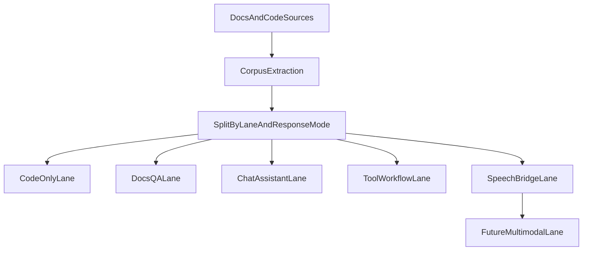

# Mens lane segmentation research

This document lays out the research basis for splitting VoxMens into multiple training and evaluation lanes instead of continuing to mix all behavior types into one generalized objective.

The central problem is straightforward:

> If a model is trained to emit both Vox code and documentation prose under overlapping prompt styles, then it will learn to do both, often at exactly the wrong time.

That is tolerable for a generic assistant. It is not tolerable for a product whose primary lane is:

- code only,
- valid `.vox`,
- ideally canonical/de-whitespaced,
- minimal repair cost.

## Why lane segmentation is necessary

The current corpus system already contains multiple behavior families:

- code generation,
- explanation,
- documentation Q&A,
- error correction,
- tool traces,
- speech-to-code,
- architectural QA,
- synthetic prompts,
- future multimodal scaffolding.

Those are not interchangeable. They train different output behaviors.

Without explicit lane ownership, the system risks three forms of contamination:

1. **surface contamination**
   - prose or markdown wrappers appearing in code output.

2. **task contamination**
   - the model answers “about” code instead of writing code.

3. **style contamination**
   - code output becomes less canonical, less compact, or more conversational.

## What the current codebase already does

### Full documentation extractor

Relevant file:

- [`crates/vox-corpus/src/corpus/extract_docs.rs`](../../../crates/vox-corpus/src/corpus/extract_docs.rs)

Current behavior:

- extracts ` ```vox ` fences as code-supervision pairs,
- also extracts section-level Q&A pairs,
- both use documentation-shaped metadata,
- responses can be:
  - code only,
  - prose only,
  - prose plus embedded Vox examples.

This is useful for a future docs/chat lane.
It is risky for the code-only lane if mixed directly.

### Documentation extraction inside `pairs --docs`

Relevant file:

- [`crates/vox-cli/src/commands/corpus/generate.rs`](../../../crates/vox-cli/src/commands/corpus/generate.rs)

Current behavior:

- scans markdown,
- takes only ` ```vox ` blocks,
- emits code as the response,
- uses documentation context to build instruction text.

This is far safer for code-only training than the full docs extractor.

### Other non-code or mixed-response sources

Relevant files:

- [`crates/vox-corpus/src/synthetic_gen/bodies/_generate_all_mod.inc`](../../../crates/vox-corpus/src/synthetic_gen/bodies/_generate_all_mod.inc)
- [`crates/vox-cli/src/training/multiturn.rs`](../../../crates/vox-cli/src/training/multiturn.rs)

These surfaces include examples of:

- explain pairs,
- architecture Q&A,
- debugging-oriented outputs,
- conversational shaping,
- tool and workflow traces.

Again, useful, but not all should be fed to the same code-only objective.

## Current lane problem in one sentence

The repo already has enough assets to support multiple lanes, but its current metadata conventions do not yet separate them sharply enough.

In particular:

- `category` often carries too much meaning,
- `format` is present but not always the main training filter,
- documentation examples can mean either:
  - “teach the model to emit Vox code,” or
  - “teach the model to explain Vox concepts.”

Those need to become different lanes.

## Proposed lane model

This research recommends explicitly treating VoxMens as a family of lanes sharing some upstream infrastructure but not necessarily one training mixture.

### Lane A: Code-only Vox generation

Primary objective:

- emit valid `.vox`,
- with no prose,
- preferably canonical or canonicalizable,
- with the fewest repair steps possible.

Allowed training targets:

- compiler-validated Vox programs,
- docs-derived code blocks only,
- code repair targets where the response is only fixed Vox,
- tool or workflow examples only when the response target is still Vox code.

Disallowed targets:

- prose explanations,
- architecture answers,
- mixed prose + code responses,
- Rust code responses,
- general conversational Q&A.

Recommended source posture:

- prefer pair-generation from validated Vox artifacts,
- allow `pairs --docs` code-block extraction,
- exclude full-section doc Q&A from this lane.

### Lane B: Documentation and architecture QA

Primary objective:

- answer questions about Vox language features,
- explain concepts and patterns,
- possibly include code examples when helpful,
- not constrained to code-only outputs.

Allowed training targets:

- section-level Q&A from docs,
- architecture explanations,
- curated explain pairs,
- docs chunks and linked Vox examples.

This lane should not be benchmarked against the same criteria as the code-only lane.

### Lane C: Conversational/project assistant

Primary objective:

- answer broader project questions,
- handle repo-aware assistance,
- discuss design or debugging in natural language,
- optionally point to code or propose code.

This lane is where future “chat botting more traditionally” belongs, not in the code-only lane.

### Lane D: Tool and workflow execution assistant

Primary objective:

- reason over tool traces,
- propose or emit structured tool calls,
- navigate workflow-style tasks.

Relevant existing foundations:

- tool-trace formats,
- workflow traces,
- MCP-oriented infrastructure.

### Lane E: Speech-to-code and modality bridge
...
### Lane G: Research and evidence synthesis
Primary objective:
- synthesize evidence from disparate corpora.
- resolve contradictions between local and web evidence.
- calibrate confidence for Socrates gates.
- multi-hop reasoning over fictional knowledge for composition skill.

Primary objective:

- consume images/audio/other structured media,
- emit code, explanation, or structured tool actions depending on the downstream lane.

The key principle is that multimodality should be a feeder or augmentation lane, not a reason to weaken the code-only lane’s output discipline.

## Recommended metadata model

The current system should evolve away from overloading `category` as the primary semantic filter.

### Proposed lane metadata

Each training example should eventually carry explicit fields such as:

- `lane`
  - `vox_codegen`
  - `vox_docs_qa`
  - `vox_chat`
  - `vox_tool_trace`
  - `vox_speech_codegen`
  - `vox_research_expert`
  - `vox_multimodal`
- `response_mode`
  - `code_only`
  - `prose_only`
  - `mixed`
  - `structured`
- `task_family`
  - `generate`
  - `repair`
  - `explain`
  - `retrieve_and_answer`
  - `tool_plan`
  - `speech_transform`

This is more durable than trying to infer lane intent from `category` substring matches.

## Documentation-specific risk analysis

### Risk 1: documentation Q&A teaches prose output

If the model sees:

- prompt: “Explain the Vox concept: actors”
- response: a prose section from docs

then it learns a perfectly valid behavior for a docs assistant.

That same behavior is harmful in the code-only lane.

### Risk 2: mixed responses teach mixed output

If the response contains:

- prose,
- then a code fence,
- then more explanation,

the model learns to compose mixed responses.

That is especially dangerous because it often looks “helpful” during manual testing while actively hurting strict code emission.

### Risk 3: documentation prompts may be too weakly code-shaped

The `pairs --docs` extractor is much safer because it uses code-only responses, but some of its prompts are generic and context-light. That can reduce usefulness even if it avoids prose contamination.

This is a data quality issue, not a reason to collapse lanes.

## Recommended lane segmentation strategy

### Stage 1: hard split by response mode

Before anything more sophisticated, split data into:

- code-only,
- prose-only,
- mixed.

This alone would remove a large portion of accidental contamination.

### Stage 2: explicit lane tags

Add lane ownership to all generated rows so training/eval can select the lane intentionally rather than heuristically.

### Stage 3: lane-specific benchmark packs

Do not evaluate all lanes with the same benchmark.

For example:

- code lane:
  - compile pass,
  - canonical pass,
  - repair burden,
  - latency,
  - task success.
- docs lane:
  - retrieval relevance,
  - answer grounding,
  - factuality,
  - structured code-example usefulness.
- chat lane:
  - conversational helpfulness,
  - routing quality,
  - citation/grounding correctness.

### Stage 4: shared upstream assets, separate downstream objectives

The system should reuse:

- corpus walking,
- file extraction,
- metadata enrichment,
- benchmark manifest tooling,
- telemetry schema conventions.

But it should **not** assume that one adapter or one benchmark should own every lane.

## Recommended lane architecture



## Specific guidance for documentation mining

### For the code-only lane

Documentation should be mined into:

- code blocks,
- compact code-oriented prompt formulations,
- repair/transform examples where the response is only Vox.

Good representation pattern:

- prompt: “Implement a Vox actor that demonstrates X”
- response: raw Vox code only

Bad representation pattern:

- prompt: “Explain X”
- response: prose paragraph with embedded code

### For the docs QA lane

Documentation should be mined into:

- conceptual Q&A,
- architecture summaries,
- explanation pairs,
- retrieved chunk + answer tasks.

That lane can later support:

- repo-aware question answering,
- architecture explanation,
- onboarding/chat tasks.

### For future multimodal work

Documentation should not be the primary multimodal substrate.

Instead, documentation should serve as:

- grounding context,
- schema and terminology source,
- route selection support.

The actual multimodal lane should have its own example format and benchmark contract.

## What this means for Burn vs QLoRA

Lane segmentation is orthogonal to the backend choice, but it affects the value of each lane.

### QLoRA remains the best mainline lane for:

- adapting a strong base model quickly,
- code-only generation experiments on a real Qwen-class backbone,
- measuring whether better data routing and decoding are enough.

### Burn remains more interesting for:

- tightly controlled custom-lane experiments,
- Vox-native tokenizer or objective exploration,
- small in-tree models meant to serve one lane very strictly,
- cases where merge-and-serve inside the repo matters.

The key takeaway is that **lane separation should happen before major backend escalation**. If the lanes are entangled, custom-model experiments will be much harder to interpret.

## Research conclusion

The repo already has the raw ingredients for a future-heavy VoxMens architecture.

What it does not yet have is a durable lane contract.

That missing contract is likely one of the biggest reasons VoxMens can still drift away from the primary product goal. The model is being asked, implicitly, to be too many things at once without enough hard boundaries between those things.

The second pass should therefore treat lane segmentation as foundational, not optional.


