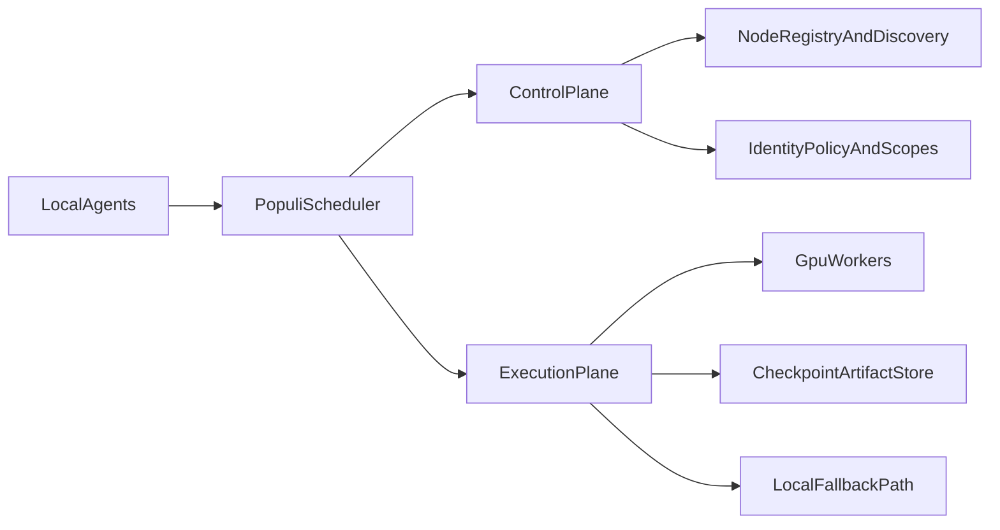

# Populi GPU network research 2026

**Status:** Research only. This page records current gaps, external guidance, and decision inputs for a later implementation plan. It does **not** change shipped behavior.

## Goal

Define the information Vox needs before Populi can become a smooth GPU network for:

- local multi-machine user-owned clusters,
- internet-distributed user-owned clusters over a secure overlay,
- agent-to-agent orchestration that can discover capacity, place work, and fall back to local execution cleanly.

The future hosted "donate your GPU to the cloud" model is intentionally **out of scope** for this wave. See [ADR 009: Hosted mens / BaaS (future scope)](../adr/009-populi-hosted-baas.md).

Implementation sequencing now lives in [Populi GPU mesh implementation plan 2026](populi-gpu-mesh-implementation-plan-2026.md).

## Repo-grounded current state

Today Populi is best understood as:

- an **HTTP control plane** for join, heartbeat, leave, list, bootstrap, and A2A relay,
- a **local registry** plus optional shared registry file,
- an **agent visibility** and **best-effort relay** layer for orchestration,
- a **CPU-first** runtime story with GPU hints, not a full GPU execution fabric.

Current repo sources:

- [Populi SSOT](../reference/populi.md)
- [Unified orchestration — SSOT](../reference/orchestration-unified.md)
- [ADR 008: Mens transport](../adr/008-populi-transport.md)
- [ADR 009: Hosted mens / BaaS (future scope)](../adr/009-populi-hosted-baas.md)
- [Protocol convergence research 2026](protocol-convergence-research-2026.md)

## What Populi does today

### 1. Membership and control

Populi already supports:

- explicit join / heartbeat / leave via `vox populi serve`,
- bearer or HS256 JWT route protection,
- scope-based cluster isolation,
- A2A inbox, ack, and lease-renew semantics,
- local-first behavior when mesh is unset or unreachable.

### 2. Orchestrator integration

The orchestrator can:

- poll `GET /v1/populi/nodes`,
- cache remote node hints,
- use those hints for **experimental in-process score bumps**,
- emit a **best-effort** remote task envelope after local enqueue when explicitly enabled.

Important current boundary: local execution remains authoritative. Remote relay is not the default owner of task execution.

### 3. GPU awareness

The repo already has:

- `TaskCapabilityHints`,
- labels, device class, and minimum VRAM fields,
- `VOX_MESH_ADVERTISE_*` environment flags,
- local and remote hint plumbing for training-style routing signals.

Important current boundary: this is mostly **advertisement and hinting**, not a health-checked GPU inventory or an authoritative scheduler.

## What stands in the way

Populi does **not** yet provide the full behavior needed for the target GPU mesh.

### 1. No authoritative remote execution plane

Current remote behavior is advisory or best-effort. Populi does not yet define:

- single-owner task handoff,
- lease ownership for long-running GPU work,
- remote cancellation semantics,
- artifact staging / result handoff guarantees,
- automatic recovery when a remote GPU worker disappears mid-job.

### 2. No hardware-truth discovery layer

Current GPU visibility is mostly env-driven and operator-declared. Populi does not yet provide:

- driver-backed device probing as the control-plane truth source,
- per-device health reporting,
- allocatable vs unhealthy GPU accounting,
- consistent topology metadata for multi-GPU nodes,
- a plugin/provider abstraction for GPU discovery.

### 3. No clean node churn lifecycle

Users can join and leave nodes, but Populi does not yet define the full lifecycle required for seamless add/remove of GPUs:

- drain before removal,
- no-new-work admission state,
- in-flight work transfer or rollback,
- retire / quarantine semantics tied to scheduler ownership,
- automatic rebalancing after capacity changes.

### 4. No unified scheduler across agent tasks, inference, and training

The repo currently separates:

- local orchestration,
- experimental mesh relay,
- cloud provider dispatch,
- local MENS training and inference surfaces.

What is missing is one scheduler that can reason across:

- latency-sensitive inference,
- long-running training jobs,
- agent tasks with tool dependencies,
- VRAM, topology, and checkpoint requirements,
- local fallback and remote placement under one ownership model.

### 5. No first-class internet-distributed cluster model

The repo intentionally keeps self-hosted Populi explicit and HTTP-first. That is the right baseline, but internet-distributed user-owned clusters still need a documented model for:

- secure overlay networking,
- identity and policy for user-owned nodes,
- NAT traversal and stable reachability,
- separation of control traffic from heavy model/data traffic,
- failure handling on consumer-grade networks.

### 6. Multi-node GPU training has harder constraints than control-plane federation

Remote node discovery alone does not make distributed GPU training viable. Practical concerns include:

- collective communication topology,
- network interface selection,
- retry and timeout behavior,
- checkpoint/resume discipline,
- the difference between "can reach a remote node" and "can train efficiently across it".

## Control plane vs execution plane

One of the clearest design lessons from the current repo and external systems is that Populi should not treat control-plane discovery as equivalent to GPU execution ownership.

Recommended research framing:

- **Control plane:** discovery, identity, policy, health, cluster membership, queue ownership metadata.
- **Execution plane:** GPU allocation, artifact movement, checkpointing, cancellation, remote result ownership, fallback.
- **Scheduler layer:** chooses between local and remote resources without conflating membership with execution authority.

## External best practices relevant to Populi

### Kubernetes GPU scheduling and device plugins

Relevant sources:

- [Kubernetes: Schedule GPUs](https://kubernetes.io/docs/tasks/manage-gpus/scheduling-gpus/)
- [Kubernetes: Device Plugins](https://kubernetes.io/docs/concepts/extend-kubernetes/compute-storage-net/device-plugins)

Applicable lessons:

- Hardware discovery should come from a dedicated resource layer, not only from operator-set flags.
- GPU resources need **allocatable** accounting, not just descriptive labels.
- Node labels and Node Feature Discovery-style metadata are useful, but should sit on top of verified device state.
- Device health changes must reduce schedulable capacity and surface actionable status.
- Node upgrades/restarts require re-registration and clear health transitions.

### Overlay networking for user-owned internet clusters

Relevant source:

- [Tailscale access control](https://tailscale.com/kb/1393/access-control)

Applicable lessons:

- Prefer private overlays and policy-as-code access control to ambient discovery on the public internet.
- Default-deny and least-privilege network policy should be the baseline.
- Internet-distributed personal clusters should use explicit enrollment, tagging, and policy scopes.
- Public exposure of Populi endpoints should remain a conscious operator choice, not a default.

### GPU collective and network reality

Relevant source:

- [NVIDIA NCCL environment variables](https://docs.nvidia.com/deeplearning/nccl/user-guide/docs/env.html)

Applicable lessons:

- Multi-node GPU work depends heavily on network interface selection, retry behavior, and topology.
- A network that is "reachable" is not automatically good enough for efficient collectives.
- WAN or public-internet links should not be assumed to support the same performance model as LAN, RoCE, or InfiniBand deployments.
- Populi should treat internet distribution as a control/reachability problem first, and only later as a high-performance training fabric.

### Gossip and failure detection

Relevant sources:

- [Serf gossip internals](https://github.com/hashicorp/serf/blob/master/docs/index.html.markdown)
- [HashiCorp: Making Gossip More Robust with Lifeguard](https://arxiv.org/abs/1707.00454)

Applicable lessons:

- If Populi later adds LAN discovery or hybrid membership, it should avoid binary heartbeat assumptions.
- Suspicion windows and false-positive-resistant failure detection matter when hosts are busy or intermittently slow.
- Gossip may help for trusted LAN convenience, but it should be optional and should not replace explicit control-plane identity for internet clusters.

### Scheduler and fault-domain ideas

Relevant sources:

- [Ray resources and scheduling](https://docs.ray.io/en/latest/ray-core/scheduling/resources.html)
- [Ray fault-tolerance overview](https://docs.ray.io/en/master/ray-core/fault-tolerance.html)

Applicable lessons:

- Placement should model fault domains and resource groups, not just "has GPU".
- Checkpointing is part of distributed execution design, not an optional afterthought.
- Multi-GPU and multi-node placement eventually need gang-style or grouped allocation semantics.

## Recommended non-goals for this wave

Until the basics above exist, the following should stay out of scope:

- a hosted multi-tenant "donate your GPU" product,
- assuming WAN-friendly distributed training collectives by default,
- merging Populi transport decisions with a premature gRPC or QUIC shift,
- advertising remote execution as authoritative before ownership and recovery semantics exist,
- treating cloud dispatch and Populi mesh as one scheduler before the contracts align.

## Design choices the future implementation plan must resolve

### 1. Discovery model

Should Populi stay explicit-control-plane-first everywhere, or add optional trusted-LAN discovery such as gossip or hybrid bootstrap?

### 2. GPU truth model

Should schedulable GPU inventory come from:

- static advertisement,
- live probing,
- provider plugins,
- or a layered model that combines verified health with operator policy labels?

### 3. Ownership model

Remote GPU execution needs one clear contract:

- local enqueue plus side relay,
- authoritative remote handoff,
- lease-based remote worker ownership,
- or work stealing with resumable checkpoints.

### 4. Scheduler model

One scheduler must eventually explain how Populi handles:

- agent tasks,
- inference,
- training,
- checkpoint placement,
- data locality,
- local fallback when the network degrades.

### 5. Internet cluster posture

The first supported remote model should likely be:

- a secure overlay-connected personal cluster,

not:

- a public donation marketplace or broad hosted federation.

## Prerequisites before implementation planning

Before a true implementation roadmap is written, the repo should have a stable answer for:

1. How Populi expresses authoritative worker health and allocatable GPU capacity.
2. How remote work ownership, cancellation, retry, and result correlation behave.
3. How users add or remove a GPU node without corrupting or orphaning work.
4. How local fallback works when remote nodes are stale, partitioned, or partially healthy.
5. Which work types are allowed across WAN overlays and which remain LAN-only or local-only.
6. Which changes need an ADR versus a reference-doc or contract update.

## Relationship to existing docs

- [Populi SSOT](../reference/populi.md) remains the source of truth for shipped control-plane behavior.
- [Mens Cloud GPU Training Strategy](../reference/mens-cloud-gpu.md) remains the source of truth for current local/cloud training behavior.
- [Protocol convergence research 2026](protocol-convergence-research-2026.md) remains the broader transport and delivery-plane synthesis.
- [Populi GPU mesh implementation plan 2026](populi-gpu-mesh-implementation-plan-2026.md) is the ordered rollout proposal derived from this research set.

This page exists to bridge those materials into a future Populi GPU mesh implementation plan without overstating what is already implemented.

