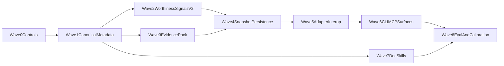

# SCIENTIA implementation wave playbook 2026

This page is the execution companion for the 232-task implementation strategy. It converts wave goals into concrete work products, acceptance criteria, and checkpoint gates.

Primary strategy source: `scientia_implementation_waves_9d6ebbb6.plan.md` (plan file is non-authoritative for SSOT; this page + contracts are authoritative for execution).

## Program outputs by wave

| Wave | Primary output | Required evidence to close wave |
| --- | --- | --- |
| 0 | Program controls and KPI baseline | Versioned baseline metrics + explicit done criteria in CI checklist docs |
| 1 | Canonical metadata SSOT graph | Schema + route requirements registry + compatibility notes |
| 2 | Worthiness detection v2 | Signal taxonomy output + reason codes + profile-aware thresholds |
| 3 | Evidence pack enforcement | Canonical EvidencePack contract + replayability checks |
| 4 | Codex persistence | Snapshot contract + event semantics + read-model expectations |
| 5 | Adapter interop | Canonical-to-route contract maps + conformance fixture suite |
| 6 | CLI/MCP ergonomics | Unified checklist surfaces + parity guarantees |
| 7 | Document skills integration | Skill specs and ingest constraints for policy-safe outputs |
| 8 | Quality and calibration | Offline eval harness + release gating thresholds |

## First 30 tasks lock (execution order)

The first-30 order from the strategy is retained as the mandatory launch sequence. Any
reordering requires explicit checkpoint approval. The canonical ordered list lives in
`contracts/scientia/implementation-wave-backlog.v1.yaml` under `first_30_execution_order`.

## Cross-wave implementation boundaries

- Do not promote external bibliometric signals into hard-gates without calibration evidence.
- Do not allow skill-generated narrative to bypass policy/preflight checks.
- Do not auto-submit to account-bound destinations without explicit human-in-the-loop controls.
- Keep all schema evolution additive until migration windows are formally approved.

## Wave checkpoint template

Every wave closure must record:

1. KPI deltas vs baseline.
2. Contract changes and compatibility notes.
3. CI gating updates.
4. Known limitations and explicit non-goals for next wave.

## Canonical implementation contracts in this wave program

The canonical contract list is SSOT-managed in
`contracts/scientia/implementation-wave-backlog.v1.yaml` under `canonical_contract_paths`.
This playbook intentionally links to that list instead of duplicating it.

## Architecture map (execution flow)

## Success targets

- `metadata_required` route completeness >= 0.95.
- unresolved citation hard-fail incidents approach zero in internal trials.
- measurable precision/recall lift in worthiness triage over baseline.
- one canonical metadata source transformed across supported adapter routes.

