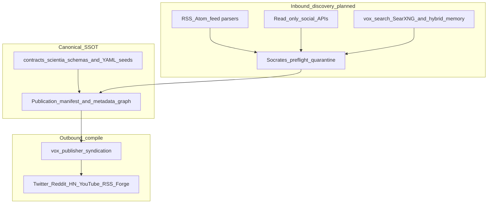

# SCIENTIA multi-platform ranking, discovery, and anti-slop SSOT

This document synthesizes **how major distribution surfaces rank and filter content**, maps that landscape to **Vox Scientia** (outbound publication and planned inbound discovery), and proposes a **single maintainable policy layer** (manifest-centered metadata + contracts) so operators can add or subtract channels with minimal code churn.

**Naming note:** Internal references to “Vox Chianti” in planning conversations map to **Vox Scientia** for this repository.

## See also

- [Vox Scientia external discovery and monitoring (research)](scientia-external-discovery-research-2026.md) — inbound feeds, Socrates triage, hybrid dedup, digest agents.
- [SCIENTIA impact, readership, and citation-adjacent signals](scientia-impact-readership-research-2026.md) — bibliometric and attention proxies; assist-only posture.
- [SCIENTIA publication-worthiness and SSOT unification](scientia-publication-worthiness-ssot-unification-research-2026.md) — standards-to-signals matrix, canonical metadata graph, automation boundary ledger.
- [Vox RAG and autonomous research architecture](rag-and-research-architecture-2026.md) — retrieval zones, corpora, Socrates gate (production SSOT for RAG).
- Tunable impact projection seed: [`contracts/scientia/impact-readership-projection.seed.v1.yaml`](../../../contracts/scientia/impact-readership-projection.seed.v1.yaml).

---

## 1. Executive summary

Scientia faces a deliberate tension:

1. **Anti-slop / “do not waste the reader”** — limit what is **promoted** to humans and to the public internet so every outbound unit carries evidence, correct routing, and respect for community norms.
2. **High-recall discovery** — accept that **the world produces more data than any team can read**; the fix is **sorting, deduplication, and provenance**, not artificial scarcity of ingest.

**Resolution (architecture):** separate **ingest volume** from **syndication volume**. Ingest broadly into quarantine-capable stores and deduplicated indices; **compile** outbound posts and venue submissions from a **canonical manifest graph** with per-channel **projection profiles** (templates + policy + optional impact hints). Numeric tuning belongs in **`contracts/scientia/*.yaml`** and JSON Schemas where stored artifacts are versioned—not scattered as unexplained literals in Rust.

archived_date: 2026-04-18
---

## 2. Information sufficiency and citation tiers

Public writing on “algorithms” mixes verifiable sources with marketing. This document uses explicit **tiers**:

| Tier | Meaning | Examples |
| --- | --- | --- |
| **A** | First-party product, transparency center, official help, or open code/data | See **§10 Works cited** for the maintained URL list. Anchors used repeatedly here include [Reddit Help — content recommendations](https://support.reddithelp.com/hc/en-us/articles/23511859482388-Reddit-s-Approach-to-Content-Recommendations), [YouTube Blog — recommendation system](https://blog.youtube/inside-youtube/on-youtubes-recommendation-system/), [Meta: Instagram Feed](https://transparency.meta.com/features/explaining-ranking/ig-feed), [Meta: Facebook Feed](https://transparency.meta.com/features/explaining-ranking/fb-feed/), [Google Scholar inclusion](https://scholar.google.com/intl/us/scholar/inclusion.html), [arXiv moderation](https://arxiv.org/help/moderation), [OpenAlex docs](https://docs.openalex.org/), [HN FAQ](https://news.ycombinator.com/newsfaq.html), [Twitter open algorithm (archive)](https://github.com/twitter/the-algorithm) |
| **B** | Reputable secondary analysis, industry press, or long-standing technical writeups | e.g. classic HN ranking decomposition writeups; Buffer/Mosseri-sourced summaries that link back to first-party statements |
| **C** | SEO listicles, uncited percentage weights, “complete guide” posts | **Do not** use as engineering requirements; at most prompts for empirical validation |

**Critical assessment:** Tier A is sufficient to justify **structural** Scientia decisions (e.g. “Meta uses multiple rankers per surface,” “Scholar indexes PDFs with heuristic headers,” “arXiv moderates for scholarly standards”). Tier C dominates many web searches; **any specific percentage** (e.g. “CTR is 20% of YouTube rank”) should be treated as **unverified** unless traced to Tier A.

**What we do not have without product-specific telemetry:** per-tenant lift curves, per-channel A/B behavior, or legal/commercial constraints for each API. Those require operator data and counsel—not additional web search volume.

---

## 3. Platform clusters: signals, risks, Scientia posture

**Posture legend:** **Ingest** = pull into monitoring/quarantine/RAG; **Syndicate** = outbound post or venue handoff; **Assist** = human-in-the-loop or scoring only; **Avoid** = default off without explicit policy.

| Cluster | What surfaces typically optimize (conceptual) | Primary risks for automation | Recommended Scientia posture |
| --- | --- | --- | --- |
| **Reddit** | Early engagement, votes, moderator and subreddit rules; community anti-spam culture | Self-promo backlash, bans, misleading “algorithm tips” from Tier C | **Ingest** (read-only, rate-limited) per [external discovery](scientia-external-discovery-research-2026.md); **Syndicate** only with explicit subreddit policy pack + human gate |
| **YouTube** | Viewer satisfaction and long-session value (Tier A creator documentation emphasizes quality over pure clickbait) | Thumbnail/title arms race, retention cliffs | **Syndicate** for long-form artifacts with structured metadata (chapters, clear first minute); **Assist** impact hints only |
| **X (Twitter)** | Large candidate pool → ML rank → mixer/diversity; parts of the stack were open-sourced | Rate limits, policy changes, thread fragmentation | **Syndicate** short deltas with **one canonical URL** back to manifest/repo; **Ingest** optional for lists/lists API where licensed |
| **Meta (Facebook / Instagram)** | **Surface-specific** rankers (Feed, Reels, Stories, Search); relationship and “send” type signals appear often in Meta/creator guidance | Format mismatch (treating Reels like Feed), rights on media | **Syndicate** with **per-surface projection** (distinct templates and metrics targets); avoid a single “Meta blob” config |
| **LinkedIn** | Professional relevance, dwell, conversation quality; feed tends to favor on-platform content | Link demotion patterns in some periods | **Syndicate** native summary + disciplined external link strategy; **Ingest** for employer-branded research feeds if ever needed |
| **TikTok / short video** | Completion and rewatch (widely claimed; treat magnitudes as Tier B/C unless sourced) | High production cost, policy drift | **Avoid** default; revisit only if Scientia ships vertical video |
| **Hacker News** | Simple time-decay scoring with flags/mod intervention (FAQ + classic analyses) | Over-posting, dupe stories, community norms | **Syndicate** via existing `ManualAssist` pattern in `vox-publisher` types; no unattended spam |
| **Google Scholar** | Crawlability, scholarly PDF heuristics, metadata, citation graph (see Scholar help) | ASEO gaming, duplicate versions | **Syndicate** through clean PDFs + consistent metadata from manifest exports |
| **OpenAlex / Crossref / DataCite** | Open bibliographic graph, citations, OA status, identifiers | API limits, data freshness; see §4.12 on Event Data sunset | **Ingest** + **Assist** for comparable works and field baselines ([impact readership](scientia-impact-readership-research-2026.md)) |
| **arXiv / preprints** | Moderation for on-topic scholarly content; endorsement for new submitters; categorization aids | Category misplacement, moderation delays | **Syndicate** as primary scientific outbound path with preflight profiles ([publication worthiness SSOT](scientia-publication-worthiness-ssot-unification-research-2026.md)) |
| **Bluesky (AT Protocol)** | User-chosen **custom feeds** and composable ranking; protocol-level openness | Third-party feed quality varies; policy drift | **Ingest** via selected high-trust feeds for niche experts; **Syndicate** as short posts linking to canonical artifacts |
| **Discord** | Discovery is **directory + search + eligibility**, not an engagement ranker for all messages | Not a public SEO surface; moderation burden | **Avoid** default syndication; **Assist** for curated community announcements only |
| **PubMed / Europe PMC** | Best Match and related NLM retrieval research (learning-to-rank over scholarly metadata) | Biomedical skew; API terms | **Ingest** for life-sciences adjacent monitoring; crosswalk topics to OpenAlex |
| **Semantic Scholar (AI2)** | Academic graph + optional **recommendations** endpoints; influential citation concepts | API key, rate limits, license | **Ingest** + **Assist** for “papers like this” and evidence expansion |

archived_date: 2026-04-18
---

## 4. Deep research by distribution surface (expanded 2026 wave)

This section expands the summary table with **first-party wording where available**, then narrower technical or academic sources, then explicitly marks **speculative** creator-industry claims. Length is intentional: Scientia automation must respect **materially different** objective functions per surface.

### 4.1 Reddit (first-party: Home feed pipeline)

**Tier A — Reddit Help (“Reddit’s Approach to Content Recommendations”):** Reddit states that the logged-in **Home feed** mixes subscriptions with recommendations, and that personalized ordering uses:

- **Content-related information:** upvotes/downvotes, community, comment history, post type, age, flairs.
- **Your activity:** engagement history, time in communities, recent visits, subscriptions, onboarding topic interests, “show less” feedback.
- **Account age:** newer accounts may see **more recommendations relative to subscriptions**.
- **Location setting:** country preference.

Reddit describes a **four-step pipeline:** (1) candidate generation, (2) filtering (spam, seen-before, blocked), (3) predictive models for preference, (4) sort with **diversity** (“avoid too many similar posts in a row”). Logged-out **Popular** is described as showcasing popular recent posts by **net upvotes**, sometimes location-customized.

**Implications for Scientia:** “Hot” vs “New” vs “Top” remain **user-controlled sorts** inside a community; automated syndication must still defer to **subreddit rules and moderator norms** (not Reddit’s global ML). Inbound monitoring should treat vote/comment velocity as **weak evidence** of technical novelty—high votes correlate with entertainment or controversy.

### 4.2 YouTube (first-party: signals and responsibility)

**Tier A — YouTube Blog (Goodrow, 2021):** YouTube emphasizes that recommendations (homepage + Up Next) drive **more viewership than subscriptions or search**. The system learns from **“signals”** including clicks, watch time, survey responses, sharing, likes, and dislikes, with explicit narrative that **click ≠ satisfaction** (watch time added in 2012; valued watch time via surveys; models predict satisfaction for unrated views). For **news and information**, YouTube discusses **authoritative vs borderline** classification using human evaluators and public rater guidelines, with borderline demoted.

Official help pages (Google) complement this with consumer-facing descriptions of personalization and controls; treat help URLs as **Tier A for product behavior**, not for numeric rank weights.

**Implications for Scientia:** optimize for **clarity of promise in title/thumbnail**, **early retention**, and **evidence-forward framing** for technical talks. Do not treat Shorts and long-form as one projection profile.

### 4.3 Meta: Facebook and Instagram (first-party: transparency center + system cards)

**Tier A — Meta Transparency Center:** Meta documents **separate ranking systems per surface** (e.g. [Instagram Feed](https://transparency.meta.com/features/explaining-ranking/ig-feed), [Instagram Explore](https://transparency.meta.com/features/explaining-ranking/ig-explore/), [Instagram Search](https://transparency.meta.com/features/explaining-ranking/ig-search/), [Facebook Feed](https://transparency.meta.com/features/explaining-ranking/fb-feed/)). Common pattern in the cards: gather inventory → integrity filtering → predictions → ranking → diversity / freshness controls. **Explore** documentation describes staged retrieval and ranking at high candidate counts; **Search** mixes multiple entity types (hashtags, audio, Reels, profiles).

**Implications for Scientia:** any “post to Instagram” automation must declare **which surface** the copy targets; Reels-first video vs static Feed post vs carousel document are different distribution contracts.

### 4.4 X (Twitter): open archive vs current stack

**Tier A (historical):** Twitter released recommendation source as [`twitter/the-algorithm`](https://github.com/twitter/the-algorithm) (candidate generation, ranking, mixer concepts documented in repo and accompanying commentary).

**Tier B / moving target:** Post-rebrand X, independent reporting and third-party repos (e.g. `xai-org/x-algorithm` documentation mirrors) discuss newer ML ranking stacks. Treat these as **engineering curiosity**, not stability contracts, unless pinned by your legal/compliance review of current Terms and API fields.

**Implications for Scientia:** prefer **single canonical URL** threads; avoid duplicating long manifest text across tweets (fragmentation + edit drift).

### 4.5 LinkedIn (first-party engineering blog)

**Tier A — LinkedIn Engineering:** LinkedIn has published multiple articles on **dwell time**, feed funnel architecture, and retrieval/ranking passes (e.g. posts on dwell time and “next generation” feed engineering). These establish **semantic retrieval + multi-pass ranking** as the mainstream architecture for large professional graphs.

**Implications for Scientia:** long-form research updates should be written as **native posts** with structured headings; bare link drops underperform and read as spam to both humans and rankers.

### 4.6 TikTok (first-party transparency)

**Tier A — TikTok Transparency / Newsroom:** TikTok’s public pages describe For You personalization using **user interactions** (likes, shares, follows, watch length, completions), **video information** (captions, sounds, hashtags), and **device/account settings** (language, country, device) at lower weight. They explicitly note some **non-factors** in their public FAQ (e.g. follower count not directly used as a recommendation input in the way many creators assume).

**Implications for Scientia:** short video is a **different production and integrity surface**; default **Avoid** unless you operate a vertical video pipeline with separate moderation.

### 4.7 Hacker News (first-party FAQ + open ranking folklore)

**Tier A — Hacker News FAQ:** ranking is **not** “higher karma users rank higher”; flags, vouching, software penalties, and moderation exist alongside a gravity curve over votes and time.

**Tier B — Long-standing reverse engineering posts** (e.g. classic “How HN ranking works” articles) remain useful for intuition but should not override the FAQ for product decisions.

**Implications for Scientia:** keep `ManualAssist` as the default posture; treat HN as a **high-context, low-forgiveness** channel.

### 4.8 Google Scholar (first-party inclusion guidelines)

**Tier A — Scholar inclusion documentation:** Scholar indexes scholarly works meeting PDF and bibliographic header heuristics; inappropriate genres (news, editorials) are out of scope. Ranking inside Scholar is **not fully specified** publicly at the same granularity as consumer social feeds; expect **relevance + citation + venue signals** at a high level.

**Implications for Scientia:** invest in **clean PDFs, structured metadata, and persistent DOIs** rather than keyword stuffing.

### 4.9 PubMed and NLM retrieval (peer-reviewed + official help)

**Tier A/B — PubMed “Best Match”:** NLM has published peer-reviewed and technical bulletin material describing a **two-stage** pipeline (retrieval + learning-to-rank rerank) for relevance sorting. This is the canonical pattern for **scientific text retrieval at national-library scale**.

**Implications for Scientia:** for biomedical topics, PubMed complements OpenAlex; unify DOI/PMCID in the manifest graph to avoid duplicate cards.

### 4.10 Semantic Scholar (AI2) graph and recommendations API

**Tier A — Semantic Scholar API docs:** AI2 documents graph endpoints, fields (including citation and “influential citation” concepts in API summaries), and a **Recommendations API** for “papers like this” / list-based positives and negatives.

**Implications for Scientia:** ideal for **assist-only expansion** of prior-art packets—never a publish gate by itself.

### 4.11 OpenAlex, ORCID, and persistent identity

**Tier A — OpenAlex documentation:** CC0 graph, works/institutions/topics, citation facets, filters, and (as of documentation evolution) semantic search beta—verify current capabilities in docs before locking contracts.

**Tier A — ORCID trust and visibility:** ORCID explains visibility levels (**Everyone / Trusted parties / Only me**) and **trust markers** from member organizations vs self-assertion.

**Implications for Scientia:** ORCID and ROR-style affiliations belong in the **canonical contributor graph**, not retyped per social post.

### 4.12 Crossref Event Data sunset and replacement (critical for “attention” plans)

**Tier A — Crossref blog (March 24, 2026):** Crossref will **sunset the Event Data API on April 23, 2026** (historical access on request). Rationale: shift toward **integrity and structured relationships**; low usage. Replacement emphasis: a **data citations API endpoint** surfacing dataset links from member metadata (beta; feedback solicited).

**Implications for Scientia:** any roadmap item that assumed **Crossref Event Data as a live web-mention firehose** must be **rewritten**. Attention/altmetrics-style monitoring should plan around **surviving licensed vendors**, **first-party platform analytics**, or **curated feeds**—not deprecated Crossref Event streams.

### 4.13 Bluesky and composable feeds (protocol + first-party blog)

**Tier A — Bluesky blog on custom feeds:** Bluesky describes **algorithmic choice** via third-party/custom feeds rather than a single opaque ranker.

**Tier B — Ecosystem tooling:** community frameworks (e.g. SkyFeed / feed builders) show how declarative rules can combine engagement, graph filters, and ML similarity—useful as **patterns** for Scientia **inbound selectors**, not as dependencies.

**Implications for Scientia:** subscribing to a small **allowlisted set of expert feeds** can beat generic firehoses for ML research surfacing.

### 4.14 Mastodon and the fediverse (open source + docs)

**Tier A — Mastodon docs (`trends` APIs) and server source:** trending surfaces exist with documented endpoints; implementation details (e.g. reblog/favorite scoring, decay) live in server code paths discussed publicly.

**Implications for Scientia:** useful for **open-community** announcements; not a substitute for arXiv/DOI persistence.

### 4.15 Discord discovery (first-party support + developer docs)

**Tier A — Discord Support / Developers:** Discovery is governed by **eligibility**, **community health**, and **directory/search UX**—not a global “For You” optimized for off-platform URLs.

**Implications for Scientia:** keep research artifacts on **DOI/repo** surfaces; use Discord only as **optional community mirror** with human moderators.

### 4.16 EU Digital Services Act and researcher access (regulatory Tier A/B)

**Tier A — Primary law and EU Commission materials:** the DSA imposes transparency, risk, and researcher-facing obligations on **Very Large Online Platforms** and **Very Large Online Search Engines** (thresholds defined in the regulation). Practical researcher access flows are being operationalized via Commission-level FAQ pages (e.g. algorithmic transparency centre FAQs).

**Tier B — Legal commentary:** law firms and NGOs summarize Articles on **recommender transparency**, **non-profiling feeds**, and **ads repositories**—useful for checklists, not for implementation literals.

**Implications for Scientia:** when syndicating to VLOPs, expect **disclosure strings, opt-outs, and audit logs** to become part of the **distribution projection** metadata—not optional marketing footers.

### 4.17 Information quality and “slop” (research framing, not platform docs)

Independent of any one ranker, scientometrics and HCI literature (not exhaustively cited here) consistently warns that **engagement maximization ≠ epistemic quality**. Scientia’s existing direction—**Socrates triage**, inbound preflight, quarantine—aligns with treating engagement as **a diagnostic**, not a **truth label**.

---

## 5. End-to-end flow (canonical SSOT → channels → inbound)

**Code anchors today:** `UnifiedNewsItem` and `SyndicationConfig` in [`crates/vox-publisher/src/types.rs`](../../../crates/vox-publisher/src/types.rs); publisher orchestration in [`crates/vox-publisher/src/lib.rs`](../../../crates/vox-publisher/src/lib.rs); SearXNG query URL in [`crates/vox-search/src/searxng.rs`](../../../crates/vox-search/src/searxng.rs) with **defaults** embedded from [`contracts/scientia/searxng-query.defaults.v1.yaml`](../../../contracts/scientia/searxng-query.defaults.v1.yaml) via [`crates/vox-search/src/searxng_defaults.rs`](../../../crates/vox-search/src/searxng_defaults.rs) and optional `VOX_SEARCH_SEARXNG_ENGINES` / `VOX_SEARCH_SEARXNG_LANGUAGE` overrides in [`crates/vox-search/src/policy.rs`](../../../crates/vox-search/src/policy.rs).

archived_date: 2026-04-18
---

## 6. SSOT proposal: projection profiles

Extend the **canonical publication metadata graph** (see publication-worthiness doc, Deliverable 2) with **distribution projection profiles**:

1. **`identity` / `evidence` / `policy`** blocks remain canonical—adapters do not fork truth.
2. Each **channel** (Twitter, Reddit, LinkedIn, YouTube, …) references a **`projection_profile_id`** resolved from `contracts/scientia/` (YAML) rather than from ad hoc env vars.
3. A projection profile specifies:
   - **Template** (max length, thread vs single, video vs text).
   - **Allowed claims** (which manifest fields may appear in public text—no uncertain metrics presented as facts).
   - **Surface** (for Meta: `feed` vs `reels` vs `story` as distinct profiles).
   - **Posture** (`syndicate_once`, `manual_assist`, `ingest_only`).
   - **Throttle** (min spacing, max items per day)—operator-tunable without rebuild.

This mirrors the existing idea of compiling **Crossref / arXiv / social** from one graph; it only makes the **social side** as explicit as the bibliographic side.

---

## 7. Measurement framework: useful vs noise

These are **research-level KPI definitions** for operators and future telemetry—not implied as shipped dashboards.

| Metric | Intent | Suggested definition sketch |
| --- | --- | --- |
| **Duplicate suppression rate** | High recall without polluting memory | Share of inbound URLs merged into existing documents by semantic + URL dedup ([external discovery §4](scientia-external-discovery-research-2026.md)) |
| **Quarantine rate** | Safety of automation | Fraction of inbound items sent to human review after Socrates / inbound preflight |
| **Time-to-first-actionable-citation** | Reader value | Median time from ingest to operator acceptance with at least one DOI or repo artifact attached |
| **Syndication regret rate** | Anti-slop for outbound | Count of deleted or community-removed posts per 100 syndications (requires manual logging) |
| **Projection compliance** | SSOT discipline | CI or doctor checks: outbound text contains **no fields** absent from the manifest graph |

archived_date: 2026-04-18
---

## 8. Automation boundary ledger (alignment)

Publication-worthiness research defines actions that must remain **`never_automate`** without explicit human accountability. Multi-channel syndication **inherits** those boundaries:

- No automatic **deny** of a manuscript based solely on projected social “virality.”
- No automatic **bypass** of ethics / disclosure / citation gates because a channel prefers shorter copy.

Cross-reference: Deliverable 1 table and `never_automate` ledger language in [scientia-publication-worthiness-ssot-unification-research-2026.md](scientia-publication-worthiness-ssot-unification-research-2026.md).

---

## 9. Balancing the two problems (design recap)

| Problem | Mechanism in Scientia |
| --- | --- |
| **Do not flood the internet or waste reader time** | Hard/soft gates, quarantine, subreddit/venue policy packs, `ManualAssist` for HN, deduped digest outputs |
| **Surface new discoveries at scale** | Broad ingest + hybrid search + provenance stacking; channel-specific **ranking is delegated to each platform**—Scientia supplies **truthful metadata, evidence links, and deltas** |

archived_date: 2026-04-18
---

## 10. Works cited and link registry (Tier A emphasis)

Use this table as a **maintenance checklist** when URLs rot or products rebrand. Prefer archived copies for long-lived policy citations where possible.

| Domain | Tier | What it anchors | Canonical URL |
| --- | --- | --- | --- |
| Reddit | A | Home feed recommendation pipeline, diversity step, Popular = net votes | [Reddit Help — Reddit’s Approach to Content Recommendations](https://support.reddithelp.com/hc/en-us/articles/23511859482388-Reddit-s-Approach-to-Content-Recommendations) |
| YouTube | A | Signals (clicks, watch time, surveys, shares/likes), responsibility framing | [YouTube Blog — On YouTube’s recommendation system](https://blog.youtube/inside-youtube/on-youtubes-recommendation-system/) |
| Google / YouTube | A | Consumer help: how recommendations personalize, controls | [YouTube Help — Learn more about how YouTube works](https://support.google.com/youtube/answer/9962575?hl=en) |
| Meta | A | Instagram Feed ranking explanation | [Meta Transparency — Instagram Feed](https://transparency.meta.com/features/explaining-ranking/ig-feed) |
| Meta | A | Instagram Explore | [Meta Transparency — Instagram Explore](https://transparency.meta.com/features/explaining-ranking/ig-explore/) |
| Meta | A | Instagram Search | [Meta Transparency — Instagram Search](https://transparency.meta.com/features/explaining-ranking/ig-search/) |
| Meta | A | Facebook Feed | [Meta Transparency — Facebook Feed](https://transparency.meta.com/features/explaining-ranking/fb-feed/) |
| Meta | A | Index of ranking explainers | [Meta Transparency — Explaining ranking](https://transparency.meta.com/features/explaining-ranking) |
| X / Twitter | A (historical) | Open-sourced recommendation components (archive) | [`twitter/the-algorithm`](https://github.com/twitter/the-algorithm) |
| LinkedIn | A | Feed engineering and dwell-time research posts | [LinkedIn Engineering blog — Feed](https://www.linkedin.com/blog/engineering/feed) |
| TikTok | A | Recommendation system transparency overview | [TikTok — Introduction to the recommendation system](https://www.tiktok.com/transparency/en/recommendation-system) |
| TikTok | A | Newsroom explainer | [TikTok Newsroom — How TikTok recommends videos](https://newsroom.tiktok.com/en-us/how-tiktok-recommends-videos-for-you) |
| Hacker News | A | Official FAQ (ranking, flags, karma myths) | [Hacker News — FAQ](https://news.ycombinator.com/newsfaq.html) |
| Google Scholar | A | Inclusion guidelines for crawled scholarly PDFs | [Google Scholar — Inclusion guidelines](https://scholar.google.com/intl/us/scholar/inclusion.html) |
| arXiv | A | Moderation policy | [arXiv moderation](https://arxiv.org/help/moderation) |
| arXiv | A | Endorsement policy | [arXiv endorsement](https://info.arxiv.org/help/endorsement.html) |
| OpenAlex | A | API and entity model | [OpenAlex documentation](https://docs.openalex.org/) |
| ORCID | A | Visibility + trust markers | [ORCID Support — Visibility settings](https://support.orcid.org/hc/en-us/articles/360006897614-Visibility-settings), [ORCID — Trust markers](https://info.orcid.org/interpreting-the-trustworthiness-of-an-orcid-record/) |
| Semantic Scholar | A | API hub / OpenAPI | [Semantic Scholar API docs](https://api.semanticscholar.org/api-docs/) |
| Crossref | A | Event Data sunset + data citations beta | [Crossref blog — Saying goodbye to Event Data (2026-03-24)](https://www.crossref.org/blog/strengthening-support-for-data-citations-and-saying-goodbye-to-event-data/) |
| Crossref | A | Data citations retrieval docs | [Crossref documentation — Data citations](https://www.crossref.org/documentation/retrieve-metadata/data-citations/) |
| PubMed / NLM | A/B | Best Match relevance (peer-reviewed anchor) | [PubMed — Best Match article](https://pubmed.ncbi.nlm.nih.gov/30153250/) |
| Bluesky | A | Custom feeds / algorithmic choice | [Bluesky blog — Custom feeds](https://bsky.social/about/blog/7-27-2023-custom-feeds) |
| Mastodon | A | Trends API reference | [Mastodon docs — Trends](https://docs.joinmastodon.org/methods/trends/) |
| Discord | A | Discovery guidelines | [Discord Support — Discovery Guidelines](https://support.discord.com/hc/en-us/articles/4409308485271-Discovery-Guidelines) |
| EU | A | Digital Services Act (EUR-Lex) | [Regulation (EU) 2022/2065 (DSA)](https://eur-lex.europa.eu/legal-content/EN/TXT/?uri=CELEX%3A32022R2065) |
| EU Commission | A | Researcher data access FAQs (algorithmic transparency centre) | [EC — FAQs: DSA data access for researchers](https://algorithmic-transparency.ec.europa.eu/news/faqs-dsa-data-access-researchers-2025-07-03_en) |

---

## 11. Changelog

| Date | Change |
| --- | --- |
| 2026-04-12 | Initial document: tiered web methodology, platform cluster table, SSOT projection profiles, measurement sketches, cross-links to Scientia and RAG SSOT. |
| 2026-04-12 | Deep research wave: per-surface Tier A synthesis (Reddit Help, YouTube Blog, Meta transparency pages, TikTok transparency, LinkedIn engineering, HN FAQ, Scholar, arXiv, PubMed Best Match, Semantic Scholar, ORCID, Bluesky, Mastodon, Discord, DSA); Crossref Event Data sunset; expanded summary table; works-cited registry; section renumbering. |

