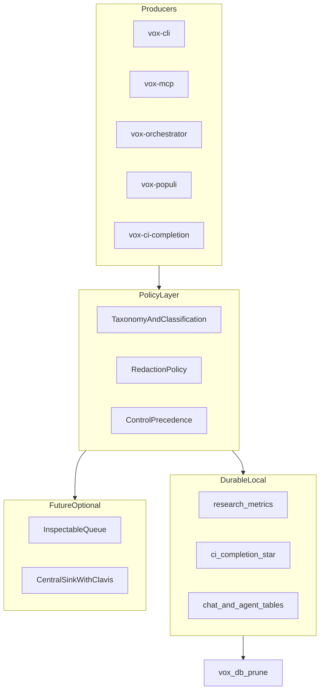

# Telemetry implementation blueprint 2026

## Preconditions

Read first:

- [Telemetry trust boundary and SSOT map](telemetry-trust-ssot.md)
- [Telemetry unification research findings 2026](telemetry-unification-research-findings-2026.md)
- [Telemetry implementation backlog 2026](telemetry-implementation-backlog-2026.md) — executable tasks

## Target end state

## Phase 0 — Documentation and SSOT convergence

- Declare primaries in [telemetry-trust-ssot](telemetry-trust-ssot.md); remove duplicate claims from scattered pages.
- Reconcile [env-vars](../reference/env-vars.md) with all telemetry-related toggles (benchmark, syntax-k, mesh Codex, MCP cost events, context lifecycle, Ludus MCP args).
- Add `AGENTS.md` pointer to telemetry SSOT set.
- Update [documentation-governance](../contributors/documentation-governance.md) maintenance matrix if a new doc class is introduced.

## Phase 1 — Taxonomy and contracts

- Encode event families in [telemetry-taxonomy-contracts-ssot](telemetry-taxonomy-contracts-ssot.md) and mirror into `contracts/index.yaml` rows.
- Add JSON Schemas for any new envelope types under `contracts/telemetry/` (or extend existing orchestration contracts).
- Wire `vox ci command-compliance` / `data-ssot-guards` extensions so new events cannot land without schema registration.

## Phase 2 — Retention and sensitivity enforcement

- Extend [retention-policy.yaml](../../../contracts/db/retention-policy.yaml) for `ci_completion_*` and any new telemetry tables.
- Document S0–S3 mapping per table in [telemetry-retention-sensitivity-ssot](telemetry-retention-sensitivity-ssot.md).
- Add tests or guards that prune-plan covers every telemetry-class table.

## Phase 3 — Producer normalization (Rust)

- Single internal API style for “record usage event” per crate boundary (thin wrapper over `append_research_metric` or domain insert).
- Audit every callsite in backlog; ensure each write carries classification metadata (in code comments until schema supports columns).
- Align MCP tool registry tools (`vox_benchmark_*`, research metric tools) with taxonomy.

## Phase 4 — Client and operator UX

- Rename or clarify webview “telemetry” user-visible strings per [telemetry-client-disclosure-ssot](telemetry-client-disclosure-ssot.md).
- Ensure extension settings reference trust SSOT.
- Optional: CLI `vox doctor` subsection summarizing telemetry-related env state (no network).

## Phase 5 — Optional central sink

- Only after Phases 0–4: design queue + upload with Clavis-backed credentials, explicit opt-in, and separate diagnostics bundle flow.
- Legal/compliance review outside this repo’s scope but blockers MUST be documented in CHANGELOG and SSOT.

## Verification

Every phase completion MUST satisfy:

- [doc-to-code acceptance checklist](doc-to-code-acceptance-checklist.md)
- CI: existing `vox ci` gates green; new guards added in backlog where specified
- CHANGELOG entries for user-visible behavior

## Related

- [Telemetry implementation backlog 2026](telemetry-implementation-backlog-2026.md)

