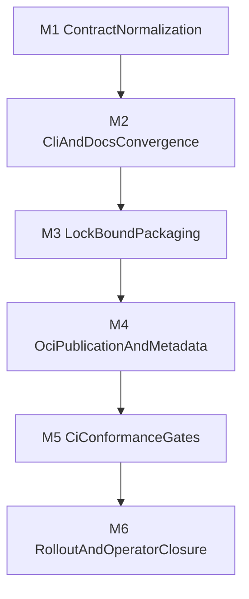

## Mission

Turn the portability architecture defined in [vox-docker-dotvox-portability-research-2026.md](vox-docker-dotvox-portability-research-2026.md) into an execution-ready plan that can guide later code changes without redefining the architecture.

This plan assumes the following decision baseline:

- Docker/OCI is the primary deployment portability boundary for deployed `.vox` applications.
- `Vox.toml` and `vox.lock` are the project contract layers for desired state and resolved state.
- `vox-pm` owns resolution, fetching, cache/CAS, and materialization behavior.
- `vox-container` owns runtime-specific packaging and deployment mechanics.
- portability must be achieved by wiring existing systems together, not by creating a new portability god object.

## Scope

This plan covers:

- project-level portability contract normalization,
- deployment-contract convergence across docs and CLI surfaces,
- lock-bound OCI packaging rules,
- CI/release portability gates,
- and rollout sequencing.

This plan does not implement code directly.

## Non-goals

- Deep host-OS abstraction inside the language core.
- A new monolithic portability subsystem.
- A full replacement of current deployment docs in one wave.
- Treating WASI/Wasmtime as the primary app-deployment portability lane.
- Supporting every deploy target equally in v1.

## Rulebook

### Portability statement

Vox application portability means:

- a project can produce a standardized deployable artifact contract,
- that contract can be executed on supported runtime surfaces with documented caveats,
- and the same project intent can move across local development, CI, and deployment without bespoke per-host packaging logic.

It does not mean:

- identical kernel behavior across all hosts,
- zero architecture-aware publishing,
- or zero operator/runtime policy.

### SSOT ownership

- `Vox.toml`: project desired state, including `[deploy]`.
- `vox.lock`: resolved state and reproducible package/deploy inputs.
- `vox-pm`: resolver, fetch, cache/CAS, materialization, locked/offline/frozen semantics.
- `vox-container`: OCI/container/compose/systemd/k8s execution backend.
- `contracts/cli/command-registry.yaml`: surfaced CLI contract.
- `docs/src/reference/vox-portability-ssot.md`: normative operator/runtime portability contract.
- `crates/vox-install-policy/src/lib.rs`: toolchain portability and release-target policy for `vox` itself.

### Forbidden architecture moves

- No new “portability manager” that duplicates `vox-pm` plus `vox-container`.
- No deployment path that bypasses `vox.lock` once lock-bound packaging is introduced.
- No portability doc that conflates toolchain distribution with app deployment.

## Execution topology

## Milestone index

- M1: Contract normalization.
- M2: CLI and operator-doc convergence.
- M3: Lock-bound packaging and materialization.
- M4: OCI publication and metadata policy.
- M5: CI conformance gates.
- M6: Rollout and operator closure.

---

## M1 — Contract normalization

### M1 objective

Normalize the contract boundary between `Vox.toml`, `vox.lock`, `vox-pm`, and `vox-container` so later implementation work has one shared vocabulary and one ownership map.

### M1 entry conditions

- Research decision is accepted as the working architecture.
- Existing deploy docs remain the baseline operator guidance.

### M1 primary files and surfaces

- `crates/vox-pm/src/manifest.rs`
- `crates/vox-pm/src/lockfile.rs`
- `crates/vox-pm/src/resolver.rs`
- `crates/vox-pm/src/artifact_cache.rs`
- `crates/vox-container/src/deploy_target.rs`
- `docs/src/reference/vox-portability-ssot.md`
- `docs/src/architecture/vox-docker-dotvox-portability-research-2026.md`

### M1 work packages

#### WP1.1 Desired-state contract

- Define the canonical `[deploy]` fields that are part of the supported project contract.
- Mark legacy or transitional fields explicitly if they remain.
- Define which deploy fields are declarative intent versus runtime override candidates.

#### WP1.2 Resolved-state contract

- Define the minimum information `vox.lock` must carry for reproducible deploy packaging.
- Decide whether image-build-relevant dependency digests, artifact digests, or source references need explicit lock representation.
- Clarify how lock state relates to `.vox_modules` and cache/CAS materialization.

#### WP1.3 Service boundary map

- Document the exact handoff from `vox-pm` to `vox-container`.
- Prevent policy duplication by assigning resolution/fetch decisions to `vox-pm` and runtime mechanics to `vox-container`.

### M1 acceptance gates

#### G1 ContractBoundaryAccepted

- `pass_criteria`:
  - canonical desired-state vs resolved-state terms are fixed in docs,
  - `vox-pm` vs `vox-container` ownership is explicitly defined,
  - lock-bound deploy inputs are identified.
- `evidence_required`:
  - implementation plan sections,
  - portability SSOT sections,
  - ADR references.
- `stop_conditions`:
  - reviewers disagree on where resolution ends and deployment begins,
  - `vox.lock` role remains underspecified.

### M1 completion definition

- Future coding work can state “this belongs to `vox-pm`” or “this belongs to `vox-container`” without ambiguity.

archived_date: 2026-04-18
---

## M2 — CLI and operator-doc convergence

### M2 objective

Bring the public CLI contract and operator documentation into alignment with the portability architecture so there is one supported mental model.

### M2 primary files and surfaces

- `contracts/cli/command-registry.yaml`
- `docs/src/reference/cli.md`
- `docs/src/reference/deployment-compose.md`
- `docs/src/reference/vox-portability-ssot.md`
- `docs/src/architecture/vox-cross-platform-runbook.md`
- relevant `vox-cli` dispatch surfaces if code changes follow later

### M2 work packages

#### WP2.1 Public contract inventory

- Audit whether `vox deploy` and related portability concepts are represented consistently across docs and command contracts.
- Record any orphan or undocumented portability-facing surface.

#### WP2.2 Reference split

- Make `vox-portability-ssot.md` the normative portability contract.
- Keep `deployment-compose.md` focused on concrete deployment profiles and runtime examples.
- Keep research and implementation-plan pages analytical rather than normative.

#### WP2.3 Vocabulary unification

- Standardize terms such as:
  - project desired state,
  - resolved state,
  - app portability,
  - toolchain portability,
  - runtime caveats,
  - conformance gates.

### M2 acceptance gates

#### G2 PublicContractConverged

- `pass_criteria`:
  - portability guarantees and caveats are defined in one reference page,
  - deployment-compose docs link to the portability SSOT rather than restating architectural policy,
  - CLI contract implications are documented for later implementation.
- `stop_conditions`:
  - operator docs still imply unsupported guarantees,
  - research and reference pages drift in tone or claims.

### M2 completion definition

- Operators, implementers, and future CI rules all point at the same portability contract language.

---

## M3 — Lock-bound packaging and materialization

### M3 objective

Make container and deployment packaging explicitly depend on resolved, reproducible project state rather than ad hoc current-machine behavior.

### M3 primary files and surfaces

- `crates/vox-pm/src/lockfile.rs`
- `crates/vox-pm/src/resolver.rs`
- `crates/vox-pm/src/artifact_cache.rs`
- `crates/vox-cli/src/commands/lock.rs`
- `crates/vox-cli/src/commands/sync.rs`
- `crates/vox-container/src/generate.rs`
- packaging/deploy docs and CI validators

### M3 work packages

#### WP3.1 Lockfile deployment semantics

- Define how `vox.lock` participates in OCI packaging.
- Define which deploy lanes require `--locked`, `--offline`, or `--frozen` behavior.

#### WP3.2 Materialization contract

- Decide whether `.vox_modules` remains a visible contract or becomes an implementation detail behind PM APIs.
- Ensure deployment packaging consumes normalized materialized state, not command-specific side effects.

#### WP3.3 Hermeticity policy

- Define what “hermetic” means for Vox deploy lanes:
  - build environment isolation,
  - network expectations,
  - artifact source boundaries,
  - reproducibility scope.

### M3 acceptance gates

#### G3 LockBoundPackagingDefined

- `pass_criteria`:
  - deploy packaging rules explicitly depend on lock/resolved inputs,
  - materialization path is documented,
  - offline/frozen expectations are defined.
- `stop_conditions`:
  - packaging still depends on implicit host state,
  - lock semantics differ across local vs CI vs deploy lanes.

### M3 completion definition

- Future implementation can add lock-aware deployment behavior without revisiting core policy.

archived_date: 2026-04-18
---

## M4 — OCI publication and metadata policy

### M4 objective

Define the artifact-level publication policy for portable `.vox` applications.

### M4 primary files and surfaces

- root `Dockerfile`
- `crates/vox-container/src/*`
- CI workflows and command-compliance validators
- `docs/src/reference/vox-portability-ssot.md`
- `docs/src/reference/deployment-compose.md`

### M4 work packages

#### WP4.1 Multi-arch publication baseline

- Define the minimum required architecture matrix for portable app images.
- Decide whether multi-arch is mandatory in v1 for release-grade app publication or staged in by lane.

#### WP4.2 Metadata and provenance policy

- Define required OCI labels/annotations.
- Define SBOM, provenance, and signing expectations for promoted artifacts.

#### WP4.3 OCI bundle policy

- Decide when Compose emission remains a local/generated artifact versus when it can be published as OCI artifact content.
- Document limitations around bind mounts, local includes, and build-only services.

### M4 acceptance gates

#### G4 ArtifactPolicyDefined

- `pass_criteria`:
  - minimum artifact metadata policy exists,
  - multi-arch stance is explicit,
  - SBOM/provenance/signing expectations are documented,
  - OCI artifact use is scoped with caveats.
- `stop_conditions`:
  - portability claims are made without artifact-policy backing,
  - multi-arch remains implied but undefined.

### M4 completion definition

- Future CI and release automation can be written against a concrete artifact policy.

---

## M5 — CI conformance gates

### M5 objective

Translate portability architecture into objective CI checks rather than relying on documentation alone.

### M5 primary files and surfaces

- `crates/vox-cli/src/commands/ci/command_compliance/validators.rs`
- `.github/workflows/ci.yml`
- `.github/workflows/release-binaries.yml`
- `docs/src/reference/vox-portability-ssot.md`
- `docs/src/architecture/doc-to-code-acceptance-checklist.md`

### M5 work packages

#### WP5.1 Policy checks

- Define checks for:
  - lock-bound deploy lanes,
  - base-image digest pinning where required,
  - OCI metadata completeness,
  - SBOM/provenance generation in release-grade lanes.

#### WP5.2 Doc-to-code parity

- Update doc-to-code acceptance guidance so portability claims cannot drift away from actual code and CI behavior.

#### WP5.3 Lane classification

- Distinguish advisory checks from blocking release checks.
- Keep early rollout practical while still converging on stronger policy.

### M5 acceptance gates

#### G5 ConformanceModelDefined

- `pass_criteria`:
  - each portability invariant has a planned enforcement home,
  - release-blocking vs advisory policy is explicit,
  - doc-to-code parity requirements are updated.
- `stop_conditions`:
  - mandatory guarantees rely on manual review only,
  - CI policy is stricter or looser than the reference SSOT without explanation.

### M5 completion definition

- The future implementation plan can assign exact validators and workflow steps with low ambiguity.

archived_date: 2026-04-18
---

## M6 — Rollout and operator closure

### M6 objective

Define how portability becomes the documented and supported user/operator model without destabilizing adjacent systems.

### M6 primary files and surfaces

- `docs/src/reference/vox-portability-ssot.md`
- `docs/src/reference/deployment-compose.md`
- `docs/src/how-to/how-to-deploy.md`
- `docs/src/reference/cli.md`
- migration and operator-facing docs as needed

### M6 work packages

#### WP6.1 Documentation closure

- Ensure the normative reference page is the citation target for future portability questions.
- Ensure deployment how-to pages reference the normative contract rather than duplicating it.

#### WP6.2 Rollout staging

- Identify what can ship as:
  - documentation-only policy,
  - advisory CI,
  - required release gate,
  - default operator path.

#### WP6.3 Deferral register

- Explicitly defer:
  - richer OCI artifact layering beyond immediate needs,
  - deeper Windows-container-first support,
  - expanded WASI deployment ambitions,
  - any future package-universe distribution model that exceeds current repo seams.

### M6 acceptance gates

#### G6 RolloutPlanReady

- `pass_criteria`:
  - operator migration path is understandable,
  - deferred items are explicit,
  - rollout sequencing avoids over-claiming unsupported behavior.
- `stop_conditions`:
  - docs imply full support before conformance gates exist,
  - core rollout assumptions depend on undefined future systems.

### M6 completion definition

- The next code implementation wave can begin with a staged rollout strategy instead of a single risky cutover.

## Risk register

### R1: lock semantics remain too weak for deployment

- Risk: `vox.lock` lacks enough detail to support reproducible packaging.
- Mitigation: settle resolved-state contract before CI gate design.
- Rollback assumption: portability policy can remain advisory until lock contract hardens.

### R2: docs and CLI contract drift

- Risk: reference docs, research docs, and command registry express different portability claims.
- Mitigation: one normative reference page plus doc-to-code parity updates.
- Rollback assumption: deployment-compose remains the operational fallback hub during convergence.

### R3: multi-arch scope expands too quickly

- Risk: portability effort gets blocked on a large matrix too early.
- Mitigation: define a minimum baseline matrix first, then extend deliberately.
- Rollback assumption: advisory multi-arch policy can precede release-blocking policy.

### R4: portability logic collapses into one subsystem

- Risk: implementation starts centralizing PM, runtime, and policy in one object.
- Mitigation: enforce subsystem ownership in the plan, ADR, and reference SSOT.
- Rollback assumption: work packages can halt if ownership boundaries are violated.

### R5: operator contract becomes too abstract

- Risk: docs stay strategic but not actionable.
- Mitigation: give the reference SSOT concrete invariants and conformance checklist.
- Rollback assumption: deployment-compose remains the example-driven complement.

## Deferred items

- Full OCI artifact strategy for every Vox artifact class.
- Windows-container-specific portability as a first-class v1 requirement.
- Kubernetes-specific portability guarantees beyond current target modeling.
- WASI as a primary app-deployment lane.
- Custom artifact infrastructure beyond OCI registries.

## Plan completion definition

This plan is ready to drive a future implementation wave when:

- the ADR is accepted,
- the normative portability SSOT exists,
- milestone objectives and gates are stable,
- and a future coding plan can translate milestones into concrete file-level tasks without reopening architecture questions.

