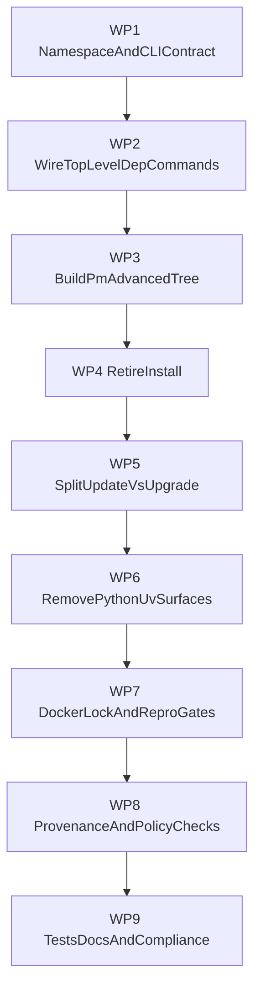

## Mission

Execute a full package-management redesign in Vox with these non-negotiable constraints:

- Python/UV package/runtime lanes are fully retired.
- `vox install` is removed as a package verb (Phase B — no CLI subcommand).
- Package workflow uses a hybrid CLI model:
  - top-level common dependency operations,
  - advanced operations under `vox pm`.
- `update` and `upgrade` have distinct, enforced semantics.

This plan is implementation-ready and ordered for execution efficiency.

## Rulebook (must hold throughout implementation)

### Verb ownership (authoritative)

- `add`: declare dependency in `Vox.toml`.
- `remove`: delete dependency from `Vox.toml`.
- `update`: update project dependency graph/lock state.
- `lock`: generate/refresh lock only.
- `sync`: materialize dependencies from manifest/lock policy.
- `upgrade`: upgrade Vox toolchain/binary/source, not project dependencies.
- `pm`: advanced package operations (registry, publish, verify, vendor, cache).

### Forbidden behavior

- `install` cannot mutate project dependency graph.
- `upgrade` cannot modify project dependency graph.
- Python/UV cannot be required for any supported PM flow.

## Execution topology

## Preflight checklist (before WP1)

- Confirm repository builds on current branch baseline.
- Confirm no active long-running process depends on old PM command assumptions.
- Confirm command registry contract checks are runnable from current environment.

## Work package index

- WP1: Namespace and CLI contract foundation.
- WP2: Wire top-level dependency commands (`add/remove/update/lock/sync`).
- WP3: Build `vox pm` advanced command tree.
- WP4: Retire `vox install`.
- WP5: Implement `update` vs `upgrade` split.
- WP6: Hard-remove Python/UV package/runtime surfaces.
- WP7: Docker lock/reproducibility enforcement.
- WP8: Provenance and verification baseline.
- WP9: Tests, docs, compliance, and migration closure.

---

## WP1 — Namespace and CLI contract foundation

### WP1 goal

Define canonical command grammar in code, command registry, and docs so later wiring has one source of truth.

### WP1 files to edit

- `crates/vox-cli/src/lib.rs`
- `crates/vox-cli/src/commands/mod.rs`
- `contracts/cli/command-registry.yaml`
- `docs/src/reference/cli.md`
- `crates/vox-cli/src/main.rs` (CLI map comment table if needed)

### WP1 implementation steps

1. Add top-level CLI variants for `add/remove/update/lock/sync` in `Cli` enum.
2. Add `Pm` subcommand root in `Cli` enum for advanced operations.
3. Reserve `Upgrade` variant semantics for toolchain lane.
4. **`Install` / `install` are absent after WP4 Phase B** (no migration alias in CLI or registry).
5. Register new paths and statuses in command registry.

### WP1 behavior requirements

- `vox --help` must show the new taxonomy clearly.
- Top-level verbs and `pm` verbs must not overlap semantically.

### WP1 acceptance tests

- CLI parser tests compile and parse all new verbs.
- Command registry compliance passes.

### WP1 rollback trigger

- If command parsing becomes ambiguous or collides with existing domain subcommands.

archived_date: 2026-04-18
---

## WP2 — Wire top-level dependency commands

### WP2 goal

Make `vox add/remove/update/lock/sync` fully functional through a coherent PM lifecycle.

### WP2 files to edit

- `crates/vox-cli/src/commands/add.rs`
- `crates/vox-cli/src/commands/remove.rs`
- `crates/vox-cli/src/commands/update.rs`
- `crates/vox-cli/src/commands` (new `lock.rs`, `sync.rs`)
- `crates/vox-cli/src/cli_dispatch/mod.rs`
- `crates/vox-cli/src/lib.rs` (argument structs)
- `crates/vox-pm/src/*` as required for API completion

### WP2 implementation steps

1. Wire existing `add/remove/update` handlers into dispatch.
2. Implement `lock` command:
   - resolve graph,
   - write deterministic `vox.lock`,
   - honor `--locked` behavior.
3. Implement `sync` command:
   - read lock/manifest policy,
   - fetch with verification,
   - materialize local dependency store.
4. Normalize output and error semantics across all five verbs.

### WP2 behavior requirements

- `add/remove` mutate only `Vox.toml`.
- `update` mutates `vox.lock` and resolved state.
- `lock` does not silently materialize runtime artifacts unless explicitly configured.
- `sync` can run from lockfile in frozen mode.

### WP2 acceptance tests

- Command-level integration tests for each verb.
- Fixture test: `Vox.toml` + expected `vox.lock` diff.
- Frozen mode tests with no network access.

### WP2 rollback trigger

- If lock and sync semantics become conflated and non-deterministic.

---

## WP3 — Build `vox pm` advanced tree

### WP3 goal

Move advanced and operator workflows under `vox pm` while keeping common dependency verbs top-level.

### WP3 files to edit

- `crates/vox-cli/src/lib.rs` (`Pm` subcommand enum)
- `crates/vox-cli/src/commands/` (`pm` module tree)
- Existing advanced modules (for example search/publish/vendor handlers)
- `contracts/cli/command-registry.yaml`
- `docs/src/reference/cli.md`

### WP3 implementation steps

1. Create `commands/pm` module with subcommands for:
   - `search`, `info`, `publish`, `yank`, `vendor`, `verify`, `mirror` (local index), `cache`.
2. Rehome or wrap existing command files into the `pm` tree.
3. Update dispatch and help text.
4. Ensure no top-level advanced verbs remain unless intentionally aliased.

### WP3 behavior requirements

- `vox pm ...` is the only advanced PM surface.
- Top-level PM verbs remain minimal and common.

### WP3 acceptance tests

- Parsing and dispatch tests for all `vox pm` subcommands.
- Docs parity checks for command rows.

### WP3 rollback trigger

- If advanced actions leak back to top-level and reintroduce namespace overlap.

archived_date: 2026-04-18
---

## WP4 — Retire `vox install`

### WP4 goal

Remove `install` as a package-management action and provide explicit migration guidance.

### WP4 files to edit

- `crates/vox-cli/src/lib.rs` *(Phase B: no `Install` / `InstallRetired` variant)*
- `crates/vox-cli/src/main.rs`, `crates/vox-cli/src/cli_dispatch/mod.rs`, `crates/vox-cli/src/commands/mod.rs`
- `contracts/cli/command-registry.yaml` *(no `install` row)*
- `docs/src/reference/cli.md`, `pm-migration-2026.md`, packaging research/plan cross-links
- Any stale message paths (for example vendor/audit hints)

### WP4 implementation steps

1. **Phase A (done earlier):** hidden error-only alias with migration text.
2. **Phase B (closed in-tree):** remove `Install*` variant, remove `commands/install.rs`, drop registry row, refresh docs — `vox install` is an **unrecognized subcommand** (`vox_cli_root_parsing::install_subcommand_removed_phase_b`).
3. Replace stale references to “run vox install first”.

### WP4 behavior requirements

- Operators use [`pm-migration-2026.md`](../reference/pm-migration-2026.md) for substitutions; clap errors list valid subcommands.
- No `install` package verb remains in CLI or registry.

### WP4 acceptance tests

- Integration test: `vox install` fails at parse time (removed subcommand).
- Search-based guard: `check_operator_docs_no_legacy_vox_install_pm_nudge` in `vox ci command-compliance` (forbids `run vox install` / `vox install first` outside migration/arch pages).

### WP4 rollback trigger

- If removal blocks critical workflows before equivalent replacement commands are shipped.

---

## WP5 — Split `update` vs `upgrade`

### WP5 goal

Enforce strict semantic separation between project dependency updates and Vox toolchain upgrades.

### WP5 files to edit

- `crates/vox-cli/src/lib.rs`
- `crates/vox-cli/src/commands/update.rs`
- new `crates/vox-cli/src/commands/upgrade.rs`
- `contracts/cli/command-registry.yaml`
- `docs/src/reference/cli.md`
- command-compliance validators in `crates/vox-cli/src/commands/ci/command_compliance/validators.rs`

### WP5 implementation steps

1. Keep/finish `update` as project dependency graph action only.
2. Implement `upgrade` as toolchain lane:
   - source channel policy,
   - preflight checks,
   - explicit non-overlap with dependency graph.
3. Add compliance guard that fails if docs/registry/code imply synonym use.

### WP5 behavior requirements

- `vox update` never upgrades Vox binary/tooling.
- `vox upgrade` never changes `Vox.toml`/`vox.lock`.

### WP5 acceptance tests

- Unit tests for command behavior boundaries.
- Compliance tests for wording and registry parity.

### WP5 rollback trigger

- If self-upgrade semantics cannot be safely implemented in current release flow.

archived_date: 2026-04-18
---

## WP6 — Hard-remove Python/UV surfaces

### WP6 goal

Fully retire Python/UV packaging/runtime support from active supported Vox flows.

### WP6 files to edit

- `crates/vox-container/src/env.rs`
- `crates/vox-container/src/python_dockerfile.rs`
- `crates/vox-cli/src/commands/mens/populi/*` and related docs/messages
- Python-oriented docs under `docs/src/how-to` and `docs/src/api` (notably `how-to-pytorch`, `vox-py`)
- `contracts/cli/command-registry.yaml` for status consistency

### WP6 implementation steps

1. Remove active UV/Python setup logic from supported lanes.
2. Delete or hard-retire command paths tied to Python packaging.
3. Rewrite docs to Rust-only supported state.
4. Keep explicit historical notes only where needed.

### WP6 behavior requirements

- No active command path requires Python or uv.
- No docs advertise Python package integration as supported.

### WP6 acceptance tests

- Search guard in CI: forbidden python/uv package-management guidance strings in supported docs and command help.
- Build/test matrix without Python prerequisites.

### WP6 rollback trigger

- If removal breaks release-critical workflow with no Rust replacement.

---

## WP7 — Docker lock/reproducibility enforcement

### WP7 goal

Make container packaging deterministic and lock-bound.

### WP7 files to edit

- `Dockerfile`
- relevant `docker/*` assets
- `crates/vox-container/src/generate.rs` and related emit logic
- CI workflow gates (`.github/workflows/ci.yml`, related CI command handlers)

### WP7 implementation steps

1. Require lock-aware dependency materialization in container build paths.
2. Add frozen/locked lane checks for container builds.
3. Ensure generated Docker workflows follow same policy.

### WP7 behavior requirements

- Drift between manifest and lock fails in locked mode.
- Offline/frozen paths are operational when cache exists.

### WP7 acceptance tests

- Docker contract/integration tests with lock drift fixtures.
- CI lane for lock-enforced container build.

### WP7 rollback trigger

- If lock enforcement causes false positives from unrelated build layers.

archived_date: 2026-04-18
---

## WP8 — Provenance and verification baseline

### WP8 goal

Add minimum artifact provenance and verification policy to PM publish/release lanes.

### WP8 files to edit

- PM publish/registry handlers in `crates/vox-pm` and `crates/vox-cli`
- CI commands in `crates/vox-cli/src/commands/ci/*`
- docs under `docs/src/ci` and `docs/src/reference`

### WP8 implementation steps

1. Define minimal provenance payload shape for package/release artifacts.
2. Emit provenance on publish/release.
3. Add verify command and CI gate checks.

### WP8 behavior requirements

- Release/publish operations include verifiable provenance artifact.
- CI gate can fail on missing/invalid provenance.

### WP8 acceptance tests

- Unit tests for provenance serialization and verification.
- CI integration test for policy gate pass/fail.

### WP8 rollback trigger

- If provenance generation breaks release cadence without fallback policy.

---

## WP9 — Tests, docs, compliance, migration closure

### WP9 goal

Finalize migration with enforceable parity between code, registry, and docs.

### WP9 files to edit

- `contracts/cli/command-registry.yaml`
- `docs/src/reference/cli.md`
- `crates/vox-cli/tests/*` command surface tests
- `crates/vox-cli/src/commands/ci/command_compliance/*`

### WP9 implementation steps

1. Update all command rows, statuses, and migration notes.
2. Add regression tests for verb ownership and retired aliases.
3. Run command-compliance and docs parity gates.
4. Publish migration note summarizing old->new command mappings. **Published:** [`reference/pm-migration-2026.md`](../reference/pm-migration-2026.md).

### WP9 behavior requirements

- No command drift between parser, registry, and docs.
- **Removed** surfaces (e.g. package-management `vox install`) are absent from the CLI/registry; operators use [`pm-migration-2026.md`](../reference/pm-migration-2026.md).
- **Retired** surfaces still enumerated (e.g. `vox mens train-uv`) return deterministic errors with replacement verbs and stay `retired` in `command-registry.yaml`.

### WP9 acceptance tests

- `vox ci command-compliance` passes.
- CLI baseline tests pass.
- Doc inventory/parity checks pass.

### WP9 rollback trigger

- If command-compliance cannot be satisfied without unresolved semantic conflicts.

archived_date: 2026-04-18
---

## Implementation sequencing details (for low-capability agents)

## Mandatory execution order

1. WP1 before all other WPs.
2. WP2 and WP3 before WP4 removal step.
3. WP5 before final docs freeze.
4. WP6 before final CI and docs parity gates.
5. WP7 and WP8 before release readiness signoff.
6. WP9 last.

## Per-WP done definition

Each WP is complete only when all are true:

- code changes merged in target files,
- tests for that WP pass,
- command registry rows updated,
- docs updated,
- rollback trigger not active.

## Implementation readiness checklist

- [x] Namespace policy implemented and test-enforced.
- [x] Top-level dependency verbs shipped.
- [x] Advanced `vox pm` tree shipped.
- [x] `vox install` retired with migration path then removed.
- [x] `update`/`upgrade` semantics split and validated.
- [x] Python/UV lanes removed from active support.
- [x] Docker lock/reproducibility gates active.
- [x] Provenance baseline active in release/publish lanes.
- [x] Command registry, docs, and parser are in parity.

